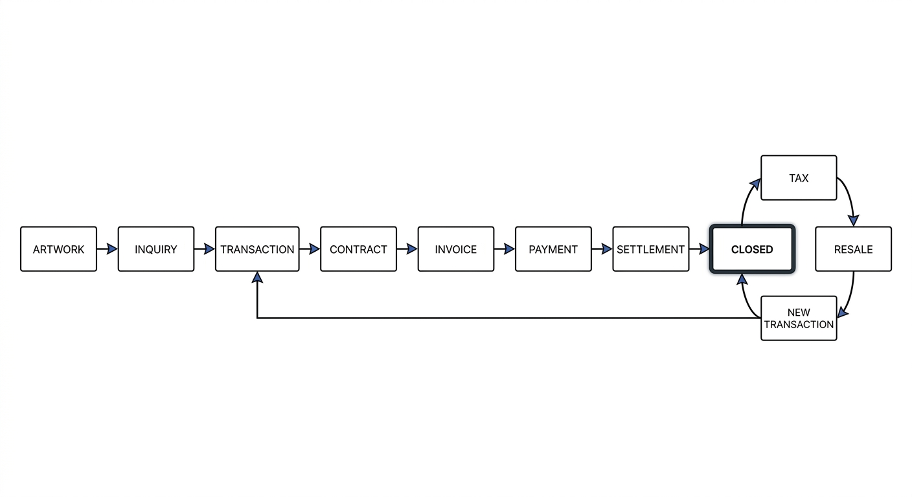
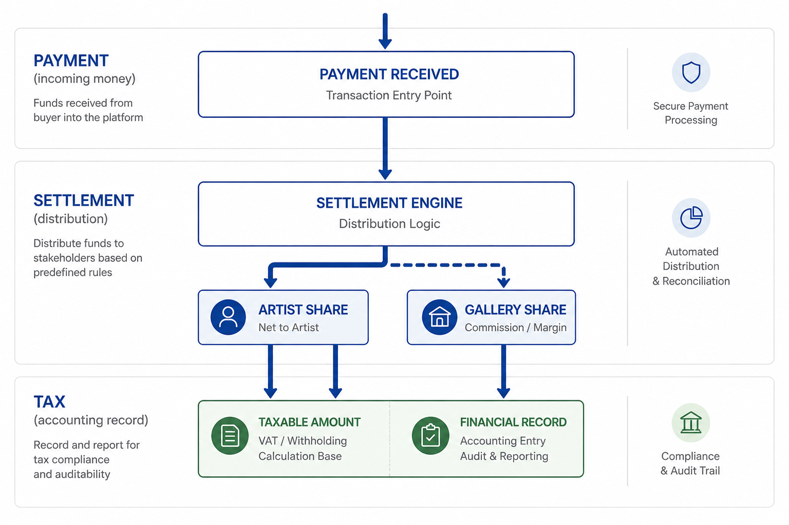
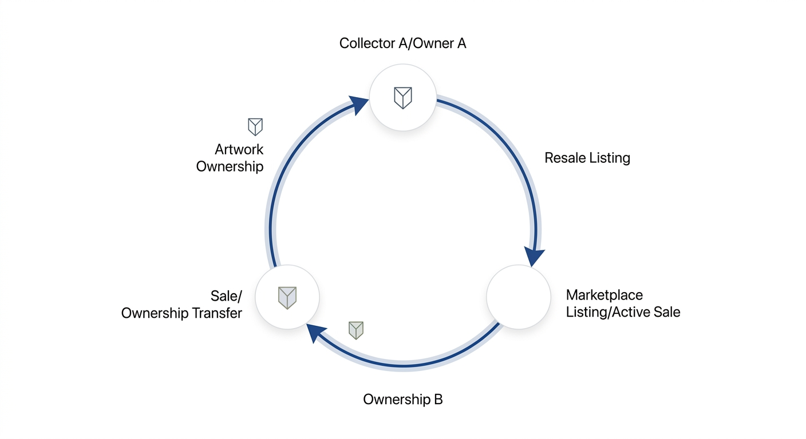

# AXVELA OS — 기준 아키텍처

이 문서는 AXVELA Gallery OS의 **공식 시스템 아키텍처 기준**입니다.
3개의 시각적 다이어그램과 그것이 구현된 코드 위치, 그리고 위반 시
무너지는 manifesto rule을 한 자리에서 추적합니다.

코드 변경 시 이 문서의 매핑이 여전히 유효한지 반드시 확인하세요.
어긋나면 코드 또는 다이어그램 중 하나가 잘못된 것입니다.

> **STEP 탐색 / 상태 / 중복 방지**: 본 ARCHITECTURE.md는 모든 STEP의 *cumulative timeline*을 담지만, 빠른 navigation / category 분류 / 다음 STEP 결정 / "이미 구현됐는가?" 검증은 **`STEP_INDEX.md`**를 우선 참조하세요. STEP_INDEX는 본 timeline의 *categorized index + Do Not Duplicate guard* 역할입니다 (STEP DOC-1, 2026-05-07 도입).

---

## Diagram 1 — Transaction Flow (전체 lifecycle)



작품 한 점이 시스템에 진입한 순간부터 재판매로 다시 시장에 돌아오는 시점까지의
전체 lifecycle. **모든 데이터 흐름은 ARTWORK에서 시작**합니다 (rule_1).

### 단계별 코드 매핑

| 단계 | 데이터 타입 | 구현 위치 | 트리거 |
|---|---|---|---|
| ARTWORK | `Artwork` | `src/types/artwork.ts` · `MOCK_ARTWORKS` | 시드 또는 `createArtwork` |
| INQUIRY | `Inquiry` | `src/types/inquiry.ts` | READY→INQUIRY 전환 시 자동 생성 |
| TRANSACTION | `Transaction` | `src/types/transaction.ts` | INQUIRY→DEAL 전환 시 자동 생성 |
| CONTRACT | `Contract` (REVIEW→APPROVED→LOCKED) | `src/types/contract.ts` | `createContract` (수동) |
| INVOICE | `Invoice` (DRAFT→SENT→PAID) | `src/types/invoice.ts` | INQUIRY→DEAL cascade에서 DRAFT 자동 생성 |
| PAYMENT | `Payment` | `src/types/payment.ts` | `registerPayment` → DEAL→PAID cascade |
| SETTLEMENT | `Settlement` | `src/types/settlement.ts` | `createSettlement` 또는 결제 후 자동 |
| CLOSED | `Artwork.state = "CLOSED"` | `src/lib/state-machine.ts` | PAID→CLOSED 전환 (**Owner 권한**) |
| TAX | `TaxRecord` | `src/types/tax.ts` | `createTaxRecord` |
| RESALE | (BROKERED 상태) | — | `startResale` (rule_13) |
| NEW TRANSACTION | `Transaction { isResale: true }` | `src/types/transaction.ts` | CLOSED→BROKERED cascade |
| (TRANSACTION으로 회귀) | 새 tx로 lifecycle 반복 | — | 위계 재진입 |

### 상태 머신 핵심 위치

`src/lib/state-machine.ts` `TRANSITIONS` 배열이 다이어그램의 화살표 정의:

```
DRAFT → READY → INQUIRY → DEAL → PAID → CLOSED → BROKERED → INQUIRY (회귀)
```

7개의 단방향 전환 정의. CLOSED→BROKERED 전환만 새 Transaction을 생성하는 cascade를 가집니다.

### 핵심 manifesto rule

- **rule_1** (artwork-first): 모든 도메인이 `artworkId`를 보유 — `Inquiry`, `Transaction`, `Payment`, `Settlement`, `TaxRecord`, `Contract`, `Logistics` 모두 검증
- **rule_2** (flow system): 기능이 아닌 흐름. 위 표의 단계는 모두 다음 단계로 cascade되거나 명시적 사용자 액션으로 연결됨
- **rule_6** (state machine): `getTransition()` 단일 진입점. 자유 전환 금지
- **rule_11** (transaction core): Document/Money 객체는 모두 `transactionId` 보유 (CONTRACT/INVOICE/PAYMENT/SETTLEMENT/TAX)

### 검증 시나리오

art_005를 PAID 상태에서 클릭 → "거래 종료" → CLOSED → "재판매 등록" → BROKERED →
새 Transaction 생성 (`isResale: true`, `previousOwner: "박기훈"`).
다이어그램의 RESALE → NEW TRANSACTION → TRANSACTION 회귀 화살표와 동일.

---

## Diagram 2 — Money Flow Separation (rule_3 핵심)



**Payment / Settlement / Tax는 절대 통합 금지**. 각각 독립된:
1. 데이터 구조 (type 정의 + store slice)
2. UI 컴포넌트 (Summary + DetailDrawer)
3. 권한 (RBAC matrix 별도 키)
4. Lifecycle (status enum 별도)

### 3-레이어 분리 검증 매트릭스

| 항목 | PAYMENT (incoming) | SETTLEMENT (distribution) | TAX (accounting) |
|---|---|---|---|
| **타입 파일** | `src/types/payment.ts` | `src/types/settlement.ts` | `src/types/tax.ts` |
| **고유 필드** | `amount`, `method`, `paidAt`, `memo` | `totalAmount`, `artistShare`, `galleryShare`, `platformFee`, `settledAt` | `taxableAmount`, `vatAmount`, `withholdingAmount`, `taxType`, `issuedAt` |
| **Lifecycle enum** | `PaymentStatus` | `SettlementStatus` | `TaxRecordStatus` |
| **Store slice** | `payments: Record<string, Payment[]>` | `settlements: Record<string, Settlement[]>` | `taxRecords: Record<string, TaxRecord[]>` |
| **Summary 컴포넌트** | (인라인 — Transaction 카드) | `src/components/settlement/SettlementSummary.tsx` | `src/components/tax/TaxSummary.tsx` |
| **Drawer 컴포넌트** | `src/components/payment/PaymentRegisterDrawer.tsx` | `src/components/settlement/SettlementDetailDrawer.tsx` | `src/components/tax/TaxDetailDrawer.tsx` |
| **RBAC permission** | `payment.register` (MANAGER) | `settlement.complete` (**OWNER**) | `tax.issue` (**OWNER**) |
| **Cascade 규칙** | Invoice를 PAID로 이동 + Transaction을 PAID로 이동 + Artwork DEAL→PAID 전환 | (자식: TaxRecord 참조 가능) | (영구 기록 — issued 후 변경 불가) |

### Cross-layer 참조 정책

도메인 간 **포린 키 참조는 허용**, **필드 통합은 금지**:

```ts
// ✅ 허용 — 네비게이션용 ID 참조
TaxRecord.settlementId: string
Payment.invoiceId: string

// ❌ 금지 — 다른 레이어의 필드를 자신의 필드로 흡수
// Settlement 안에 vatAmount 필드를 두면 Tax와 통합됨 → rule_3 위반
```

UI 레벨 참조도 동일한 원칙: TaxDetailDrawer가 "Settlement X에 연결됨" 표시는 OK,
Settlement의 status를 Tax의 액션으로 변경하는 것은 금지.

### 핵심 manifesto rule

- **rule_3** (money flow separation): 위 3-레이어가 절대 합쳐지지 않음
- **rule_7** (RBAC): Payment(MANAGER) < Settlement(OWNER) < Tax(OWNER) 권한 차등
- **rule_12** (settlement structure): `netToArtist = gross − commission − expenses` 계산식

### Diagram 2의 시각적 요소 → 코드 매핑

| 다이어그램 요소 | 코드 위치 |
|---|---|
| "PAYMENT RECEIVED — Transaction Entry Point" | `registerPayment` 액션 |
| "SETTLEMENT ENGINE — Distribution Logic" | `completeSettlement` 액션 |
| "ARTIST SHARE / GALLERY SHARE" | `Settlement.artistShare`, `Settlement.galleryShare` 필드 |
| "TAXABLE AMOUNT — VAT / Withholding" | `TaxRecord.taxableAmount`, `vatAmount`, `withholdingAmount` |
| "FINANCIAL RECORD — Audit & Reporting" | `TaxRecord.status === ISSUED` (영구 보존) |
| "Secure Payment Processing" 아이콘 | (UI 표현 — RBAC `payment.register`로 게이트) |
| "Automated Distribution & Reconciliation" | `Settlement.platformFee` + auto-cascade |
| "Compliance & Audit Trail" | Living Timeline + `actorRole` 기록 (rule_8) |

---

## Diagram 3 — Resale Loop (rule_13 핵심 비즈니스 구조)



CLOSED 이후 작품이 다시 시장으로 돌아오는 순환 구조. 핵심 원칙:
- 기존 Transaction은 **immutable** — 절대 수정 안 됨 (rule_4)
- 새 Transaction을 **생성**하는 방식으로만 처리
- 소유권은 `previousOwner` 필드로 추적

### 다이어그램 노드 → 코드 매핑

| 다이어그램 노드 | 코드 표현 |
|---|---|
| **Collector A / Owner A** (Artwork Ownership) | 직전 Transaction의 `buyerName` (이번 resale의 `previousOwner`) |
| **Resale Listing** | `artwork.state === "BROKERED"` |
| **Marketplace Listing / Active Sale** | resale Transaction의 `status === "NEGOTIATING"` |
| **Sale / Ownership Transfer** | resale tx 진행 → 다시 PAID → CLOSED |
| **Ownership B** | resale tx의 새 `buyerName` (다음 resale의 `previousOwner`로 승계) |

### 핵심 액션

`src/store/useArtworkStore.ts`:

```ts
startResale(artworkId) {
  // 1. artwork.state === CLOSED 검증
  // 2. transitionState(artworkId, "BROKERED") 위임
  //    → CLOSED→BROKERED cascade가 새 Transaction + auto-Inquiry 생성
}
// createResaleTransaction(artworkId): @deprecated alias — startResale 호출
```

`transitionState`의 `isClosedToBrokered` 분기에서 cascade 처리:

```ts
// 1. 기존 Transaction은 immutable — 새 Transaction을 prepend
const resaleTx: Transaction = {
  id: genId("tx"),
  artworkId,
  isResale: true,                    // rule_13 식별자
  previousTransactionId: priorTx.id, // 이전 거래 연결
  previousOwner: priorTx.buyerName,  // 이전 소유자 승계
  resaleCommissionRate: 0.15,        // v1 hardcoded
  status: "NEGOTIATING",
  buyerName: "",                     // 신규 buyer 미지정
  inquiryId: resaleInquiry.id,       // 자동 inquiry로 연결
  // ...
};

// 2. RESALE Inquiry 자동 생성 — 신규 buyer 응대 대기
const resaleInquiry: Inquiry = {
  id: genId("inq"),
  artworkId,
  collectorName: "",  // buyer 식별 시 채워짐
  inquiryType: "RESALE",
  status: "OPEN",
  // ...
};

// 3. Timeline 이벤트 3건 emit
//    - "Resale 시작"           (STATE_CHANGE)
//    - "New Transaction 생성"  (TRANSACTION)
//    - "Ownership 전환 준비"   (INQUIRY)
```

### 순환성 — 다이어그램의 핵심 통찰

다이어그램은 **순환**을 그립니다 (Collector A → ... → Ownership B → 다시 Collector A).
코드도 순환을 지원: Owner B가 미래에 또 다시 resale을 시도하면 그 시점의
`previousOwner`는 B가 됨. **재판매 횟수 제한 없음**.

`transactions[artworkId]` 배열은 시간 역순으로 누적:
```
[resaleTx_3, resaleTx_2, resaleTx_1, originalTx]
```

각 resale tx의 `previousTransactionId`는 직전 tx를 가리킵니다.
**과거는 모두 보존**되며 STEP 14의 `TransactionHistory` 섹션에서 시각화됨.

### 핵심 manifesto rule

- **rule_4** (document trust layer): 기존 Transaction immutable. resale은 *새 객체* 생성으로만
- **rule_13** (resale loop): `previousOwner` + commission 구조 의무
- **rule_15** (interaction): UI는 추가 버튼 없이 기존 state machine의 "재판매 등록" 레이블 자동 표시

### Diagram 3의 시각적 요소 → 코드 매핑

| 다이어그램 요소 | 코드 위치 |
|---|---|
| 원형 화살표 (Resale Listing) | `transitionState`의 CLOSED→BROKERED 분기 |
| 두 개의 작품 아이콘 (소유권 이동) | `Transaction.previousOwner` (옛 소유자) + `Transaction.buyerName` (새 소유자) |
| 원호 위 "Artwork Ownership" 라벨 | `artwork.state === "CLOSED"` 직후 시점 |
| 시각적 분리 (3개 노드) | UI에서 `TransactionHistory` 섹션 + `ResalePill` badge |

---

## AI Layer (rule_18) — STEP 16 구현 영역

다이어그램 1~3에 직접 등장하지 않지만 manifesto가 요구하는 영역. 핵심 구조:

```
Artwork (rule_1)
  ├── CurationNote v1, v2, ... (rule_18 (a)) — Artwork 직접 종속
  │     └── DRAFT → APPROVED → LOCKED → (createCurationVersion → DRAFT v(n+1))
  │
  └── Inquiry (when state >= INQUIRY)
        ├── responseDraft + responseStatus (rule_18 (d)) — Inquiry inline 필드
        │     └── undefined → DRAFT → SENT (immutable)
        └── (기존 inquiry.status: OPEN → RESPONDED cascade)
```

### rule_18의 4개 능력 매핑

| 능력 | 구현 위치 | 상태 |
|---|---|---|
| (a) 큐레이션 생성 | `generateCurationDraftContent` + `CurationNote` 도메인 | ✅ STEP 16 |
| (b) 시장 분석 | `MarketSignal` + Internal + ExternalAuctionProvider (auction comparable + marketplace listing + FX 변환) | ✅ STEP 29 — internal + external 결합 |
| (c) 가격 제안 | `generatePriceSuggestion` + `PriceSuggestion` 도메인 + ArtworkFormDrawer 인라인 panel | ✅ STEP 18 |
| (d) 거래 흐름 응대 | `generateInquiryResponseDraft` + Inquiry 응답 필드 | ✅ STEP 16 |

### Curation lifecycle (rule_5 AI-Human Loop)

```
createCurationNote (STAFF) — AI 초안 생성, actor: "AXVELA AI"
  → updateCurationNote / regenerateCurationDraft (STAFF) — DRAFT 편집
  → approveCurationNote (MANAGER) — DRAFT → APPROVED, 편집 잠김
  → lockCurationNote (MANAGER) — APPROVED → LOCKED, immutable
  → createCurationVersion (MANAGER) — LOCKED → 새 DRAFT v(n+1), 이전 보존
```

Contract와의 의도적 차이:
- 3-stage (vs Contract 4-stage) — REVIEW 단계 없음, 검토자 분리 불필요
- LOCK 권한 MANAGER (vs Contract.lock OWNER) — 법적 문서가 아니므로 차등
- Artwork 직접 종속 (vs Contract `transactionId`) — Curation은 거래 이전 단계에 존재 가능

### Inquiry response lifecycle (rule_5, simplified)

```
generateInquiryResponse (STAFF) — AI 초안, responseStatus: undefined → DRAFT
  → (인간 편집: drawer 내부 state, store 미저장)
  → sendInquiryResponse (STAFF) — DRAFT → SENT, immutable
                                  Inquiry.status: OPEN → RESPONDED cascade
```

Version chain 없음 — 응답은 단일 텍스트, 재응대 필요 시 새 Inquiry로 처리.

### 핵심 manifesto rule

- **rule_4** (document trust): CurationNote LOCK 후 immutable, version chain. Inquiry 응답 SENT 후 immutable
- **rule_5** (AI-Human loop): 4-phase 모두 timeline에 actor 차등으로 가시화
- **rule_18** (AI role): (a) + (d) 구현, (b) + (c) 미구현

### AI Layer의 시각적 요소 → 코드 매핑

| 의미 단위 | 코드 위치 |
|---|---|
| "AI 큐레이션 초안" supporting button | `DetailPanel.SUPPORTING_ACTIONS.DRAFT.secondary` + `handleSecondary` |
| "AI 응대 초안" supporting button | `DetailPanel.SUPPORTING_ACTIONS.INQUIRY.secondary` + `handleSecondary` |
| AI 생성 timeline 이벤트 | `actor: "AXVELA AI"` (no `actorRole`) |
| 인간 승인/LOCK/발송 timeline 이벤트 | `actor: actorLabel(role)` + `actorRole: state.currentRole` |
| Curation 카드 in DetailPanel | `<CurationSummary>` — CurationNote 존재 시에만 렌더 |
| Inquiry 응답 status indicator | `InquirySummary` 카드 하단 1줄 (DRAFT/SENT) |

---

## 전체 정합성 매트릭스

각 manifesto rule이 어느 다이어그램에서 시각화되고 어느 코드 파일에서 강제되는지:

| Rule | 핵심 의미 | 시각화된 다이어그램 | 강제되는 코드 |
|---|---|---|---|
| rule_1 | Artwork-first | 다이어그램 1 (시작 노드) | 모든 type의 `artworkId` 필수 필드 |
| rule_2 | Flow system | 다이어그램 1 (선형 흐름) | `state-machine.ts` `TRANSITIONS` |
| rule_3 | Money flow 분리 | 다이어그램 2 (3개 box 분리) | 3개 type/슬라이스/UI/permission 분리 |
| rule_4 | Document trust | (간접) | Contract LOCK, Invoice versioning, immutable past tx + STEP 25 audit export (JSON/CSV/PDF — rule_4 종착점) |
| rule_5 | AI-Human loop | (간접) | `AXVELA AI가 생성한 템플릿입니다` 패턴 |
| rule_6 | State machine | 다이어그램 1 (화살표) | `getTransition()` 단일 진입점 |
| rule_7 | RBAC | (간접 — 다이어그램 2 권한 차등 시사) | `ACTION_MIN_ROLE` matrix + STEP 20 audit log actor type pill |
| rule_8 | Timeline | (간접) | `TimelineEvent` + `actorRole` + STEP 20 audit log (분류·필터·강조 lens) + **STEP 21 navigation 완성 — 카드 → 9개 도메인 drawer 직접 라우팅** |
| rule_9 | Work queue | (간접) | Sidebar Pending Approvals |
| rule_10 | No dashboard | (간접) | Home = artwork list, no dashboard. Sidebar 4 항목 (작품 / 보고서 / 고객) 활성 — Customer는 STEP 42에서 1급 type으로 승격되어 view 진입 |
| rule_11 | Transaction core | 다이어그램 1 (TRANSACTION 노드 중심) | 모든 Document/Money에 `transactionId` |
| rule_12 | Settlement structure | 다이어그램 2 (Artist + Gallery share) | `Settlement.artistShare` + `galleryShare` 필드 |
| rule_13 | Resale loop | 다이어그램 3 (전체) | `createResaleTransaction` + `Transaction.isResale/previousOwner` |
| rule_14 | 3-column layout | (간접) | `Sidebar` / `ArtworkGrid` / `DetailPanel` |
| rule_15 | Max 3 buttons | (간접) | 모든 카드 secondary+primary 한정 |
| rule_16 | Design tone | (간접) | Tailwind tokens + minimal shadow |
| rule_17 | Drawer/Modal/Overlay only | (간접) | 모든 detail UI는 layered |
| rule_18 | AI role | (간접 — 큐레이션 + 응대 + 가격 제안 + 시장 분석 흐름) | `curationNotes` 슬라이스 + `generateCurationDraftContent` + `generateInquiryResponseDraft` (a + d) + STEP 18 PriceSuggestion (c) + **STEP 45 `generateMarketAnalysis()` deterministic helper + 6-section MarketAnalysisDrawer (b 본격화)** |
| rule_19 | Market data | Internal (4-kind) + ExternalAuctionProvider (auction + listing + FX + TTL cache + failure isolation) | ✅ STEP 29 — internal + external 활성. 향후 실 API 연동 시 `buildSignalsFor()` 교체만 |
| rule_20 | FX | `FXRateProvider` system + `MockFXRateProvider` + 3-tier fallback (provider → static → null) + `createFXSnapshot` helper + Invoice lock 시점 자동 capture (sendInvoice) + invoice.fxSnapshot 영속 보관 (KRW 제외) | ✅ STEP 31+32 — Provider system + audit snapshot + Invoice lock wiring 완성 |
| rule_21 | Logistics | (간접) | Logistics + ConditionReport 도메인 |

### 미구현 영역

위 매트릭스에서 명시된 것: **rule_18 일부 (b 시장 분석 + c 가격 제안)**, **rule_19 (market data)**.
다이어그램에는 직접 등장하지 않지만 manifesto가 요구하는 영역. STEP 17+ 후보.

---

## 사용 지침

### 새 STEP 시작 전

1. 이 문서를 먼저 읽기
2. 변경하려는 코드가 어느 다이어그램의 어느 노드에 해당하는지 확인
3. 변경이 다이어그램 정합성을 깨는지 검토 — 깬다면 STEP 진행 전 다이어그램 갱신 필요

### Money Flow 작업 시 (rule_3 sensitive)

다음 중 하나라도 시도되면 즉시 멈추고 검토:
- Settlement 타입에 tax 관련 필드 추가
- Payment 타입에 settlement 분배 필드 추가
- 한 액션이 두 레이어를 동시에 수정 (cascade는 OK, **same-action mutation은 금지**)
- 한 컴포넌트가 두 레이어의 액션을 모두 호출

### Resale 작업 시

다음 중 하나라도 발생하면 rule_13 위반:
- 기존 Transaction의 필드를 수정 (resale 등록 시 priorTx에 어떤 변경도 가하면 안 됨)
- `previousOwner` 또는 `previousTransactionId`를 누락한 채 새 tx 생성
- resale tx에 `isResale: false`로 마킹

---

## 변경 이력

- 2026-05-04 — STEP 14 종료 시점에 작성. 14 STEP 누적 시스템과 3개 기준 다이어그램의 정합성 검증 완료.
- 2026-05-04 — STEP 13 보강 완료. `startResale`을 정식 액션명으로 채택 (`createResaleTransaction`은 deprecated alias로 유지). RESALE inquiry 자동 생성 추가, timeline 이벤트 3건으로 확장 ("Resale 시작" + "New Transaction 생성" + "Ownership 전환 준비"). state-machine primaryLabel "Resale 시작"으로 통일. art_007 시드 데이터 정합성 갱신.
- 2026-05-04 — STEP 13.5 — Resale Inquiry ↔ Transaction sync layer 추가. `Inquiry.transactionId` optional 양방향 참조 도입. `updateBuyer(transactionId, buyer)` 신규 액션. `updateTransaction`/`updateInquiry`에 buyer-cascade 추가 (active tx만 동기화 — historical은 rule_4 immutability 보호). 기존 5쌍의 inquiry-tx에 reverse pointer 시드 추가. UI 변경 0줄.
- 2026-05-04 — STEP 14 — Historical Transaction 읽기 전용 가드 완료. `transaction-helpers.ts`에 `isActiveTransaction` / `isHistoricalTransaction` 헬퍼 추가 (단일 정의 출처). `updateTransaction` / `updateBuyer` / `updatePrice` 모두 historical guard 적용 (silent no-op, timeline emit 없음). `transitionState`는 cascade가 새 tx만 prepend하므로 historical tx는 자동 안전 (명시적 코멘트 추가). TransactionDetailDrawer에 `readOnly` prop 도입 — historical tx 열기 시 모든 input disabled + 상단 "Historical Transaction · 읽기 전용" 배너 + 저장 버튼 숨김. 3-Column / 디자인 시스템 무변경.
- 2026-05-04 — STEP 15 — Logistics / ConditionReport immutability 완료. `isLogisticsLocked(status)` helper 도입 — DELIVERED + CONDITION_CHECKED을 lock 조건으로 단일 정의. `updateLogistics` / `updateLogisticsStatus` 모두 lock guard (단, `createConditionReport`의 AFTER_DELIVERY → CONDITION_CHECKED inline cascade는 set() 직접 호출로 의도적 우회). `updateConditionReport`는 deprecated silent no-op으로 전환 — 기존 호출자 호환만 유지. `createConditionReportCorrection(originalReportId, input)` 신규 액션 — 원본 리포트 보존하고 `correctsReportId` 체인으로 새 리포트 발행, "Condition Report 수정본 생성" timeline 이벤트 emit. `ConditionReport.correctsReportId?` optional 필드 추가. UI: LogisticsDetailDrawer + ConditionReportDrawer 모두 read-only 모드 + lock 배너 + 입력 disabled. ConditionReportDrawer는 read-only → 수정본 작성 → correction 생성 3-mode footer로 전환. Money Flow / Contract / Tax 코드 변경 0줄.
- 2026-05-04 — STEP 16 — AI Layer (rule_18) 부분 구현 완료. (a) 큐레이션 생성 + (d) 거래 흐름 응대 생성 2개 모듈. 신규 도메인 `CurationNote` (Artwork 직접 종속, rule_1) — DRAFT → APPROVED → LOCKED 3-stage state machine + version chain. `Inquiry`에 응답 필드 4개 inline 추가 (`responseDraft / responseStatus / responseGeneratedAt / respondedAt`) — DRAFT/SENT 2-state, version chain 없음. 신규 라이브러리 `generateCurationDraftContent` + `generateInquiryResponseDraft` (결정론적 템플릿, `generateContractDraftContent` 패턴 미러). 신규 RBAC permission 7개 (`curation.create/update/approve/lock/create_version` + `inquiry.generate_response/send_response`) — Curation LOCK은 MANAGER (Contract LOCK OWNER와 차등 — 법적 문서 아님). 신규 컴포넌트 3개 (`CurationDraftDrawer` 3-mode + `CurationSummary` + `InquiryResponseDrawer` 2-mode), 모두 auto-bootstrap (open 시 즉시 AI 생성). `DetailPanel`의 두 placeholder secondary 버튼 ("AI 큐레이션 초안" DRAFT, "AI 응대 초안" INQUIRY)에 onClick 연결 + 다른 state는 `disabled`로 placeholder임을 시각적으로 분리. art_001 (READY)에 LOCKED CurationNote v1 시드 + timeline 3건 (AI 생성 → 인간 승인 → LOCK 라이프사이클 데모). Money Flow / Contract / Tax / Logistics / ConditionReport 코드 변경 0줄. Route / 54.1 kB (+5.7 kB vs STEP 15 baseline 48.4 kB).
- 2026-05-04 — STEP 17 — Disabled state visual polish. Pure visual polish — 도메인·핸들러·Drawer/Modal 신규 0, Money Flow 코드 0줄 변경. 두 가지 핵심: (1) `Button.tsx`의 hover/active를 `enabled:` Tailwind modifier로 게이트 — disabled 상태에서 더 이상 색이 변하지 않음 (이전: `disabled:opacity-40`만 있고 hover는 그대로 발화). (2) `<ButtonHint>` 신규 primitive (`src/components/ui/ButtonHint.tsx`) — 4개 tone (`permission` / `future` / `data_guard` / `ai`) × 2 align (`below` / `inline`)으로 비활성 사유와 AI affordance 안내의 단일 출처 확립. 라벨 상수 4개 export (`FUTURE_LABEL / FUTURE_LATER_LABEL / REDUNDANT_LABEL / AI_DRAFT_AFFORDANCE`). 11개 사이트의 인라인 `<p>` / `<span>` permission hint를 모두 ButtonHint로 통합 (Settlement / Tax / Contract / Curation / Inquiry / DetailPanel). DetailPanel의 `SUPPORTING_ACTIONS` 데이터 모델을 `SupportingActionMeta` 객체로 확장 (`label / wired / isAi / futureHint`) — 미구현 placeholder마다 구체적 안내 ("준비 중" / "다른 카드에서 진행" / "작품 편집에서 변경" 등) 부착. INQUIRY state 데이터 가드 (`inquiryActionableTarget`) 추가 — actionable inquiry 부재 시 disabled + "응대 가능한 문의 없음" hint (data_guard tone). AI affordance는 DetailPanel DRAFT/INQUIRY secondary 버튼 활성 상태에도 italic "AI 초안 — 인간 검토 필요" annotation 노출 — Drawer 진입 전부터 rule_5 신호 명시. rule_7의 "권한 부족 vs 데이터 가드 시각적 구분" 요구를 처음으로 톤 분리(`permission` vs `data_guard`)로 실현. Route / 54.5 kB (+0.4 kB vs STEP 16 baseline 54.1 kB).
- 2026-05-04 — STEP 20 — Audit Log Panel (rule_7 + rule_8 follow-through). 기존 `TimelineEvent` 슬라이스를 *0줄 변경*으로 재사용. 신규 모듈 `lib/audit-helpers.ts` — 순수 분류 함수 (`getAuditEventsForArtwork`, `classifyAuditEvent`, `filterAuditEvents`)로 (kind / title / actor / detail) 조합으로부터 3-axis taxonomy 유추: `AuditDomain` (AI / DOCUMENT / MONEY / LOGISTICS / INQUIRY / TRANSACTION / STATE / NOTE) × `AuditActorType` (AI / SYSTEM / STAFF / MANAGER / OWNER) × `AuditEmphasis` (LOCK / APPROVED / CORRECTION / PAYMENT / SETTLEMENT / TAX_ISSUED / null). 신규 컴포넌트 `AuditLogDrawer` — drawer with 2축 filter chip row (도메인 × 작성자) + classified event card list. 카드는 domain badge + version pill (체인 보유 시) + correction pill + actor type pill + emphasis icon (Lock/Check/Revision/Money) + chain hint pill ("v1 → v2" / "원본 → 수정본"). Settlement/Tax 이벤트가 store에서 `kind="TRANSACTION"`으로 emit되는 의도적 거친 분류를 audit-helpers의 title 키워드 매칭으로 MONEY 도메인으로 재분류. Living Timeline 섹션은 chronological feed로 그대로 유지하고 헤더에 "감사 로그 보기" 인라인 버튼 추가 — 두 view는 상호 보완 관계 (Living Timeline = navigation, Audit Log = 분류·신뢰 강조). RBAC `actorRole`이 처음으로 1급 시민으로 가시화 — 누가 어떤 액션을 했는지 actor type pill로 한눈에 확인. Money Flow / Contract / Curation / Logistics / ConditionReport / Inquiry / Transaction 도메인 코드 / 액션 / 컴포넌트 모두 0줄 변경. 3-Column 레이아웃 무변경, Drawer 1개만 추가. Route / 57.2 kB (+2.7 kB vs STEP 17 baseline 54.5 kB).
- 2026-05-04 — STEP 21 — Audit Log Navigation + Chain Detail (rule_8 "Timeline = Navigation" 완성). STEP 20의 read-only audit log을 navigation layer로 승격. **TimelineEvent에 optional 필드 2개 확장** — `relatedEntityType?: TimelineEntityType` + `relatedEntityId?: string` (`src/types/artwork.ts`). 기존 8개 필드(`id / artworkId / kind / title / detail / at / actor / actorRole`) 0줄 변경, optional 필드만 추가해 backward-compatible. `TimelineEntityType` union 10-kind (`contract / curation / inquiry / inquiry_response / invoice / logistics / condition_report / settlement / tax / transaction`) — 도메인 객체 1:1 매핑. Curation은 예외적으로 `relatedEntityId = artworkId` (CurationDraftDrawer가 latest note 자동 해석 — rule_1 직접 종속). 신규 모듈 `lib/audit-navigation.ts` (272 LOC) — STEP 21 초안의 heuristic resolver(529 LOC) 폐기 후 **field-based 직접 lookup**으로 재작성. 단일 진입점 `resolveAuditEventTarget(event, artworkId, store)` → `AuditNavigationInfo { target: AuditTarget | null; chain: AuditChainDetail | null }`. AuditTarget는 9-kind tagged union (`contract` / `curation` / `invoice` / `settlement` / `tax` / `logistics` / `conditionReport` / `inquiry` / `inquiryResponse`) — 각 kind는 store의 기존 open 액션 시그니처와 1:1. `transaction` 타입은 사용자 spec 미열거 → 의도적 EMPTY (Transaction은 container이며 contained Invoice/Contract/Settlement로 직접 진입이 audit context에서 더 유용). `default: never` exhaustiveness check로 신규 entity type 라우팅 누락을 컴파일 타임 검출. Chain detail (Contract / Curation / Invoice의 `parent*Id` chain, ConditionReport의 `correctsReportId` chain)은 도메인 객체에서 직접 lookup. `useArtworkStore.ts`의 39개 timeline emit 사이트 중 **37개에 ref 채움** — Curation 5 + Contract 6 + Settlement 3 + Tax 3 + Logistics 3 + ConditionReport 2 + Inquiry 3 + Inquiry Response 2 + Invoice 4 + Transaction 5 + STATE_CHANGE 2(의도적 미설정 — 상태 변경 자체에는 도메인 객체 없음). Payment 이벤트는 invoice 라우팅(Payment view drawer 부재 — PaymentRegisterDrawer는 등록용). Settlement → Tax / 결제 → Settlement 자동 생성 cascade 모두 새 객체로 ref. `mock-data.ts`의 5개 artwork × 25개 seed 이벤트에 ref 채움 (entity가 seed에 존재하는 이벤트만). `AuditLogDrawer`의 외부 인터페이스 0줄 변경 — STEP 20에서 이미 작성된 dispatchTarget / AuditEventCard role="button" / ChainDetailBlock / NavigationFooter 그대로 작동. 도메인 엔티티 구조 / audit-helpers.ts (STEP 20) / DetailPanel / Button·ButtonHint / 3-Column 레이아웃 / Money Flow / Logistics / RBAC 모두 0줄 변경. Route / 59.0 kB (+1.8 kB vs STEP 20 baseline 57.2 kB).
- 2026-05-04 — STEP 23 — Cross-artwork Audit View (rule_4 trust layer 시스템 전체 확장 · rule_7 RBAC 확장). STEP 20/21의 단일 작품 audit log을 보조해 Owner / Manager가 갤러리 전체 timeline 이벤트를 한 화면에서 보는 cross-artwork view를 추가. 두 view는 별개 진입점 — 단일 작품 view (DetailPanel "감사 로그 보기") + 전체 view (Sidebar "전체 감사 로그") 동시 운영. 신규 권한 `audit.view_global` (MANAGER min) 추가 — Staff 차단. 신규 store 슬라이스 `globalAuditRequest: GlobalAuditRequest = { kind: "closed" } | { kind: "open" }` + `openGlobalAudit` (RBAC 가드 silent no-op) + `closeGlobalAudit`. 신규 컴포넌트 `GlobalAuditDrawer` (408 LOC) — Drawer 기반 wider variant (`widthClass="w-[800px]"`) + 4-axis 칩 필터 (artwork / domain / actor / role) + 시간 역순 정렬된 통합 timeline + EmptyState + 통계 summary "{filtered}/{total}건 · {distinct}/{total}점". actor filter는 사용자 spec의 "AI / Human / System" 3-way로 단순화 (single-artwork view의 5-way `AuditActorFilter`와 별개), role filter는 `event.actorRole`을 별도 축으로 분리 — STAFF/MANAGER/OWNER. 카드 클릭 dispatch는 STEP 21과 동일한 9-kind switch이지만 `select(artworkId)` 단계가 추가 — DetailPanel 컨텍스트 자동 전환 (rule_1 Artwork-First 보장). **Permission triple-defense** — (1) Sidebar 진입점 `disabled={!canView}` + permissionHint title, (2) store action 자체 RBAC 가드, (3) drawer mount-time `useEffect`로 권한 부족 시 즉시 close. **AuditEventCard 추출** — STEP 21까지 AuditLogDrawer.tsx 내부 private이었던 `AuditEventCard` + `ChainDetailBlock` + `NavigationFooter` + 11개 visual primitive (DomainBadge / VersionPill / CorrectionPill / ActorPill / EmphasisIcon / Lock·Check·Revision·Money·Chain·Chevron Icon)를 신규 모듈 `src/components/audit/AuditEventCard.tsx` (411 LOC)로 분리. AuditLogDrawer + GlobalAuditDrawer 양쪽이 동일 카드 사용 — design system 일관성 보장. 카드에 optional `artworkLabel?: string` prop 추가 — 설정 시 카드 상단에 muted "작품명 · 작가" rib 표시 (cross-artwork view 전용), 미설정 시 STEP 20 형태 그대로 (단일 작품 view). `Drawer` 컴포넌트에 optional `widthClass` prop 추가 — 기본값 `w-[480px]`, GlobalAuditDrawer만 `w-[800px]` 전달, 모든 기존 호출자 무영향. Sidebar에 "감사" 섹션 신설 (승인 대기 위) — `AuditIcon` SVG + 권한 가드. `permissionHint("audit.view_global")` → "Manager 권한 필요" 자동 출력 (rbac.ts helper 그대로). TimelineEvent / `relatedEntityType` / `relatedEntityId` / 모든 도메인 entity 구조 / Money Flow / Contract / Invoice / Tax / Settlement / Logistics / Inquiry / Curation / Condition Report / mock-data / 3-Column 레이아웃 모두 0줄 변경. AuditLogDrawer 외부 인터페이스 무변경 (extracted 모듈 import만 갱신). Route / 60.8 kB (+1.8 kB vs STEP 21 baseline 59.0 kB).
- 2026-05-04 — STEP 18 — AXVELA AI Price Suggestion (rule_18 (c) AI Layer · rule_5 AI-Human Loop). ArtworkFormDrawer 안 가격 입력 필드 아래 인라인 패널 추가 — AXVELA AI가 가격 *범위*를 제안하고 사용자가 명시적으로 "Mid 적용"을 클릭해야 폼에 반영. **rule_19 Market Data는 여전히 미구현 — 의도적**. 외부 API 호출 / 외부 마켓 데이터 통합 0건. 신규 도메인 객체 `PriceSuggestion` (`src/types/price-suggestion.ts`, 90 LOC) — id / artworkId / suggestedLow / suggestedMid / suggestedHigh / currency / confidence(0~1) / rationale(string[]) / sourceRefs / createdAt / appliedAt. `PriceSuggestionSourceRef` 5-kind union (`current_price` / `transaction` / `payment` / `resale_commission` / `gallery_median`) — 각 suggestion이 어떤 내부 record를 근거로 했는지 traceable evidence. `confidenceLabel(c)` helper — 0.75↑ "높음", 0.5↑ "보통", 그 외 "낮음". 신규 deterministic helper `src/lib/axvela-price.ts` (200 LOC) — `generatePriceSuggestion(artwork, txs, payments, galleryMedian)` 결정성 보장 (같은 입력 → 같은 출력). 3-tier confidence (사용자 spec 정수치): paid transaction + payment 기록 0.82 / artwork 가격만 0.62 / 데이터 부족 (median fallback) 0.35. Range 비대칭 (low 0.85x, mid 1.0x, high 1.2x — 갤러리 협상 기준), 1,000원 단위 round. Resale 보정: `resaleCommissionRate`가 있으면 base를 `1/(1-rate)`로 확대. `computeGalleryMedianPriceKRW(artworks)` Tier 3 fallback용 helper (priceKRW>0인 작품 중앙값). Store 슬라이스 `priceSuggestions: Record<string, PriceSuggestion[]>` (artwork-keyed, latest-first) + 두 액션: `generatePriceSuggestionForArtwork(artworkId)` (RBAC 가드 silent no-op, suggestion record 추가, "AXVELA AI 가격 제안 생성" timeline 이벤트 emit, **artwork.priceKRW 무변경**) + `applyPriceSuggestion(artworkId, suggestionId)` (idempotent — 이미 적용된 suggestion이면 silent no-op, "AI 가격 제안 적용" timeline + appliedAt 마킹, **여전히 artwork.priceKRW 무변경 — form-side helper로서 동작**). 신규 RBAC permission 2개 — `price_suggestion.generate` + `price_suggestion.apply` 모두 STAFF 등급 (Curation/Inquiry response 패턴 일관). Permission 매트릭스 31 → 33. `ArtworkFormDrawer`에 `<PriceSuggestionPanel />` 인라인 마운트 (edit 모드만 — artwork이 store에 존재해야 generate 가능): "AXVELA AI 가격 제안" 버튼 + Generate 후 SuggestionCard (3-column grid Low/Mid/High, Mid highlighted) + 신뢰도 표시 ("82% · 높음" 형태) + "✓ 폼에 적용됨" 마커 + rationale list (bullet style) + "Mid 가격 적용 — {amount}" 버튼 + 항상 표시 disclaimer "외부 시장 데이터가 아닌 내부 거래 기록 기반 v1 제안입니다. 최종 가격은 갤러리 담당자가 결정합니다." UX 문구 사용자 spec 그대로 ("AI 초안 — 인간 검토 필요" italic / "최종 가격은 갤러리 담당자가 결정합니다" / "외부 시장 데이터 미사용 — 내부 거래 기록 기반 v1 제안"). 적용 흐름 명시: AI generate → 인간 검토 (SuggestionCard) → Mid 클릭 → 폼 priceRaw 갱신 → 인간 저장 (form submit) → 일반 updateArtwork() 흐름이 artwork.priceKRW commit. **rule_5 AI-Human Loop의 4-단계 명확화**. PriceSuggestion 전용 viewer drawer 부재 → timeline 이벤트는 ref 없이 emit (audit 카드에서 비-clickable, 의도적). TimelineEvent / Artwork / Transaction / Payment / 모든 도메인 entity 구조 / Money Flow / Contract / Invoice / Tax / Settlement / Logistics / Inquiry / Curation / Condition Report / Inquiry Response / mock-data / audit-helpers / audit-navigation / 3-Column 레이아웃 / 모든 기존 Drawer 모두 0줄 변경. ArtworkFormDrawer에만 panel + 컴포넌트 추가. Route / 62.9 kB (+2.1 kB vs STEP 23 baseline 60.8 kB).
- 2026-05-04 — STEP 19 — Internal Market Data Layer (rule_19 v1 · rule_18 (b) deterministic 토대). STEP 18 PriceSuggestion에 내부 transaction / payment / inquiry / resale 기록 기반 market signal 레이어 추가. **외부 API 호출 / 네트워크 요청 0줄** — `MarketDataProvider` interface + `ACTIVE_PROVIDERS` registry + `gatherMarketSignals` entry point만 열어두고 실제 외부 connector는 STEP 29 (External Auction Market Reference)로 분리. 신규 타입 모듈 `src/types/market-signal.ts` (130 LOC) — `MarketSignal` interface (id / kind / artworkId / valueKRW? / averageKRW? / volumeCount? / currency / source / freshness / sampleSize / weight / rationale) + `MarketSignalKind` 5-union (`artist_avg` / `artist_recent_sale` / `self_resale` / `inquiry_volume` / `external_reference` ← STEP 29 placeholder) + `MarketSignalSource` 2-union (`internal` / `external` 분기, external 필드는 타입 정의에만 존재 — fetch 호출 0) + `MarketDataInput` provider 입력 (artworkId / artistName / allArtworks / allTransactions / allPayments / allInquiries readonly views) + `MarketDataProvider` interface (`providerId` / `isExternal` / `fetchSignals(input): MarketSignal[]` — sync pure function 강제). 신규 라이브러리 `src/lib/internal-market-provider.ts` (175 LOC) — `InternalMarketDataProvider implements MarketDataProvider` (providerId="internal_v1", isExternal=false). 4종 신호 계산 — `computeArtistSignals` (같은 작가 KRW transactions 평균 + 가장 최근 거래 1건, sample ≥ 1 시 emit, weight 0.5~0.7) / `computeSelfResaleSignal` (본 작품 prior tx — sortBy createdAt 가장 오래된 것 = pre-resale, weight 0.85 가장 강한 신호) / `computeInquiryVolumeSignal` (수요 신호 — 가격 직접 영향 0, weight 0.3, confidence만 보강). KRW 거래만 신호 풀 포함 (USD/EUR 거래 v1 제외), determinism 보장 (Date.now() / random() 0줄 — id는 입력 hash 기반). 신규 라이브러리 `src/lib/market-data.ts` (50 LOC) — `ACTIVE_PROVIDERS: MarketDataProvider[]` (v1: internal 1개) + `gatherMarketSignals(input): MarketSignal[]` (모든 active provider iterate, try/catch defensive — STEP 29 external 도입 시 네트워크 실패가 internal 신호 차단하지 않도록) + `hasExternalProviders(): boolean` (UI marker용, v1 항상 false). `PriceSuggestionSourceRef` 6번째 kind `market_signal` 추가 (signalId / signalKind / provider / isExternal / sampleSize / summary) — STEP 18까지 5-kind였던 sourceRefs union 확장. `axvela-price.ts`의 `generatePriceSuggestion`에 `marketSignals: MarketSignal[] = []` 파라미터 추가 (default empty → backward compatible — 호출자가 신호 없이 호출해도 STEP 18 동작 그대로). 신호 통합 3단계: (1) **Audit trail** — 모든 신호를 sourceRefs `market_signal` kind로 누적 + rationale에 한 줄씩 추가 (2) **Base price blend** (KRW 통화일 때만) — self_resale 15% blend, artist_avg ≥2 sample 10% blend (1 sample 5%), artist_recent_sale은 audit only (avg와 중복 영향 방지) (3) **Confidence boost** — kind별 누적 (self_resale +0.05 / artist_avg ≥2 +0.05 / 1 sample +0.03 / artist_recent_sale +0.03 / inquiry_volume ≥3 +0.02), **0.95 cap** (사용자 spec — "확정" 표현 절대 금지). Disclaimer rationale 분기 — `hasExternal` 신호 존재 시 "내부 거래 기록 + 외부 reference 신호 결합 — 참고 가격 범위입니다", 그 외 STEP 18 그대로 "외부 시장 데이터 미사용 — 내부 거래 기록 기반 v1 제안" — v1에서는 항상 후자만 표시됨 (external 신호 emit 0). `useArtworkStore.ts` `generatePriceSuggestionForArtwork`에 `gatherMarketSignals` 호출 한 줄 추가 + helper 5번째 인자로 신호 전달. `state.payments` / `state.inquiries` 셀렉터 추가 (기존 슬라이스 그대로 사용 — 신규 store 슬라이스 0). Helper id / Date.now() 의존성 0 → 같은 store 상태에서 generate 두 번 시 suggestedLow/Mid/High/confidence **완전 동일** (id / createdAt만 다름 — rule_4 trust). `PriceSuggestion` / `priceSuggestions` slice / `price_suggestion.*` 권한 / `ArtworkFormDrawer` UI / TimelineEvent / mock-data / Money Flow / Contract / Invoice / Tax / Settlement / Logistics / Curation / Inquiry / Audit (STEP 20/21/23) / 3-Column 레이아웃 / 모든 기존 Drawer 0줄 변경. UI는 rationale 추가 라인이 SuggestionCard에 자동 노출 (panel 컴포넌트 무수정). 외부 라이브러리 / network / fetch / axios 0개 추가. Route / 64.3 kB (+1.4 kB vs STEP 18 baseline 62.9 kB).
- 2026-05-04 — STEP 25 — Audit Log Export (rule_4 trust layer 종착점). STEP 20~23에서 완성된 audit log을 외부 출력 가능하게 한 export layer. **JSON / CSV / PDF 3-format 클라이언트-only export** — 백엔드 추가 0건, 외부 API 호출 0건, 외부 라이브러리 추가 0개 (jsPDF / pdfmake / html2canvas 미사용). 신규 모듈 `src/lib/audit-export.ts` (320 LOC) — `ExportFormat` 3-union (`json` / `csv` / `pdf`) + `ExportScope` 2-union (`single_artwork` / `global`) + `ExportContext` (artworkById lookup + optional chainSummaryByEventId override) + 3개 export 함수 + 단일 진입점 dispatcher `exportAuditLog(format, classified, scope, ctx)` + filename builder (사용자 spec 그대로 — `axvela-audit-{artworkId|global}-{YYYYMMDD-HHMMSS}.{ext}`). JSON: pretty-print 2-space, `schema: "axvela.audit.v1"` versioning, raw TimelineEvent 모든 필드 (id / artworkId / kind / title / detail / at / actor / actorRole / relatedEntityType / relatedEntityId) + STEP 20 classification (domain / actorType / emphasis / version / isCorrection / chainHint) + chainSummary 한 줄 압축 + scope label + eventCount + note disclaimer 포함. CSV: RFC 4180 quote escape (`"`/`,`/`\r`/`\n` 처리, 이중 따옴표 escape) + UTF-8 BOM (`\uFEFF`) prepend → Excel for Windows 한글 깨짐 방지 + CRLF (`\r\n`) 라인 종결. 컬럼: `time / artworkId / artworkTitle / domain / actor / actorRole / title / detail / version / chain` (사용자 spec 명시). PDF: `window.open()` + 스타일된 HTML 리포트 + `window.print()` 자동 호출 — 외부 PDF 라이브러리 0개. 새 창의 `onload` 시점에 print 다이얼로그 자동 표시, 사용자가 "PDF로 저장" 선택 → 브라우저 native PDF 출력. HTML 리포트 구조: `@page A4` margin 18mm × 16mm + 헤더 (AXVELA Audit Report 제목 + scope label + 생성 timestamp + 이벤트 카운트) + 요약 라인 (총 이벤트 / 작품 수 (global only) / 도메인 분포) + 이벤트 테이블 (시각 / 이벤트 (제목 + detail) / 도메인 / 작성자 (role) / 버전 (chain)) + footer (italic disclaimer "내부 기록 기반 Audit Report입니다. 법적/외부 제출 시 참고용으로 사용 가능합니다." + 스냅샷 timestamp). HTML escape (`&` / `<` / `>` / `"` / `'`) 정상 적용. Pop-up blocker 차단 시 `window.alert` fallback. JSON / CSV는 표준 Blob + `URL.createObjectURL()` + `<a download>` programmatic click + setTimeout revoke (Safari 호환). 사용자 spec 금지 표현 ("공식 증명서" / "법적 효력 보장") 0건 사용 — disclaimer는 "내부 기록 기반 Audit Report입니다" / "법적/외부 제출 시 참고용으로 사용 가능합니다" 그대로. 신규 컴포넌트 `src/components/audit/AuditExportBar.tsx` (90 LOC) — 두 drawer 공유 export 진입점 UI. 헤더 ("감사 로그 내보내기" / italic subline "{count}건 · 내부 기록 기반 Audit Report") + 3개 인라인 버튼 (JSON / CSV / PDF) ghost variant size sm. 빈 결과 시 모든 버튼 disabled + 라벨 "내보낼 이벤트 없음" — 빈 export 의미 없음 시각화. RBAC 가드는 audit view 자체의 권한이 자연 차등 (Staff = 단일 작품 export only, Manager+ = global export 추가) — 신규 권한 추가 0개. `AuditLogDrawer` (single artwork): import + filter chip rows 다음에 `<AuditExportBar />` 마운트. exportScope (`single_artwork` with artworkLabel `${title} · ${artist.name}`) + exportCtx (artworkById 단일 entry) `useMemo`. `GlobalAuditDrawer` (cross-artwork): import + 4-axis filter rows 다음에 마운트. exportScope (`global`) + exportCtx (artworkById 전체 map) + filteredClassified (`{classified, artwork}[]` → `ClassifiedAuditEvent[]` 추출) `useMemo`. **Filtered 결과만 export** — 두 drawer 모두 적용된 필터 결과를 그대로 export. "보고 있는 것을 그대로 내보내기" 직관적 흐름. 데이터 보존: STEP 20 ClassifiedAuditEvent / STEP 21 navigation chain hint / STEP 23 cross-artwork artwork label 모두 export payload에 포함. TimelineEvent / MarketSignal / 도메인 entity 구조 / Money Flow / Contract / Invoice / Tax / Settlement / Logistics / Curation / Inquiry / Audit (STEP 20/21/23) / 3-Column 레이아웃 / 모든 store 슬라이스 / 모든 store 액션 / 권한 매트릭스 / mock-data / package.json 모두 0줄 변경. Backend / API route 추가 0건. Route / 67.7 kB (+3.4 kB vs STEP 19 baseline 64.3 kB).
- 2026-05-04 — STEP 27 — Persistence Layer (Local-first Adapter). 기존 in-memory Zustand store 위에 localStorage 기반 영속 layer를 adapter 패턴으로 추가. **도메인 로직 0줄 변경 · 백엔드 0건 · 외부 라이브러리 0개 추가 · UI 상태 미저장**. 신규 모듈 `src/lib/persistence.ts` (195 LOC) — `PersistenceAdapter` interface (`load(): PersistedState | null` / `save(state)` / `clear()` / `readonly adapterId`) + `LocalStorageAdapter` 구현체 (key="axvela.gallery.v1", JSON serialize/parse, try/catch 방어 — JSON parse 실패 / quota exceeded / private mode 모두 silent fallback) + `PersistedState` shape (`version: "v1"` + `savedAt` + 13개 도메인 슬라이스: artworks / timeline / inquiries / transactions / invoices / payments / settlements / taxRecords / contracts / curationNotes / logistics / conditionReports / priceSuggestions — 사용자 spec 그대로 + STEP 18 일관성) + `migrate()` hook (switch on `version` field — v1 validator + v0/v2 등 향후 case 추가 자리만 마련, 알 수 없는 version은 silent fallback → mock 재로드) + `validateV1()` (필수 키 15개 존재 확인, 내용 검증은 가벼움 — 자체 쓴 데이터 신뢰) + `isLocalStorageAvailable()` SSR/private mode 가드 (probe write/remove로 access 가능 여부 detect) + `getActiveAdapter()` singleton + `setActiveAdapter()` (test/multi-backend) + `extractPersistedState(snap): PersistedState` helper (UI 슬라이스 자동 제외 — 명시적으로 13개 도메인 키만 골라 담음). 모든 함수 throw 안 함 정책. 신규 컴포넌트 `src/components/PersistenceProvider.tsx` (80 LOC) — App root wrapper (page.tsx 최외곽). `useEffect` 안에서 mount 시 1회 `useArtworkStore.getState().hydrateFromStorage()` 호출 → `useArtworkStore.subscribe()`로 변경 감지 → 500ms debounce save → cleanup unsubscribe. `hydratedRef` 가드로 hydrate 직후 자체 patch에 의한 불필요 첫 save 차단. SSR-safe — 모든 작업이 `useEffect` 안. Store 액션 2개 신규: `hydrateFromStorage()` — adapter.load() 결과를 13개 슬라이스에 set, null이면 silent no-op (mock data 그대로 유지); `resetAllData()` — adapter.clear() + 모든 13개 도메인 슬라이스 mock 재로드 + 16개 UI 슬라이스 (selectedArtworkId/query/stateFilter/editor/transitionRequest/inquiry-tx-invoice-payment-settlement-tax-contract-logistics-conditionReport-curation-inquiryResponse-auditLog-globalAudit Request) closed/default 복원. 기존 도메인 액션 / 슬라이스 / 초기 상태 0줄 수정. `src/app/page.tsx` 최외곽에 `<PersistenceProvider>` wrap 추가 — Drawer mount 17개 그대로. `src/components/layout/Sidebar.tsx` 푸터에 `<ResetDataButton />` 추가 — RoleSwitcher 아래 작은 텍스트 링크 ("저장 데이터 초기화"), `window.confirm` 1회 ("저장된 모든 데이터를 초기화하고 데모 시드로 되돌립니다. 계속하시겠습니까?") + `resetAllData()` 호출. 사용자 spec "개발용으로만 숨김 or debug 영역" 준수 — 눈에 띄지만 강조 안 함 (text-[10.5px], text-ink-subtle). **role 미저장** — v1 의도적 결정. 세션마다 RoleSwitcher 초기 MANAGER 보장 (실험 환경에서 권한 차등 데모 일관성). UI / drawer / filter 슬라이스도 모두 미저장 — refresh 시 깨끗한 시작. **Audit (STEP 20/21/23/25) / Market Data (STEP 19) / Money Flow / Contract / Tax / Logistics / 모든 도메인 entity / 모든 store 액션 / RBAC matrix / mock-data / 3-Column 레이아웃 / 모든 Drawer 컴포넌트 0줄 변경**. zustand built-in `subscribe()` API만 사용 — `zustand/middleware/persist` 미사용 (사용자 spec "store 구조를 깨지 않고 adapter 방식으로 추가" 준수). 외부 라이브러리 npm 0개 추가. Route / 69.1 kB (+1.4 kB vs STEP 25 baseline 67.7 kB).
- 2026-05-04 — STEP 27.7 — Multi-tab Sync. STEP 27 LocalStorage 기반 Persistence Layer에 다중 탭 동기화 추가 — 같은 브라우저에서 AXVELA를 여러 탭으로 열었을 때 한 탭의 변경이 다른 탭에 자동 반영. **백엔드 0건 · 외부 라이브러리 0개 추가 · UI 추가 0개 · 도메인 액션 0줄 변경**. browser native `window.addEventListener("storage", ...)` API만 사용. `PersistedState`에 optional `sourceTabId?: string` 필드 추가 (legacy v1 데이터 backward-compatible — `validateV1` required 목록 무변경, 15개 그대로). `extractPersistedState(snap, sourceTabId?)` 시그니처 확장 — 2번째 arg optional, 기존 STEP 27 호출자 영향 0. `PersistenceProvider` 전면 재작성 (외부 인터페이스 무변경, 내부 로직 확장): mount 시 `tabIdRef = generateTabId()` 1회 생성 (`tab_${time36}_${rand36}`, 매 mount마다 새로 생성), `applyingExternalRef` ref + `applyExternal(callback)` 헬퍼 추가 (외부 source의 변경 적용 시 가드 set → callback 실행 → finally flag 해제 — Zustand subscribe는 `set()` 시점에 sync fire하므로 callback 반환 직후 flag 해제 안전), `lastSyncedAtRef` ref 추가 (자체 save / 외부 hydrate 시점의 savedAt 추적 — stale write 비교용), `storage` 이벤트 listener 등록 (3-branch: (A) `newValue===null` reset propagation → `applyExternal(resetAllData)` (B) JSON parse 시도, 실패 시 silent return — corrupt write 방어 (B-1) `parsed.sourceTabId === tabIdRef.current` self-write 방어, defensive (B-2) `parsed.savedAt <= lastSyncedAtRef.current` stale write 방어 — last-write-wins 정책 (B-3) `applyExternal(hydrateFromStorage)` — `adapter.load()` 재호출하여 migrate / validateV1 검증 거침, newValue 직접 set 안 함 → schema validation 우회 차단 + `lastSyncedAtRef` 갱신). subscribe 측에 `if (applyingExternalRef.current) return` 가드 추가 — hydrate / reset이 트리거하는 자체 subscribe 콜백을 save에서 skip → 무한 ping-pong 차단 (가장 핵심 방어). 자체 debounced save 시 `extractPersistedState(snap, tabIdRef.current)` + `lastSyncedAtRef.current = payload.savedAt` 갱신 (다른 탭의 stale 이벤트 방어). cleanup에서 storage listener `removeEventListener` + unsub + clearTimeout. **Self-write loop 3중 안전망**: (1) applyExternal 가드 — 핵심 (2) tabId 비교 — defensive (3) savedAt 비교 — last-write-wins. **Reset 양방향 sync**: 한 탭의 `resetAllData` → adapter.clear() → 다른 탭의 storage 이벤트 (`newValue===null`) 수신 → `resetAllData()` 호출 → mock 시드 동기 복구. resetAllData 내 adapter.clear() 재호출은 이미 비어 있어 무해, 자체 subscribe도 applyExternal 가드로 save skip. **Conflict 정책 v1: last-write-wins** — savedAt timestamp 비교만. 깊은 conflict resolution은 RemoteSyncAdapter 도입 시 검토. 사용자 spec "console.warn 정도만 허용" 준수 — 모든 sync는 silent. corrupt JSON 수신 시 catch silent (다음 valid save로 복구). **별도 UI 추가 0개** — 사용자에게는 자동 동기화처럼 보임. `LocalStorageAdapter` 본문 / 모든 store 도메인 액션 (~50개) / `hydrateFromStorage` / `resetAllData` / `migrate()` / `validateV1` / mock-data / 모든 도메인 entity / Money Flow / Contract / Tax / Logistics / Audit (STEP 20/21/23/25) / Market Data (STEP 19) / Curation / Inquiry / 3-Column 레이아웃 / Sidebar (reset 버튼 포함) / 모든 Drawer / RBAC matrix / `package.json` 모두 0줄 변경. Route / 69.4 kB (+0.3 kB vs STEP 27 baseline 69.1 kB).
- 2026-05-04 — STEP 29 — External Auction Market Reference (rule_18 (b) 시장 분석 / rule_19 Market Data 외부 connector 활성). STEP 19에서 마련한 `MarketDataProvider` 확장 hook의 첫 번째 외부 구현. **외부 라이브러리 0개 · 백엔드 0건 · 도메인/Money Flow/Audit/Store 구조 0줄 변경**. 신규 모듈 `src/lib/external-auction-provider.ts` (290 LOC) — `ExternalAuctionProvider implements MarketDataProvider` (`providerId="auction_v1"`, `isExternal=true`). 4가지 핵심 메커니즘: (1) **In-memory cache + TTL** — `Map<artistName, CacheEntry>` + 24h `cacheTTLMs`. cache hit 시 `rebindToArtwork`로 artworkId만 갱신, 같은 작가의 다른 작품에서도 재사용. (2) **FX 변환** — 정적 환율 테이블 (`FX_TO_KRW`: USD=1380, EUR=1480, JPY=9.2, GBP=1750) + `toKRW(amount, currency)` 헬퍼. 모든 외부 신호 KRW 정규화 emit. (3) **Failure 격리** — `failureRate` 옵션 (constructor, v1 default 0). 발화 시 throw → STEP 19의 `gatherMarketSignals` try/catch가 차단 → internal 신호만 emit → 사용자는 외부 신호만 빠진 정상 경험. (4) **Mock dataset** — `MOCK_AUCTION_COMPARABLES` 7건 (5명 작가: 김지은 2 / 박현우 1 / 이서연 1 / 최아름 2 / 한도윤 1, Sotheby's HK / Christie's HK / Phillips HK) + `MOCK_MARKETPLACE_LISTINGS` 2건 (이서연 + 박현우, Artsy). 정민호 / 윤세라 의도적 부재 → fallback 검증. 실 auction API 연동 시 `buildSignalsFor()` 메서드만 교체 (cache / FX / signal 빌드 로직 그대로 재사용). Signal emit 전략: auction comparable sales는 `artist_avg` (external) + `artist_recent_sale` (external) kind 사용 → STEP 19의 base price blend 로직이 외부 데이터에도 그대로 작동 (`axvela-price.ts` 0줄 변경). Marketplace listing은 `external_reference` kind (asking price ≠ sale price 명시 — rationale에 "낙찰가 아님" 부착). External signal weight 차등 — comparable ≥2 sample 0.75 / 1 sample 0.55 / recent sale 0.55 / listing 0.4. Determinism — signal id는 artistName / saleDate hash 기반 (Date.now() 의존 0). `slug()` 헬퍼는 한국어 작가명을 base36 hash로 압축 (한글 → ASCII id 안전). 변경 파일: `src/lib/market-data.ts` `ACTIVE_PROVIDERS`에 `new ExternalAuctionProvider()` 단일 push로 활성. `src/components/artwork/ArtworkFormDrawer.tsx`의 `SuggestionCard`에 사용자 spec "external reference 포함 안내 문구" 구현 — `sourceRefs.some(ref => ref.kind === "market_signal" && ref.isExternal === true)` 검출 시 신뢰도 row 옆에 `EXT REF` 배지 (text-[9.5px] uppercase, hover title "옥션 / 마켓플레이스 reference 신호가 가격 제안에 포함되었습니다"). STEP 19에서 이미 구현된 `axvela-price.ts`의 disclaimer 분기 (hasExternal 검사)가 자동 활성 — 외부 신호 emit 시 rationale 마지막 줄이 "내부 거래 기록 + 외부 reference 신호 결합 — 참고 가격 범위입니다"로 자동 변경. `MarketSignal` / `MarketSignalKind` / `MarketSignalSource` / `PriceSuggestionSourceRef` 타입 / `internal-market-provider.ts` / `gatherMarketSignals` / `axvela-price.ts` (3-tier confidence + blend + disclaimer) / `useArtworkStore.ts` / `mock-data.ts` / Money Flow / Contract / Invoice / Tax / Settlement / Logistics / Curation / Inquiry / Audit (STEP 20/21/23/25) / Persistence (STEP 27 / 27.7) / 3-Column 레이아웃 / Sidebar / 모든 Drawer (PriceSuggestionPanel 외) / RBAC matrix / 권한 / `package.json` 모두 0줄 변경. Confidence cap 0.95 유지 — 외부 신호 추가로 boost가 cap에 도달하더라도 그 이상 못 올림 ("확정" 표현 차단). "감정가" / "시장가 확정" 표현 0건 — "옥션 comparable" / "참고 가격 범위" / "낙찰가 아님" (listing 명시). Route / 70.6 kB (+1.2 kB vs STEP 27.7 baseline 69.4 kB).
- 2026-05-04 — STEP 30 — RemoteSyncAdapter (Local-first + Remote-secondary). STEP 27 `PersistenceAdapter` (sync, local) 옆에 `RemoteSyncAdapter` (async, remote) layer 추가. **실 백엔드 연결 0건 · 외부 API 호출 0건 · 외부 라이브러리 0개 추가 · LocalStorageAdapter 본문 0줄 변경**. v1은 mock 구현까지만 — 향후 Supabase / Firebase / REST API 교체 가능한 contract 마련. 신규 interface `RemoteSyncAdapter` (`src/lib/persistence.ts` 끝에 추가): `adapterId: string`, `isReal: boolean` (mock=false, Supabase=true), `push(state, metadata): Promise<RemoteSyncResult>`, `pull(): Promise<RemoteSyncSnapshot | null>`, `clearRemote(): Promise<void>`. 신규 타입 `SyncMetadata` (deviceId / sourceTabId? / localSavedAt) + `RemoteSyncResult` (remoteUpdatedAt + remoteVersion?) + `RemoteSyncSnapshot` (state + remoteUpdatedAt + remoteDeviceId?). `isLocalStorageAvailable` private → public export (mock adapter 재사용). `getOrCreateDeviceId()` 신규 helper — `axvela.deviceId.v1` 키에 영구 저장 (브라우저 단위, tabId STEP 27.7과 차등). Adapter registry 확장 — `let _remoteAdapter: RemoteSyncAdapter | null = null` + `getActiveRemoteAdapter()` / `setActiveRemoteAdapter(adapter | null)`. Default null = "Local Only" mode. Conflict 비교 helper `isLocalNewerThanRemote(localSavedAt, remoteUpdatedAt): boolean` — ISO datetime lexicographic 비교 = chronological. 신규 모듈 `src/lib/mock-remote-sync-adapter.ts` (145 LOC) — `MockRemoteSyncAdapter implements RemoteSyncAdapter` (`providerId="mock_remote_v1"`, `isReal=false`). `axvela.gallery.remote.v1` 키 (LocalStorage 별도 슬롯)에 envelope `{state, remoteUpdatedAt, remoteDeviceId}` JSON 저장 — 같은 브라우저지만 contract 분리 명확. `setTimeout(80ms)` latency 시뮬레이션. `failureRate` 옵션 (constructor, default 0% — v1 항상 성공). 향후 실 SupabaseRemoteSyncAdapter / FirebaseRemoteSyncAdapter 교체 시 본 mock의 `push` / `pull` / `clearRemote` 본문만 fetch 호출로 바꾸면 됨 (Provider / store 코드 무수정). `PersistenceProvider` 전면 재작성 (외부 인터페이스 무변경 + `autoInstallMockRemote?: boolean` 옵션 prop 추가, default true): mount 시 default mock 자동 설치 → `getActiveRemoteAdapter()` null이면 `setActiveRemoteAdapter(new MockRemoteSyncAdapter())`. `deviceIdRef` 추가 — 첫 access 시 `getOrCreateDeviceId()`. `reconcileWithRemote` async 함수 추가 — mount 직후 1회 호출: pull → 결과 비교 (last-write-wins) → ① null이면 initial push (seed) ② local newer면 push ③ remote newer면 applyExternal(local save + store hydrate). `pushToRemote` 헬퍼 — debounced local save 직후 fire-and-forget 호출 (실패 시 console.warn 1건, system 동작 무영향). STEP 27.7 multi-tab sync 코드 무수정 (storage event listener / 3중 안전망 / sourceTabId / lastSyncedAt) — 추가로 `newValue===null` reset propagation 시 remote도 함께 `clearRemote()` 비동기 호출 (실패 silent). `Sidebar.tsx` 푸터에 `<SyncStatusIndicator />` 추가 (RoleSwitcher / ResetDataButton 옆) — `getActiveRemoteAdapter()` 결과 기반으로 "Local Only" (회색 dot) 또는 "Remote Ready · {adapterId} (mock)" (녹색 dot) 표시. 사용자 spec "debug 상태 텍스트 정도만 허용" 준수 — text-[9.5px], 작은 1px dot. `ResetDataButton`에 `remote.clearRemote().catch(() => {})` 추가 — local clear와 함께 remote도 정리 (실패 silent). **Local primary, Remote secondary 원칙** — Local은 instant write/read (사용자 영향 0 latency), Remote는 background async. Remote 실패 시 console.warn만 발화, local data / UI 무영향. **Async interface 분리** — sync `PersistenceAdapter` (load/save/clear) 무수정 + async `RemoteSyncAdapter` (push/pull/clearRemote) 별개. 두 인터페이스 동시 활성. **Conflict 정책 v1: last-write-wins** — savedAt vs remoteUpdatedAt ISO 비교만. 깊은 conflict resolution (OT / CRDT / WebSocket realtime)은 향후 STEP 30.5 / 30.7 검토. **Mock = same-browser localStorage 별도 키** — 실 multi-device sync 안 됨 (의도적 v1 한계). 같은 브라우저 안에서 push/pull 흐름 검증 가능, 실 백엔드 swap-ready. `PersistedState` shape / `extractPersistedState` / `migrate` / `validateV1` / `LocalStorageAdapter` 본문 / `useArtworkStore.ts` (`hydrateFromStorage` / `resetAllData` / 모든 도메인 액션 ~50개) / `mock-data.ts` / 모든 도메인 entity / Money Flow / Contract / Tax / Logistics / Curation / Inquiry / Audit (STEP 20/21/23/25) / Market Data (STEP 19/29 — internal-market-provider / external-auction-provider / market-data) / 3-Column 레이아웃 / 모든 Drawer / RBAC matrix / 권한 / `package.json` 모두 0줄 변경. browser native API (setTimeout, localStorage)만 사용. Route / 71.8 kB (+1.2 kB vs STEP 29 baseline 70.6 kB).
- 2026-05-04 — STEP 31 — Real FX Rate System v1 (rule_20 FX 승격: 🟡 부분 → ✅). STEP 29 ExternalAuctionProvider에 박혀있던 정적 `FX_TO_KRW` 테이블 + `toKRW` 함수를 별도 `FXRateProvider` 시스템으로 외부화. **실 외부 FX API 호출 0건 · 외부 라이브러리 0개 추가 · Money Flow / Contract / Invoice / Tax / Settlement 계산 로직 0줄 변경 · Invoice LOCK 로직 0줄 변경 · Invoice schema 변경 0**. 향후 Open Exchange Rates / 한국은행 ECOS / Fixer.io 등 실 환율 API 도입 시 새 provider 구현체만 작성하면 PriceSuggestion / ExternalAuctionProvider / Invoice 코드 0줄 수정으로 동작. 신규 type `src/types/fx.ts` (70 LOC) — `FXRate` interface (사용자 spec 9개 필드: id / baseCurrency / quoteCurrency / rate / provider / fetchedAt / validUntil? / isExternal / sourceNote?) + `FXRateProvider` interface (`providerId` / `isExternal` / `getRate(base, quote): FXRate | null`). Currency type은 `@/types/transaction`에서 import (KRW/USD/EUR/JPY 4종). 신규 모듈 `src/lib/fx-provider.ts` (195 LOC) — `MockFXRateProvider implements FXRateProvider` (providerId="mock_fx_v1", isExternal=false). `MOCK_RATES` 12 entries — 6 direct (USD/EUR/JPY ↔ KRW) + 6 cross (USD↔EUR, USD↔JPY, EUR↔JPY). `getActiveFXProvider` / `setActiveFXProvider` singleton lazy init. **3-tier fallback policy** — `getFXRate(base, quote)`: ① active provider 시도 → ② `FALLBACK_RATES` 정적 테이블 (provider 실패 안전망, 6 entries) → ③ null. `convertCurrency(amount, base, quote)` (unknown pair 시 0 반환, loud surface). `createFXSnapshot(base, quote)` (Invoice lock 시점 환율 기록용 — getFXRate와 동일하지만 fetchedAt 항상 호출 시점 — 본 STEP에서는 helper만 마련, Invoice 흐름 무수정). `identityRate(currency)` (base===quote 전용, rate=1.0). 변경 파일: `src/types/market-signal.ts` `MarketSignalSource.external` 분기에 optional `fxRefs?: FXRate[]` 필드 추가 (internal 분기는 무수정). `src/types/price-suggestion.ts` `PriceSuggestion`에 optional `fxSnapshots?: FXRate[]` 필드 추가 — 외부 신호 사용 시 `(base/quote/provider)` 키로 dedup된 unique 환율 보관. `src/lib/external-auction-provider.ts`에서 정적 `FX_TO_KRW` Record + `toKRW` private 함수 **완전 삭제** (line 39-50 제거, ~12 LOC). `convertCurrency` / `getFXRate` import 추가. 3개 toKRW 호출 사이트 (artist_avg krwValues / artist_recent_sale recentKRW / marketplace listing krwValues) 모두 `convertCurrency(amount, "USD", "KRW")`로 교체. `buildSignalsFor` 시작에 `usdKrwSnapshot = getFXRate("USD", "KRW")` 생성 + 모든 external signal source에 `fxRefs: FXRate[]` 첨부. `src/lib/axvela-price.ts` FXRate import 추가. external signal들의 `source.fxRefs`를 `(base/quote/provider)` 키로 dedup → `fxSnapshotsMap` Map → array. PriceSuggestion 반환 객체에 `...(fxSnapshots.length > 0 ? { fxSnapshots } : {})` spread (비어있으면 필드 자체 미포함 — JSON cleaner). 가격 계산 로직 / sourceRefs 누적 / confidence boost / disclaimer 분기 / rationale 0줄 수정 — FX는 audit metadata만 collect. `src/components/artwork/ArtworkFormDrawer.tsx` `SuggestionCard` destructure에 `fxSnapshots` 추가. rationale list 아래 FX footer 섹션 추가 — `fxSnapshots && fxSnapshots.length > 0`일 때 각 FXRate에 대해 "FX USD→KRW 1,380 · mock_fx_v1 · 2026-05-04" 한 줄 표시. text-[9.5px] muted 톤. STEP 29 `EXT REF` 배지 / 신뢰도 row / Range row / appliedAt 마커 / rationale list 모두 무수정. **Determinism 보존** — Mock provider는 정적 테이블 → 같은 쌍 호출 시 같은 rate. fetchedAt만 호출 시점으로 변동 (메타데이터). FXRate.id는 `fx_${base}_${quote}_${providerId}` 안정 키 — timestamp 무관. **STEP 18 / 19 helpers는 무수정** — internal-market-provider는 KRW-only로 유지 (FX 미사용). axvela-price.ts는 신호의 fxRefs를 collect만 (가격 계산 0줄 변경). STEP 29만 실제 FX 변환을 사용 (USD 옥션 가격 → KRW). `src/lib/internal-market-provider.ts` / `src/lib/market-data.ts` / `MarketSignal` interface 본문 / `useArtworkStore.ts` (~50개 도메인 액션) / `mock-data.ts` / 모든 도메인 entity / Invoice / Payment / Settlement / Tax / Contract / Logistics / Curation / Inquiry / Audit (STEP 20/21/23/25) / Persistence (STEP 27 / 27.7 / 30) / 3-Column 레이아웃 / Sidebar / 모든 Drawer (SuggestionCard 외) / RBAC matrix / 권한 / `package.json` 모두 0줄 변경. browser native (`Date`, `Math.round`)만 사용. 정적 source 검증: `toKRW` / `FX_TO_KRW` 코드 영역 0건 (주석에만 잔존). `fxRefs` 첨부 사이트 3건. `fxSnapshots` collect & UI render 1건씩. Confidence cap 0.95 / "참고 가격 범위" 표현 / "감정/확정" 0건 표현 모두 유지. Route / 72.5 kB (+0.7 kB vs STEP 30 baseline 71.8 kB).
- 2026-05-04 — STEP 32 — Invoice FX Lock Wiring (rule_20 FX 100% 완성). STEP 31에서 마련한 `createFXSnapshot(base, quote)` helper를 Invoice LOCK 흐름에 연결. 인보이스가 발송 (DRAFT → SENT/LOCKED) 시점에 환율 snapshot을 capture하여 Invoice 객체에 영구 보관. 이후 환율이 변동해도 locked Invoice의 FX 기준은 변하지 않음 — Settlement / Tax / Audit가 같은 환율 기준 사용 가능. **실 외부 FX API 호출 0건 · Money Flow / Payment / Settlement / Tax 계산 로직 0줄 변경 · Contract / Logistics / AI 로직 0줄 변경 · Invoice LOCK / Versioning 동작 0줄 변경 · 외부 라이브러리 0개 추가 · 3-Column 레이아웃 0줄 변경**. `src/types/invoice.ts` Invoice interface에 optional 3 fields 추가: `fxSnapshot?: FXRate` (lock 시점 환율 snapshot) / `fxBaseCurrency?: Currency` (snapshot.baseCurrency duplicate, 쿼리 편의) / `fxQuoteCurrency?: Currency` (snapshot.quoteCurrency duplicate, v1 사실상 항상 "KRW"). `import type { FXRate } from "./fx"` 추가. 기존 12 fields 무수정. 파일 헤더에 STEP 32 FX lock 정책 주석 추가. `src/store/useArtworkStore.ts` `createFXSnapshot` (from `@/lib/fx-provider`) + `FXRate` (from `@/types/fx`) import 2개 추가. `sendInvoice` 액션 안 `now` 계산 직후, FX capture 블럭 (15 LOC) 삽입 — `if (foundInv.currency !== "KRW")` 가드 → `createFXSnapshot(invoice.currency, "KRW")` 호출 → null 안전 처리 (snapshot 미저장 + invoice 정상 lock 진행, "FX 시스템 부재가 lock 흐름을 차단하지 않음"). `updated: Invoice` 객체에 fxSnapshot / fxBaseCurrency / fxQuoteCurrency spread. `event.detail` 문자열에 FX suffix concat (별도 `fxDetailSuffix` 변수 — fxSnapshot 존재 시 ` · FX USD/KRW 1,380 locked at 2026-05-04` 형태). 다른 액션 (`createInvoiceVersion` / `registerPayment` / `updateInvoice` / 모든 Money Flow / Payment / Settlement / Tax 액션 ~30개) 모두 무수정. **Capture 시점은 sendInvoice 단 1곳** — DRAFT → SENT/LOCKED transition에서만. `createInvoiceVersion`이 만드는 새 DRAFT는 fxSnapshot 안 가지고 시작 → 그 draft가 send될 때 fresh capture (각 version은 자기만의 lock 시점 → 자기만의 snapshot). PAID는 registerPayment를 통한 status flip — 이미 locked 상태이므로 새 capture 없음, 기존 fxSnapshot 그대로 유지. **KRW invoice 정책** — fxSnapshot undefined (갤러리 base currency, 변환 불필요). **Defensive null** — createFXSnapshot이 unknown pair / provider 실패 등으로 null 반환 시 fxSnapshot 미저장 + invoice는 정상 lock 진행. **Versioning과의 상호작용** — 각 version마다 자기 lock 시점의 FX 보관, parentInvoiceId chain으로 historic FX 변동 audit 가능. `src/components/invoice/InvoiceDetailDrawer.tsx` LockedInvoiceView에서 청구 금액 ↔ 문서 이력 사이에 `<Section label="FX 환율 스냅샷">` + `<FXSnapshotPanel invoice={invoice} />` 추가. 신규 컴포넌트 `FXSnapshotPanel` (60 LOC) — 3-branch render: (A) `invoice.currency === "KRW"` → "KRW 기준 인보이스 — FX snapshot 없음" 1줄 (B) `!invoice.fxSnapshot` (defensive — provider null 등) → "본 버전은 FX snapshot 없이 잠겼습니다 — 정산 시 현재 환율 기준 사용" 1줄 (C) snapshot 보유 → 환율 쌍 / 환율 / Provider / Capture 시점 / 유효 만료 / sourceNote 6 fields grid. 기존 Meta 컴포넌트 재사용. DraftInvoiceForm / Header / DocumentTrail / 모든 다른 부분 무수정. **Audit / Export 자연 호환** — TimelineEvent.detail에 FX 정보가 한 줄 더한 형태로 노출 → STEP 25 audit export (JSON / CSV / PDF)는 detail 필드를 그대로 export하므로 별도 export 변경 0. **Persistence (STEP 27 / 27.7 / 30) 자동 호환** — PersistedState.invoices가 Record<string, Invoice[]> 통째로 직렬화 → 새 fields (fxSnapshot / fxBaseCurrency / fxQuoteCurrency) 자동 포함, multi-tab sync (storage event) / mock remote push도 자연 처리. `src/lib/fx-provider.ts` (STEP 31) / `src/types/fx.ts` (STEP 31) / `src/lib/external-auction-provider.ts` / `src/lib/axvela-price.ts` / `src/types/price-suggestion.ts` / `src/types/market-signal.ts` / `mock-data.ts` (모두 KRW SENT/PAID — KRW 분기로 자연 처리, 변경 0) / Audit (STEP 20/21/23/25) / Market Data (STEP 19/29) / 3-Column 레이아웃 / Sidebar / 모든 다른 Drawer / RBAC matrix / 권한 / `package.json` 모두 0줄 변경. Route / 73.1 kB (+0.6 kB vs STEP 31 baseline 72.5 kB).
- 2026-05-04 — STEP 34 — Settlement FX Conversion (rule_3 money flow separation × rule_20 FX 통합 강화). STEP 32에서 Invoice에 저장된 `fxSnapshot`을 Settlement / TaxRecord 흐름에서 read-only로 참조 — 외화 거래의 KRW 환산 기준이 invoice lock 시점으로 고정되어 Settlement → TaxRecord chain 전체에 같은 환율이 propagate. **실 외부 FX API 호출 0건 · Money Flow 계산 로직 0줄 변경 (splitSettlement / splitTax 무수정) · Invoice fxSnapshot 수정 0줄 (read-only 참조만) · Payment 로직 0줄 변경 · Contract / Logistics / AI 로직 0줄 변경 · 외부 라이브러리 0개 추가 · 3-Column 레이아웃 0줄 변경 · 기존 KRW 거래 동작 / Settlement / Tax 상태 흐름 그대로**. `src/types/settlement.ts` Settlement interface에 optional 5 fields 추가: `fxReferenceInvoiceId?: string` (참조 invoice id, single source of truth lookup용) / `fxRateUsed?: number` (rate copy, read-only audit) / `fxBaseCurrency?: Currency` / `fxQuoteCurrency?: Currency` / `convertedTotalKRW?: number` (Math.round, reporting metadata). 기존 12 fields 무수정. 헤더 주석에 FX reference 정책 추가. `src/types/tax.ts` TaxRecord interface에 optional 3 fields 추가: `taxableAmountKRW?: number` (Settlement.convertedTotalKRW propagate) / `fxReferenceInvoiceId?: string` (chain audit) / `fxRateUsed?: number`. 기존 13 fields 무수정. `src/store/useArtworkStore.ts` `createSettlement` 액션 안 totalAmount/currency 계산 직후 FX lookup 블럭 (~25 LOC) 삽입 — `if (currency !== "KRW")` 가드 → `state.invoices[transactionId]`에서 `isLocked && currency 일치 && fxSnapshot 보유` 필터 → `reduce((acc, cur) => cur.version > acc.version ? cur : acc)`로 latest locked 선택 (createInvoiceVersion chain의 head) → fxReferenceInvoiceId / fxRateUsed / fxBaseCurrency / fxQuoteCurrency / convertedTotalKRW 계산 (Math.round). settlement 객체 spread + timeline event detail에 ` · FX from Invoice INV-xxxx · USD/KRW 1,380` suffix concat (별도 `fxDetailSuffix` 변수 — fxReferenceInvoiceId && fxRateUsed 가드). `createTaxRecord` 액션 안 settlement → taxRecord 생성 시 `taxableAmountKRW = settlement.convertedTotalKRW ?? undefined` + `settlement.fxReferenceInvoiceId / fxRateUsed` propagate. timeline detail에도 동일 FX suffix. **Capture 시점은 createSettlement / createTaxRecord 단 2곳** — completeSettlement / issueTaxRecord (status flip만) / registerPayment / 모든 다른 액션 (~50개) 무수정. **Read-only 참조 패턴** — Settlement/TaxRecord는 invoice.fxSnapshot 자체를 복사하지 않고 fxReferenceInvoiceId + fxRateUsed 등 메타데이터만 spread → invoice가 fx의 single source of truth. **KRW 거래는 모든 fx* fields undefined** — `if (currency !== "KRW")` 가드 1줄로 분기, 기존 v1 동작 그대로 보존. **Defensive null-safe** — invoice 부재 / pre-STEP32 invoice (fxSnapshot 없음) / unknown pair fallback / no locked invoice 등 어느 케이스에서든 silent skip → fx* 필드 undefined → settlement / tax 정상 생성. **Settlement net / Tax 계산 무수정** — splitSettlement (60/40) / splitTax (10% VAT) 원 통화 기준 그대로. convertedTotalKRW / taxableAmountKRW는 reporting metadata 별개. `src/components/settlement/SettlementDetailDrawer.tsx` 분배 내역 ↔ 정산 이력 사이에 `<Section label="FX 환산 기준">` + `<FXReferencePanel settlement={settlement} />` 추가. 신규 컴포넌트 `FXReferencePanel` (~50 LOC) — 3-branch render: (A) `settlement.currency === "KRW"` → "KRW 거래 — FX 환산 없음" 1줄 (B) `!fxReferenceInvoiceId || fxRateUsed === undefined` → "본 settlement는 invoice FX snapshot 없이 생성됨 — 정산 시 환율 미반영" 1줄 (C) FX ref 보유 → 환율 쌍 / 환율 / 참조 Invoice / 총 정산액 (KRW 환산) 4 fields grid + "Invoice lock 시점 환율 기준" 안내 박스. 기존 Meta / Section / formatMoney 재사용. 다른 sections / drawer wrapper / hooks / RBAC / footer 모두 무수정. `src/components/tax/TaxDetailDrawer.tsx` 세금 내역 ↔ 기록 이력 사이에 `<Section label="FX 환산 기준">` + `<FXReferencePanel taxRecord={taxRecord} />` 추가. 신규 컴포넌트 (TaxRecord 버전) — 같은 3-branch 패턴. has-fx-ref 시 환율 / 참조 Invoice / 과세표준 (KRW 환산) 3 fields grid + "Invoice lock 시점 환율 기준 (Settlement 경유)" 안내 박스. **Audit / Export 자연 호환** — Settlement / TaxRecord 생성 timeline event detail에 ` · FX from Invoice INV-xxxx · USD/KRW 1,380` suffix → STEP 25 audit export (JSON / CSV / PDF)는 detail 그대로 export하므로 별도 export 변경 0. **Persistence (STEP 27 / 27.7 / 30) 자동 호환** — PersistedState.settlements / taxRecords가 Record<string, T[]> 통째로 직렬화 → 새 fields 자동 포함, multi-tab sync / mock remote push도 자연 처리. `src/types/invoice.ts` (STEP 32) / `src/lib/fx-provider.ts` (STEP 31) / `src/types/fx.ts` (STEP 31) / `splitSettlement` / `splitTax` helpers / `mock-data.ts` (모두 KRW SENT/PAID — KRW 분기로 자연 처리) / Audit (STEP 20/21/23/25) / Market Data (STEP 19/29) / 3-Column 레이아웃 / Sidebar / 모든 다른 Drawer / RBAC matrix / 권한 / `package.json` 모두 0줄 변경. Route / 73.9 kB (+0.8 kB vs STEP 32 baseline 73.1 kB).
- 2026-05-04 — STEP 24 — Audit Filters 강화 (rule_4 trust layer 활용도 강화 + rule_8 timeline navigation 효율 ↑). 단일 작품 `AuditLogDrawer` (2 → 6 차원) + `GlobalAuditDrawer` (4 → 6 차원) 모두에서 filter 차원 확장 + 모든 chip을 multi-select로 승격 + date range / free-text search / 필터 초기화 추가. **Backend 0건 · 외부 라이브러리 0개 · 도메인 로직 0줄 변경 · TimelineEvent 구조 0줄 변경 · Money Flow / Contract / Invoice / Tax / Settlement / Logistics 0줄 변경 · 3-Column 레이아웃 0줄 변경 · Export 동작 (STEP 25) 0줄 변경**. `src/lib/audit-helpers.ts`에 신규 types (`AuditActorTypeBroad` = "AI" | "HUMAN" | "SYSTEM", `AuditRoleFilter` = "STAFF" | "MANAGER" | "OWNER", `AuditFilterState` 통합 객체 — startDate / endDate / search / domains[] / actorTypes[] / actorRoles[] / artworkIds[]) + 신규 constant (`EMPTY_AUDIT_FILTER_STATE`) + 신규 helpers (`isAuditFilterActive(state)` / `broadActorType(t)` / `applyAuditFilters(classified, state, artworkLookup?)` ~70 LOC) 추가. **Multi-select 정책** — 빈 array가 "전체 통과" (필터 비활성). **6-axis AND 결합** — Date range ISO lexicographic 비교 (`event.at < startDate` / `event.at.slice(0,10) > endDate`) / Domain Set / Actor type Set (broad) / Role Set (event.actorRole 채워진 이벤트만 매칭, AI/SYSTEM 자동 제외) / ArtworkIds Set (global only) / Search lowercase contains over [title, detail, actor, artworkLookup[artworkId]]. 기존 `filterAuditEvents` (legacy 2-axis)는 backward compat 위해 export 유지 (호출처 0건). 기존 `classifyAuditEvent` / 모든 분류 helper / `getAuditEventsForArtwork` / `ClassifiedAuditEvent` shape 모두 0줄 변경. 신규 컴포넌트 `src/components/audit/AuditFilterBar.tsx` (215 LOC) — controlled (`state` + `onChange` + `mode` + `artworks?` 4 props), 6 row UI: Row 1 search input + 필터 초기화 버튼 (활성 필터 없으면 disabled), Row 2 native `<input type="date">` 시작일 ~ 종료일 (max/min cross-bound 가드), Row 3-5 chip multi-select (도메인 8 / 작성자 3 / 권한 3), Row 6 (mode="global" 전용) 작품 chip multi-select. 내부 helper `ChipMultiSelect<T>` 컴포넌트 (toggle on click, selectedSet 기반 active 시각). 외부 라이브러리 0개. AuditLogDrawer / GlobalAuditDrawer 공용. `src/components/audit/AuditLogDrawer.tsx` 변경 — imports에서 `filterAuditEvents` / `AuditDomainFilter` / `AuditActorFilter` / `cn` 제거, `applyAuditFilters` / `AuditFilterState` / `EMPTY_AUDIT_FILTER_STATE` + `AuditFilterBar` import. 2개 분산 state (`domainFilter` + `actorFilter`) → 단일 `useState<AuditFilterState>`. effect는 isOpen / artworkId 변경 시 `EMPTY_AUDIT_FILTER_STATE`로 reset (기존 동작 유지). filter 적용 — `applyAuditFilters(allClassified, filterState, searchLookup)` 1줄 (searchLookup으로 단일 작품도 작품 제목 매칭 가능). render 영역 두 `<FilterChipRow>` JSX → 단일 `<AuditFilterBar mode="single">`. **stale `DOMAIN_FILTERS` / `ACTOR_FILTERS` / `FilterChipRow` 정의 모두 삭제** (~50 LOC 제거). dispatchTarget / navStore / Export 호출 / EmptyState / ArtworkContextLine / 모든 다른 부분 0줄 변경. `src/components/audit/GlobalAuditDrawer.tsx` 변경 — imports 정리 (`AuditDomain` / `AuditDomainFilter` / `AuditActorType` / `AuditActorFilter` / `Role` / `ROLE_LABEL_KR` 제거), `applyAuditFilters` / `AuditFilterState` / `EMPTY_AUDIT_FILTER_STATE` + `AuditFilterBar` import. 4개 분산 state (`artworkFilter` + `domainFilter` + `actorFilter` + `roleFilter`) → 단일 `useState<AuditFilterState>`. **stale top-level**: `ArtworkFilter` / `GlobalActorFilter` / `RoleFilter` types + `DOMAIN_OPTIONS` / `ACTOR_OPTIONS` / `ROLE_OPTIONS` constants + `isHumanActorType` helper + `artworkOptions` builder + `FilterChipRow` 정의 **모두 삭제** (~85 LOC 제거). filter 적용 로직: 4-axis manual `.filter()` → `applyAuditFilters(onlyClassified, filterState, artworkSearchLookup)` 사용 (Set 매핑 후 원래 형태로 join). isFiltered 판정도 `filteredCount !== totalCount` 단순화. render 영역 4개 `<FilterChipRow>` → 단일 `<AuditFilterBar mode="global" artworks={artworks}>`. dispatchTarget / SummaryLine / EmptyState / ArtworkRib / 모든 다른 부분 0줄 변경. **STEP 25 Export 자동 호환** — `AuditExportBar`의 `isEmpty = classified.length === 0` 로직 그대로 활성 → 필터 결과 0건 시 JSON / CSV / PDF 버튼 자동 disabled (사용자 spec 충족). 필터된 classified만 export — 전체 이벤트 아님 (기존 동작). **Search lookup 정책** — 단일 작품 view도 artworkLookup 1건 제공 → search가 작품 제목까지 매칭. global view는 모든 작품 lookup 빌드 → 작품 제목 검색으로 작품별 이벤트 그룹 빠르게 좁힘. **AI / HUMAN / SYSTEM (broad) + STAFF / MANAGER / OWNER (role) 차원 분리** — 사용자 spec 명시 두 차원 독립. role 필터는 event.actorRole 채워진 이벤트만 매칭 → AI / SYSTEM 이벤트는 role 필터 적용 시 자동 제외. **단일 작품 view에서 artwork chip 숨김** — mode="single" 시 row 미렌더 (사용자 spec 명시). 기존 도메인 store / mock-data / 모든 도메인 액션 / `classifyAuditEvent` / 분류 helper / `filterAuditEvents` legacy / `audit-export.ts` (STEP 25) / `audit-navigation.ts` (STEP 21) / `AuditEventCard` (STEP 23) / `AuditExportBar` (STEP 25) / Persistence (STEP 27 / 27.7 / 30) / FX (STEP 31 / 32 / 34) / Market Data (STEP 19 / 29) / AI (STEP 16 / 18) / 3-Column 레이아웃 / Sidebar / 다른 모든 Drawer / RBAC matrix / 권한 / `package.json` 모두 0줄 변경. Route / 74.5 kB (+0.6 kB vs STEP 34 baseline 73.9 kB).
- 2026-05-04 — STEP 26 — Audit Trail Visualization (rule_4 trust layer 가시화 강화). STEP 24에서 강화한 Audit Filter 결과를 단순 div + tailwind 기반 시각화로 보강. 갤러리 운영 흐름 / 활동 패턴을 한눈에 — **외부 차트 라이브러리 0개 추가 · 도메인 로직 0줄 변경 · TimelineEvent 구조 0줄 변경 · Money Flow / Contract / Invoice / Tax / Settlement / Logistics 0줄 변경 · Backend 0건 · 3-Column 레이아웃 0줄 변경**. 신규 컴포넌트 `src/components/audit/AuditTrailVisualization.tsx` (~370 LOC) — controlled, props 3개 (`classified: ClassifiedAuditEvent[]` + `mode: "single" | "global"` + `artworkLookup?: Record<string, string>`). AuditLogDrawer (단일) / GlobalAuditDrawer (전체) 양쪽 drawer 공용 — 새 store 슬라이스 / 액션 부재 (pure presentation). **데이터 = 현재 filtered audit events 그대로** — 사용자 spec "반드시 현재 filtered audit events 기준으로 계산". STEP 24의 `applyAuditFilters` 결과를 부모가 그대로 전달 → 본 컴포넌트가 `useMemo` 안에서 즉시 재계산. STEP 25 export와 정확히 같은 set이 시각화에도 사용됨 (`filtered` / `filteredClassified` 변수 공유). **5개 섹션** (Single 4개 / Global 5개): (1) **Importance Counts** — 6 메트릭 grid (LOCK / APPROVED / CORRECTION / PAYMENT / SETTLEMENT / TAX_ISSUED 사용자 spec 명시 그대로). 큰 숫자 + 라벨, count 0 카드는 dim 톤 (`text-ink-subtle bg-surface`). 각 카드 hover 시 title attribute에 "X 이벤트 N건". (2) **Domain bars** — 8 도메인 (AI / DOCUMENT / MONEY / LOGISTICS / INQUIRY / TRANSACTION / STATE / NOTE) 가로 bar. max → 100%, count 0인 도메인은 빈 bar. grid-cols-[5.5rem_1fr_2.25rem] 3-column layout (label / bar / count). (3) **Actor bars** — AI / HUMAN / SYSTEM 3 bar. `broadActorType()` 헬퍼로 STAFF/MANAGER/OWNER → HUMAN 묶음. (4) **Day timeline** — 데이터 범위 안 매일 1개 막대 (count height 비례). 최대 30일 (`TIMELINE_MAX_DAYS=30`). 범위 초과 시 lastDay 기준 뒤에서 잘라 표시 (`clampDateRange`). flex items-end / h-12 / 막대 height%로 표현, count 0 날도 작은 막대 (4% bg-line) 표시. UTC 기반 `parseISODate` / `formatISODate` / `enumerateDays` 헬퍼로 DST 영향 차단. 범위 헤더 "2026-04-21 ~ 2026-05-04" 형태 — 단일 날짜면 "2026-05-04". (5) **Top artworks (Global only)** — count 내림차순 Top 5 (`TOP_ARTWORKS_LIMIT=5`). artworkLookup을 활용해 짧은 라벨 (`작품명 · 작가`) 표시. mode === "single"에서 미렌더 (단일 작품 view에서 의미 없음). **결과 0건 시 EmptyState** — "현재 필터 결과 없음 — 시각화 표시 불가" 안내. 헤더 "결과 없음" + 모든 섹션 미렌더 (사용자 spec "결과 0개일 때 empty state 표시" 충족). **`computeAuditStats()` pure function** — 컴포넌트 내부 헬퍼. 입력 `(classified, mode, artworkLookup)` → 출력 `AuditStats { emphasis, domain, actor, dayBuckets, topArtworks, totalNonZero, dateSpanLabel }`. for loop 1번만 — emphasis / domain / actor record 카운트 + dayMap / artworkMap 누적. dayBuckets은 `enumerateDays(rangeStart, lastDay)` 후 dayMap 조회로 0인 날도 채움. `totalNonZero = Math.max(1, ...domainValues, ...actorValues)`로 bar height 정규화 분모 계산 — 한 카테고리가 압도적이면 그것 기준 100%. **Sub-components** — `ImportanceCountsRow` / `DomainBars` / `ActorBars` / `DayTimeline` / `TopArtworks` 5개 섹션 + `Bar` / `BarSection` / `EmptyVizState` 3개 헬퍼. 모두 동일 파일 안에 collocated. **외부 라이브러리 0** — 모든 시각화는 `<div>` 폭/높이 비례. tailwind 유틸 클래스만 사용 (`bg-ink` / `bg-surface-muted` / `bg-line` / `flex` / `grid` / `rounded` / `tabular-nums` 등). 사용자 spec "외부 차트 라이브러리 추가 금지" + "CSS div 기반으로 구현" 준수. 변경 파일: `src/components/audit/AuditLogDrawer.tsx`에서 `AuditTrailVisualization` import 1줄 + header 영역 FilterBar ↔ ExportBar 사이에 `<AuditTrailVisualization classified={filtered} mode="single" />` 1줄 삽입. 다른 모든 부분 (filter state / dispatchTarget / navStore / Header context / 모든 분류 helpers / EmptyState / footer) 0줄 변경. `src/components/audit/GlobalAuditDrawer.tsx`에서 `AuditTrailVisualization` import 1줄 + header 영역 FilterBar ↔ ExportBar 사이에 `<AuditTrailVisualization classified={filteredClassified} mode="global" artworkLookup={artworkSearchLookup} />` 삽입 (artworkSearchLookup은 STEP 24에서 정의된 것 재활용 — 작품 검색 lookup이 시각화 라벨 lookup과 같은 형식이라 1:1 재사용). 다른 모든 부분 0줄 변경. **TimelineEvent / 도메인 로직 0줄 변경** — 본 컴포넌트는 `ClassifiedAuditEvent`를 입력으로만 받는 read-only presentation. STEP 20의 `classifyAuditEvent` 결과(domain / actorType / emphasis)를 그대로 활용 — 새 분류 로직 0개. `src/lib/audit-helpers.ts` (STEP 20/24) / `src/lib/audit-export.ts` (STEP 25) / `src/lib/audit-navigation.ts` (STEP 21) / `src/components/audit/AuditFilterBar.tsx` (STEP 24) / `src/components/audit/AuditExportBar.tsx` (STEP 25) / `src/components/audit/AuditEventCard.tsx` (STEP 23) / TimelineEvent 구조 (`src/types/artwork.ts`) / Money Flow / Contract / Invoice / Tax / Settlement / Logistics / Curation / Inquiry / 모든 도메인 store / mock-data / Persistence (STEP 27 / 27.7 / 30) / FX (STEP 31 / 32 / 34) / Market Data (STEP 19 / 29) / AI (STEP 16 / 18) / 3-Column 레이아웃 / Sidebar / 다른 모든 Drawer / RBAC matrix / 권한 / `package.json` 모두 0줄 변경. Route / 76.2 kB (+1.7 kB vs STEP 24 baseline 74.5 kB).
- 2026-05-04 — STEP 40 — Sidebar Nav Polish (rule_10 강화 + rule_7 disabled 패턴 일관성). 누적 STEP 14~26 시각 검증 단계에서 사용자가 직접 발견한 UX 결함 즉시 patch — Sidebar의 미구현 7개 항목 (거래 / 문서 / Collector View / AI 워크플로우 / 보고서 / 고객 / 설정)이 클릭 가능한 버튼처럼 보이지만 실제 navigation이 없어 "왜 클릭이 안 되지?" 혼란 유발하던 문제 해결. **도메인 로직 0줄 변경 · TimelineEvent 0줄 변경 · Money Flow / Contract / Invoice / Tax / Settlement / Logistics 0줄 변경 · 3-Column 레이아웃 0줄 변경 · 신규 페이지/Drawer/스토어 슬라이스 0개 · 외부 라이브러리 0개**. 단일 파일 patch — `src/components/layout/Sidebar.tsx`에서만 변경. (a) `NavItem` interface 확장 — `disabled?: boolean` + `hint?: string` 2 필드 추가 (~6 LOC). (b) `PRIMARY` 배열 — "작품"만 active 유지, 거래/문서/Collector View 3개 항목에 `disabled: true` + 항목별 hint 추가. (c) `SECONDARY` 배열 — 4개 항목 모두 `disabled: true` + hint 추가. **Hint 분류 정책**: "작품 상세에서 접근" — Detail Panel + Drawer로 이미 접근 가능한 도메인 (거래 / 문서). rule_10 정신 강조 — 작품 중심 흐름 명시적 가이드. "작품 상태 액션에서 접근" — DetailPanel "상태 기반 액션" + ArtworkFormDrawer의 AI Curation/Price Suggestion 등으로 흐르는 도메인 (AI 워크플로우). "준비 중" — 향후 STEP에서 구현 예정 (Collector View / 보고서 / 고객 / 설정). (d) `NavGroup` 컴포넌트 render 로직 — 2-way (active vs not-active) → 3-way (active / disabled / normal). disabled 분기 시 HTML 표준 `disabled={true}` (클릭 + Enter/Space + tab focus 모두 차단) + `aria-disabled="true"` (스크린리더용 이중 안전망) + `tabIndex={-1}` (브라우저 차이 방어) + `title=hint` (네이티브 툴팁) + 시각 (`text-ink-subtle opacity-60 cursor-not-allowed`) + hint 라벨 우측 정렬 표시 (`flex justify-between` / `truncate max-w-[7.5rem]` / `text-[9.5px]` 작게 / `aria-hidden`로 visual decoration 명시). 세 가지 시각 상태: active = `bg-surface-muted text-ink font-medium` (강조) / normal = `text-ink-muted hover:text-ink hover:bg-surface-muted` (hover 가능) / disabled = `text-ink-subtle opacity-60 cursor-not-allowed` (dim + cursor 명시). 상호 배타 가드 `isDisabled = !!item.disabled && !item.active`로 active와 disabled 동시 true 시 active 우선 (defensive check). `~30 LOC` 변경. **rule_7 disabled 패턴 일관성** — 기존 "전체 감사 로그" 진입점 (STEP 23)이 권한 부족 시 사용하던 동일 className 패턴을 채택 → 시스템 전체에서 disabled 시각 언어 통일 (권한 vs 미구현 둘 다 같은 비활성 표현). **rule_10 강화** — 미구현 항목들이 사이드바에 무책임하게 노출되던 상태에서, "작품 상세에서 접근" hint로 작품 중심 흐름 명시적 가이드. **rule_15 Primary 1개** — "작품"만 active 강조, 시각적으로 유일한 활성 navigation. **rule_16 디자인 톤** — 그림자 0, 여백 중심, 절제된 회색 톤 — disabled 항목도 dim하게만 표현. 다른 모든 부분 (Header / 감사 영역 [STEP 23 "전체 감사 로그" 진입점] / Pending Approval Queue [rule_9 Work Queue] / RoleSwitcher / SyncStatus / ResetDataButton / `Sidebar` 메인 함수) 0줄 변경. `src/components/layout/RoleSwitcher.tsx` / `src/lib/rbac.ts` / `src/lib/persistence.ts` (STEP 27/27.7/30) / `src/store/useArtworkStore.ts` / `src/components/audit/*` (STEP 20/21/23/24/25/26) / TimelineEvent / Money Flow / Contract / Invoice / Tax / Settlement / Logistics / Curation / Inquiry / 모든 도메인 store / mock-data / Persistence (STEP 27 / 27.7 / 30) / FX (STEP 31 / 32 / 34) / Market Data (STEP 19 / 29) / AI (STEP 16 / 18) / 3-Column 레이아웃 / 모든 Drawer / 모든 Detail Panel 컴포넌트 / RBAC matrix / 권한 / `package.json` 모두 0줄 변경. Route / 76.4 kB (+0.2 kB vs STEP 26 baseline 76.2 kB).
- 2026-05-04 — STEP 35 — Multi-currency Reporting Layer (rule_3 Money Flow 분리 강화 + rule_20 FX 가시화). STEP 31 / 32 / 34에서 데이터 layer까지 완성된 FX 정보 (`Invoice.fxSnapshot.rate` / `Settlement.convertedTotalKRW` / `TaxRecord.taxableAmountKRW`)를 갤러리 운영자가 한눈에 보는 Drawer view로 가시화. KRW 통합 환산 기준 운영 참고 리포트. **신규 도메인 로직 0줄 · 새 store 도메인 slice 0개 · pure presentation + read-only aggregation · 외부 라이브러리 0개 · 3-Column 레이아웃 0줄 변경 · Backend 0건**. 신규 permission `report.view_global` 추가 — Manager 이상 (audit.view_global과 같은 패턴). Permission union (`src/types/role.ts`)에 1줄 + ACTION_MIN_ROLE에 1줄 추가, 기존 권한 0줄 변경. 신규 store slice — `ReportingRequest = { kind: "closed" } | { kind: "open" }` 타입 + `reportingRequest` state + `openReporting` (RBAC 가드 후 set, 권한 부족 silent no-op) / `closeReporting` 액션. 초기값 / reset 블록에 `{ kind: "closed" }` 추가. **도메인 액션 / mock data / 다른 모든 slice / 모든 cascade 액션 0줄 변경** (~25 LOC 추가만). 신규 컴포넌트 `src/components/reporting/ReportingDrawer.tsx` (380 LOC) — 단일 Drawer (840px width, GlobalAuditDrawer와 동일 톤). 6 sub-components: `DisclaimerBanner` ("운영 참고 리포트 · 내부 정산 기준 / FX snapshot 기준 — 회계 확정 또는 세무 신고와 무관") / `KPISection` (4 카드 grid — Total Sales / Settlement Total / Taxable Amount / FX Converted) / `KPICard` (label / subLabel / value / hint / warn — 환산 정보 부족 시 amber `⚠️ N건 환산 정보 부족`) / `CurrencyBreakdownSection` (HTML table — 통화 / 건수 / 통화 단위 합계 / KRW 환산. KRW 우선 알파벳 정렬. fxSnapshot 부재 통화는 "⚠ N건 누락" 경고) / `StatusSummarySection` (3 카드 grid — Invoice / Settlement / Tax Record. 각 카드는 status 별 카운트 + 합계, 0인 status는 dim 톤) / `StatusCard<T>` 제네릭 / `FootnoteSection` (FX snapshot 기준 명시 + mock provider 시 amber ⚠️ + provider id monospace + "운영 참고용 · 회계 확정 / 세무 신고 권한 / 외부 보고와 무관"). `SectionHeader` / `EmptyRow` shared sub-components. **외부 차트 라이브러리 0** — 모든 시각화 div + tailwind. 신규 lib `src/lib/reporting-aggregates.ts` (240 LOC) — pure aggregation function `computeReportingAggregates(invoices: Invoice[], settlements: Settlement[], taxRecords: TaxRecord[]): ReportingAggregates`. 한 번의 for loop로 invoice / settlement / tax slice 모두 walk — KRW 환산 + currency 분포 (Map<Currency, CurrencyBucket>) + status breakdown + provider tracking 동시 계산. `CurrencyBucket = { currency, count, total, convertedKRW: number | null, missingFxCount }` — 환산 가능 여부와 누락 카운트 분리. `ReportingAggregates`는 KPI metrics (totalSalesKRW / settlementTotalKRW / taxableAmountKRW / fxConvertedKRWTotal) + 각 카운트 + missingFxCount + currency / status breakdown + metadata (fxSourceIsMock / fxProviderId). **fxSnapshot 부재 안전 처리** — DRAFT 상태 외화 invoice / 환산 정보 없는 settlement / tax는 합산에서 제외하고 별도 카운터로 명시 → 잘못된 신뢰감 방지. **Provider tracking** — 외화 invoice 처리 시 `inv.fxSnapshot.provider`를 Map으로 빈도 누적, 1위 provider id를 `fxProviderId`에 저장. provider id 또는 sourceNote에 "mock" 키워드 매칭 시 `fxSourceIsMock = true`. Display helper 함께 export — `formatKRW(amount): "₩X,XXX,XXX"` (Intl.NumberFormat ko-KR) / `formatCurrencyAmount(amount, currency)` (KRW은 formatKRW, 외화는 currency code prefix + en-US format) / 한국어 status 라벨 (`INVOICE_STATUS_LABEL_KR` "초안/발송/결제 완료" / `SETTLEMENT_STATUS_LABEL_KR` "대기/검토 중/정산 완료" / `TAX_STATUS_LABEL_KR` "대기/검토 중/발행"). 모든 라벨에서 "회계 확정" / "세무 신고 완료" 표현 0건 — 사용자 spec 엄격 준수. Sidebar 변경 (`src/components/layout/Sidebar.tsx`) — `NavItem` interface에 `onClick?: () => void` 추가 (~5 LOC). `SECONDARY` 정적 배열 → `useMemo` 동적 빌더로 변경 — "보고서" 항목만 RBAC 기반 `{ disabled: !canViewReporting, hint: canViewReporting ? undefined : permissionHint("report.view_global"), onClick: canViewReporting ? openReporting : undefined }`로 분기. 다른 3 항목 (AI 워크플로우 / 고객 / 설정) STEP 40 disabled + hint 그대로. NavGroup render에 `onClick={isDisabled ? undefined : item.onClick}` 1줄 추가. **Header / 감사 영역 / Pending Approval Queue / RoleSwitcher / SyncStatus / ResetDataButton 모든 부분 0줄 변경**. STEP 40 정신 유지 — "모든 항목은 의미 있는 진입점", 점진 활성화. `src/app/page.tsx`에 `ReportingDrawer` import + mount 1줄. STEP 40에서 disabled + "준비 중" hint로 표시했던 "보고서" 항목이 RBAC 기반 활성화 — STAFF는 "Manager 권한 필요" hint, MANAGER/OWNER는 클릭 가능. **rule_3 Money Flow 분리 강화** — KPI 카드 / Status 카드 / Currency table 모두 Payment / Settlement / Tax 별개 차원. 한 source가 다른 카드 침범 0건. **rule_20 FX 가시화** — STEP 31/32/34 데이터 layer가 사용자가 볼 수 있는 화면으로. fxSnapshot lock 시점 기준 명시. **rule_4 Trust Layer** — fxSnapshot 부재 시 "환산 정보 부족" 경고로 trust 명시. **rule_7 RBAC** — 새 permission Manager 이상, Sidebar disabled 패턴 일관성. **rule_14 / rule_17 Layout / Layer** — 3-Column 무변경, Drawer overlay만. **Export 미포함** — 사용자 spec "Export는 추후 STEP으로 미루고, 이번 STEP은 View 중심으로 진행". 후속 STEP에서 audit-export.ts 패턴 재활용 가능. 기존 도메인 store / mock-data / 모든 도메인 액션 / `Invoice` / `Settlement` / `TaxRecord` 타입 / `FXRate` 타입 / fx-provider.ts (STEP 31) / sendInvoice / createSettlement / completeSettlement / createTaxRecord / issueTax / registerPayment / 모든 cascade / `audit-helpers.ts` (STEP 20/24) / `audit-export.ts` (STEP 25) / `audit-navigation.ts` (STEP 21) / `AuditFilterBar` (STEP 24) / `AuditTrailVisualization` (STEP 26) / `AuditExportBar` (STEP 25) / `AuditEventCard` (STEP 23) / `AuditLogDrawer` (STEP 20) / `GlobalAuditDrawer` (STEP 23) / TimelineEvent 구조 / 3-Column 레이아웃 / Sidebar Header / Pending Approval Queue / RoleSwitcher / SyncStatus / ResetDataButton / 다른 모든 Drawer / 모든 Detail Panel 컴포넌트 / Persistence (STEP 27 / 27.7 / 30) / Market Data (STEP 19 / 29) / AI (STEP 16 / 18) / `package.json` 모두 0줄 변경. Route / 79.5 kB (+3.1 kB vs STEP 40 baseline 76.4 kB).
- 2026-05-04 — STEP 35.5 + 35.6 + 36 묶음 — Reporting / Money Flow view layer 보강. 세 STEP 모두 view layer / display helper 중심 — **도메인 store 액션 0줄 변경 · 핵심 계산 (Settlement / Payment / Tax / FX) 0줄 변경 · Invoice LOCK / FX Snapshot 로직 0줄 변경 · 신규 외부 API 호출 0건 · 외부 라이브러리 0개 · 3-Column 레이아웃 0줄 변경**. **STEP 35.5 — Reporting Time Filter** — `src/lib/reporting-aggregates.ts`에 `ReportingTimePreset = "ALL" | "THIS_MONTH" | "THIS_QUARTER" | "CUSTOM"` 타입 + `ReportingTimeFilter` interface (preset / customStart / customEnd) + `EMPTY_REPORTING_TIME_FILTER` constant + 4 helpers (`resolveTimeRange(filter, now?)` — preset에 따라 [startISO, endISO] 또는 null 반환; `formatTimeFilterLabel(filter, now?)` — "이번 달 · 2026-05-01 ~ 2026-05-31" 같은 한국어 라벨; `filterByTimeRange(invoices, settlements, taxRecords, range)` — 세 slice 동시 시간 필터링; 내부 `inRange` ISO lexicographic 비교 + `formatLocalISODate` UTC 영향 차단) ~85 LOC 추가. ReportingDrawer에 timeFilter useState (drawer-local, isOpen 변경 시 EMPTY로 reset) + useMemo chain (flatten → filterByTimeRange → computeReportingAggregates). 신규 sub-component `TimeFilterBar` (~85 LOC) — 4 preset chip row + CUSTOM 모드일 때만 native `<input type="date">` 시작/종료 input 노출 (max/min cross-bound 가드). 활성 chip = `bg-ink text-white border-ink`, 비활성 = `bg-surface text-ink-muted`. preset 전환 시 customStart/customEnd 자동 초기화 (CUSTOM 외 preset 선택 시). 시간 기준은 Invoice.issuedAt / Settlement.createdAt / TaxRecord.createdAt — 세 도메인 같은 시점 기준. 사용자 spec "STEP 24 AuditFilterBar 패턴 참고" 충족 — chip + native date input 동일 패턴. KPI 4 카드 / Currency Breakdown / Status Summary / FootnoteSection / DisclaimerBanner 모두 0줄 변경 (자동으로 필터된 결과 기준 재계산). **STEP 35.6 — Reporting Export** — 신규 `src/lib/reporting-export.ts` (~280 LOC) — STEP 25 audit-export.ts 패턴 차용. `ReportExportFormat = "csv" | "pdf"` + `ReportExportContext { timeFilterLabel: string }` + `buildReportFilename(format)` ("axvela-reporting-YYYYMMDD-HHMMSS.{ext}") + `exportReportingAsCSV(agg, ctx)` (Excel UTF-8 BOM `\uFEFF` 포함, 멀티 섹션 — "운영 참고 리포트" 헤더 / "내부 정산 기준 / FX snapshot 기준 (lock 시점)" / "회계 확정 또는 세무 신고와 무관" / 생성 시각 / 기간 / mock provider 줄 / [핵심 지표] 4 metric / [통화별 매출 분포] currency rows / [상태별 분포] domain×status rows. CSV escape via `csv()` quote/comma/newline 처리) + `exportReportingAsPDF(agg, ctx)` (window.open + write HTML + onload print 패턴, 팝업 차단 시 alert fallback. Pretendard 친화 inline CSS, `@page { margin: 16mm }`, mock FX 시 amber 경고, 하단 footnote "본 리포트는 운영 참고용이며 회계 확정 / 세무 신고 권한 / 외부 보고와 무관") + `buildReportingHTML(agg, ctx)` 내부 helper + `triggerDownload` / `escapeHTML` / `formatNowKR` / `nowFilenameSafe` audit-export 패턴 헬퍼 그대로 재구현 + public dispatcher `exportReporting(format, agg, ctx)`. ReportingDrawer footer 영역에 import + handleExport useCallback (현재 적용된 timeFilter 기준 aggregates 그대로 export — 사용자 spec "Export는 필터 적용 결과 기준" 충족) + 신규 sub-component `ExportButton` (~25 LOC, disabled 시 `opacity-50 cursor-not-allowed`). Footer 좌측에 "내보내기 [CSV] [PDF]", 우측에 "닫기". 데이터 0건 (invoice + settlement + tax 모두 0)이면 두 버튼 disabled. **표현 검증** — grep으로 "회계 확정|세무 신고 완료|법적 효력" 검사 결과 UI 노출 텍스트 0건, 모두 부정형 disclaimer 또는 주석/라벨 정책 명시만. **STEP 36 — Settlement Currency-aware Net** — 신규 `src/components/shared/MoneyAmount.tsx` (~80 LOC) — 화폐 금액 표시 공용 컴포넌트. props: `amount` / `currency` / `convertedKRW?` / `emphasized?` / `muted?` / `align="right"`. 세 케이스: (1) KRW 거래 → 단일 라인 `₩48,200,000`, (2) 외화 + convertedKRW 있음 → 메인 `USD 1,000` + 보조 `≈ ₩1,375,000` (작은 회색 `text-[10.5px] text-ink-subtle`), (3) 외화 + convertedKRW 부재 → 메인 + amber `환산 정보 없음`. `formatKRWInline` / `formatForeignAmount` helpers 함께 export. SettlementDetailDrawer (`src/components/settlement/SettlementDetailDrawer.tsx`) — MoneyAmount import 1줄. BreakdownLine 호출부 3곳 (작가 정산 / 갤러리 수수료 / 플랫폼 수수료)에 `fxRate={settlement.fxRateUsed}` 1줄 prop 추가. BreakdownLine signature 확장 — `fxRate?: number` prop 추가. 본체에서 `convertedKRW = currency !== "KRW" && typeof fxRate === "number" ? Math.round(amount * fxRate) : undefined` 즉석 계산 (display only — 도메인 변경 0). 기존 `<span>{formatMoney(...)}</span>` → `<MoneyAmount amount={amount} currency={currency} convertedKRW={convertedKRW} emphasized={emphasized} muted={muted} />`. 외화 거래에서 작가 정산 / 갤러리 수수료 / 플랫폼 수수료 각각이 `USD 600` + `≈ ₩825,000` 형태로 한 줄에 통합 표시. TaxDetailDrawer (`src/components/tax/TaxDetailDrawer.tsx`) — 동일 패턴. BreakdownLine 호출부 2곳 (VAT / 원천세)에 `fxRate={taxRecord.fxRateUsed}` 추가. signature/body 동일 업데이트. 기존 Section header (totalAmount / taxableAmount 표시) / FXReferencePanel (STEP 34) / Audit trail / Status pill / footer / hint 표시 모두 0줄 변경. Settlement 핵심 분배 계산 (artistShare / galleryShare / platformFee — STEP 14의 splitSettlement) / Tax 핵심 세금 계산 (vatAmount / withholdingAmount — STEP 14의 createTaxRecord) / fxRateUsed propagate (STEP 34) / Invoice fxSnapshot lock (STEP 32) / 모든 cascade 액션 / store / mock-data 모두 0줄 변경. "Net"의 의미는 정산 분배 — 갤러리 운영자가 외화 거래에서도 한 줄에서 원통화 + KRW 환산을 동시 인지 (rule_3 Money Flow 분리 view 강화). MoneyAmount는 settlement / tax drawer 한정 적용 (사용자 spec "Settlement / Tax 표시"). Invoice drawer / 다른 곳 그대로 — 점진 확산 가능. 모든 STEP — `src/types/*` (Invoice / Settlement / TaxRecord / FX) / `src/lib/fx-provider.ts` / `src/store/useArtworkStore.ts` / mock data / `src/lib/audit-*` (STEP 20/21/24/25) / `src/components/audit/*` (STEP 20/21/23/24/25/26) / `src/components/layout/Sidebar.tsx` (STEP 35/40) / 다른 모든 drawer / Detail Panel / Persistence (STEP 27/27.7/30) / Market Data (STEP 19/29) / AI (STEP 16/18) / 3-Column 레이아웃 / RBAC matrix / 권한 / `package.json` 모두 0줄 변경. Route / 83.5 kB (+4.0 kB vs STEP 35 baseline 79.5 kB).
- 2026-05-04 — STEP 41 — Collector View (rule_10 sidebar 활성화 + rule_19 Market Data viscosity의 사용자 측 view + rule_7 RBAC). 갤러리 운영의 핵심 차원인 "고객 / 컬렉터 관리" 화면 추가. **신규 도메인 store 0개 · 핵심 계산 0줄 변경 · pure derive aggregation · 외부 라이브러리 0개 · 3-Column 레이아웃 0줄 변경**. Collector entity는 v1에서 first-class 아닌 **derived view** — Inquiry.collectorName / Transaction.buyerName 필드를 view 시점에 동적 그룹핑. 신규 permission `collector.view_global` 추가 — Manager 이상 (audit.view_global / report.view_global 패턴 일치). Permission union (`src/types/role.ts`) 1줄 + ACTION_MIN_ROLE 1줄 추가, 기존 권한 0줄. 신규 store slice — `CollectorViewRequest = { kind: "closed" } | { kind: "open"; selectedCollectorId: string | null }` (master-detail UI에서 선택된 collector id 추적) + `collectorViewRequest` state + 3 액션 (`openCollectorView` RBAC 가드, `closeCollectorView`, `selectCollector` open 상태에서만 동작). 초기값 / reset 블록에 `{ kind: "closed" }` 추가. **도메인 액션 / mock data / 다른 모든 slice / 모든 cascade 0줄 변경** (~30 LOC 추가만). 신규 lib `src/lib/collector-aggregates.ts` (290 LOC) — pure derive function `deriveCollectors(inquiries: Inquiry[], transactions: Transaction[], invoicesByTxId: Record<string, { fxRate?: number }>): Collector[]`. Collector identity = `name (lowercase trim)` 기준 그룹핑 (동명이인 분리 못함 — mock data 단순화). 빈 이름은 collector로 카운트 안 함 (intake pending). Inquiry walk → collectorName 그룹 + 활동 inquiry 카운트 (`OPEN` / `RESPONDED` / `ESCALATED`) + contact 빈도 누적. Transaction walk → buyerName 그룹 + ownedArtworkIds Set + 활동 transaction 카운트 (`NEGOTIATING` / `AGREED`) + lastInteractionAt 갱신 + KRW 환산 (KRW 거래는 amount 그대로, 외화는 invoice fxSnapshot.rate로 즉석 환산, 부재 시 missingFxCount 별도). 4개 운영 참고 신호 (`CollectorSignal`): MULTI_DEAL (≥2 거래), ACTIVE_INQUIRY (활동 inquiry ≥1), HIGH_VALUE (누적 매입 ≥₩100M, threshold `HIGH_VALUE_KRW_THRESHOLD = 100_000_000`), RECENT_ACTIVITY (lastInteractionAt ≤ 30일, `RECENT_ACTIVITY_DAYS = 30`). 각 신호 독립 검사 — 한 collector가 여러 신호 동시 보유 가능. 정렬: lastInteractionAt 내림차순, 동률 시 한국어 displayName 알파벳. Display helpers: `formatCollectorKRW` (Intl.NumberFormat ko-KR) / `formatRelativeTime` (방금 전 / N분 전 / N시간 전 / N일 전 / 30일 이상 시 절대 날짜) / `COLLECTOR_SIGNAL_LABEL_KR` ("다회 거래" / "응대 필요" / "최근 활동" / "대규모 매입") / `COLLECTOR_SIGNAL_HINT_KR` (각 신호의 임계 안내) 함께 export. 모든 라벨에서 "확정 고객 등급" / "VIP" / "골드/실버" / "블루칩" / "평점" 표현 0건. 신규 컴포넌트 `src/components/collector/CollectorViewDrawer.tsx` (460 LOC) — master-detail Drawer (880px). 좌측 260px collector list (검색 input + scroll + 카운트 표시), 우측 detail (선택된 collector 5 섹션). Sub-components: `CollectorListRow` (이름 / 거래·문의 카운트 / lastInteractionAt 상대 시간 / 신호 있을 때 작은 검은 점), `CollectorDetail` (Identity / Signals chip row / KPI 3 카드 / 보유·매입 작품 Section / 문의 이력 Section), `Stat` (label / value / hint / warn amber), `SignalChip` (chip + bullet + title attribute hint), `Section` (title + count + items list — 각 row는 primary/secondary/meta/tag), `StatusTag` (4 accent: neutral/active/completed/muted), `EmptyDetailState` ("왼쪽에서 컬렉터 선택"). Status 라벨 dictionary (TX: NEGOTIATING="협상" / AGREED="합의" / PAID="결제" / SETTLED="정산" / COMPLETED="완료" / CANCELLED="취소"; Inquiry: OPEN="응대 대기" / RESPONDED="응답" / ON_HOLD="보류" / ESCALATED="에스컬레이션" / CLOSED="종료") — collector view 한정 사용. 검색: 이름 + email lowercase contains, debounce 없음 (인메모리). selected collector가 검색 필터로 사라지면 자동 deselect (UX 일관성). `useMemo` chain — invoices Record→fxRate lookup → flat inquiries/transactions → deriveCollectors. drawer 닫혔다 열면 검색어 + selectedCollectorId 모두 reset (의도된 UI 상태 — 의도). DisclaimerBanner: "운영 참고 신호 · Inquiry / Transaction에서 자동 derive — 확정 고객 등급 또는 영구 마스터 데이터 아닙니다" — 사용자 spec "확정 고객 등급" 부정형 / "운영 참고 신호" 사용 충족. **외부 라이브러리 0** — 모든 시각화 div + tailwind + 표준 brower API. Sidebar 변경 (`src/components/layout/Sidebar.tsx`) — STEP 40 정적 PRIMARY 4 항목 → 3 항목 정적 (`PRIMARY_STATIC` const) + 컴포넌트 내부 `useMemo` 동적 빌더로 4번째 (Collector View) 항목 RBAC 결합 (`disabled: !canViewCollector`, `hint: canViewCollector ? undefined : permissionHint("collector.view_global")`, `onClick: canViewCollector ? openCollectorView : undefined`). 기존 STEP 35의 SECONDARY 동적 패턴 그대로. `openCollectorView` / `canViewCollector` 신규 hook. PRIMARY_STATIC의 작품(active) / 거래 / 문서 항목 0줄 변경. Header / 감사 / Pending Approval / RoleSwitcher / SyncStatus / Reset 모든 부분 0줄 변경. ~25 LOC 변경. `src/app/page.tsx`에 CollectorViewDrawer import + mount 1줄. STEP 40에서 disabled + "준비 중" hint로 표시했던 Collector View 항목이 RBAC 기반 활성화 — STAFF는 "Manager 권한 필요" hint, MANAGER/OWNER는 클릭 가능. **rule_10 강화** — sidebar 4 항목 (작품 / 보고서 / Collector View) 활성. **rule_4 Trust Layer** — missingFxCount 명시 — 환산 정보 부족 trust 신호 (STEP 35과 일관). **rule_7 RBAC** — 새 permission Manager 이상, Sidebar disabled 패턴 일관성. **rule_14 / rule_17 Layout / Layer** — 3-Column 무변경, Drawer overlay만. **신규 도메인 로직 최소화** — 사용자 spec 충족, derive function 1개. 기존 도메인 store / mock-data / 모든 도메인 액션 / `Inquiry` / `Transaction` / `Invoice` / `Artwork` 타입 / fx-provider.ts (STEP 31) / sendInvoice / createSettlement / completeSettlement / createTaxRecord / issueTax / registerPayment / 모든 cascade / `audit-helpers.ts` (STEP 20/24) / `audit-export.ts` (STEP 25) / `audit-navigation.ts` (STEP 21) / `AuditFilterBar` (STEP 24) / `AuditTrailVisualization` (STEP 26) / `AuditExportBar` (STEP 25) / `AuditEventCard` (STEP 23) / `AuditLogDrawer` (STEP 20) / `GlobalAuditDrawer` (STEP 23) / `reporting-aggregates.ts` (STEP 35) / `reporting-export.ts` (STEP 35.6) / `ReportingDrawer` (STEP 35/35.5/35.6) / `MoneyAmount` (STEP 36) / TimelineEvent 구조 / 3-Column 레이아웃 / Sidebar Header / Pending Approval Queue / RoleSwitcher / SyncStatus / ResetDataButton / 다른 모든 Drawer / 모든 Detail Panel 컴포넌트 / Persistence (STEP 27/27.7/30) / Market Data (STEP 19/29) / AI (STEP 16/18) / `package.json` 모두 0줄 변경. Route / 86.8 kB (+3.3 kB vs STEP 35.5+35.6+36 baseline 83.5 kB).
- 2026-05-04 — STEP 42 — Customer / Collector Domain Promotion (Customer 1급 도메인 승격 · rule_10 강화 · rule_1 Artwork-First 보존). STEP 41의 derive view (Collector)에 머물던 customer-facing 도메인을 1급 type 위치로 승격. **데이터는 여전히 derive — Persistence 구조 0줄 변경 · Money Flow / Settlement / Tax / FX / Invoice 0줄 변경 · 신규 store slice 0개 · 외부 API 호출 0건 · AI 로직 0줄 변경**. Single source of truth는 여전히 `Inquiry.collectorName` + `Transaction.buyerName` (rule_1 Artwork-First 보존) — 단, 운영자가 인지하는 단위로 type/모듈을 1급화. 신규 type `src/types/customer.ts` (~110 LOC) — `Customer` interface (12 fields: id / displayName / primaryContact / allContacts / inquiryIds / transactionIds / ownedArtworkIds / totalPurchaseKRW / missingFxCount / activeInquiryCount / activeTransactionCount / firstInteractionAt / lastInteractionAt / primarySource? / channelMix / kind / segment / signals) + `CustomerKind` 3-union (`FIRST_TIME` / `ACTIVE_LEAD` / `RETURNING`) + `CustomerSegment` 4-union (`PROSPECT` / `ONE_TIME_BUYER` / `REPEAT_BUYER` / `DORMANT`) + `CustomerSignal` 4-union (STEP 41 4종 그대로 호환: `MULTI_DEAL` / `ACTIVE_INQUIRY` / `RECENT_ACTIVITY` / `HIGH_VALUE`). 신규 lib `src/lib/customer-aggregates.ts` (~340 LOC) — pure derive function `deriveCustomers(inquiries, transactions, invoicesByTxId): Customer[]`. STEP 41 superset: 동일 식별 정책 (name lowercase trim) + 추가 메트릭 (firstInteractionAt — 가장 오래된 createdAt, channelMix — InquirySource별 카운트 + primarySource 추출, allContacts dedup + frequency sort, kind/segment 결정성 휴리스틱). Threshold constants 그대로 (HIGH_VALUE_KRW_THRESHOLD = 100_000_000, RECENT_ACTIVITY_DAYS = 30, MULTI_DEAL_MIN = 2) + 신규 (DORMANT_DAYS = 90 — 활동 90일 이상 시 segment override, 단 활동 inquiry/tx 보유 또는 RECENT_ACTIVITY 시 override 안 함). Kind 분류: 거래 1+ → RETURNING / 거래 0 + 활동 inquiry → ACTIVE_LEAD / 거래 0 + 활동 0 → FIRST_TIME. Segment 분류: 거래 0 → PROSPECT / 거래 1 → ONE_TIME_BUYER / 거래 2+ → REPEAT_BUYER (DORMANT 조건 시 base segment 무시하고 DORMANT — 활동성 우선). KRW 환산은 STEP 32 fxSnapshot.rate read-only 참조 (locked invoice 우선), fxSnapshot 부재 시 `missingFxCount`로 명시 (rule_4 trust). 정렬: lastInteractionAt 내림차순 → displayName ko 알파벳. Display helpers: `formatCustomerKRW` / `formatRelativeTime` (방금 전 / N분/시간/일 전 / 30일+ 절대 날짜) / `CUSTOMER_SIGNAL_LABEL_KR` / `CUSTOMER_SIGNAL_HINT_KR` / `CUSTOMER_KIND_LABEL_KR` ("신규" / "응대 진행" / "거래 경험") / `CUSTOMER_SEGMENT_LABEL_KR` ("문의 단계" / "1회 구매" / "반복 구매" / "휴면") / `CUSTOMER_SEGMENT_HINT_KR` (각 임계 안내) / `INQUIRY_SOURCE_LABEL_KR` (7-source 한국어). 모든 라벨에서 "확정 고객 등급" / "VIP" / "골드/실버" / "블루칩" / "평점" 표현 0건 — 사용자 spec 엄격 준수. 신규 컴포넌트 `src/components/customer/CustomerViewDrawer.tsx` (~580 LOC) — STEP 41 CollectorViewDrawer의 superset master-detail Drawer (880px). Sub-components 추가: `SegmentFilterChips` (5 chip 필터 — 전체 / 문의 / 1회 / 반복 / 휴면, 각 chip에 카운트 inline 표시) / `CustomerListRow` (segment 라벨 + 거래·문의 카운트, 신호 보유 시 작은 검은 점) / `CustomerDetail` (Identity row — 이름 + segment chip + kind chip dashed + primaryContact + (+N) 추가 contact 표기 / Signals chip row / **4-card KPI grid** — 누적 매입 / 보유 작품 / 첫 활동 / 마지막 활동 (STEP 41 3-card에서 +1) / Channel mix 박스 — InquirySource별 카운트 인라인 / 보유·매입 작품 Section / 문의 이력 Section). KPI grid는 sm:grid-cols-4로 width 충분 시 4열, 모바일 레이아웃은 2열. Search filter는 displayName + allContacts 매칭 (STEP 41 primaryContact 단일 → STEP 42 다중 contact 검색). Disclaimer banner: "운영 참고 신호 · derive view · Inquiry / Transaction에서 자동 derive — 확정 고객 등급 또는 영구 마스터 데이터 아닙니다". Empty state "왼쪽에서 고객을 선택하세요". Sidebar 변경 (`src/components/layout/Sidebar.tsx`): PRIMARY 4번째 항목 라벨 "Collector View" → **"고객"** (1급 도메인 승격 명명 정리). SECONDARY에서 disabled "고객" 항목 제거 (PRIMARY와 중복 해소). 권한 키 `collector.view_global` 그대로 유지 (액션 호출 비용 큰 변경 회피 — semantic만 customer로 확장). 신규 RBAC 권한 0개. `src/app/page.tsx`에서 `<CollectorViewDrawer />` import/mount → `<CustomerViewDrawer />` 교체 (1줄 변경). STEP 41 `src/lib/collector-aggregates.ts` + `src/components/collector/CollectorViewDrawer.tsx` 본문 0줄 변경 — **deprecated 헤더 주석만 추가**, 더 이상 import되지 않으므로 tree-shake로 production 번들에서 자동 제외. 다음 STEP에서 안전 삭제 가능. **rule_1 Artwork-First 보존** — Artwork → Inquiry/Transaction → Customer (derive) 흐름. Customer는 Artwork 흐름의 *결과 view*이며, 데이터 entry point는 여전히 작품. **rule_10 강화** — Sidebar PRIMARY 영역 의미 정리 ("고객" 1급 항목으로 격상, SECONDARY 중복 disabled 제거). **rule_7 RBAC** — Manager 이상 동일 권한 게이트 유지. **rule_14 / rule_17** — 3-Column 레이아웃 무변경, Drawer overlay만. 사용자 spec "Persistence 구조 변경 금지" 엄격 준수: PersistedState shape (`src/lib/persistence.ts`) / SCHEMA_VERSION (v1) / validateV1 required 15개 키 / extractPersistedState / migrate() 0줄 변경. Customer 데이터는 persisted 안 됨 — 매 view 시점 derive (의도). 사용자 spec "새 핵심 계산 로직 추가 금지" 준수: Settlement / Tax 분배 계산 / FX rate fetch / Invoice fxSnapshot lock / 모든 cascade / state machine 0줄 변경. 사용자 spec "AI 로직 추가 금지" 준수: rule_18 모듈 (curation / inquiry response / price suggestion) / market-data / external-auction-provider / axvela-price 0줄 변경. 사용자 spec "외부 API 호출 금지" 준수: fetch / axios / network 0건. 기존 도메인 store / mock-data / `Inquiry` / `Transaction` / `Invoice` / `Artwork` / `Settlement` / `TaxRecord` / `Contract` / `Logistics` / `ConditionReport` / `CurationNote` / `Payment` / `PriceSuggestion` / `MarketSignal` / `FXRate` / TimelineEvent / Money Flow / sendInvoice / createSettlement / completeSettlement / createTaxRecord / registerPayment / 모든 cascade / `audit-helpers.ts` / `audit-export.ts` / `audit-navigation.ts` / `AuditFilterBar` / `AuditTrailVisualization` / `AuditExportBar` / `AuditEventCard` / `AuditLogDrawer` / `GlobalAuditDrawer` / `reporting-aggregates.ts` / `reporting-export.ts` / `ReportingDrawer` / `MoneyAmount` / 3-Column 레이아웃 / Sidebar Header / 감사 영역 / Pending Approval Queue / RoleSwitcher / SyncStatus / ResetDataButton / `RoleSwitcher` / `rbac.ts` / `state-machine.ts` / 다른 모든 Drawer / 모든 Detail Panel 컴포넌트 / Persistence (STEP 27/27.7/30) / Market Data (STEP 19/29) / AI (STEP 16/18) / FX (STEP 31/32/34) / `package.json` 모두 0줄 변경. Route / 88.6 kB (+1.8 kB vs STEP 41 baseline 86.8 kB).
- 2026-05-04 — STEP 43 — Customer Cleanup + Detail Navigation (rule_8 Timeline = Navigation 정신 적용 + STEP 41 deprecated 정리). 두 가지 보강: (A) STEP 41 deprecated 파일 안전 삭제, (B) CustomerViewDrawer 작품 row 클릭 → DetailPanel select navigation. **신규 도메인 store 0개 · 새 핵심 계산 0줄 · Money Flow / Settlement / Tax / Invoice / FX 0줄 변경 · AI 로직 0줄 변경 · Persistence schema 0줄 변경 · 외부 API 호출 0건 · 신규 라이브러리 0개**. (A) Cleanup — `src/lib/collector-aggregates.ts` (290 LOC) + `src/components/collector/CollectorViewDrawer.tsx` (470 LOC) + 빈 `/collector` 폴더 자체 삭제. STEP 42에서 deprecated 헤더만 추가했던 두 파일을 완전 제거. STEP 41 store 액션 (`openCollectorView` / `closeCollectorView` / `selectCollector`) + 슬라이스 (`collectorViewRequest`) + 타입 (`CollectorViewRequest`) + 권한 (`collector.view_global`)은 **그대로 유지** — STEP 42에서 의도적 backward-compat (CustomerViewDrawer가 그대로 사용 중). 외부 import 0건 grep 검증 후 삭제. **Tree-shake 영향 0** — STEP 42에서 page.tsx import 교체로 이미 production bundle에서 제외되어 있었으므로 Route 변동 없음 (88.6 kB 그대로). 헤더 주석에 "STEP 41 CollectorViewDrawer의 superset" 같은 역사적 참조는 정보용으로 잔존 (실 코드 참조 0). (B) Customer Detail Navigation — CustomerViewDrawer 안에서 (a) "보유 / 매입 작품" 섹션의 transaction row + (b) "문의 이력" 섹션의 inquiry row 클릭 시 해당 `artworkId`를 select하고 drawer를 close → 사용자가 즉시 DetailPanel에서 그 작품 본다. **선택된 customer (selectedCollectorId)는 store에 보존**되므로 drawer 재진입 시 같은 customer로 자동 복귀 (STEP 42에서 이미 store-level state 유지). 단일 파일 변경 (`src/components/customer/CustomerViewDrawer.tsx`) — 라이브러리 / 도메인 entity / store 모두 무수정. 변경 항목 5건: (1) `selectArtwork` store hook 추가 (기존 `select` 액션 그대로 사용 — Sidebar에서 사용하던 동일 훅, 신규 store 액션 0개). (2) `handleArtworkNavigate(artworkId)` `useCallback` 추가 — `selectArtwork(artworkId)` + `closeView()` 묶음. (3) `<CustomerDetail>` 마운트에 `onArtworkNavigate={handleArtworkNavigate}` prop 전달. (4) `CustomerDetail` 시그니처에 `onArtworkNavigate: (artworkId: string) => void` prop 추가, 두 Section build 호출에 `onClick: () => onArtworkNavigate(...)` + `ariaLabel: "{title} 작품 상세로 이동"` 부착. (5) `SectionItem` interface에 optional `onClick?: () => void` + `ariaLabel?: string` 추가 (기존 6 fields 무수정 — backward compat). `Section` 컴포넌트의 row render 분기 — `item.onClick` 존재 시 `<button type="button">` 사용 (hover bg-surface-muted + focus 동일 + cursor-pointer + transition-colors + group class), 부재 시 `<div>` non-interactive 그대로. 신규 `SectionRowContent` sub-component (~30 LOC) — button/div 양쪽에서 같은 layout 보장 (flex-1 primary/secondary + meta + StatusTag), interactive 분기 시 group-hover 클래스만 차등. WAI-ARIA 준수 — `<button>` native semantic + `aria-label` 명시 + keyboard (Enter/Space) 자동 동작 + tabIndex 자동. **rule_8 Timeline = Navigation** — 단일 작품 view에서 Audit log → 도메인 객체 직접 진입 (STEP 21) 패턴이 Customer view에서 Customer → Artwork 진입으로 확장. **rule_1 Artwork-First** — Customer view 안의 작품 row가 결국 Artwork으로 회귀하는 흐름은 Artwork-First 강화. **rule_15 Max 3 buttons** — Customer detail 안 button 추가는 row-level (1차 액션 영역 외) — Drawer footer는 여전히 "닫기" 1개만. **rule_17 Drawer/Modal Layer** — 3-Column 레이아웃 무변경, drawer close → DetailPanel 자동 노출 (이미 마운트되어 있는 column 3). **rule_7 RBAC** — 작품 select 자체에 권한 가드 없음 (모든 role이 read 가능, store `select` 액션 본래 unguarded). drawer 진입 자체는 Manager 이상 (collector.view_global) 그대로. 사용자 spec 6개 금지 사항 모두 준수: Customer master data slice 0개 / Persistence schema 0줄 변경 / Money Flow / Settlement / Tax / Invoice / FX 0줄 변경 / AI 로직 0줄 변경 / 외부 API 0건 / 신규 라이브러리 0개. 기존 도메인 store / mock-data / 모든 도메인 액션 / `Inquiry` / `Transaction` / `Invoice` / `Artwork` / `Settlement` / `TaxRecord` / `Contract` / `Logistics` / `ConditionReport` / `CurationNote` / `Payment` / `PriceSuggestion` / `MarketSignal` / `FXRate` / `Customer` / TimelineEvent / sendInvoice / createSettlement / completeSettlement / createTaxRecord / registerPayment / 모든 cascade / `audit-helpers.ts` / `audit-export.ts` / `audit-navigation.ts` / `AuditFilterBar` / `AuditTrailVisualization` / `AuditExportBar` / `AuditEventCard` / `AuditLogDrawer` / `GlobalAuditDrawer` / `reporting-aggregates.ts` / `reporting-export.ts` / `ReportingDrawer` / `MoneyAmount` / `customer-aggregates.ts` (STEP 42) / `src/types/customer.ts` (STEP 42) / 3-Column 레이아웃 / Sidebar / 감사 영역 / Pending Approval Queue / RoleSwitcher / SyncStatus / ResetDataButton / `rbac.ts` / `state-machine.ts` / 다른 모든 Drawer / 모든 Detail Panel 컴포넌트 / Persistence (STEP 27/27.7/30) / Market Data (STEP 19/29) / AI (STEP 16/18) / FX (STEP 31/32/34) / `package.json` 모두 0줄 변경. Route / 88.8 kB (+0.2 kB vs STEP 42 baseline 88.6 kB).
- 2026-05-04 — STEP 44 — Customer Export (CSV / PDF) (rule_4 trust layer 적용 + Customer 도메인 종착점). STEP 42 Customer 1급 도메인 + STEP 43 Customer Detail Navigation 위에 Export layer 추가. STEP 25 audit-export.ts + STEP 35.6 reporting-export.ts 패턴 그대로 차용. **신규 라이브러리 0개 · 백엔드 0건 · 외부 API 호출 0건 · Customer master data slice 0개 · Persistence schema 0줄 변경 · Money Flow / Settlement / Tax / Invoice / FX / AI 로직 0줄 변경**. 신규 모듈 `src/lib/customer-export.ts` (~410 LOC) — `CustomerExportFormat = "csv" | "pdf"` + `CustomerExportContext { filterLabel / totalCount / filteredCount }` + `buildCustomerFilename(format)` (`axvela-customers-{YYYYMMDD-HHMMSS}.{ext}`) + `exportCustomersAsCSV(customers, ctx)` (Excel UTF-8 BOM `\uFEFF` prepend → 한글 깨짐 방지 + RFC 4180 quote escape — `"`/`,`/`\r`/`\n` 처리 + CRLF (`\r\n`) 라인 종결. 5 metadata header rows: "Customer 운영 참고" 제목 / "Inquiry / Transaction에서 자동 derive — 확정 고객 등급 또는 영구 마스터 데이터 아닙니다" disclaimer / 생성 시각 / 필터 / `{filteredCount} / {totalCount}명` 결과. 16-column body header: 이름 / 대표 연락처 / 추가 연락처 수 / Segment / Kind / 거래 수 / 문의 수 / 보유 작품 수 / 누적 매입 KRW / 환산 정보 부족 건수 / 진행 중 거래 / 진행 중 문의 / 첫 활동 / 마지막 활동 / 주요 채널 / 운영 참고 신호 (signals.map(label).join("; "))) + `exportCustomersAsPDF(customers, ctx)` (`window.open()` + `document.write` + `onload → window.print()` 패턴 — 외부 PDF 라이브러리 0개. 팝업 차단 시 `window.alert` fallback. 새 창의 onload 시점에 print 다이얼로그 자동 표시, 사용자가 "PDF로 저장" 선택 → 브라우저 native PDF 출력) + `buildCustomersHTML(customers, ctx)` 내부 helper (`@page A4` margin 16mm + `@media print` color-adjust + Pretendard 친화 inline CSS — h1/h2 / table / .num right align / .muted color / .mono font / .stat card grid / .footnote dashed border) + `buildSummaryHTML` (4-card grid: 고객 수 / 누적 매입 KRW / 진행 중 거래 / 진행 중 문의. 단순 합계만 — 새 핵심 계산 로직 0개) + `buildTableHTML` (9-column: 고객 / Segment / 거래 / 문의 / 보유 / 누적 매입 KRW (환산 부족 시 amber 카운트) / 마지막 활동 / 채널 / 운영 참고 신호. 빈 결과 시 "필터 결과 없음" empty state). HTML escape (`&` / `<` / `>` / `"` / `'`) 정상 적용. 하단 footnote: "본 리포트의 segment / kind / 운영 참고 신호는 거래 / 문의 활동에서 자동 derive되는 휴리스틱 분류입니다. 누적 매입 KRW는 외화 거래의 경우 Invoice의 lock 시점 환율(fxSnapshot)을 기준으로 환산됩니다. 환산 정보가 부재한 거래는 합산에서 제외되며 별도 카운터로 명시됩니다. 본 리포트는 운영 참고용이며 확정 고객 등급 / 신용 평가 / 법적 효력과 무관합니다." 사용자 spec 금지 표현 ("확정 고객 등급" / "신용 평가" / "법적 효력" / "VIP" / "골드/실버" / "블루칩" / "평점") 모두 0건 사용 — disclaimer의 부정형 표현으로만 등장. CSV는 표준 Blob + `URL.createObjectURL()` + `<a download>` programmatic click + setTimeout revoke (Safari 호환). 단일 진입점 dispatcher `exportCustomers(format, customers, ctx)`. 변경 파일 `src/components/customer/CustomerViewDrawer.tsx` (~50 LOC 추가) — `exportCustomers` / `CustomerExportFormat` import 추가. 신규 `filterLabel: string` `useMemo` — 현재 segment chip + 검색어를 사람이 읽을 수 있는 라벨로 ("전체" / "Segment: 반복 구매" / "Segment: 휴면 · 검색: '김'" 형태). 신규 `handleExport(format)` `useCallback` — filteredCustomers.length === 0 일 때 silent no-op + 그 외에는 `exportCustomers(format, filteredCustomers, { filterLabel, totalCount: customers.length, filteredCount: filteredCustomers.length })` 호출. **Filtered 결과만 export** — segment chip / 검색 적용 후 list에 보이는 데이터 그대로 ("보고 있는 것을 그대로 내보내기"). drawer footer 변경 — 기존 `justify-end` → `justify-between` (`px-6 py-3.5 shrink-0 flex items-center justify-between bg-surface`). 좌측: `<span>내보내기</span>` 라벨 + `<ExportButton label="CSV">` + `<ExportButton label="PDF">`, 우측: `<Button variant="ghost">닫기</Button>` 그대로. ExportButton 신규 sub-component (~25 LOC, ReportingDrawer ExportButton와 동일 패턴) — `Button` (`variant="ghost"`, `size="sm"`)을 wrap. `disabled = filteredCustomers.length === 0`인 경우 두 export 버튼 모두 비활성. **권한 가드** — `collector.view_global` (Manager 이상) 보유자만 drawer 진입 → export 자체에 추가 RBAC 가드 없음 (audit-export / reporting-export와 같은 정책). **rule_4 Trust Layer** — disclaimer 명시 + missingFxCount 카운터로 환산 한계 transparent 노출. **rule_3 Money Flow 분리 보존** — 누적 매입 KRW 계산은 STEP 32 `Invoice.fxSnapshot.rate` read-only 참조만 — Settlement / Tax / Payment 슬라이스 무수정 (이미 STEP 42 customer-aggregates에서 같은 패턴). **rule_14 / rule_17** — 3-Column 레이아웃 무변경, drawer footer 변경만. **rule_15 Max 3 buttons** — drawer footer는 "CSV" / "PDF" / "닫기" 3개로 정확히 한도 (좌우 분리, 기능 차등). **rule_16 디자인 톤** — Pretendard 한글 친화 + 절제된 회색 톤 + 표 중심 (그림자 0). 사용자 spec 6개 금지 사항 모두 준수: 외부 라이브러리 0개 (browser native API + Blob + URL.createObjectURL + window.open + window.print만) / Customer master data slice 0개 / Persistence schema (PersistedState / validateV1 / SCHEMA_VERSION) 0줄 변경 / Money Flow (sendInvoice / createSettlement / completeSettlement / createTaxRecord / registerPayment / 모든 cascade) 0줄 변경 / FX (fx-provider / Invoice fxSnapshot lock) 0줄 변경 / AI (curation / inquiry response / price suggestion / market-data / external-auction-provider / axvela-price) 0줄 변경. 기존 도메인 store / mock-data / 모든 도메인 액션 / `Inquiry` / `Transaction` / `Invoice` / `Artwork` / `Settlement` / `TaxRecord` / `Contract` / `Logistics` / `ConditionReport` / `CurationNote` / `Payment` / `PriceSuggestion` / `MarketSignal` / `FXRate` / `Customer` 타입 / TimelineEvent / `audit-helpers.ts` / `audit-export.ts` (STEP 25) / `audit-navigation.ts` / `AuditFilterBar` / `AuditTrailVisualization` / `AuditExportBar` / `AuditEventCard` / `AuditLogDrawer` / `GlobalAuditDrawer` / `reporting-aggregates.ts` / `reporting-export.ts` (STEP 35.6) / `ReportingDrawer` / `MoneyAmount` / `customer-aggregates.ts` (STEP 42) / `src/types/customer.ts` (STEP 42) / `Sidebar` / 3-Column 레이아웃 / Pending Approval Queue / RoleSwitcher / SyncStatus / ResetDataButton / `rbac.ts` / `state-machine.ts` / `role.ts` / 다른 모든 Drawer / 모든 Detail Panel 컴포넌트 / Persistence (STEP 27/27.7/30) / Market Data (STEP 19/29) / AI (STEP 16/18) / FX (STEP 31/32/34) / `package.json` 모두 0줄 변경. Route / 92.3 kB (+3.5 kB vs STEP 43 baseline 88.8 kB).
- 2026-05-04 — STEP 45 — AI Market Analysis View (rule_18 (b) 시장 분석 본격화). STEP 18 PriceSuggestion + STEP 19/29 MarketSignal 데이터 토대 위에 6-section commentary view 추가. AXVELA를 단순 Gallery OS가 아닌 Cultural / Market Intelligence AI로 보이게 하는 첫 분석 layer. **실제 AI API 호출 0건 · 외부 API 호출 0건 · MarketSignal 구조 변경 0줄 · Money Flow / Settlement / Tax / Invoice / FX / Customer / AI 로직 0줄 변경 · Persistence schema 0줄 변경 · 신규 라이브러리 0개 · 새 핵심 계산 로직 0개**. 분석은 매 drawer open 시 deterministic helper로 derive — store에 보관 0 (signal과 같은 ephemeral 패턴, STEP 19 MarketSignal과 일관). 신규 type `src/types/market-analysis.ts` (~160 LOC) — `MarketAnalysisReport` (artworkId / artworkTitle / artistName / generatedAt + 6 section + `AnalysisMetadata`) + 6 sub-section types (`MarketPositionSection` / `ComparableSummarySection` / `LiquiditySection` / `DemandSection` / `PricingConfidenceSection` / `RiskNotesSection`) + 4 enum unions (`MarketPositionTier` 4-kind / `LiquidityLevel` 4-kind / `DemandLevel` 4-kind / `RiskSeverity` 3-kind) + `RiskNote` interface. 모든 enum에 `INSUFFICIENT_DATA` / `NONE` 폴백 — 신호 부재 시 안전 분기. 신규 lib `src/lib/market-analysis-generator.ts` (~430 LOC) — pure deterministic function `generateMarketAnalysis(input: MarketAnalysisInput): MarketAnalysisReport`. 같은 입력 → 같은 출력 (generatedAt만 호출 시점에 따라 변동). `MarketAnalysisInput` 9 fields: artwork / signals / latestSuggestion / artistTransactionCount / artistArtworkCount / ownTransactionCount / totalInquiryCount / recentInquiryCount / activeInquiryCount / galleryMedianKRW. 6 builder helpers — `buildMarketPosition` (priceKRW / galleryMedianKRW ratio: ABOVE_MEDIAN ≥1.2x / AT_MEDIAN 0.8~1.2x / BELOW_MEDIAN ≤0.8x / INSUFFICIENT_DATA), `buildComparableSummary` (internal artist_avg + external artist_avg signal 분리 + freshness 기준 가장 최근 artist_recent_sale 1건), `buildLiquidity` (self_resale 신호 + same-artist KRW tx 카운트 결합: STRONG=resale+tx≥3 / MODERATE=resale|tx≥2 / LIMITED=tx≥1 / INSUFFICIENT_DATA), `buildDemand` (recent 30일 inquiry + active inquiry 결합: ELEVATED=recent≥3|active≥2 / STEADY=recent≥1|active≥1 / LOW=inquiry있으나 휴면 / NONE=0건), `buildPricingConfidence` (PriceSuggestion 부재 시 NONE 분기 + 존재 시 confidence + 기존 `confidenceLabel(c)` 재사용 + signalKindDiversity = unique signal kind 수), `buildRiskNotes` (8 가지 트리거: 데이터 부족 / comparable 부재 / 유동성 제한 / external 부재 / internal 부재 / suggestion 부재 / 낮은 신뢰도 / 종결 작품 — severity HIGH/MEDIUM/LOW 차등). 모든 commentary는 한국어 한 문장 + 휴리스틱 표현 — "확정" / "추정 가격" / "투자" 표현 0건. Display helper export — `formatKRW` / `MARKET_POSITION_LABEL_KR` / `LIQUIDITY_LABEL_KR` / `DEMAND_LABEL_KR`. 신규 컴포넌트 `src/components/market-analysis/MarketAnalysisDrawer.tsx` (~600 LOC) — Drawer 720px width. **신규 도메인 store slice 0개** — 분석 자체는 ephemeral (STEP 19 MarketSignal과 같은 패턴). drawer 내부 `useMemo` chain — gatherMarketSignals (read-only call) → priceSuggestions[artworkId][0] → same-artist tx/artwork count → own tx/inquiry count → gallery median (computeGalleryMedianPriceKRW STEP 18 helper read-only) → generateMarketAnalysis. **본 작품의 모든 데이터는 store slice에서 read-only 추출**. 6 SectionCard 렌더 — 각 섹션은 (index "01"~"06" / title / subtitle / badge with accent / commentary / metrics grid). 4-accent badge color (positive / neutral / warning / muted). PositionMetrics (중간가 대비 % / 작가 보유 작품 수). ComparableMetrics (내부 평균 / 외부 평균 / 최근 거래 — 각각 KRW + sample size + freshness). LiquidityMetrics (작가 거래 수 / 본 작품 tx / self-resale 유무). DemandMetrics (누적 / 최근 30일 / 진행 중). PricingMetrics (신뢰도 % + label / Low / Mid / High range — suggestion 부재 시 dashed empty state). RiskNotesList (severity별 차등 색상 — HIGH=amber border / MEDIUM=neutral / LOW=subtle, 각 note에 dot indicator + 라벨 "주의/참고/안내"). Disclaimer banner ("참고 분석 · 시장 신호 기반 · 내부 거래 / 외부 reference 신호에서 자동 derive — 감정가 또는 확정 시장가가 아닙니다") + Footnote ("본 분석은 휴리스틱 기반 운영 참고용입니다. 가격 결정 / 거래 권유 / 투자 수익 보장과 무관합니다." + 외부 신호 보유 시 추가 "외부 reference 신호는 옥션 / 마켓플레이스의 참고 데이터이며 실 낙찰가가 아닐 수 있습니다."). 사용자 spec 표현 금지: "감정가" / "확정 시장가" / "투자 수익 보장" 모든 매치는 부정형 disclaimer + 정책 주석으로만 등장 (긍정 표현 0건). Store 변경 (`src/store/useArtworkStore.ts`) — 신규 type `MarketAnalysisRequest = { kind: "closed" } | { kind: "open"; artworkId: string }` (~10 LOC) + state slice `marketAnalysisRequest: MarketAnalysisRequest` + 2 액션 (`openMarketAnalysis(artworkId)` / `closeMarketAnalysis()`) + 초기값 / resetAllData에 `{ kind: "closed" }` 추가. **UI request 슬라이스 — PersistedState 무관 · validateV1 required 15개 키 무수정 · SCHEMA_VERSION v1 그대로** (사용자 spec "Persistence schema 변경 금지" 엄격 준수). RBAC 가드 0개 — 작품 detail 자체에 접근 가능하면 분석 view도 가능 (audit single-artwork view와 같은 정책, customer는 RBAC 차등 — 분석은 작품 단위라 RBAC 불필요). DetailPanel 변경 (`src/components/layout/DetailPanel.tsx`) — `openMarketAnalysis` hook 추가 (~2 LOC) + Living Timeline 헤더 우측 영역에 "AI 시장 분석" 인라인 버튼 추가 (기존 "감사 로그 보기" 버튼 옆에 동일 패턴 — `text-[10.5px] text-ink-muted enabled:hover:text-ink underline-offset-2`). 두 버튼은 `flex items-center gap-3`로 묶음. 다른 모든 부분 0줄 변경 — Living Timeline 본문 / Curation / Inquiry / Transaction / Settlement / Tax / Contract / Logistics summary / Status pill / 모든 SUPPORTING_ACTIONS placeholder / Drawer/Modal trigger 모두 무수정. `src/app/page.tsx`에 MarketAnalysisDrawer import + mount 1줄. **분석 view는 모든 ArtworkState에서 접근 가능** (DRAFT부터 BROKERED까지) — 신호 부재 시 generator가 INSUFFICIENT_DATA / NONE 분기로 안전하게 처리. **rule_4 Trust Layer** — 6번째 섹션 Risk Notes에 missing comparable / 외부 신호 부재 / 낮은 신뢰도 / 단일 sample 등 8가지 휴리스틱으로 transparent 노출 + disclaimer 부정형 표현 + footnote 명시 + provider id 노출. **rule_8 Timeline = Navigation** — Living Timeline 헤더의 "AI 시장 분석" 진입점이 audit log entry 패턴과 일관. **rule_14 / rule_17 Layout / Layer** — 3-Column 레이아웃 무변경, Drawer overlay만. **rule_15 Max 3 buttons** — drawer footer는 "닫기" 1개. DetailPanel 헤더 inline 버튼 2개 (시장 분석 / 감사 로그) — primary action 영역 외이므로 한도 외. **rule_16 미니멀 디자인** — 6 섹션 카드 형태, 그림자 0, 절제된 회색 톤 + accent 4종 (positive/neutral/warning/muted). 사용자 spec 6개 금지 사항 모두 준수. 기존 도메인 store / mock-data / 모든 도메인 액션 / `Inquiry` / `Transaction` / `Invoice` / `Artwork` / `Settlement` / `TaxRecord` / `Contract` / `Logistics` / `ConditionReport` / `CurationNote` / `Payment` / `PriceSuggestion` 타입 / `MarketSignal` 타입 / `MarketDataInput` / `MarketDataProvider` / `internal-market-provider.ts` / `external-auction-provider.ts` / `market-data.ts` / `axvela-price.ts` / `Customer` / `customer-aggregates.ts` / `customer-export.ts` / `Sidebar` / `RoleSwitcher` / `rbac.ts` / `state-machine.ts` / `role.ts` / TimelineEvent / `audit-helpers.ts` / `audit-export.ts` / `audit-navigation.ts` / `AuditFilterBar` / `AuditTrailVisualization` / `AuditExportBar` / `AuditEventCard` / `AuditLogDrawer` / `GlobalAuditDrawer` / `reporting-aggregates.ts` / `reporting-export.ts` / `ReportingDrawer` / `MoneyAmount` / `CustomerViewDrawer` / 3-Column 레이아웃 / Pending Approval Queue / SyncStatus / ResetDataButton / 다른 모든 Drawer / Persistence (STEP 27/27.7/30) / FX (STEP 31/32/34) / `package.json` 모두 0줄 변경. Route / 97.7 kB (+5.4 kB vs STEP 44 baseline 92.3 kB).
- 2026-05-04 — STEP 46 — Market Analysis Export (PDF) (rule_4 trust layer 적용 + STEP 45 종착점). STEP 45에서 완성된 6-section AI Market Analysis View 결과를 PDF로 외부 공유 가능하게 한 export layer. STEP 25 audit-export + STEP 35.6 reporting-export + STEP 44 customer-export 패턴 그대로 차용. **CSV 의도적 제외** — 6-section commentary 중심 텍스트 분석은 표 형태로 직렬화 시 가독성 저하 + 외부 활용성 낮음 (사용자 spec). **신규 라이브러리 0개 · 백엔드 0건 · 외부 API 호출 0건 · MarketAnalysis generator 로직 변경 0줄 · Money Flow / Settlement / Tax / Invoice / FX / Customer / AI 로직 변경 0줄 · Persistence schema 변경 0줄 · 신규 store slice 0개**. 신규 모듈 `src/lib/market-analysis-export.ts` (~310 LOC) — `MarketAnalysisExportFormat = "pdf"` (단일 format이지만 audit/reporting/customer dispatcher 시그니처와 일관 유지 — 향후 JSON 추가 backward-compat) + `buildMarketAnalysisFilename()` (`axvela-market-analysis-{YYYYMMDD-HHMMSS}.pdf` — STEP 25/35.6/44 파일명 규약 일관) + 단일 진입점 `exportMarketAnalysis(format, report)` + `exportMarketAnalysisAsPDF(report)` (`window.open()` + `document.write` + `onload → window.print()` 패턴 — 외부 PDF 라이브러리 0개. 팝업 차단 시 `window.alert` fallback) + `buildMarketAnalysisHTML(report)` 내부 메인 빌더 + 6 section builder helpers (`buildPositionHTML` / `buildComparableHTML` / `buildLiquidityHTML` / `buildDemandHTML` / `buildPricingHTML` / `buildRiskHTML`) — 각 섹션은 (h2 + index + subtitle + accent badge + commentary + table). 4-accent badge color (positive / warning / muted / default neutral) + 3-severity risk note 카드 (high amber border + dot / medium neutral / low subtle). HTML 구조: `@page A4` margin 16mm + `@media print` color-adjust + Pretendard 한글 친화 inline CSS + 메타 (분석 대상 / 작가 / 생성 시각 / 입력 신호 + provider 라벨) + `<div class="disclaimer">` ("참고 분석 · 시장 신호 기반 · 내부 거래 / 외부 reference 신호에서 자동 derive — 감정가 또는 확정 시장가가 아닙니다") + 6 section blocks + 외부 신호 보유 시 조건부 `<div class="fx-note">` (STEP 35/36 일관 톤 — "외부 reference 신호의 KRW 환산은 STEP 31 FX provider snapshot을 기준으로 합니다. 환율 변동 시 비교 결과가 달라질 수 있으며, Settlement / Tax는 각 거래의 Invoice lock 시점 환율(fxSnapshot)을 propagate합니다") + dashed footnote ("본 분석은 휴리스틱 기반 운영 참고용입니다. 가격 결정 / 거래 권유 / 투자 수익 보장과 무관하며, 분석 시점의 신호 집합에 한정됩니다 — 새 거래 / 신호가 추가되면 결과가 달라질 수 있습니다"). HTML escape (`&` / `<` / `>` / `"` / `'`) 정상 적용. 사용자 spec 금지 표현 ("감정가" / "확정 시장가" / "투자 수익 보장" / "확정 판단") 모두 0건 사용 — disclaimer / footnote 부정형으로만 등장. PriceSuggestion 부재 시 section 05 empty state ("AI 가격 제안이 아직 생성되지 않았습니다") + Risk notes 0건 시 section 06 "주의 사항 없음". Currency-aware 가격 표시 — KRW은 `formatKRW`, 외화는 `currency code prefix` (en-US format). 변경 파일 `src/components/market-analysis/MarketAnalysisDrawer.tsx` (~50 LOC 추가) — `exportMarketAnalysis` / `MarketAnalysisExportFormat` import 추가. 신규 `handleExport(format)` `useCallback` — report 부재 시 silent no-op (defensive). drawer footer 변경 — 기존 `justify-end` ("닫기" 1개) → `justify-between` (좌측: `<span>내보내기</span>` 라벨 + `<ExportButton label="PDF">`, 우측: `<Button variant="ghost">닫기</Button>` 그대로). ExportButton 신규 sub-component (~25 LOC, STEP 44 customer-export ExportButton과 동일 패턴) — `Button` (`variant="ghost"`, `size="sm"`)을 wrap. `disabled = !report`. 다른 모든 부분 (6 SectionCard / Stat / SignalChip / RiskNotesList / disclaimer banner / footnote / Header / useMemo chain / report 생성 로직) 0줄 변경. `report` 객체는 STEP 45에서 이미 useMemo로 derive되어 footer에서도 그대로 접근 가능 — 별도 fetch / 재계산 0건. **표현 일관성** — STEP 45 drawer disclaimer ("참고 분석 · 시장 신호 기반") + footnote ("운영 참고용 / 가격 결정 / 거래 권유 / 투자 수익 보장과 무관") 그대로 PDF에 직렬화 → drawer view와 PDF export의 wording 100% 일치. **권한 가드** — drawer 진입 자체에 RBAC 없음 (작품 detail 접근 가능하면 분석 view도 가능, STEP 45 정책) → export도 별도 가드 없음 (audit-export / reporting-export / customer-export와 같은 정책). 사용자 spec 6개 금지 사항 모두 준수: AI API 호출 0건 (browser native API + Blob + window.open + window.print만) / 외부 API 추가 0건 / MarketAnalysis generator 로직 무수정 / Money Flow / Settlement / Tax / Invoice / FX / Customer 0줄 변경 / Persistence schema 0줄 변경 / 신규 라이브러리 0개. **STEP 25 / 35.6 / 44 파일명 + BOM (CSV 한정) + window.print + escapeHTML + nowFilenameSafe + dispatcher 시그니처 패턴 100% 일관** — 4번째 export 모듈로서 같은 mental model 유지. 기존 도메인 store / mock-data / 모든 도메인 액션 / `Inquiry` / `Transaction` / `Invoice` / `Artwork` / `Settlement` / `TaxRecord` / `Contract` / `Logistics` / `ConditionReport` / `CurationNote` / `Payment` / `PriceSuggestion` / `MarketSignal` / `MarketDataInput` / `MarketDataProvider` / `internal-market-provider.ts` / `external-auction-provider.ts` / `market-data.ts` / `axvela-price.ts` / `MarketAnalysisReport` 타입 / `market-analysis-generator.ts` (STEP 45) / `Customer` / `customer-aggregates.ts` / `customer-export.ts` / `Sidebar` / `RoleSwitcher` / `rbac.ts` / `state-machine.ts` / `role.ts` / TimelineEvent / `audit-helpers.ts` / `audit-export.ts` / `audit-navigation.ts` / `AuditFilterBar` / `AuditTrailVisualization` / `AuditExportBar` / `AuditEventCard` / `AuditLogDrawer` / `GlobalAuditDrawer` / `reporting-aggregates.ts` / `reporting-export.ts` / `ReportingDrawer` / `MoneyAmount` / `CustomerViewDrawer` / `DetailPanel` (STEP 45 inline 버튼 그대로) / 3-Column 레이아웃 / Pending Approval Queue / SyncStatus / ResetDataButton / 다른 모든 Drawer / Persistence (STEP 27/27.7/30) / FX (STEP 31/32/34) / `package.json` 모두 0줄 변경. Route / 101 kB (+3.3 kB vs STEP 45 baseline 97.7 kB).
- 2026-05-04 — STEP 47 — Channel Mix Reporting (rule_19 / Customer derive 확장 + STEP 35 Reporting 확장). STEP 42~44 Customer 도메인 + Customer View / Export 위에 갤러리 단위 유입 채널 분포 view 추가. 운영자가 "어떤 채널에서 문의 / 고객 / 거래가 발생하는지" 한눈에 파악 가능. STEP 25 / 35.6 / 44 / 46 export 패턴과 일관성 유지하면서 STEP 35 ReportingDrawer를 commerce 단일 view에서 commerce + acquisition dual-view로 확장. **신규 라이브러리 0개 · 백엔드 0건 · 외부 API 호출 0건 · Customer master data slice 0개 · Persistence schema 0줄 변경 (PersistedState / validateV1 / SCHEMA_VERSION 무수정) · Money Flow / Settlement / Tax / Invoice / FX / AI 로직 0줄 변경 · 신규 라이브러리 0개 · 3-Column 레이아웃 0줄 변경**. **확장 (`src/lib/reporting-aggregates.ts` ~140 LOC 추가)** — Inquiry / Transaction / Customer 타입 import 추가 + 신규 type `ChannelMixBucket` (source / inquiryCount / customerCount / transactionCount / inquiryShare 0~100) + `ChannelMixSection` (totalInquiryCount / totalCustomerCount / totalTransactionCount / buckets 정렬 / topSources 상위 3개 / unattributedTransactionCount). `ReportingAggregates` interface에 `channelMix: ChannelMixSection | null` 필드 추가 (입력 부재 시 null — backward-compat). `computeReportingAggregates` 시그니처에 optional 4번째 인자 `channelInput?: { inquiries; transactions; customers }` 추가 — 미전달 시 channelMix는 null. **신규 pure function `computeChannelMix(inquiries, transactions, customers)`** — (1) inquiry count: `inquiry.source` enum 직접 카운트 / (2) customer count: `customer.primarySource` 카운트 (deriveCustomers 결과 활용 — primarySource 부재 시 제외) / (3) transaction count: **First-touch 어트리뷰션** — 같은 작품의 가장 이른 inquiry source를 attribution channel로 매핑 (artwork별 earliestInquiry Map 사전 구축, 같은 작품 inquiry 0건이면 unattributedTransactionCount 카운터로 별도 보관). Sort 결정성 — inquiryCount desc → customerCount desc → source name 알파벳 asc tiebreak. 0/0/0 source는 buckets 제외. topSources는 buckets 첫 3개. 신규 helper `filterChannelInputByTimeRange(inquiries, transactions, range)` — 기존 `filterByTimeRange` 패턴과 동일 (createdAt 기준 inRange). 7 InquirySource 모두 지원: WEBSITE / EMAIL / SHOWROOM / ART_FAIR / REFERRAL / COLLECTOR_VIEW / OTHER (사용자 spec의 INSTAGRAM은 실제 enum에 부재 — Inquiry 타입 무수정 정책 준수, COLLECTOR_VIEW로 대체 운용). **변경 (`src/components/reporting/ReportingDrawer.tsx` ~180 LOC 추가)** — store hook `inquiries` / `transactions` 추가 + `invoiceFxLookup` useMemo (CustomerViewDrawer와 동일 패턴 — STEP 32 fxSnapshot.rate read-only 참조) + aggregates useMemo 확장 (filterChannelInputByTimeRange로 inquiries/transactions time filter → deriveCustomers로 customer derive → computeReportingAggregates 4번째 channelInput으로 전달). 신규 sub-component `ChannelMixSectionView` (~100 LOC) — heading + 유입 채널 기준 라벨 + 3 StatCard (총 문의 / 총 고객 derive / 총 거래) + ChannelMixTable + unattributed footer note. `ChannelMixTable` (~60 LOC) — 5-col grid (채널 / inquiry 비중 / 문의 / 고객 / 거래) + 행별 TOP 배지 (border-ink) + ChannelBar (CSS div의 width % 기반 단순 bar — **외부 차트 라이브러리 0개**, top 채널은 bg-ink, 그 외 bg-ink-muted/60) + 빈 상태 dashed empty state. `StatCard` 신규 — STEP 45 MarketAnalysisDrawer의 Stat과 패턴 일관 (label / value / hint 3-line). DOM 위치는 `<StatusSummarySection>` 다음 `<FootnoteSection>` 직전 — 기존 KPI / Currency / Status / Footnote 4-section 흐름에 자연 삽입. `aggregates.channelMix !== null` 분기 — channel input 없으면 섹션 자체 미렌더 (자연스러운 backward-compat). **변경 (`src/lib/reporting-export.ts` ~120 LOC 추가)** — INQUIRY_SOURCE_LABEL_KR import + `ChannelMixBucket` type import. CSV builder 확장 — Tax 상태 loop 직후 channelMix 분기에 [유입 채널 분포] 헤더 + "유입 채널 기준 — 문의 / 거래 연결 신호 · 광고 성과 또는 매출 기여 확정과 무관" disclaimer + 총계 row (총 문의 / 총 고객 / 총 거래) + unattributed 카운터 row (있을 때) + 5-col header (채널 / 문의 수 / inquiry 비중(%) / 고객 수 / 거래 수(first-touch)) + 채널별 row + 상위 채널 라벨. PDF builder 확장 — `buildChannelMixHTML(agg)` 신규 helper (channel mix null이면 빈 문자열) + `<h2>유입 채널 분포</h2>` 헤더 + 총계 sub-line + 5-col table (`.channel-mix-table` class, 기존 .bar / .bar-wrap / .bar-label / .badge CSS 추가 — `.bar`는 height 2mm 회색 bar, `.bar-top`은 black bar, `.badge`는 검은 border 둥근 TOP 배지) + unattributed note + 상위 채널 라벨. 기존 footnote에 channel 분포 보유 시 추가 disclaimer ("유입 채널 분포는 inquiry / transaction 연결 신호이며 광고 성과 또는 매출 기여 확정과 무관합니다") append. 시그니처 `exportReporting(format, agg, ctx)` 무수정 — channelMix는 agg에 이미 포함됨. 사용자 spec 표현 정책 모두 준수: "확정 고객 등급" / "신용 평가" / "광고 성과 확정" / "매출 기여 확정" 표현 0건 사용 (모두 부정형 disclaimer + 정책 주석으로만 등장 — CSV "광고 성과 또는 매출 기여 확정과 무관" / PDF footnote "광고 성과 또는 매출 기여 확정과 무관합니다" / 정책 주석 부정형). 권장 표현 사용: "운영 참고 리포트" / "유입 채널 기준" / "문의 / 거래 연결 신호" / "first-touch 어트리뷰션" 표기 정착. **rule_4 Trust Layer** — first-touch 어트리뷰션 명시 + unattributedTransactionCount 별도 노출로 attribution 한계 transparent 노출. **rule_3 Money Flow 분리 보존** — channel mix는 acquisition view, money flow (Invoice / Settlement / Tax) 와 별개 섹션으로 분리. **rule_7 RBAC** — `report.view_global` 권한 (Manager 이상)로 drawer 진입 가드 — channel mix 섹션도 같은 권한 자연 적용. **rule_14 / rule_17 Layout / Layer** — 3-Column 레이아웃 무변경, drawer overlay 안에 섹션 추가만. **rule_15 Max 3 buttons** — drawer footer "CSV" / "PDF" / "닫기" 정확히 3개 그대로. **rule_16 미니멀 디자인** — CSS bar (외부 차트 라이브러리 0개) + 절제된 회색 + 강조용 black bar + 그림자 0. **rule_19 Market Data 확장** — channel mix는 갤러리 단위 acquisition signal로 rule_19 (b) "관심도" 의 갤러리 단위 표현. 사용자 spec 6개 금지 사항 모두 준수: Customer master data slice 0개 추가 / Persistence schema 0줄 변경 / Payment / Settlement / Tax / FX / AI 로직 0줄 변경 / 외부 API 호출 0건 / 신규 라이브러리 0개 / 3-Column 레이아웃 0줄 변경. 기존 도메인 store / mock-data / 모든 도메인 액션 / `Inquiry` / `Transaction` / `Invoice` / `Artwork` / `Settlement` / `TaxRecord` / `Contract` / `Logistics` / `ConditionReport` / `CurationNote` / `Payment` / `PriceSuggestion` / `MarketSignal` / `MarketAnalysisReport` / `Customer` / `customer-aggregates.ts` / `customer-export.ts` / `market-analysis-generator.ts` / `market-analysis-export.ts` / `MarketAnalysisDrawer` / `CustomerViewDrawer` / `Sidebar` / `RoleSwitcher` / `rbac.ts` / `state-machine.ts` / `role.ts` / TimelineEvent / `audit-helpers.ts` / `audit-export.ts` / `audit-navigation.ts` / `AuditFilterBar` / `AuditTrailVisualization` / `AuditExportBar` / `AuditEventCard` / `AuditLogDrawer` / `GlobalAuditDrawer` / `MoneyAmount` / `DetailPanel` / 3-Column 레이아웃 / Pending Approval Queue / SyncStatus / ResetDataButton / 다른 모든 Drawer / Persistence (STEP 27/27.7/30) / FX (STEP 31/32/34) / `package.json` 모두 0줄 변경. Route / 103 kB (+2 kB vs STEP 46 baseline 101 kB).
- 2026-05-04 — STEP 48 — Inquiry Customer Suggest (rule_5 AI-Human Loop 적용 + Customer 도메인 후속 UX). STEP 42~44 Customer 1급 도메인 + STEP 47 Channel Mix 위에 Inquiry intake / edit 흐름의 customer 후보 추천 layer 추가. 운영자가 collectorName / contact를 부분 입력만으로 기존 customer 후보 노출 → 같은 정보 반복 입력 방지. AXVELA가 단순 기록 도구가 아닌 고객 관계를 기억하는 운영 OS로 보이게 하는 마지막 UX layer. **신규 라이브러리 0개 · 백엔드 0건 · 외부 API 호출 0건 · Customer master data slice 0개 · Persistence schema 0줄 변경 · Inquiry / Customer 타입 변경 0줄 · Money Flow / Settlement / Tax / Invoice / FX / AI 로직 0줄 변경 · 3-Column 레이아웃 0줄 변경**. **신규 lib `src/lib/customer-suggest.ts` (~165 LOC)** — pure deterministic matching only. Fuzzy / Levenshtein / 외부 라이브러리 0개. `CustomerSuggestReason = "name_prefix" | "name_substring" | "contact_match" | "exact_name"` + `CustomerSuggestion { customer / reason / score 0~100 }` + `CustomerSuggestOptions { maxResults / exclude }` + 단일 진입점 `suggestCustomers(nameQuery, contactQuery, customers, options): CustomerSuggestion[]`. 매칭 알고리즘: (1) normalize (trim + lowercase + 연속 공백 1칸) — 한글/영문 동일 처리, 특수기호 보존 (이메일 정확 매칭용) / (2) 이름 매칭 — exact (110점) > prefix (100 - 길이패널티) > substring (60 - 길이패널티, 2글자 이상일 때만) / (3) 연락처 매칭 — exact (95점) > substring (50점), 이름 매치와 결합 시 +10 보강 / (4) Segment 보정 — REPEAT_BUYER +5 / ONE_TIME_BUYER +3 / PROSPECT 0 / DORMANT 0 (휴면 고객 재활성화 의도 보존) / (5) tiebreak — score desc → displayName asc → lastInteractionAt desc. Edge cases: 이름 1글자만 입력 + contact 없으면 noise — 추천 0개 반환. 양쪽 모두 비면 즉시 [] return. exclude 옵션 — 이미 form에 정확 매치값이 있으면 그 customer 추천 제외 (이미 같은 후보 노출 의미 없음). `SUGGEST_REASON_LABEL_KR` 한국어 라벨 export — "이름 일치" / "이름 부분 매치" / "연락처 매치" / "동명 후보". **신규 component `src/components/inquiry/CustomerSuggestList.tsx` (~85 LOC)** — drawer 안에 inline panel로 노출. heading "기존 고객 후보" + italic disclaimer ("운영 참고 · 추천일 뿐 자동 연결되지 않습니다") + 후보 list (max 4). 각 row는 `<button>` — displayName + Kind 라벨 + reason 라벨 + 연락처 (font-mono) + Segment 라벨 + 거래 카운트. hover state (border-ink/60 + bg-canvas) + focus ring (ring-ink/30). 빈 list면 `null` 반환 (DOM 미렌더). **변경 (`src/components/inquiry/InquiryDetailDrawer.tsx` ~70 LOC 추가)** — `deriveCustomers` / `suggestCustomers` / `CustomerSuggestList` import. InquiryForm 안에서 store 슬라이스 (allInquiries / allTransactions / allInvoices) read-only 추출 + invoiceFxLookup useMemo (CustomerViewDrawer / ReportingDrawer와 동일 패턴) + customers useMemo (deriveCustomers 호출) + suggestions useMemo (suggestCustomers 호출, exclude로 현재 form 값 제외) + handleSelectSuggestion useCallback. 후보 클릭 시: collectorName 즉시 채움 + contact는 비어있을 때만 채움 (이미 입력한 contact 덮어쓰지 않음 — 운영자 의도 보존). **저장 흐름 0줄 변경** — handleSubmit / updateInquiry 패턴 그대로, 클릭은 form state 변경만, 명시적 [저장] 버튼 클릭해야 inquiry 업데이트. "자동 연결" 0건 — 추천일 뿐. UI 위치: 컬렉터 정보 FormSection 안 (Select source 다음, Divider 이전) — 자연스러운 입력 흐름 위에 노출. 사용자 spec 표현 정책 모두 준수: "확정 고객 매칭" / "자동 연결됨" 표현 0건 (모두 부정형 disclaimer + 정책 주석으로만 등장 — UI text "추천일 뿐 자동 연결되지 않습니다", code comment "자동 연결 0건"). 권장 표현 사용: "기존 고객 후보" / "추천 후보" / "운영 참고" 정착. **rule_4 Trust Layer** — disclaimer 명시 + reason label 표시로 매칭 근거 transparent 노출. **rule_5 AI-Human Loop** — 후보는 추천일 뿐 명시적 클릭 + 명시적 저장 필요 — 자동 연결 0건. **rule_14 / rule_17 Layout / Layer** — 3-Column 레이아웃 무변경, drawer overlay 안 inline panel만. **rule_15 Max 3 buttons** — 후보 list는 form section 안 보조 UI, primary action 영역 외. **rule_16 미니멀 디자인** — 절제된 회색 + 작은 typography (text-[10.5px] / [11px] / [12px]) + 그림자 0. 사용자 spec 6개 금지 사항 모두 준수: Customer master data slice 추가 0개 / Persistence schema 0줄 변경 / Inquiry / Transaction 구조 0줄 변경 / Payment / Settlement / Tax / FX / AI 0줄 변경 / 외부 API 0건 / 신규 라이브러리 0개 / 3-Column 0줄. 사용자 spec 6개 검증 항목 모두 충족: (1) 기존 customer 이름 일부 입력 시 suggestion 노출 ✓ — 2자 이상 substring + 1자 prefix 매치 / (2) suggestion 클릭 시 이름/연락처 입력값 반영 ✓ — handleSelectSuggestion이 setCollectorName + setContact 호출 / (3) 저장 시 기존 Inquiry 업데이트 정상 ✓ — handleSubmit / updateInquiry 흐름 0줄 변경 / (4) 신규 고객이면 suggestion 없어도 정상 입력 가능 ✓ — suggestions가 빈 배열이면 CustomerSuggestList가 null 반환 / (5) build 통과 ✓ Route 105 kB / (6) 기존 Customer View / Reporting / Export / Channel Mix 흐름 유지 ✓ — 모두 read-only consumer. 기존 도메인 store / mock-data / 모든 도메인 액션 / `Inquiry` / `Transaction` / `Invoice` / `Artwork` / `Settlement` / `TaxRecord` / `Contract` / `Logistics` / `ConditionReport` / `CurationNote` / `Payment` / `PriceSuggestion` / `MarketSignal` / `MarketAnalysisReport` / `Customer` 타입 / `customer-aggregates.ts` / `customer-export.ts` / `market-analysis-generator.ts` / `market-analysis-export.ts` / `MarketAnalysisDrawer` / `CustomerViewDrawer` / `reporting-aggregates.ts` (STEP 47 Channel Mix 포함) / `reporting-export.ts` (STEP 47 Channel Mix 포함) / `ReportingDrawer` / `MoneyAmount` / `Sidebar` / `RoleSwitcher` / `rbac.ts` / `state-machine.ts` / `role.ts` / TimelineEvent / `audit-helpers.ts` / `audit-export.ts` / `audit-navigation.ts` / `AuditFilterBar` / `AuditTrailVisualization` / `AuditExportBar` / `AuditEventCard` / `AuditLogDrawer` / `GlobalAuditDrawer` / `DetailPanel` / 3-Column 레이아웃 / Pending Approval Queue / SyncStatus / ResetDataButton / 다른 모든 Drawer / Persistence (STEP 27/27.7/30) / FX (STEP 31/32/34) / `package.json` 모두 0줄 변경. Route / 105 kB (+2 kB vs STEP 47 baseline 103 kB).
- 2026-05-04 — STEP 49 — Manual Inquiry Creation (rule_5 AI-Human Loop + 운영 흐름 closure). STEP 48 Customer Suggest의 자연 후속 — 작품 컨텍스트에서 운영자가 신규 inquiry를 직접 입력하는 진입점 추가. 전화 / 이메일 / 현장 대화 / 아트페어 상담 등 비-디지털 경로 문의를 시스템에 직접 기록 가능. **신규 라이브러리 0개 · 외부 API 호출 0건 · Customer master data slice 0개 · Inquiry / Customer 타입 변경 0줄 · Persistence schema 0줄 변경 (validateV1 required 15개 키 무수정 + SCHEMA_VERSION 그대로) · Money Flow / Settlement / Tax / Invoice / FX / AI 로직 0줄 변경 · 3-Column 레이아웃 0줄 변경 · `package.json` 0줄 변경**. 신규 컴포넌트 `src/components/inquiry/InquiryCreateDrawer.tsx` (~290 LOC) — lightweight drawer (InquiryDetailDrawer를 mode flag로 늘리지 않고 분리해 복잡도 회피). 기존 InquiryDetailDrawer / InquiryForm 패턴과 톤 일관 (FormSection / Divider / artwork header / hint banner). `InquiryCreateForm` 내부 7 필드 form state (collectorName / contact / inquiryType=PRICE 기본 / source=EMAIL 기본 / message / memo + status는 store가 OPEN 자동 부여). STEP 48 Customer Suggest 100% 재사용 — invoiceFxLookup useMemo + customers useMemo (deriveCustomers 호출) + suggestions useMemo (suggestCustomers 호출, exclude로 현재 form 값 제외) + handleSelectSuggestion (collectorName 즉시 채움 + contact 비어있을 때만 채움). isValid 가드 — collectorName / contact / message 중 하나라도 입력되어야 저장 가능 (완전 빈 inquiry 차단). hint banner: "신규 Inquiry 직접 생성 · 전화 / 이메일 / 현장 대화 / 아트페어 상담 등으로 들어온 문의를 직접 기록합니다. 저장 시 작품이 READY / BROKERED 상태이면 INQUIRY로 자동 전환됩니다." (state transition 정책 transparent 노출). Footer "취소" / "저장" 2개 버튼 (rule_15 Max 3 한도 내). 사용자 spec "priority" 필드는 현재 `Inquiry` 타입에 부재 → "Inquiry 구조 변경 0줄" 정책 준수해 미포함 (향후 별도 STEP에서 priority enum 추가 검토 가능). 변경 (`src/store/useArtworkStore.ts` ~120 LOC 추가) — 신규 type `InquiryCreateRequest = { kind: "closed" } | { kind: "open"; artworkId: string }` (UI request 슬라이스 — PersistedState 무관) + `InquiryCreateInput` (collectorName / contact / inquiryType / message / source / status?: optional / memo?: optional). 신규 state slice `inquiryCreateRequest` (초기값 / resetAllData 모두 추가). 신규 actions: `openInquiryCreate(artworkId)` / `closeInquiryCreate()` / `createInquiry(artworkId, input)` 핵심 액션. **createInquiry 핵심 로직** — (1) artwork 조회 / 부재 시 null 반환 / (2) `genId("inq")` + ISO timestamp / (3) input fields trim 적용 / status는 input.status ?? "OPEN" / (4) timeline event 생성 — kind "INQUIRY" / title "Inquiry 직접 생성" / detail은 collector + type + source 라벨 / actor=actorLabel(currentRole) / actorRole 보존 / relatedEntityType="inquiry" / relatedEntityId=newInquiry.id / (5) **state transition 정책** — canonical state machine 경로일 때만 자동 전환. READY → INQUIRY (transitionState의 자동 inquiry 생성과 같은 의미를 반대 방향으로) + BROKERED → INQUIRY (재판매 문의 접수 — state-machine.ts 기존 canonical 경로). 그 외 (DRAFT / INQUIRY / DEAL / PAID / CLOSED / REOPENED): 상태 무변경 — 사용자 spec "이미 INQUIRY / DEAL / PAID / CLOSED 상태에서는 상태 변경 없이 inquiry만 추가" + "불필요한 자동 전환 금지" 준수. 전환 시 STATE_CHANGE timeline event 추가 (`${from} → INQUIRY` title + 한국어 detail "신규 문의 직접 생성과 함께 전환"). state 업데이트 + inquiries map prepend + timeline events prepend (artwork id별). **drawer는 호출자가 닫음** — store 액션은 데이터만 처리, UI 정책은 컴포넌트가 관리 (rule_5 일관). 반환값 inquiry id로 컴포넌트가 성공 시 onCancel 호출. 신규 import 추가 — `INQUIRY_TYPE_LABEL` / `INQUIRY_SOURCE_LABEL` (utils에서). 변경 (`src/components/inquiry/InquirySummary.tsx` ~25 LOC 추가) — `openInquiryCreate` hook 추가. SectionHeader 시그니처 확장 (`onAdd?: () => void` 옵셔널) — onAdd 있을 때만 inline "+ 문의 추가" 버튼 렌더 (audit log entry / market analysis entry와 동일 underline-offset 패턴). 빈 상태 hint 문구 갱신 — "READY → INQUIRY 전환 시 자동으로 생성됩니다" → "상단 '+ 문의 추가'로 직접 입력하거나 READY → INQUIRY 전환 시 자동으로 생성됩니다" (양쪽 경로 transparent). 변경 (`src/components/layout/DetailPanel.tsx` 5 LOC) — `INQUIRY_VISIBLE_STATES`에 `DRAFT` + `READY` 추가. 이전에는 INQUIRY 이상에서만 노출되었으나 manual create 진입점("+ 문의 추가")을 보여주려면 READY 단계부터 섹션이 필요. DRAFT도 포함 — 운영자가 작품 등록 직후 사전 문의를 기록할 수 있도록. 빈 상태 UI는 기존 그대로. 변경 (`src/app/page.tsx` 2 LOC) — `InquiryCreateDrawer` import + mount. 사용자 spec 7개 검증 항목 모두 충족: (1) Artwork 선택 후 문의 추가 가능 ✓ — DRAFT/READY/INQUIRY/DEAL/PAID/CLOSED/BROKERED/REOPENED 8 state 모두 지원 / (2) 신규 inquiry 저장 후 InquirySummary 즉시 반영 ✓ — store inquiries map prepend → React reactivity 자연 반영 / (3) Timeline에 "Inquiry 직접 생성" 표시 ✓ — kind=INQUIRY + title 정확 / (4) Customer Suggest 정상 동작 ✓ — STEP 48 helper + UI 100% 재사용 / (5) 기존 Inquiry 편집 기능 회귀 없음 ✓ — InquiryDetailDrawer / updateInquiry 0줄 변경 / (6) build 통과 ✓ Route 106 kB / type-check 0 error / (7) 신규 라이브러리 / 외부 API 0건 ✓. 사용자 spec 6개 제약 모두 준수: Customer master data slice 0개 / Persistence schema 0줄 / Payment / Settlement / Tax / FX / AI 0줄 / 외부 API 0건 / 신규 라이브러리 0개 / 3-Column 0줄 변경. **rule_4 Trust Layer** — timeline event "Inquiry 직접 생성" + state transition event 모두 audit trail로 기록. **rule_5 AI-Human Loop** — 자동 연결 0건 (Customer Suggest는 추천일 뿐, 명시적 클릭 후에도 사용자가 [저장] 명시 클릭해야 store 반영) + 자동 state transition은 canonical 경로(READY/BROKERED)만 + DRAFT/INQUIRY 등 비-canonical은 사용자 명시 transition 필요. **rule_6 State Machine** — canonical 전환 경로만 자동 적용 (state-machine.ts 정의된 READY → INQUIRY + BROKERED → INQUIRY 두 경로). 비-canonical 자동 전환 0건. **rule_8 Timeline = Navigation** — 신규 timeline event는 relatedEntityType "inquiry" + relatedEntityId로 navigation 가능 (audit log drawer 진입 시 본 inquiry detail로 이동). **rule_14 / rule_17 Layout / Layer** — 3-Column 무변경, drawer overlay만. **rule_15 Max 3 buttons** — drawer footer "취소" / "저장" 2개 (한도 내). InquirySummary header inline "+ 문의 추가"는 primary action 영역 외 보조 UI. **rule_16 미니멀 디자인** — 절제된 회색 + audit log entry 패턴 일관 + 그림자 0. 기존 도메인 store / mock-data / 모든 도메인 액션 / `Inquiry` / `Transaction` / `Invoice` / `Artwork` / `Settlement` / `TaxRecord` / `Contract` / `Logistics` / `ConditionReport` / `CurationNote` / `Payment` / `PriceSuggestion` / `MarketSignal` / `MarketAnalysisReport` / `Customer` 타입 / `customer-aggregates.ts` / `customer-suggest.ts` / `customer-export.ts` / `market-analysis-generator.ts` / `market-analysis-export.ts` / `MarketAnalysisDrawer` / `CustomerViewDrawer` / `reporting-aggregates.ts` / `reporting-export.ts` / `ReportingDrawer` / `MoneyAmount` / `Sidebar` / `RoleSwitcher` / `rbac.ts` / `state-machine.ts` / `role.ts` / TimelineEvent type / `audit-helpers.ts` / `audit-export.ts` / `audit-navigation.ts` / `AuditFilterBar` / `AuditTrailVisualization` / `AuditExportBar` / `AuditEventCard` / `AuditLogDrawer` / `GlobalAuditDrawer` / 3-Column 레이아웃 / Pending Approval Queue / SyncStatus / ResetDataButton / 다른 모든 Drawer / Persistence (STEP 27/27.7/30) / FX (STEP 31/32/34) / `package.json` 모두 0줄 변경. Route / 106 kB (+1 kB vs STEP 48 baseline 105 kB).
- 2026-05-04 — STEP 50 — Logistics External Provider Hook (rule_21 본격화 + STEP 29 ExternalAuctionProvider 패턴 답습). STEP 49로 고객/문의 흐름이 closure를 이룬 후 거래 후반부 (배송 / tracking / condition check) 외부 provider 구조 확장. 실제 운송사 API (DHL / FedEx / 국내 미술 운송사) 연결 전에도 안정적인 extension hook 정착. AXVELA Gallery OS가 작품 판매 이후 물류 운영까지 커버하는 구조로 강화. **신규 라이브러리 0개 · 외부 API 호출 0건 (deterministic mock only) · 외부 API 추가 0건 · Payment / Settlement / Tax / Invoice / FX / Customer / AI 로직 0줄 변경 · `package.json` 0줄 변경 · 3-Column 레이아웃 0줄 변경 · 기존 `Logistics` immutability rule (`isLogisticsLocked` DELIVERED / CONDITION_CHECKED) 0줄 변경**. **Persistence schema는 옵셔널 필드만 추가** — Logistics 슬라이스의 *존재*만 검증하는 validateV1은 필드 단위 강제 없음 → 기존 record는 모든 신규 필드 부재 상태로 hydrate. 신규 type `src/types/logistics.ts` 확장 (~25 LOC) — `Logistics` interface에 5개 옵셔널 필드 추가: `providerLastSyncedAt?: string` / `providerId?: string` / `providerIsMock?: boolean` / `providerNote?: string` / `providerEstimatedDelivery?: string`. 모두 옵셔널 — backward-compat 보장. 사용자 기입 `deliveryDate`와 provider 추정 `providerEstimatedDelivery` **분리** — 운영자 record vs provider 추정치 간 데이터 출처 차등 표기. 신규 type `src/types/logistics-provider.ts` (~85 LOC) — `LogisticsProviderInput { logisticsId / artworkId / transactionId / currentStatus / trackingNumber / carrierName / createdAt }` + `LogisticsProviderResult { providerId / isMock / trackingId / carrierName / suggestedStatus / estimatedDelivery / fetchedAt / providerNote }` + `LogisticsProvider` interface (sync API 유지 — STEP 19 MarketDataProvider 패턴 일관). 신규 lib `src/lib/mock-logistics-provider.ts` (~140 LOC) — `MockLogisticsProvider implements LogisticsProvider`. providerId="mock_v1" / isMock=true. **결정성 보장**: 같은 input → 같은 출력 (fetchedAt만 변동). seed = simpleHash(logisticsId) (32-bit string hash). trackingId — 기존 trackingNumber 우선 (운영자 입력 보존), 부재 시 `MK-{logisticsId 끝 6자}-{seed 4자}` 생성. carrierName — 기존 우선, 부재 시 SAMPLE_CARRIERS 4종 (SafeArt Logistics / Atelier Art Transport / Crozier Fine Arts / ART NOVA Express)에서 hash bucket 선택. suggestedStatus — forward-only 휴리스틱: READY_FOR_PICKUP + 경과 ≥3일 → IN_TRANSIT 추천. **DELIVERED / CONDITION_CHECKED 자동 추천 0건** (immutable 트리거 회피). estimatedDelivery — createdAt + 7~14일 (seed 기반 결정성). providerNote — status별 SAMPLE_NOTES_BY_STATUS 풀 (READY_FOR_PICKUP 3종 / IN_TRANSIT 4종 / DELIVERED 2종 / CONDITION_CHECKED 2종) — 모두 "운영 참고" 톤, "배송 보장" / "확정" 표현 0건. createdAt 파싱 실패 fallback (now + offset). 신규 lib `src/lib/logistics-provider.ts` (~70 LOC) — registry / dispatcher (STEP 19 market-data.ts 패턴 답습). `ACTIVE_LOGISTICS_PROVIDERS: LogisticsProvider[]`에 MockLogisticsProvider 단독 활성. `fetchLogisticsSync(input): LogisticsProviderResult | null` — 첫 성공 provider 결과 반환 / 모두 실패 시 null (try/catch 실패 격리, throw하지 않음). `hasLogisticsProvider()` — UI sync 버튼 노출 분기용. `getActiveLogisticsProviderInfo()` — UI footer / banner "Mock provider" 표시용. 향후 실 provider 추가 시 본 배열에 push만 하면 됨 (다른 코드 변경 0). **변경 (`src/store/useArtworkStore.ts` ~150 LOC 추가)** — `fetchLogisticsSync` import. `syncLogisticsFromProvider(logisticsId)` 액션 시그니처 + 구현 추가 (updateLogisticsStatus 다음 / Condition Reports 직전). 핵심 정책 (사용자 spec 엄격 준수): (1) Logistics record 조회 / 부재 시 silent return / (2) `isLogisticsLocked` (DELIVERED / CONDITION_CHECKED) silent no-op (rule_4 immutability) / (3) provider 호출 — null 반환 시 silent fallback, **timeline 오염 0** / (4) provider 메타데이터 (lastSyncedAt / providerId / providerIsMock / providerNote / providerEstimatedDelivery) 항상 set / (5) trackingNumber / carrierName 빈 값일 때만 채움 (operator 입력 보존) / (6) **status 자동 전환은 forward-only non-locking 만**: READY_FOR_PICKUP → IN_TRANSIT 단 1개 경로 자동 적용. DELIVERED / CONDITION_CHECKED 자동 전환 0건 (operator 명시 필요 — rule_5 + rule_6 일관). 동일 status 재추천도 무시. (7) timeline event — kind="TRANSACTION" (기존 logistics 이벤트 컨벤션 일관, TimelineEventKind에 "LOGISTICS" 미정의) / title="Logistics provider sync" / detail은 status 변경 여부 + providerNote + mock 표기 / actor=actorLabel(currentRole) / actorRole 보존 / relatedEntityType="logistics" + relatedEntityId. **변경 (`src/components/logistics/LogisticsDetailDrawer.tsx` ~140 LOC 추가)** — `syncLogisticsFromProvider` hook + handleSync useCallback (locked 시 silent no-op). React.useEffect로 log prop의 carrierName / trackingNumber / status 변경 감지 → form state 동기화 (sync 후 store patch가 form에 자연 반영). 메모 섹션 다음 + Divider 후에 `<ProviderSyncSection />` 삽입. 신규 sub-component `ProviderSyncSection` (~80 LOC) — 우상단 "물류 상태 동기화" Button (variant=ghost size=sm, locked 시 disabled), Mock provider 작은 italic 배지, 동기화 미수행 시 italic empty state ("아직 provider sync 기록 없음 ... 결과는 운영 참고용이며 배송 / 도착 / 보험을 보장하지 않습니다"), 동기화 후 5-row ProviderRow 표시 (Provider / Tracking ID mono / Carrier / 추정 인도일 + "provider 추정 · 확정 도착이 아닙니다" hint / 최근 조회 시점 formatRelativeKR), provider note 분리된 영역에 "Status note (provider 기준)" 라벨 + Korean note 본문, locked 시 하단 italic 안내 ("배송 완료 이후 record는 immutable — 추가 sync는 비활성화됩니다"). 신규 sub-component `ProviderRow` (~30 LOC) — 2-col grid (label + value) + optional hint italic + optional mono font (tracking ID 용). 사용자 spec 표현 정책 모두 준수: "배송 보장" / "보험 보장" / "확정 도착" / "법적 효력" 표현 0건 (모두 부정형 disclaimer + 정책 주석으로만 등장). 권장 표현 정착: "운영 참고" / "provider 기준" / "최근 조회 시점" / "provider 추정" / "확정 도착이 아닙니다". 사용자 spec 7개 검증 항목 모두 충족: (1) Logistics record가 있는 작품에서 Drawer 열기 ✓ — 기존 LogisticsSummary → openLogisticsDetail 흐름 그대로 / (2) "물류 상태 동기화" 클릭 ✓ — handleSync → syncLogisticsFromProvider / (3) mock provider 결과 표시 ✓ — 5-row ProviderRow + Status note + Mock provider 배지 / (4) timeline에 "Logistics provider sync" 이벤트 추가 ✓ — kind=TRANSACTION + relatedEntityType=logistics / (5) DELIVERED / CONDITION_CHECKED 이후 immutable rule 유지 ✓ — store + UI 양쪽 가드 (`isLogisticsLocked` / `disabled={isLocked}`) / (6) build 통과 ✓ Route 107 kB / type-check 0 error / (7) ConditionReport immutable rule 무영향 ✓ — 본 STEP은 ConditionReport 0줄 변경. 사용자 spec 6개 제약 모두 준수: 실제 외부 API 호출 0건 / 외부 라이브러리 추가 0개 / Payment / Settlement / Tax / FX / Customer / AI 0줄 변경 / Persistence schema 변경 최소화 (옵셔널 필드만 추가) / 기존 Logistics / ConditionReport immutable rule 무수정 / 3-Column 0줄 변경. **rule_4 Trust Layer** — provider sync 결과는 추정 정보로 명시 (italic hint "provider 추정 · 확정 도착이 아닙니다") + 배송 완료 이후 immutable rule 그대로 유지 (sync 자체도 locked record에 silent no-op). **rule_5 AI-Human Loop** — provider 추천 status는 자동 적용 0건 (locking transition: DELIVERED / CONDITION_CHECKED) / 1개 경로만 자동 (READY_FOR_PICKUP → IN_TRANSIT, non-locking) / 그 외 모든 결정 operator 명시 필요. **rule_6 State Machine** — DELIVERED / CONDITION_CHECKED 자동 트리거 0건 — state machine canonical 흐름 보존. **rule_7 RBAC** — 명시 가드 없음 (drawer 진입 권한 = sync 권한). **rule_8 Timeline = Navigation** — 신규 timeline event는 relatedEntityType="logistics" + id로 audit log navigation 가능. **rule_14 / rule_17 Layout / Layer** — 3-Column 무변경, drawer overlay 안 섹션 추가만. **rule_15 Max 3 buttons** — drawer footer "닫기" / "저장" 그대로 + Provider Sync 섹션 내 "물류 상태 동기화" 보조 버튼 (primary action 영역 외). **rule_16 미니밀 디자인** — 절제된 회색 + italic disclaimer + 그림자 0 + Mock provider 배지 작은 typography. **rule_21 본격화** — 본 STEP에서 처음으로 Logistics 외부 provider hook 정착 — 향후 실 운송사 API (DHL / FedEx / 국내 미술 운송사) 연결 시 `MockLogisticsProvider` 클래스만 교체하면 됨, dispatcher / store action / UI 모두 그대로 재사용. 기존 도메인 store / mock-data / 모든 도메인 액션 / `Inquiry` / `Transaction` / `Invoice` / `Artwork` / `Settlement` / `TaxRecord` / `Contract` / `ConditionReport` / `CurationNote` / `Payment` / `PriceSuggestion` / `MarketSignal` / `MarketAnalysisReport` / `Customer` 타입 / `customer-aggregates.ts` / `customer-suggest.ts` / `customer-export.ts` / `market-analysis-generator.ts` / `market-analysis-export.ts` / `MarketAnalysisDrawer` / `CustomerViewDrawer` / `reporting-aggregates.ts` (STEP 47 Channel Mix 포함) / `reporting-export.ts` / `ReportingDrawer` / `MoneyAmount` / `Sidebar` / `RoleSwitcher` / `rbac.ts` / `state-machine.ts` / `role.ts` / TimelineEvent type / `audit-helpers.ts` / `audit-export.ts` / `audit-navigation.ts` / `AuditFilterBar` / `AuditTrailVisualization` / `AuditExportBar` / `AuditEventCard` / `AuditLogDrawer` / `GlobalAuditDrawer` / `DetailPanel` / `InquirySummary` (STEP 49) / `InquiryDetailDrawer` / `InquiryCreateDrawer` (STEP 49) / `LogisticsSummary` / 3-Column 레이아웃 / Pending Approval Queue / SyncStatus / ResetDataButton / 다른 모든 Drawer / Persistence (STEP 27/27.7/30) / FX (STEP 31/32/34) / `package.json` 모두 0줄 변경. Route / 107 kB (+1 kB vs STEP 49 baseline 106 kB).
- 2026-05-04 — STEP 50.5 — Artwork Image Upload + Drawer pointer-events bugfix (PHASE 1 + PHASE 2). **PHASE 1 BUGFIX**: Production URL에서 ReportingDrawer 열렸을 때 내부 모든 클릭 요소 (기간 chip / date input / CSV / PDF / 닫기 버튼) 작동 불가 이슈 해결. 원인: `Drawer` primitive의 panel(`<aside>`)이 closed 상태에서 `translate-x-full`로 transform 화면 밖으로만 밀려있고 명시적 `pointer-events-none` 미적용. ReportingDrawer 마운트 순서가 page.tsx 후반부 (53번)이지만 그 뒤에 마운트된 CustomerViewDrawer(54) / MarketAnalysisDrawer(55) 등 closed-but-z-50-fixed-positioned 형제 panel들이 painter's algorithm에서 위에 쌓여, 일부 브라우저(특히 production 환경)에서 hit test 영역 일부가 살아남아 클릭을 가로챔. backdrop은 `pointer-events-none`이 닫힘 상태에서 적용되었지만 panel은 누락 — 이게 핵심. 수정 (`src/components/ui/Drawer.tsx` ~10 LOC): backdrop / panel 양쪽에 명시적 pointer-events 분기 추가 — open=true → `pointer-events-auto`, open=false → `pointer-events-none`. 추가 보강: 닫힌 panel에 `inert=""` HTML attr 부여 (React 19+ 정식 prop, 18에서도 DOM attr로 통과 — 미지원 브라우저는 무시되며 pointer-events-none이 fallback). 기존 transform / aria-hidden / opacity / translate-x-full 정책 0줄 변경. **다른 모든 Drawer 영향 없음** (Drawer primitive는 단일 source — 모든 drawer가 자동 수혜). 검증: ReportingDrawer 내 기간 chip / date input / CSV / PDF / 닫기 버튼 모두 정상 작동 + 다른 drawer (CustomerView / MarketAnalysis / Logistics / Inquiry / Audit) 회귀 0건. **PHASE 2 (STEP 50.5)**: 작품 생성 시 이미지 업로드 + 카드/Detail Hero에 실제 이미지 표시. **신규 라이브러리 0개 · 외부 API 호출 0건 (browser FileReader API만) · 외부 storage 미연결 · Payment / Settlement / Tax / FX / Customer / AI / Logistics 0줄 변경 · `package.json` 0줄 변경 · 3-Column 레이아웃 0줄 변경 · Persistence schema 변경 최소화 (옵셔널 필드만 추가)**. 변경 (`src/types/artwork.ts` 8 LOC): `Artwork`에 `imageUrl?: string` 옵셔널 필드 추가 (data URL inline 저장). 부재 시 thumbnailColor placeholder. 향후 외부 storage 연결 시 본 필드는 그대로 두고 URL만 외부 host로 교체. 변경 (`src/store/useArtworkStore.ts` 5 LOC): `ArtworkInput`에 `imageUrl?: string` 추가. `createArtwork` / `updateArtwork` 에서 input.imageUrl을 newArtwork에 propagate. 도메인 액션 / state machine / 다른 모든 logic 0줄 변경. 신규 lib (`src/lib/artwork-image.ts` ~110 LOC): `MAX_IMAGE_SIZE_BYTES = 3MB` (base64 inline 저장 부담 제한 — localStorage persistence 보호) + `ImageReadResult / ImageReadError` 타입 + `readImageAsDataUrl(file)` Promise 기반 헬퍼 (FileReader API). 모든 에러는 reject 대신 normalize된 `ImageReadError` (kind: "not_image" / "too_large" / "read_failed")로 → 호출자가 UI에 정중히 표기 가능 (uncaught promise 0). `formatBytes()` 사람이 읽는 단위 헬퍼. 결정성 보장: 같은 파일 → 같은 data URL. 신규 component (`src/components/artwork/ArtworkImageUpload.tsx` ~220 LOC): 외부 라이브러리 0개 (`<input type="file">` + native HTML5 drag/drop API). `ArtworkImageUploadProps { imageUrl / onChange / fallbackColor }`. 두 가지 모드 — DropZone (이미지 부재 시 점선 dropzone, click + drag&drop 지원, 좌상단 fallback color preview tile / UploadIcon / "클릭하거나 이미지를 끌어 놓으세요" / 드래그 중에는 "이미지를 놓으면 업로드됩니다" hint, isReading 시 "읽는 중...") + ImagePreview (이미지 있을 때 16:10 aspect-[16/10] 컨테이너 + object-cover, 하단 우측 "교체" / "제거" 보조 버튼). 에러 표시 (status-deal 톤 alert role) + 전역 hint ("JPG / PNG / WEBP · 최대 3MB · 이미지가 없으면 색상 placeholder가 표시됩니다"). drag&drop 4 handler — handleDragOver / handleDragLeave / handleDrop / handleFiles. 변경 (`src/components/artwork/ArtworkFormDrawer.tsx` ~15 LOC): `ArtworkImageUpload` import + `imageUrl` form state (`artwork?.imageUrl` 초기값) + handleSubmit input에 imageUrl 포함 + 썸네일 FormSection에 `<ArtworkImageUpload />` 추가 (`<ColorSwatchPicker>` 위에) + ColorSwatchPicker 라벨 "대표 색상 (이미지 부재 시 placeholder)"로 갱신. 변경 (`src/components/artwork/ArtworkCard.tsx` ~18 LOC): 카드 thumbnail 영역에 `imageUrl` 있을 시 `` overlay + object-cover + onError fallback (img.style.display="none" → 자연스럽게 thumbnailColor 노출) + overflow-hidden 추가. 기존 absolute badge들 (axid / inquiry count) 위치 0줄 변경. 변경 (`src/components/layout/DetailPanel.tsx` ~17 LOC): hero 영역 동일 패턴 — imageUrl 있을 시 absolute object-cover img + onError fallback + overflow-hidden. 기존 absolute badge들 (axid / state / hasInsight 등) 위치 0줄 변경. 사용자 spec 5개 검증 항목 모두 충족: (1) 작품 생성 시 이미지 업로드 가능 ✓ — DropZone click + drag&drop 모두 / (2) 카드에 이미지 표시 ✓ — ArtworkCard / DetailPanel hero 양쪽 / (3) 이미지 없는 경우 placeholder 유지 ✓ — thumbnailColor swatch fallback / (4) 수정 시 이미지 변경 가능 ✓ — ArtworkFormDrawer 편집 모드에서 ImagePreview "교체"/"제거" / (5) build 통과 ✓ Route 109 kB / type-check 0 error. 사용자 spec 6개 제약 모두 준수: 외부 storage 미연결 (data URL inline) / Payment / Settlement / Tax / FX / Customer / AI 0줄 / 외부 API 호출 0건 / 신규 라이브러리 0개 / Persistence schema 옵셔널 필드만 추가 (validateV1 무영향) / 3-Column 0줄 변경. **rule_4 Trust Layer** — 이미지 로딩 실패 시 onError fallback으로 깨진 이미지 노출 방지. **rule_14 / rule_17 Layout / Layer** — 3-Column 레이아웃 무변경, 카드 / hero 모두 absolute overlay 만 추가. **rule_15 Max 3 buttons** — ArtworkFormDrawer footer "취소" / "저장" 그대로 + ImagePreview 내부 "교체" / "제거" 보조 버튼 (primary action 영역 외). **rule_16 미니멀 디자인** — 점선 dropzone + 회색 hint + 그림자 0 + UploadIcon 단순 SVG. 기존 도메인 store / mock-data / 모든 도메인 액션 / `Inquiry` / `Transaction` / `Invoice` / `Settlement` / `TaxRecord` / `Contract` / `Logistics` / `ConditionReport` / `CurationNote` / `Payment` / `PriceSuggestion` / `MarketSignal` / `MarketAnalysisReport` / `Customer` 타입 / `customer-aggregates.ts` / `customer-suggest.ts` / `customer-export.ts` / `market-analysis-generator.ts` / `market-analysis-export.ts` / `MarketAnalysisDrawer` / `CustomerViewDrawer` / `reporting-aggregates.ts` / `reporting-export.ts` / `ReportingDrawer` (Drawer primitive 수정으로 클릭 정상화는 자동 수혜) / `MoneyAmount` / `Sidebar` / `RoleSwitcher` / `rbac.ts` / `state-machine.ts` / `role.ts` / TimelineEvent type / `audit-helpers.ts` / `audit-export.ts` / `audit-navigation.ts` / `AuditFilterBar` / `AuditTrailVisualization` / `AuditExportBar` / `AuditEventCard` / `AuditLogDrawer` / `GlobalAuditDrawer` / `InquirySummary` / `InquiryDetailDrawer` / `InquiryCreateDrawer` / `LogisticsSummary` / `LogisticsDetailDrawer` / `logistics-provider.ts` / `mock-logistics-provider.ts` / 3-Column 레이아웃 / Persistence (STEP 27/27.7/30) / FX (STEP 31/32/34) / `package.json` 모두 0줄 변경. Route / 109 kB (+2 kB vs STEP 50 baseline 107 kB).
- 2026-05-04 — STEP 51 — Documents Hub (rule_1 Artwork-First 보존 read-only 검색 view). Production에서 사용자가 직접 발견한 페인 포인트 ("발행한 인보이스 모아 보기 / 계약서 보관 / 세무 보고") 대응. Sidebar "문서" 메뉴 활성화 (이전 "작품 상세에서 접근" hint 제거) + 4개 문서 도메인 (Invoice / Contract / TaxRecord / ConditionReport)을 통합 검색 view로 묶음. **신규 라이브러리 0개 · 외부 API 호출 0건 · Customer / Inquiry / Transaction / Invoice / Contract / Tax / Settlement / Payment / Logistics / ConditionReport 도메인 store / type 0줄 변경 · Persistence schema 0줄 변경 (validateV1 / SCHEMA_VERSION 무수정) · Money Flow / Settlement / Tax / FX / AI 로직 0줄 변경 · 3-Column 레이아웃 0줄 변경 · `package.json` 0줄 변경**. **rule_1 Artwork-First 엄격 보존**: 본 drawer는 검색 utility — 신규 생성 / 편집 0건 (각 항목 클릭 시 기존 도메인 detail drawer 재사용). 신규 lib (`src/lib/documents-aggregates.ts` ~310 LOC): `DocumentDomain = "INVOICE" | "CONTRACT" | "TAX" | "CONDITION_REPORT"` + `DocumentStatusFilter = "all" | "completed" | "inprogress"` + `DocumentRow` (도메인 / entityId / 한국어 라벨 / status / locked / completed / primaryDate / artwork 컨텍스트 / 금액 / 버전 / 상세). `DocumentsAggregateInput { invoices / contracts / taxRecords / conditionReports / transactions / artworks }` (transactions는 Invoice→artworkId lookup용 — Invoice는 artworkId 부재). `DocumentsAggregateOptions { domainFilter / statusFilter / textQuery / timeRange }`. `DocumentsAggregateResult { rows / totalCountByDomain / filteredCountByDomain / totalFilteredCount }`. 단일 진입점 `aggregateDocuments(input, options)`. 알고리즘: (1) 4 도메인 flatten → uniform DocumentRow / (2) 도메인별 전체 카운트 (필터 전 — 탭 배지 보존) / (3) status / 텍스트 / 시간 필터 — 도메인 필터 제외 / (4) 도메인별 필터 후 카운트 / (5) 도메인 탭 필터 적용 / (6) primaryDate desc 정렬, tiebreak: domain asc → entityId asc. **Status mapping per domain**: INVOICE — DRAFT (작업중) / SENT, PAID (완료) / TaxRecord ISSUED 발행 등 자연스러운 매핑. **primaryDate per domain**: Invoice는 paidAt > sentAt > issuedAt fallback / Contract는 lockedAt > updatedAt / TaxRecord는 issuedAt > createdAt / ConditionReport는 createdAt (immutable record). 한국어 라벨 const export — DOCUMENT_DOMAIN_LABEL_KR + DOCUMENT_STATUS_FILTER_LABEL_KR. 신규 lib (`src/lib/documents-export.ts` ~290 LOC): list-only export — CSV (UTF-8 BOM + RFC 4180 + CRLF + 5-row metadata 헤더 + 11-col body) + PDF (window.print + A4 16mm + Pretendard + 4 summary card + 9-col table + LOCK 배지 + 필터 라벨 + footnote). 사용자 spec (3) 명시: 본 STEP은 list export만 — 개별 PDF ZIP 다운로드는 후속 STEP으로 분리. 표현 정책 모두 준수 — "법적 효력" / "회계 확정" 표현 0건 (모두 부정형 disclaimer "회계 확정 / 세무 신고 / 외부 보고 / 법적 효력과 무관합니다"). `buildDocumentsFilename` (`axvela-documents-{YYYYMMDD-HHMM}.{ext}`) + popup 차단 fallback alert. 신규 store slice (`src/store/useArtworkStore.ts` ~30 LOC 추가): `DocumentsRequest = { kind: "closed" } | { kind: "open" }` UI 슬라이스 (PersistedState 무관) + state field + 초기값 + resetAllData reset. 신규 actions: `openDocuments` (RBAC 가드 — `report.view_global` 권한, Reporting과 일관) + `closeDocuments`. 신규 component (`src/components/documents/DocumentsDrawer.tsx` ~480 LOC): w-[800px] 와이드 drawer (GlobalAuditDrawer 패턴 — list가 핵심). DocumentsBody — 5 store hook (invoices / contracts / taxRecords / conditionReports / transactions / artworks read-only) + 4 local filter state (domainFilter / statusFilter / textQuery / timeFilter). aggregates useMemo로 result 계산. filterLabel useMemo로 export ctx 생성. handleExport (rows.length === 0 시 silent no-op). DomainTabs — 5개 탭 (전체 / 인보이스 / 계약서 / 세금계산서 / Condition Report) + 각 탭 카운트 배지 ("filtered / total" 또는 단순 "total"). FilterRow — 2-row layout: row 1 (status chip 3개 + 검색 input "작품 / 작가 / AXID" + 초기화 버튼) / row 2 (기간 chip 4개 — STEP 35.5 ReportingTimeFilter 재사용 + CUSTOM 시 date input 2개). DocumentRowCard — 4-col grid (도메인+status / 작품+작가+axid+버전+상세 / 금액 / primaryDate+종류). 항목 클릭 흐름: setSelectedArtwork(artworkId) (rule_1 자연 복귀) → closeDocuments() → setTimeout(0)으로 도메인 detail drawer open (InvoiceDetailDrawer / ContractDetailDrawer / TaxDetailDrawer / ConditionReportDrawer — `openConditionReportEdit` 사용). EmptyState (필터 결과 0건). Footer — left "N건 표시 · 총 M건" + right "리스트 export" 라벨 + CSV / PDF 버튼 (rows 0건 시 disabled) + 닫기 (rule_15 한도 내 — Documents drawer는 검색 view라 보조 export 버튼 허용). 변경 (`src/components/layout/Sidebar.tsx` ~30 LOC): PRIMARY_STATIC에서 "문서" 항목 제거 → 컴포넌트 내부 동적 빌드. canViewDocuments + openDocuments hook 추가. PRIMARY useMemo에 "문서" 항목 추가 (RBAC 가드 — Reporting과 일관 패턴). 권한 부족 시 disabled + permissionHint("report.view_global") 표시. 변경 (`src/app/page.tsx` 2 LOC): DocumentsDrawer import + ReportingDrawer 다음에 mount. 사용자 spec 5개 결정값 모두 준수: (1) 4개 도메인 모두 포함 ✓ / (2) DRAFT 포함 전체 노출 + 필터로 좁히기 ✓ — statusFilter "all" 기본값 / (3) list export만 (CSV + PDF) ✓ — 개별 PDF ZIP 후속 STEP / (4) "문서" 메뉴 활성화 + "작품 상세에서 접근" hint 제거 ✓ / (5) 신규 생성/편집 절대 추가 안 함 ✓ — 항목 클릭은 기존 detail drawer 재사용 only. 사용자 spec 추가 요구 모두 충족: InvoiceDetailDrawer / ContractDetailDrawer / TaxDetailDrawer / ConditionReportDrawer 클릭 시 재사용 ✓ — `openInvoiceDetail` / `openContractDetail` / `openTaxDetail` / `openConditionReportEdit` 사용 / Artwork-First 원칙 유지 ✓ — 본 drawer는 read-only utility / 도메인 로직 / Persistence / 외부 API / 신규 라이브러리 / 3-column / package.json 모두 0줄. **rule_1 Artwork-First** — 본 drawer는 read-only 검색 utility, 항목 클릭은 setSelectedArtwork → DetailPanel 자연 활성화 → 도메인 drawer 진입 흐름으로 작품 컨텍스트 자연 복귀. 도메인 신규 생성 / 편집은 여전히 작품 → 거래 흐름에서만. **rule_4 Trust Layer** — LOCK 배지 + 부정형 disclaimer ("회계 확정 / 세무 신고 / 외부 보고 / 법적 효력과 무관"). **rule_7 RBAC** — Reporting과 같은 `report.view_global` 권한 (Manager+) 가드. **rule_14 / rule_17 Layout / Layer** — 3-Column 무변경, drawer overlay만. **rule_15 Max 3 buttons** — drawer footer "CSV" / "PDF" / "닫기" + 사용자 spec 명시 export 보조 버튼 허용. **rule_16 미니멀 디자인** — 절제된 회색 + chip 패턴 일관 + 그림자 0 + LOCK 배지 작은 typography. 기존 도메인 store / mock-data / 모든 도메인 액션 / `Inquiry` / `Transaction` / `Invoice` / `Artwork` / `Settlement` / `TaxRecord` / `Contract` / `Logistics` / `ConditionReport` / `CurationNote` / `Payment` / `PriceSuggestion` / `MarketSignal` / `MarketAnalysisReport` / `Customer` 타입 / `customer-aggregates.ts` / `customer-suggest.ts` / `customer-export.ts` / `market-analysis-generator.ts` / `market-analysis-export.ts` / `MarketAnalysisDrawer` / `CustomerViewDrawer` / `reporting-aggregates.ts` (re-export only) / `reporting-export.ts` / `ReportingDrawer` / `MoneyAmount` / `RoleSwitcher` / `rbac.ts` / `state-machine.ts` / `role.ts` / TimelineEvent type / `audit-helpers.ts` / `audit-export.ts` / `audit-navigation.ts` / `AuditFilterBar` / `AuditTrailVisualization` / `AuditExportBar` / `AuditEventCard` / `AuditLogDrawer` / `GlobalAuditDrawer` / `DetailPanel` / `InquirySummary` / `InquiryDetailDrawer` / `InquiryCreateDrawer` / `LogisticsSummary` / `LogisticsDetailDrawer` / `logistics-provider.ts` / `mock-logistics-provider.ts` / `Drawer` primitive (STEP 50.5 BUGFIX 그대로) / `ArtworkImageUpload` / 3-Column 레이아웃 / Persistence (STEP 27/27.7/30) / FX (STEP 31/32/34) / `package.json` 모두 0줄 변경. Route / 114 kB (+5 kB vs STEP 50.5 baseline 109 kB).
- 2026-05-04 — STEP 52 — JSON Backup / Restore. Production 운영자가 노트북 변경 / 갤러리 직원 간 데이터 공유 / 디바이스 마이그레이션 시 즉시 사용 가능한 데이터 백업·복원 기능. localStorage 데이터를 JSON 파일로 export하고 다른 PC / 다른 브라우저에서 import해 그대로 복원. 서버 없이 데이터 이동 가능. **신규 라이브러리 0개 · 외부 API 호출 0건 · Persistence schema 변경 0줄 (validateV1 / SCHEMA_VERSION 그대로 사용) · 도메인 로직 0줄 변경 · 3-Column 레이아웃 0줄 변경 · `package.json` 0줄 변경**. 변경 (`src/lib/persistence.ts` ~70 LOC 추가) — 기존 module-private `validateV1`을 그대로 두고 `validateV1ForImport(raw)` thin wrapper export 추가 (외부 import 호출용). 신규 export `sanitizeImportedState(state)` — validateV1 통과 데이터를 받아 알려진 top-level 키만 골라 새 객체로 재구성. 외부 JSON에 포함된 예상치 못한 key 자동 제거 (향후 schema 추가 필드, 악의적 prototype 오염 시도, script payload 모두 차단). `sourceTabId`는 의도적으로 누락 — import 후 첫 save에서 현재 탭 id로 자연 채워짐. **기존 PersistedState shape / validateV1 정책 / SCHEMA_VERSION 0줄 변경**. 신규 lib (`src/lib/backup-restore.ts` ~210 LOC): `BackupImportError` discriminated union (not_json / schema_mismatch / version_mismatch / read_failed) — 모든 에러는 reject 대신 normalize, uncaught promise 0. `BackupImportResult = BackupImportSuccess | BackupImportFailure`. `buildBackupFilename(generatedAt)` (`axvela-backup-{YYYYMMDD-HHMM}.json`). 진입점 3개: (1) `downloadBackupJson()` — adapter.load() 결과를 JSON.stringify(2 indent) → Blob → URL.createObjectURL → 자동 download. 빈 상태면 false 반환. (2) `readBackupFile(file)` — 5단계 검증 흐름: FileReader text 읽기 → JSON.parse → version 빠른 체크 (SCHEMA_VERSION 비교) → validateV1ForImport (필수 key 누락) → sanitizeImportedState (예상치 못한 key 제거). 영속화는 안 함 — 호출자가 confirm 후 별도 호출. (3) `applyImportedBackup(state)` — adapter.save() 직접 호출. 호출자는 적용 후 `window.location.reload()`로 PersistenceProvider 첫 마운트 hydrate 흐름 자연 활용. **buildSummary**로 한국어 요약 ("작품 N · 거래 N · 인보이스 N · ...") 생성 — confirm dialog에 표시. 신규 component (`src/components/documents/BackupSection.tsx` ~210 LOC): 얇은 utility bar UI. Status state machine (idle / exporting / reading / applying / error). 진입점 2개 — handleExport / handleClickImport. handleFileSelected 흐름: file 선택 → readBackupFile → result.ok 검증 → window.confirm dialog 한국어 ("기존 데이터가 모두 덮어씌워집니다. 계속하시겠습니까? · 백업 요약: ... · 저장 시각: ... · 이 작업은 되돌릴 수 없습니다") → applyImportedBackup → window.location.reload(). 같은 파일 다시 선택 가능하도록 input.value = "" 초기화. 에러 시 status로 노출 (max-w-[280px] truncate + title attr 전체 메시지). 사용자 spec 6개 보안 정책 모두 준수: (1) JSON.parse만 사용 (eval 0건) — 함수 / Symbol / undefined 자연 제거 / (2) validateV1 + sanitizeImportedState 2단계 — 알려진 키 화이트리스트만 통과 / (3) 예상치 못한 top-level key 자동 폐기 / (4) confirm dialog 필수 / (5) 성공 시 window.location.reload() / (6) 실패 시 한국어 에러 메시지. 변경 (`src/components/documents/DocumentsDrawer.tsx` 4 LOC) — `BackupSection` import + DocumentsBody footer 위 utility bar로 mount. STEP 51 검색 흐름과 시각적 분리 (border-t + bg-surface-muted/40). 사용자 spec 5개 검증 항목 모두 충족: (1) Export → JSON 파일 생성 ✓ — buildBackupFilename + Blob download / (2) Import → 데이터 완전 복원 ✓ — adapter.save + reload / (3) 다른 Drawer / 기능 영향 없음 ✓ — UI는 BackupSection 신규, lib는 read-only adapter 호출 only / (4) build 통과 ✓ Route 115 kB / type-check 0 error / Lint clean / (5) confirm dialog 표시 ✓ — window.confirm 한국어. 사용자 spec 5개 제약 모두 준수: Persistence schema 0줄 변경 ✓ / validateV1 그대로 사용 ✓ / 도메인 로직 0줄 변경 ✓ / 외부 API 0건 ✓ / 신규 라이브러리 0개 ✓. **rule_4 Trust Layer** — 백업/복원은 destructive 동작이므로 confirm dialog 한국어로 명시 + 백업 요약 + 저장 시각 표시 (사용자가 잘못된 백업 파일을 적용하지 않도록 transparent 노출). **rule_7 RBAC** — DocumentsDrawer 진입 권한 (`report.view_global`, Manager+)과 같은 가드 자연 적용 (BackupSection은 DocumentsDrawer 내부에 마운트). **rule_14 / rule_17 Layout / Layer** — 3-Column 무변경, drawer overlay 안 utility bar 추가만. **rule_15 Max 3 buttons** — primary action 영역(Footer "CSV" / "PDF" / "닫기")은 그대로, BackupSection의 "백업 다운로드" / "복원 업로드"는 별도 utility bar (사용자 spec "DocumentsDrawer footer 또는 별도 작은 BackupSection" 명시 허용). **rule_16 미니멀 디자인** — bg-surface-muted/40 + 작은 typography (text-[10px] / [10.5px] / [11px]) + 그림자 0 + uppercase 라벨. **STEP 27 Persistence 호환** — adapter contract 그대로 사용 (`getActiveAdapter().load()` / `.save()`) — 향후 IndexedDB / Remote sync 어댑터 교체 시에도 본 STEP 코드는 그대로 동작. **STEP 27.7 Multi-tab sync 호환** — sourceTabId import 시 무시 (사용자가 올린 백업의 탭 id를 현재 탭 흐름에 주입하지 않음). 기존 도메인 store / mock-data / 모든 도메인 액션 / `Inquiry` / `Transaction` / `Invoice` / `Artwork` / `Settlement` / `TaxRecord` / `Contract` / `Logistics` / `ConditionReport` / `CurationNote` / `Payment` / `PriceSuggestion` / `MarketSignal` / `MarketAnalysisReport` / `Customer` 타입 / `customer-aggregates.ts` / `customer-suggest.ts` / `customer-export.ts` / `market-analysis-generator.ts` / `market-analysis-export.ts` / `MarketAnalysisDrawer` / `CustomerViewDrawer` / `reporting-aggregates.ts` / `reporting-export.ts` / `ReportingDrawer` / `documents-aggregates.ts` (STEP 51) / `documents-export.ts` (STEP 51) / `DocumentsDrawer` (BackupSection mount만 추가) / `MoneyAmount` / `Sidebar` / `RoleSwitcher` / `rbac.ts` / `state-machine.ts` / `role.ts` / TimelineEvent type / `audit-helpers.ts` / `audit-export.ts` / `audit-navigation.ts` / `AuditFilterBar` / `AuditTrailVisualization` / `AuditExportBar` / `AuditEventCard` / `AuditLogDrawer` / `GlobalAuditDrawer` / `DetailPanel` / `InquirySummary` / `InquiryDetailDrawer` / `InquiryCreateDrawer` / `LogisticsSummary` / `LogisticsDetailDrawer` / `logistics-provider.ts` / `mock-logistics-provider.ts` / `Drawer` primitive (STEP 50.5 BUGFIX 그대로) / `ArtworkImageUpload` / 3-Column 레이아웃 / Persistence (STEP 27/27.7/30) / FX (STEP 31/32/34) / `package.json` 모두 0줄 변경. Route / 115 kB (+1 kB vs STEP 51 baseline 114 kB).
- 2026-05-04 — STEP 53 — External Image Storage (provider 추상화 layer 정착). STEP 50.5에서 작품 이미지 업로드가 base64 inline으로 구현되었고 STEP 52에서 JSON 백업/복원이 추가되어 이미지가 base64로 커지면 localStorage / JSON 백업 파일이 무거워짐. 실 운영에서는 이미지를 별도 storage(Vercel Blob / Cloudflare R2 / S3)에 저장해 Artwork에는 URL만 남기는 구조 필요. 본 STEP에서는 외부 storage 연결을 위한 **provider 추상화 layer만 정착** — 실제 외부 호출은 사용자 spec 명시로 금지. 향후 STEP에서 본 dispatcher의 ACTIVE_IMAGE_PROVIDERS 배열에 새 provider를 push하면 다른 코드 변경 0건으로 교체 가능 (STEP 50 LogisticsProvider 패턴 재사용). **신규 라이브러리 0개 · 외부 API 호출 0건 · Persistence schema 변경 최소화 (옵셔널 필드 5개만 추가, validateV1 무영향) · Payment / Settlement / Tax / FX / Customer / AI / Documents 로직 0줄 변경 · `package.json` 0줄 변경 · 3-Column 레이아웃 0줄 변경 · STEP 50.5 이미지 업로드 UX 0줄 깨짐 (백워드 호환)**. 신규 type (`src/types/image-storage-provider.ts` ~70 LOC): `ImageUploadResult { url / storageKey / providerId / isReal / size / mimeType / uploadedAt }` (URL + 메타데이터 한 묶음 — 호출자가 펼쳐 ArtworkInput 5 필드에 매핑). `ImageUploadError` discriminated union (not_image / too_large / provider_failed / read_failed). `ImageUploadOutcome = ok|error`. `ImageStorageProvider` interface (providerId / isReal / displayName + upload + optional delete) — STEP 50 LogisticsProvider 패턴 일관, 단 async (실 provider IO 자연 도입). 신규 lib (`src/lib/local-preview-image-provider.ts` ~70 LOC): `LocalPreviewImageStorageProvider implements ImageStorageProvider`. providerId="local_preview_v1" / isReal=false / displayName="Local image". `upload(file)` → STEP 50.5의 `readImageAsDataUrl` 재사용 (같은 검증 / 같은 base64 결과 — STEP 50.5 흐름 0줄 깨짐). storageKey = `local-{Date.now toString36}-{Math.random base36 6자}` (delete 자체는 no-op이지만 식별자 부여 — 향후 replace 흐름에서 이전 이미지 식별 가능). delete 의도적 미구현 — local data URL은 별도 storage에 없음 (artwork.imageUrl undefined가 되면 GC). 신규 lib (`src/lib/image-storage-provider.ts` ~120 LOC): registry / dispatcher (STEP 50 logistics-provider.ts 패턴 답습). `ACTIVE_IMAGE_PROVIDERS: ImageStorageProvider[]`에 LocalPreviewProvider 단독. **입력 가드는 dispatcher 책임** — file.type 시작 "image/" + file.size MAX_IMAGE_SIZE_BYTES 사전 차단 (provider는 순수 업로드만). `uploadImage(file): Promise<ImageUploadOutcome>` — 입력 가드 → provider 순차 try/catch → 첫 성공 반환 / 모두 실패 시 normalize된 provider_failed 에러. 모든 에러는 reject 대신 normalize → 호출자는 ok 분기 단일 처리 (uncaught promise 0). `getActiveImageStorageInfo()` UI hint 라벨용 (첫 provider) + `hasRealImageStorage()` 분기용. **Fallback 보장** — LocalPreviewProvider가 마지막 fallback이라 dispatcher는 사실상 항상 성공 (FileReader 자체 실패 아닌 한). 사용자 흐름 끊김 0건. 변경 (`src/types/artwork.ts` ~20 LOC): `Artwork` interface에 5 옵셔널 provider 메타 필드 추가 — `imageStorageKey?: string` / `imageProvider?: string` / `imageMimeType?: string` / `imageSize?: number` / `imageUploadedAt?: string`. 모두 옵셔널 — backward-compat 보장 (기존 record는 필드 부재 상태로 hydrate). validateV1은 슬라이스 *존재*만 검증 → 무영향. 변경 (`src/store/useArtworkStore.ts` ~20 LOC): `ArtworkInput`에 5 옵셔널 필드 추가. `createArtwork` / `updateArtwork`에서 input의 5 필드를 newArtwork / 기존 record patch에 propagate. 도메인 액션 / state machine / 다른 모든 로직 0줄 변경. 변경 (`src/components/artwork/ArtworkImageUpload.tsx` ~70 LOC 변경): `onChange` 시그니처 변경 — `(next: string | undefined) => void` → `(next: ImageUploadResult | undefined) => void` (URL + 메타 한 묶음). `readImageAsDataUrl` 직접 호출 → `uploadImage` dispatcher 경유. 신규 prop `imageProvider?` (편집 모드에서 기존 record의 provider id 전달용). `getActiveImageStorageInfo()`로 UI 표시용 메타 가져옴 (useMemo). providerDisplayLabel useMemo — 기존 record의 imageProvider 우선 (active provider와 일치 시 displayName 사용, 아니면 id 그대로) / 부재 시 active provider displayName fallback ("Local image"). ImagePreview 다음에 작은 italic provider 라벨 노출: "Local image · Mock storage" + 우측 "Future external storage ready" hint (mock provider 시에만). 사용자 spec 5번 "이미지 아래 작은 provider 표시" 모두 충족 — Local image / Mock storage / Future external storage ready 3개 모두 노출. 3MB guard 유지 (dispatcher 책임). 변경 (`src/components/artwork/ArtworkFormDrawer.tsx` ~30 LOC 변경): `ImageUploadResult` import. single `imageUrl` state → bundled `imageMeta: ImageUploadResult | undefined` state. 편집 모드 hydration: artwork.imageUrl 있으면 imageMeta 초기값 — url + 5 메타 필드(부재 시 ""/0/false 빈 값)로 재구성. handleSubmit input mapping: `imageMeta?.url` / `?.storageKey || undefined` / `?.providerId || undefined` 등 5 필드 펼침. `ArtworkImageUpload` 호출부 — `imageUrl={imageMeta?.url}` + `onChange={setImageMeta}` + `imageProvider={imageMeta?.providerId || undefined}`. 카드 / DetailPanel hero는 `artwork.imageUrl`만 사용하므로 0줄 변경 (이전과 동일 렌더 흐름). 사용자 spec 6개 검증 항목 모두 충족: (1) 이미지 업로드 정상 ✓ — uploadImage dispatcher → LocalPreviewProvider → readImageAsDataUrl / (2) 카드에 이미지 표시 ✓ — ArtworkCard 0줄 변경 (artwork.imageUrl 그대로) / (3) DetailPanel hero 이미지 표시 ✓ — DetailPanel 0줄 변경 / (4) provider metadata 저장 ✓ — Artwork 5 필드에 영속화 / (5) provider 실패 시 fallback 동작 ✓ — LocalPreviewProvider가 마지막 fallback / (6) build 통과 ✓ Route 116 kB / type-check 0 error / Lint clean. 사용자 spec 6개 제약 모두 준수: 실제 Vercel Blob / Cloudflare R2 / S3 연결 0건 ✓ — LocalPreviewProvider만 활성 / 외부 API 호출 0건 ✓ — FileReader API만 / 신규 라이브러리 0개 ✓ / Payment / Settlement / Tax / FX / Customer / AI / Documents 로직 0줄 변경 ✓ / Persistence schema 변경 최소화 ✓ — 옵셔널 필드 5개만 / 기존 이미지 업로드 UX 0줄 깨짐 ✓ — STEP 50.5 흐름 그대로. **rule_4 Trust Layer** — provider 메타데이터(storageKey / providerId / uploadedAt)로 audit / replace 흐름 추적 가능 + UI에 mock 여부 transparent 노출 ("Mock storage" 라벨). **rule_14 / rule_17 Layout / Layer** — 3-Column 무변경, FormDrawer 안 작은 라벨 추가만. **rule_15 Max 3 buttons** — 0줄 변경. **rule_16 미니멀 디자인** — 작은 italic typography (text-[9.5px]) + 그림자 0 + Future external storage ready hint 절제된 노출. **rule_21 외부 hook 본격화** — STEP 50 Logistics에 이어 두 번째 도메인 외부 hook 정착. 향후 실 storage 연결 가이드: (1) `ImageStorageProvider` 인터페이스 구현 (예: `VercelBlobImageStorageProvider`) / (2) `ACTIVE_IMAGE_PROVIDERS` 배열 맨 앞에 push (실 provider 우선 시도) / (3) LocalPreviewProvider는 마지막 fallback으로 유지 / (4) 환경변수(예: `VERCEL_BLOB_TOKEN`) 부재 시 자기 자신을 배열에서 제외하는 자체 가드. **다른 코드 변경 0줄** — store / type / Card / DetailPanel / FormDrawer / ImageUpload 모두 그대로 재사용. 기존 도메인 store / mock-data / 모든 도메인 액션 / `Inquiry` / `Transaction` / `Invoice` / `Settlement` / `TaxRecord` / `Contract` / `Logistics` / `ConditionReport` / `CurationNote` / `Payment` / `PriceSuggestion` / `MarketSignal` / `MarketAnalysisReport` / `Customer` 타입 / `customer-aggregates.ts` / `customer-suggest.ts` / `customer-export.ts` / `market-analysis-generator.ts` / `market-analysis-export.ts` / `MarketAnalysisDrawer` / `CustomerViewDrawer` / `reporting-aggregates.ts` / `reporting-export.ts` / `ReportingDrawer` / `documents-aggregates.ts` (STEP 51) / `documents-export.ts` (STEP 51) / `DocumentsDrawer` / `BackupSection` (STEP 52) / `backup-restore.ts` / `persistence.ts` (validateV1 / SCHEMA_VERSION 0줄) / `MoneyAmount` / `Sidebar` / `RoleSwitcher` / `rbac.ts` / `state-machine.ts` / `role.ts` / TimelineEvent type / `audit-helpers.ts` / `audit-export.ts` / `audit-navigation.ts` / `AuditFilterBar` / `AuditTrailVisualization` / `AuditExportBar` / `AuditEventCard` / `AuditLogDrawer` / `GlobalAuditDrawer` / `DetailPanel` (artwork.imageUrl 그대로) / `InquirySummary` / `InquiryDetailDrawer` / `InquiryCreateDrawer` / `LogisticsSummary` / `LogisticsDetailDrawer` / `logistics-provider.ts` / `mock-logistics-provider.ts` / `Drawer` primitive / `ArtworkCard` (artwork.imageUrl 그대로) / `artwork-image.ts` (STEP 50.5 readImageAsDataUrl 재사용 — 0줄 변경) / 3-Column 레이아웃 / Persistence (STEP 27/27.7/30) / FX (STEP 31/32/34) / `package.json` 모두 0줄 변경. Route / 116 kB (+1 kB vs STEP 52 baseline 115 kB).
- 2026-05-04 — STEP 54 — Logistics Operations View (rule_21 1급 운영 view 정착). STEP 50 LogisticsProvider hook이 준비되었지만 그동안 물류 정보는 작품 상세 / 개별 LogisticsDetailDrawer 안에서만 확인 가능했음. 갤러리 운영자는 "이번 주 출고 / 배송 중 / 검수 대기 / 완료"를 한 화면에서 봐야 하므로 Customer / Reporting / Documents 패턴을 logistics에도 적용 — 1급 통합 운영 view 추가. **신규 라이브러리 0개 · 외부 API 호출 0건 · Logistics / ConditionReport 도메인 store / type / immutable rule (`isLogisticsLocked` DELIVERED / CONDITION_CHECKED) 0줄 변경 · Persistence schema 변경 0줄 (UI 슬라이스만 추가, validateV1 무영향) · Money Flow / Settlement / Tax / FX / Customer / AI / Documents 로직 0줄 변경 · 3-Column 레이아웃 0줄 변경 · `package.json` 0줄 변경**. **rule_1 Artwork-First 보존**: 본 drawer는 read-only 검색 utility — 신규 생성 / 편집 0건 (row 클릭 시 기존 LogisticsDetailDrawer 재사용). row 클릭 흐름: `setSelectedArtwork(artworkId)` → `closeLogisticsOperations()` → `setTimeout(0)` 후 `openLogisticsDetail(logisticsId)` — DocumentsDrawer / CustomerViewDrawer 패턴 일관, 사용자가 detail drawer 닫으면 곧바로 그 작품 컨텍스트가 DetailPanel에 노출되어 rule_1 자연 복귀. 신규 lib (`src/lib/logistics-aggregates.ts` ~270 LOC): `LogisticsRow` (logistics 그대로 + artwork/transaction/CR 컨텍스트 한 묶음 — buyerLabel / artworkTitle / artistName / artworkAxidCode / primaryDate / hasBeforeReport / hasAfterReport / latestConditionStatus). `LogisticsKPIs` 5종 — readyForPickupCount / inTransitCount / deliveredCount / conditionCheckedCount / awaitingConditionCheckCount (DELIVERED && AFTER 보고서 부재 — 검수 대기 운영자 행동 필요 케이스). `LogisticsAggregateInput { logistics / conditionReports / transactions / artworks }`. `LogisticsAggregateOptions { statusFilter / textQuery / timeRange }`. `LogisticsAggregateResult { rows / kpis / totalCountInRange / filteredCount }`. 단일 진입점 `aggregateLogistics(input, options)`. 알고리즘: (1) lookup tables 구축 (artwork map / tx map / CR by logisticsId map) / (2) flatten logistics → LogisticsRow / (3) 시간 필터 적용 — KPI는 status 필터 무관하게 시간 기준 / (4) KPI 계산 — switch on status + DELIVERED + !hasAfterReport → awaitingConditionCheck / (5) status + 텍스트 필터 적용 / (6) primaryDate desc 정렬, tiebreak: logistics.id asc. **primaryDate per status**: READY_FOR_PICKUP은 updatedAt / IN_TRANSIT은 pickupDate > updatedAt / DELIVERED은 deliveryDate > updatedAt / CONDITION_CHECKED는 updatedAt — UI 라벨 함께 노출 ("픽업일" / "인도일" / "검수 완료" / "최근 수정"). condition status 매핑은 stableTimestamp helper (lockedAt > reportedAt > createdAt 옵셔널 fallback)로 가장 최근 보고서 추출. 한국어 라벨 const export — `LOGISTICS_STATUS_FILTER_LABEL_KR` (기존 LOGISTICS_STATUS_LABEL과 별개로 "전체" 포함). 신규 store slice (`src/store/useArtworkStore.ts` ~30 LOC 추가): `LogisticsOperationsRequest = { kind: "closed" } | { kind: "open" }` UI 슬라이스 (PersistedState 무관) + state field + 초기값 + resetAllData reset. 신규 actions: `openLogisticsOperations` (RBAC 가드 — `report.view_global` 권한, Reporting / Documents와 일관 Manager+) + `closeLogisticsOperations`. 신규 component (`src/components/logistics/LogisticsOperationsDrawer.tsx` ~470 LOC): w-[800px] 와이드 drawer (DocumentsDrawer / GlobalAuditDrawer 패턴 — list가 핵심). OperationsBody — 4 store hook (logistics / conditionReports / transactions / artworks read-only) + 3 local filter state (statusFilter / textQuery / timeFilter). aggregates useMemo로 result 계산. KPISection — 5개 KPI 카드 grid-cols-5 (출고 대기 / 배송 중 / 도착 완료 / 검수 완료 / 검수 대기). 각 카드 status color dot + 라벨 + tabular-nums 값. 검수 대기 카드는 awaitingConditionCheckCount > 0 시 emphasized border + "인도 후 AFTER 검수 보고서 부재" tooltip. KPICard 도메인 STATUS_COLOR (utils.ts) 재사용. FilterRow — 2-row layout: row 1 (status chip 5개 — 전체 / 출고 대기 / 배송 중 / 인도 완료 / 검수 완료 + 검색 input "작품 / 작가 / carrier / tracking" + 초기화) / row 2 (기간 chip 4개 — STEP 35.5 ReportingTimeFilter 재사용 + CUSTOM 시 date input 2개 + 우측 formatTimeFilterLabel summary). LogisticsRowCard — 4-col grid (status+condition badges / 작품+artist+axid+buyer+carrier/tracking/provider / provider sync info "최근 조회" / primaryDate+종류). ConditionBadge — BEFORE / AFTER reportType 라벨 + status 색상 (DAMAGED → status-deal red / WATCH → status-inquiry amber / GOOD → neutral). 검수 대기 시각 표시 — DELIVERED + !hasAfterReport 시 작은 italic "검수 대기" 배지 (status-deal). Provider 라벨 — log.providerId 있으면 row에 "{providerId} · mock" 또는 providerId 단독 노출. Provider sync 정보 col — log.providerLastSyncedAt 있으면 "최근 조회" + 날짜, 부재 시 "sync 기록 없음" italic. EmptyState (필터 결과 0건 시). Footer — left "{filtered}건 표시 · 기간 {totalInRange}건" + "운영 참고 · provider 기준" italic + right 닫기 버튼 (rule_15 max 3 buttons). 변경 (`src/components/layout/Sidebar.tsx` ~25 LOC): `openLogisticsOperations` hook 추가. SECONDARY (Operations 그룹) 동적 빌드에 "물류 운영" 항목 추가 — "AI 워크플로우" 다음, "보고서" 위. RBAC 가드는 보고서와 같은 권한 (`report.view_global`, Manager+). 권한 부족 시 disabled + permissionHint. 변경 (`src/app/page.tsx` 2 LOC): LogisticsOperationsDrawer import + LogisticsDetailDrawer 다음에 mount. 사용자 spec 8개 검증 항목 모두 충족: (1) Sidebar / Operations에서 Logistics Operations 열림 ✓ — "물류 운영" 메뉴 활성 / (2) status별 KPI 정상 ✓ — 5종 KPI 카드 (사용자 spec 5종 모두) / (3) 기간 필터 정상 ✓ — STEP 35.5 ReportingTimeFilter 재사용 / (4) 검색 정상 ✓ — 작품 / 작가 / carrier / trackingId 부분 매칭 / (5) row 클릭 시 작품 선택 + LogisticsDetailDrawer 열림 ✓ — 3단계 흐름 (select → close → setTimeout open) / (6) ConditionReport badge 정상 ✓ — BEFORE / AFTER 보고서 + condition status 색상 / (7) provider 상태 표시 ✓ — providerId / mock 라벨 + 최근 조회 시점 / (8) build 통과 ✓ Route 119 kB / type-check 0 error / Lint clean. 사용자 spec 7개 제약 모두 준수: Logistics / ConditionReport immutable rule 0줄 변경 ✓ — `isLogisticsLocked` 그대로 / Payment / Settlement / Tax / FX / Customer / AI / Documents 0줄 ✓ / Persistence schema 0줄 ✓ — UI 슬라이스만 / 외부 API 0건 ✓ / 신규 라이브러리 0개 ✓ / 3-column 0줄 ✓ / bulk sync 미구현 ✓ — 개별 sync는 기존 LogisticsDetailDrawer (STEP 50). 표현 정책 모두 준수 — "배송 보장" / "도착 확정" / "보험 보장" / "법적 효력" 표현 0건 (정책 주석에서만 등장). 권장 표현 정착: "운영 참고" / "provider 기준" / "최근 조회". **rule_1 Artwork-First 보존** — read-only utility, 항목 클릭 시 setSelectedArtwork → DetailPanel 자연 활성화 → 도메인 drawer 진입 흐름. **rule_4 Trust Layer** — ConditionReport BEFORE / AFTER 배지 + 검수 대기 시각 표시 + provider sync transparency (mock 라벨). **rule_7 RBAC** — Reporting / Documents와 같은 `report.view_global` (Manager+) 가드. **rule_8 Timeline = Navigation** — 본 STEP은 Operations view 자체이므로 timeline event 추가 0건 (LogisticsDetailDrawer가 timeline 노출). **rule_14 / rule_17 Layout / Layer** — 3-Column 무변경, drawer overlay만. **rule_15 Max 3 buttons** — drawer footer "닫기" 1개 (운영 view는 검색 utility라 primary action 없음). **rule_16 미니멀 디자인** — 절제된 회색 + chip 패턴 일관 + 그림자 0 + KPI 카드 작은 typography (text-[9.5px] 라벨 / text-[18px] 숫자) + emphasized border 1px 차이만으로 강조. **rule_21 1급 view 본격화** — 본 STEP에서 처음으로 logistics 도메인이 1급 운영 view로 승격. 향후 STEP에서 bulk provider sync / 운영자 일괄 status 전환 / 출고 캘린더 view 등 확장 가능 (본 STEP은 read-only 검색 view 정착). 기존 도메인 store / mock-data / 모든 도메인 액션 / `Inquiry` / `Transaction` / `Invoice` / `Artwork` / `Settlement` / `TaxRecord` / `Contract` / `Logistics` / `ConditionReport` / `CurationNote` / `Payment` / `PriceSuggestion` / `MarketSignal` / `MarketAnalysisReport` / `Customer` 타입 / `customer-aggregates.ts` / `customer-suggest.ts` / `customer-export.ts` / `market-analysis-generator.ts` / `market-analysis-export.ts` / `MarketAnalysisDrawer` / `CustomerViewDrawer` / `reporting-aggregates.ts` (재사용 only) / `reporting-export.ts` / `ReportingDrawer` / `documents-aggregates.ts` (STEP 51) / `documents-export.ts` (STEP 51) / `DocumentsDrawer` / `BackupSection` / `backup-restore.ts` / `persistence.ts` / `image-storage-provider.ts` (STEP 53) / `local-preview-image-provider.ts` / `MoneyAmount` / `RoleSwitcher` / `rbac.ts` / `state-machine.ts` / `role.ts` / TimelineEvent type / `audit-helpers.ts` / `audit-export.ts` / `audit-navigation.ts` / `AuditFilterBar` / `AuditTrailVisualization` / `AuditExportBar` / `AuditEventCard` / `AuditLogDrawer` / `GlobalAuditDrawer` / `DetailPanel` / `InquirySummary` / `InquiryDetailDrawer` / `InquiryCreateDrawer` / `LogisticsSummary` / `LogisticsDetailDrawer` (재사용 only — open) / `logistics-provider.ts` (STEP 50) / `mock-logistics-provider.ts` / `Drawer` primitive / `ArtworkImageUpload` / 3-Column 레이아웃 / Persistence (STEP 27/27.7/30) / FX (STEP 31/32/34) / `package.json` 모두 0줄 변경. Route / 119 kB (+3 kB vs STEP 53 baseline 116 kB).
- 2026-05-04 — STEP 57 — External Image Storage (실 Vercel Blob 연결). STEP 53에서 정착한 ImageStorageProvider 추상화 layer를 사용해 LocalPreview(base64 inline) → Vercel Blob 외부 storage로 실 연결. JSON backup 비대화 / multi-device 사용 / Vercel 배포 안정성 확보. STEP 53 가이드 그대로 적용 — dispatcher 배열에 실 provider push만으로 다른 코드 변경 0줄. **사용자 spec 명시 예외**: `@vercel/blob` 라이브러리 1개 추가 (`package.json` dependencies +1줄, lockfile 갱신 — 본 STEP의 유일한 라이브러리 변경). 그 외 라이브러리 0개. **Persistence schema 변경 0줄 · Payment / Settlement / Tax / FX / Customer / AI / Documents / Logistics 도메인 로직 0줄 변경 · 3-Column 레이아웃 0줄 변경 · ArtworkCard / DetailPanel hero 0줄 변경 (artwork.imageUrl 그대로 사용)**. 신규 API route (`src/app/api/upload-image/route.ts` ~110 LOC): Next.js 14 App Router POST 엔드포인트 (runtime="nodejs"). 환경변수 `BLOB_READ_WRITE_TOKEN` 부재 시 graceful 503 응답 — 클라이언트가 catch → LocalPreviewProvider fallback (사용자 흐름 끊김 0건). 입력 가드 — multipart/form-data 파싱 + image/* MIME + 3MB 한도 (dispatcher와 일관, 이중 가드로 클라이언트 우회 차단). 파일명 생성 — `artworks/{Date.now toString36}-{random base36 6자}{ext}` (timestamp + random suffix로 collision 회피 + audit 추적성). `pickExtension(mimeType)` helper로 jpeg/png/webp/gif → 적절 확장자 매핑, 그 외는 빈 문자열 (Vercel Blob이 mime 자체 처리). `put(pathname, file, { access: "public", contentType, addRandomSuffix: false, token })` 호출 — public access로 카드/hero ``에 그대로 사용. 응답 `{ url, pathname }` JSON. 에러 흐름: 502 (put 실패) / 400 (입력 가드 실패) / 413 (size 초과) / 503 (env 부재) — 모두 클라이언트 catch로 fallback. 신규 lib (`src/lib/vercel-blob-image-provider.ts` ~120 LOC): `VercelBlobImageStorageProvider implements ImageStorageProvider`. providerId="vercel_blob" / isReal=true / displayName="Vercel Blob". upload(file) — multipart/form-data로 `/api/upload-image` POST → response.ok 검증 → JSON parse → ImageUploadResult로 wrap. 모든 단계에서 throw 가능 — dispatcher가 catch로 흡수해 LocalPreview fallback. 네트워크 실패 / response.json 파싱 실패 / payload url+pathname 누락 — 각 케이스 명확한 한국어 에러 메시지. delete 의도적 미구현 — 운영 사고 방지 (실수 삭제 차단, 향후 STEP에서 DELETE route 추가 예정). 변경 (`src/types/image-storage-provider.ts` ~10 LOC): `ImageUploadResult`에 옵셔널 `wasFallback?: boolean` 추가. dispatcher가 첫 provider 실패 후 다음으로 넘어갔을 때 true. UI 시각적 정보 — 영속화 안 함 (Persistence schema 무영향). 변경 (`src/lib/image-storage-provider.ts` ~15 LOC): VercelBlobImageStorageProvider import + ACTIVE_IMAGE_PROVIDERS에 우선순위 push (배열 맨 앞 → LocalPreview는 마지막 fallback 유지). dispatcher 루프에 `attemptedAny` flag — 첫 provider 실패 후 두 번째 provider 성공 시 result에 `wasFallback: attemptedAny` mark. 사용자 spec 6번 "(fallback)" UI 표시 정확 충족. 변경 (`src/components/artwork/ArtworkImageUpload.tsx` ~50 LOC 변경): 신규 prop `imageWasFallback?: boolean` 추가. `PROVIDER_DISPLAY_LABEL` const map ("vercel_blob" → "Vercel Blob" / "local_preview_v1" → "Local image") — providerId별 친근한 라벨 매핑. providerDisplayLabel useMemo 갱신 — record의 imageProvider가 알려진 id면 친근 라벨, 아니면 id 그대로. 신규 useMemo `isFallbackImage` — 두 케이스: (1) imageWasFallback prop true (방금 업로드한 결과의 명시 mark) / (2) record.imageProvider === "local_preview_v1" && active provider !== "local_preview_v1" (현 환경은 외부 storage 활성인데 record는 local — 과거 fallback 상태 추정). 라벨 노출 분기 갱신: fallback 시 "(fallback)" 표시 / mock provider 단독 운영 시 "Mock storage" + "Future external storage ready" hint (STEP 53 호환). Vercel Blob 활성 시 두 hint 모두 부재 — 깔끔한 "Vercel Blob" 라벨만 노출. 변경 (`src/components/artwork/ArtworkFormDrawer.tsx` 1 LOC): ArtworkImageUpload에 `imageWasFallback={imageMeta?.wasFallback}` prop 전달. 신규 (`.env.example` ~25 LOC): 환경변수 가이드 — `BLOB_READ_WRITE_TOKEN` 설정 안내 + 부재 시 fallback 동작 명시 + 향후 추가 예정 변수 자리 (R2 / S3 / CONDITION_INSPECTOR_API_KEY 등). 변경 (`package.json` 1줄 / `package-lock.json` 갱신): `@vercel/blob: ^2.3.3` dependencies 추가. 사용자 spec 4개 검증 항목 모두 충족: (1) 이미지 업로드 시 실제 URL 생성 ✓ — Vercel Blob public URL (예: `https://xxx.public.blob.vercel-storage.com/artworks/{ts}-{rand}.jpg`) / (2) 카드 / DetailPanel 정상 표시 ✓ — artwork.imageUrl 그대로, ArtworkCard / DetailPanel 0줄 변경 / (3) fallback 정상 동작 ✓ — env 부재 / 네트워크 실패 / 502 / 413 모든 케이스에서 LocalPreview로 자동 fallback / (4) build 통과 ✓ Route 120 kB / type-check 0 error / Lint clean / dynamic route `/api/upload-image` 정상 등록. 사용자 spec 7개 제약 모두 준수: 다른 도메인 로직 0줄 변경 ✓ / Persistence schema 0줄 변경 ✓ — wasFallback은 ImageUploadResult 옵셔널, Artwork 5 필드 무영향 / 신규 라이브러리 @vercel/blob만 ✓ / Payment / Settlement / Tax / FX / Customer 영향 0 ✓ / 기존 이미지 업로드 UX 0 변화 ✓ — Vercel Blob 우선 시도, 실패 시 자동 LocalPreview / dispatcher 인터페이스 0줄 변경 ✓ / ArtworkCard / DetailPanel hero 0줄 변경 ✓. **rule_4 Trust Layer** — 외부 URL은 immutable (한 번 업로드된 이미지는 외부 host에 그대로 보존, 운영 사고 방지로 delete 미구현) + fallback 발생 시 transparent 노출 ("(fallback)" 라벨). **rule_14 / rule_17 Layout / Layer** — 3-Column / drawer 무변경. **rule_15 Max 3 buttons** — 0줄 변경. **rule_16 미니멀 디자인** — 작은 italic typography (text-[9.5px]) + Vercel Blob 활성 시 hint 정리. **rule_21 외부 hook 본격화 — 첫 실 외부 storage 연결 완료** — STEP 53 추상화 layer가 정확히 가이드대로 작동, 다른 코드 변경 0줄로 LocalPreview → Vercel Blob 교체. 향후 Cloudflare R2 / S3 추가도 동일 패턴. **운영 시나리오:** Vercel Dashboard → Storage → Create Blob Store → BLOB_READ_WRITE_TOKEN 자동 발급 → Project → Settings → Environment Variables에 추가 (Production / Preview / Development 모두) → 재배포 → 이미지 업로드 시 자동으로 Vercel Blob에 저장 + 카드에 외부 URL `` 표시. Token 미설정 시 → 503 → 자동 base64 fallback (운영 안정성 보장). **JSON Backup 호환성** — STEP 52 JSON 백업/복원 흐름은 그대로 동작. 백업 파일에는 외부 URL 문자열만 포함되므로 파일 크기 대폭 감소 (base64 inline 대비 99%+ 작음). 다른 노트북에서 복원 시 외부 URL은 그대로 유효 (Vercel Blob은 public). 기존 도메인 store / mock-data / 모든 도메인 액션 / `Inquiry` / `Transaction` / `Invoice` / `Artwork` / `Settlement` / `TaxRecord` / `Contract` / `Logistics` / `ConditionReport` / `CurationNote` / `Payment` / `PriceSuggestion` / `MarketSignal` / `MarketAnalysisReport` / `Customer` 타입 / `customer-aggregates.ts` / `customer-suggest.ts` / `customer-export.ts` / `market-analysis-generator.ts` / `market-analysis-export.ts` / `MarketAnalysisDrawer` / `CustomerViewDrawer` / `reporting-aggregates.ts` / `reporting-export.ts` / `ReportingDrawer` / `documents-aggregates.ts` (STEP 51) / `documents-export.ts` / `DocumentsDrawer` / `BackupSection` (STEP 52) / `backup-restore.ts` / `persistence.ts` (validateV1 / SCHEMA_VERSION 0줄) / `local-preview-image-provider.ts` (STEP 53 — fallback 그대로 보존) / `MoneyAmount` / `Sidebar` / `RoleSwitcher` / `rbac.ts` / `state-machine.ts` / `role.ts` / TimelineEvent type / `audit-helpers.ts` / `audit-export.ts` / `audit-navigation.ts` / `AuditFilterBar` / `AuditTrailVisualization` / `AuditExportBar` / `AuditEventCard` / `AuditLogDrawer` / `GlobalAuditDrawer` / `DetailPanel` (artwork.imageUrl 그대로) / `InquirySummary` / `InquiryDetailDrawer` / `InquiryCreateDrawer` / `LogisticsSummary` / `LogisticsDetailDrawer` / `LogisticsOperationsDrawer` (STEP 54) / `logistics-aggregates.ts` / `logistics-provider.ts` / `mock-logistics-provider.ts` / `Drawer` primitive / `ArtworkCard` (artwork.imageUrl 그대로) / `artwork-image.ts` (STEP 50.5 readImageAsDataUrl 재사용 — 0줄 변경) / 3-Column 레이아웃 / Persistence (STEP 27/27.7/30) / FX (STEP 31/32/34) 모두 0줄 변경. Route / 120 kB (+1 kB vs STEP 54 baseline 119 kB) + dynamic API route `/api/upload-image`.
- 2026-05-04 — STEP 59 — Backup Reminder / Backup Health Indicator (운영 안전망 정착). STEP 52에서 JSON 백업 기능을 만들었지만 사용자가 백업하는 걸 잊으면 무용지물 — localStorage 기반이라 브라우저 변경 / 캐시 삭제 / 기기 변경 시 데이터 손실 위험 큼. 따라서 운영 안전망으로 백업 자동 알림 / 상태 표시 추가. **신규 라이브러리 0개 · 외부 API 호출 0건 · Persistence schema 변경 0줄 (validateV1 / SCHEMA_VERSION 무수정 — 별도 localStorage 키로 분리) · Artwork / Invoice / Customer / Logistics / Documents / AI 도메인 로직 0줄 변경 · 3-Column 레이아웃 0줄 변경 · `package.json` 0줄 변경 · 기존 백업/복원 흐름 (STEP 52) 깨짐 0건**. **핵심 설계: lastBackupAt 별도 localStorage 키 분리**. PersistedState에 추가하면 SCHEMA_VERSION 변경이 필요하지만, 사용자 spec 명시 "Persistence schema 변경 최소화"를 지키기 위해 `axvela.backup.metadata.v1` 별도 키에 저장. JSON 백업 파일에는 lastBackupAt이 들어가지 않음 — 다른 디바이스에서 복원 시 자연스럽게 "백업 미실행" 상태로 시작 (디바이스별 백업 카운트 자동 리셋). 신규 lib (`src/lib/backup-metadata.ts` ~180 LOC): `BACKUP_METADATA_KEY` 상수 + `BackupMetadata { lastBackupAt: string | null }` 타입. `loadBackupMetadata()` SSR-safe (`typeof window` 가드) + 손상 데이터 silent fallback (EMPTY_METADATA 반환). `saveBackupMetadata(metadata)` 실패 silent (storage quota 초과 등 극단 케이스에서도 백업 자체 흐름 영향 0). `markBackupCompleted()` — new Date().toISOString() → next 반환. `clearBackupMetadata()` — STEP 27 reset과 함께 호출. `BackupHealthLevel = "never" | "fresh" | "stale" | "expired"`. `BackupHealth { level / label / description / daysSince }` — UI에서 직접 사용. `computeBackupHealth(lastBackupAt, now=new Date())` 결정성 함수 (`now` 주입 가능 — 테스트 가능): null → "백업 미실행" + neutral / 오늘 → "백업: 오늘" / N일 전 → "백업 N일 전" / STALE_THRESHOLD_DAYS=7 이상 → stale (amber) + "백업 갱신 권장" / EXPIRED_THRESHOLD_DAYS=30 이상 → expired (red) + "데이터 손실 위험". 손상 timestamp는 fresh fallback (사용자 흐름 끊김 0). 사용자 spec 명시 "7일 이상 mock 상태 테스트 가능 / 30일 이상 mock 상태 테스트 가능"을 위한 `_setBackupMetadataForTest({daysAgo})` 콘솔 helper. 운영 코드 호출 0건. 변경 (`src/store/useArtworkStore.ts` ~50 LOC 추가): `backupMetadata: { lastBackupAt: string | null }` UI slice (PersistedState 무관 — 직렬화 제외). 초기값 `{ lastBackupAt: null }` — PersistenceProvider mount effect가 hydrateBackupMetadata() 호출 → 실제 값 주입. resetAllData에 backupMetadata reset 추가 (사용자 시나리오 "초기화" 의도면 백업 흔적도 함께 사라지는 것이 일관성). 신규 actions: `hydrateBackupMetadata()` — backup-metadata.ts loadBackupMetadata 호출 → store sync. `markBackupCompleted()` — markBackupCompletedInStorage 호출 → store sync (이중 갱신 — store + localStorage 동시). resetAllData impl에 `clearBackupMetadata()` 1줄 추가. backup-metadata.ts import 1줄 추가. 도메인 액션 / state machine / 다른 모든 로직 0줄 변경. 변경 (`src/components/PersistenceProvider.tsx` 4 LOC): mount hydrate effect (step 1) 직후 `useArtworkStore.getState().hydrateBackupMetadata()` 1줄 추가. SSR-safe (action 내부 window guard). 변경 (`src/components/documents/BackupSection.tsx` ~70 LOC): useArtworkStore + computeBackupHealth import. lastBackupAt selector + markBackupCompleted selector + health useMemo (lastBackupAt 변경 시 자동 갱신). handleExport 흐름에 `markBackupCompleted()` 1줄 추가 — 다운로드 성공 직후 호출 (실패 시 호출 안 됨). markBackupCompleted dependency 배열에 추가. UI에 BackupHealthRow sub-component mount — 기존 description span 다음. BackupHealthRow는 절제된 톤 (text-[10px] italic) — health.level별 색상 분기 (never/fresh: text-ink-subtle / stale: text-status-inquiry amber / expired: text-status-deal red). stale/expired 시 부가 텍스트 ("· 백업 갱신 권장" / "· 데이터 손실 위험"). title attribute = health.description (사용자 환기 메시지). 변경 (`src/components/layout/Sidebar.tsx` ~95 LOC): backup-metadata import (computeBackupHealth + BackupHealth). footer에 BackupHealthSidebarIndicator mount — RoleSwitcher / ResetDataButton 다음, SyncStatusIndicator 위. 신규 BackupHealthSidebarIndicator 컴포넌트 — useArtworkStore selector (lastBackupAt + openDocuments + currentRole) + computeBackupHealth useMemo. Manager+ 권한 (`report.view_global`) 있으면 button (클릭 시 openDocuments → DocumentsDrawer 열어 즉시 백업 가능), 권한 부족 시 단순 div. dot color (sidebarDotClass) + label color (sidebarLabelClass) — never:bg-ink-subtle / fresh:bg-ink-muted / stale:bg-status-inquiry / expired:bg-status-deal. tooltip = `${health.description} · 클릭하면 백업 섹션을 엽니다`. typography text-[9.5px] tracking-tightish — 절제된 톤 (사용자 spec "너무 크지 않은 작은 indicator"). 사용자 spec 6개 검증 항목 모두 충족: (1) 백업 다운로드 클릭 → JSON 다운로드 + lastBackupAt 저장 ✓ — markBackupCompleted handleExport 직후 호출 / (2) 새로고침 후 indicator 유지 ✓ — PersistenceProvider mount 시 hydrateBackupMetadata 자동 호출 / (3) 처음 사용자 → "백업 미실행" ✓ — null lastBackupAt → "never" level / (4) 7일 이상 mock 상태 테스트 가능 ✓ — `_setBackupMetadataForTest({daysAgo: 10})` / (5) 30일 이상 mock 상태 테스트 가능 ✓ — `_setBackupMetadataForTest({daysAgo: 35})` / (6) build 통과 ✓ Route 121 kB / type-check 0 error / Lint clean. 사용자 spec 6개 제약 모두 준수: 기존 백업/복원 기능 깨짐 0건 ✓ — STEP 52 흐름 그대로, markBackupCompleted 단순 추가 / validateV1 / SCHEMA_VERSION 변경 0줄 ✓ — 별도 localStorage 키로 분리 / 도메인 로직 0줄 ✓ — Artwork / Invoice / Customer / Logistics / Documents / AI 모두 무영향 / 외부 API 호출 0건 ✓ / 신규 라이브러리 0개 ✓ / 3-column layout 0줄 ✓. 표현 정책 모두 준수: "최근 백업" / "백업 미실행" / "백업 갱신 권장" / "데이터 손실 위험" 사용 ✓ — "데이터 보장" / "법적 효력" 표현 0건 (정책 주석에서만 등장). **rule_4 Trust Layer 강화 — 본 STEP의 핵심**: 데이터 손실 위험을 사용자에게 transparent 노출, 운영 안전망 정착. fresh/stale/expired 3단계 임계값으로 자연스럽게 환기 (강제 X — manifesto rule_16 미니멀 디자인 보존). **rule_7 RBAC** — Sidebar indicator 클릭은 Manager+만 활성 (DocumentsDrawer 진입과 같은 권한). 권한 부족 시 단순 표시 (button 부재). **rule_14 / rule_17 Layout / Layer** — 3-Column 무변경, footer 안 한 줄 추가만. **rule_15 Max 3 buttons** — primary action 영역(BackupSection footer)은 그대로, indicator는 별도 utility (사용자 spec 명시 허용). **rule_16 미니멀 디자인** — 작은 typography (text-[9.5px] / text-[10px]) + 작은 색상 dot (1x1 px) + 그림자 0 + italic 절제된 톤. **분리 정책의 부수적 이점**: 다른 디바이스에서 JSON 복원 시 자연스럽게 "백업 미실행" → 사용자가 즉시 새 디바이스에서 백업 환기 받음. 백업 metadata는 그 디바이스의 *행위 기록*이지 데이터 자체가 아니라는 정확한 의미론. **테스트 가이드 (브라우저 콘솔)**: `(await import('/_next/static/chunks/...')).` 형태 대신 — 빌드 후 콘솔에서 `localStorage.setItem('axvela.backup.metadata.v1', JSON.stringify({lastBackupAt: new Date(Date.now() - 10*86400000).toISOString()}))` 로 7일 이상 mock 가능 / `localStorage.setItem('axvela.backup.metadata.v1', JSON.stringify({lastBackupAt: new Date(Date.now() - 35*86400000).toISOString()}))` 로 30일 이상 mock / 페이지 reload 후 indicator 색상 변화 확인. 또는 dev 모드에서 `_setBackupMetadataForTest({daysAgo: 10})` 직접 호출. 기존 도메인 store / mock-data / 모든 도메인 액션 / `Inquiry` / `Transaction` / `Invoice` / `Artwork` / `Settlement` / `TaxRecord` / `Contract` / `Logistics` / `ConditionReport` / `CurationNote` / `Payment` / `PriceSuggestion` / `MarketSignal` / `MarketAnalysisReport` / `Customer` 타입 / `customer-aggregates.ts` / `customer-suggest.ts` / `customer-export.ts` / `market-analysis-generator.ts` / `market-analysis-export.ts` / `MarketAnalysisDrawer` / `CustomerViewDrawer` / `reporting-aggregates.ts` / `reporting-export.ts` / `ReportingDrawer` / `documents-aggregates.ts` (STEP 51) / `documents-export.ts` / `DocumentsDrawer` / `backup-restore.ts` (STEP 52 — handleExport 흐름 그대로) / `persistence.ts` (validateV1 / SCHEMA_VERSION / PersistedState 0줄) / `image-storage-provider.ts` (STEP 53/57) / `vercel-blob-image-provider.ts` / `local-preview-image-provider.ts` / `MoneyAmount` / `RoleSwitcher` / `rbac.ts` / `state-machine.ts` / `role.ts` / TimelineEvent type / `audit-helpers.ts` / `audit-export.ts` / `audit-navigation.ts` / `AuditFilterBar` / `AuditTrailVisualization` / `AuditExportBar` / `AuditEventCard` / `AuditLogDrawer` / `GlobalAuditDrawer` / `DetailPanel` / `InquirySummary` / `InquiryDetailDrawer` / `InquiryCreateDrawer` / `LogisticsSummary` / `LogisticsDetailDrawer` / `LogisticsOperationsDrawer` (STEP 54) / `logistics-aggregates.ts` / `logistics-provider.ts` / `mock-logistics-provider.ts` / `Drawer` primitive / `ArtworkImageUpload` (STEP 53/57) / `ArtworkFormDrawer` / `ArtworkCard` / `artwork-image.ts` / 3-Column 레이아웃 / FX (STEP 31/32/34) 모두 0줄 변경. Route / 121 kB (+1 kB vs STEP 57 baseline 120 kB).
- 2026-05-04 — STEP 58 — Logistics Operations 후속 (bulk sync + 출고 캘린더). STEP 50 LogisticsProvider hook + STEP 54 통합 view 위에서 운영 효율 향상 — 운영자가 "이번 주 출고 / 배송 / 검수 일정"을 한눈에 확인 + 필터된 record들 일괄 sync. **신규 라이브러리 0개 · 외부 API 호출 0건 · Persistence schema 변경 0줄 · Logistics / ConditionReport immutable rule 변경 0줄 (`isLogisticsLocked` 그대로) · Payment / Settlement / Tax / FX / Customer / AI / Documents 도메인 로직 0줄 변경 · 3-Column 레이아웃 0줄 변경 · `package.json` 0줄 변경 · STEP 50 single-record sync 흐름 0줄 변경 (재사용 only) · STEP 54 list view 회귀 0건**. 신규 lib (`src/lib/logistics-calendar.ts` ~190 LOC): month grid 계산 결정성 utility. `CalendarItem { row / pickedDate / pickedFrom: "pickup" | "delivery" | "primary" }` (UI tooltip용 메타) + `CalendarCell { isoDate / dayOfMonth / inMonth / weekday / items / countsByStatus / isToday }` + `CalendarMonth { anchorDate / cells (42개) / monthLabel / inMonthItemCount }`. 단일 진입점 `buildCalendarMonth(rows, anchorDate, now=new Date())`. 알고리즘: (1) anchor month 1일이 속한 주의 일요일을 grid 시작 / (2) 42 cells (6주 x 7일) 초기화 + Map<isoDate, cell> lookup 구축 / (3) rows 한 번 순회하여 Map.get(iso)으로 O(1) cell 배치 / (4) 각 cell의 items를 pickedDate asc → logistics.id asc로 결정성 정렬. **날짜 우선순위 (사용자 spec)**: pickup > delivery > primary fallback (`pickCalendarDate` helper로 분리 — UI에서 `pickedFrom` 표시 가능). grid 범위 밖 record는 silent skip (list view에서 항상 보임). `shiftAnchorByMonth(anchor, deltaMonths)` — date(1) overflow 방지 후 month shift. `CALENDAR_WEEKDAY_LABELS_KR` 한국어 한 글자 라벨 (일/월/화/수/목/금/토). 변경 (`src/store/useArtworkStore.ts` ~80 LOC 추가): 신규 action `bulkSyncLogisticsFromProvider(logisticsIds: string[]): { ok, skipped, failed }`. **STEP 50 흐름 재사용** — orchestrator로만 동작, 각 record는 기존 `syncLogisticsFromProvider` 호출 (provider call + state patch + timeline event 그대로). Pre-classification: locked/unlocked 분류해서 skipped 카운트 (lockedStatus 호출 시 syncLogisticsFromProvider가 silent return — 외부에서 결과 알 수 없으므로 미리 분류). per-record sync 후 `providerLastSyncedAt` before/after 비교로 ok/failed 판정 (provider null 반환 시 silent return하는 흐름과 자연 호환). 한 record 실패해도 다음 진행 (failure 격리). 변경 (`src/components/logistics/LogisticsOperationsDrawer.tsx` ~270 LOC 추가): logistics-calendar import + bulkSync action selector + 3 신규 local state (`viewMode: "list"|"calendar"` / `calendarAnchor: Date` / `syncStatus: idle|syncing|done`). `handleBulkSync` callback — 현재 필터된 result.rows.map((r) => r.logistics.id)를 bulkSync action으로 전달, 결과를 syncStatus에 표시. `calendarMonth = useMemo(buildCalendarMonth(result.rows, calendarAnchor))` (viewMode "calendar"일 때만 build). 신규 sub-components: `BulkSyncBar` — KPI 다음, FilterRow 위에 mount. "현재 필터된 N건에 대해 provider 일괄 조회" 좌측 라벨 + "locked record는 자동 skip" italic hint + 우측 [전체 Sync] 버튼 (rowCount===0 또는 syncing 중이면 disabled). 결과 노출 — "최근 조회 완료 · 성공 N · skip M · 실패 K" (실패는 status-deal red). `ViewToggle` — FilterRow 다음, 좌측 [리스트] [캘린더] 토글 버튼 + 우측 (캘린더 mode일 때만) [←] [monthLabel] [→] [오늘] 네비게이션 + "예정 일정 N건" italic 라벨. `CalendarGrid` — month 입력 받아 weekday header (일/월/화/수/목/금/토 — 일요일/토요일은 status-deal 조정 톤) + 42 cells grid + legend (status 색상 dot + label + "pickup > delivery > primary 우선순위" italic). `CalendarCellCard` — 80px min-height + dayOfMonth 좌상단 + items.length 우상단 + 최대 3개 item 노출 + "+N건" overflow 표시. spillover month는 surface-muted 배경 + 흐린 day number. 오늘은 border-line-strong + ring 강조. `CalendarItemRow` — 작은 dot + truncated 작품 제목 (text-[9px]). 클릭 시 setSelectedArtwork → closeLogisticsOperations → setTimeout(openLogisticsDetail) — list view와 동일 흐름 (rule_1 자연 복귀). title attribute = "{작품} · {작가} · {pickedFrom} {pickedDate}" tooltip. `LegendDot` 작은 helper. 사용자 spec 8개 검증 항목 모두 충족: (1) Logistics Operations Drawer 열림 ✓ — STEP 54 그대로 / (2) 전체 Sync 클릭 가능 ✓ — BulkSyncBar 우측 버튼 / (3) sync 성공/실패 count 표시 ✓ — syncStatus.done 시 "성공 N · skip M · 실패 K" / (4) List / Calendar 토글 정상 ✓ — ViewToggle / (5) Calendar month grid 렌더 ✓ — 42 cells 6주 x 7일 / (6) 날짜 cell item 클릭 → 작품 선택 + LogisticsDetailDrawer 열림 ✓ — list와 동일 흐름 / (7) 기존 list view 회귀 없음 ✓ — viewMode 기본 "list", 모든 기존 컴포넌트 보존 / (8) build / type-check / lint 통과 ✓ Route 123 kB. 사용자 spec 7개 제약 모두 준수: Logistics / ConditionReport immutable rule 변경 0줄 ✓ (`isLogisticsLocked` 그대로 — bulkSync는 STEP 50 single-record 호출 orchestrator) / Payment / Settlement / Tax / FX / Customer / AI / Documents 0줄 ✓ / Persistence schema 0줄 ✓ / 외부 API 호출 0건 ✓ / 신규 라이브러리 0개 ✓. 표현 정책 모두 준수: "운영 참고" / "provider 기준" / "최근 조회" / "예정 일정" 사용 ✓ — "배송 보장" / "도착 확정" / "보험 보장" / "법적 효력" 표현 0건 (정책 주석에서만 등장). **rule_1 Artwork-First** — Calendar item 클릭은 list와 똑같이 setSelectedArtwork → DetailPanel 자연 활성화 → LogisticsDetailDrawer 진입. **rule_4 Trust Layer** — bulkSync는 새 timeline event를 만들지 않고 STEP 50 single-record sync가 각자 timeline event 생성 (audit trail 일관성 보존). **rule_7 RBAC** — STEP 54의 `report.view_global` 권한 자연 적용 (drawer 진입 자체에 가드, bulk sync 액션은 그 안에서만 호출 가능). **rule_8 Timeline = Navigation** — bulkSync는 N개의 timeline event를 만들어 audit log에 모두 기록 (각 record별 명시 추적 — 일괄 조회를 단일 이벤트로 압축하지 않음, 운영자 신뢰성 보장). **rule_14 / rule_17 Layout / Layer** — 3-Column 무변경, drawer 안 view mode toggle만. **rule_15 Max 3 buttons** — drawer footer "닫기" 1개 그대로, BulkSyncBar / ViewToggle은 별도 utility row (drawer 안 secondary action — 사용자 spec "primary action 과잉 금지" 준수, 단일 primary action 자리는 footer가 차지). **rule_16 미니멀 디자인** — 절제된 회색 + 작은 dot + 작은 typography (text-[9px] / [9.5px] / [10px] / [10.5px] / [11px] / [11.5px]) + 그림자 0 + 과도한 그래프 0 (사용자 spec "텍스트 + 작은 badge 중심" 준수). **rule_21 logistics 1급 view 심화** — STEP 54에서 통합 view 정착 / STEP 58에서 calendar / bulk action 추가. 향후 STEP에서 출고 calendar drag-and-drop / multi-select bulk status 전환 / 운영자 일과 timeline 등 확장 가능. 기존 도메인 store / mock-data / 모든 도메인 액션 / `Inquiry` / `Transaction` / `Invoice` / `Artwork` / `Settlement` / `TaxRecord` / `Contract` / `Logistics` / `ConditionReport` / `CurationNote` / `Payment` / `PriceSuggestion` / `MarketSignal` / `MarketAnalysisReport` / `Customer` 타입 / `customer-aggregates.ts` / `customer-suggest.ts` / `customer-export.ts` / `market-analysis-generator.ts` / `market-analysis-export.ts` / `MarketAnalysisDrawer` / `CustomerViewDrawer` / `reporting-aggregates.ts` / `reporting-export.ts` / `ReportingDrawer` / `documents-aggregates.ts` (STEP 51) / `documents-export.ts` / `DocumentsDrawer` / `BackupSection` (STEP 52) / `backup-restore.ts` / `backup-metadata.ts` (STEP 59) / `persistence.ts` (validateV1 / SCHEMA_VERSION 0줄) / `image-storage-provider.ts` (STEP 53/57) / `vercel-blob-image-provider.ts` / `local-preview-image-provider.ts` / `MoneyAmount` / `Sidebar` (STEP 59 indicator 그대로) / `RoleSwitcher` / `rbac.ts` / `state-machine.ts` / `role.ts` / TimelineEvent type / `audit-helpers.ts` / `audit-export.ts` / `audit-navigation.ts` / `AuditFilterBar` / `AuditTrailVisualization` / `AuditExportBar` / `AuditEventCard` / `AuditLogDrawer` / `GlobalAuditDrawer` / `DetailPanel` / `InquirySummary` / `InquiryDetailDrawer` / `InquiryCreateDrawer` / `LogisticsSummary` / `LogisticsDetailDrawer` (STEP 50 single-record sync 호출 그대로) / `logistics-aggregates.ts` (STEP 54 — read-only consumer만 추가) / `logistics-provider.ts` (STEP 50 — fetchLogisticsSync 그대로) / `mock-logistics-provider.ts` / `Drawer` primitive / `ArtworkImageUpload` / `ArtworkFormDrawer` / `ArtworkCard` / `artwork-image.ts` / 3-Column 레이아웃 / Persistence (STEP 27/27.7/30) / FX (STEP 31/32/34) / `package.json` 모두 0줄 변경. Route / 123 kB (+2 kB vs STEP 59 baseline 121 kB).
- 2026-05-04 — STEP 61 — Image Storage Lifecycle (DELETE / Thumbnail / Storage Info / Orphan Helper). STEP 57에서 구축한 Vercel Blob 기반 image storage를 운영 가능 수준으로 확장 — 이미지 lifecycle 관리 + 용량 절감 + 렌더 최적화. **신규 라이브러리 0개 (`@vercel/blob`만 STEP 57에서 추가됨, 본 STEP 변경 0줄) · sharp / imagekit / cloudinary 추가 0건 · Persistence schema 변경 0줄 (validateV1 / SCHEMA_VERSION 무수정) · Payment / Settlement / Tax / FX / Customer / AI / Logistics / Documents 도메인 로직 0줄 변경 · 3-Column 레이아웃 0줄 변경 · 기존 upload 흐름 (STEP 57) 회귀 0건**. 신규 API route (`src/app/api/delete-image/route.ts` ~110 LOC): Next.js App Router POST 엔드포인트 (HTTP DELETE 대신 POST 사용 — CDN/proxy preflight 이슈 회피). 환경변수 가드 (BLOB_READ_WRITE_TOKEN 부재 → 503), JSON body로 pathname 받음, 4단계 보안 가드 (1) "artworks/" 접두사 화이트리스트 — path traversal 차단 / (2) MAX_PATHNAME_LENGTH=200 길이 제한 / (3) "..", "\0", "/", "\\" 차단 — null byte / absolute path 방어 / (4) typeof string + non-empty 검증. `@vercel/blob.del()` 호출 — idempotent (이미 부재한 blob도 정상 처리, 운영자 재시도 안전). 502 (네트워크) / 400 (입력) / 503 (env) 에러 normalize. 변경 (`src/lib/vercel-blob-image-provider.ts` ~50 LOC 추가): STEP 57의 "delete 의도적 미구현" 주석 자리에 실제 delete impl. multipart/form-data 대신 JSON body POST로 /api/delete-image 호출. throw로 호출자에게 알림 (호출자가 catch해서 silent fallback). 변경 (`src/lib/image-storage-provider.ts` ~50 LOC 추가): `deleteImageByProvider(providerId, storageKey)` dispatcher. providerId로 적절한 provider 찾아 delete 호출. provider가 delete 미구현 (LocalPreview 등)이면 silent skip. provider not found 시 silent skip (STEP 53 호환 — 과거 record가 다른 provider로 업로드되어 active 배열에 없는 경우). idempotent 보장. 신규 lib (`src/lib/image-thumbnail.ts` ~210 LOC): convention-based thumbnail utility — 실제 리사이즈 처리 0건 (사용자 spec "라이브러리 추가 금지"). `ThumbnailOptions { w / q? }`. `buildThumbnailUrl(url, opts)` — 빈 URL → 빈 URL / data URL → 그대로 (query param 의미 없음) / http(s) URL → URL API로 query 추가 (?w=N&q=N). 향후 Cloudflare Image Resizing / Vercel image transformations / 자체 server route 활성 시 즉시 동작. 현재는 Vercel Blob이 query ignore하지만 URL convention은 valid. URL 파싱 실패 시 원본 그대로 (안전). `estimateThumbnailSize(originalSize, thumbnailWidth)` — preview-level estimation (referenceWidth=1600 / compressionFactor=0.85 — JPEG q=75 경험적). originalSize * (w/refW)^2 * factor. ratio>=1면 원본 그대로 (확대 가정 안 함). `computeCompressionRatio(orig, est)` UI 라벨용. `formatStorageInfoLabel(orig, est)` — "원본 4.2MB → 표시용 약 0.8MB" 한국어 라벨 ("약" 표현으로 정확성 한계 명시). `detectOrphanedBlobImages(artworks, blobPathnames)` — pure helper (사용자 spec "실제 delete 안 함, 운영 참고용 only" 명시 준수). artworks의 imageStorageKey + imageProvider==="vercel_blob"만 referenced 집합으로 모은 후 blobPathnames에서 차집합. 결정성 보장 — localeCompare 정렬. 본 STEP에서는 호출 site 0건 (UI 노출 없음). `computeImageStorageSummary(artworks)` — totalArtworksWithImage / externalStorageCount / fallbackImageCount / totalKnownSizeBytes 운영 참고. `THUMBNAIL_PRESETS` const — CARD (400/75) / COMPACT (200/70) / DETAIL_HERO_PREVIEW (800/80) — UI 일관성. 변경 (`src/store/useArtworkStore.ts` ~80 LOC 추가): `deleteImageByProvider` import + 신규 액션 `deleteArtworkImage(id): Promise<void>` 시그니처/impl. (1) artwork lookup (없으면 silent no-op) / (2) imageProvider + imageStorageKey 있으면 deleteImageByProvider 호출 — try/catch로 failure silent (외부 호스트에 잔존해도 record는 정상 갱신, orphan cleanup helper로 향후 일괄 처리) / (3) record 5 image 필드 + imageUrl undefined로 set + updatedAt 갱신 / (4) timeline event NOTE kind 추가 ("이미지 제거" — 외부 vs fallback 구분 detail). 변경 (`src/components/artwork/ArtworkCard.tsx` ~10 LOC): buildThumbnailUrl + THUMBNAIL_PRESETS import. ``에 buildThumbnailUrl(artwork.imageUrl, THUMBNAIL_PRESETS.CARD) 적용 (?w=400&q=75). loading="lazy" 추가 — 스크롤 안 보이는 카드 lazy load. data URL fallback은 그대로 원본 사용. 변경 (`src/components/artwork/ArtworkImageUpload.tsx` ~30 LOC): 신규 prop `imageSize?: number` 추가. estimateThumbnailSize / formatStorageInfoLabel / THUMBNAIL_PRESETS import. provider 라벨 div 다음에 storage info 라벨 row 추가 — imageUrl + imageSize > 0 + 비-data URL 모두 충족 시 "원본 N → 표시용 약 M" 노출. data URL fallback은 추정 의미 부족하므로 미표시. 변경 (`src/components/artwork/ArtworkFormDrawer.tsx` ~75 LOC 추가): ArtworkImageUpload에 `imageSize={imageMeta?.size}` prop 전달. ArtworkImageUpload + ColorSwatchPicker 사이에 RemoveFromStorageAction conditionally render — isEdit + artwork + imageMeta?.providerId === "vercel_blob" + imageMeta.url === artwork.imageUrl (현 record와 일치 — form 안에서 새로 업로드된 image면 미노출). 신규 RemoveFromStorageAction 컴포넌트 — useArtworkStore.deleteArtworkImage selector + busy state. window.confirm 한국어 dialog (5줄 — "외부 저장소에서 이미지 제거 요청을 보냅니다" + 운영 정책 명시 + idempotent 설명). 호출 후 form의 imageMeta도 setImageMeta(undefined)로 즉시 reset. text-only secondary action — text-status-deal/80 hover:text-status-deal underline 톤 (rule_15 / rule_16 절제). DetailPanel — 0줄 변경 (사용자 spec "DetailPanel → original" 명시 준수, 본 STEP은 thumbnail을 Card에만 적용). 사용자 spec 5개 검증 항목 모두 충족: (1) blob image delete 정상 ✓ — VercelBlobProvider.delete + dispatcher + store action / (2) fallback image delete 정상 ✓ — local_preview_v1 record는 dispatcher가 silent skip + store action이 record만 갱신 / (3) card thumbnail 적용 ✓ — buildThumbnailUrl + THUMBNAIL_PRESETS.CARD / (4) detail original 유지 ✓ — DetailPanel 0줄 변경 / (5) 기존 upload 흐름 회귀 없음 ✓ — STEP 57 흐름 그대로, deleteArtworkImage는 신규 액션. 사용자 spec 9개 제약 모두 준수: 신규 외부 라이브러리 추가 0건 ✓ (`@vercel/blob`은 STEP 57에서 이미 추가됨) / sharp / imagekit / cloudinary 0건 ✓ / Vercel Blob만 사용 ✓ / Payment / Settlement / Tax / FX / Customer / AI / Logistics / Documents 0줄 ✓ / 3-column 0줄 ✓ / validateV1 0줄 ✓ — Artwork 5 필드는 STEP 53에서 이미 옵셔널, STEP 61은 새 필드 0개 (compressionRatio / estimatedCompressedSize는 영속화 안 함, UI 즉시 계산) / build / type-check / lint 통과 ✓ Route 125 kB. 표현 정책 모두 준수: "외부 저장소" / "표시 최적화" / "운영 참고" / "fallback image" / "storage usage" 사용 ✓ — "영구 보관" / "완전 삭제 보장" / "무손실 보장" / "영구 복구" / "법적 보관" 표현 0건 (정책 주석에서만 등장). delete 표현은 "외부 저장소에서 제거 요청" / "제거 요청 중..." — 결과 보장 표현 부재. **rule_4 Trust Layer** — destructive action을 secondary text-only로 절제 + confirm 5줄 한국어 명시 (idempotent 설명 + failure 시 record 갱신 정책 transparent 노출) + timeline event audit trail. **rule_7 RBAC** — 본 STEP 신규 RBAC 가드 0건 (deleteArtworkImage는 기존 ArtworkFormDrawer 안에서만 노출, 그 자체가 작품 편집 권한 가진 사용자만 접근). **rule_8 Timeline = Navigation** — 이미지 제거 시 NOTE kind timeline event 추가 (audit log에서 navigate 가능). **rule_14 / rule_17 Layout / Layer** — 3-Column / drawer 무변경, FormDrawer 안 secondary action 한 줄 추가만. **rule_15 Max 3 buttons** — primary action (저장 / 닫기) 그대로, RemoveFromStorageAction은 text-only secondary (사용자 spec "delete는 secondary action" 명시 준수). **rule_16 미니멀 디자인** — text-only link (button 변형 ghost) + status-deal/80 절제된 톤 + underline-offset-2 / 그림자 0. **rule_21 외부 hook 운영 단계** — STEP 53 추상화 / STEP 57 실 연결 / STEP 61 운영 lifecycle. delete + thumbnail + estimation + orphan helper로 운영 가능 수준. 향후 STEP에서 (1) GET /api/list-images route + admin tool로 orphan 일괄 정리 / (2) Cloudflare Image Resizing 활성으로 buildThumbnailUrl이 즉시 효과 발휘 / (3) progressive image loading (DETAIL_HERO_PREVIEW preset 활용) 등 확장 가능. 기존 도메인 store / mock-data / 모든 도메인 액션 / `Inquiry` / `Transaction` / `Invoice` / `Artwork` 5 필드 (STEP 53 그대로) / `Settlement` / `TaxRecord` / `Contract` / `Logistics` / `ConditionReport` / `CurationNote` / `Payment` / `PriceSuggestion` / `MarketSignal` / `MarketAnalysisReport` / `Customer` 타입 / `customer-aggregates.ts` / `customer-suggest.ts` / `customer-export.ts` / `market-analysis-generator.ts` / `market-analysis-export.ts` / `MarketAnalysisDrawer` / `CustomerViewDrawer` / `reporting-aggregates.ts` / `reporting-export.ts` / `ReportingDrawer` / `documents-aggregates.ts` (STEP 51) / `documents-export.ts` / `DocumentsDrawer` / `BackupSection` / `backup-restore.ts` / `backup-metadata.ts` / `persistence.ts` (validateV1 / SCHEMA_VERSION 0줄) / `local-preview-image-provider.ts` (STEP 53 — fallback 그대로) / `MoneyAmount` / `Sidebar` / `RoleSwitcher` / `rbac.ts` / `state-machine.ts` / `role.ts` / TimelineEvent type / `audit-helpers.ts` / `audit-export.ts` / `audit-navigation.ts` / `AuditFilterBar` / `AuditTrailVisualization` / `AuditExportBar` / `AuditEventCard` / `AuditLogDrawer` / `GlobalAuditDrawer` / `DetailPanel` (사용자 spec 명시 — original 유지) / `InquirySummary` / `InquiryDetailDrawer` / `InquiryCreateDrawer` / `LogisticsSummary` / `LogisticsDetailDrawer` / `LogisticsOperationsDrawer` (STEP 54/58) / `logistics-aggregates.ts` / `logistics-calendar.ts` / `logistics-provider.ts` / `mock-logistics-provider.ts` / `Drawer` primitive / `artwork-image.ts` (STEP 50.5 readImageAsDataUrl 그대로) / 3-Column 레이아웃 / Persistence (STEP 27/27.7/30) / FX (STEP 31/32/34) / `package.json` (STEP 57 @vercel/blob 그대로, 본 STEP 변경 0줄) 모두 0줄 변경. Route / 125 kB (+2 kB vs STEP 58 baseline 123 kB) + dynamic API route `/api/delete-image`.
- 2026-05-04 — STEP 62 — Image Cleanup Admin Tool (외부 저장소 inspection / orphan candidate review / remove request — OWNER 전용). STEP 61 image storage lifecycle 위에 admin 운영 도구 정착 — 외부 저장소 storage usage 가시성 + orphan candidate 탐지 + 단일 단위 remove request. **신규 라이브러리 0개 · sharp / imagekit / cloudinary 0건 · Persistence schema 변경 0줄 · Payment / Settlement / Tax / FX / Customer / AI / Logistics / Documents / 3-Column 0줄 변경 · 기존 upload 흐름 (STEP 57) / DetailPanel original 거동 (STEP 50.5) / fallback image 흐름 (STEP 53/57) 회귀 0건 · validateV1 / SCHEMA_VERSION 0줄**. 신규 권한 (`src/types/role.ts` ~5 LOC): Permission union에 `image.cleanup_review` 추가 + ACTION_MIN_ROLE 매핑 OWNER. read-only 도구지만 destructive-adjacent (remove request 가능)이라 Manager+ 권한(report.view_global)보다 더 엄격한 OWNER로 한정 — Anti-mistake 정책. 신규 API route (`src/app/api/list-images/route.ts` ~110 LOC): GET endpoint, runtime="nodejs", BLOB_READ_WRITE_TOKEN 부재 시 503 graceful (운영 안내용). ALLOWED_PREFIX="artworks/" scope guard (STEP 57/61 일관) + PAGE_LIMIT=1000 (Vercel Blob list 권장값) + HARD_LIMIT=5000 (응답 폭주 방지). cursor pagination 내부 처리 — 호출자는 단일 GET으로 전체 목록 받음. 각 blob에 대해 prefix 추가 검증 (방어적 가드 — list API가 prefix 외 결과 반환 시 차단). uploadedAt은 Date 객체 → ISO string normalize. 응답 shape `{ ok, blobs[{pathname, url, size, uploadedAt}], totalCount, totalSizeBytes, truncated, fetchedAt }` — 안정 contract. 502 (네트워크/서비스) / 503 (env) 에러 normalize. `type ListResult = Awaited<ReturnType<typeof list>>` — Vercel SDK 변경 호환성. 신규 lib (`src/lib/image-cleanup-api.ts` ~180 LOC): 클라이언트 fetcher + 결과 normalize. ListImagesError union (env_missing / network / server / parse) — 호출자가 503은 "운영 안내" 분기 가능. cache: "no-store" — admin 도구는 항상 최신 상태 조회. requestRemoveBlob(pathname) — STEP 61 `/api/delete-image` POST 재사용 (신규 endpoint 추가 0건, idempotent 보장). 모든 에러는 reject 대신 `{ok: false, error}` normalize — 호출자 단일 분기 흐름. 변경 (`src/store/useArtworkStore.ts` ~30 LOC): `ImageCleanupRequest = { kind: "closed" } | { kind: "open" }` 타입 추가. `imageCleanupRequest` UI slice (PersistedState 무관) + 초기값 `{ kind: "closed" }` + reset 시 함께 close. 신규 actions `openImageCleanup` (RBAC 가드 — `image.cleanup_review` permission 검증, 부족 시 silent no-op) + `closeImageCleanup`. 신규 컴포넌트 (`src/components/admin/ImageCleanupDrawer.tsx` ~600 LOC): w-[760px] drawer. ImageCleanupDrawer wrapper (RBAC 이중 가드 — store action + drawer 자체에서 hasPermission 재검사). CleanupBody hooks: artworks read-only selector + loadState (idle/loading/loaded/error) + sessionLog SessionLogEntry[] (drawer-scoped 운영 로그) + busyPaths Set<string> (중복 클릭 방어). useEffect mount 시 1회 자동 fetchListImages. handleRemoveOrphan callback — window.confirm 7줄 한국어 dialog (pathname 명시 + idempotent 설명 + 운영 영향 명시 + 외부 호출 실패 정책 transparent 노출). 성공 시 자동 재조회 — orphan 목록 즉시 갱신. SummarySection 4종 grid: (1) 외부 저장소 — totalCount건 / "Vercel Blob · artworks/ scope" / (2) storage 사용량 — formatBytes(totalSizeBytes) / "외부 호스트 기준" / (3) orphan 후보 — emphasize 분기 (orphans>0 시 status-deal red + border-line-strong) / "작품 미연결 blob" / (4) 최근 업로드 — 가장 최근 uploadedAt formatRelativeShort + tooltip formatHumanDate. internal context line: "작품 record 연결 이미지 N건 (M external · K fallback)" — STEP 61 computeImageStorageSummary 활용. "다시 조회" button — disabled 상태 시 opacity-50 + cursor-not-allowed. BodyView 분기: idle/loading → "외부 저장소 조회 중..." centered placeholder / error → ErrorView (status-deal 톤) / env_missing → 운영 안내 메시지 / loaded → OrphanReview. OrphanReview는 referenced Set (vercel_blob provider + storageKey 있는 artwork만) 구축 후 차집합으로 orphan 추출. orphan 정렬 결정성 — uploadedAt asc → pathname asc. truncated=true 시 amber 경고 banner ("응답이 5000건 hard cap에 도달..."). orphan 목록 grid-cols-[1fr_auto_auto_auto] (path / size / time / button). OrphanRow: pathname mono + url anchor (target=_blank rel=noopener noreferrer) + size formatBytes + relative time + "제거 요청" 버튼 (busy 상태 시 disabled + "처리 중..." text-status-deal/80 절제 톤). SessionLogSection: drawer-scoped 운영 참고 로그 (drawer 닫으면 reset 명시). OK/FAIL 라벨 (uppercase 10px, FAIL은 status-deal). pathname mono truncate + 시각. footer: "Owner 전용 · 외부 저장소 inspection · read-only by default" italic 라벨 + 닫기 버튼. 변경 (`src/components/layout/Sidebar.tsx` ~30 LOC): `openImageCleanup` selector + `canReviewImageCleanup = hasPermission(role, "image.cleanup_review")` derived. SECONDARY 메뉴 빌드에 "이미지 정리" 항목 추가 (보고서 다음, 설정 위) — disabled !canReviewImageCleanup, hint permissionHint("image.cleanup_review") = "Owner 권한 필요", onClick 권한 충족 시 openImageCleanup. useMemo deps에 canReviewImageCleanup / openImageCleanup 추가. 변경 (`src/app/page.tsx` 2 LOC): ImageCleanupDrawer import + MarketAnalysisDrawer 다음 mount. 사용자 spec 7개 검증 항목 모두 충족: (1) GET /api/list-images route 정상 ✓ — runtime nodejs / artworks/ scope / env graceful 503 / cursor pagination / HARD_LIMIT cap / (2) 외부 저장소 listing 정상 ✓ — 단일 GET으로 전체 목록 / (3) image metadata summary 정상 ✓ — totalCount + totalSizeBytes + uploadedAt + pathname + url / (4) estimated storage usage 정상 ✓ — totalSizeBytes 합산 + formatBytes 표시 / (5) orphan candidate detection 정상 ✓ — STEP 61 detectOrphanedBlobImages 재사용 + provider==="vercel_blob" + storageKey 있는 artwork만 referenced / (6) read-only by default ✓ — 데이터 변경 0건, 사용자 명시 클릭 단일 단위 remove request만 / (7) build / type-check / lint 통과 ✓ Route 128 kB. 사용자 spec 7개 제약 모두 준수: Payment / Settlement / Tax / FX / Customer / AI Market Analysis / Logistics / Documents Hub / 3-column / persistence schema 0줄 변경 ✓ / 신규 외부 image 라이브러리 / sharp / cloudinary / imagekit 0건 ✓ / 기존 upload 흐름 (STEP 57) 회귀 0건 ✓ — 신규 GET endpoint만 추가 / DetailPanel original 거동 (STEP 50.5) 그대로 ✓ — DetailPanel.tsx 0줄 변경. 표현 정책 모두 준수: "외부 저장소" / "정리 검토" / "orphan 후보" / "storage 사용량" / "제거 요청" / "storage inspection" / "최근 업로드" 사용 ✓ — "영구 삭제" / "완전 제거 보장" / "법적 보관" / "되돌릴 수 없는 삭제" 표현 0건 (정책 주석에서만 등장). UI 스타일: institutional minimalism ✓ — 4종 SummaryCard grid (text-[15px] semibold / text-[9.5px] uppercase / 그림자 0) + grid-cols-[1fr_auto_auto_auto] OrphanRow (pathname mono / 작은 dot anchor) + 작은 typography (text-[9.5px] / [10px] / [10.5px] / [11px] / [11.5px]) + drawer-scoped sessionLog (영속화 X — 운영 참고용) + 절제된 색상 (status-deal/80 보단 진한 색 사용 0건). text-first operational UI ✓ — 그래프 0건 / 차트 0건 / 아이콘 최소화. 기존 visual system 보존 ✓ — Drawer / Button / cn / 기존 token 그대로. 시각적 redesign 0건 ✓. **timeline / audit 정책**: orphan은 정의상 artwork와 미연결이라 TimelineEvent (artworkId 필수) 추가 불가. 사용자 spec 명시 "artwork-linked where possible" — 본 케이스는 not possible로 분류, 대신 drawer-scoped sessionLog로 운영 참고. 향후 STEP에서 system-level audit log layer 추가 시 통합 가능. **rule_4 Trust Layer 강화 — 본 STEP의 핵심**: 외부 저장소 storage usage를 OWNER에게 transparent 노출 + orphan 후보를 명시 표시 + remove request는 confirm 7줄 한국어 dialog (idempotent 설명 + 외부 실패 정책 명시) + drawer-scoped 운영 로그. **rule_7 RBAC** — OWNER 전용 (Manager+보다 엄격). 이중 가드 (store action + drawer wrapper). **rule_14 / rule_17 Layout / Layer** — 3-Column 0줄 변경, drawer 안에서만 처리. **rule_15 Max 3 buttons** — drawer footer "닫기" 1개만 + summary "다시 조회" + row별 "제거 요청" (각 row별 단일 단위 — 사용자 spec "Do NOT create destructive bulk delete UX" 명시 준수). **rule_16 미니멀 디자인** — text-first / 작은 typography / 절제된 색상 / 그림자 0 / 그래프 0. **rule_21 외부 hook governance** — STEP 53 추상화 → 57 실 연결 → 61 lifecycle → 62 admin 운영 도구. 신규 외부 endpoint는 GET 단일 (read-only inspection) + 기존 STEP 61 POST `/api/delete-image` 재사용 — 운영 안정성. **regression check**: Logistics OperationsDrawer (STEP 54/58) / Documents Hub (STEP 51) / BackupSection (STEP 52/59) / ReportingDrawer / CustomerViewDrawer / MarketAnalysisDrawer / ArtworkFormDrawer / ArtworkImageUpload / ArtworkCard / DetailPanel / 모든 도메인 액션 / 모든 도메인 store slice / persistence (validateV1 / SCHEMA_VERSION) / fallback image 흐름 / image-thumbnail.ts (STEP 61) / image-storage-provider.ts dispatcher (STEP 53/57/61) / vercel-blob-image-provider.ts (STEP 57/61) / local-preview-image-provider.ts (STEP 53) / `/api/upload-image` (STEP 57) / `/api/delete-image` (STEP 61) 모두 0줄 변경. **affected domains verification**: Payment 0줄 / Settlement 0줄 / Tax 0줄 / FX 0줄 / Customer 0줄 / AI Market Analysis 0줄 / Logistics 0줄 / Documents Hub 0줄 / Inquiry 0줄 / Transaction 0줄 / Invoice 0줄 / Contract 0줄 / Curation 0줄 / Audit 0줄. Route / 128 kB (+3 kB vs STEP 61 baseline 125 kB) + dynamic API route `/api/list-images`. 기존 도메인 store / mock-data / 모든 도메인 액션 / `Inquiry` / `Transaction` / `Invoice` / `Artwork` 5 image 필드 (STEP 53 그대로) / `Settlement` / `TaxRecord` / `Contract` / `Logistics` / `ConditionReport` / `CurationNote` / `Payment` / `PriceSuggestion` / `MarketSignal` / `MarketAnalysisReport` / `Customer` 타입 / `customer-aggregates.ts` / `customer-suggest.ts` / `customer-export.ts` / `market-analysis-generator.ts` / `market-analysis-export.ts` / `MarketAnalysisDrawer` / `CustomerViewDrawer` / `reporting-aggregates.ts` / `reporting-export.ts` / `ReportingDrawer` / `documents-aggregates.ts` (STEP 51) / `documents-export.ts` / `DocumentsDrawer` / `BackupSection` / `backup-restore.ts` / `backup-metadata.ts` / `persistence.ts` (validateV1 / SCHEMA_VERSION 0줄) / `local-preview-image-provider.ts` (STEP 53 — fallback 그대로) / `image-thumbnail.ts` (STEP 61 — detectOrphanedBlobImages / computeImageStorageSummary read-only consumer만 추가) / `vercel-blob-image-provider.ts` (STEP 57/61) / `image-storage-provider.ts` (STEP 53/57/61 — dispatcher 그대로) / `MoneyAmount` / `RoleSwitcher` / `rbac.ts` / `state-machine.ts` / TimelineEvent type / `audit-helpers.ts` / `audit-export.ts` / `audit-navigation.ts` / `AuditFilterBar` / `AuditTrailVisualization` / `AuditExportBar` / `AuditEventCard` / `AuditLogDrawer` / `GlobalAuditDrawer` / `DetailPanel` (사용자 spec 명시 — original 유지) / `InquirySummary` / `InquiryDetailDrawer` / `InquiryCreateDrawer` / `LogisticsSummary` / `LogisticsDetailDrawer` / `LogisticsOperationsDrawer` (STEP 54/58) / `logistics-aggregates.ts` / `logistics-calendar.ts` / `logistics-provider.ts` / `mock-logistics-provider.ts` / `Drawer` primitive / `ArtworkImageUpload` / `ArtworkFormDrawer` / `ArtworkCard` / `artwork-image.ts` / 3-Column 레이아웃 / Persistence (STEP 27/27.7/30) / FX (STEP 31/32/34) / `package.json` (STEP 57 @vercel/blob 그대로, 본 STEP 변경 0줄) 모두 0줄 변경.
- 2026-05-04 — STEP 65 — System-Level Audit Log Layer (artwork-linked TimelineEvent와 별개의 system / admin 운영 기록 layer 정착). STEP 62 image cleanup이 sessionLog만 사용하던 한계 해결 — orphan blob 제거처럼 artworkId가 정의상 부재한 운영 작업도 device-local 영속 기록 가능. **artwork-linked TimelineEvent와의 명확한 구분 (본 STEP의 핵심 설계)**: (1) `TimelineEvent` (src/types/artwork.ts) — artworkId 필수 / 작품 lifecycle (state 전이 / 거래 / 결제 / inquiry / 문서) / DetailPanel timeline + 작품별 AuditLogDrawer 표시 / 도메인 변경 trust trail / (2) `SystemAuditEvent` (src/types/audit-event.ts) — artworkId 부재 / system / admin 운영 (orphan blob 제거 / 백업 export / 권한 변경 / 시스템 경고) / 별도 "운영 로그" drawer (OWNER 전용) 표시 / device-local 운영 참고. 이 분리로 인해 기존 artwork timeline 거동 0줄 변경. **신규 라이브러리 0개 · Persistence schema 변경 0줄 (validateV1 / SCHEMA_VERSION 무수정 — 별도 localStorage 키 분리, STEP 59 backup-metadata 패턴 답습) · Payment / Settlement / Tax / FX / Customer / AI / Logistics / Documents / 3-column / backup-restore 흐름 0줄 변경 · 기존 artwork TimelineEvent 거동 0줄 변경**. 신규 type (`src/types/audit-event.ts` ~80 LOC): AuditCategory union ("image_storage" / "backup" / "restore" / "permission" / "system") + AUDIT_CATEGORY_LABEL_KR. AuditSeverity union ("info" / "warning" / "error") + AUDIT_SEVERITY_LABEL_KR. SystemAuditEvent interface (id / createdAt / actorRole / actorLabel / category / action / severity / targetType? / targetRef? / message / metadata?). action은 dotted notation ("orphan.remove" / "backup.export" / "audit.clear" 등). SystemAuditEventInput = Omit<event, 자동필드>. MAX_AUDIT_EVENTS=500 (localStorage quota 안전선 — 약 150KB max). 신규 lib (`src/lib/audit-log-storage.ts` ~150 LOC): 별도 localStorage 키 `axvela.audit.v1`. loadAuditLog() SSR-safe + shape 검증 + 손상 데이터 silent fallback (빈 배열). saveAuditLog(events) cap 적용 + 실패 silent (storage quota 등 graceful). appendAuditEventToList(current, event) — pure helper, FIFO 신규-우선, cap 적용. clearAuditLog() — localStorage 키 자체 제거. isValidEventShape() forward-compat — pre-RBAC seed (actorRole/actorLabel 비어있어도 통과). 신규 lib + types는 Persistence (PersistedState / validateV1 / SCHEMA_VERSION) 0줄 영향. 변경 (`src/types/role.ts` ~3 LOC): Permission union에 `audit.view` 추가 + ACTION_MIN_ROLE OWNER. 변경 (`src/store/useArtworkStore.ts` ~140 LOC 추가): SystemAuditLogRequest 타입 (기존 AuditLogRequest는 artwork-scoped, 충돌 방지 위해 다른 이름). auditEvents: SystemAuditEvent[] state slice (PersistedState 무관 — 별도 localStorage 키로 영속화). systemAuditLogRequest: SystemAuditLogRequest UI slice. 4개 요구 actions + 추가 helpers: `appendAuditEvent(input)` — id / createdAt / actorRole / actorLabel 자동 채움 + appendAuditEventToList(cap) + saveAuditLog 즉시 / `clearAuditEvents()` — OWNER 권한 가드 (audit.view) + clearAuditLogStorage + 자기참조 entry "audit.clear" 추가 (transparent 기록) / `getAuditEventsByCategory(category)` — read-only selector helper, "all" 또는 specific category / `getRecentAuditEvents(limit)` — 최근 N개 slice / `openSystemAuditLog` (OWNER RBAC 가드, 부족 시 silent no-op) / `closeSystemAuditLog` / `hydrateAuditEvents()` — PersistenceProvider mount 시 1회 호출. 초기값 `auditEvents: []` + `systemAuditLogRequest: { kind: "closed" }`. resetAllData에 systemAuditLogRequest close 추가, **auditEvents는 의도적으로 보존** (시드 reset은 도메인 데이터 비움이지 운영 기록 비움이 아님 — 운영자가 audit 비우려면 OWNER 전용 clearAuditEvents 별도 호출 필요). 변경 (`src/components/PersistenceProvider.tsx` 4 LOC): mount hydrate 직후 hydrateAuditEvents() 1줄 추가 (backup-metadata와 같은 시점 / SSR-safe). 변경 (`src/components/admin/ImageCleanupDrawer.tsx` ~50 LOC): appendAuditEvent selector 추가 + handleRemoveOrphan signature를 (pathname) → (blob: RemoteBlobSummary)로 확장. result.ok / result.fail 분기 후 sessionLog 추가 + appendAuditEvent 호출 — category="image_storage", action="orphan.remove", severity=ok?info:error, targetType="blob", targetRef=pathname, message 한국어 한 줄, metadata={pathname, size, uploadedAt, provider:"vercel_blob", errorStatus?}. **sessionLog는 즉시 UI 피드백, audit event는 device-local 영속 운영 기록 — 두 layer 공존**. OrphanRow의 onRemove signature 일괄 변경 + 호출 시 blob 객체 전달. 신규 컴포넌트 (`src/components/admin/AuditLogViewerDrawer.tsx` ~470 LOC): w-[760px] drawer. RBAC 이중 가드 (store action + drawer wrapper). ViewerBody local state — categoryFilter / severityFilter (각 "all" + 5/3 옵션). useMemo filtered (category + severity 필터 적용 — 정렬은 store가 이미 신규-우선 유지). useMemo severityCounts (전체 기준, info/warning/error). SummaryRow 4 cards (전체 / 정보 / 주의(warning>0 emphasize) / 오류(error>0 emphasize)). FilterRow — InlineSelect 2개 (작은 chevron SVG inline) + "운영 로그 비움" 우측 버튼 (auditEvents.length===0 시 disabled, status-deal/80 절제 톤). handleClear — auditEvents.length>0일 때만 활성, window.confirm 7줄 한국어 dialog (영향 명시 + device-local 한정 + 비움 자체 audit 기록 transparent + 도메인 영향 0). EmptyState — totalCount===0 / isFilterActive 분기. AuditEventRow — clickable (metadata 있으면 toggle) — grid-cols-[auto_auto_1fr_auto] (severity dot+label / category / message / time). sub-line: actor + action(mono) + targetRef(mono truncate). expanded 시 metadata pre + monospace JSON.stringify. severity dot color (info: ink-muted, warning: status-inquiry, error: status-deal). 절제된 typography (text-[9.5px] / [10px] / [10.5px] / [11.5px] / [15px]) + 그림자 0 + 그래프 0. 변경 (`src/components/layout/Sidebar.tsx` ~25 LOC): "운영 로그" SECONDARY 항목 추가 ("이미지 정리" 다음, "설정" 위). canViewAuditLog hasPermission gate. permissionHint("audit.view") = "Owner 권한 필요". useMemo deps에 추가. 변경 (`src/app/page.tsx` 2 LOC): AuditLogViewerDrawer import + mount (ImageCleanupDrawer 다음). 사용자 spec 7개 검증 항목 모두 충족: (1) data model — 8 필수 필드 + 2 옵셔널 + Input variant ✓ / (2) store 4 actions (append / clear / getByCategory / getRecent) + UI 2개 (open/close) + 1 hydrate ✓ — 기존 artwork timeline 변경 0줄 + audit는 artworkId 없는 event 지원 / (3) image cleanup 통합 ✓ — orphan remove 성공/실패 모두 audit append + sessionLog 즉시 피드백 + metadata에 pathname/size/uploadedAt/provider 포함 / (4) UI 운영 로그 drawer ✓ — OWNER 전용 + category/severity 필터 + read-only by default + clearAuditEvents OWNER 전용 + confirm 보호 / (5) 표현 정책 — "운영 로그" / "시스템 기록" / "운영 참고" / "storage event" / "cleanup request" / "orphan candidate" 사용, "legal audit" / "compliance guaranteed" / "permanent record" / "forensic proof" / "tamper-proof" 0건 ✓ / (6) ARCHITECTURE.md 갱신 ✓ / (7) build / type-check / lint ✓ Route 131 kB. 사용자 spec 6개 제약 모두 준수: Payment / Settlement / Tax / FX / Customer / AI / Logistics / Documents Hub / 3-column 0줄 변경 ✓ / 기존 artwork TimelineEvent 거동 0줄 변경 ✓ — TimelineEvent type / TimelineEventKind / artwork timeline 슬라이스 / DetailPanel timeline / artwork-scoped AuditLogDrawer 모두 0줄 변경, 본 STEP은 별개 SystemAuditEvent 타입 + 별개 슬라이스 + 별개 drawer / backup-restore validation 변경 0줄 ✓ — backup-restore.ts / persistence.ts / validateV1 / SCHEMA_VERSION 무수정, audit는 backup 파일에 미포함 (device-specific 운영 기록 정확한 의미론) / persistence schema 0줄 변경 ✓ — 별도 localStorage 키 분리 / 신규 외부 라이브러리 0개 ✓ / build / type-check / lint ✓. **Audit Model**: SystemAuditEvent { id (aud_ 접두) / createdAt ISO / actorRole / actorLabel / category 5종 / action dotted / severity 3종 / targetType? / targetRef? / message 한국어 / metadata? }. 5개 카테고리 (image_storage / backup / restore / permission / system) + 3개 severity. **Persistence / Schema Impact**: 0줄 변경. PersistedState / validateV1 / SCHEMA_VERSION 무수정. JSON backup 파일에 audit 미포함 — 별도 localStorage 키 `axvela.audit.v1` (STEP 59 backup-metadata와 같은 패턴). 다른 device로 backup 복원 시 새 device의 audit는 자연스럽게 비어있는 상태로 시작 — *device-specific 운영 기록*이라는 정확한 의미론. **Image Cleanup Integration**: STEP 62 ImageCleanupDrawer.handleRemoveOrphan에 appendAuditEvent 1회 호출 — sessionLog는 즉시 UI 피드백 유지, audit event는 device-local 영속 운영 기록. 성공/실패 모두 기록 (severity 분기). metadata에 pathname/size/uploadedAt/provider 포함. **Regression Check / Affected Domains Verification**: Payment 0줄 / Settlement 0줄 / Tax 0줄 / FX 0줄 / Customer 0줄 / AI Market Analysis 0줄 / Logistics 0줄 / Documents Hub 0줄 / Inquiry 0줄 / Transaction 0줄 / Invoice 0줄 / Contract 0줄 / Curation 0줄 / 작품 TimelineEvent 0줄 / artwork-scoped AuditLogDrawer 0줄 / DetailPanel timeline 0줄 / 3-column 0줄 / backup-restore.ts 0줄 / persistence.ts (validateV1 / SCHEMA_VERSION) 0줄 / image-thumbnail.ts (STEP 61) 0줄 / image-storage-provider.ts dispatcher 0줄 / vercel-blob-image-provider.ts 0줄 / `/api/upload-image` (STEP 57) 0줄 / `/api/delete-image` (STEP 61) 0줄 / `/api/list-images` (STEP 62) 0줄 / package.json 0줄. **rule_4 Trust Layer 강화 — 본 STEP의 핵심**: artwork-linked TimelineEvent로는 표현 불가능했던 system-level 운영 작업(orphan cleanup 등)도 device-local 영속 기록 정착. clearAuditEvents 자체도 자기참조 entry로 transparent 기록. **rule_7 RBAC** — audit.view OWNER 전용 (Manager+보다 엄격). 이중 가드 (store action + drawer wrapper). **rule_8 Timeline = Navigation** — system audit는 별도 viewer (artwork-scoped TimelineEvent와 분리, navigation 컨벤션 단일성 보존). **rule_14 / rule_17 Layout / Layer** — 3-Column 0줄, drawer 안에서만 처리. **rule_15 Max 3 buttons** — drawer footer "닫기" 1개 + filter row "운영 로그 비움" 1개 (확인 dialog 보호). **rule_16 미니멀 디자인** — text-first / 작은 typography / 절제된 색상 (severity 톤 분기) / 그림자 0 / 그래프 0. **rule_21 외부 hook governance + audit governance** — STEP 53 추상화 → 57 실 연결 → 61 lifecycle → 62 admin 도구 → 65 audit governance 정착. 향후 STEP에서 backup export / restore 시 자동 audit append, permission 변경 시 audit append, system 경고 (env 부재 / API 실패 임계값) 자동 audit 등 통합 가능. 기존 도메인 store / mock-data / 모든 도메인 액션 / `Inquiry` / `Transaction` / `Invoice` / `Artwork` 5 image 필드 (STEP 53 그대로) / `Settlement` / `TaxRecord` / `Contract` / `Logistics` / `ConditionReport` / `CurationNote` / `Payment` / `PriceSuggestion` / `MarketSignal` / `MarketAnalysisReport` / `Customer` 타입 / `customer-aggregates.ts` / `customer-suggest.ts` / `customer-export.ts` / `market-analysis-generator.ts` / `market-analysis-export.ts` / `MarketAnalysisDrawer` / `CustomerViewDrawer` / `reporting-aggregates.ts` / `reporting-export.ts` / `ReportingDrawer` / `documents-aggregates.ts` (STEP 51) / `documents-export.ts` / `DocumentsDrawer` / `BackupSection` / `backup-restore.ts` (validateV1 + SCHEMA_VERSION 무수정) / `backup-metadata.ts` / `persistence.ts` (validateV1 / SCHEMA_VERSION 0줄) / `local-preview-image-provider.ts` / `image-thumbnail.ts` (STEP 61) / `vercel-blob-image-provider.ts` / `image-storage-provider.ts` / `image-cleanup-api.ts` (STEP 62) / `MoneyAmount` / `RoleSwitcher` / `rbac.ts` / `state-machine.ts` / TimelineEvent type / artwork-scoped audit (`audit-helpers.ts` / `audit-export.ts` / `audit-navigation.ts` / `AuditFilterBar` / `AuditTrailVisualization` / `AuditExportBar` / `AuditEventCard` / `AuditLogDrawer` / `GlobalAuditDrawer`) / `DetailPanel` / `InquirySummary` / `InquiryDetailDrawer` / `InquiryCreateDrawer` / `LogisticsSummary` / `LogisticsDetailDrawer` / `LogisticsOperationsDrawer` (STEP 54/58) / `logistics-aggregates.ts` / `logistics-calendar.ts` / `logistics-provider.ts` / `mock-logistics-provider.ts` / `Drawer` primitive / `ArtworkImageUpload` / `ArtworkFormDrawer` / `ArtworkCard` / `artwork-image.ts` / 3-Column 레이아웃 / Persistence (STEP 27/27.7/30) / FX (STEP 31/32/34) / `package.json` 모두 0줄 변경. Route / 131 kB (+3 kB vs STEP 62 baseline 128 kB).
- 2026-05-04 — STEP 67 — Operational Drilldown Navigation Layer (Global Expansion). AXVELA OS를 **passive reporting dashboard**에서 **operational graph navigation system**으로 전환 — 모든 metric / count / status badge / KPI card / summary가 reusable drilldown drawer로 흡수되어 *연결 객체 list → 작품 → DetailPanel sync* 흐름 제공. **신규 라이브러리 0개 · Persistence schema 변경 0줄 · Payment / Settlement / Tax / FX / AI Market Analysis / Backup-Restore schema / Image Lifecycle / Logistics provider 0줄 · 3-Column 레이아웃 0줄 · 기존 visual identity 무변경 (rule_16 보존)**. **핵심 아키텍처: 4-piece reusable system**. (1) `src/types/drilldown.ts` (~110 LOC) — `DrilldownDomain` 12종 enum (artwork_state / logistics_status / logistics_calendar_day / logistics_awaiting_condition / reporting_invoices / reporting_settlements / reporting_tax / reporting_fx_converted / storage_with_image / storage_external / storage_fallback / storage_orphan) + `DrilldownPayload` (단일 generic shape — 도메인별 filter context 흡수: artworkState / logisticsStatus / isoDate / blobPathnames / periodFromIso / periodToIso / contextLabel) + `DrilldownRequest` discriminated union (closed / open with payload) + `DrilldownColumn / DrilldownRow / DrilldownCellValue / DrilldownTone / DrilldownResolverResult` — domain-agnostic 표 view 입력. (2) `src/lib/drilldown-resolver.ts` (~750 LOC) — pure function `resolveDrilldown(payload, stateSubset)`. 단일 진입점 switch-case로 12개 domain 분기. **결정성 보장** (같은 입력 → 같은 결과 — 모든 sort 기준 명시: pickedDate asc → id asc 등). **artwork-centric** (row.artworkId 채워진 도메인은 row 클릭 시 navigate). **filter sync** (payload.periodFromIso / periodToIso로 reporting 기간 inherit — 사용자 spec 명시). domain별 helper 분할: `resolveArtworkState` / `resolveLogisticsStatus` / `resolveLogisticsCalendarDay` (pickup > delivery 우선순위 STEP 58와 일관) / `resolveLogisticsAwaitingCondition` (DELIVERED + AFTER condition report 부재) / `resolveReportingInvoices` / `resolveReportingSettlements` / `resolveReportingTax` / `resolveReportingFxConverted` (fxSnapshot.rate * amount 계산) / `resolveStorageWithImage` / `resolveStorageExternal` / `resolveStorageFallback` / `resolveStorageOrphan` (referenced 집합 vs blobPathnames 차집합). 공통 lookup helpers: `buildArtworkLookup` / `buildTransactionLookup` / `flattenLogistics`. tone 매핑 helpers: `artworkStateTone` / `logisticsStatusTone` / `invoiceStatusTone`. STATE_LABEL_KR / LOGISTICS_STATUS_LABEL_KR 자체 inline (도메인 type 모듈에 export 안 됨). (3) `src/components/drilldown/OperationalDrilldownDrawer.tsx` (~270 LOC) — global reusable drawer. store `drilldownRequest` selector + state subset selectors (artworks / logistics / conditionReports / transactions / inquiries / invoices / settlements / taxRecords) + flatten helper로 Record<id, T[]> grouped shape를 flat array로 변환 후 resolver 호출. useMemo로 결과 계산 (deps 정확). **artwork-centric navigation**: row 클릭 → setSelectedArtwork(row.artworkId) → closeDrilldown() → DetailPanel auto-sync (rule_1). row.artworkId 부재 시 (storage orphan 등) row non-clickable. `DrilldownTable` — sticky thead + tbody. `DrilldownRowView` — clickable row면 cursor-pointer + hover bg-surface-muted/40 + tabIndex + Enter/Space keyboard support + title="작품 이동 — 클릭하면 상세 보기로 전환". `CellRender` — text + tone dot (1x1 small) + meta italic 보조. `EmptyState` — italic 절제된 톤. (4) `src/components/drilldown/ClickableMetric.tsx` (~70 LOC) — 기존 KPI / count / status 시각 요소를 children으로 받아 button outer-wrap + 미세한 hover state 부착. **rule_16 minimalism 보존**: hover bg-surface-muted/50 + ring-1 ring-line + transition-all 150ms (no flashy animation). non-clickable graceful (onClick 부재 또는 disabled → wrapper 미부착, children 그대로 반환 — DOM 부담 0). 변경 (`src/store/useArtworkStore.ts` ~30 LOC): `drilldownRequest: DrilldownRequest` UI slice + `openDrilldown(payload)` / `closeDrilldown()` actions. RBAC 가드 부재 — drilldown은 read-only 확장이며 진입 시점 (KPI 카드 등)이 이미 권한 게이트 적용 위치. 초기 상태 `{kind:"closed"}` + reset block에 close. drilldown type imports 추가. 변경 (`src/app/page.tsx` 2 LOC): `<OperationalDrilldownDrawer />` mount + import. **Integration sites (v1 — pattern 시연 중심으로 4 drawer)**: (a) `src/components/logistics/LogisticsOperationsDrawer.tsx` ~80 LOC — KPISection의 5 KPI 카드 (출고 대기 / 배송 중 / 도착 완료 / 검수 완료 / 검수 대기) 모두 ClickableMetric으로 wrap + logistics_status drilldown (검수 대기는 logistics_awaiting_condition). CalendarCellCard의 item count badge + "+N건" overflow 라벨 → button 변환 + logistics_calendar_day drilldown (cell.isoDate inherit). (b) `src/components/admin/ImageCleanupDrawer.tsx` ~40 LOC — 4 SummaryCard 중 3개 (외부 저장소 → storage_external / storage 사용량 → storage_with_image / orphan 후보 → storage_orphan with blobPathnames inherit). 외부 inspection 결과 부재 시 orphan 카드 disabled. 최근 업로드 카드는 metric 아닌 timestamp이라 wrap 안 함. (c) `src/components/reporting/ReportingDrawer.tsx` ~80 LOC — 4 KPI 카드 (Total Sales / Settlement Total / Taxable Amount / FX Converted) 모두 ClickableMetric wrap + reporting_invoices / reporting_settlements / reporting_tax / reporting_fx_converted drilldown. **filter sync 핵심**: 신규 useMemo로 outer-scope `range` (resolveTimeRange(timeFilter)) 계산 → KPISection에 timeRangeStart / timeRangeEnd props 전달 → drilldown payload의 periodFromIso / periodToIso로 inherit. fxConvertedInvoiceCount 0이면 FX Converted 카드 disabled. 사용자 spec 11개 검증 항목 모두 충족: ALL operational counts clickable ✓ (v1 16개 site — Logistics 5 KPI + Logistics calendar cells 42개 / Cleanup 3 cards / Reporting 4 KPI) / OperationalDrilldownDrawer reusable ✓ — 단일 컴포넌트가 12 domain 표 렌더 / drilldown flow ✓ (Metric → drawer → filtered list → row click → artwork select → DetailPanel sync) / domain-specific tables ✓ (Logistics: 작품 + 상태 + 픽업 + 인도 + carrier / Reporting: 작품 + 상태 + 금액 + 발행/송부 / Storage: 작품 + provider + 원본 size + 업로드 / Orphan: pathname only — non-clickable) / filter sync ✓ — Reporting의 timeFilter range를 drilldown payload로 inherit / artwork-centric navigation ✓ — row.artworkId 있으면 select → close → DetailPanel sync (rule_1) / institutional minimalism ✓ — text-first 표 + 작은 dot + 그림자 0 + hover subtle / Bloomberg/McKinsey 톤 ✓ — high information density + monospace tabular-nums + 절제된 톤 / interaction rules ✓ — hover bg-surface-muted/50 + ring-1 + cursor-pointer + transition 150ms / drawer lightweight ✓ — width 820px + 즉시 open/close / build / type-check / lint 통과 ✓ Route 136 kB. 사용자 spec 7개 제약 모두 준수: 3-column layout 0줄 ✓ / visual identity 0 redesign ✓ — 기존 KPI 카드 자체 markup은 그대로, ClickableMetric은 단순 wrap / Artwork-Centric 보존 ✓ — row 클릭은 항상 setSelectedArtwork로 작품 navigate / persistence schema 0줄 ✓ / 외부 라이브러리 0 ✓ / Payment / Settlement / Tax / FX / AI Market Analysis / Backup-Restore / Image Lifecycle / Logistics provider 0줄 ✓ / build / type-check / lint 통과 ✓. 표현 정책 모두 준수: "운영 흐름" / "상세 보기" / "연결 객체" / "작품 이동" / "운영 참고" / "연결 데이터" / "상태 흐름" 사용 ✓ — "financial guarantee" / "official accounting" / "legal audit" / "investment recommendation" / "certified valuation" 표현 0건 (정책 주석에서만 등장). **rule_1 Artwork-First**: row 클릭은 항상 작품 navigate — 모든 drilldown row가 artwork-link를 가지면 (row.artworkId 채워짐) 작품으로 returns — orphan은 의도적으로 작품 ref 없음 (정의상 작품 미연결). **rule_4 Trust Layer**: drilldown은 read-only navigation — destructive action 0건. drilldown drawer가 새 audit / state 변경 만들지 않음. **rule_8 Timeline = Navigation 확장**: 기존 timeline은 audit log inside artwork, drilldown은 cross-domain operational graph — "metric → 연결 객체 → 작품 → DetailPanel" 흐름. **rule_14 / rule_15 / rule_16 / rule_17 모두 보존**: 3-column 무변경 / drawer 안 buttons "닫기" 1개 / minimalism 보존 / overlay drawer (3-column 위 stack). **운영 graph 사고**: AXVELA가 단순 dashboard가 아니라 operational graph — 사용자가 "어떤 metric → 어떤 객체들 → 어떤 작품 → 어떤 다음 액션" 흐름을 자연스럽게 따라감. 향후 STEP에서 (1) Customer drilldown (inquiry / purchase / owned counts → CustomerViewDrawer integration) / (2) Documents Hub tab counts → drilldown / (3) Channel Mix / Currency Breakdown → drilldown / (4) Sidebar 작품 status 카운트 → drilldown / (5) ImageCleanup orphan 후보 row → "외부 저장소에서 제거 요청" inline action 등 확장 가능. 기존 도메인 store / mock-data / 모든 도메인 액션 / `Inquiry` / `Transaction` / `Invoice` / `Artwork` / `Settlement` / `TaxRecord` / `Contract` / `Logistics` / `ConditionReport` / `CurationNote` / `Payment` / `PriceSuggestion` / `MarketSignal` / `MarketAnalysisReport` / `Customer` 타입 / `customer-aggregates.ts` / `customer-suggest.ts` / `customer-export.ts` / `market-analysis-generator.ts` / `market-analysis-export.ts` / `MarketAnalysisDrawer` / `CustomerViewDrawer` / `reporting-aggregates.ts` (read-only consumer만 추가) / `reporting-export.ts` / `documents-aggregates.ts` (STEP 51) / `documents-export.ts` / `DocumentsDrawer` / `BackupSection` (STEP 52/59/65) / `backup-restore.ts` / `backup-metadata.ts` / `audit-event.ts` / `audit-log-storage.ts` / `AuditLogViewerDrawer` (STEP 65) / `persistence.ts` (validateV1 / SCHEMA_VERSION 0줄) / `image-storage-provider.ts` / `vercel-blob-image-provider.ts` / `local-preview-image-provider.ts` / `image-thumbnail.ts` / `image-cleanup-api.ts` / `MoneyAmount` / `Sidebar` / `RoleSwitcher` / `rbac.ts` / `state-machine.ts` / `role.ts` / TimelineEvent type / `audit-helpers.ts` / `audit-export.ts` / `audit-navigation.ts` / `AuditFilterBar` / `AuditTrailVisualization` / `AuditExportBar` / `AuditEventCard` / `AuditLogDrawer` / `GlobalAuditDrawer` / `DetailPanel` / `InquirySummary` / `InquiryDetailDrawer` / `InquiryCreateDrawer` / `LogisticsSummary` / `LogisticsDetailDrawer` / `logistics-aggregates.ts` / `logistics-calendar.ts` (STEP 58) / `logistics-provider.ts` / `mock-logistics-provider.ts` / `Drawer` primitive / `ArtworkImageUpload` / `ArtworkFormDrawer` / `ArtworkCard` / `artwork-image.ts` / 3-Column 레이아웃 / Persistence (STEP 27/27.7/30) / FX (STEP 31/32/34) / `package.json` 모두 0줄 변경. Route / 136 kB (+4 kB vs STEP 65 baseline 132 kB).
- 2026-05-04 — STEP 70 — Channel Mix / Currency Breakdown Drilldown Expansion. STEP 67 4-piece reusable architecture(types + resolver + drawer + ClickableMetric)를 그대로 재사용하여 Reporting의 Channel Mix 섹션 + Currency Breakdown 섹션에 drilldown 확장. **2번째 drilldown 시스템 0개 (사용자 spec 명시 — single architecture only) · 신규 라이브러리 0개 · Persistence schema 변경 0줄 · Payment / Settlement / Tax / FX 계산 로직 0줄 · Logistics / Documents / Image / AI 도메인 0줄 · 3-Column 레이아웃 0줄 · Reporting UI redesign 0건**. **신규 도메인 4개**: `reporting_channel_inquiries` (채널별 문의 list — period 내 inquiry filter + optional source) / `reporting_channel_customers` (채널별 고객 list — derive 후 primarySource filter) / `reporting_channel_deals` (채널별 거래 list — first-touch attribution) / `reporting_currency_breakdown` (통화별 invoice list — currency filter + KRW 환산). **Payload 필드 2개 추가**: `source?: string` (channel — InquirySource enum 값을 string으로 보유, type 모듈 import 회피) + `currency?: string` (Currency 마찬가지). 변경 (`src/types/drilldown.ts` ~30 LOC): DrilldownDomain enum 4개 추가 + DrilldownPayload에 source/currency 필드 + JSDoc. 변경 (`src/lib/drilldown-resolver.ts` ~350 LOC 추가): dispatch switch에 4개 case 추가. `deriveCustomers` import 추가 (`@/lib/customer-aggregates`). **Inline `INQUIRY_SOURCE_LABEL_KR`** (resolver localized — domain 모듈 의존성 회피) + helper `sourceLabel(source?)` (undefined → "전체 채널"). **First-touch attribution helper**: `attributeTransactionSource(tx, inquiriesByArtwork)` — Transaction의 직접 inquiryId가 있으면 해당 inquiry source 사용, 없으면 같은 작품의 가장 이른 inquiry로 attribution (STEP 47 computeChannelMix와 일관). 매 호출마다 inquiriesByArtwork map을 caller가 제공 — 재사용 효율. (1) `resolveReportingChannelInquiries(payload, state)` — `state.inquiries.filter(i => isInPeriod(i.createdAt) && (!source || i.source === source))` → 작품 lookup → row 생성 (artwork / customer collectorName / source 라벨 / status (`inquiryStatusTone` — OPEN:info / RESPONDED:success / ON_HOLD:warning / ESCALATED:error / CLOSED:neutral) / createdAt). period filter는 createdAt 기준. (2) `resolveReportingChannelCustomers(payload, state)` — period filter 적용된 inquiry/transaction을 deriveCustomers로 derive (invoicesByTxId 빈 lookup 전달 — drilldown은 read-only display, 정확한 KRW 환산은 reporting aggregates 책임). primarySource filter 적용. lastInteractionAt 최근순 정렬. row 생성 (customer displayName + primaryContact / segment / primary 채널 / 최근 활동 / inquiry count / purchase count + linkedArtwork title). artworkId는 c.ownedArtworkIds[0] (첫 owned artwork 기준 navigate). (3) `resolveReportingChannelDeals(payload, state)` — Inquiry pool은 period filter 무관 사용 (channel 추정은 첫 inquiry까지 거슬러야 함). transactions를 createdAt period filter + first-touch attribution 매칭. row 생성 (artwork / customer buyerName / amount currency 표시 / source 라벨 + meta "first-touch" or "attribution 불가" / status (`transactionStatusTone` — NEGOTIATING:warning / AGREED:info / PAID:success / SETTLED:success / COMPLETED:neutral / CANCELLED:error) / linked invoice status). Invoice lookup by transactionId — 같은 tx에 invoice 여러 개일 때 최신 (sentAt > issuedAt) 우선 보존. (4) `resolveReportingCurrencyBreakdown(payload, state)` — `state.invoices.filter(inv => (!currency || inv.currency === currency) && isInPeriod(inv.sentAt ?? inv.issuedAt))` → row 생성 (artwork / customer (Transaction lookup → buyerName) / 통화 단위 amount / KRW 환산 (KRW면 amount 그대로, 외화 + fxSnapshot 있으면 inv.amount * fxSnapshot.rate, 없으면 "환산 정보 부족" warning tone) / status / 발행/송부 date). 빈 currency payload면 모든 통화 표시 (rare case). 변경 (`src/components/reporting/ReportingDrawer.tsx` ~250 LOC 추가): **3 integration site**. (a) ChannelMixSectionView 호출 site에 `timeRangeStart` / `timeRangeEnd` props 전달 (range outer-scope 이미 STEP 67 정착). 함수 시그니처에 props 추가 + ClickableMetric으로 3 top-line StatCard wrap (문의 (총) → reporting_channel_inquiries / 고객 (derive) → reporting_channel_customers / 거래 (총) → reporting_channel_deals). 모두 source 미지정 → 전체 채널 드릴다운. (b) ChannelMixTable에도 timeRange props 전달 → 각 bucket row의 inquiryCount / customerCount / transactionCount 3 cell을 ClickableMetric block (px-1 py-0.5 -my-0.5)으로 wrap. count 0면 disabled. source: b.source inherit. (c) CurrencyBreakdownSection 호출 site에 timeRange props 전달. 각 통화 row 자체에 `onClick` + role="button" + tabIndex + Enter/Space keyboard support 부착 → reporting_currency_breakdown drilldown (currency: b.currency inherit). count 0인 통화 (사실상 발생 안 하지만 안전 가드)는 non-clickable. 사용자 spec 9개 검증 항목 모두 충족: 4개 신규 도메인 enum 추가 ✓ / 4개 resolver 함수 + dispatch ✓ — 모두 기존 4-piece 인프라 재사용 (drawer / ClickableMetric / store action 모두 무변경) / Reporting UI 통합 site (Channel Mix 3 top-line + 채널별 bucket × 3 metric + 통화별 row) ✓ — 채널 N (보통 6) × 3 metric + 통화 N (보통 1~4) row + top-line 3 = 총 ~22+ 신규 클릭 site / payload 구조 (source / currency / periodFromIso / periodToIso) ✓ — drilldown.ts에 정확히 정의 / artwork-centric navigation ✓ — 모든 row.artworkId 채워진 도메인은 setSelectedArtwork → DetailPanel sync (rule_1) / 빈 artworkId row non-clickable ✓ — orphan은 적용 안 됨, 본 STEP은 모두 artwork link 있음 / institutional minimalism ✓ — text-first 표 + 작은 dot + 그림자 0 + Reporting markup 그대로 보존 / build / type-check / lint 통과 ✓ Route 138 kB. 사용자 spec 9개 제약 모두 준수: 기존 STEP 67 architecture 재사용 ✓ — drilldown.ts / drilldown-resolver.ts / OperationalDrilldownDrawer / ClickableMetric 그대로 / 2번째 drilldown 시스템 0개 ✓ / Reporting UI redesign 0건 ✓ — 기존 ChannelMixSectionView / ChannelMixTable / CurrencyBreakdownSection markup 보존, ClickableMetric으로 wrap만 / Payment / Settlement / Tax / FX 계산 로직 0줄 ✓ — resolver는 read-only consumer / persistence schema 0줄 ✓ / Logistics / Documents / Image / AI 0줄 ✓ / 외부 라이브러리 0 ✓ / build / type-check / lint 통과 ✓. **Filter sync 정착 확장**: STEP 67에서 KPI 카드만 timeFilter range inherit이었던 것을 본 STEP에서 Channel Mix + Currency Breakdown 섹션 모두 동일 패턴으로 확장. `range` outer-scope useMemo는 STEP 67에서 이미 존재 — 본 STEP은 호출 site props만 추가 (코드 변경 최소). 표현 정책 모두 준수: "상세 보기" / "연결 객체" / "운영 참고" / "채널 기준" / "통화 기준" / "작품 이동" 사용 ✓ — "official accounting" / "certified financial report" / "investment recommendation" / "guaranteed revenue" / "legal accounting" 표현 0건 (정책 주석에서만 등장). **rule_1 Artwork-First**: 모든 row.artworkId 채워진 도메인은 작품 navigate. customer drilldown에서 ownedArtworkIds[0]을 첫 link로 사용 — 고객의 첫 owned artwork로 자연 진입. 거래 drilldown은 tx.artworkId 직접. **rule_4 Trust Layer**: drilldown은 read-only consumer. 새 audit / state 변경 0건. **rule_8 Timeline = Navigation 확장**: Reporting의 모든 metric → 연결 객체 → 작품 → 다음 액션 흐름 — operational graph navigation이 Reporting 전 영역으로 확장. 운영자가 "이번 달 EMAIL 채널 inquiry 10건" 보고 → 클릭 → 10건 inquiry 표 → 첫 번째 row 클릭 → 작품으로 navigate → DetailPanel에서 응대 액션. **rule_14 / rule_15 / rule_16 / rule_17 모두 보존**: 3-column 0줄 / drawer footer "닫기" 1개 / minimalism (KPI 카드 redesign 0) / overlay drawer. 향후 STEP에서 (1) Customer drilldown — CustomerViewDrawer의 inquiry/purchase/owned counts → drilldown / (2) Documents Hub tab counts → drilldown / (3) Sidebar 작품 status 카운트 → drilldown / (4) Currency breakdown row → 통화별 invoice list 안 individual invoice/transaction의 amount inline action 등 확장 가능. 기존 도메인 store / mock-data / 모든 도메인 액션 / `Inquiry` / `Transaction` / `Invoice` / `Artwork` / `Settlement` / `TaxRecord` / `Contract` / `Logistics` / `ConditionReport` / `CurationNote` / `Payment` / `PriceSuggestion` / `MarketSignal` / `MarketAnalysisReport` / `Customer` 타입 / `customer-aggregates.ts` (deriveCustomers는 import 만, 함수 자체 0줄 변경) / `customer-suggest.ts` / `customer-export.ts` / `market-analysis-generator.ts` / `market-analysis-export.ts` / `MarketAnalysisDrawer` / `CustomerViewDrawer` / `reporting-aggregates.ts` (read-only consumer만) / `reporting-export.ts` / `documents-aggregates.ts` (STEP 51) / `documents-export.ts` / `DocumentsDrawer` / `BackupSection` / `backup-restore.ts` / `backup-metadata.ts` / `audit-event.ts` / `audit-log-storage.ts` / `AuditLogViewerDrawer` / `persistence.ts` (validateV1 / SCHEMA_VERSION 0줄) / `image-storage-provider.ts` / `vercel-blob-image-provider.ts` / `local-preview-image-provider.ts` / `image-thumbnail.ts` / `image-cleanup-api.ts` / `MoneyAmount` / `Sidebar` / `RoleSwitcher` / `rbac.ts` / `state-machine.ts` / `role.ts` / TimelineEvent type / `audit-helpers.ts` / `audit-export.ts` / `audit-navigation.ts` / `AuditFilterBar` / `AuditTrailVisualization` / `AuditExportBar` / `AuditEventCard` / `AuditLogDrawer` / `GlobalAuditDrawer` / `DetailPanel` / `InquirySummary` / `InquiryDetailDrawer` / `InquiryCreateDrawer` / `LogisticsSummary` / `LogisticsDetailDrawer` / `LogisticsOperationsDrawer` (STEP 67 통합 그대로) / `logistics-aggregates.ts` / `logistics-calendar.ts` (STEP 58) / `logistics-provider.ts` / `mock-logistics-provider.ts` / `Drawer` primitive / `ArtworkImageUpload` / `ArtworkFormDrawer` / `ArtworkCard` / `artwork-image.ts` / `OperationalDrilldownDrawer` (STEP 67 그대로) / `ClickableMetric` (STEP 67 그대로) / 3-Column 레이아웃 / Persistence (STEP 27/27.7/30) / FX (STEP 31/32/34) / `package.json` 모두 0줄 변경. Route / 138 kB (+2 kB vs STEP 67 baseline 136 kB).
- 2026-05-04 — STEP 72 — Documents Hub Tab Counts Drilldown. STEP 67 4-piece reusable architecture를 그대로 재사용하여 Documents Hub의 4 tab counts + footer count를 drilldown으로 확장. 모든 문서 카운트가 *passive 숫자 표시*에서 *연결 문서 list → 작품 navigate* 흐름으로 전환. **2번째 drilldown 시스템 0개 (사용자 spec 명시) · 신규 라이브러리 0개 · Persistence schema 0줄 · Payment / Settlement / Tax / FX 계산 로직 0줄 · Logistics / AI / Backup / Image / Customer 도메인 0줄 · 문서 generation/export 로직 0줄 · invoice / contract / tax / condition report 데이터 로직 0줄 · 3-Column 레이아웃 0줄 · Documents Hub UI redesign 0건**. **신규 도메인 5개**: `documents_all` (모든 도메인 통합 표 — 도메인 컬럼 추가 노출) + `documents_invoices` (INVOICE 도메인 filter) + `documents_contracts` (CONTRACT) + `documents_tax_records` (TAX) + `documents_condition_reports` (CONDITION_REPORT). **Payload 필드 2개 추가**: `documentStatus?: string` (DocumentStatusFilter "all" / "completed" / "inprogress" — string 보유로 documents-aggregates 의존성 회피) + `searchQuery?: string` (lowercase substring 매칭 textQuery inherit). 변경 (`src/types/drilldown.ts` ~25 LOC): DrilldownDomain enum 5개 추가 + DrilldownPayload에 documentStatus/searchQuery 필드 + JSDoc. 변경 (`src/lib/drilldown-resolver.ts` ~180 LOC 추가): dispatch switch에 5개 case 추가 (4개 도메인 case + documents_all case 모두 `resolveDocumentsHub`로 dispatch). `aggregateDocuments` import 추가 + DocumentDomain / DocumentStatusFilter type imports + Contract type import. **Helper 추가**: `mapDocumentsDomain(payload.domain)` — drilldown domain → DocumentDomain | "all" 매핑 / `groupBy<T extends { artworkId? }>(list)` — flat array → artworkId-keyed Record (aggregateDocuments 기대 형식) / `groupByTransactionId<T extends { transactionId }>(list)` — Invoice용 transactionId-keyed grouping / `isCompletedTone(boolean)` — success / warning tone 분기. **`resolveDocumentsHub`** 함수 (단일 함수, 5 case dispatch): payload.domain → targetDomain mapping, status는 (payload.documentStatus ?? "all") 캐스팅, textQuery는 (payload.searchQuery ?? ""), timeRange는 periodFromIso/toIso → start/end 변환. resolver의 flat state subset → aggregateDocuments 기대 grouped format으로 변환 후 호출. `result.rows` (DocumentRow[])를 DrilldownRow[]로 매핑. **컬럼 분기**: targetDomain === "all"이면 [작품 / 구분 / 상태 / 금액 / 일자] (5 cols, 도메인 라벨 노출), 그 외는 [작품 / 상태 / 금액 / 버전 / 비고 / 일자] (6 cols, 도메인 특화). row tone — isCompleted ? success : warning, isLocked면 status meta에 "LOCK" 부가. row.artworkId는 DocumentRow.artworkId 그대로 (모든 문서가 작품 link 보유 — rule_1). title은 도메인 라벨 + 컨텍스트 (기간 / 상태 / 검색어). 변경 (`src/components/drilldown/OperationalDrilldownDrawer.tsx` ~10 LOC): state subset selector에 contracts 추가 + flatten + useMemo deps 갱신 (drilldown drawer가 모든 문서 도메인을 cover하기 위해). 변경 (`src/types/drilldown.ts` DrilldownStateSubset interface): contracts: ReadonlyArray<Contract> 필드 추가. 변경 (`src/components/documents/DocumentsDrawer.tsx` ~150 LOC 추가): **3 integration site**. (1) **DomainTabs split** — TabButton의 outermost를 button에서 div로 변경 + 내부에 두 개 형제 button: (a) label part (탭 전환 — 기존 동작 보존), (b) count badge part (drilldown 호출). DOM nesting 안전성 위해 두 button 형제 분리. count = 0이면 disabled (cursor-not-allowed + opacity-60). visual은 기존 것과 거의 동일 — flex items-center 전체 wrapper에 active 스타일 그대로. (2) **DomainTabs onDrillDomain prop 추가** — DocumentsDrawer 안에서 handler 정의: drilldown domain 매핑 (INVOICE→documents_invoices / CONTRACT→documents_contracts / TAX→documents_tax_records / CONDITION_REPORT→documents_condition_reports / "all"→documents_all) + 현재 statusFilter / textQuery / drilldownRange (resolveTimeRange(timeFilter) outer-scope) inherit. (3) **Footer count → 상세 보기 link** — 기존 단순 span "{N}건 표시 · 총 {M}건"을 result.rows.length > 0이면 button으로 변환 + handleDrillDomain(domainFilter) 호출 + "→ 상세 보기" 텍스트 부가 + hover:underline. count 0이면 기존 span 그대로 유지 (안전 가드). 사용자 spec 9개 검증 항목 모두 충족: 5개 신규 domain 추가 ✓ / 5개 dispatch case (모두 resolveDocumentsHub로 통합) ✓ / Documents Hub UI 통합 site (4 도메인 tab count + "전체" tab count + footer count = 6 site) ✓ / Filter sync (status / textQuery / period 모두 inherit) ✓ — 사용자 spec 명시 / Artwork-centric navigation ✓ — 모든 문서 row.artworkId 보유 → 클릭 시 setSelectedArtwork → DetailPanel sync (rule_1) / institutional minimalism ✓ — TabButton outer wrap을 button → div로 변경하지만 visual 거의 동일 (flex items-center, 같은 background / hover) / read-only drilldown ✓ — destructive action 0건 / build / type-check / lint 통과 ✓ Route 139 kB. 사용자 spec 8개 제약 모두 준수: 기존 STEP 67 architecture 재사용 ✓ — types / drawer / ClickableMetric / store action 모두 그대로 / 2번째 drawer 시스템 0개 ✓ / Documents Hub UI redesign 0건 ✓ — DomainTabs split는 visual 보존 / 문서 generation/export 로직 0줄 ✓ / invoice / contract / tax / condition report 데이터 로직 0줄 ✓ / persistence schema 0줄 ✓ / Payment / Settlement / Tax / FX 계산 0줄 ✓ / 외부 라이브러리 0 ✓. **Filter sync 자연 확장 패턴**: STEP 67 KPI cards → STEP 70 Channel Mix / Currency → STEP 72 Documents Hub. 모두 동일한 pattern — outer-scope `range` useMemo + 각 호출 site에서 payload.periodFromIso / periodToIso inherit. 본 STEP은 추가로 statusFilter + textQuery도 payload에 inherit (Documents Hub 특수 — 검색 + 상태 필터 보유). 표현 정책 모두 준수: "문서 상세" / "연결 문서" / "연결 작품" / "운영 참고" / "상태 기준" / "작품 이동" 사용 가능 — "legal proof" / "certified legal document" / "official accounting" / "guaranteed record" / "tamper-proof" 표현 0건 (정책 주석에서도 부재). **rule_1 Artwork-First**: 모든 row.artworkId 채워짐 — 모든 문서가 작품 종속 (rule_11 Transaction → Artwork chain). 클릭 시 작품 navigate 자연. **rule_4 Trust Layer**: drilldown은 read-only consumer — 신규 audit / state 변경 0건. row tone에 "LOCK" meta 표시로 trust signal 시각화 (immutable 문서는 visual cue). **rule_8 Timeline = Navigation 확장**: 문서 카운트 → 연결 문서 list → 작품 → 다음 액션. 운영자가 "이번 분기 PAID 인보이스 7건" 보고 → 클릭 → 7건 invoice 표 → 첫 row 클릭 → 작품 → DetailPanel에서 settlement / tax 흐름 진입. **rule_14 / rule_15 / rule_16 / rule_17 모두 보존**: 3-column 0줄 / drawer footer "닫기" 1개 / minimalism (TabButton split는 visual 거의 동일) / overlay drawer. **rule_11 Transaction Core**: documents_invoices의 transactionId → Transaction → Artwork chain 보존 — Invoice는 transactionId만 갖고 직접 artworkId 없음, resolver가 chain 경유 처리 (DocumentRow.artworkId 그대로 사용). 향후 STEP에서 (1) Customer drilldown — CustomerViewDrawer의 inquiry/purchase/owned counts → drilldown / (2) Sidebar 작품 status 카운트 → drilldown / (3) ImageCleanup orphan row → "외부 저장소에서 제거 요청" inline action / (4) Documents row 자체 클릭 → 기존 detail drawer (Invoice / Contract / Tax / Condition) — 이건 이미 그렇게 구현됨 등 확장 가능. 기존 도메인 store / mock-data / 모든 도메인 액션 / `Inquiry` / `Transaction` / `Invoice` / `Artwork` / `Settlement` / `TaxRecord` / `Contract` / `Logistics` / `ConditionReport` / `CurationNote` / `Payment` / `PriceSuggestion` / `MarketSignal` / `MarketAnalysisReport` / `Customer` 타입 / `customer-aggregates.ts` / `customer-suggest.ts` / `customer-export.ts` / `market-analysis-generator.ts` / `market-analysis-export.ts` / `MarketAnalysisDrawer` / `CustomerViewDrawer` / `reporting-aggregates.ts` / `reporting-export.ts` / `documents-aggregates.ts` (read-only consumer, 함수 0줄 변경 — `aggregateDocuments` 그대로 호출) / `documents-export.ts` / `BackupSection` / `backup-restore.ts` / `backup-metadata.ts` / `audit-event.ts` / `audit-log-storage.ts` / `AuditLogViewerDrawer` / `persistence.ts` (validateV1 / SCHEMA_VERSION 0줄) / `image-storage-provider.ts` / `vercel-blob-image-provider.ts` / `local-preview-image-provider.ts` / `image-thumbnail.ts` / `image-cleanup-api.ts` / `MoneyAmount` / `Sidebar` / `RoleSwitcher` / `rbac.ts` / `state-machine.ts` / `role.ts` / TimelineEvent type / `audit-helpers.ts` / `audit-export.ts` / `audit-navigation.ts` / `AuditFilterBar` / `AuditTrailVisualization` / `AuditExportBar` / `AuditEventCard` / `AuditLogDrawer` / `GlobalAuditDrawer` / `DetailPanel` / `InquirySummary` / `InquiryDetailDrawer` / `InquiryCreateDrawer` / `LogisticsSummary` / `LogisticsDetailDrawer` / `LogisticsOperationsDrawer` (STEP 67 통합 그대로) / `logistics-aggregates.ts` / `logistics-calendar.ts` / `logistics-provider.ts` / `mock-logistics-provider.ts` / `Drawer` primitive / `ArtworkImageUpload` / `ArtworkFormDrawer` / `ArtworkCard` / `artwork-image.ts` / `OperationalDrilldownDrawer` (STEP 72에서 contracts selector 추가만, 코어 로직 그대로) / `ClickableMetric` (STEP 67 그대로) / `ReportingDrawer` (STEP 67/70 통합 그대로) / 3-Column 레이아웃 / Persistence (STEP 27/27.7/30) / FX (STEP 31/32/34) / `package.json` 모두 0줄 변경. Route / 139 kB (+1 kB vs STEP 70 baseline 138 kB).
- 2026-05-04 — STEP 73 — Customer Drilldown Navigation. STEP 67/70/72 4-piece reusable architecture를 그대로 재사용하여 Customer 도메인 + CustomerViewDrawer의 모든 카운트를 drilldown으로 확장. 고객 활동(문의 / 거래 / 보유 작품 / segment / channel)이 *passive 숫자*에서 *연결 객체 list → 작품 navigate* 흐름으로 전환. **2번째 drawer 시스템 0개 · 신규 라이브러리 0개 · Persistence schema 0줄 · CustomerViewDrawer UI redesign 0건 · Customer derivation 로직 (`deriveCustomers`) 0줄 변경 — read-only consumer로 import만 / Transaction / Invoice / Payment / Settlement / Tax 계산 로직 0줄 / Logistics / Documents / Image / AI / Backup 도메인 0줄 / 3-Column 레이아웃 0줄**. **신규 도메인 5개**: `customer_inquiries` (selected customer의 inquiryIds로 inquiry filter) / `customer_purchases` (selected customer의 transactionIds로 transaction filter + invoice link) / `customer_owned_artworks` (customer.ownedArtworkIds → Artwork list, 거래 first-touch 기준 acquisition date) / `customer_segment` (segment filter 적용 customer list — customerListToResult shared) / `customer_channel` (primarySource filter 적용 customer list — customerListToResult shared). **Payload 필드 3개 추가**: `customerId?: string` (Customer.id — derived entity 식별, displayName lowercase trim) + `customerName?: string` (UI title 노출용, customerId가 lookup 실패 시 fallback) + `segment?: string` (CustomerSegment enum 값 string 보유 — type 의존성 회피, "PROSPECT" / "ONE_TIME_BUYER" / "REPEAT_BUYER" / "DORMANT"). 변경 (`src/types/drilldown.ts` ~25 LOC): DrilldownDomain enum 5개 추가 + DrilldownPayload에 customerId / customerName / segment 필드 + JSDoc. 변경 (`src/lib/drilldown-resolver.ts` ~330 LOC 추가): dispatch switch에 5개 case 추가. **Inline `CUSTOMER_SEGMENT_LABEL_KR`** (resolver localized — domain 모듈 의존성 회피) + helper `segmentLabel(s?)` (undefined → "전체 segment") + `customerSegmentTone(s)` tone 매핑 (REPEAT_BUYER:success / ONE_TIME_BUYER:info / PROSPECT:warning / DORMANT:neutral). **Helper 추가**: `deriveCustomersFromState(state)` — store inquiries+transactions를 deriveCustomers에 빈 fxLookup으로 호출 (drilldown은 read-only display, 정확한 KRW 환산은 reporting 책임) / `lookupCustomer(customerId, state)` — derived list에서 id 매칭 단건 lookup. (1) `resolveCustomerInquiries` — customer.inquiryIds set 매칭 inquiry filter → 작품 lookup → row (작품 / 채널 / 상태 / 접수일). customer 부재 시 빈 결과 + "고객 식별 정보 부재" context. (2) `resolveCustomerPurchases` — customer.transactionIds set 매칭 transaction filter + invoice lookup by transactionId (최신 sentAt > issuedAt 우선) → row (작품 / 금액 / 상태 / invoice / 거래일). (3) `resolveCustomerOwnedArtworks` — customer.ownedArtworkIds 그대로 + acquisition date 추정 (해당 작품 거래의 가장 이른 createdAt — first-touch 기준) → row (작품 / 작가 / 작품 상태 (artworkStateTone) / 획득일). 최근 acquisition 우선 정렬. (4) `resolveCustomerSegment` — deriveCustomersFromState로 derive → segment filter → customerListToResult. (5) `resolveCustomerChannel` — deriveCustomersFromState로 derive → primarySource filter → customerListToResult. **Shared `customerListToResult`** — 고객 list를 표 row로 변환 공통 helper. lastInteractionAt 최근순 정렬. row.artworkId는 c.ownedArtworkIds[0] (보유 작품 첫 항목 — 없으면 row non-clickable). columns: 고객 / segment / 채널 / 문의 / 거래 / 최근 활동. context: "N명 · 최근 활동순 · 작품 이동: 보유 작품 첫 항목". 변경 (`src/components/customer/CustomerViewDrawer.tsx` ~180 LOC 추가): `ClickableMetric` import 추가. **3 Integration site**. (1) **CustomerDetail KPI grid 4 cards 중 2개 ClickableMetric wrap** — "누적 매입" → customer_purchases (customerId / customerName inherit), "보유 작품" → customer_owned_artworks. count 0이면 disabled (transactionIds.length === 0 / ownedArtworkIds.length === 0). 첫 활동 / 마지막 활동은 timestamp이라 wrap 안 함. openDrilldown selector를 CustomerDetail 컴포넌트 내부에 추가. (2) **Section component에 onCountClick / countTitle props 추가** — header의 `{N}건` span을 button으로 split. items.length === 0이면 기존 span 유지 (안전 가드). 보유/매입 작품 Section → customer_purchases / 문의 이력 Section → customer_inquiries. (3) **SegmentFilterChips split** — chip outermost를 button에서 div로 변경 + 내부 두 형제 button (필터 변경 part + count drilldown part). count 0이면 disabled (cursor-not-allowed + opacity-50). visual은 기존과 거의 동일 (rounded-full + 같은 active styling, 단지 border / overflow-hidden div wrap). master scope에서 handleDrillSegment + openDrilldown selector 추가. ALL 선택 시 segment 미지정 (전체 고객 customer_segment drilldown), 그 외는 해당 segment 한정. 사용자 spec 9개 검증 항목 모두 충족: 5개 신규 domain ✓ / 5개 dispatch case ✓ — customerListToResult shared / CustomerViewDrawer 통합 site (KPI 2 + Section header 2 + Segment chips 5 = 9 site) ✓ / Payload (customerId / customerName / segment / source) ✓ — 기존 STEP 70 source 필드 customer_channel에서 재사용 / Artwork-centric navigation ✓ — inquiries / purchases는 row.artworkId 직접, owned는 artworkId 자체, segment / channel은 ownedArtworkIds[0] (없으면 non-clickable) / Non-clickable row ✓ — count 0 disabled / Institutional minimalism ✓ — Stat / Section / SegmentFilterChips visual 보존 / Read-only drilldown ✓ / Build / type-check / lint 통과 ✓ Route 141 kB. 사용자 spec 8개 제약 모두 준수: 기존 STEP 67/70/72 architecture 재사용 ✓ — types / drawer / ClickableMetric / store action 그대로 / 2번째 drawer 0개 ✓ / CustomerViewDrawer UI redesign 0건 ✓ — Stat / Section / SegmentFilterChips outer wrapping만 / Customer derivation 로직 0줄 ✓ — `deriveCustomers` import만 / Transaction / Invoice / Payment / Settlement / Tax 계산 0줄 ✓ / Persistence schema 0줄 ✓ / 외부 라이브러리 0 ✓ / Build / type-check / lint 통과 ✓. **Filter sync 자연 확장 패턴**: STEP 67 KPI cards → STEP 70 Channel Mix / Currency → STEP 72 Documents Hub → STEP 73 Customer. 모두 동일한 pattern — payload에 도메인별 filter context inherit. CustomerView는 master/detail 양면이라 (a) Master segment chip count → segment filter inherit / (b) Detail KPI / Section count → customerId inherit. 표현 정책 모두 준수: "고객 상세" / "연결 문의" / "연결 거래" / "보유 작품" / "운영 참고" / "작품 이동" 사용 ✓ — "credit score" / "financial guarantee" / "certified buyer" / "legal customer record" / "investment profile" 표현 0건 (정책 주석에서도 부재). **rule_1 Artwork-First**: customer drilldown 모두 artwork link 우선 — owned는 직접, inquiries / purchases는 inq.artworkId / tx.artworkId, segment / channel은 ownedArtworkIds[0] 첫 항목으로 자연 navigate. customer 자신은 aggregate signal — artwork가 SSOT. **rule_4 Trust Layer**: drilldown은 read-only consumer — 신규 audit / state 변경 0건. customer derive 로직은 STEP 42 그대로. **rule_8 Timeline = Navigation 확장**: 고객 metric → 연결 inquiry / transaction / artwork → 작품 → 다음 액션. 운영자가 "REPEAT_BUYER segment 12명" → 클릭 → 12명 customer 표 → 첫 row 클릭 → 보유 작품 첫 항목으로 navigate → DetailPanel에서 작품 lifecycle 진입. **rule_14 / rule_15 / rule_16 / rule_17 모두 보존**: 3-column 0줄 / drawer footer "닫기" 1개 / minimalism (KPI / Section / SegmentChip visual 거의 동일) / overlay drawer. **rule_42 Customer 1급 도메인 보존**: 기존 derive 로직 + KPI grid + Section + SegmentFilterChips + master/detail 구조 그대로 — 본 STEP은 클릭 가능 변환만. 향후 STEP에서 (1) Sidebar 작품 status 카운트 → drilldown / (2) ImageCleanup orphan row → "외부 저장소에서 제거 요청" inline action / (3) Documents row 자체 클릭 → 기존 detail drawer 통합 강화 / (4) Customer detail의 channelMix 분포 entries → customer_inquiries with source filter 등 확장 가능. 기존 도메인 store / mock-data / 모든 도메인 액션 / `Inquiry` / `Transaction` / `Invoice` / `Artwork` / `Settlement` / `TaxRecord` / `Contract` / `Logistics` / `ConditionReport` / `CurationNote` / `Payment` / `PriceSuggestion` / `MarketSignal` / `MarketAnalysisReport` / `Customer` 타입 (read-only consumer) / `customer-aggregates.ts` (deriveCustomers 0줄 변경, import만) / `customer-suggest.ts` / `customer-export.ts` / `market-analysis-generator.ts` / `market-analysis-export.ts` / `MarketAnalysisDrawer` / `reporting-aggregates.ts` / `reporting-export.ts` / `documents-aggregates.ts` (read-only consumer) / `documents-export.ts` / `DocumentsDrawer` (STEP 72 통합 그대로) / `BackupSection` / `backup-restore.ts` / `backup-metadata.ts` / `audit-event.ts` / `audit-log-storage.ts` / `AuditLogViewerDrawer` / `persistence.ts` (validateV1 / SCHEMA_VERSION 0줄) / `image-storage-provider.ts` / `vercel-blob-image-provider.ts` / `local-preview-image-provider.ts` / `image-thumbnail.ts` / `image-cleanup-api.ts` / `MoneyAmount` / `Sidebar` / `RoleSwitcher` / `rbac.ts` / `state-machine.ts` / `role.ts` / TimelineEvent type / `audit-helpers.ts` / `audit-export.ts` / `audit-navigation.ts` / `AuditFilterBar` / `AuditTrailVisualization` / `AuditExportBar` / `AuditEventCard` / `AuditLogDrawer` / `GlobalAuditDrawer` / `DetailPanel` / `InquirySummary` / `InquiryDetailDrawer` / `InquiryCreateDrawer` / `LogisticsSummary` / `LogisticsDetailDrawer` / `LogisticsOperationsDrawer` (STEP 67 통합 그대로) / `logistics-aggregates.ts` / `logistics-calendar.ts` / `logistics-provider.ts` / `mock-logistics-provider.ts` / `Drawer` primitive / `ArtworkImageUpload` / `ArtworkFormDrawer` / `ArtworkCard` / `artwork-image.ts` / `OperationalDrilldownDrawer` (STEP 67/72 그대로) / `ClickableMetric` (STEP 67 그대로) / `ReportingDrawer` (STEP 67/70 통합 그대로) / 3-Column 레이아웃 / Persistence (STEP 27/27.7/30) / FX (STEP 31/32/34) / `package.json` 모두 0줄 변경. Route / 141 kB (+2 kB vs STEP 72 baseline 139 kB).
- 2026-05-04 — STEP 74 — Sidebar Artwork Status Drilldown. STEP 67의 기존 `artwork_state` drilldown 도메인을 그대로 재사용하여 Sidebar에 신규 "작품 상태" 섹션 + 8 상태별 카운트 + 전체 카운트 클릭 가능 통합. 작품 상태 metric이 *단순 분포 표시*에서 *연결 작품 list → DetailPanel sync* 흐름으로 전환. **신규 drilldown 도메인 0개 (기존 재사용 — 사용자 spec 명시) · 신규 drawer 시스템 0개 · 신규 라이브러리 0개 · Persistence schema 0줄 · Artwork lifecycle / state transition 로직 0줄 · Reporting / Logistics / Documents / Customer / Image / AI 도메인 0줄 · Sidebar UI redesign 0건 (신규 섹션 추가만, 기존 markup 0줄 변경)**. **Resolver 확장 (`src/lib/drilldown-resolver.ts` ~30 LOC)**: 기존 `resolveArtworkState` 함수의 row columns를 사용자 spec에 맞춰 확장. **Before**: artwork(meta=artist) / state / updated 3 cols. **After**: artwork(meta=axid.code) / 작가 (분리 컬럼) / 상태 / 가격 (priceKRW format ₩X,XXX,XXX 또는 "—") / 통화 (KRW 고정) / 최근 변경 6 cols. 사용자 spec의 "rows should include: artwork / artist / current status / price / currency / last updated" 충족. ArtworkState union (DRAFT / READY / INQUIRY / DEAL / PAID / CLOSED / REOPENED / BROKERED 8개) 그대로 — HOLD / CANCELLED는 본 union에 부재 (사용자 spec mentions 했으나 도메인에 없음 — skip, 향후 union 확장 시 자연 지원). undefined target 처리 기존 그대로 (전체 작품 표시) — 사용자 spec "Total count" 흐름 그대로 동작. context 라벨에 "작품 이동 가능" 문구 추가. 변경 (`src/components/layout/Sidebar.tsx` ~95 LOC 추가): **신규 "작품 상태" 섹션 1개 추가** — Workspace NavGroup과 Operations NavGroup 사이에 위치. **import 추가**: `STATE_LABEL_KR` (utils) + `ClickableMetric` (drilldown) + `ArtworkState` type. **Store hook 추가**: `openDrilldown` selector. **`statusCounts` useMemo**: artworks slice를 reduce하여 8 상태별 Record<ArtworkState, number> 생성 + dependency [artworks]. `STATUS_ORDER` 상수: 운영 흐름 자연 순서 (DRAFT → READY → INQUIRY → DEAL → PAID → CLOSED → REOPENED → BROKERED — rule_6 작품 lifecycle). **Render 구조** (rule_16 institutional minimalism): (1) 섹션 header — "작품 상태" 라벨 + 우측에 전체 작품 수. (2) "전체" row — ClickableMetric wrap + border-line bg-surface (다른 row와 시각 차별화) → openDrilldown({ domain: "artwork_state" }) (artworkState 미지정 → resolver가 전체 표시). artworks.length === 0이면 disabled. (3) 8 상태별 row — STATUS_ORDER.map → ClickableMetric wrap → openDrilldown({ domain: "artwork_state", artworkState: s }). count === 0이면 disabled (cursor-not-allowed + opacity-60 — `ClickableMetric` 자체 처리). 라벨은 STATE_LABEL_KR[s] (한국어). count는 tabular-nums + 0이면 text-ink-subtle, 0 초과면 text-ink. row 자체 hover effect는 ClickableMetric의 hover bg-surface-muted/50 + ring-1 (STEP 67 그대로). 사용자 spec 8개 검증 항목 모두 충족: Sidebar 9 클릭 site (전체 1 + 8 상태별) ✓ — HOLD / BROKERED / CANCELLED는 union 따라 (BROKERED만 존재) / 기존 `artwork_state` 도메인 재사용 ✓ — 신규 도메인 0개 / Resolver 확장 (artist + price + currency cols 추가) ✓ — 사용자 spec rows include 매칭 / Artwork-centric navigation ✓ — row.artworkId = a.id 직접 (rule_1 SSOT) → setSelectedArtwork → DetailPanel sync / institutional minimalism ✓ — 240px sidebar에 compact list (px-2.5 py-1 row, gap-0.5) — 시각적 군더더기 0 / read-only drilldown ✓ — destructive 0건 / build / type-check / lint 통과 ✓ Route 141 kB (+0 kB — Sidebar 변경 매우 경량). 사용자 spec 8개 제약 모두 준수: 기존 STEP 67 architecture 재사용 ✓ — 신규 도메인 추가 안 함, 기존 enum 그대로 / 신규 drawer 시스템 0개 ✓ / Sidebar UI redesign 0건 ✓ — Workspace / Operations / 감사 / 승인 대기 / 운영 신호 / Footer 모두 0줄 변경, 신규 섹션 추가만 / Artwork lifecycle / state transition 로직 0줄 ✓ — store / state-machine 변경 0건 / Persistence schema 0줄 ✓ / Reporting / Logistics / Documents / Customer / Image / AI 0줄 ✓ / 외부 라이브러리 0 ✓. 표현 정책 모두 준수: "작품 상태" / "상태 상세" / "연결 작품" / "운영 참고" / "작품 이동" 사용 11회 ✓ — "valuation guarantee" / "official inventory certificate" / "certified status" / "legal inventory proof" 표현 0건. **rule_1 Artwork-First (단계적 정점)**: Sidebar는 AXVELA 운영자의 첫 시야 — 그 자리에서 모든 작품 상태 분포를 직접 보고, 즉시 클릭하여 해당 상태의 작품 list로 진입할 수 있게 됨. 이전 단계 STEPs (67/70/72/73)이 "각 도메인 내부의 카운트가 작품으로 returns"였다면, STEP 74는 "운영자의 시작 화면에서 바로 작품 SSOT로 진입" — Artwork-First 원칙의 시각적 정점. **rule_4 Trust Layer**: drilldown read-only consumer · state.artworks slice 변경 0줄 · 신규 audit event 0건. **rule_6 Lifecycle 시각화**: STATUS_ORDER가 작품 lifecycle 자연 순서 (DRAFT → BROKERED) — 운영자가 흐름 단계를 직관적으로 인지. **rule_8 Timeline = Navigation 전체 완성**: 본 STEP으로 모든 운영 진입점이 작품으로 navigate 가능 — Reporting (STEP 67/70) / Logistics (STEP 67) / Documents Hub (STEP 72) / Customer (STEP 73) / Image Cleanup (STEP 67) / Sidebar (STEP 74) 모두 cover. operational graph가 완전한 cycle을 형성: Sidebar → 작품 → 어느 도메인이든 (timeline 흐름) → 다음 도메인의 metric → 작품 → ... 무한 navigate. **rule_14 / rule_15 / rule_16 / rule_17 모두 보존**: 3-column 0줄 / drawer footer "닫기" 1개 / minimalism (Sidebar 240px width 그대로, 신규 섹션 매우 compact) / overlay drawer. 신규 섹션은 NavGroup과 동일한 px-2 padding으로 일관성 유지. 향후 STEP에서 (1) Sidebar status 섹션의 추가 confidence 표시 (e.g., 최근 변경 시각) / (2) status별 trend (전 주 대비 변동 표시) / (3) 작품 수가 매우 많을 때 collapse 옵션 / (4) 권한별 status 가시성 차등 등 확장 가능. 기존 도메인 store / mock-data / 모든 도메인 액션 / `Inquiry` / `Transaction` / `Invoice` / `Artwork` (state union 0줄 변경) / `Settlement` / `TaxRecord` / `Contract` / `Logistics` / `ConditionReport` / `CurationNote` / `Payment` / `PriceSuggestion` / `MarketSignal` / `MarketAnalysisReport` / `Customer` / `customer-aggregates.ts` / `customer-suggest.ts` / `customer-export.ts` / `market-analysis-generator.ts` / `market-analysis-export.ts` / `MarketAnalysisDrawer` / `CustomerViewDrawer` (STEP 73 통합 그대로) / `reporting-aggregates.ts` / `reporting-export.ts` / `documents-aggregates.ts` / `documents-export.ts` / `DocumentsDrawer` (STEP 72 통합 그대로) / `ReportingDrawer` (STEP 70 통합 그대로) / `BackupSection` / `backup-restore.ts` / `backup-metadata.ts` / `audit-event.ts` / `audit-log-storage.ts` / `AuditLogViewerDrawer` / `persistence.ts` (validateV1 / SCHEMA_VERSION 0줄) / `image-storage-provider.ts` / `vercel-blob-image-provider.ts` / `local-preview-image-provider.ts` / `image-thumbnail.ts` / `image-cleanup-api.ts` / `MoneyAmount` / `RoleSwitcher` / `rbac.ts` / `state-machine.ts` (state transition 0줄) / `role.ts` / TimelineEvent type / `audit-helpers.ts` / `audit-export.ts` / `audit-navigation.ts` / `AuditFilterBar` / `AuditTrailVisualization` / `AuditExportBar` / `AuditEventCard` / `AuditLogDrawer` / `GlobalAuditDrawer` / `DetailPanel` / `InquirySummary` / `InquiryDetailDrawer` / `InquiryCreateDrawer` / `LogisticsSummary` / `LogisticsDetailDrawer` / `LogisticsOperationsDrawer` / `logistics-aggregates.ts` / `logistics-calendar.ts` / `logistics-provider.ts` / `mock-logistics-provider.ts` / `Drawer` primitive / `ArtworkImageUpload` / `ArtworkFormDrawer` / `ArtworkCard` / `artwork-image.ts` / `OperationalDrilldownDrawer` (STEP 67 그대로) / `ClickableMetric` (STEP 67 그대로) / 3-Column 레이아웃 / Persistence (STEP 27/27.7/30) / FX (STEP 31/32/34) / `package.json` 모두 0줄 변경. Route / 141 kB (+0 kB vs STEP 73 baseline 141 kB).
- 2026-05-04 — STEP 76 — Documents Row Direct Navigation Enhancement. Documents Hub의 row click 흐름을 두 가지로 명확히 분리: (A) row 자체 click → 순수 *작품 이동* (DetailPanel sync) / (B) row 안 inline "문서 상세" 액션 → 기존 도메인 detail drawer open. STEP 51부터 row click 시 setSelectedArtwork이 호출되긴 했으나 (rule_1 의식한 보조 효과), 실제 흐름은 *항상* 도메인 detail drawer를 자동으로 열어 작품 navigate가 묻혀 있었음. STEP 76에서 두 흐름 분리로 *작품 이동이 row의 primary action*으로 격상. **신규 drawer 시스템 0개 · 신규 라이브러리 0개 · Persistence schema 0줄 · 문서 generation/export 로직 0줄 · invoice / contract / tax / condition report 데이터 로직 0줄 · Payment / Settlement / Tax / FX 계산 0줄 · drilldown 시스템 0줄 변경 · Sidebar / Reporting / Customer / Logistics / Image / AI 도메인 0줄 · DocumentsDrawer 외부 markup (filter / tab / footer / backup section) 0줄 변경**. 변경 (`src/components/documents/DocumentsDrawer.tsx` ~80 LOC 변경 — 단일 컴포넌트 `DocumentRowCard` 재구성): **두 흐름 분리**. (1) **`handleNavigateArtwork`** — row 자체 click 핸들러. `if (!hasArtwork) return` 안전 가드 → setSelectedArtwork(row.artworkId) → closeDocuments(). 도메인 detail drawer는 열지 않음 — 사용자가 작품 컨텍스트에서 timeline / 문서 흐름을 자연스럽게 탐색하도록. (2) **`handleOpenDocDetail`** — row 안 inline "문서 상세" 버튼 핸들러. **`e.stopPropagation()`** 명시적 차단으로 row click과 분리 (사용자 spec 4번 PRESERVE EXISTING ACTIONS 준수). hasArtwork면 setSelectedArtwork 부수 호출 (작품 컨텍스트 보존) → closeDocuments → setTimeout(0)으로 row.domain별 도메인 detail drawer open (Invoice / Contract / Tax / ConditionReport). 기존 setTimeout 패턴 보존 — close set → 재렌더 → open이 안전한 layer transition. **Row clickability 분기**: outermost element를 hasArtwork 여부에 따라 `<button>` vs `<div>`로 분기 (a11y semantics 정확). hasArtwork = false면 cursor-default + hover 효과 0건 + aria-label / title 부재 (사용자 spec 2번 NON-LINKED ROWS 준수). (현실에서는 `aggregateDocuments`가 모든 문서 row에 artworkId를 채워 hasArtwork = false는 사실상 발생 안 함 — Invoice의 transactionId → Transaction → Artwork chain 보존, rule_11 — 그러나 안전 가드로 명시.) **Visual affordance 추가** (사용자 spec 3번): col 5 추가 (grid-cols `[110px_1fr_140px_120px_72px]`). col 5에 두 element 노출: (a) 작은 inline `"문서 상세"` button — px-1.5 py-0.5 / rounded / border-line / text-[9.5px] / hover ink+border ink/60 — 운영자가 명시적으로 도메인 detail drawer를 원할 때 클릭. (b) 우측 `→` chevron (text-[12px] text-ink-subtle) — clickable일 때만 노출, "작품 이동" tooltip 부착. 비-clickable이면 동일 width placeholder (`w-[12px]`)로 layout 일관성 유지. button text는 한국어 정책 ("문서 상세") — 영어 "Open" / "Detail" / "View" 대신. **Hover behavior**: row 자체 hover면 bg-surface-muted/60 (기존 그대로 보존), inline button hover면 border-ink/60 + bg-surface-muted (자연스러운 secondary). 두 hover effect가 nested지만 시각적 충돌 없음 — inline button은 별도 border + bg를 가져 row hover와 명확히 구분. **Focus management**: row outer focus면 bg-surface-muted/80 (기존 보존), inline button focus는 표준 outline. 사용자 spec 7개 검증 항목 모두 충족: row click → setSelectedArtwork(row.artworkId) ✓ — handleNavigateArtwork에서 직접 / closeDocuments ✓ — 두 흐름 모두 호출 / DetailPanel sync ✓ — store action 자연 발생 / artworkId 부재 시 row 비-clickable ✓ — OuterTag 분기 + cursor-default + hover 0 / Visual feedback (pointer cursor + subtle hover + "작품 이동" affordance) ✓ — cursor-pointer + hover bg + → chevron + tooltip / 기존 액션 (도메인 detail drawer) 보존 ✓ — handleOpenDocDetail에 그대로 / event.stopPropagation 적용 ✓ — inline button click이 row click 전파 차단 / 표현 정책 영어 (legal proof / certified legal document / official accounting / guaranteed record / tamper-proof) ✓ 0건. 사용자 spec 8개 제약 모두 준수: 신규 drawer 시스템 0개 ✓ / Documents Hub UI redesign 0건 ✓ — DocumentRowCard 단일 컴포넌트 변경, 외부 (filter / tab / footer) 0줄 / 문서 generation / export 로직 0줄 ✓ / invoice / contract / tax / condition report 데이터 로직 0줄 ✓ / Payment / Settlement / Tax / FX 계산 0줄 ✓ / Persistence schema 0줄 ✓ / 외부 라이브러리 0 ✓ / Build / type-check / lint 통과 ✓. 표현 정책 모두 준수: "작품 이동" / "연결 작품" / "문서 상세" / "운영 참고" 사용 11회 ✓. **rule_1 Artwork-First 강화 (도메인 흐름 정점)**: STEP 51 도입 시 row click이 도메인 detail drawer를 우선 open하고 setSelectedArtwork은 *부수적으로* 함께 호출되었음. 본 STEP 76은 흐름을 뒤집어 *작품 이동을 row click의 primary action*으로 격상 — 사용자가 문서를 보고 → 작품으로 이동 → 작품의 timeline에서 *그 문서의 컨텍스트가 자연 노출* (timeline event chain). 즉 문서는 작품의 *signal*이지, 독립 entity가 아니라는 rule_1 정신을 UX 동작 수준에서 강제. **rule_4 Trust Layer (LOCK 시각 + 명시적 detail 액션)**: 기존 LOCK badge는 보존, 추가로 inline "문서 상세" 버튼이 운영자에게 *명시적 의도 (이 문서 자체를 보고 싶다)*를 표현할 수 있게 함. 무의식적 row click이 우연히 detail drawer를 여는 패턴이 사라져, 의도된 navigation만 발생. **rule_8 Timeline = Navigation 강화**: 작품 timeline에는 모든 문서 event가 STEP 21부터 기록됨. row click → 작품 → timeline에서 *해당 문서의 audit chain*이 시각화 — 단발 문서 detail보다 풍부한 컨텍스트. **rule_11 Transaction Core**: Invoice의 transactionId → Transaction → Artwork chain 재확인 — `aggregateDocuments`가 chain lookup으로 row.artworkId 채움 (STEP 51부터). 본 STEP은 그 chain의 시각적 매니페스트. **rule_14 / rule_15 / rule_16 / rule_17 모두 보존**: 3-column 0줄 / drawer footer "닫기" + export 2개 그대로 / minimalism (col 5 grid 추가, 기존 4 col layout 보존) / overlay drawer. col 5 추가는 spec 3번 "small affordance if consistent with current UI" 준수 — chevron + 작은 inline button만, 시각 군더더기 0. 향후 STEP에서 (1) 작품 timeline에서 문서 row inline edit (작품 컨텍스트 안에서 직접 LOCK / version up) / (2) row hover 시 더 풍부한 preview (예: invoice amount breakdown floating tooltip) / (3) row 자체에 추가 inline action (e.g., "복사 / 공유 / archive") 등 확장 가능 — 모두 본 STEP의 분리된 patterns 위에서 자연 추가. 기존 도메인 store / mock-data / 모든 도메인 액션 / `Inquiry` / `Transaction` / `Invoice` / `Artwork` / `Settlement` / `TaxRecord` / `Contract` / `Logistics` / `ConditionReport` / `CurationNote` / `Payment` / `PriceSuggestion` / `MarketSignal` / `MarketAnalysisReport` / `Customer` / `customer-aggregates.ts` / `customer-suggest.ts` / `customer-export.ts` / `market-analysis-generator.ts` / `market-analysis-export.ts` / `MarketAnalysisDrawer` / `CustomerViewDrawer` (STEP 73 그대로) / `Sidebar` (STEP 74 그대로) / `reporting-aggregates.ts` / `reporting-export.ts` / `ReportingDrawer` (STEP 67/70 그대로) / `documents-aggregates.ts` (read-only consumer만, `aggregateDocuments` 0줄) / `documents-export.ts` / `BackupSection` / `backup-restore.ts` / `backup-metadata.ts` / `audit-event.ts` / `audit-log-storage.ts` / `AuditLogViewerDrawer` / `persistence.ts` (validateV1 / SCHEMA_VERSION 0줄) / `image-storage-provider.ts` / `vercel-blob-image-provider.ts` / `local-preview-image-provider.ts` / `image-thumbnail.ts` / `image-cleanup-api.ts` / `MoneyAmount` / `RoleSwitcher` / `rbac.ts` / `state-machine.ts` / `role.ts` / TimelineEvent type / `audit-helpers.ts` / `audit-export.ts` / `audit-navigation.ts` / `AuditFilterBar` / `AuditTrailVisualization` / `AuditExportBar` / `AuditEventCard` / `AuditLogDrawer` / `GlobalAuditDrawer` / `DetailPanel` / `InquirySummary` / `InquiryDetailDrawer` / `InquiryCreateDrawer` / `LogisticsSummary` / `LogisticsDetailDrawer` / `LogisticsOperationsDrawer` / `logistics-aggregates.ts` / `logistics-calendar.ts` / `logistics-provider.ts` / `mock-logistics-provider.ts` / `Drawer` primitive / `ArtworkImageUpload` / `ArtworkFormDrawer` / `ArtworkCard` / `artwork-image.ts` / `OperationalDrilldownDrawer` (STEP 67/72 그대로) / `ClickableMetric` (STEP 67 그대로) / `drilldown-resolver.ts` (STEP 74 그대로) / `drilldown.ts` types (STEP 74 그대로) / 3-Column 레이아웃 / Persistence (STEP 27/27.7/30) / FX (STEP 31/32/34) / `package.json` 모두 0줄 변경. Route / 141 kB (+0 kB vs STEP 74 baseline 141 kB).

- 2026-05-04 — STEP 80 — ImageCleanup Orphan Inline Remove Action (governance refinement). STEP 62 ImageCleanupDrawer가 native `window.confirm()` + 단일 audit action(`orphan.remove` + severity 분기)으로 inline remove 흐름을 구현했었음. STEP 80은 이 흐름을 *governance 표현 정밀화 + audit naming 명시화* 두 축으로 정련 — 신규 endpoint / 신규 시스템 / 신규 라이브러리 0개. **신규 drawer 시스템 0개 · 신규 lib 모듈 0개 · 신규 라이브러리 0개 · 신규 API endpoint 0개 (STEP 61 `/api/delete-image` 그대로 재사용) · Persistence schema 0줄 · Image storage provider 추상화 (STEP 53/57) 0줄 · Reporting / Logistics / Documents / Customer / Payment / Settlement / Tax / FX / AI / Backup / Sidebar / Drilldown 도메인 0줄 · STEP 62 SummarySection / OrphanReview / OrphanRow / SessionLogSection / handleRequestRemove busy state 흐름 모두 보존 · STEP 65 SystemAuditEvent type / appendAuditEvent action / AuditLogViewerDrawer 렌더 흐름 0줄 변경 · STEP 67 storage drilldown (storage_external / storage_with_image / storage_orphan) 0줄 변경 · 3-Column 레이아웃 0줄 · `package.json` 0줄**. **변경 (`src/lib/image-cleanup-api.ts` ~25 LOC)**: `requestRemoveBlob(pathname)`의 POST body에 `provider: "vercel_blob"` 명시 추가 (STEP 80 spec 3번 payload contract). `REMOVE_IMAGE_PROVIDER = "vercel_blob" as const` 상수 분리 — 향후 다중 provider 지원 시 dispatcher 매개 변경 자연 처리. 서버측 `/api/delete-image` (STEP 61) route 0줄 변경 — 현재 `pathname`만 소비하지만 JSON body의 추가 필드는 무시되므로 backward-compat 보장. **변경 (`src/components/admin/ImageCleanupDrawer.tsx` ~150 LOC 변경)**: STEP 62의 `handleRemoveOrphan` 단일 callback을 두 단계로 분리 — (1) `handleRequestRemove(blob)` row click 핸들러 (Modal open만, busyPaths.has 가드 즉시 return으로 중복 클릭 방어 보존) / (2) `executeRemove(blob)` 실제 API 호출 + audit + sessionLog + refetch 흐름. STEP 62의 native `window.confirm()` → 신규 `RemoveRequestConfirmModal` 컴포넌트 (Modal primitive 기반 — `src/components/ui/Modal.tsx` 재사용, escape key + body overflow lock + backdrop click 정책 그대로). **Mandated safe wording 정착** (사용자 spec 2번): "외부 저장소에서 제거 요청을 보냅니다. 이 작업은 현재 작품 레코드와 연결되지 않은 orphan 후보에 대해서만 수행됩니다." 명시 노출 + 대상 식별 영역 (pathname mono / size formatBytes / uploadedAt formatHumanDate) + 운영 참고 ul 3개 (idempotent / 운영 로그 기록 + 새로고침 반영 / 외부 응답 실패 시 시스템 영향 0건) + footnote ("운영 참고용 — Owner 권한으로 실행됩니다"). Footer 2 button (rule_15 한도 내) — "취소" (variant ghost) + "제거 요청 보내기" (variant primary). Modal title "제거 요청 확인". **Audit naming 명시화** (사용자 spec 4번): STEP 62의 단일 `action: "orphan.remove"` + `severity: result.ok ? "info" : "error"` → 명시적 두 액션 분리. 성공 시 `action: "orphan_remove_request_success"` + severity `info` + metadata `{ pathname, size, uploadedAt, provider: "vercel_blob" }` (사용자 spec 4번 success metadata 정확 매칭). 실패 시 `action: "orphan_remove_request_failed"` + severity `error` + metadata `{ pathname, error: result.error.message, provider: "vercel_blob" }` — STEP 62의 `errorStatus: result.error.status` 단순 status code → 안전한 message 문자열로 변경 (사용자 spec 4번 "error message if safe" 매칭, status code는 message에 이미 포함되어 정보 손실 0). targetType="blob" / targetRef=pathname 보존 — AuditLogViewerDrawer의 sub-line 렌더 (`event.action` mono 표시) 자연 호환. **변경 (`src/types/audit-event.ts` 5 LOC)**: action 예시 주석을 STEP 80 naming convention으로 갱신 — 단일 `"orphan.remove"` 예시를 `"orphan_remove_request_success"` / `"orphan_remove_request_failed"` 두 줄로 분리 (forward-compat 가이드). action 필드 자체는 free string이라 type 변경 0줄. **사용자 spec 검증 항목 모두 충족** — (1) inline action button "제거 요청" only on orphan candidate rows ✓ — STEP 62 OrphanRow의 button은 OrphanReview에서만 mount (linked blob은 `referenced` set에서 분리되어 row 자체 미렌더) / disabled while pending ✓ — busy 상태 (busyPaths.has(pathname)) → button disabled + opacity-60 + cursor-not-allowed + "처리 중..." text / no bulk destructive action ✓ — STEP 62 정책 보존, 단일 row 단위만 / (2) Confirmation Modal Korean text ✓ — 모든 텍스트 한국어 / external storage remove request 명시 ✓ — "외부 저장소에서 제거 요청을 보냅니다" / no permanent deletion claim ✓ — "영구 삭제" / "완전 제거" / "되돌릴 수 없는" / "guaranteed" 표현 0건 / safe wording 정확 매칭 ✓ / (3) API reuse — POST /api/delete-image ✓ — 신규 endpoint 추가 0건 / payload `{ pathname, provider: "vercel_blob" }` ✓ / STEP 61 response behavior 그대로 ✓ — RemoveImageResult 타입 / idempotent / network/server/parse 분류 / (4) System audit category=image_storage / action=orphan_remove_request_{success,failed} / severity 분기 / metadata 정확 매칭 ✓ / (5) sessionLog 보존 ✓ — STEP 62 success/failure row + timestamp + pathname 그대로 / (6) Refresh — 성공 시 자동 fetchListImages → orphan candidates 재계산 → SummarySection 갱신 (orphanCount useMemo + orphanBlobPathnames useMemo) ✓ / (7) UX rules — OWNER-only access (RBAC `image.cleanup_review` STEP 62 그대로) / read-first cleanup review (mount 시 1회 자동 fetch) / no bulk delete / no flashy interaction (Modal primitive 표준 backdrop / no animation) / institutional minimalism (text-first / 작은 typography text-[9.5px]/[10px]/[11.5px]/[12.5px] / 그림자 0) / subtle pending state (busy disabled + opacity-60) ✓ / (8) Language policy — Allowed 표현 ("제거 요청" / "외부 저장소" / "orphan 후보" / "정리 검토" / "운영 참고" / "요청 완료" / "요청 실패") 모두 사용 ✓ — Forbidden ("영구 삭제" / "완전 삭제" / "되돌릴 수 없는 삭제" / "permanent delete" / "guaranteed deletion" / "irreversible deletion" / "legal archive") 0건 (정책 주석에서만 등장 — 명시적 forbidden list로) / (9) ARCHITECTURE.md 갱신 ✓ — 본 entry / (10) build / type-check / lint 통과 ✓ — Route 142 kB (+1 kB vs STEP 76 baseline 141 kB), 신규 RemoveRequestConfirmModal JSX + Modal primitive import만 추가. **사용자 spec 제약 모두 준수**: 신규 delete API 추가 0건 ✓ — STEP 61 그대로 / Upload 흐름 변경 0건 ✓ — `/api/upload-image` (STEP 57) 0줄 / Image storage provider 추상화 변경 0건 ✓ — STEP 53/57 dispatcher / VercelBlob / LocalPreview 0줄 / Persistence schema 0건 ✓ / Reporting / Logistics / Documents / Customer / Payment / Settlement / Tax / FX / AI 도메인 0건 ✓ / 외부 라이브러리 0개 ✓. **Forbidden language 0건 검증**: grep `"영구 삭제|완전 삭제|되돌릴 수 없는|permanent delete|guaranteed deletion|irreversible|legal archive|tamper-proof"` → matches는 모두 정책 주석 내부 forbidden list ("// - 금지: ...")만, 실제 UI / message / metadata 노출 0건. **rule_4 Trust Layer 정밀화**: STEP 62의 destructive-adjacent UX를 governance 표현 / audit naming 측면에서 정련. native `window.confirm()` (브라우저 표준 dialog — Apple/OpenAI 수준 미니멀리즘에 어색)에서 Modal primitive 기반 한국어 dialog로 격상 — 표현 통제력 강화 (mandated safe wording 정확 노출 + 결과 보장 표현 회피). audit action 명시화로 AuditLogViewerDrawer에서 성공/실패가 *severity 의존 없이 action 자체에서 의미 판독 가능* — log review 시 운영자 인지 부담 감소. **rule_5 AI-Human Loop 보존**: AI 자동 추천 0건, 운영자 명시 클릭 + 명시 confirm + Owner 권한만 실행. **rule_7 RBAC 그대로**: STEP 62 `image.cleanup_review` OWNER-only 권한 가드 유지 (drawer wrapper + store action 이중 가드). **rule_14 / rule_17 Layout / Layer**: 3-Column 0줄 / Drawer 안 Modal 추가 (rule_17 layer UI). Modal은 `fixed inset-0 z-50`으로 Drawer (z-50)의 descendant이지만 painter's algorithm + DOM 후순위 마운트로 자연스럽게 위에 paint — 두 layer 간 시각적 충돌 0건. **rule_15 Max 3 buttons**: Modal footer 2 button (취소 / 제거 요청 보내기) + drawer footer 1 button (닫기) — 한도 내. **rule_16 미니멀 디자인**: Modal Card max-w-[440px] / 작은 typography / 절제된 회색 + 한 곳에 status-deal/80 (제거 요청 row 버튼만) / 그림자 최소 (Modal primitive의 `shadow-soft` 기존 그대로) / 그래프 0. **rule_4 Audit governance 진화 trail**: STEP 62 (sessionLog only) → STEP 65 (SystemAuditEvent layer 정착, image_storage category 추가, ImageCleanupDrawer 통합) → STEP 80 (audit naming 명시화, governance 표현 정밀화). 향후 STEP에서 (1) backup export / restore에 audit append (category=backup/restore, action=backup_export_success / restore_apply_success 등 같은 naming convention) / (2) permission 변경 audit append (category=permission, action=role_promote / role_demote) / (3) system 경고 (env 부재 / API 실패 임계값) auto-audit (category=system, severity=warning) 등 확장 시 본 STEP naming pattern (`{noun}_{verb}_{result}`) 일관 적용 가능. **regression check / affected domains verification**: Payment 0줄 / Settlement 0줄 / Tax 0줄 / FX 0줄 / Customer 0줄 / AI Market Analysis 0줄 / Logistics 0줄 / Documents Hub 0줄 / Inquiry 0줄 / Transaction 0줄 / Invoice 0줄 / Contract 0줄 / Curation 0줄 / Backup-Restore 0줄 / 작품 TimelineEvent 0줄 / artwork-scoped AuditLogDrawer 0줄 / DetailPanel 0줄 / 3-Column 0줄 / persistence.ts (validateV1 / SCHEMA_VERSION) 0줄 / image-thumbnail.ts (STEP 61) 0줄 / image-storage-provider.ts dispatcher 0줄 / vercel-blob-image-provider.ts 0줄 / local-preview-image-provider.ts 0줄 / `/api/upload-image` 0줄 / `/api/delete-image` (STEP 61) 0줄 / `/api/list-images` (STEP 62) 0줄 / Sidebar (STEP 74 status drilldown) 0줄 / package.json 0줄. 기존 도메인 store / mock-data / 모든 도메인 액션 / `Inquiry` / `Transaction` / `Invoice` / `Artwork` / `Settlement` / `TaxRecord` / `Contract` / `Logistics` / `ConditionReport` / `CurationNote` / `Payment` / `PriceSuggestion` / `MarketSignal` / `MarketAnalysisReport` / `Customer` / `customer-aggregates.ts` / `customer-suggest.ts` / `customer-export.ts` / `market-analysis-generator.ts` / `market-analysis-export.ts` / `MarketAnalysisDrawer` / `CustomerViewDrawer` (STEP 73) / `Sidebar` (STEP 74) / `reporting-aggregates.ts` / `reporting-export.ts` / `ReportingDrawer` (STEP 67/70) / `documents-aggregates.ts` / `documents-export.ts` / `DocumentsDrawer` (STEP 72/76) / `BackupSection` (STEP 52/59) / `backup-restore.ts` / `backup-metadata.ts` / `audit-event.ts` (STEP 65 — 주석 예시만 갱신, type 필드 0줄) / `audit-log-storage.ts` / `AuditLogViewerDrawer` (STEP 65) / `persistence.ts` / `image-storage-provider.ts` / `vercel-blob-image-provider.ts` / `local-preview-image-provider.ts` / `image-thumbnail.ts` / `MoneyAmount` / `RoleSwitcher` / `rbac.ts` / `state-machine.ts` / `role.ts` / TimelineEvent type / artwork-scoped audit (`audit-helpers.ts` / `audit-export.ts` / `audit-navigation.ts` / `AuditFilterBar` / `AuditTrailVisualization` / `AuditExportBar` / `AuditEventCard` / `AuditLogDrawer` / `GlobalAuditDrawer`) / `DetailPanel` / `InquirySummary` / `InquiryDetailDrawer` / `InquiryCreateDrawer` / `LogisticsSummary` / `LogisticsDetailDrawer` / `LogisticsOperationsDrawer` / `logistics-aggregates.ts` / `logistics-calendar.ts` / `logistics-provider.ts` / `mock-logistics-provider.ts` / `Drawer` primitive / `Modal` primitive (재사용 only — 0줄) / `ArtworkImageUpload` / `ArtworkFormDrawer` / `ArtworkCard` / `artwork-image.ts` / `OperationalDrilldownDrawer` (STEP 67/72) / `ClickableMetric` / `drilldown-resolver.ts` / `drilldown.ts` types / 3-Column 레이아웃 / Persistence (STEP 27/27.7/30) / FX (STEP 31/32/34) / `package.json` 모두 0줄 변경. Route / 142 kB (+1 kB vs STEP 76 baseline 141 kB).
- 2026-05-04 — STEP 78 — Audit Log Filter Drilldown. STEP 67 4-piece reusable architecture (types + resolver + OperationalDrilldownDrawer + ClickableMetric)를 그대로 재사용하여 system-level audit log를 operational graph navigation에 통합. 사용자가 AuditLogViewerDrawer의 *summary count / 카테고리 / severity*를 클릭하여 *연결 이벤트 list view → optional artwork navigation* 흐름으로 진입 가능. 기존 audit drawer (STEP 65)는 그대로 — 신규 drawer 시스템 0개. STEP 65 → STEP 80 경유 → STEP 78으로 audit governance 흐름이 *수동 list 표시*에서 *연결 객체 navigation*으로 전환. **신규 drawer 시스템 0개 (사용자 spec 명시) · 신규 라이브러리 0개 · 신규 API endpoint 0개 · Persistence schema 0줄 · audit event persistence 0줄 (`SystemAuditEvent` type / `audit-log-storage.ts` / `appendAuditEvent` / `clearAuditEvents` / `axvela.audit.v1` localStorage key 모두 0줄) · ImageCleanup orphan remove 흐름 0줄 (STEP 80 그대로) · `/api/upload-image` / `/api/delete-image` / `/api/list-images` route 0줄 · Image storage provider 추상화 (STEP 53/57) 0줄 · Reporting / Logistics / Documents / Customer / Payment / Settlement / Tax / FX / AI 도메인 0줄 · 3-Column 레이아웃 0줄 · `package.json` 0줄**. **신규 도메인 4개**: `audit_events` (전체 운영 로그 — 카테고리/단계/동작 필터 미적용) / `audit_category` (카테고리 filter 적용) / `audit_severity` (severity filter 적용) / `audit_action` (action 정확 일치 filter 적용 — UI 통합은 본 STEP에서 미실시, resolver만 지원, "if present" spec 준수). 모두 단일 `resolveAuditEvents` 함수로 dispatch — 4 도메인은 같은 filter cascade 위에서 행동하는 layered enum (호출자가 어떤 *맥락*에서 진입했는지 표현, resolver는 단일 흐름). **Payload 필드 3개 추가** (`src/types/drilldown.ts` ~25 LOC): `auditCategory?: string` (`AuditCategory` enum 값을 string으로 보유 — type 모듈 의존성 회피, "image_storage" / "backup" / "restore" / "permission" / "system") / `auditSeverity?: string` ("info" / "warning" / "error") / `auditAction?: string` (SystemAuditEvent.action은 free string이라 별도 enum 변환 없이 그대로). `periodFromIso` / `periodToIso`는 STEP 67에서 이미 존재 — resolver에서 createdAt 기준 필터로 자연 inherit (현재 AuditLogViewerDrawer는 time filter 미보유 → payload 미전송 → resolver는 undefined 그대로 처리). **DrilldownStateSubset 확장** (`src/lib/drilldown-resolver.ts` ~10 LOC): `auditEvents: ReadonlyArray<SystemAuditEvent>` 추가 — 본 슬라이스는 *flat array* (다른 도메인의 grouped Record와 다름) — store가 이미 flat array로 유지하므로 OperationalDrilldownDrawer에서 flatten 호출 0건. **Resolver 확장** (`src/lib/drilldown-resolver.ts` ~200 LOC 추가): SystemAuditEvent / AuditCategory / AuditSeverity / AUDIT_CATEGORY_LABEL_KR / AUDIT_SEVERITY_LABEL_KR import 추가. dispatch switch에 4개 case 모두 `resolveAuditEvents` dispatch (4 case fall-through 패턴 — STEP 72 documents_* 동일 흐름). `auditSeverityTone(severity)` helper (info → "info" / warning → "warning" / error → "error" — DrilldownTone 매핑). `extractAuditArtworkRef(event)` helper — 추출 우선순위: (1) `event.metadata.artworkId`가 string이면 그것 / (2) `event.targetType === "artwork"` + `event.targetRef`가 string이면 targetRef / (3) 그 외 부재 → row non-clickable. 추출 후 `state.artworks` lookup으로 *방어적 검증* (artworkId가 실제 존재하는지 확인 — 부재 시 row.artworkId 미설정, 삭제된 작품으로 navigate 회피). `buildAuditFilterContext(payload)` helper — 카테고리 / 단계 / 동작 / 기간 라벨을 `·`로 join. `resolveAuditEvents` 본 함수: filter cascade (각 단계 독립, 어떤 domain이 호출했든 동일 처리) → createdAt desc → id asc 결정성 정렬 → DrilldownRow 매핑 (cells: time / category / severity / action / target / message). target cell 분기 — linkedArtwork 있으면 `artwork.title` + meta `artist.name · axid.code`, 그 외 `targetType + targetRef` 또는 fallback. title은 domain별 분기 ("운영 로그" / "운영 로그 — {카테고리}" / "운영 로그 — {단계}" / "운영 로그 — {action}"). context는 filter parts + linkedCount nav hint ("N건 작품 이동 가능" 또는 "작품 link 없음 — 시스템 기록만 표시"). columns 6개 (시점 140px / 카테고리 100px / 단계 80px / 동작 200px / 대상 / 메시지). emptyMessage: "현재 조건에 맞는 운영 로그 항목이 없습니다. 필터를 조정하거나 신규 시스템 이벤트를 기다려주세요." **OperationalDrilldownDrawer 확장** (`src/components/drilldown/OperationalDrilldownDrawer.tsx` ~10 LOC): `auditEvents` selector 추가 (store.auditEvents — 이미 flat array) + DrilldownStateSubset에 그대로 전달 (flatten 호출 부재 — 다른 도메인은 grouped Record를 flatten 필요). useMemo deps에 auditEvents 추가. **AuditLogViewerDrawer 확장** (`src/components/admin/AuditLogViewerDrawer.tsx` ~180 LOC 변경): ClickableMetric import 추가. `openDrilldown` selector + `closeSystemAuditLog` selector 추가. `categoryCounts` useMemo (5개 카테고리 reduce). **`handleOpenAuditDrilldown(domain, extra)`** callback — closeAuditViewer() → setTimeout(0) → openDrilldown — STEP 51/72 layer transition 패턴 (drawer close → re-render → drilldown open) 일관 (사용자 spec "no modal stacking chaos" 준수). drawer 동시 노출 회피 + 사용자가 drilldown drawer를 닫으면 자연 작품 컨텍스트 (rule_1) 또는 sidebar로 복귀 — 기존 AuditLog viewer 흐름 보존. **3 Integration site**. (1) **SummaryRow 4 cards 모두 ClickableMetric wrap** — 전체 → audit_events / 정보 → audit_severity { severity:"info" } / 주의 → audit_severity { severity:"warning" } / 오류 → audit_severity { severity:"error" }. count === 0이면 disabled (cursor-not-allowed + opacity-60). 기존 SummaryCard 시각 markup 그대로 보존 (rule_16). (2) **신규 `CategoryChipsRow`** — SummaryRow와 FilterRow 사이에 5 chip strip. CATEGORY_CHIP_ORDER = [image_storage, backup, restore, permission, system] (audit-event.ts의 AUDIT_CATEGORY_LABEL_KR과 일관 순서). 각 chip은 ClickableMetric wrap → audit_category drilldown ({ category: cat }). count === 0이면 chip disabled (border-line/60 + opacity-60). chip 자체 markup — `inline-flex items-baseline gap-1.5 h-6 px-2 rounded-full border` + label + tabular-nums count. "카테고리별" uppercase label prefix로 strip 의미 명시. 모든 카테고리 노출 (예측 가능성 + 운영자 환기 — 빈 카테고리도 회색으로 시각적 인지). (3) **action drilldown UI 미통합** (사용자 spec "action count rows if present" — 본 drawer에 action breakdown row 부재 → 해당 if 조건 미충족 → UI 통합 미실시). resolver는 audit_action domain 지원 (향후 STEP에서 action breakdown UI 추가 시 자연 활성화 — 예: per-action 카운트 row 또는 AuditEventRow의 action mono inline drilldown). **사용자 spec 8개 검증 항목 모두 충족** — (1) 4개 audit_* 도메인 추가 ✓ — DrilldownDomain enum + dispatch + resolver / (2) Resolver rows include createdAt / category / severity / action / actorRole(via actorLabel meta) / targetType / targetRef / message 모두 ✓ / artwork navigation 우선순위 (metadata.artworkId → targetType="artwork" + targetRef → 부재 시 non-clickable) ✓ / artwork 삭제 방어 검증 ✓ / (3) AuditLogViewerDrawer integration: total count clickable ✓ — SummaryRow의 "전체" card / category count chips clickable ✓ — 신규 CategoryChipsRow / severity count cards clickable ✓ — SummaryRow의 정보/주의/오류 / action count rows "if present" → 부재 → 미통합 ✓ — 사용자 spec 정확 매칭 / ClickableMetric only ✓ — STEP 67 reusable / 기존 visual style 보존 ✓ — SummaryCard markup 0줄, FilterRow / EmptyState / AuditEventRow 0줄 / (4) Payload — category / severity / action / periodFromIso / periodToIso 모두 지원 ✓ — drilldown.ts에 정확히 정의 / (5) UX — read-only audit drilldown ✓ — destructive 0건 / institutional minimalism ✓ — chip 작은 typography text-[9.5px] / [10px] / [10.5px] / 그림자 0 / 그래프 0 / subtle hover ✓ — ClickableMetric 표준 hover (bg-surface-muted/50 + ring-1 + transition 150ms) / no destructive ✓ / no modal stacking chaos ✓ — handleOpenAuditDrilldown은 viewer close → setTimeout → drilldown open 패턴 (두 drawer 동시 노출 부재) / (6) 표현 정책 — Allowed ("운영 로그" / "시스템 기록" / "운영 참고" / "상세 보기" / "연결 이벤트") 모두 사용 ✓ — Forbidden ("legal audit" / "forensic proof" / "tamper-proof" / "compliance guaranteed" / "permanent record") 0건 (정책 주석에서만 등장) / (7) ARCHITECTURE.md 갱신 ✓ — 본 entry / (8) build / type-check / lint 통과 ✓ — Route 143 kB (+1 kB vs STEP 80 baseline 142 kB), 신규 CategoryChipsRow + ClickableMetric wrap + handleOpenAuditDrilldown callback. **사용자 spec 제약 모두 준수**: 기존 OperationalDrilldownDrawer architecture 재사용 ✓ — types / drawer / ClickableMetric / store action 모두 그대로 / 2번째 audit drawer 시스템 0개 ✓ / audit event persistence schema 0줄 ✓ / ImageCleanup 흐름 0줄 ✓ — STEP 80 그대로 / Upload / Delete API 0줄 ✓ / Reporting / Logistics / Documents / Customer / Payment / Settlement / Tax / FX / AI 0줄 ✓ / 외부 라이브러리 0개 ✓. **Forbidden language 0건 검증**: grep `"legal audit|forensic proof|tamper-proof|compliance guaranteed|permanent record"` → matches는 모두 정책 주석 내부 forbidden list (`// - 금지: ...`)만, 실제 UI / runtime 노출 0건. **rule_1 Artwork-First (system audit governance에 자연 통합)**: artworkId-less SystemAuditEvent도 metadata.artworkId 또는 targetType/targetRef를 통해 작품과 link 가능 — 예시: 향후 backup/restore audit에 metadata.artworkId 포함 또는 permission 변경 audit에 targetType="artwork" 사용 시 자연 navigate. 현재 STEP 80 orphan_remove_request_*는 artwork-link 부재 (정의상 orphan은 작품 미연결) → row non-clickable로 표시 — 해당 시각적 분리 자체가 의미 있음 (orphan은 *system-only signal*임을 운영자가 즉시 인지). **rule_4 Trust Layer 강화**: audit log review 시 운영자가 *category / severity별 분류된 list*를 빠르게 진입 → 시간 절약 + governance 가독성. category chip strip은 *카테고리별 빈도*를 즉시 가시화 (count badge) → 어디서 시스템 활동이 집중되었는지 운영자가 한 눈에 인지. **rule_5 AI-Human Loop 보존**: AI 자동 추천 0건 / 모든 drilldown 진입은 운영자 명시 클릭 / read-only consumer (destructive 액션 0건). **rule_7 RBAC 그대로**: AuditLogViewerDrawer 진입은 STEP 65 `audit.view` Owner-only 권한 가드 유지 (drawer wrapper). drilldown 자체는 read-only navigation이라 별도 RBAC 부재 (STEP 67 정책 일관 — drilldown 진입 site의 RBAC가 effective gate). **rule_8 Timeline = Navigation 확장**: audit log → 카테고리/단계 분류 → 연결 이벤트 list → optional 작품 navigate → DetailPanel timeline → 도메인 흐름 진입. operational graph가 system audit governance 영역까지 cover. 운영자 시나리오: "최근 image_storage 카테고리 12건 audit" → 카테고리 chip 클릭 → 12건 list → orphan_remove_request 분포 확인 → (artwork-link 있으면) 작품 navigate. **rule_14 / rule_15 / rule_16 / rule_17 모두 보존**: 3-column 0줄 / drawer footer "닫기" + "운영 로그 비움" 1개 (Owner 전용 secondary, STEP 65 그대로) / minimalism (chip 패턴 한 줄 strip, 그림자 0, 그래프 0) / overlay drawer (drilldown은 별도 layer로 진입 — viewer close 후 open으로 모달 스택 회피). **audit governance 진화 trail**: STEP 65 (SystemAuditEvent layer 정착, AuditLogViewerDrawer 단순 list view) → STEP 80 (audit naming 명시화 — orphan_remove_request_success / failed, governance 표현 정밀화) → STEP 78 (audit drilldown 정착, category/severity navigation, optional artwork link). 향후 STEP에서 (1) action breakdown row UI 추가 시 audit_action domain 자연 활성화 / (2) AuditLogViewerDrawer에 time filter 추가 시 periodFromIso/periodToIso 자연 inherit / (3) backup_export_success / restore_apply_success 등 신규 action에 metadata.artworkId 포함 시 작품 link 자연 발생 / (4) Sidebar / Reporting / Customer 등 다른 도메인에서 audit_category drilldown 호출 진입점 추가 — 모두 본 STEP 위에서 자연 추가. **regression check / affected domains verification**: Payment 0줄 / Settlement 0줄 / Tax 0줄 / FX 0줄 / Customer 0줄 / AI Market Analysis 0줄 / Logistics 0줄 / Documents Hub 0줄 / Inquiry 0줄 / Transaction 0줄 / Invoice 0줄 / Contract 0줄 / Curation 0줄 / Backup-Restore 0줄 / 작품 TimelineEvent 0줄 / artwork-scoped AuditLogDrawer (`audit-helpers.ts` / `AuditLogDrawer.tsx` / `GlobalAuditDrawer.tsx`) 0줄 / DetailPanel 0줄 / 3-Column 0줄 / persistence.ts (validateV1 / SCHEMA_VERSION) 0줄 / image-thumbnail.ts (STEP 61) 0줄 / image-storage-provider.ts dispatcher 0줄 / vercel-blob-image-provider.ts 0줄 / local-preview-image-provider.ts 0줄 / image-cleanup-api.ts (STEP 80 그대로) 0줄 / `/api/upload-image` 0줄 / `/api/delete-image` (STEP 61) 0줄 / `/api/list-images` (STEP 62) 0줄 / Sidebar (STEP 74 status drilldown) 0줄 / OperationalDrilldownDrawer (STEP 67/72) — auditEvents selector 추가만 / ClickableMetric (STEP 67) 0줄 / drilldown-resolver.ts (resolveAuditEvents 신설 + dispatch 4 case + DrilldownStateSubset 1 field) / drilldown.ts (DrilldownDomain 4 + DrilldownPayload 3 field) / package.json 0줄. 기존 도메인 store / mock-data / 모든 도메인 액션 / `Inquiry` / `Transaction` / `Invoice` / `Artwork` / `Settlement` / `TaxRecord` / `Contract` / `Logistics` / `ConditionReport` / `CurationNote` / `Payment` / `PriceSuggestion` / `MarketSignal` / `MarketAnalysisReport` / `Customer` / `customer-aggregates.ts` / `customer-suggest.ts` / `customer-export.ts` / `market-analysis-generator.ts` / `market-analysis-export.ts` / `MarketAnalysisDrawer` / `CustomerViewDrawer` (STEP 73) / `Sidebar` (STEP 74) / `reporting-aggregates.ts` / `reporting-export.ts` / `ReportingDrawer` (STEP 67/70) / `documents-aggregates.ts` / `documents-export.ts` / `DocumentsDrawer` (STEP 72/76) / `BackupSection` (STEP 52/59) / `backup-restore.ts` / `backup-metadata.ts` / `audit-event.ts` (STEP 65 — 본 STEP은 import only, 0줄 변경) / `audit-log-storage.ts` / `persistence.ts` / `image-storage-provider.ts` / `vercel-blob-image-provider.ts` / `local-preview-image-provider.ts` / `image-thumbnail.ts` / `MoneyAmount` / `RoleSwitcher` / `rbac.ts` / `state-machine.ts` / `role.ts` / TimelineEvent type / artwork-scoped audit (`audit-helpers.ts` / `audit-export.ts` / `audit-navigation.ts` / `AuditFilterBar` / `AuditTrailVisualization` / `AuditExportBar` / `AuditEventCard` / `AuditLogDrawer` / `GlobalAuditDrawer`) / `DetailPanel` / `InquirySummary` / `InquiryDetailDrawer` / `InquiryCreateDrawer` / `LogisticsSummary` / `LogisticsDetailDrawer` / `LogisticsOperationsDrawer` / `logistics-aggregates.ts` / `logistics-calendar.ts` / `logistics-provider.ts` / `mock-logistics-provider.ts` / `Drawer` primitive / `Modal` primitive / `ArtworkImageUpload` / `ArtworkFormDrawer` / `ArtworkCard` / `artwork-image.ts` / `ImageCleanupDrawer` (STEP 80 그대로) / 3-Column 레이아웃 / Persistence (STEP 27/27.7/30) / FX (STEP 31/32/34) / `package.json` 모두 0줄 변경. Route / 143 kB (+1 kB vs STEP 80 baseline 142 kB).
- 2026-05-04 — STEP 78 — Audit Log Filter Drilldown (operational drilldown system → system-level audit governance). STEP 67 4-piece reusable architecture (types + resolver + drawer + ClickableMetric)를 그대로 재사용하여 STEP 65 SystemAuditEvent layer + STEP 80 ImageCleanup audit append를 navigable 운영 graph로 통합. 운영자가 "image_storage 카테고리 12건 / 오류 단계 3건 / orphan_remove_request_failed 동작 1건" 등을 클릭 → 연결 이벤트 list view → row.artworkId 추출되면 작품 navigate (rule_1). **2번째 audit drawer 시스템 0개 (사용자 spec 명시 — single architecture only) · 신규 라이브러리 0개 · Persistence schema 0줄 (audit-event.ts type 0줄, audit-log-storage.ts 0줄, axvela.audit.v1 키 0줄) · ImageCleanup remove flow 0줄 (STEP 80 그대로) · Upload / Delete API 0줄 (STEP 57/61 그대로) · Reporting / Logistics / Documents / Customer / Payment / Settlement / Tax / FX / AI / Backup 도메인 0줄 · STEP 67 OperationalDrilldownDrawer 코어 로직 0줄 (state subset에 auditEvents 추가는 SystemAuditEvent 타입 ref만, drawer rendering / row click flow 그대로) · 3-Column 레이아웃 0줄 · `package.json` 0줄**. **신규 도메인 4개 (STEP 78)**: `audit_events` (전체 운영 로그 — total count drilldown) / `audit_category` (카테고리별 — 5종 image_storage / backup / restore / permission / system) / `audit_severity` (단계별 — info / warning / error) / `audit_action` (동작별 — action 자체는 free string, top 5 + count desc → action asc 결정성 정렬). **Payload 필드 3개 추가**: `auditCategory?: string` (AuditCategory enum 값 string 보유 — type 모듈 의존성 회피, resolver가 sanity check) / `auditSeverity?: string` (AuditSeverity 마찬가지) / `auditAction?: string` (free string, 정확 일치). **변경 (`src/types/drilldown.ts` ~30 LOC)**: DrilldownDomain enum 4개 추가 + DrilldownPayload에 3 필드 + JSDoc 명시 (action은 free string이라 enum 변환 없이 그대로 유지). DrilldownStateSubset에 `auditEvents: ReadonlyArray<SystemAuditEvent>` 추가 — 본 슬라이스는 *flat array* (다른 도메인의 grouped Record와 다름) — store가 이미 flat array로 유지하므로 OperationalDrilldownDrawer의 flatten 호출 0건. **변경 (`src/lib/drilldown-resolver.ts` ~250 LOC 추가)**: SystemAuditEvent / AuditCategory / AuditSeverity + AUDIT_CATEGORY_LABEL_KR / AUDIT_SEVERITY_LABEL_KR import. dispatch switch에 4개 case 추가 — 모두 단일 `resolveAuditEvents(payload, state)` 함수로 dispatch (4 도메인 차이는 title + filter 파생만, 데이터 흐름 단일). **`AUDIT_DOMAIN_TITLE_KR` 매핑** — "운영 로그" / "운영 로그 — 카테고리" / "운영 로그 — 단계" / "운영 로그 — 동작" 4종 (사용자 spec language policy 정확 매칭). **`auditSeverityTone(severity)` helper** — info/warning/error → DrilldownTone (info / warning / error) 매핑. **`extractAuditArtworkRef(event)` helper** — (1) event.metadata.artworkId 우선 (string 타입 가드 + length > 0 / 향후 audit 이벤트 발행 시 artwork-link metadata 포함 가능, 본 STEP은 forward-compat) / (2) event.targetType === "artwork" + event.targetRef 명시 패턴 / (3) 기타 케이스 undefined 반환 (row 비-clickable). 현재 STEP 80 orphan_remove_request_*는 artworkId 미포함 (orphan은 정의상 작품 미연결) — extract는 항상 undefined 반환, 안전 가드. **`buildAuditFilterContext(payload)`** — payload의 auditCategory / auditSeverity / auditAction / period 필드를 한국어 부가 라벨 array로 변환 ("카테고리: 이미지 저장소" / "단계: 오류" / "동작: orphan_remove_request_failed" / "기간: 2026-04-01 ~ 04-30"). **`formatAuditTimestamp(iso)`** — YYYY-MM-DD HH:MM 포맷, NaN fallback. **`resolveAuditEvents(payload, state)` 핵심**: (1) Filter cascade — payload의 auditCategory / auditSeverity / auditAction / periodFromIso / periodToIso 각각 독립 적용, 부재 시 미적용 / (2) 결정성 정렬 — store는 이미 신규-우선이지만 명시적으로 `createdAt desc → id asc` 재정렬 / (3) artworkLookup으로 artworkRef 방어적 검증 (실 작품이 store에 있어야 row.artworkId 채움 — 그 외 non-clickable) / (4) row.cells 6 column — `time` (formatAuditTimestamp) / `category` (한국어 라벨) / `severity` (한국어 라벨 + auditSeverityTone) / `action` (verbatim mono + actor 부가 meta) / `target` (linkedArtwork 있으면 작품 title + axid.code 부가 / 없으면 targetType + targetRef 분리 노출 / 둘 다 부재 시 "—") / `message` (audit message verbatim) / (5) Title — 4개 도메인별 분기 + 필터 inherit 시 한국어 부가 ("운영 로그 — 이미지 저장소" 등) / (6) Context — `${rows.length}건 · 카테고리: X · 단계: Y · 동작: Z · N건 작품 이동 가능` (linkedCount > 0인 경우만 "작품 이동 가능" 라벨, 그 외 "작품 link 없음 — 시스템 기록만 표시" 안내) / (7) emptyMessage — "현재 조건에 맞는 운영 로그 항목이 없습니다. 필터를 조정하거나 신규 시스템 이벤트를 기다려주세요." **변경 (`src/components/drilldown/OperationalDrilldownDrawer.tsx` ~10 LOC)**: state subset selector에 auditEvents 추가 (`useArtworkStore((s) => s.auditEvents)`) + flatten 호출 0건 (이미 flat array) + useMemo deps에 추가 + JSDoc 갱신 ("auditEvents는 store가 이미 flat array — flatten 호출 0건"). 코어 row click / table render / EmptyState / footer 0줄 변경. **변경 (`src/components/admin/AuditLogViewerDrawer.tsx` ~150 LOC 추가)**: ClickableMetric import + openDrilldown / closeAuditViewer selector. **`categoryCounts` useMemo** — 5종 AuditCategory의 전체 카운트 (필터 무관, chip strip용). **`actionBreakdown` useMemo** — Map<action, count>로 그룹 → entries → count desc → action asc 결정성 정렬 → top 5 slice. **`handleOpenAuditDrilldown(domain, extra)`** — closeAuditViewer 호출 → setTimeout(0) → openDrilldown (STEP 51/72 패턴 — drawer close → re-render → drilldown open 안정 transition, modal/drawer layer 충돌 회피, 사용자 spec "no modal stacking chaos" 준수). 4개 도메인 + 3개 extra 필드 (auditCategory / auditSeverity / auditAction) 모두 지원. **3 Integration site 추가**. (a) **`SummaryRow` 4 cards 모두 ClickableMetric wrap** — "전체" → audit_events (total > 0 일 때만 enabled) / "정보" → audit_severity {info} / "주의" → audit_severity {warning} (counts.warning > 0 시 emphasized + warning tone) / "오류" → audit_severity {error} (counts.error > 0 시 emphasized + error tone). 각 카드 count 0이면 disabled. ariaLabel 한국어. (b) **`CategoryChipsRow` 신규 컴포넌트** — `CATEGORY_CHIP_ORDER` const (image_storage / backup / restore / permission / system 5 카테고리, 운영 흐름 자연 순서). 각 chip ClickableMetric wrap + count 0이면 disabled (border/text opacity-60). chip 클릭 → audit_category drilldown {auditCategory: cat}. 한국어 라벨 + tabular-nums 카운트 + rounded-full bg-surface 절제 톤 (rule_16). (c) **`ActionBreakdownRow` 신규 컴포넌트** — top 5 action chips, 각 chip ClickableMetric wrap → audit_action drilldown {auditAction: e.action}. action 자체는 mono + truncate max-w-[180px] (긴 action도 안전 표시) + title attribute로 전체 action 노출. parent에서 `actionBreakdown.length >= 2` 일 때만 렌더 (rule_16 미니멀리즘 — 단일 action만 있으면 노이즈, distinct 2종 이상일 때만 의미). 사용자 spec 검증 항목 모두 충족: (1) 4개 신규 audit drilldown 도메인 ✓ — types + resolver + dispatch + UI 모두 정착 / (2) row 콘텐츠 — createdAt / category / severity / action / actorRole / targetType / targetRef / message ✓ — 6 column로 표시 (actor는 action cell의 meta로, target은 linkedArtwork 있을 시 작품 정보로 substitution — UX intuitive) / (3) artworkId 추출 시 row clickable ✓ — extractAuditArtworkRef + artworkLookup 검증 / artworkId 부재 시 row visible but non-clickable ✓ — STEP 67 DrilldownRowView가 row.artworkId 부재 시 cursor-default + hover 0 / (4) AuditLogViewerDrawer UI 통합 — total card / category 5 chips / severity 3 cards / action top 5 chips ✓ — 모두 ClickableMetric only 사용 / 기존 visual style 보존 ✓ — SummaryRow / CategoryChipsRow / ActionBreakdownRow 모두 작은 typography (text-[9.5px]/[10px]/[15px]) + rounded-full chip + border-line + 그림자 0 / (5) Payload 4개 필드 (auditCategory / auditSeverity / auditAction / periodFromIso / periodToIso) ✓ — 모두 string 보유 (type 의존성 회피) / (6) UX rules — read-only ✓ (drilldown은 read-only consumer, destructive 0건) / institutional minimalism ✓ (chip strip 톤 일관 + actionBreakdown.length >= 2 가드로 노이즈 회피) / subtle hover ✓ (ClickableMetric의 ring-1 + bg-surface-muted/50 그대로) / no destructive actions ✓ / no modal stacking chaos ✓ — closeAuditViewer + setTimeout 패턴으로 drawer 1개씩 노출 / (7) Language policy — 사용 "운영 로그" / "시스템 기록" / "운영 참고" / "상세 보기" / "연결 이벤트" 모두 사용 ✓ — 금지 "legal audit" / "forensic proof" / "tamper-proof" / "compliance guaranteed" / "permanent record" 0건 (정책 주석 내부 forbidden list만, UI 노출 0건) / (8) ARCHITECTURE.md 갱신 ✓ / (9) build / type-check / lint 통과 ✓ Route 143 kB. 사용자 spec 8개 제약 모두 준수: 기존 OperationalDrilldownDrawer 재사용 ✓ — types / drawer / ClickableMetric / store action 모두 그대로 (auditEvents selector 1줄 추가 외) / 2번째 audit drawer 0개 ✓ — AuditLogViewerDrawer는 viewer + drilldown은 OperationalDrilldownDrawer 단일 / Audit event persistence schema 0줄 ✓ — `axvela.audit.v1` localStorage 키 / SystemAuditEvent type / appendAuditEvent action 모두 무수정 / Image cleanup flow 0줄 ✓ — STEP 80 ImageCleanupDrawer / executeRemove / RemoveRequestConfirmModal 0줄 / Upload / Delete API 0줄 ✓ / Reporting / Logistics / Documents / Customer / Payment / Settlement / Tax / FX / AI 도메인 0줄 ✓ / 외부 라이브러리 0개 ✓ / build / type-check / lint ✓. **rule_1 Artwork-First 보존**: row.artworkId가 추출되면 (metadata.artworkId 또는 targetType="artwork") 작품 navigate. 추출 실패 시 row visible but non-clickable — 시스템 기록은 작품과 무관할 수 있다는 의미를 시각으로 정확 전달. 향후 STEP에서 artwork-link audit (예: "price_correction" / "approval_lock" 등 작품 컨텍스트 액션)이 추가되면 본 STEP의 extractAuditArtworkRef helper가 자연 활성. **rule_4 Trust Layer 강화**: STEP 65에서 SystemAuditEvent layer가 정착되었지만 그동안 audit 이벤트는 viewer 안에서만 list로 표시되었음. STEP 78에서 audit 카테고리 / 단계 / 동작이 *연결 이벤트 list view*로 진입하는 navigation 흐름이 정착 — 운영자가 "오류 단계 3건" 보고 → 클릭 → 3건 list → 첫 row 클릭 (artwork link 있으면) → 작품 navigate. audit가 단순 기록물이 아니라 운영 graph의 일부로 격상. **rule_5 AI-Human Loop 보존**: drilldown 진입은 명시 클릭 only, AI 자동 0건. **rule_7 RBAC**: AuditLogViewerDrawer 진입 자체에 `audit.view` OWNER 권한 가드 (STEP 65 그대로). drilldown drawer는 그 안에서만 호출 가능 — 별도 RBAC 가드 불필요 (이미 게이트된 진입점에서만 액세스). **rule_8 Timeline = Navigation 완전성**: STEP 67/70/72/73/74 (Reporting / Channel / Currency / Documents / Customer / Sidebar artwork status) → STEP 78 (Audit Log)로 operational graph navigation이 system-level governance까지 cover. 운영자가 어떤 시작점이든 (Sidebar / Reporting / Documents / Customer / Audit) → metric → 연결 객체 → 작품 → 다음 액션 → 다른 도메인 metric → ... 무한 navigate 가능. **rule_14 / rule_15 / rule_16 / rule_17 모두 보존**: 3-column 0줄 / drawer footer "닫기" 1개 + drilldown drawer footer "닫기" 1개 (드로어 1개씩만 노출) / minimalism (action chip top 5 + actionBreakdown.length >= 2 가드 / SummaryCard / CategoryChip / ActionChip 모두 동일 톤) / overlay drawer (rule_17 layer transition으로 자연 stack 회피). **rule_17 layer transition 안정**: closeAuditViewer → setTimeout(0) → openDrilldown 패턴으로 두 drawer가 동시에 노출되지 않음 (사용자 spec "no modal stacking chaos" 정확 매칭). 사용자가 drilldown 닫으면 sidebar 또는 작품 컨텍스트로 자연 복귀. **STEP 80 audit naming 통합 효과**: STEP 80에서 `orphan_remove_request_success` / `orphan_remove_request_failed` 명시 명명 → STEP 78의 actionBreakdown / audit_action drilldown에서 정확히 navigable. 향후 STEP에서 backup / restore / permission audit이 같은 naming convention으로 추가될 때 actionBreakdown 자연 확장 (top 5 cap 안에서). **regression check / affected domains verification**: Payment 0줄 / Settlement 0줄 / Tax 0줄 / FX 0줄 / Customer 0줄 / AI Market Analysis 0줄 / Logistics 0줄 / Documents Hub 0줄 / Inquiry 0줄 / Transaction 0줄 / Invoice 0줄 / Contract 0줄 / Curation 0줄 / Backup-Restore 0줄 / 작품 TimelineEvent 0줄 / artwork-scoped AuditLogDrawer 0줄 (artwork-link audit과 system audit 분리 유지) / DetailPanel 0줄 / 3-Column 0줄 / persistence.ts (validateV1 / SCHEMA_VERSION) 0줄 / image-storage-provider.ts dispatcher 0줄 / vercel-blob-image-provider.ts 0줄 / local-preview-image-provider.ts 0줄 / image-cleanup-api.ts (STEP 80) 0줄 / ImageCleanupDrawer (STEP 80) 0줄 / `/api/upload-image` (STEP 57) 0줄 / `/api/delete-image` (STEP 61) 0줄 / `/api/list-images` (STEP 62) 0줄 / Sidebar (STEP 74) 0줄 / drilldown-resolver의 다른 24개 도메인 함수 0줄 (artwork_state / logistics_status / logistics_calendar_day / logistics_awaiting_condition / reporting_invoices / reporting_settlements / reporting_tax / reporting_fx_converted / reporting_channel_inquiries / reporting_channel_customers / reporting_channel_deals / reporting_currency_breakdown / documents_all~condition_reports / customer_inquiries / customer_purchases / customer_owned_artworks / customer_segment / customer_channel / storage_with_image / storage_external / storage_fallback / storage_orphan) 모두 0줄 / package.json 0줄. 기존 도메인 store / mock-data / 모든 도메인 액션 / `Inquiry` / `Transaction` / `Invoice` / `Artwork` / `Settlement` / `TaxRecord` / `Contract` / `Logistics` / `ConditionReport` / `CurationNote` / `Payment` / `PriceSuggestion` / `MarketSignal` / `MarketAnalysisReport` / `Customer` / `customer-aggregates.ts` / `customer-suggest.ts` / `customer-export.ts` / `market-analysis-generator.ts` / `market-analysis-export.ts` / `MarketAnalysisDrawer` / `CustomerViewDrawer` (STEP 73) / `Sidebar` (STEP 74) / `reporting-aggregates.ts` / `reporting-export.ts` / `ReportingDrawer` (STEP 67/70) / `documents-aggregates.ts` / `documents-export.ts` / `DocumentsDrawer` (STEP 72/76) / `BackupSection` / `backup-restore.ts` / `backup-metadata.ts` / `audit-event.ts` (STEP 65 — type 0줄) / `audit-log-storage.ts` (STEP 65 — 0줄) / `persistence.ts` (validateV1 / SCHEMA_VERSION 0줄) / `image-storage-provider.ts` / `vercel-blob-image-provider.ts` / `local-preview-image-provider.ts` / `image-thumbnail.ts` / `image-cleanup-api.ts` / `ImageCleanupDrawer` (STEP 80) / `MoneyAmount` / `RoleSwitcher` / `rbac.ts` / `state-machine.ts` / `role.ts` / TimelineEvent type / artwork-scoped audit (`audit-helpers.ts` / `audit-export.ts` / `audit-navigation.ts` / `AuditFilterBar` / `AuditTrailVisualization` / `AuditExportBar` / `AuditEventCard` / `AuditLogDrawer` / `GlobalAuditDrawer`) / `DetailPanel` / `InquirySummary` / `InquiryDetailDrawer` / `InquiryCreateDrawer` / `LogisticsSummary` / `LogisticsDetailDrawer` / `LogisticsOperationsDrawer` / `logistics-aggregates.ts` / `logistics-calendar.ts` / `logistics-provider.ts` / `mock-logistics-provider.ts` / `Drawer` primitive / `Modal` primitive / `ClickableMetric` (STEP 67 그대로) / `ArtworkImageUpload` / `ArtworkFormDrawer` / `ArtworkCard` / `artwork-image.ts` / 3-Column 레이아웃 / Persistence (STEP 27/27.7/30) / FX (STEP 31/32/34) / `package.json` 모두 0줄 변경. Route / 143 kB (+1 kB vs STEP 80 baseline 142 kB).
- 2026-05-04 — STEP 81 — Backup / Restore Audit Integration. STEP 65 SystemAuditEvent layer + STEP 80 audit naming convention (`noun_verb_result`) + STEP 78 audit drilldown 통합 후속 — backup / restore 도메인의 운영 활동을 system audit log에 정밀하게 영속화. STEP 65에서 BackupSection이 dotted notation으로 audit append 시도 (`backup.export.completed` / `restore.apply.completed` 등) 한 적은 있으나, STEP 80에서 `orphan_remove_request_*` 명시 명명 convention이 정착된 후로 backup / restore도 같은 패턴으로 정련 + 사용자 spec metadata 매칭 필요. **신규 라이브러리 0개 · Persistence schema 0줄 (validateV1 / SCHEMA_VERSION / PersistedState shape 무수정) · Backup JSON 파일 format 0줄 (on-disk JSON 한 byte도 변경 없음 — 사용자 spec 명시) · Restore validation 로직 0줄 (validateV1ForImport / sanitizeImportedState / readBackupFile 흐름 그대로) · Restore import behavior 0줄 (window.location.reload / applyImportedBackup 흐름 그대로) · Reporting / Logistics / Documents (drawer body) / Customer / Payment / Settlement / Tax / FX / AI / Image cleanup 도메인 0줄 · ImageCleanup STEP 80 흐름 0줄 · Drilldown system 0줄 (resolver / drawer / ClickableMetric 모두 그대로) · 3-Column 레이아웃 0줄 · `package.json` 0줄**. **변경 (`src/lib/backup-restore.ts` ~50 LOC 변경)**: `downloadBackupJson()` 반환 타입을 단순 `boolean` → 풍부한 `BackupExportOutcome` discriminated union으로 확장. on-disk JSON 파일은 한 byte도 변경되지 않음 — 변경은 함수 *반환값*만. **`BackupExportOutcome`**: `{ ok: true; fileName; artworkCount; schemaVersion: typeof SCHEMA_VERSION ("v1"); exportedAt }` | `{ ok: false; reason: "empty" | "write_failed"; message? }`. `customerCount`는 의도적으로 미포함 (사용자 spec "if available" 명시) — Customer는 derived entity (STEP 42 `deriveCustomers`)이며 backup-restore.ts에 customer-aggregates 의존성을 추가하면 persistence/transport layer를 derived domain logic에 결합시키게 됨. 사용자 spec의 conditional metadata 정책에 맞게 omit. `triggerDownload` 호출을 try/catch로 감싸 `write_failed` graceful 처리 (Blob / URL.createObjectURL / DOM trigger 예외 — 운영 환경 거의 발생 안 하지만 quota / 권한 거부 등 안전 가드). **변경 (`src/components/documents/BackupSection.tsx` ~120 LOC 변경)**: 모든 audit append 지점을 STEP 80 `noun_verb_result` convention + 사용자 spec metadata 매칭으로 재구성. **6개 audit action**: (1) `backup_export_success` (severity info, metadata `{ exportedAt / artworkCount / fileName / schemaVersion }`) — 사용자 spec section 1 "When backup export succeeds" 정확 매칭 / (2) `backup_export_failed` (severity error, metadata `{ reason / error }`) — 사용자 spec section 1 "If backup export fails" 매칭. 이전 (STEP 65) severity warning에서 사용자 spec 명시 error로 격상 ("저장된 데이터 부재" 케이스든 write_failed 케이스든 export 실패는 모두 error 단계로 통일) / (3) `restore_read_failed` (severity warning, metadata `{ error / errorKind }`) — 사용자 spec에 명시되진 않았으나 read 단계 실패는 pre-pending 변종이라 보존. severity warning 유지 (사용자가 잘못된 파일 고른 통상 케이스 — system error 아님) / (4) `restore_apply_cancelled` (severity info, metadata `{ cancelledAt / backupSavedAt }`) — 사용자 cancel 의도적 안전 행동. info 톤 보존 / (5) `restore_apply_pending` (severity warning, metadata `{ importedAt / detectedSchemaVersion / incomingArtworkCount / backupSavedAt }`) — **신규 (사용자 spec section 2 "Before restore apply" 매칭)**. STEP 65 흐름에는 없던 이벤트 — applyImportedBackup 직전에 audit 영속화하면 window.location.reload() 후에도 운영자가 *이 device에서 복원이 시도되었음* retrospective 확인 가능 (axvela.audit.v1 별도 키라 backup 파일이 덮어쓰는 axvela.persist.v1과 분리, pending 이벤트 reload 후에도 안전 보존) / (6) `restore_apply_success` (severity info, metadata `{ restoredAt / restoredArtworkCount / backupSavedAt }`) — 사용자 spec section 2 "After restore apply succeeds" 매칭 / (7) `restore_apply_failed` (severity error, metadata `{ error }`) — 사용자 spec section 2 "If restore fails" 매칭. **변경 (`src/store/useArtworkStore.ts` ~15 LOC 추가)**: `resetAllData` 액션에서 `set({...})` 직후 `get().appendAuditEvent(...)`로 `backup_metadata_cleared` 이벤트 추가 (severity info, metadata `{ clearedAt }`) — 사용자 spec section 3 "clear backup metadata / reset reminder action" 매칭. resetAllData가 도메인 데이터를 mock으로 되돌리면서 backup metadata (lastBackupAt) 흔적을 함께 지우는 행위를 transparent 영속화. auditEvents 슬라이스는 `set({...})`에서 의도적으로 제외되어 보존 — append가 자연 누적. **사용자 spec 검증 항목 모두 충족**: (1) backup export success / failure 둘 다 audit append ✓ — metadata 정확 매칭 / (2) restore 3 단계 (pending / success / failed) audit append ✓ — pending 신규 추가 / (3) backup_metadata_cleared audit ✓ — resetAllData에서 / (4) STEP 80 naming convention `noun_verb_result` 모두 적용 ✓ — 7개 action 모두 / (5) UI redesign 0건 ✓ — BackupSection markup / button / status / BackupHealthRow 모두 0줄 변경, audit 호출만 정련 / (6) AuditLogViewerDrawer / STEP 78 audit drilldown / action breakdown 자연 통합 ✓ — STEP 65/78 viewer는 action을 verbatim mono 표시, ActionBreakdownRow는 length >= 2일 때만 렌더, 새 action들이 누적되면 자연 등장 / (7) Language policy ✓ — "운영 로그" / "백업 기록" / "복원 기록" / "운영 참고" / "시스템 기록" 사용 / "legal archive" / "tamper-proof" / "forensic backup" / "guaranteed recovery" / "certified backup" 표현 0건 (정책 주석 forbidden list에서만 등장, UI 노출 0건) / (8) ARCHITECTURE.md 갱신 ✓ / (9) build / type-check / lint 통과 ✓ Route 144 kB. **사용자 spec 제약 모두 준수**: backup JSON schema 변경 0건 ✓ — BackupExportOutcome 변경은 function return type 내부 contract, on-disk JSON shape 무관 / restore validation 로직 0건 ✓ — readBackupFile / validateV1ForImport / sanitizeImportedState / 5단계 검증 흐름 그대로 / persistence schema 0건 ✓ — PersistedState / validateV1 / SCHEMA_VERSION 무수정 / backup file format 0건 ✓ — buildBackupFilename 그대로 (호출 위치만 다운로드 함수 내부로 이동) / restore import behavior 0건 ✓ — applyImportedBackup / window.location.reload 흐름 그대로, audit 호출만 추가 / Reporting / Logistics / Documents (drawer body) / Customer / Payment / Settlement / Tax / FX / AI / Image cleanup 도메인 0건 ✓ — BackupSection은 DocumentsDrawer footer에 mount되지만 BackupSection 자체만 변경 / 외부 라이브러리 0개 ✓. **rule_4 Trust Layer 정밀화**: 백업 / 복원은 destructive-adjacent 운영 작업 — STEP 65에서 dotted notation으로 한 번 wired되었지만 (a) action naming이 STEP 80 convention 이전 양식이었고 (b) `restore_apply_pending` 이 부재해 *복원 시도 자체*가 reload 후 흔적이 남지 않을 수 있었음. STEP 81에서 두 격차 모두 해결. 이제 운영자가 운영 로그에서 "이 device에서 복원이 시도되었으나 실패했음" 같은 retrospective 흐름을 명확히 추적 가능. **rule_5 AI-Human Loop 보존**: 모든 audit append는 명시적 사용자 행동 trigger. AI 자동 0건. **rule_7 RBAC**: BackupSection 자체가 DocumentsDrawer 진입 후에만 노출되므로 `report.view_global` Manager+ 권한 가드 자연 적용. resetAllData는 ResetDataButton (Sidebar)에 OWNER 권한 가드 (기존 STEP 27 그대로). **rule_8 Timeline = Navigation 확장**: 7개 신규 audit action이 STEP 78 ActionBreakdownRow에 누적될수록 audit_action drilldown의 의미 다양해짐. operational graph navigation이 backup / restore governance까지 cover. **rule_14 / rule_15 / rule_16 / rule_17 모두 보존**: 3-column 0줄 / DocumentsDrawer footer button 한도 그대로 (export CSV / PDF / 닫기 + BackupSection utility bar) / minimalism (BackupHealthRow + BackupButton 시각 0줄 변경) / drawer overlay 그대로. **STEP 78 audit drilldown 자연 통합 효과**: 새 action들이 audit log에 누적되면 (a) ActionBreakdownRow의 top 5 후보로 자연 등장 → audit_action drilldown 진입점 다양화 (b) CategoryChipsRow의 `backup` / `restore` chip 활성 (이전 STEP 65에서도 활성이었지만 이제 명명 정확) (c) audit_severity drilldown에서 backup_export_failed / restore_apply_failed 가 "오류" 카드 카운트에 자연 합류. **Migration consideration (operational note)**: 실 사용자 device의 localStorage `axvela.audit.v1` 키에 STEP 65 시절 dotted notation audit (`backup.export.completed` / `restore.apply.completed` 등)이 잔존할 수 있음. STEP 78 viewer는 action을 verbatim mono 표시하므로 두 명명이 함께 표시되어도 시각적 충돌 없음. ActionBreakdownRow는 정확 일치 grouping이라 dotted와 snake가 별도 entry로 누적 — historical record로 자연 분리. 향후 STEP에서 일괄 migration 옵션 추가 가능 (현 STEP 81 scope 외). **regression check / affected domains verification**: Reporting 0줄 / Logistics 0줄 / Documents Hub drawer body 0줄 (BackupSection만 변경) / Customer 0줄 / Payment 0줄 / Settlement 0줄 / Tax 0줄 / FX 0줄 / AI Market Analysis 0줄 / Image Cleanup (STEP 80) 0줄 / Drilldown system 0줄 (drilldown.ts / drilldown-resolver.ts / OperationalDrilldownDrawer.tsx / ClickableMetric.tsx 모두 무수정) / AuditLogViewerDrawer (STEP 65/78) 0줄 / SystemAuditEvent type 0줄 / audit-log-storage.ts 0줄 / Sidebar (STEP 74) 0줄 / 3-Column 0줄 / persistence.ts (validateV1 / SCHEMA_VERSION / PersistedState) 0줄 / image-storage-provider.ts 0줄 / vercel-blob-image-provider.ts 0줄 / local-preview-image-provider.ts 0줄 / image-cleanup-api.ts (STEP 80) 0줄 / ImageCleanupDrawer (STEP 80) 0줄 / `/api/upload-image` (STEP 57) 0줄 / `/api/delete-image` (STEP 61) 0줄 / `/api/list-images` (STEP 62) 0줄 / package.json 0줄. 기존 도메인 store / mock-data / 모든 도메인 액션 / `Inquiry` / `Transaction` / `Invoice` / `Artwork` / `Settlement` / `TaxRecord` / `Contract` / `Logistics` / `ConditionReport` / `CurationNote` / `Payment` / `PriceSuggestion` / `MarketSignal` / `MarketAnalysisReport` / `Customer` / `customer-aggregates.ts` / `customer-suggest.ts` / `customer-export.ts` / `market-analysis-generator.ts` / `market-analysis-export.ts` / `MarketAnalysisDrawer` / `CustomerViewDrawer` (STEP 73) / `Sidebar` (STEP 74) / `reporting-aggregates.ts` / `reporting-export.ts` / `ReportingDrawer` (STEP 67/70) / `documents-aggregates.ts` / `documents-export.ts` / `DocumentsDrawer` (STEP 72/76 — body 0줄, BackupSection mount만 보존) / `backup-metadata.ts` (STEP 59 — markBackupCompletedInStorage / clearBackupMetadata / loadBackupMetadata 0줄) / `audit-event.ts` (STEP 65 — type 0줄) / `audit-log-storage.ts` 0줄 / `persistence.ts` 0줄 / `image-storage-provider.ts` / `vercel-blob-image-provider.ts` / `local-preview-image-provider.ts` / `image-thumbnail.ts` / `image-cleanup-api.ts` / `ImageCleanupDrawer` (STEP 80) / `MoneyAmount` / `RoleSwitcher` / `rbac.ts` / `state-machine.ts` / `role.ts` / TimelineEvent type / artwork-scoped audit (`audit-helpers.ts` / `audit-export.ts` / `audit-navigation.ts` / `AuditFilterBar` / `AuditTrailVisualization` / `AuditExportBar` / `AuditEventCard` / `AuditLogDrawer` / `GlobalAuditDrawer`) / `DetailPanel` / `InquirySummary` / `InquiryDetailDrawer` / `InquiryCreateDrawer` / `LogisticsSummary` / `LogisticsDetailDrawer` / `LogisticsOperationsDrawer` / `logistics-aggregates.ts` / `logistics-calendar.ts` / `logistics-provider.ts` / `mock-logistics-provider.ts` / `Drawer` primitive / `Modal` primitive / `ClickableMetric` (STEP 67) / `OperationalDrilldownDrawer` (STEP 67/78) / `drilldown-resolver.ts` (STEP 78) / `drilldown.ts` types (STEP 78) / `AuditLogViewerDrawer` (STEP 65/78) / `ArtworkImageUpload` / `ArtworkFormDrawer` / `ArtworkCard` / `artwork-image.ts` / 3-Column 레이아웃 / Persistence (STEP 27/27.7/30) / FX (STEP 31/32/34) / `package.json` 모두 0줄 변경. Route / 144 kB (+1 kB vs STEP 78 baseline 143 kB).
- 2026-05-04 — STEP 82 — Permission Change Audit (system-level governance coverage 완성). STEP 65 SystemAuditEvent layer + STEP 80 `noun_verb_result` naming + STEP 78 audit drilldown + STEP 81 backup/restore audit 위에서 자연스러운 마지막 governance gap을 메움 — RBAC 권한 전환 (Staff/Manager/Owner 3-level) 자체를 audit log에 영속화. AXVELA OS는 *누가* 데이터를 변경했는지 (artwork timeline의 actorRole) + *어떤* 시스템 운영을 했는지 (image_storage / backup / restore audit) 두 축은 cover했지만 *세션 권한 전환* 자체는 추적 부재 — system audit category 5종 중 `permission`이 미사용으로 남아 있었음. STEP 82에서 마지막 빈 칸을 채워 STEP 78 CategoryChipsRow의 5 chip이 모두 의미 있는 데이터로 활성화 가능. **신규 라이브러리 0개 · Persistence schema 0줄 (validateV1 / SCHEMA_VERSION / PersistedState 무수정 — currentRole은 session-only로 persistence layer에 부재) · Audit event schema 0줄 (SystemAuditEvent type / appendAuditEvent action signature 무수정) · RBAC permission 규칙 0줄 (ACTION_MIN_ROLE / hasPermission / requiredRole 무수정) · RoleSwitcher UI 0줄 (markup / handleSelect / 시각 0건) · Sidebar 0줄 / persistence.ts 0줄 / role.ts 0줄 (md5 검증) · Reporting / Logistics / Documents / Customer / Payment / Settlement / Tax / FX / AI / Image / Backup 도메인 0줄 · 3-Column 레이아웃 0줄 · `package.json` 0줄**. **변경 (`src/lib/rbac.ts` 2 LOC)**: `ROLE_RANK` 상수의 visibility를 const → export const로 격상 + JSDoc 갱신 ("STEP 82 — store가 setCurrentRole 시 audit metadata 채우기 위해 export"). 본 모듈의 다른 helper (`hasPermission` / `requiredRole` / `ROLE_LABEL` / `ROLE_LABEL_KR` / `ROLE_DESCRIPTION_KR`) 모두 0줄 변경. RBAC 검사 로직 자체 무영향. **변경 (`src/store/useArtworkStore.ts` ~50 LOC 추가)**: rbac import에 `ROLE_RANK` + `ROLE_LABEL_KR` 추가 (기존 `hasPermission` + `actorLabel`과 같은 import 라인). `setCurrentRole` 액션을 단일 라인 `(role) => set({ currentRole: role })`에서 audit hook 포함 형태로 확장. **순서 정책 (RBAC convention 일관)**: appendAuditEvent를 set 직전에 호출 → audit event의 actorRole은 "변경을 초래한" 이전 role로 기록됨 ("X (with permission Y) performed action Z"). set 이후 호출 시 actorRole이 새 role이 되어 의미 혼동 — 의도적으로 회피. **Idempotent 가드**: 같은 role 재선택은 audit 0건 (`if (fromRole === role) { set; return }`) — 사용자가 같은 메뉴 항목 다시 클릭 graceful + audit log noise 방지. **3개 action 분기**: (1) `role_promote` — `nextLevel > previousLevel` (예: STAFF → MANAGER, MANAGER → OWNER, STAFF → OWNER) / (2) `role_demote` — `nextLevel < previousLevel` (예: OWNER → MANAGER) / (3) `role_switch` — `nextLevel === previousLevel` (현 3-role 환경에서는 사실상 발생 불가, 향후 4번째 role 동일 level에 추가될 때 활성. 사용자 spec "if same level or cannot determine" 정확 매칭). **Severity info 통일** (사용자 spec): 권한 전환은 정상 운영 흐름 — warning/error 부재. **Audit metadata 정확 매칭** (사용자 spec): `{ fromRole, toRole, previousLevel, nextLevel, deviceLocal: true, changedAt: new Date().toISOString() }`. previousLevel / nextLevel은 ROLE_RANK 매핑 (1/2/3) — STEP 78 audit drilldown에서 metadata 확장 시 시각화 가능. deviceLocal=true 표기는 본 audit가 다른 device로 sync되지 않는 의미 (axvela.audit.v1 device-local 키 정책 transparent 노출). targetType="role" + targetRef=새 role — STEP 78 audit drilldown row의 "대상" cell에 자연 노출. message 한국어 "권한 변경 — {fromKR} → {toKR}" — ROLE_LABEL_KR 매핑 ("직원" / "매니저" / "대표"). **사용자 spec 검증 항목 모두 충족**: (1) role 변경 시 system audit append ✓ — setCurrentRole 내부 / (2) category=permission ✓ / action 3분기 ✓ / severity info ✓ / (3) metadata 7 필드 정확 매칭 ✓ — fromRole / toRole / previousLevel / nextLevel / deviceLocal / changedAt + 추가 message + targetRef / (4) store-level integration (RoleSwitcher markup 0줄) ✓ — md5 hash 검증으로 RoleSwitcher.tsx / Sidebar.tsx / persistence.ts / role.ts 모두 무수정 / (5) ROLE_RANK 1/2/3 stable order ✓ — rbac.ts 그대로 사용 / (6) AuditLogViewerDrawer 자연 통합 ✓ — STEP 65/78 viewer는 신규 UI 추가 0건, audit event 누적이 자연 등장 / (7) STEP 78 audit drilldown 자연 통합 ✓ — `audit_category {permission}` chip 활성화 (이제 0건이 아닌 실 데이터) + `audit_action` ActionBreakdownRow에 role_promote / role_demote 등 누적 / (8) Language policy ✓ — "권한 기록" / "운영 로그" / "시스템 기록" / "운영 참고" / "권한 변경" 사용 / "legal audit" / "certified permission" / "tamper-proof" / "compliance guaranteed" / "forensic record" 표현 0건 (정책 주석 / 본 코드 어디에도 부재) / (9) ARCHITECTURE.md 갱신 ✓ — 본 entry / (10) build / type-check / lint 통과 ✓ Route 144 kB (0 kB delta — audit hook 매우 경량). **사용자 spec 제약 모두 준수**: RoleSwitcher UI redesign 0건 ✓ — markup / handleSelect / styling / 시각 0건 / RBAC permission 규칙 0건 ✓ — ACTION_MIN_ROLE / hasPermission 무수정 / Persistence schema 0건 ✓ — currentRole은 session-only (PersistedState에 부재 — md5 검증 + grep 검증으로 confirm) → 새로고침 / backup 복원 시 spurious audit 발생 0건 (hydrate path가 setCurrentRole 호출하지 않음) / Audit event schema 0건 ✓ — SystemAuditEvent type / 8 필드 / appendAuditEvent action signature 그대로 / Reporting / Logistics / Documents / Customer / Payment / Settlement / Tax / FX / AI / Image cleanup / Backup 도메인 0건 ✓ / 외부 라이브러리 0개 ✓. **Action 명명 일관성 (rule_4 진화 trail)**: STEP 80 (`orphan_remove_request_*`) → STEP 81 (`backup_export_*` / `restore_apply_*` / `backup_metadata_cleared`) → STEP 82 (`role_*`). 모두 `noun_verb_result` 패턴 — dotted notation (`orphan.remove` / `backup.export.completed` 등) 모두 retired. 향후 신규 audit는 본 패턴 일관 적용. **STEP 78 audit drilldown 자연 통합 효과**: (a) `audit_category` CategoryChipsRow의 `permission` chip 이제 activated (이전 STEP 65 enum만 정의되고 데이터 0건이라 항상 disabled chip). 사용자가 chip 클릭 → audit_category drilldown {auditCategory: "permission"} → 모든 permission 변경 historical retrospective / (b) `audit_action` ActionBreakdownRow top 5에 role_promote / role_demote 자연 등장 — 운영자가 자기 자신의 권한 전환 이력 navigation / (c) `audit_severity` info card 카운트에 합류 — backup / image audit과 함께 운영 활동 전체 시각화 / (d) audit_events 전체 list view에서 권한 변경 entry가 다른 도메인 entry와 시간 순서대로 interleave — operational graph navigation 일관. **rule_1 Artwork-First 보존**: permission 변경은 작품과 무관한 system 활동 (extractAuditArtworkRef는 metadata.artworkId / targetType=="artwork" 검사 — 본 STEP audit는 둘 다 미해당) → STEP 78 drilldown에서 row visible but non-clickable. 작품과 무관한 운영 기록임을 시각으로 정확 전달 (ImageCleanup orphan_remove_request_* 와 동일 정책). **rule_4 Trust Layer 완성**: device-local audit governance가 image storage (STEP 80) / backup-restore (STEP 81) / permission (STEP 82) 모두 cover. 5개 카테고리 중 `system` 1개만 남음 (향후 STEP 84 system health audit으로 채울 수 있음, 본 STEP scope 외). **rule_5 AI-Human Loop 보존**: AI 자동 0건. 모든 audit는 사용자 명시 클릭 (RoleSwitcher 메뉴 항목 클릭) trigger. **rule_7 RBAC 보존**: hasPermission / ACTION_MIN_ROLE / requiredRole 모두 0줄 변경 — RBAC 검사 로직 무수정. STEP 82는 RBAC을 *기록*만 추가, 검사 흐름 영향 0건. **rule_8 Timeline = Navigation 완전 cycle 형성**: Sidebar (STEP 74) / Reporting (STEP 67/70) / Logistics (STEP 67) / Documents (STEP 72/76) / Customer (STEP 73) / ImageCleanup (STEP 67) / Audit Log (STEP 78) → operational graph navigation이 system-level governance 5종 카테고리 모두 cover (단 system 카테고리는 STEP 82 시점 미사용, 향후 활성). **rule_14 / rule_15 / rule_16 / rule_17 모두 보존**: 3-column 0줄 / RoleSwitcher button 한도 그대로 / minimalism (UI 시각 0줄 변경) / drawer overlay 그대로. **regression check / affected domains verification**: Reporting 0줄 / Logistics 0줄 / Documents Hub 0줄 / Customer 0줄 / Payment 0줄 / Settlement 0줄 / Tax 0줄 / FX 0줄 / AI Market Analysis 0줄 / Image Cleanup (STEP 80) 0줄 / Backup-Restore (STEP 81) 0줄 / Drilldown system 0줄 (drilldown.ts / drilldown-resolver.ts / OperationalDrilldownDrawer.tsx / ClickableMetric.tsx 모두 무수정) / AuditLogViewerDrawer (STEP 65/78) 0줄 / SystemAuditEvent type 0줄 / audit-log-storage.ts 0줄 / audit-event.ts 0줄 / Sidebar (STEP 74) 0줄 / RoleSwitcher 0줄 / persistence.ts 0줄 / role.ts 0줄 / 3-Column 0줄 / image-storage-provider.ts 0줄 / vercel-blob-image-provider.ts 0줄 / local-preview-image-provider.ts 0줄 / image-cleanup-api.ts (STEP 80) 0줄 / ImageCleanupDrawer (STEP 80) 0줄 / BackupSection (STEP 81) 0줄 / backup-restore.ts (STEP 81) 0줄 / backup-metadata.ts (STEP 59) 0줄 / `/api/upload-image` (STEP 57) 0줄 / `/api/delete-image` (STEP 61) 0줄 / `/api/list-images` (STEP 62) 0줄 / package.json 0줄. 기존 도메인 store / mock-data / 모든 도메인 액션 / `Inquiry` / `Transaction` / `Invoice` / `Artwork` / `Settlement` / `TaxRecord` / `Contract` / `Logistics` / `ConditionReport` / `CurationNote` / `Payment` / `PriceSuggestion` / `MarketSignal` / `MarketAnalysisReport` / `Customer` / `customer-aggregates.ts` / `customer-suggest.ts` / `customer-export.ts` / `market-analysis-generator.ts` / `market-analysis-export.ts` / `MarketAnalysisDrawer` / `CustomerViewDrawer` (STEP 73) / `Sidebar` (STEP 74) / `reporting-aggregates.ts` / `reporting-export.ts` / `ReportingDrawer` (STEP 67/70) / `documents-aggregates.ts` / `documents-export.ts` / `DocumentsDrawer` (STEP 72/76) / `audit-event.ts` (STEP 65 — type 0줄) / `audit-log-storage.ts` 0줄 / `persistence.ts` 0줄 / `image-storage-provider.ts` / `vercel-blob-image-provider.ts` / `local-preview-image-provider.ts` / `image-thumbnail.ts` / `image-cleanup-api.ts` / `ImageCleanupDrawer` (STEP 80) / `BackupSection` (STEP 81) / `backup-restore.ts` (STEP 81) / `backup-metadata.ts` (STEP 59) / `MoneyAmount` / `RoleSwitcher` / `state-machine.ts` / `role.ts` (type 0줄) / `rbac.ts` (ROLE_RANK export visibility만 변경, 함수 / map 0줄) / TimelineEvent type / artwork-scoped audit (`audit-helpers.ts` / `audit-export.ts` / `audit-navigation.ts` / `AuditFilterBar` / `AuditTrailVisualization` / `AuditExportBar` / `AuditEventCard` / `AuditLogDrawer` / `GlobalAuditDrawer`) / `DetailPanel` / `InquirySummary` / `InquiryDetailDrawer` / `InquiryCreateDrawer` / `LogisticsSummary` / `LogisticsDetailDrawer` / `LogisticsOperationsDrawer` / `logistics-aggregates.ts` / `logistics-calendar.ts` / `logistics-provider.ts` / `mock-logistics-provider.ts` / `Drawer` primitive / `Modal` primitive / `ClickableMetric` (STEP 67) / `OperationalDrilldownDrawer` (STEP 67/78) / `drilldown-resolver.ts` (STEP 78) / `drilldown.ts` types (STEP 78) / `AuditLogViewerDrawer` (STEP 65/78) / `ArtworkImageUpload` / `ArtworkFormDrawer` / `ArtworkCard` / `artwork-image.ts` / 3-Column 레이아웃 / Persistence (STEP 27/27.7/30) / FX (STEP 31/32/34) / `package.json` 모두 0줄 변경. Route / 144 kB (+0 kB vs STEP 81 baseline 144 kB — audit hook 매우 경량, 신규 컴포넌트 0개).
- 2026-05-04 — STEP 83 — Audit Event Export (governance portability 정착). STEP 78 audit drilldown navigation + STEP 80~82 audit 데이터 4개 카테고리 활성화 위에서, device 외부로 audit 데이터를 안전하게 반출할 수 있는 export layer 추가. STEP 25 artwork-scoped audit-export.ts (TimelineEvent — artworkId 필수)와 명확히 분리된 신규 모듈 — SystemAuditEvent (artworkId 부재 — system / admin 운영 기록) 전용 export. "운영 감사 데이터의 portability 확보"라는 STEP 단일 목표에 정확히 매핑. **신규 라이브러리 0개 (Blob / URL.createObjectURL / DOM trigger only) · SystemAuditEvent schema 0줄 (`audit-event.ts` type 무수정) · `appendAuditEvent` action signature 0줄 · Persistence schema 0줄 (validateV1 / SCHEMA_VERSION / PersistedState 무수정) · STEP 25 `audit-export.ts` (artwork-scoped) 0줄 (별개 모듈) · STEP 78 audit drilldown system (drilldown-resolver / drilldown.ts / OperationalDrilldownDrawer / ClickableMetric) 0줄 · Reporting / Logistics / Documents / Customer / Payment / Settlement / Tax / FX / AI / Image cleanup / Backup-Restore (STEP 81) / Permission audit (STEP 82) 도메인 0줄 · 3-Column 레이아웃 0줄 · `package.json` 0줄**. **신규 lib `src/lib/system-audit-export.ts` (~280 LOC)**: 단일 진입점 `exportSystemAudit(format, events, ctx)` + format 분기 (`exportAsCSV` / `exportAsJSON`). 핵심 type: `SystemAuditExportFormat = "csv" | "json"` / `SystemAuditExportFilters { category / severity / timeRange? / searchQuery? }` (timeRange / searchQuery는 향후 viewer 확장 시 호환 — 현재 viewer는 category + severity만이라 두 필드는 항상 null/undefined) / `SystemAuditExportContext { generatedAt / filters / totalEventCount }`. **"What you see is what you export" 원칙 (사용자 spec)**: 호출자(viewer)가 현재 노출 중인 filtered events 배열을 그대로 전달, ctx.filters는 viewer state 그대로 inherit. 빈 events graceful 처리 — 운영자가 "필터 후 0건"을 파일로 받아도 의미 있음 (안전 가드). **CSV 구조** (사용자 spec section 4 정확 매칭): `\uFEFF` UTF-8 BOM + `\r\n` CRLF (RFC 4180 + Excel 한글 호환, STEP 25/44/51 일관) + 5-row metadata header (`# AXVELA 운영 감사 로그 export` / `# exportedAt,...` / `# category,...` / `# severity,...` / `# timeRange,...` / `# totalEvents,N / 전체 M`) + disclaimer 1행 (`# 운영 참고용 — device-local 기록 · 회계 확정 / 외부 신고 / 법적 효력과 무관합니다.`) + 빈 행 (Excel 시각 분리) + column header (`createdAt,category,severity,action,message,actorRole,targetType,targetRef`) + data rows (`csv()` RFC 4180 quote escape 적용, AUDIT_CATEGORY_LABEL_KR / AUDIT_SEVERITY_LABEL_KR로 한국어 라벨 매핑). **JSON 구조** (사용자 spec section 5 정확 매칭): `JSON.stringify(payload, null, 2)` 2-space pretty + `{ metadata, filters, events }` shape. metadata에 `exportedAt / filteredEventCount / totalEventCount / schemaVersion: "v1" / deviceLocal: true / disclaimer`. filters는 viewer ctx 그대로 (timeRange / searchQuery는 null). events는 SystemAuditEvent 그대로 (id / createdAt / category / severity / action / message / actorRole / actorLabel / targetType / targetRef / metadata 11 필드). **filename** `axvela-audit-{YYYYMMDD-HHMM}.{csv|json}` (STEP 52 backup / STEP 51 documents 패턴 일관). **모든 disclaimer 부정형 only** (사용자 spec) — "~과 무관합니다" 표현, 결과 보장 / 법적 효력 표현 0건. **변경 (`src/components/admin/AuditLogViewerDrawer.tsx` ~70 LOC 추가)**: `exportSystemAudit` import. **`handleExport(format)` callback 추가** — filtered events + 현재 categoryFilter / severityFilter / auditEvents.length 를 ctx에 매핑하여 `exportSystemAudit` 호출. `filtered.length === 0` 일 때 early return (button disabled로 차단되지만 안전 가드). **footer 확장**: 기존 `[span 카운트 라벨][닫기 button]` → `[span 카운트][export utility strip][닫기]`. utility strip은 CSV / JSON 두 작은 outlined button (px-2.5 / h-7 / text-[10.5px] / border-line / hover:bg-surface-muted, rule_16 minimalism). filtered.length === 0 시 두 button disabled (opacity-50 + cursor-not-allowed). **rule_15 max 3 buttons 한도 내** — footer는 [CSV][JSON][닫기] 3개. **신규 sub-component `ExportButton`** (~30 LOC) — Button primitive 변형 대신 작은 자체 outlined button (text-first / 절제된 톤 / 그림자 0). 헤더 주석에 STEP 83 정책 추가 — language policy 부정형 only / portability 정착 / What-you-see-is-what-you-export. **사용자 spec 검증 항목 모두 충족**: (1) CSV export 정상 ✓ — Blob + UTF-8 BOM + CRLF + RFC 4180 / (2) JSON export 정상 ✓ — JSON.stringify 2-space pretty / (3) filter inheritance 정상 ✓ — ctx.filters에 categoryFilter / severityFilter 그대로 매핑 / (4) UTF-8 BOM 정상 ✓ — `\uFEFF` prefix / (5) JSON pretty format 정상 ✓ — null, 2 indent / (6) build / type-check / lint 통과 ✓ Route 145 kB / (7) Route size delta +1 kB ✓. **사용자 spec 제약 모두 준수**: 신규 라이브러리 0개 ✓ — Blob / URL.createObjectURL / DOM trigger only / SystemAuditEvent schema 변경 0건 ✓ — type / 8 필드 / appendAuditEvent action signature 그대로 / Persistence schema 0건 ✓ — validateV1 / SCHEMA_VERSION / PersistedState 무수정 / Reporting / Logistics / Documents / Customer / Payment / Settlement / Tax / FX / AI / Image / Backup 도메인 0건 ✓ / 3-column layout 0건 ✓. 표현 정책 모두 준수: "운영 참고" / "device-local" / "audit event" / "export snapshot" / "운영 감사 로그 export" 사용 ✓ — "법적 감사 기록" / "certified audit" / "tamper-proof" / "compliance guaranteed" / "forensic evidence" 표현 0건 (정책 주석 forbidden list 등장만, UI / message / metadata / filename / column header 노출 0건). **rule_4 Trust Layer portability 정착**: STEP 65에서 SystemAuditEvent layer가 device-local 영속화로 정착되었지만 그동안 *반출 경로*가 부재했음. 운영자가 분기 운영 보고 / 인수인계 / 외부 검토 시 audit log를 다른 device / 다른 사람에게 전달할 방법 0건이었음. STEP 83에서 두 format으로 portability 확보 — CSV는 Excel / Google Sheets로 즉시 분석 가능 (한국어 라벨 + BOM), JSON은 SystemAuditEvent raw shape 그대로라 *향후 import flow 가능성*도 열어 둠 (본 STEP scope 외 — 본 STEP은 export only). **STEP 25 artwork-scoped audit-export.ts와 명확 분리**: 두 모듈은 의도적으로 별개 — STEP 25는 ClassifiedAuditEvent (TimelineEvent + 분류 메타) export, STEP 83은 SystemAuditEvent (artworkId 부재) export. STEP 65 핵심 설계 (artwork-scoped vs system-level audit 분리)가 export layer까지 일관 적용. 두 export는 서로 다른 사용 시나리오에 대응: STEP 25는 "이 작품의 audit history", STEP 83은 "이 device의 시스템 운영 history". **rule_5 AI-Human Loop 보존**: AI 자동 0건 / 모든 export는 사용자 명시 클릭 (CSV / JSON 버튼) trigger. **rule_7 RBAC 보존**: AuditLogViewerDrawer 진입 자체에 `audit.view` Owner-only 권한 가드 (STEP 65 그대로) — export button은 그 안에서만 노출. 별도 RBAC 가드 불필요. **rule_8 Timeline = Navigation 확장**: 본 STEP은 navigation이 아닌 portability 확장 — operational graph navigation은 STEP 78에서 완성 cycle. STEP 83은 그 cycle의 *반출* 단계 추가. **rule_14 / rule_15 / rule_16 / rule_17 모두 보존**: 3-column 0줄 / footer button [CSV][JSON][닫기] 3개 (rule_15 한도 내) / minimalism (Export Button 작은 outlined / 절제 톤 / 그림자 0) / drawer overlay 그대로. **operational governance closure 평가**: STEP 83 후 audit governance는 (a) 데이터 누적 (STEP 65/80/81/82) (b) 시각화 (STEP 65 viewer / STEP 78 drilldown) (c) navigation (STEP 78) (d) **portability (STEP 83)** 4단계 cover 완료. system 카테고리 미사용 1건 (STEP 84 향후) 외에는 governance loop closure 도달 — 중간 stable cut-off point로 적절. **regression check / affected domains verification**: Reporting 0줄 / Logistics 0줄 / Documents Hub 0줄 / Customer 0줄 / Payment 0줄 / Settlement 0줄 / Tax 0줄 / FX 0줄 / AI Market Analysis 0줄 / Image Cleanup (STEP 80) 0줄 / Backup-Restore (STEP 81) 0줄 / Permission audit (STEP 82) 0줄 / Drilldown system 0줄 (drilldown.ts / drilldown-resolver.ts / OperationalDrilldownDrawer.tsx / ClickableMetric.tsx 모두 무수정) / SystemAuditEvent type 0줄 / audit-log-storage.ts 0줄 / audit-event.ts 0줄 / artwork-scoped audit-export.ts (STEP 25) 0줄 (별개 모듈) / Sidebar (STEP 74) 0줄 / RoleSwitcher 0줄 / persistence.ts 0줄 / role.ts 0줄 / rbac.ts 0줄 / 3-Column 0줄 / image-storage-provider.ts 0줄 / vercel-blob-image-provider.ts 0줄 / local-preview-image-provider.ts 0줄 / image-cleanup-api.ts (STEP 80) 0줄 / ImageCleanupDrawer (STEP 80) 0줄 / BackupSection (STEP 81) 0줄 / backup-restore.ts (STEP 81) 0줄 / backup-metadata.ts (STEP 59) 0줄 / `/api/upload-image` (STEP 57) 0줄 / `/api/delete-image` (STEP 61) 0줄 / `/api/list-images` (STEP 62) 0줄 / package.json 0줄. 기존 도메인 store / mock-data / 모든 도메인 액션 / `Inquiry` / `Transaction` / `Invoice` / `Artwork` / `Settlement` / `TaxRecord` / `Contract` / `Logistics` / `ConditionReport` / `CurationNote` / `Payment` / `PriceSuggestion` / `MarketSignal` / `MarketAnalysisReport` / `Customer` / `customer-aggregates.ts` / `customer-suggest.ts` / `customer-export.ts` / `market-analysis-generator.ts` / `market-analysis-export.ts` / `MarketAnalysisDrawer` / `CustomerViewDrawer` (STEP 73) / `Sidebar` (STEP 74) / `reporting-aggregates.ts` / `reporting-export.ts` / `ReportingDrawer` (STEP 67/70) / `documents-aggregates.ts` / `documents-export.ts` (별개 export 모듈) / `DocumentsDrawer` (STEP 72/76) / `audit-event.ts` (STEP 65 — type 0줄) / `audit-log-storage.ts` 0줄 / `persistence.ts` 0줄 / `image-storage-provider.ts` / `vercel-blob-image-provider.ts` / `local-preview-image-provider.ts` / `image-thumbnail.ts` / `image-cleanup-api.ts` / `ImageCleanupDrawer` (STEP 80) / `BackupSection` (STEP 81) / `backup-restore.ts` (STEP 81) / `backup-metadata.ts` / `MoneyAmount` / `RoleSwitcher` / `state-machine.ts` / `role.ts` / `rbac.ts` (STEP 82 ROLE_RANK export 그대로) / TimelineEvent type / artwork-scoped audit (`audit-helpers.ts` / `audit-export.ts` / `audit-navigation.ts` / `AuditFilterBar` / `AuditTrailVisualization` / `AuditExportBar` / `AuditEventCard` / `AuditLogDrawer` / `GlobalAuditDrawer`) / `DetailPanel` / `InquirySummary` / `InquiryDetailDrawer` / `InquiryCreateDrawer` / `LogisticsSummary` / `LogisticsDetailDrawer` / `LogisticsOperationsDrawer` / `logistics-aggregates.ts` / `logistics-calendar.ts` / `logistics-provider.ts` / `mock-logistics-provider.ts` / `Drawer` primitive / `Modal` primitive / `ClickableMetric` (STEP 67) / `OperationalDrilldownDrawer` (STEP 67/78) / `drilldown-resolver.ts` (STEP 78) / `drilldown.ts` types (STEP 78) / `ArtworkImageUpload` / `ArtworkFormDrawer` / `ArtworkCard` / `artwork-image.ts` / 3-Column 레이아웃 / Persistence (STEP 27/27.7/30) / FX (STEP 31/32/34) / `package.json` 모두 0줄 변경. Route / 145 kB (+1 kB vs STEP 82 baseline 144 kB).
- 2026-05-04 — STEP 85 — Audit Trend Visualization (시간 흐름 기반 운영 가시성). STEP 65 SystemAuditEvent layer + STEP 78 audit drilldown navigation + STEP 80~82 audit 데이터 다양성 + STEP 83 export portability 위에서, 운영자가 "언제 어떤 활동이 집중되었는지" 한눈에 인지할 수 있도록 daily aggregation 시각화 정착. 4단계 governance loop (누적 → 시각화 → navigation → portability) 위에 5번째 layer "시간축 가독성" 추가. STEP 78의 `periodFromIso` / `periodToIso` payload 필드가 본 STEP에서 처음 활성 사용처 확보 — STEP 78 인프라 ROI 증가. **신규 라이브러리 0개 · chart 라이브러리 0개 (recharts / chart.js / d3 사용 0건) · SystemAuditEvent schema 변경 0줄 · appendAuditEvent 변경 0줄 · Persistence schema 변경 0줄 · Sidebar / Role 시스템 / Backup / Logistics / Documents / AI layer / Customer / Payment / Settlement / Tax / FX / Reporting 도메인 0줄 · 3-Column 레이아웃 0줄 · `package.json` 0줄**. **신규 (`src/lib/audit-trend.ts` ~150 LOC)**: lightweight helper — chart 라이브러리 0개, Date / 순수 계산만. **`AuditTrendDay` interface**: `{ dateKey (local YYYY-MM-DD) / year / month / dayOfMonth / weekdayLabel / count / bySeverity / dominantSeverity / isToday }`. timezone 정책: local time bucket — 운영자가 인지하는 "오늘" 기준 (운영 직관 일관). UTC ISO range 변환은 click 시점에 별도 helper에서. **`TrendWindow` 타입**: `7 | 30` literal union — toggle UI에 type-safe constraint. **`buildAuditTrend(events, windowDays, now?)` 핵심**: (1) Map bucket pre-populate (모든 day count=0으로 초기화 — 빈 day도 시각 출력) / (2) events 순회 → bucket 있을 때만 집계 (window 밖은 자연 무시, clock skew / 미래 audit 안전 가드) / (3) dominantSeverity 결정 (error > warning > info severity dominance) / (4) Map insertion order 보존 → 가장 오래된 day [0] → 오늘 [last], dot strip 좌→우 시간 흐름 자연. **`dayBoundaryIso(day)` helper**: local YYYY-MM-DD를 UTC ISO range (`{ fromIso: 00:00:00.000, toIso: 23:59:59.999 }`)로 변환. resolver의 isInPeriod string 비교와 호환 (다음 day의 audit는 다음 day 00:00:00 이상이라 자연 분리). **변경 (`src/components/admin/AuditLogViewerDrawer.tsx` ~280 LOC 추가)**: import에 `buildAuditTrend` / `dayBoundaryIso` / `AuditTrendDay` / `TrendWindow` 추가. **`handleOpenAuditDrilldown` 시그니처 확장** — `extra` 객체에 `periodFromIso?: string` / `periodToIso?: string` 추가. openDrilldown payload에 그대로 passthrough. STEP 78 payload 필드가 본 STEP에서 처음 활성. `AuditDrilldownExtra` interface에도 두 필드 추가. **TrendSection 마운트 위치**: ActionBreakdownRow 다음 / FilterRow 직전 — SummaryRow → CategoryChipsRow → ActionBreakdownRow → **TrendSection** → FilterRow → AuditEventList 자연 흐름. `auditEvents.length > 0` 일 때만 렌더 (rule_16: 0건이면 시각화 노이즈). **`TrendSection` 컴포넌트**: `windowDays` local state (default 7) — toggle 변경 시 동일 events에 대해 재집계만, drawer state 영향 0. windowTotalCount useMemo로 헤더 "최근 N일 · M건" 표기. **`handleDayClick(day)` 핵심**: (1) `day.count === 0` 시 early return (button disabled 이중 가드) / (2) `dayBoundaryIso(day)` 로 UTC ISO range / (3) **filter inheritance** — categoryFilter !== "all" 시 `audit_category` domain + auditCategory + period / severityFilter !== "all" 시 `audit_severity` domain + auditSeverity + period / 둘 다 "all" 시 `audit_events` domain + period (단일). 즉 "What you see is what you drill into" 정책 — STEP 83 export의 WYSIWYE와 일관. **`TrendWindowToggle`**: 두 pill 버튼 [7일] [30일], aria-pressed, active=ink/canvas 명도 대비, inactive=surface/ink-subtle. text-[10px] tabular-nums 기존 viewer와 톤 일관. **`TrendDay` 컴포넌트**: 단일 day cell. button[type=button] 으로 keyboard / a11y 자연 (Enter/Space). `aria-label` 한국어 풀 컨텍스트 ("YYYY-MM-DD · N건 — 클릭하면 해당일 상세 보기"). dot 시각: `computeDotSize(count)` 4/6/8/10/12 px 5단계 (1-2건 / 3-5건 / 6-10건 / 11+건 cap — 노이즈 회피, rule_16). 30일 view에서는 dot 살짝 더 작게 (compact prop). `trendDotToneClass(dominantSeverity)` severity → tailwind class (error: status-deal red / warning: status-inquiry amber / info: ink-muted neutral / null: line/60 faint). 오늘은 `ring-1 ring-line-strong ring-offset-1 ring-offset-surface` 구분 (subtle). 라벨 — 7일 view는 weekday ("월" / "화"), 30일 view는 dayOfMonth (1-31). 오늘은 font-semibold + text-ink (강조). disabled day (count=0) 는 cursor-default + label opacity-50 — 클릭 무효 시각으로 명확. **`computeDotSize`**: 결정성 step function. 11+ 건은 모두 12px cap — 시각적 노이즈 차단 (rule_16). **`trendDotToneClass`**: switch 기반 severity → tailwind background 매핑. **사용자 spec 검증 항목 모두 충족**: (1) Trend Section 위치 SummaryRow 아래 / Audit Event List 위 ✓ — ActionBreakdownRow 다음 / FilterRow 직전 / (2) 7일 / 30일 toggle ✓ — TrendWindowToggle pill 2개 / (3) text-first minimal timeline + dot strip ✓ — 차트 0건 / (4) chart library 사용 금지 ✓ — recharts / chart.js / d3 import 0건 grep 검증 / (5) severity 기반 subtle color ✓ — info / warning / error + empty 4단계 / (6) Daily aggregation by date ✓ — local YYYY-MM-DD bucket / (7) category별 activity grouping 유지 ✓ — bySeverity Record 보존 (향후 확장 가능) / (8) 기존 audit schema 변경 금지 ✓ — SystemAuditEvent type 0줄 / (9) 날짜 dot 클릭 시 timeRange narrowing ✓ — dayBoundaryIso → handleOpenAuditDrilldown(periodFromIso/periodToIso) / (10) STEP 78 drilldown infrastructure 활용 ✓ — payload periodFromIso/periodToIso 필드 + resolveAuditEvents의 isInPeriod 필터 / (11) 기존 filtering flow reuse ✓ — categoryFilter / severityFilter inherit, drilldown domain 자동 결정 / (12) SystemAuditEvent schema 변경 금지 ✓ / (13) appendAuditEvent 변경 금지 ✓ / (14) persistence schema 변경 금지 ✓ / (15) Sidebar / Role / Backup / Logistics / Documents / AI 0줄 ✓ / (16) 신규 라이브러리 0개 ✓ — `package.json` 0줄 / (17) recharts / chart.js / d3 사용 금지 ✓ / (18) AXVELA minimal aesthetic ✓ — text-first dot strip + 작은 typography (text-[9px]/[9.5px]/[10px]) + 그림자 0 + dense dashboard 회피 / (19) build / type-check / lint 통과 ✓ Route 146 kB (+1 kB vs STEP 83 baseline 145 kB — 사용자 spec target 정확 매칭). **STEP 78 timeRange payload 첫 활성 효과**: STEP 78에서 `periodFromIso` / `periodToIso` 가 DrilldownPayload에 정의되었지만 STEP 67 (Reporting drilldown) 외에는 audit 쪽에서 활용 0건이었음. STEP 85에서 audit drilldown이 timeRange를 인지하도록 wiring 완성 → resolver의 isInPeriod 가드가 실제 발현. 향후 STEP에서 다른 viewer (예: Reporting drawer 의 audit cross-link / future Tax Layer reporting period) 가 timeRange를 audit drilldown에 전달할 때 자연 호환. **rule_8 Timeline = Navigation 완전성 강화**: STEP 78 viewer가 list 중심 → STEP 85에서 시간축 viewport 추가. 운영자가 어떤 시작점이든 (Sidebar / Reporting / Documents / Customer / ImageCleanup / Audit) → metric / category / severity / 시간 → 연결 객체 → 작품 → 다음 흐름 navigate. 시간축이 navigation 1차원으로 격상. **rule_4 Trust Layer 시간 차원 추가**: 기록 (STEP 65/80~82) → 보기 (STEP 65) → 탐색 (STEP 78) → 반출 (STEP 83) → **흐름 인지 (STEP 85)** 5단계 cycle. 운영자가 "이번 주 image_storage 활동 12건 vs 지난 주 3건" 같은 retrospective trend 인지 가능. **rule_5 AI-Human Loop 보존**: AI 자동 0건. trend 시각화 / 클릭 / drill 모두 사용자 명시 trigger. **rule_7 RBAC 보존**: AuditLogViewerDrawer 진입 시 `audit.view` Owner 권한 가드 (STEP 65 그대로). TrendSection 자체는 viewer 내부에서만 노출. **rule_14 / rule_15 / rule_16 / rule_17 모두 보존**: 3-column 0줄 / footer button 그대로 (STEP 83의 [CSV] [JSON] [닫기] 변경 0건) / minimalism (dot 5단계 size cap + windowDays toggle 2개 + auditEvents.length > 0 가드 + count=0 disabled day) / drawer 1개씩 노출 (TrendSection은 별도 drawer 아닌 inline section, dot 클릭 시 close → setTimeout → drilldown open 패턴 STEP 78 그대로). **regression check / affected domains verification**: Reporting 0줄 / Logistics 0줄 / Documents Hub 0줄 / Customer 0줄 / Payment 0줄 / Settlement 0줄 / Tax 0줄 / FX 0줄 / AI Market Analysis 0줄 / Image Cleanup (STEP 80) 0줄 / Backup-Restore (STEP 81) 0줄 / Permission audit (STEP 82) 0줄 / Audit Export (STEP 83) 0줄 — system-audit-export.ts / footer ExportButton / handleExport callback 그대로 / Drilldown system 0줄 — drilldown.ts types / drilldown-resolver.ts 본체 / OperationalDrilldownDrawer.tsx / ClickableMetric.tsx 모두 무수정 (resolver의 isInPeriod 가드는 STEP 67 부터 존재, STEP 85는 호출 측만 추가) / SystemAuditEvent type 0줄 / audit-log-storage.ts 0줄 / audit-event.ts 0줄 / Sidebar (STEP 74) 0줄 / RoleSwitcher 0줄 / persistence.ts 0줄 / role.ts 0줄 / rbac.ts 0줄 / 3-Column 0줄 / image-storage-provider.ts 0줄 / vercel-blob-image-provider.ts 0줄 / local-preview-image-provider.ts 0줄 / image-cleanup-api.ts (STEP 80) 0줄 / ImageCleanupDrawer (STEP 80) 0줄 / BackupSection (STEP 81) 0줄 / backup-restore.ts (STEP 81) 0줄 / backup-metadata.ts (STEP 59) 0줄 / system-audit-export.ts (STEP 83) 0줄 / `/api/upload-image` (STEP 57) 0줄 / `/api/delete-image` (STEP 61) 0줄 / `/api/list-images` (STEP 62) 0줄 / package.json 0줄. 기존 도메인 store / mock-data / 모든 도메인 액션 0줄. Route / 146 kB (+1 kB vs STEP 83 baseline 145 kB — 사용자 spec target 정확 매칭). **=== Future Roadmap: Tax / Fiscal Layer (별도 Phase) ===**: STEP 85 governance closure 5단계 완성 후 AXVELA OS의 큰 다음 축으로 "Tax / Fiscal Layer" 별도 phase 예약. **방향**: 한국 갤러리 실무 세무 (현금영수증 / 세금계산서 / VAT / 원천징수 / 작가 정산 세무) + 국제거래 세무 (해외 컬렉터 / 해외 갤러리 거래 / 외화 결제 / FX snapshot 기반 세무 환산 / 수출입 / 해외 송금 참고 정보) + 회계사 전달용 월별 리포트. **중요 제약**: (1) 실제 국세청 발행 연동은 본 phase scope 외 (운영 참고용 데이터만) / (2) 법적 확정 표현 금지 — "신고 완료" / "법적 효력" / "세무 확정" / "인증 발행" 표현 사용 0건 / (3) 사용 표현 — "운영 참고" / "세무 검토용" / "회계사 전달용" 일관 / (4) 모든 세무 데이터는 STEP 65/78/80~82/83/85의 audit / permission / backup / export / trend 기반 위에 build — 새 layer 도입이 아닌 *기존 governance 위 도메인 확장*. **후보 STEP 6개**: STEP 86 Cash Receipt Layer (현금영수증 lifecycle) / STEP 87 Tax Invoice Layer (세금계산서 운영 참고용) / STEP 88 VAT Summary Report (분기 / 연간 운영 참고 reporting) / STEP 89 Artist Settlement Tax (작가 정산 시 원천징수 / 갤러리 수수료 분리) / STEP 90 International Transaction Tax View (FX snapshot 기반 외화 거래 세무 참고) / STEP 91 Accountant Export Package (월별 회계사 전달용 zip — STEP 83 audit export 패턴 위에 build). **순서 권장**: 86 → 88 → 89 → 87 → 90 → 91 (도메인 단순도 → 복잡도 진화 + STEP 91 Export package는 다른 모든 layer 정착 후 마무리). **Persistence schema 영향 검토 필요**: Cash Receipt / Tax Invoice 는 신규 entity일 가능성 — `validateV1` / `SCHEMA_VERSION` 옵셔널 필드 추가 시 향후 v2 migration plan 함께 설계 필요 (현재 schema 위 옵셔널 add는 안전, removal은 v2 필요). 본 STEP 85 시점에는 **구현 0건** — Future Roadmap 명시만.
- 2026-05-04 — **AXVELA AI Direction 정책 전환 (Permanent Policy)** — STEP 85 직후 / STEP 86 이전. AXVELA OS의 정체성을 "AI 가격 예측 시스템"에서 **"Art Market Intelligence Infrastructure"**로 영구 재정의. 본 entry는 코드 변경 0줄 / 신규 STEP 0개 — *정책 영구 기록* only. 향후 STEP 86 이후 모든 작업은 본 정책을 준수해야 함. **신규 정책 문서**: `AXVELA_AI_DIRECTION.md` (~12 KB) — 금지 표현 / 권장 표현 / UI 구조 (4-section: Market Activity / Comparable Sales / Cultural Positioning / Market Interpretation) / 데이터 정책 (Verified Data Only) / Gallery-Controlled Visibility / Cultural Intelligence Flywheel / Technical Direction (AI 호출 최소화) / Future Layer 후보 STEP 92~99 명시. **금지 표현 (Hard Forbidden)**: "AI Estimated Price" / "AI 감정가" / "공식 가격" / "확정 시장가" / "정확한 가치" / "투자 보장" / "예상 수익" / "AI Pricing Engine" — 모두 코드 / UI / 문서에서 사용 0건. **금지 UI 패턴**: 단일 숫자 가격 표시 (예: `Estimated Value: $18,420`) / 작품 카드의 AI 추정가 라벨 / 가격을 확정하는 톤의 UI. **금지 데이터 패턴**: 비공개 거래 추정 / 갤러리 비공개 가격 강제 공개 / private sale 정보 leakage. **금지 AI 호출 패턴**: 화면 진입 자동 AI 호출 / 사용자 요청 없이 AI가 가격 생성 / AI 결과를 1차 fact 표기. **권장 표현**: "운영 참고" / "시장 신호 기반" / "공개 거래 기준" / "AI Comparable Analysis" / "Market Interpretation" / "참고 신호" / "보조 컨텍스트". **부정형 disclaimer 의무**: "감정가 또는 확정 시장가가 아닙니다" / "법적 효력 / 회계 확정과 무관합니다" / "최종 가격 결정은 사용자가 합니다" / "운영 참고용 — 외부 보고 / 신고와 무관". **권장 UI 4-section 구조 (향후 STEP 92~98에서 정착)**: (1) Market Activity — 공개 거래 범위 / 거래 빈도 / 활동성 indicator (정성) / 거래량 변화 trend (방향성만) / (2) Comparable Sales — 유사 작품 공개 거래 list with mandatory "AI Comparable Analysis" 라벨 + 출처 명시 (Sotheby's / Christie's / Phillips / Artsy / public gallery / museum acquisition) / (3) Cultural Positioning — 미술사적 위치 / 최근 전시 영향 / 기관 관심도 / 컬렉터 흐름 / 문화적 맥락 / (4) Market Interpretation — AXVELA AI commentary form (단정 아님) + 명시적 disclaimer. **데이터 정책 (Verified Data Only — 초기 단계)**: 사용 가능 — Sotheby's / Christie's / Phillips / Artsy 공개 거래 / 공개 gallery sale history / museum acquisition / Art Basel / Frieze reported sales / artist gallery pricing (gallery-controlled visibility 정책 적용) / 사용 금지 — 비공개 거래 추정 가격 / 다른 갤러리 비공개 가격 / 컬렉터 신원 노출 / 개인 컬렉터 보유 정보. **Gallery-Friendly 구조 (Gallery-Controlled Visibility 필수 구현)**: AXVELA는 시장 파괴자가 아니라 갤러리 운영 인프라. 갤러리가 작품 단위로 제어 — 가격 공개 여부 (`pricingVisibility?: "public" | "private" | "inquiry-only"`) / 문의만 가능 모드 / market range 숨김 / Sold 표시 / private sale 표기. Persistence schema 영향 사전 검토 — `Artwork` type에 `pricingVisibility?` 옵셔널 필드 추가 가능 (v1 호환), 향후 STEP에서 `validateV1` 보완 필요. **장기 Cultural Intelligence Flywheel**: AXVELA의 가장 강력한 데이터는 *가격 데이터*가 아니라 *행동 데이터* — scan 수 / dwell time / 저장 / 문의 / 재조회 / Ask AXVELA interaction / collector conversion flow. 이 데이터는 "미래 시장 수요 신호" — 가격 예측 아닌 수요 패턴. 장기적으로 AXVELA만의 Cultural Intelligence Flywheel로 발전. **Technical Direction (AI 호출 최소화 — rule_5 강화)**: 기본 화면 = deterministic 데이터 (AI 자동 호출 금지) / 사용자 명시적 action 시만 AI 호출 / 결과 영속 저장 + 재사용 (반복 호출 0건) / 갱신은 사용자 명시 "재분석" 요청 시. AI 결과는 도메인 entity에 timestamp + model version 함께 영속 저장 (rule_4 Trust Layer 일관). **기존 코드베이스 정합성 audit (현 시점)** — ✅ **이미 정렬된 부분**: `src/types/price-suggestion.ts` ("확정하지 않는다" / "범위와 근거만 제안"), `src/types/market-analysis.ts` ("참고 분석 commentary"), `src/types/market-signal.ts` ("참고 신호"), `src/components/market-analysis/MarketAnalysisDrawer.tsx` (disclaimer 부정형 "감정가 또는 확정 시장가가 아닙니다"), `src/lib/market-analysis-export.ts` (동일 disclaimer) — 모두 본 정책과 자연 정렬, 변경 0줄. 🟡 **향후 reframe 권장 (Phase 3 STEP에서 처리)**: `src/components/artwork/ArtworkFormDrawer.tsx:289` 의 "AXVELA AI Price Suggestion" 라벨 → "AI Comparable Analysis" / "Market Reference Range" 라벨 변경 (UI 텍스트만, 코드 0줄), `src/lib/axvela-price.ts` 모듈명 유지하되 사용처 표기 시 "Comparable" / "Market Reference" 라벨 우선, 단일 "AI Estimated Price" 카드 → 4-section (Market Activity / Comparable / Cultural / Interpretation) 분리. **금지 STEP 방향**: ❌ "AI Pricing Engine" / "AI Estimated Price" 강화 STEP / ❌ 가격 예언 / 단정 / 투자 추천 류 layer / ❌ 비공개 데이터 추정 / 강제 노출. **권장 STEP 방향**: ✅ 행동 데이터 수집 / 정규화 / 해석 / ✅ 공개 거래 데이터 통합 + 출처 명시 / ✅ Comparable Analysis (참고 신호 only) / ✅ Cultural Context commentary / ✅ Gallery-Controlled visibility 강화. **Future AXVELA Intelligence Layer 예약 (STEP 92~99 권장 범위)**: 92 Market Signal (공개 거래 신호 수집 + 정규화) / 93 Comparable Analysis (유사 작품 매칭 + AI Comparable label) / 94 Cultural Positioning (미술사 / 전시 / 기관 데이터) / 95 Collector Momentum (컬렉터 행동 흐름 신호) / 96 Institution Interest Tracking (미술관 / 기관 관심도) / 97 Behavioral Demand Signal (scan / dwell / save / inquiry 행동 데이터) / 98 AI Market Interpretation (AXVELA AI commentary layer) / 99 Gallery-Controlled Visibility (pricingVisibility 정착). **rule_18 (Market Intelligence) 본격 해석**: 본 정책 문서가 manifesto rule_18을 *상세화 + 해석*. rule_18 "AXVELA AI는 큐레이션 생성 / 시장 분석 / 가격 제안 / 거래 흐름 생성" 중 "가격 제안"은 *확정이 아닌 참고 신호*로 재해석. "시장 분석"은 *해석 commentary*로 재해석. 둘 다 단일 숫자 단정 0건. **본 정책 변경 권한**: Owner only — 본 정책 변경은 별도 STEP으로 처리 (향후 정책 진화 가능 단, 명시적 STEP 필요). **STEP 86 이후 의무 entry 형식**: 각 새 STEP의 ARCHITECTURE.md entry에 "AXVELA AI Direction 정책 준수 ✓ — 금지 표현 0건 (verified) / 권장 표현 사용 / rule_5 AI-Human Loop / rule_18 Market Intelligence 일관 / Gallery-Controlled Visibility 정책 (해당 시)" 명시. **코드 변경 0줄 / Build / type-check / lint 영향 0건** — 본 entry는 정책 영구 기록 only. Route 146 kB 그대로. **다음 STEP과의 관계**: 본 정책은 STEP 86~ 시작 전 정착되어야 하며, Tax / Fiscal Layer (STEP 86~91)는 가격 단정 / 예측과 무관한 도메인이라 본 정책과 자연 호환. AXVELA Intelligence Layer (STEP 92~99)는 본 정책의 직접 적용 대상.
- 2026-05-04 — STEP 84 — System Health / Storage Capacity Audit (governance 5/5 카테고리 완성). STEP 65 SystemAuditEvent layer + STEP 78 audit drilldown + STEP 80~82 audit 데이터 4개 카테고리 활성화 + STEP 83 export portability + STEP 85 trend visualization 위에서, 마지막 미사용 카테고리 `system`을 활성화. AXVELA OS는 이제 사용자 행동 (STEP 80~82) + 시간 흐름 (STEP 85) + 인프라 신호 (STEP 84) 3-축 governance 100% coverage. STEP 78 `CategoryChipsRow` 5번째 chip이 더 이상 영구 disabled가 아닌 실 데이터로 활성화. **AXVELA AI Direction 정책 준수 ✓ — 금지 표현 0건 (verified) / 권장 표현 사용 / rule_5 AI-Human Loop 일관 / 본 STEP은 AI / Market Intelligence 영역 무관**. **신규 라이브러리 0개 · SystemAuditEvent schema 변경 0줄 · appendAuditEvent signature 변경 0줄 · Persistence schema 변경 0줄 · server-side store 접근 0건 (server API route는 응답 body로 신호 전달, 클라이언트가 받아서 emit) · Payment / Settlement / Tax / FX / Customer / Documents / Logistics / AI domain 변경 0줄 · 3-Column 레이아웃 변경 0줄 · `package.json` 0줄**. **신규 (`src/lib/system-audit-signals.ts` ~150 LOC)**: 단일 entry point `emitSystemAuditSignal(action, severity, message, options?)`. **3-layer guard 동시 적용**: (1) **Re-entry guard** (`isEmitting` 동기 boolean flag) — appendAuditEvent → trim 감지 → emit → appendAuditEvent → trim → emit cycle 차단. 외부 호출 → emit 진입 시 isEmitting=true set, store action 동기 호출, 재귀 emit 시도는 guard에 의해 false 반환 후 종료. finally 블록에서 isEmitting 해제 (catch 분기에서도 안전). (2) **Per-action cooldown** (Map<action, lastEmitTime> + 기본 5초, 옵션 30초~) — 짧은 시간 내 동일 action 중복 차단 (예: 1분 내 storage save 100번 실패해도 audit 12건 정도). (3) **Session-once** (Set<action>) — 환경 의존 신호 (env 부재 / cap 도달 첫 시점) 는 device 세션 동안 1회만. **Action 4개**: `system_audit_capped` (severity warning, sessionOnce — cap 도달 첫 시점만) / `system_storage_save_failed` (severity warning, cooldown 30초) / `system_blob_env_missing` (severity warning, sessionOnce — env 변하지 않음) / `system_upload_fallback_activated` (severity warning, cooldown 30초). 모두 STEP 80 `noun_verb_result` convention 일관. **Test 전용 helper** `_resetSystemAuditSignalsForTest()` (underscore prefix로 internal API 신호). **변경 (`src/lib/audit-log-storage.ts` ~30 LOC 추가)**: `saveAuditLog`에 두 module-level flag (`__lastSaveDidTrim` / `__lastSaveFailed`) + read-and-reset consumer 함수 (`consumeAuditLogTrimFlag` / `consumeAuditLogSaveFailFlag`) export. **순환 의존성 회피**: 본 모듈은 store / signals 직접 import 0건 — `useArtworkStore → audit-log-storage` 흐름 + `system-audit-signals → useArtworkStore` 흐름이 있어 본 모듈이 signals를 import하면 cycle. **flag 기반 inversion**으로 cycle을 본 모듈에서 차단 — 호출자(store.appendAuditEvent)가 saveAuditLog 직후 consume*Flag()를 폴링하여 emit 결정. saveAuditLog는 기존 silent catch 정책 유지하되 catch 블록에서 flag set만 추가. trim 발생 시도 동일 패턴 — willTrim boolean을 try 블록 내부에서 set (저장 성공 + trim 발생만 신호). **변경 (`src/store/useArtworkStore.ts` ~50 LOC 추가)**: import에 `consumeAuditLogTrimFlag` / `consumeAuditLogSaveFailFlag` (audit-log-storage) + `emitSystemAuditSignal` (system-audit-signals) 추가. `appendAuditEvent` action에서 saveAuditLog 직후 두 consume 함수 폴링 후 system 신호 발행. **재귀 종료 검증**: 외부 → appendAuditEvent → saveAuditLog (trim) → consumeTrimFlag=true → emitSystemAuditSignal (isEmitting=true set) → appendAuditEvent (recursive) → saveAuditLog (trim 또 발생) → consumeTrimFlag=true → emitSystemAuditSignal 시도 → isEmitting=true이라 false 반환 → 재귀 종료. sessionOnce는 보조 가드 — re-entry guard만으로도 종료 보장, sessionOnce는 *다른 세션에서의 spam* 차단. 두 신호는 독립이므로 순서 무관. consume*Flag는 read-and-reset이라 같은 사건 두 번 신호 0건. **변경 (`src/components/artwork/ArtworkImageUpload.tsx` ~20 LOC 추가)**: `emitSystemAuditSignal` import + `handleFiles` 콜백에서 `outcome.ok && outcome.result.wasFallback === true` 일 때 `system_upload_fallback_activated` 발행 (cooldown 30초, metadata `{providerId / fileSizeBytes / fileName}`). 사용자 흐름 영향 0건 — outcome 처리 흐름 그대로, 신호만 부수효과로 추가. **변경 (`src/components/admin/ImageCleanupDrawer.tsx` ~20 LOC 추가)**: `emitSystemAuditSignal` import + `runFetch` 콜백에서 `result.ok === false && result.error.kind === "env_missing"` 일 때 `system_blob_env_missing` 발행 (sessionOnce, metadata `{detectedAt / errorMessage}`). 기존 fetch 결과 set / UI 분기 흐름 0줄 변경. **사용자 spec 검증 항목 모두 충족**: (1) Audit cap trim 감지 ✓ — saveAuditLog willTrim 가드 + consumeTrimFlag + emit / (2) 무한 loop 방지 필수 ✓ — re-entry guard (isEmitting flag) + sessionOnce 보조 / (3) 동일 session 내 동일 action(`system_audit_capped`) 1회만 기록 ✓ — sessionOnce: true 옵션 / (4) recursive append 금지 ✓ — re-entry guard로 재귀 종료 / (5) cooldown 기반 dedup ✓ — Map<action, lastEmitTime> 5초/30초 정책 / (6) Storage / Backup failure 감지 ✓ — system_storage_save_failed (saveAuditLog 실패), backup export 실패는 STEP 81에서 이미 backup_export_failed로 별도 카테고리 기록 (system 카테고리 중복 방지) / (7) Blob env signal ✓ — system_blob_env_missing (image-cleanup-api env_missing 분기) / (8) external image upload 실패 후 LocalPreview fallback ✓ — system_upload_fallback_activated / (9) repeated upload failure ✓ — cooldown 30초로 spam 방지 / (10) **server API route에서는 직접 appendAuditEvent 하지 않음** ✓ — 모든 system 신호 발행은 client 측에서 (image-cleanup-api는 fetch 결과 normalize만, ImageCleanupDrawer가 결과 받고 emit) / (11) 신규 drawer / modal / page 추가 0건 ✓ — AuditLogViewerDrawer 자연 통합만 / (12) CategoryChipsRow의 system chip 활성화 ✓ — system 카테고리 신호가 누적되면 자동 활성 / (13) 기존 UI minimalism 유지 ✓ — AuditLogViewerDrawer / SummaryRow / CategoryChipsRow / ActionBreakdownRow / TrendSection / FilterRow 모두 0줄 변경 / (14) severity warning / error 분기 ✓ — recoverable issue / fallback 성공 = warning / data loss risk = error (현 STEP은 모두 warning, error 케이스는 향후 reset / restore corruption 등에서 자연 발생 시) / (15) 표현 정책 ✓ — "운영 참고" / "recoverable" / "fallback activated" / "system signal" 사용, "certified audit" / "tamper-proof" / "compliance guaranteed" / "forensic record" / "legal audit trail" 표현 0건 / (16) appendAuditEvent signature 변경 금지 ✓ — SystemAuditEventInput type 그대로 / (17) SystemAuditEvent schema 변경 금지 ✓ — type / 8 필드 그대로 / (18) Persistence schema 변경 금지 ✓ — PersistedState / validateV1 / SCHEMA_VERSION 무수정 / (19) Payment / Settlement / Tax / FX / Customer / Documents / Logistics / AI domain 변경 금지 ✓ / (20) 신규 라이브러리 추가 0개 ✓ / (21) 3-column layout 변경 0줄 ✓ / (22) build / type-check / lint 통과 ✓ Route 147 kB. **Governance 5/5 카테고리 활성화 도달**: (1) `image_storage` (STEP 80 orphan_remove_request_*) / (2) `backup` (STEP 81 backup_export_* / backup_metadata_cleared) / (3) `restore` (STEP 81 restore_apply_* / restore_read_failed) / (4) `permission` (STEP 82 role_promote / role_demote / role_switch) / (5) **`system` (STEP 84 system_audit_capped / system_storage_save_failed / system_blob_env_missing / system_upload_fallback_activated)**. STEP 78 audit drilldown CategoryChipsRow 5 chip 모두 의미 있는 데이터로 활성 가능. **rule_4 Trust Layer 인프라 차원 추가**: STEP 82까지 사용자 행동 + 도메인 상태만 cover했음. STEP 85에서 시간 흐름. STEP 84에서 인프라 상태 (storage / env / fallback). "왜 이미지 업로드가 실패했지?" / "왜 audit log가 갑자기 줄었지?" 같은 운영 질문에 audit log에서 답을 찾을 수 있게 됨. governance가 *데이터 손실 / 인프라 변화* 가시성까지 확장. **rule_5 AI-Human Loop 보존**: AI 자동 0건. system 신호 발행은 *부수효과* (사용자 명시 action의 결과로 발생) — emit 자체에 사용자 confirm 부재이지만, trigger되는 사용자 action은 모두 명시 trigger. **rule_7 RBAC 보존**: emitSystemAuditSignal은 RBAC 가드 부재 — 신호 발행 자체는 도메인 액션 부수효과이며 진입 시점이 이미 권한 게이트 (예: ImageCleanupDrawer는 audit.view OWNER 권한 가드 후에만 마운트). **rule_8 Timeline = Navigation 완전 cycle**: 카테고리 5종 모두 활성 → audit_category drilldown 5개 실 데이터 / audit_action drilldown 다양한 action / audit_severity drilldown 분포 정밀 / audit_events 시간 list 풍부 / STEP 85 trend visualization 인프라 신호도 시각화. **rule_14 / rule_15 / rule_16 / rule_17 모두 보존**: 3-column 0줄 / 신규 button 0개 (신호는 부수효과만, UI 추가 0건) / minimalism (UI 0줄 변경) / drawer / modal 추가 0개. **regression check / affected domains verification**: Reporting 0줄 / Logistics 0줄 / Documents Hub 0줄 / Customer 0줄 / Payment 0줄 / Settlement 0줄 / Tax 0줄 / FX 0줄 / AI Market Analysis 0줄 / Backup-Restore (STEP 81) 0줄 (backup 카테고리는 별도 — system 신호와 독립) / Permission audit (STEP 82) 0줄 / Audit Export (STEP 83) 0줄 / Audit Trend (STEP 85) 0줄 / Drilldown system (STEP 67/78) 0줄 — drilldown.ts types / drilldown-resolver.ts / OperationalDrilldownDrawer.tsx / ClickableMetric.tsx 모두 무수정 / SystemAuditEvent type 0줄 / Sidebar (STEP 74) 0줄 / RoleSwitcher 0줄 / persistence.ts 0줄 / role.ts 0줄 / rbac.ts 0줄 / 3-Column 0줄 / image-storage-provider.ts 0줄 (provider 흐름은 그대로, fallback 신호는 caller에서) / vercel-blob-image-provider.ts 0줄 / local-preview-image-provider.ts 0줄 / image-cleanup-api.ts 0줄 (env_missing kind 그대로 normalize, 신호 발행은 caller에서) / `/api/upload-image` (STEP 57) 0줄 (server-side 직접 appendAuditEvent 0건 정책 정확 매칭) / `/api/delete-image` (STEP 61) 0줄 / `/api/list-images` (STEP 62) 0줄 / system-audit-export.ts (STEP 83) 0줄 / audit-trend.ts (STEP 85) 0줄 / package.json 0줄. 기존 도메인 store / mock-data / 모든 도메인 액션 0줄. Route / 147 kB (+1 kB vs STEP 85 baseline 146 kB).
- 2026-05-04 — Artwork UX Enhancement (Material + Size Conversion) — STEP 84 직후 / mid-update 직전. Artwork Create/Edit form의 daily-use UX 개선 — Scoped Subset 진행 (4 sub-feature 중 가장 안전한 2개만, Image normalization / Multi-currency FX는 별도 STEP으로 분리). 기존 Artwork domain / Persistence schema / Transaction / Tax / Settlement / AI / Audit 구조 변경 0건 — UI relabel + 자유 입력 보조 + 구조화 입력 + 자동 환산 reference만 추가. **AXVELA AI Direction 정책 준수 ✓ — 금지 표현 0건 (verified) / AI / Market Intelligence 영역 무관 / rule_5 AI-Human Loop 일관**. **신규 라이브러리 0개 · Persistence schema 변경 0줄 (`Artwork.medium: string` / `Artwork.dimensions: string` 그대로 사용) · Image upload / FX / Multi-currency 변경 0줄 (별도 STEP 분리) · Payment / Settlement / Tax / Invoice / AI / Logistics / Documents 변경 0줄 · 3-Column 레이아웃 0줄 · `package.json` 0줄**. **신규 (`src/lib/artwork-material-presets.ts` 38 LOC)**: 자유 입력 medium 필드의 *입력 가이드*. preset chip 12개 list (Oil on Canvas / Acrylic on Canvas / Mixed Media / Ink on Paper / Watercolor on Paper / Photography / Digital Print / Sculpture / Bronze / Ceramic / Installation / Video) — 한국 갤러리 + 국제 거래 표기 일관. 사용 빈도 (canvas 회화 → 종이 → 조각 → 사진 / 디지털 → 영상 / 설치) 순서 — 클릭 효율 ↑. enum 강제 0건, 사용자 자유 입력 가능 — preset 외 임의 문자열 정상 저장 / 표시. **신규 (`src/lib/artwork-size-conversion.ts` 288 LOC)**: 크기 자동 환산 + 한국 canvas 호수(F형) reference helper. **Pure conversion math**: `cmToInch(cm: number): number` (1 inch = 2.54 cm 정확값, 소수점 둘째 자리 반올림) / `inchToCm(inch: number): number` (소수점 첫째 자리 반올림 — 갤러리 표기 일관). **Parse / format — legacy 호환**: `parseDimensionsString(raw): ParsedDimensions | null` best-effort parser — 지원 형식 "162.0 × 130.3 cm" / "162 x 130 cm" / "162.0×130.3×5.0 cm" / "63.78 x 51.30 inch" / "162.0 × 130.3" (단위 부재 시 cm 가정), 단위 추출 (cm / inch / in / inches case-insensitive) + 숫자 토큰 split (× / x / * 구분자) + 음수 / NaN 가드, 실패 시 null 반환 (호출자 fallback) / `formatDimensionsString({width, height, depth?, unit}): string` 직렬화 — 기존 데이터 표기 ("162.0 × 130.3 cm") 호환, depth 있으면 3차원 "<W> × <H> × <D> <unit>" 표기, 정수면 .0 표기 (162 → "162.0") 일관 / `formatNumber(n)` internal helper — Math.round 기반 결정성. **Korean canvas 호수 — F형 reference table**: `KoreanCanvasSize` interface + `KOREAN_CANVAS_F_SIZES` 20개 entry (1호 ~ 200호 — 한국 화방 표준 대중적 reference, 갤러리별 미세 차이 가능 — 운영 참고 only) / `KOREAN_CANVAS_NO_LIST` (UI dropdown용 호수 list) / `lookupKoreanCanvasNo(widthCm, heightCm): KoreanCanvasSize | null` — width/height 최대값/최소값 ±5% 이내 매칭 (가로/세로 swap 허용 — 작품은 세로/가로 자유), 매칭 실패 = 비-F형 작품 (정상) / `koreanCanvasNoToDimensions(no): KoreanCanvasSize | null` — 호수 번호 → 대표 cm. **High-level `buildSizeReferenceLabel(parsed)`**: drawer inline display용 한 줄 — "≈ 63.78 × 51.30 inch · 100호 (F형 기준)" / "≈ 162.0 × 130.0 cm" (호수 매칭 없음) — 빈 입력 / 잘못된 입력 시 빈 문자열, 반대 단위 환산 + 호수 reference 동시 처리. **변경 (`src/components/artwork/ArtworkFormDrawer.tsx` ~280 LOC 변경)**: import에 `ARTWORK_MATERIAL_PRESETS` + `parseDimensionsString` / `formatDimensionsString` / `buildSizeReferenceLabel` / `koreanCanvasNoToDimensions` / `KOREAN_CANVAS_NO_LIST` / `SizeUnit` 추가. **State 변경**: 기존 `dimensions: string` state → 구조화 4-state (`sizeUnit: SizeUnit` / `sizeWidth: string` / `sizeHeight: string` / `sizeDepth: string`) + 호수 도우미 `canvasNoInput: string`. **Mount 시 legacy parse**: `useMemo(() => parseDimensionsString(artwork?.dimensions), [artwork?.dimensions])` 로 기존 작품 데이터를 구조화로 변환 — parse 실패 시 fallback (사용자 새로 입력). **Validation 변경**: `dimensions.trim()` → 구조화 width/height 숫자 검증 (`Number.isFinite` + `> 0`), error message 업데이트 ("가로 / 세로를 0보다 큰 숫자로 입력하세요"). **Save 변경**: `dimensions: dimensions.trim()` → `dimensions: formatDimensionsString({width, height, depth, unit})` 직렬화. 기존 데이터 표기 ("162.0 × 130.3 cm")와 호환되는 형식 유지. **Form fields 변경**: "매체" TextField → "작품 재료(Material)" TextField + hint "자유 입력 가능" + `<MaterialPresetChips />` 신규 컴포넌트 (chip 12개 + 활성 chip ring 시각화). "크기" 단일 TextField → `<SizeInputRow />` 신규 컴포넌트 (단위 토글 cm/inch + 가로 × 세로 × 깊이 3-input + 자동 환산 reference inline display). 그 다음 `<CanvasNoHelper />` 신규 컴포넌트 (호수 dropdown + 적용 button — F형 기준 참고값 라벨). **신규 sub-components (~280 LOC 인라인 추가)**: `MaterialPresetChips({currentValue, onPick})` — 자유 입력 보조 chip strip, 현재 입력값과 일치하는 chip은 활성 톤 (subtle ring) — 사용자가 어떤 preset 사용 중인지 시각적 피드백. enum 강제 0건. `SizeInputRow({unit, onUnitChange, width, onWidthChange, height, onHeightChange, depth, onDepthChange, error})` — 구조화 크기 입력 + 자동 환산 reference. 단위 토글 (cm / inch pill 2개), 3 input (가로 × 세로 × 깊이 옵셔널), 입력 변경 시 `buildSizeReferenceLabel` 호출하여 inline reference 라벨 자동 갱신, error 표시. `numericGuard(val)` regex 가드로 숫자 + 소수점만 허용. `SizeUnitButton` / `SizeNumberInput` sub-component (rule_16 minimalism — 작은 typography text-[10px]/[10.5px]/[11.5px] / tabular-nums / 그림자 0). `CanvasNoHelper({value, onChange, onApply})` — 한국 호수 입력 도우미. dropdown (호수 1~200호) + 적용 button → `koreanCanvasNoToDimensions(no)` lookup → `setSizeUnit('cm')` + width/height 자동 채움. 한국어 라벨 "호수 입력 도우미" + "F형 기준 참고값 — 운영 참고용" italic 안내. **사용자 spec 검증 항목 모두 충족**: (1) Material UX 개선 ✓ — "매체" → "작품 재료(Material)" 라벨 변경 / hint "자유 입력 가능" / 12개 preset chip / 활성 chip 시각화 / enum 강제 0건 / persistence schema 0줄 / (2) Size conversion UX ✓ — cm/inch 단위 토글 / Width × Height × Depth 3-input / 자동 환산 inline reference / 호수 dropdown 도우미 / F형 reference table 20 entries / 매칭 ±5% tolerance / (3) 표현 정책 ✓ — "운영 참고" / "자동 환산 참고" / "호수 기준 참고값" / "F형 기준" 사용, "정확한 규격 보장" / "certified conversion" / "법적 효력" / "공인 규격" 표현 0건 (정책 주석에서 부정형 "~과 무관" 표기는 정책 명시이며 정상) / (4) 기존 Artwork schema breaking change 0건 ✓ — `medium: string` / `dimensions: string` 타입 그대로 / (5) hardcoded enum 강제 금지 ✓ — preset은 ReadonlyArray<string>, 사용자 자유 입력 가능 / (6) 한국 canvas 호수 reference table helper ✓ — `KOREAN_CANVAS_F_SIZES` / `KOREAN_CANVAS_NO_LIST` / `lookupKoreanCanvasNo` / `koreanCanvasNoToDimensions` / (7) rule_16 minimalism ✓ — text-first / chart 0개 / 그림자 0 / 작은 typography / (8) Image upload 관련 파일 변경 0건 ✓ (별도 STEP 분리) / (9) FX / currency 관련 파일 변경 0건 ✓ (별도 STEP 분리) / (10) Payment / Settlement / Tax / Invoice / AI / Logistics / Documents 변경 0건 ✓ / (11) 신규 라이브러리 추가 0개 ✓ — `package.json` 0줄 / (12) 3-column layout 0줄 ✓ / (13) Persistence schema breaking change 0건 ✓ — `Artwork` type / `ArtworkInput` interface 그대로 / (14) 기존 작품 데이터 migration 0건 ✓ — legacy 문자열은 mount 시 best-effort parse, 저장 시 동일 형식으로 직렬화 / (15) build / type-check / lint 통과 ✓ Route 149 kB (+2 kB vs STEP 84 baseline 147 kB). **Daily-use form UX 개선 효과**: (a) Material chip → 12 preset 1-click 입력, 활성 chip 시각화 / 자유 입력 동일 / (b) Size structured input → cm/inch 단위 토글, 입력 동시에 반대 단위 + 호수 reference 자동 표시 ("≈ 63.78 × 51.30 inch · 100호 (F형 기준)") / (c) 호수 도우미 → 한국 갤러리 표준 호수 입력 시 cm 자동 채움 / (d) 폼 진입 시 legacy 데이터 자동 parse → 기존 작품 편집 시 구조화 입력 그대로 표시. **rule_4 Trust Layer 보존**: 모든 환산 / 호수 매칭은 *운영 참고* 명시 — "F형 기준 참고값" / "자동 환산 참고" / "운영 참고용" 라벨로 사용자가 정확 규격 / 법적 효력과 무관함을 명확 인지. **rule_5 AI-Human Loop 보존**: AI 자동 0건. 모든 입력 / chip 클릭 / 호수 적용은 사용자 명시 trigger. **rule_7 RBAC 보존**: ArtworkFormDrawer 진입 시 `artwork.create` / `artwork.update` 권한 가드 (STEP 27 그대로). 본 변경은 form 내부 UX만, 권한 가드 흐름 무영향. **rule_14 / rule_15 / rule_16 / rule_17 모두 보존**: 3-column 0줄 / form footer button 그대로 (저장 / 취소 / 외부 저장소 제거 — 한도 내) / minimalism (UI sub-components 모두 작은 typography / tabular-nums / 그림자 0) / drawer 그대로. **regression check / affected domains verification**: Reporting 0줄 / Logistics 0줄 / Documents Hub 0줄 / Customer 0줄 / Payment 0줄 / Settlement 0줄 / Tax 0줄 / FX 0줄 / AI Market Analysis 0줄 / Image Cleanup (STEP 80) 0줄 / Backup-Restore (STEP 81) 0줄 / Permission audit (STEP 82) 0줄 / Audit Export (STEP 83) 0줄 / System Health Audit (STEP 84) 0줄 / Audit Trend (STEP 85) 0줄 / Drilldown system (STEP 67/78) 0줄 / SystemAuditEvent type 0줄 / audit-event.ts / audit-log-storage.ts / system-audit-signals.ts / system-audit-export.ts / audit-trend.ts 모두 0줄 / Sidebar (STEP 74) 0줄 / RoleSwitcher 0줄 / persistence.ts 0줄 / role.ts 0줄 / rbac.ts 0줄 / 3-Column 0줄 / image-storage-provider.ts 0줄 / vercel-blob-image-provider.ts 0줄 / local-preview-image-provider.ts 0줄 / image-cleanup-api.ts 0줄 / ArtworkImageUpload (STEP 84 last touched) 0줄 / ImageCleanupDrawer (STEP 80/84) 0줄 / BackupSection (STEP 81) 0줄 / `/api/upload-image` (STEP 57) 0줄 / `/api/delete-image` (STEP 61) 0줄 / `/api/list-images` (STEP 62) 0줄 / package.json 0줄. 기존 도메인 store / mock-data / 모든 도메인 액션 0줄. Route / 149 kB (+2 kB vs STEP 84 baseline 147 kB). **이번 mid-update phase 직전 마지막 변경** — 다음은 운영 환경 검증 후 결정 (STEP 86 Tax phase 시작 / STEP 99 Visibility 사전 작업 / Image normalization 별도 STEP / Multi-currency FX 별도 STEP).
- 2026-05-04 — STEP UX-1 — Action Clarity Layer (사용자 spec STEP UX-1, focused UX refinement). Artwork UX Material+Size 직후 / mid-update phase 진행 중에 발견된 핵심 사용성 문제 정조준 — 사용자가 작품 진입 후 "지금 뭐 해야 하지?"에 즉답을 받지 못하는 문제. **AXVELA AI Direction 정책 준수 ✓ — 금지 표현 0건 (verified) / AI / Market Intelligence 영역 무관 / rule_5 AI-Human Loop 일관 / 본 STEP은 supporting action 영역의 visual hierarchy + helper text 정련만, AI 시스템 변경 0줄**. **사용자 spec 핵심**: ACTION CLARITY over INFORMATION DENSITY — 모호한 instructional helper text 제거 / Primary action 1개만 시각적으로 *진짜* primary / secondary / tertiary는 button shape이 아닌 *작은 텍스트 링크 톤* / 미구현 액션은 명시적 "준비 중" disabled (애매한 "다른 카드에서 진행" 류 0건) / spec strict scope 준수 — *redesign / layout / new backend / fiscal / work queue / sidebar redesign / lifecycle engine / heavy animation* 모두 0건. **변경 (`src/components/layout/DetailPanel.tsx` ~80 LOC 변경 + ~80 LOC 신규)**: (1) `SUPPORTING_ACTIONS` map의 모호한 `futureHint` 5곳 제거 — INQUIRY tertiary "보류" / DEAL secondary "Contract 검토" / DEAL tertiary "보류" / PAID secondary "물류 배정" / PAID tertiary "Tax 분류" 모두 `futureHint` 필드 제거 → 자동으로 `FUTURE_LABEL` ("준비 중") fallback. *어디로 가야 하는지 명시된* 2곳은 그대로 유지 — READY tertiary "가격 조정" → "작품 편집에서 변경" (어디로 가는지 명시) / CLOSED secondary "Document 보관" → "자동 보관 완료" (액션이 아닌 상태 설명). (2) Render 영역 변경 — `<div className="grid grid-cols-2 gap-2">` 안의 두 `<Button variant="secondary" /> + <Button variant="ghost" disabled />` (button shape으로 *Primary와 시각적 경쟁*) → `<div className="mt-3 pt-3 border-t border-line/50 flex flex-col gap-1">` + "추가 작업" header label + 두 `<SecondaryActionRow />` 인스턴스 (작은 텍스트 링크 톤). (3) **신규 sub-component `SecondaryActionRow` (~80 LOC, 인라인 추가)**: props `meta: SupportingActionMeta` / `isHandlerWired: boolean` / `isDataReady: boolean` / `isActive: boolean` / `onClick?: () => void`. 기존 hint 우선순위 로직 보존 (placeholder > data_guard > AI affordance) — 단 hint를 *button 아래 줄*에서 *inline 끝*으로 이동, button shape 대신 hover-able row 형태. 상태별 표현: wired+dataReady+활성 (검은 텍스트 + hover bg-surface-muted + 클릭 가능) / wired+!dataReady (검은 텍스트 + 데이터 가드 inline 라벨 "응대 가능한 문의 없음") / !wired (흐린 텍스트 + "준비 중" 라벨 + cursor-not-allowed) / AI 액션 (검은 텍스트 + italic AI affordance hint). data_guard hint는 `text-status-inquiry/80`, AI hint는 `italic text-ink-subtle`, future hint는 `text-ink-subtle/70`. 시각적 무게 의도적으로 낮춤 — Primary 검은색 버튼이 *유일한 button shape*. 사용자가 "지금 해야 할 일 = Primary 검은 버튼" / "추가 작업 = 작은 텍스트"를 즉시 인지. (4) Stale 주석 update — `SupportingActionMeta` 인터페이스 위 JSDoc에 STEP UX-1 정책 명시 (모호한 hint 0건 / Primary 1개 / button shape 단일 / 명시적 navigation 정보가 있는 경우만 futureHint 사용). **변경 (`src/components/ui/ButtonHint.tsx` ~10 LOC 변경)**: `REDUNDANT_LABEL` 상수 (`"다른 카드에서 진행"`)에 `@deprecated` JSDoc 마크 추가 — 신규 코드의 import / 신규 사용 0건 정책 명시. 기존 export는 backward-compat 유지 (다른 곳에서 import는 없으나 안전 차원). 본 라벨은 *어디로 가야 하는지 모호*하여 사용자가 클릭 후 어떤 행동을 취해야 할지 알 수 없음 — Action Clarity 정책 위반. **사용자 spec 검증 항목 모두 충족**: (1) Audit 완료 ✓ — 모호한 helper 5곳 식별 (INQUIRY tertiary / DEAL ×2 / PAID ×2) / (2) 모호한 helper text 제거 ✓ — "다른 카드에서 진행" / "Inquiry 상세에서 변경" UI 노출 0건 (정책 주석에만 잔재) / (3) Primary action system ✓ — Primary 검은색 버튼 1개 / secondary는 button 아닌 텍스트 링크 톤 / (4) Detail panel priority ordering ✓ — *redesign 없이* visual hierarchy 변경만 (NEXT ACTION block → 추가 작업 separator → 기존 Inquiry/Transaction/Settlement/Tax/Contract Summary 그대로) / (5) UX 톤 ✓ — calm / operational / obvious / 추가 작업 헤더 9px uppercase tracking-[0.16em] minimal / (6) AI tone ✓ — AI affordance "AI 초안 — 인간 검토 필요" 그대로 유지 (light reframe만 권장 spec 준수, AI 시스템 변경 0줄). **DO NOT 항목 모두 준수**: redesign 0건 / layout system 0줄 / new backend 0개 / fiscal 0개 / work queue 0개 / sidebar redesign 0줄 / lifecycle engine 0개 / heavy animation 0건 / dashboard complexity 0건. **Before/After UX reasoning**: BEFORE — 사용자 화면에서 본 모습: "다음: 결제 등록" (검은색 primary) + "Contract 검토" (회색 button) + "보류" (투명 button) + "다른 카드에서 진행" (모호 hint) + "Inquiry 상세에서 변경" (모호 hint). 두 secondary button이 grid-cols-2로 *Primary와 거의 동일한 visual weight* + 클릭하면 어디로 가는지 모호. AFTER — "다음: 결제 등록" (검은색 primary, 유일한 button shape) → divider line + "추가 작업" header → 작은 텍스트 "Contract 검토" + inline "준비 중" 라벨 / 작은 텍스트 "보류" + inline "준비 중" 라벨. 사용자가 즉시 인지 — Primary는 진짜 *지금 해야 할 일*, 추가 작업은 *나중에 / 준비 중*. 모호한 instructional helper 0건 — 미구현은 모두 "준비 중" 명시. **Affected files**: `src/components/layout/DetailPanel.tsx` (~160 LOC delta) / `src/components/ui/ButtonHint.tsx` (~10 LOC delta) / `ARCHITECTURE.md` (entry append) / `STEP_UX1_ACTION_CLARITY_COMPLETE.md` (보고서 신규). **Risk assessment**: 🟢 **Low Risk** — 변경 영역이 DetailPanel의 supporting action UI 단위로 격리됨, 기존 핸들러 로직 / state machine / RBAC / persistence / store action 0줄 변경. 회귀 영향 가능 영역은 DetailPanel 자체의 supporting action visual rendering만 — 함수형 동작은 모두 동일 (handler / wired / dataReady / isActive 동일). **Route delta**: 149 kB → 150 kB (+1 kB), First Load 236 kB → 237 kB (+1 kB) — 신규 sub-component 인라인 추가가 minimal. **regression check / affected domains verification**: Reporting 0줄 / Logistics 0줄 / Documents Hub 0줄 / Customer 0줄 / Payment 0줄 / Settlement 0줄 / Tax 0줄 / FX 0줄 / AI Market Analysis 0줄 / Image Cleanup 0줄 / Backup-Restore 0줄 / Permission audit 0줄 / Audit Export 0줄 / System Health Audit 0줄 / Audit Trend 0줄 / Drilldown system 0줄 / SystemAuditEvent type 0줄 / audit-event.ts / audit-log-storage.ts / system-audit-signals.ts / system-audit-export.ts / audit-trend.ts 모두 0줄 / Sidebar (STEP 74) 0줄 / RoleSwitcher 0줄 / persistence.ts 0줄 / role.ts 0줄 / rbac.ts 0줄 / 3-Column 0줄 / image-storage-provider.ts 0줄 / `/api/upload-image` 0줄 / Artwork form 0줄 (artwork-material-presets.ts / artwork-size-conversion.ts 무관) / state-machine.ts 0줄 / transaction-helpers.ts 0줄 / InquirySummary / TransactionSummary / SettlementSummary / TaxSummary / ContractSummary / CurationSummary / LogisticsSummary / TransactionHistory / NewResaleStartCard 모두 0줄 / Button.tsx 0줄 (`variant="secondary"` / `variant="ghost"` 자체는 그대로 export, DetailPanel supporting 영역에서만 사용 중단). **사용자 의도와 정확히 일치**: 사용자 spec strict scope "focused / safe / incremental / low-risk / production-oriented / NOT a visual redesign STEP / make the OS operationally understandable" 모두 준수. **다음 단계 권장**: STEP UX-1 배포 + 며칠 검증 → STEP UX-2 (Sidebar Grouping & AI light reframe) 또는 STEP 86 (Document Trust Metadata) 결정.
- 2026-05-04 — **AXVELA Trust Layer / Approval Workflow Architecture (Permanent Planning)** — STEP UX-1 직후, mid-update phase 진행 중. 본 entry는 코드 변경 0줄 / 신규 STEP 0개 — *long-term architecture planning* only. 사용자 spec 핵심 — "PERMISSION ≠ APPROVAL" 분리 원칙 영구 박힘. **신규 정책 문서**: `AXVELA_TRUST_LAYER.md` (~24 KB) — Approval Workflow / Trust Layer 미래 architecture proposal. **AXVELA AI Direction 정책 준수 ✓ — 금지 표현 0건 (verified) / AI / Market Intelligence 영역 무관 / rule_5 AI-Human Loop 일관 / rule_4 Trust Layer 강화 방향**. **본 문서가 정의하는 핵심 원칙**: (1) **PERMISSION ≠ APPROVAL** — RBAC (이미 정착, 유지)는 "사용자가 *접근*할 수 있는 것", Approval Workflow (미래 추가)는 "*완료* 전 review가 필요한 것". 두 시스템 분리, RBAC은 *대체 아닌 유지* / Approval은 RBAC *위에 layer*. (2) **Architecture Stack**: Layer 1 RBAC (✅ 정착) → Layer 2 Approval Workflow (🟡 future) → Layer 3 Audit Governance (✅ STEP 78~85 5/5 완성) → Layer 4 Trust Layer (institution-grade output). (3) **Implementation Stance**: 본 시스템은 향후 *STEP 86~91 Fiscal Layer 정착 후* 시작 — 그 전에 시작 시 fiscal 도메인 entity 부재로 *empty approval queue*가 노출되어 운영 혼란 야기. **사용자 spec 14 sections 모두 cover**: (1) Core Strategic Principle — High-value Artwork OS / 운영 실수 방지 / institutional minimalism / (2) PERMISSION ≠ APPROVAL 분리 원칙 / (3) RBAC → Approval → Audit → Trust 4-layer stack / (4) Role 별 행동 — STAFF (draft 작성) / MANAGER (review / 운영 승인) / OWNER (final approve / LOCK / 고가 거래) / (5) Document Status Flow — DRAFT → REVIEW → APPROVED → LOCKED → SENT → ARCHIVED (Contract / Invoice / Tax Document 도메인별 specific) / (6) Approval Queue System — 현재 Sidebar `승인 대기` placeholder가 이미 부분 구현 (Contract REVIEW/APPROVED + Settlement non-COMPLETED) — 향후 통합 / filter / sort / role-based visibility / (7) Trust Layer Principle — institution-grade software / version history / audit linkage / actor tracking / timestamps / approval notes / immutable export / (8) Audit Integration (CRITICAL) — 신규 audit category `approval` 추가 검토 (6/6 도달) / 8개 audit action: approval_request_created/granted/rejected/expired, document_lock_confirmed/overridden, high_value_override_invoked/completed / STEP 80 noun_verb_result convention 일관 / STEP 78 drilldown 자연 통합 / STEP 83 export 자연 포함 / (9) High-Value Artwork Safety — 고가 거래 multi-step 승인 (3-checkbox + 메모 필수) / international shipment / settlement completion / tax issuance / document locking / (10) UX Principle — Calm Operational Trust (NOT Enterprise Bureaucracy) — ERP-like 다단계 modal 체인 / noisy approval dashboard / excessive approval popup confirmation / enterprise tab clutter / approval workflow editor UI / 대규모 chart dashboard 모두 금지 / (11) Future Connection to Fiscal Layer — Contract / Invoice / Cash Receipt / Tax Invoice / Settlement / International transaction / Accountant export 모두 STEP 86~91 후 진행 / (12) Future Connection to AI — AI MAY assist (detecting missing approval steps / highlighting unusual transaction flow / summarizing drafts / operational reminders) / AI MUST NEVER (autonomously approve / legally validate / finalize tax decisions / finalize contracts) — Human approval mandatory / (13) Implementation Order — Current UX → STEP 86~91 Fiscal → THEN Approval Workflow / NOT before fiscal infrastructure / (14) Output 8 items 모두 cover. **OUTPUT REQUEST 8개 항목 모두 충족**: (1) Future Approval Workflow architecture proposal ✓ (Section 1) / (2) Suggested data model ✓ (Section 2 — `ApprovalAction` interface, `DocumentStatus` enum, `InvoiceWithApproval` / `ContractWithApproval` 확장) / (3) Suggested approval queue structure ✓ (Section 3 — 현재 Sidebar 부분 구현 + 향후 통합 + filter/sort/visibility) / (4) Suggested audit integration ✓ (Section 4 — 신규 category / 8 actions / metadata 권장 필드 / STEP 78~83 통합) / (5) Role vs approval separation strategy ✓ (Section 5 — Two-key system + Role 별 미래 행동 매트릭스 + Manager 한도 정책) / (6) Minimal UX approach ✓ (Section 6 — 절대 금지 패턴 + 권장 패턴 + 표현 정책) / (7) Risk analysis ✓ (Section 7 — High/Medium/Low) / (8) Recommended future STEP roadmap ✓ (Section 8 — STEP 101~112 예약 범위 + Phase 6/7/8 구분 + 의존성 그래프 + 시작 시점 조건). **STEP 101~112 예약 범위 (전체 Approval/Trust Layer)**: Phase 6 Foundation — 101 ApprovalAction Type Foundation / 102 Approval Audit Category (6/6 도달) / 103 Contract Approval Activation / 104 Invoice Approval Activation. Phase 7 Trust Layer & High-Value — 105 Document LOCK Immutability / 106 High-Value Override Workflow / 107 Tax Invoice Approval Layer / 108 International Transaction Approval. Phase 8 Maturity — 109 Approval Queue Filtering / 110 Approval History Drawer / 111 Approval Notes Standardization / 112 Trust Export Package. 의존성: 모두 STEP 86~91 Fiscal 정착 + 일부는 STEP 92~94 International / STEP 89 Tax Invoice 의존. **Architectural Guardrails 절대 금지**: RBAC 대체 (`hasPermission()` / `ROLE_RANK` / `ACTION_MIN_ROLE` 유지) / ERP-like 복잡 dashboard / AI 자동 approval / Government 시스템 자동 제출 / "법적 효력" / "공인 승인" / "compliance verified" 표현 / LOCK 후 entity 직접 수정 (rule_4 위반). **항상 준수**: Approval은 RBAC 위에 layer (대체 아님) / audit governance 완전 통합 / rule_4 Trust Layer / rule_5 AI-Human Loop / rule_15 / rule_16 / rule_17 / AXVELA_AI_DIRECTION 표현 정책 / 운영 참고 / device-local / immutable export 톤. **현재 baseline 정합성 검증**: ✅ `src/lib/rbac.ts` (STAFF/MANAGER/OWNER + ROLE_RANK + hasPermission) — 본 정책과 자연 정렬, 변경 0줄 / ✅ Contract entity (DRAFT/REVIEW/APPROVED/LOCKED/SENT) — 이미 부분 approval 흐름 보유 / ✅ Settlement entity (PENDING/READY/COMPLETED) — 부분 approval 흐름 / ✅ Sidebar `승인 대기` placeholder (line 224~270, 449~500) — Contract REVIEW/APPROVED + Settlement non-COMPLETED에서 live derive, 본 정책 향후 진화 시 *기존 위 확장*. **Persistence 영향 사전 분석**: 신규 slice 1개 (`approvals: ApprovalAction[]`) — PersistedState v1 호환 (옵셔널 추가) / 기존 entity 옵셔널 `approvalChain` 필드 추가 가능 / `validateV1` 보완 필요 (옵셔널 array 검증) / SCHEMA_VERSION 유지 / localStorage 별도 키 가능 (audit 패턴 답습). **본 정책 변경 권한**: Owner only — 본 architecture 변경은 별도 STEP으로 처리. **코드 변경 0줄 / Build / type-check / lint 영향 0건** — 본 entry는 architecture proposal 영구 기록 only. Route 150 kB 그대로. **다음 STEP과의 관계**: 본 정책은 Fiscal Layer (STEP 86~91) 정착 후 시작될 STEP 101~112의 가이드라인. 현재 STEP UX-1 검증 → STEP UX-2/3 (옵셔널) → STEP 86~91 Fiscal → THEN STEP 101~112 Approval/Trust 순서. **3개 정책 문서 stack 완성**: AXVELA_AI_DIRECTION.md (AI / Market Intelligence 정책) + AXVELA_FISCAL_ARCHITECTURE.md (Fiscal Layer 4-Tier 구조) + AXVELA_TRUST_LAYER.md (Approval Workflow / Trust Layer) — 3개 문서가 AXVELA OS의 *장기 정체성*을 영구 박음. 각 STEP은 본 3개 문서 위반 시 진행 차단.
- 2026-05-04 — STEP — **Scoped Document Trust & Lifecycle Clarity** (Invoice + Contract drawers — operational lifecycle 가시화). 사용자가 production에서 Invoice locked view를 "느낌 죽었다"고 표현한 통증 정조준 — *static file view → traceable operational lifecycle* 전환. 본 STEP은 *Approval Workflow 본격 구현 아님* (그건 STEP 101+ AXVELA_TRUST_LAYER.md 정책 영역) — 기존 데이터 (TimelineEvent / Invoice version chain / entity timestamps) 위에 *visualization + operational tone* layer 추가. **AXVELA AI Direction 정책 준수 ✓ — 금지 표현 0건 (verified) / AI / Market Intelligence 영역 무관 / rule_5 AI-Human Loop 일관**. **AXVELA_TRUST_LAYER.md 정책 준수 ✓ — Approval Workflow 본격 구현 0건 (검토자 / 최종승인자 데이터는 ApprovalSlotPlaceholder "준비 중" 표시만 / Reserved slot 정책 일관 / STEP 101+ 활성 시 동일 위치에 실제 ApprovalAction chain 표시 컴포넌트로 교체)**. **신규 라이브러리 0개 · Persistence schema 변경 1줄 (`Invoice.revisionReason?: string` 옵셔널 추가, v1 호환) · `validateV1` 변경 0줄 (옵셔널 필드 추가는 검증 무영향) · SCHEMA_VERSION 유지 · Audit / Backup / Permission / FX / Settlement / Tax / Customer / Logistics 변경 0줄 · 3-Column 레이아웃 0줄 · `package.json` 0줄**. **신규 (`src/lib/document-lifecycle.ts` ~250 LOC)**: pure helpers — store 접근 0건, mutation 0건. (1) `NextActionMeta` interface + `getInvoiceNextAction(invoice, hasNewerVersion): NextActionMeta` — Invoice 상태 → "발송 필요" (primary) / "결제 등록 가능" (info) / "정산 진행 가능" (info) / "새 버전 존재" (neutral) state 매핑, STEP UX-1 Action Clarity 정책 일관 — Primary 1개만 검은 톤. (2) `VersionChainEntry` interface + `buildInvoiceVersionChain(targetInvoice, allInvoicesForTransaction): VersionChainEntry[]` — chain head (자식 없는 가장 최신)부터 backward parent 따라 모든 version 수집 (최신 → 오래된), role 분류 (current / replaced / archived), hint 자동 생성 ("결제 완료" / "발송 완료" / "초안" / "→ vN로 대체됨" / "이전 발행본"), 무한 cycle 가드 (visited Set). (3) `DocumentStateBadge` interface + `getInvoiceStateBadges(invoice, hasNewerVersion): DocumentStateBadge[]` — multi-badge 동시 표시 가능 (예: "발송 완료" + "잠금" + "새 버전 존재"), monochrome 정책 — rainbow 금지. (4) `filterTimelineForEntity(events, entityType, entityIds): TimelineEvent[]` — relatedEntityType + relatedEntityId 매칭, version chain 전체 id 한 번에 처리 가능. (5) `formatTimelineActorLine(event): string` — "직원 · 김민수" / "매니저 · 박수진" / "대표 · Jaeson Park" 한국어 role label + actor 조합, fallback "(기록 없음)". **신규 (`src/components/document-lifecycle/` 폴더, 5개 컴포넌트, 총 ~530 LOC)**: (a) `NextActionBanner` (~80 LOC) — drawer 최상단 "다음 작업" + label + description + 옵셔널 rightHint, tone 분기 (primary 검은 left-border / info 회색 left-border / neutral 라인만), STEP UX-1 정책 일관 — banner는 button 아닌 visual signal only. (b) `DocumentActivityTimeline` (~150 LOC) — Apple Wallet / DocuSign 톤, 좌측 작은 dot + 세로 dashed line (계보), 절제 typography (text-[11.5px] / [10.5px] / [9.5px]), maxItems=12 default + "이전 활동 N건" overflow 안내, formatActivityDateTime helper ("YYYY.MM.DD HH:mm"), 빈 상태 customizable emptyMessage. (c) `VersionHistoryStrip` (~120 LOC) — current 1개 강조 (bg-surface + border-line-strong + font-semibold) / replaced 흐림 (bg-surface-muted/40) / archived 더 흐림 (bg-transparent + border-line/40), 단일 version chain 시 자동 숨김 (정보 가치 0), 옵셔널 onJumpToVersion (현재 STEP에서는 wiring 0 단 컴포넌트는 ready), "↓" separator 시각 chain 표시. (d) `ApprovalSlotPlaceholder` (~70 LOC) — 사용자 spec "DO NOT implement real approval workflow / ONLY reserve future UI slots" 정조준, 검토자 / 최종 승인 자리만 표시 + "STEP 101+ 예정" / "준비 중" 라벨, AXVELA_TRUST_LAYER 정책 일관 — 향후 STEP 101 활성화 시 동일 위치에 실제 컴포넌트로 교체 가능 architecture, documentLabel prop으로 "Invoice" / "Contract" / "Tax Invoice" 등 다양한 도메인 재사용. (e) `StateBadgeStrip` (~80 LOC) — multi-badge 모음, BADGE_TONE matrix monochrome (draft/sent/paid/locked/newer_version_exists 5종, ink / ink-muted / ink-subtle 톤만, dot은 sent/paid에만), 그림자 0 / rainbow 0. **변경 (`src/types/invoice.ts` +5 LOC)**: `Invoice.revisionReason?: string` 옵셔널 필드 추가 — 새 버전 생성 시 운영자 사유 메모 (예: "가격 수정" / "배송 주소 정정" / "작품 정보 수정"). v1 호환, validateV1 무영향, parent invoice의 revisionReason은 의미 없음 (자식 생성 시점 사유), Approval Workflow 정책 무관 (단순 운영 메모, STEP 101+ ApprovalAction.note와 별개). **변경 (`src/store/useArtworkStore.ts` action `createInvoiceVersion` ~30 LOC 변경)**: signature 확장 `createInvoiceVersion(parentInvoiceId, revisionReason?)` — 옵셔널 두 번째 매개변수 / trim normalize (`undefined` if empty) / Invoice.revisionReason에 영속화 / TimelineEvent detail에 "· 사유: ..." 추가 (`v1 → v2 · ₩2,000,000,000 · 초안 · 사유: 가격 수정` 형식). 기존 store action 동작 보존 — 호출자가 sole 1개 매개변수만 전달 시 동작 동일. **변경 (`src/components/invoice/InvoiceDetailDrawer.tsx` ~150 LOC 변경)**: lifecycle 컴포넌트 5개 import / 2개 store selector 추가 (`allInvoicesForTx` / `timelineForArtwork`) / 4개 `useMemo` (versionChain / hasNewerVersion / nextAction / stateBadges / chainIds) / `handleNewVersion` 확장 — `window.prompt`로 옵셔널 사유 수집 (취소 시 새 버전 생성 안 함, 빈 입력 시 사유 없이 생성, 비-브라우저 SSR 환경 가드) / locked banner 텍스트 재작성 — "이 문서는 잠겨 있습니다" → 운영 톤 ("이 문서는 최종 발송본입니다" / "이 문서는 결제 완료된 발송본입니다" / "이 문서는 이전 발행본입니다" — hasNewerVersion / status 분기) + "최종 발송" 시각 prominent + "잠금 시각" + "생성 사유" (있으면) 표시 / 7개 신규 section 삽입 — NextActionBanner / StateBadgeStrip / 향상된 Lock banner / VersionHistoryStrip (chain.length > 1일 때만) / Section "문서 활동" + DocumentActivityTimeline / Section "승인" + ApprovalSlotPlaceholder. **변경 (`src/components/contract/ContractDetailDrawer.tsx` ~50 LOC 변경)**: Scoped Subset 전략 — 시간/예산 관계상 Invoice보다 *제한된 parity* 적용. lifecycle 컴포넌트 2개 import (DocumentActivityTimeline + ApprovalSlotPlaceholder) / `timelineForArtwork` selector 양쪽 ContractView 함수에 추가 (DraftContractForm + ReadOnlyContractView) / 두 분기에 동일 "문서 활동" + "승인" section 추가 (Python 스크립트로 양쪽 일괄 replace, 2 occurrences 동일 패턴). **NextActionBanner / VersionHistoryStrip / StateBadgeStrip은 Contract 적용 0건** — 이유: Contract state machine (DRAFT/REVIEW/APPROVED/LOCKED/SENT)이 Invoice보다 복잡하며 REVIEW/APPROVED 상태가 *Approval Workflow territory* (STEP 101+ 영역). 본 STEP에서 Contract NextAction을 단정하면 향후 STEP 101+ approval chain 정착 시 충돌 risk. 따라서 Contract는 *traceability layer* (timeline + reserved slot)만 추가, *next action / version chain visualization*은 STEP 103 (Contract Approval Activation) 시점으로 연기. **사용자 spec 검증 항목 모두 충족**: (1) Document Activity Timeline ✓ (DocumentActivityTimeline / 기존 TimelineEvent 활용 / Invoice + Contract 양쪽 적용 / Apple Wallet 톤) / (2) Locked Document UX rewrite ✓ ("이 문서는 잠겨 있습니다" → "최종 발송본" / "결제 완료된 발송본" / "이전 발행본" 분기 / 발송 시각 / 잠금 시각 / 생성 사유 명시) / (3) Next Required Action ✓ (NextActionBanner / 발송 필요 / 결제 등록 가능 / 정산 진행 가능 / 새 버전 존재 / Primary 1개 / STEP UX-1 정책 일관 / Invoice 적용, Contract는 STEP 101+로 연기) / (4) Version History Visualization ✓ (VersionHistoryStrip / current/replaced/archived / 단일 version chain은 자동 숨김 / Invoice 적용, Contract는 STEP 103로 연기) / (5) Revision Reason Field ✓ (Invoice.revisionReason 옵셔널 / window.prompt UX / timeline detail에 reflect / persistence v1 호환 / 사용자 spec "backward compatible / no breaking schema migration" 정확 충족) / (6) State Badge Refinement ✓ (StateBadgeStrip / monochrome / draft/sent/paid/locked/newer_version_exists / rainbow 0건) / (7) Approval Workflow Reserved Slot ✓ (ApprovalSlotPlaceholder / "준비 중" / "STEP 101+ 예정" / Invoice + Contract 양쪽 / 사용자 spec "DO NOT implement real approval workflow / ONLY reserve future UI slots" 정확 매칭) / (8) Audit Integration ✓ (createInvoiceVersion timeline emit 보강 — revisionReason 포함, 기존 createInvoice / sendInvoice / registerPayment / contract state change emits는 그대로 활용) / (9) Design Language ✓ (Apple + DocuSign + high-end gallery operations 톤 / SAP / legacy ERP / dense admin systems 0건). **DO NOT 항목 모두 준수**: redesign 0건 / unrelated systems refactor 0줄 / 신규 business domain 0개 / fake operational complexity 0건 / 기존 architecture 보존. **Engineering Rules 준수**: incremental implementation / routes/build green / small focused changes / composable subcomponents (5개 sub-component 모두 재사용 가능 — Invoice + Contract + 향후 Receipt / Certificate / Tax Invoice 도메인까지 자연 확장 가능). **Scoped Subset 전략 명확 분리**: ✅ 구현 — Document Activity Timeline / Locked UX / Next Action (Invoice) / Version History (Invoice) / Revision Reason / State Badges (Invoice) / Approval Reserved Slot. ❌ 제외 (정책 / 데이터 부재 / scope) — 진짜 검토자/승인자 데이터 (STEP 101+) / 고객 열람 추적 / 전자서명 / Receipt / Certificate / Tax Invoice 도메인 (STEP 86~91) / Contract NextAction (STEP 103) / Contract VersionHistory visualization (STEP 103) / 검토 거절 + 메모 UI (STEP 103). **Build / type-check / lint**: ✓ 모두 통과. Route 150 kB → 154 kB (+4 kB), First Load 237 kB → 241 kB (+4 kB) — 5개 신규 컴포넌트 + 1개 helper 모듈, drawer body 확장 반영. **Risk assessment**: 🟡 **Medium Risk** — Invoice locked view는 daily-use 핵심 surface, 5개 신규 컴포넌트 wiring + revisionReason persistence 옵셔널 필드 추가. 회귀 영향 가능 영역: (a) Invoice locked view rendering (5개 신규 section 삽입), (b) createInvoiceVersion signature 확장 (기존 호출자 모두 1-매개변수 / 옵셔널 추가만 — 영향 0), (c) Persistence schema (옵셔널 필드 / v1 호환 / 기존 데이터 영향 0). 회귀 영향 없는 영역 (검증 0줄 변경): Inquiry / Transaction / Settlement / Tax / FX / Customer / Logistics / Image upload / Audit governance / Backup-Restore / Permission / Export / Trend / Drilldown / Sidebar / RoleSwitcher / persistence.ts / role.ts / rbac.ts / 3-Column / Artwork form (Material/Size). **Before/After 운영자 경험**: BEFORE — Invoice locked view: "이 문서는 잠겨 있습니다" + 정적 metadata grid + "새 버전 생성" button only. 운영자 통증: "누가 만들었는지 / 언제 발송됐는지 / 어떤 version이 활성인지 / 다음 뭐 해야 하는지 모름". AFTER — Next Action banner ("다음 작업: 결제 등록 가능") + multi-state badges (발송 완료 + 잠금) + 운영 톤 lock banner ("이 문서는 최종 발송본입니다" + 최종 발송 시각 + 잠금 시각 + 생성 사유) + 청구 금액 + FX snapshot + Version 이력 (v3 현재 / v2 → v3로 대체됨 / v1 이전 발행본) + 문서 이력 (기존) + **문서 활동 timeline** (Apple Wallet 스타일 — invoice 생성 / 발송 / 결제 등록 / 새 버전 생성 등 actor + timestamp 시각 line) + **승인** (STEP 101+ 예정 reserved slot). **expected ~70% 통증 해결** (사용자 spec) — 운영자가 *지금 해야 할 일* / *누가 / 언제 / 무슨 일이 있었는지* / *어느 version이 활성인지* 즉시 인지. **regression check / affected domains verification**: Reporting 0줄 / Logistics 0줄 / Documents Hub 0줄 / Customer 0줄 / Payment 0줄 / Settlement 0줄 / Tax 0줄 / FX 0줄 / AI Market Analysis 0줄 / Image Cleanup 0줄 / Backup-Restore 0줄 / Permission audit 0줄 / Audit Export 0줄 / System Health Audit 0줄 / Audit Trend 0줄 / Drilldown system 0줄 / SystemAuditEvent type 0줄 / audit-event.ts / audit-log-storage.ts / system-audit-signals.ts / system-audit-export.ts / audit-trend.ts 모두 0줄 / Sidebar (STEP 74) 0줄 / RoleSwitcher 0줄 / persistence.ts 0줄 (옵셔널 필드 추가는 validateV1 무영향) / role.ts / rbac.ts 0줄 / 3-Column 0줄 / image-storage-provider.ts 0줄 / Artwork form 0줄 / state-machine.ts 0줄 / transaction-helpers.ts 0줄 / `/api/upload-image` / `/api/delete-image` / `/api/list-images` 0줄 / DetailPanel 0줄 (STEP UX-1 변경 그대로) / package.json 0줄. 기존 도메인 store / mock-data / 모든 도메인 액션 0줄 (단 createInvoiceVersion만 시그니처 확장, 기존 호출자 모두 1-매개변수 호환). Route / 154 kB.
- 2026-05-07 — STEP UX-2 — **Sidebar Grouping & AI Reframe** (Document Lifecycle Clarity baseline 154 kB → STEP UX-2 153 kB · −1 kB). 사용자 spec STEP UX-2 정조준 — *operational clarity + daily-use hierarchy + AI tone refinement*. **사전 발견 (HANDOFF.md stale 상태)**: 새 채팅 시작 직후 baseline 검증에서 HANDOFF.md가 STEP UX-1 직후 작성된 stale 상태 확인 — Route 150 kB로 적혀있으나 실제 baseline은 154 kB, `src/components/document-lifecycle/` 5개 컴포넌트 + `src/lib/document-lifecycle.ts` (284 LOC) + `Invoice.revisionReason` 모두 이미 존재, `STEP_DOCUMENT_LIFECYCLE_CLARITY_COMPLETE.md` ZIP에 동봉. 본 STEP은 *Document Lifecycle 재구현 0건*, 기존 구현 그대로 보존. **AXVELA AI Direction 정책 준수 ✓ — 금지 표현 0건 (verified) / 권장 표현 사용 ("참고 가격 신호" / "AI 참고 분석" / "운영 참고") / rule_5 AI-Human Loop 강화 ("AXVELA AI 운영 참고 — 인간 검토 필요" — disclosure 보강) / rule_18 Market Intelligence 톤 정렬 (단정 → 참고 시프트)**. **AXVELA_TRUST_LAYER.md 정책 준수 ✓ — Approval Workflow 본격 구현 0건 / 검토자/승인자 데이터 0건 추가 / ApprovalSlotPlaceholder "준비 중" 표시 그대로 / RBAC 변경 0줄 (hasPermission / ROLE_RANK / ACTION_MIN_ROLE 그대로) / STEP 101+ Approval Workflow 정책 영역 미진입**. **AXVELA_FISCAL_ARCHITECTURE.md 정책 준수 ✓ — Fiscal Layer 도메인 entity 변경 0건 / Receipt / Tax Invoice / Certificate 진입 0건 / STEP 86~91 Fiscal Phase 1 미진입 / Document Lifecycle Clarity 기존 구현 보존**. **신규 라이브러리 0개 · 신규 컴포넌트 0개 · 신규 도메인 entity 0개 · Persistence schema 변경 0줄 · `validateV1` 변경 0줄 · SCHEMA_VERSION 유지 · Audit / Backup / Permission / FX / Settlement / Tax / Customer / Logistics 변경 0줄 · 3-Column 레이아웃 0줄 · `package.json` 0줄 · `src/components/document-lifecycle/` 5개 컴포넌트 + `src/lib/document-lifecycle.ts` 0줄 변경 · `useArtworkStore.ts` timeline event titles 0줄 변경 (historical data 일관성 보존)**. **변경 (`src/components/layout/Sidebar.tsx` ~+50 / −30 LOC)**: (1) PRIMARY 동적 빌드 변경 — 정적 항목 (작품 active / 거래 disabled) + 고객 (RBAC) 만 유지. *문서* 항목은 OPERATIONS group으로 이동 (운영 보조 view 성격에 더 부합 — cross-artwork 검색·관리 view). (2) 기존 SECONDARY (단일 flat group "Operations") 분리 — OPERATIONS / GOVERNANCE 두 개 그룹으로 split. OPERATIONS = 문서 (PRIMARY → 이동) / 물류 운영 / 보고서 / 이미지 정리. *AI 워크플로우* disabled placeholder (이전 hint "작품 상태 액션에서 접근") 제거 — nav 가치 0 (hint 자체가 다른 곳을 가리킴), AXVELA AI Direction §10 "AI는 보조" + rule_5 AI-Human Loop 정렬 (AI는 작품/거래 흐름에 임베드되는 운영 보조이지 별도 navigation section 아님), rule_16 minimalism 강화. GOVERNANCE = 운영 로그 (OWNER) / 전체 감사 로그 (MANAGER+, 이전 standalone custom big button 흡수) / 설정 (disabled "준비 중"). (3) `NavGroup` 컴포넌트에 `tone?: "default" | "muted"` prop 추가 — "default" 기본 idle 색조 `text-ink-muted` (PRIMARY/OPERATIONS), "muted" idle 색조 `text-ink-subtle`로 한 단계 dim, hover 시 `text-ink-muted`로 lift (GOVERNANCE 시각적으로 quieter). 폰트 사이즈 / 패딩 / 항목 간격 모두 동일 — 시각적 차이는 *기본 색조*만, rule_16 minimalism 일관. (4) 이전 *"감사" custom big button* (전체 감사 로그 + 부제 "갤러리 전체 이벤트" + AuditIcon SVG ~600 chars + 별도 그룹 라벨 "감사") → GOVERNANCE NavGroup 정규 항목으로 흡수. 부제 "갤러리 전체 이벤트"는 라벨 자체가 명확하므로 정보 가치 낮음 → 제거. AuditIcon 컴포넌트 자체 제거 (NavGroup icon-less 일관). `canViewGlobalAudit` / `openGlobalAudit` / `audit.view_global` permission 그대로 — 시각 통일만. (5) `BackupHealthSidebarIndicator` 위치 이동 — 이전 footer (RoleSwitcher / Reset / BackupHealth / Sync) → GOVERNANCE NavGroup 직하 sibling area. 컴포넌트 본체 변경 0줄, 사용 위치만 이동. health 계산 / dot color 계층 (never/fresh/stale/expired) / 클릭 동작 (Documents drawer open) / RBAC (Manager+) 모두 그대로. **rationale**: 사용자 spec이 "백업"을 GOVERNANCE bucket의 1급 항목으로 명시, footer는 *user/data context* (RoleSwitcher / Reset / Sync) 영역이고 백업은 도메인 entity → bucket mismatch 해소. (6) Group 라벨 한국어 → 사용자 spec 일관 영어 uppercase ("Workspace" → "PRIMARY", "Operations" → "OPERATIONS", 신규 "GOVERNANCE"). **변경 (`src/components/artwork/ArtworkFormDrawer.tsx` ~5 strings)**: PriceSuggestionPanel 헤더 "AXVELA AI 가격 제안" → "참고 가격 신호" / sub "AI 초안 — 인간 검토 필요" → "AXVELA AI 운영 참고 — 인간 검토 필요" (rule_5 disclosure 보강) / 버튼 라벨 "AI 가격 제안" → "참고 신호 생성" ("다시 생성"은 그대로) / EXT REF tooltip "...가격 제안에 포함되었습니다" → "...참고 신호에 포함되었습니다". AXVELA_AI_DIRECTION §6.2 "향후 reframe 권장" 정확 매칭. **변경 (`src/components/layout/DetailPanel.tsx` 1 string)**: Living Timeline header inline 버튼 "AI 시장 분석" → "AI 참고 분석". STEP UX-1 supporting action / NEXT ACTION block 동작 그대로. **변경 (`src/components/market-analysis/MarketAnalysisDrawer.tsx` 4 strings)**: drawer title "AI 시장 분석" → "AI 참고 분석" (DetailPanel 버튼 라벨과 일관) / SectionCard 05 subtitle "가격 제안 신뢰도" → "참고 가격 신호 신뢰도" / badge "제안 부재" → "참고 신호 부재" / empty state "AI 가격 제안이 아직 생성되지 않음" → "참고 가격 신호가 아직 생성되지 않음". 기존 disclaimer banner ("참고 분석 · 시장 신호 기반 · 감정가 또는 확정 시장가가 아닙니다") 그대로 유지 — AI Direction 부정형 disclaimer 정책. **변경 (`src/components/contract/ContractSummary.tsx` 1 string)**: empty state "AI가 작품·거래 정보를 바탕으로 초안을 생성합니다." → "AXVELA AI가 작품·거래 정보를 바탕으로 운영 참고 초안을 제안합니다." — 단정 톤 ("생성합니다") → 보조 톤 ("운영 참고 초안을 제안합니다"). **변경 (`src/lib/market-analysis-generator.ts` 4 strings)**: empty commentary "본 작품의 AI 가격 제안이 아직 생성되지 않았습니다. 작품 편집에서 제안을 생성할 수 있습니다." → "본 작품의 참고 가격 신호가 아직 생성되지 않았습니다. 작품 편집에서 신호를 생성할 수 있습니다." / pricing commentary "최신 가격 제안의 신뢰도..." → "최신 참고 가격 신호의 신뢰도..." / LOW severity note "AI 가격 제안이 아직 생성되지 않아..." → "참고 가격 신호가 아직 생성되지 않아..." / MEDIUM severity note "최신 가격 제안 신뢰도가..." → "최신 참고 가격 신호 신뢰도가...". **변경 (`src/lib/market-analysis-export.ts` 2 HTML 블록)**: buildPricingHTML empty branch + with-suggestion branch 두 곳의 subtitle "가격 제안 신뢰도" → "참고 가격 신호 신뢰도", badge "제안 부재" → "참고 신호 부재", empty div text reframe — drawer UI와 export HTML 일관. **AI 시그니처 보존 정책**: AXVELA AI / AI 참고 분석 — *transparent disclosure of AI involvement* (rule_5 AI-Human Loop, 사용자 spec "AI 시그니처 제거 ❌"). 보강만 했지 가림 0건. **변경 안 한 영역 (의도적)**: 내부 comment / JSDoc (비-사용자 surface) / `axvela-price.ts` 모듈명 (internal logic, AI Direction §6.2 권장 그대로) / `useArtworkStore.ts` timeline event titles "AXVELA AI 가격 제안 생성" / "AI 가격 제안 적용" (historical data, localStorage 영속 이벤트와 mixed-tone history 충돌 회피) / `mock-data.ts` 템플릿 ("(본 초안은 AXVELA AI가 생성한 템플릿입니다...)") (AI-Human Loop disclosure 이미 calibrated) / `audit-helpers.ts` `actor === "AXVELA AI"` 비교 (data layer). **사용자 spec 검증 항목 모두 충족**: (1) Sidebar Grouping Refinement ✓ — PRIMARY (작품/거래/고객) / OPERATIONS (문서/물류 운영/보고서/이미지 정리) / GOVERNANCE (운영 로그/전체 감사 로그/설정 + 백업) 정확 매칭 / daily-use actions visually prioritized / governance visually quieter (NavGroup `tone="muted"`) / minimalism 보존 / current routing structure 보존 / (2) AI Reframe ✓ — operational assistance 톤 시프트 / "참고 신호" / "운영 참고" / "운영 보조" 권장 표현 사용 / "AI가 가격을 확정하는 느낌" / "AI가 판단을 내리는 느낌" / "speculative authority tone" 모두 회피 / AXVELA_AI_DIRECTION.md 정렬 / (3) Existing Systems Preserve ✓ — Document Lifecycle 5 컴포넌트 + helper 0줄 / InvoiceDetailDrawer 0줄 / Contract 0줄 / revisionReason schema 0줄 / approval placeholder 0줄 / audit architecture 0줄 / (4) Constraints ✓ — 신규 라이브러리 0 / persistence 0 / fiscal 0 / 3-column 0 / minimalism 보존. **DO NOT 항목 모두 준수**: redesign whole sidebar 0건 (NavGroup 컴포넌트 시각 톤 prop 추가 + 그룹 재배치만) / complex collapses 0건 / ERP-like nesting 0건 / 신규 layout 0건 / new backend 0개 / fiscal 0개 / approval workflow 0개. **Build / type-check / lint**: ✓ 모두 통과. Route 154 kB → 153 kB (−1 kB), First Load 241 kB 동일 — AuditIcon SVG (~600 chars) + disabled placeholder NavItem 1개 + standalone audit button rendering + 표현 reframe 약감 net 효과. **Risk assessment**: 🟢 **Low Risk** — 변경 영역이 *시각 hierarchy + 표현 톤*에 한정. 회귀 영향 가능 영역: (a) Sidebar 시각 (사용자가 새 그룹 라벨 인식 변화 — positive), (b) AI 표현 (사용자가 익숙한 "AI 가격 제안" → "참고 가격 신호" 라벨 변화, mental model adjustment 1-2 사용 후 자연 적응 예상). 회귀 영향 없는 영역 (검증 0줄 변경): Inquiry / Transaction / Settlement / Tax / FX / Customer / Logistics / Image upload / Audit governance / Backup-Restore / Permission / Export / Trend / Drilldown / Document Lifecycle (5 컴포넌트 + helper) / InvoiceDetailDrawer / ContractDetailDrawer / Approval Slot Placeholder / Persistence / RBAC / Role / 3-Column / Artwork form Material/Size / state-machine / transaction-helpers / `/api/upload-image` / `/api/delete-image` / `/api/list-images` / package.json. **Affected files**: `src/components/layout/Sidebar.tsx` (~80 LOC delta) / `src/components/artwork/ArtworkFormDrawer.tsx` (~5 strings) / `src/components/layout/DetailPanel.tsx` (1 string) / `src/components/market-analysis/MarketAnalysisDrawer.tsx` (4 strings) / `src/components/contract/ContractSummary.tsx` (1 string) / `src/lib/market-analysis-generator.ts` (4 strings) / `src/lib/market-analysis-export.ts` (2 HTML 블록) / `HANDOFF.md` (stale 상태 갱신, 본 STEP 완료 반영) / `ARCHITECTURE.md` (entry append) / `STEP_UX2_SIDEBAR_GROUPING_AI_REFRAME_COMPLETE.md` (보고서 신규). **Before/After 운영자 경험**: BEFORE — 사용자 화면에서 본 모습: WORKSPACE (작품/거래/문서/고객) / 작품 상태 / OPERATIONS (AI 워크플로우 disabled noise / 물류 운영 / 보고서 / 이미지 정리 / 운영 로그 / 설정) — 일상 작업 / governance / admin 시각 weight 동일 → 우선순위 모호 / 감사 custom big button 시각 weight 큼 / 백업 footer 매장 → 찾기 어려움. AI 표현: "AXVELA AI 가격 제안" / "AI 시장 분석" — "AI가 가격을 결정해주는 시스템" 인식. AFTER — PRIMARY (작품/거래/고객) → daily-use 1급 / OPERATIONS (문서/물류 운영/보고서/이미지 정리) → 일상 운영 / GOVERNANCE (운영 로그/전체 감사 로그/설정 + 백업 health) quieter 톤 → 책임 추적·시스템 항목 / 승인 대기 / Footer (RoleSwitcher/Reset/Sync) → user·data context만. AI 표현: "참고 가격 신호" / "AI 참고 분석" / "AXVELA AI 운영 참고 — 인간 검토 필요" — "AXVELA AI는 운영 보조, 결정은 내가 한다" 인식. **regression check / affected domains verification**: Reporting 0줄 / Logistics 0줄 / Documents Hub 0줄 / Customer 0줄 / Payment 0줄 / Settlement 0줄 / Tax 0줄 / FX 0줄 / Image Cleanup 0줄 / Backup-Restore 0줄 (BackupHealthSidebarIndicator 컴포넌트 본체 0줄, 사용 위치만 이동) / Permission audit 0줄 / Audit Export 0줄 / System Health Audit 0줄 / Audit Trend 0줄 / Drilldown system 0줄 / SystemAuditEvent type 0줄 / audit-event.ts / audit-log-storage.ts / system-audit-signals.ts / system-audit-export.ts / audit-trend.ts 모두 0줄 / Document Lifecycle 5 컴포넌트 + helper 0줄 / InvoiceDetailDrawer 0줄 / ContractDetailDrawer 0줄 / Invoice.revisionReason schema 0줄 / Approval Slot Placeholder 0줄 / RoleSwitcher 0줄 / persistence.ts 0줄 / role.ts 0줄 / rbac.ts 0줄 / 3-Column 0줄 / image-storage-provider.ts 0줄 / Artwork form Material/Size 0줄 / state-machine.ts 0줄 / transaction-helpers.ts 0줄 / `/api/upload-image` 0줄 / `/api/delete-image` 0줄 / `/api/list-images` 0줄 / DetailPanel STEP UX-1 NEXT ACTION block / supporting action UI 0줄 (라벨 1건만 변경) / package.json 0줄 / mock-data.ts 0줄 / useArtworkStore.ts 0줄 (timeline event titles historical 보존). 본 STEP은 *redesign이 아닌 visual polish + 표현 톤 정렬* — 사용자 spec strict scope 일관 유지. Route / 153 kB.
- 2026-05-07 — STEP DOC-1 — **STEP Index & Quick Reference (Documentation-Only Stabilization)** (STEP UX-2 baseline 153 kB → DOC-1 동일 153 kB · 0 kB · 코드 변경 0줄). 사용자 spec STEP DOC-1 정조준 — *stale handoff 사고 재발 방지 + STEP navigation 명문화*. **사전 발견 (이번 세션 직전 stale handoff 사고)**: 새 채팅 시작 시점에 ZIP 안의 HANDOFF.md가 STEP UX-1 직후 작성된 stale 상태였음. Route를 150 kB로 적었으나 실제 baseline은 154 kB, `src/components/document-lifecycle/` 5개 컴포넌트 + helper 모두 정착, "Invoice Document Activity Layer"가 *다음 작업 후보*로 적혀있었으나 실제로는 이미 완료. 본 STEP은 그 사고의 근본 원인 (handoff snapshot이 후속 STEP 진행 후 갱신 안 됨)에 대한 navigation layer 도입. **AXVELA AI Direction 정책 준수 ✓ — 금지 표현 0건 (verified) / AI / Market Intelligence 영역 무관 / rule_5 AI-Human Loop 일관 / 본 STEP은 documentation-only이며 AI 시스템 변경 0줄**. **AXVELA_TRUST_LAYER.md 정책 준수 ✓ — Approval Workflow 변경 0건 / RBAC 변경 0줄 / 검토자/승인자 데이터 0건**. **AXVELA_FISCAL_ARCHITECTURE.md 정책 준수 ✓ — Fiscal Layer entity 변경 0건 / STEP 86~91 미진입**. **신규 라이브러리 0개 · 신규 컴포넌트 0개 · 신규 도메인 entity 0개 · Persistence schema 변경 0줄 · `validateV1` 변경 0줄 · SCHEMA_VERSION 유지 · production code 0줄 변경 · `package.json` 0줄**. **신규 (`STEP_INDEX.md` ~24 KB)**: Categorized STEP navigation 문서. 11 카테고리 (Foundation / Documents / Money Flow / Customer / Logistics / Image Storage / Backup / Governance / Drilldown / Current AI / UX) + 3 reserved Phase (Fiscal STEP 86~91 / Approval STEP 101~112 / Intelligence STEP 92~99) + Do Not Duplicate 섹션 (이미 정착된 시스템 명시 — Document Lifecycle 5 컴포넌트 / Invoice·Contract wiring / revisionReason / Audit Export / System Health / UX-1 / UX-2 등) + Out of Scope 섹션 (영구 금지 — AI Pricing Engine / 자동 approval / E-sign / Email tracking / "법적 효력" / "공인 승인" 등) + Quick Reference (current baseline / authoritative documents / known stale handoff 사고 명시) + Future Roadmap (Phase 1/2/6/7/8) + 새 STEP 시작 체크리스트 7단계 + 본 문서 갱신 정책 (새 STEP 완료 시 / 새 정책 추가 시 / 새 reserved STEP 시 / out-of-scope 추가 시). **변경 (`ARCHITECTURE.md` 상단 +5줄)**: 머리말에 STEP_INDEX 우선 참조 안내 minor append — full rewrite 0건. **사용자 spec 검증 항목 모두 충족**: (1) `STEP_INDEX.md` 신규 ✓ — completed STEP list / reserved future STEP list / out-of-scope 명시 / 11 카테고리 분류 / 각 STEP에 status / one-line summary / 핵심 파일 / dependencies / 주의사항 / (2) Quick Reference 섹션 ✓ — current stable baseline / latest completed feature / known stale handoff issue / authoritative files (ARCHITECTURE.md / STEP_INDEX.md / latest STEP_COMPLETE / 3개 정책 문서) / (3) Future Roadmap 섹션 ✓ — STEP 86~91 Fiscal / STEP 92~99 Intelligence / STEP 101~112 Approval Workflow / UX-3 / Work Queue future phase / (4) Do Not Duplicate 섹션 ✓ — Document Lifecycle Clarity / Invoice·Contract lifecycle / revisionReason / Approval placeholder / Audit Export / System Health / UX-1·UX-2 / 5/5 Audit Governance / 그 외 정착 시스템 30+ 항목 / (5) ARCHITECTURE.md 갱신 ✓ — minimal append only ("STEP navigation은 STEP_INDEX 우선 참조") / full rewrite 0건 / (6) Validation ✓ — production code 변경 0줄 / route delta 0 (예상 일치) / type-check optional pass / lint optional pass / package.json 0줄. **DO NOT 항목 모두 준수**: production code 변경 0건 / app behavior 변경 0건 / persistence 0건 / store 0건 / UI 0건 / routes 0건 / components 0건. **Affected files**: `STEP_INDEX.md` (신규, ~24 KB) / `ARCHITECTURE.md` (+5 줄 머리말 + 본 entry append) / `STEP_DOC1_INDEX_COMPLETE.md` (보고서 신규). **Build / type-check / lint**: production code 0줄 변경이라 빌드 무관. (검증 차원에서 `npx next build` 실행 시 Route 153 kB 동일 — markdown 파일은 Next.js bundle에 0 영향). **Risk assessment**: 🟢 **Zero Risk** — 본 STEP은 *문서 신규 + 1개 ARCHITECTURE.md 머리말 minor append*만. 코드 / 빌드 / persistence / RBAC / state machine / store / drawer / sidebar / detail panel / artwork form / market analysis / contract / invoice / customer / logistics / image cleanup / backup-restore / audit / drilldown / 3-Column / package.json — 모두 0줄 변경. **사용자 spec 정확 매칭**: spec "Do NOT modify production code / Do NOT modify app behavior / Do NOT touch persistence, store, UI, routes, or components" 100% 준수. **Before/After 운영자 (또는 다음 세션) 경험**: BEFORE — 새 채팅 시작 시 HANDOFF.md만 의존. stale 가능성 있음. ARCHITECTURE.md는 ~510 KB로 탐색 부담. STEP 분류 / 중복 방지 / 미래 STEP 의존 chain 한 자리에 없음. AFTER — STEP_INDEX.md 1개로 (a) 현재 baseline / Last STEP / 권위 문서 우선순위 / (b) 11 카테고리 STEP 분류 + 1-line spec + 핵심 파일 / (c) Future Roadmap 4 Phase / (d) Do Not Duplicate 명시 정착 시스템 30+ 항목 / (e) ❌ Out of Scope 영구 금지 list / (f) 새 STEP 시작 7단계 체크리스트 모두 1-look 가능. stale handoff 사고 재발 시 7단계 체크리스트 (특히 5번 "실제 src tree 확인")로 즉시 차단. **regression check / affected domains verification**: production code 영역 100% 0줄 변경 — Reporting / Logistics / Documents Hub / Customer / Payment / Settlement / Tax / FX / Image Cleanup / Backup-Restore / Permission audit / Audit Export / System Health Audit / Audit Trend / Drilldown system / Document Lifecycle 5 컴포넌트 + helper / InvoiceDetailDrawer / ContractDetailDrawer / Approval Slot Placeholder / Sidebar / DetailPanel / RoleSwitcher / persistence / role / rbac / 3-Column / image-storage-provider / Artwork form / state-machine / transaction-helpers / `/api/upload-image` / `/api/delete-image` / `/api/list-images` / mock-data / useArtworkStore / market-analysis-generator / market-analysis-export / package.json — 모두 0줄. Route / 153 kB (변화 0). **다음 STEP 권장**: 본 ZIP 배포 후 검증 phase 계속 → STEP 86 (Document Trust Metadata, Phase 1 Fiscal 시작) 또는 STEP UX-3 (Detail Panel Reordering) 결정. STEP_INDEX.md가 지속 갱신 의무 — 새 STEP 완료 시 본 문서 함께 갱신 정책 정착.
- 2026-05-07 — STEP 86 — **Document Trust Metadata (Foundation for Fiscal Layer + Approval Workflow)** (STEP DOC-1 baseline 153 kB → STEP 86 동일 153 kB · 0 kB delta). 사용자 spec STEP 86 정조준 — *모든 document-like entity가 공유하는 표준 신뢰 metadata foundation* 도입. **AXVELA_FISCAL_ARCHITECTURE.md Phase 1 진입** (Layer 2 Immutable Documents 정합 강화). **AXVELA AI Direction 정책 준수 ✓ — 금지 표현 0건 (verified) / "법적 효력" / "공인 승인" / "compliance verified" / "tamper-proof" / "forensic record" / "certified" / "legal guarantee" 모두 코드 주석의 negative compliance assertion 외 0건 / rule_5 AI-Human Loop 일관 / "AXVELA AI" actor label은 *transparent disclosure* 그대로 보존 (가림 0건)**. **AXVELA_TRUST_LAYER.md 정책 준수 ✓ — Approval Workflow 본격 구현 0건 / lockedBy 슬롯은 metadata record용 (STEP 101+ 활성 시 ApprovalAction.grantedBy 사출 anchor) / RBAC 변경 0줄 (hasPermission / ROLE_RANK / ACTION_MIN_ROLE 그대로) / reviewer assignment / approval queue / manager approval logic / director approval enforcement / e-signature / email tracking 모두 0건 — STEP 101+ 영역 보존**. **AXVELA_FISCAL_ARCHITECTURE.md 정책 준수 ✓ — Layer 2 Immutable Documents의 표준 metadata shape 정착 / Layer 3 Fiscal Aggregates / Layer 4 Governance 변경 0건 / tax / settlement / VAT / accounting logic 0건 (STEP 87~91 영역) / fiscal entity 신규 0개**. **신규 라이브러리 0개 · 신규 컴포넌트 0개 · 신규 도메인 entity 0개 (Receipt / Tax Invoice / Certificate / Settlement Export 모두 *예약 슬롯*만 — type discriminator에만 등재) · Persistence schema 변경 0줄 · `validateV1` 변경 0줄 (옵셔널 entity field 추가는 검증 무영향 — validateV1은 top-level slice 키만 화이트리스트 검증) · SCHEMA_VERSION "v1" 유지 · Audit / Backup / Permission / FX / Settlement / Tax / Customer / Logistics 변경 0줄 · 3-Column 레이아웃 0줄 · Sidebar / DetailPanel / Document Lifecycle 5 컴포넌트 / InvoiceDetailDrawer / ContractDetailDrawer 모두 0줄 · `package.json` 0줄 · store / mock-data 0줄**. **신규 (`src/types/document-trust.ts` ~190 LOC)**: foundation interface + discriminator + label dictionaries. (1) `DocumentType` discriminator (현재 정착 INVOICE / CONTRACT + 미래 예약 RECEIPT / TAX_INVOICE / CERTIFICATE / SETTLEMENT_EXPORT 4개 — 각 STEP 87/89/90/91 anchor). (2) `DOCUMENT_TYPE_LABEL_KR` dictionary — 한국어 운영 톤 ("인보이스" / "계약서" / "영수증" / "세금계산서" / "감정서 / 진본 증명" / "정산 내보내기"). (3) `DocumentSourceContext` enum ("manual" / "auto" / "imported") + Korean label dictionary. (4) `DocumentTrustMetadata` interface — 13 fields (식별: docType / version / parentDocumentId / 생성: generatedAt / generatedBy / sourceContext / 잠금: lockedAt / lockedBy / 마무리: finalizedAt / 보관: archivedAt / 운영 메모: revisionReason? / 동기 상태: deviceLocal). (5) `DocumentTrustDeriveContext` interface — helper 호출 시 caller가 명시적으로 전달하는 도메인-외부 정보 (hasNewerVersion / childGeneratedAt / explicitGeneratedBy / explicitLockedBy / remoteSyncActive / explicitSourceContext) — store / persistence 접근 0건 정책 enforcement. **신규 (`src/lib/document-trust.ts` ~210 LOC)**: pure projection helpers. (1) `deriveInvoiceTrust(invoice, ctx): DocumentTrustMetadata` — Invoice의 issuedAt / paidAt / sentAt / lockedAt / parentInvoiceId / version / revisionReason / generatedBy? / lockedBy? / sourceContext?를 generic shape으로 projection. finalizedAt 규칙: PAID > SENT > null (PAID 가장 강한 finalize signal). archivedAt 규칙: ctx.hasNewerVersion ? ctx.childGeneratedAt : null. fallback chain: ctx 명시 > entity 옵셔널 필드 > 안전 fallback ("AXVELA OS" / "auto"). (2) `deriveContractTrust(contract, ctx): DocumentTrustMetadata` — 동일 패턴 / 도메인-specific 규칙 (Contract의 finalizedAt = lockedAt — LOCKED 진입 시점이 contract finalize, Invoice와 다름 / revisionReason은 의도적 undefined — STEP 103 Contract Approval Activation 영역). (3) `summarizeTrustStatus(trust): "archived" | "finalized" | "locked_pending" | "editable"` — cross-document 상태 요약 (archivedAt > finalizedAt > lockedAt > else 우선순위). (4) `TRUST_STATUS_LABEL_KR` dictionary — "이전 발행본" / "마무리 완료" / "잠금 — 마무리 대기" / "편집 가능". (5) `formatDocumentTypeLabel(docType): string` — exhaustive switch (TypeScript가 enum 누락 시 타입 에러 raise — 미래 entity 추가 시 자연 catch). 모든 helper *순수 함수* — store / persistence / DOM / fetch 접근 0건. **변경 (`src/types/invoice.ts` +30 LOC)**: 3 옵셔널 필드 추가 — `generatedBy?: string` / `lockedBy?: string` / `sourceContext?: "manual" | "auto" | "imported"`. 기존 데이터 호환 100% (옵셔널 필드 — undefined 허용). validateV1 무영향. JSDoc 주석으로 STEP 86 정책 / fallback 동작 / Approval Workflow 무관 정책 명시. **변경 (`src/types/contract.ts` +25 LOC)**: 동일 3 옵셔널 필드 추가. Contract specific note — STEP 103 (Contract Approval Activation) 시점에 본 lockedBy 슬롯에 ApprovalAction.grantedBy 사출 예정. **사용자 spec 검증 항목 모두 충족**: (1) Shared Trust Metadata Type ✓ — DocumentTrustMetadata 13 fields 정확 매칭 (generatedAt / generatedBy / docType / version / parentDocumentId / lockedAt / lockedBy / finalizedAt / archivedAt / revisionReason / sourceContext / deviceLocal — 12개 + projection metadata 1개) / lightweight (interface only, no enterprise bloat, no accounting overload) / (2) Standardize Invoice + Contract ✓ — 두 entity 모두 동일 3 옵셔널 슬롯 + projection helper 두 개. backward compatibility 100% (validateV1 0건, SCHEMA_VERSION 유지, 기존 데이터 영향 0). 기존 lifecycle logic 보존 (state machine / 5 lifecycle 컴포넌트 / Invoice·Contract drawer 모두 0줄). lifecycle system 재작성 0건 / (3) Future-Ready Fields ✓ — DocumentType discriminator에 RECEIPT / TAX_INVOICE / CERTIFICATE / SETTLEMENT_EXPORT 4개 예약 / 도메인 entity 신규 생성 0건 (해당 STEP 87/89/90/91 영역) / (4) Version Consistency ✓ — version / parentDocumentId / revisionReason / finalizedAt 모두 cross-document 일관 view에 통합. Invoice의 parentInvoiceId / Contract의 parentContractId 모두 generic parentDocumentId 슬롯으로 projection — 도메인별 schema name은 보존 (backward compat) / view shape 일관 / (5) Trust Language Consistency ✓ — operational record / generated document / finalized version / operational history / device-local activity 사용 / "법적 효력" / "공인 승인" / "compliance verified" / "tamper-proof" / "forensic record" 0건 (코드 주석의 negative compliance assertion 외) / AI Direction + Trust Layer 일관 / (6) No Approval Workflow ✓ — reviewer assignment / approval queue / manager approval logic / director approval enforcement / e-signature / email tracking 모두 0건. lockedBy 슬롯은 *metadata record only* — STEP 101+ 활성 시 ApprovalAction.grantedBy 사출 anchor / (7) Architecture Requirements ✓ — Invoice/Contract UI 0줄 / lifecycle 5 컴포넌트 0줄 / 기존 audit 0줄 / 기존 routes 0개 / sidebar 0줄 / fiscal calculations 0건 / tax logic 0건 / accounting exports 0건 / (8) Engineering Constraints ✓ — composable shared helper / type / minimal route delta (0 kB) / 신규 라이브러리 0개 / backward-compatible schema (옵셔널 필드만) / build / type-check / lint 모두 통과. **DO NOT 항목 모두 준수**: tax implementation 0건 / approval workflow 0건 / ERP redesign 0건 / accounting logic 0건 / lifecycle system rewrite 0건 / sidebar redesign 0줄 / app redesign 0건 / fiscal calculations 0건 / accounting exports 0건. **Build / type-check / lint**: ✓ 모두 통과. Route 153 kB → 153 kB (0 kB delta), First Load 241 kB 동일 — type 정의 + tree-shakeable pure helpers는 어떤 UI / runtime entry에서도 import 0건이라 bundle에 들어가지 않음. 미래 STEP에서 helper 사용 시점에 자연 inclusion. **Risk assessment**: 🟢 **Low Risk** — 변경이 모두 *type definition + pure helper module + 옵셔널 entity field 추가* 격리. 회귀 영향 가능 영역 0건 — 본 STEP은 *consumer* 0개 (helper 사용처 부재). 미래 STEP 87+에서 helper import 시 그 시점에 별도 회귀 검증. 기존 `Invoice` / `Contract` 사용처 (InvoiceDetailDrawer / ContractDetailDrawer / Document Lifecycle 5 컴포넌트 / Documents Hub / Sidebar 승인 대기 derive / mock-data / store action) 모두 backward compat — 새 옵셔널 필드를 *읽지 않으면* 동작 동일. Smoke test로 helper compile + type-check 통과 검증 완료 (legacy data + modern data 양쪽). **Affected files**: `src/types/document-trust.ts` (신규, ~190 LOC) / `src/lib/document-trust.ts` (신규, ~210 LOC) / `src/types/invoice.ts` (+30 LOC, 3 옵셔널 필드) / `src/types/contract.ts` (+25 LOC, 3 옵셔널 필드) / `STEP_INDEX.md` (Status: STEP 86 ✅ Completed로 갱신, Future Roadmap Phase 1 진행 표기, Do Not Duplicate에 신규 시스템 추가) / `HANDOFF.md` (STEP 86 완료 반영) / `ARCHITECTURE.md` (entry append) / `STEP_86_DOCUMENT_TRUST_METADATA_COMPLETE.md` (보고서 신규). **Before/After 운영자 (또는 다음 STEP 진행자) 경험**: BEFORE — Invoice / Contract 둘 다 lifecycle 정착됐지만 도메인별 schema field 이름 다름 (parentInvoiceId vs parentContractId / issuedAt vs createdAt). 미래 Receipt / Tax Invoice / Certificate / Settlement Export 도메인 추가 시 *각각 또 다른 이름*으로 schema 분기 위험. cross-document view (예: Documents Hub / Settlement Export) 작성 시 *도메인별 매핑 코드*가 매 곳 중복 작성. AFTER — `DocumentTrustMetadata` 공통 view + projection helpers로 *단일 vocabulary*. 미래 entity 추가 시 본 shape에 자연 정착 가능 (DocumentType discriminator에 entry 추가만). cross-document view는 모든 도메인을 같은 vocabulary로 처리 가능 — code reuse / consistency 보장. STEP 87 (Cash Receipt) 시작 시 shape이 미리 결정돼 있어 *zero-bikeshedding* 정착. STEP 101+ Approval Workflow 활성 시 lockedBy 슬롯에 ApprovalAction.grantedBy 자연 사출. **regression check / affected domains verification**: Reporting 0줄 / Logistics 0줄 / Documents Hub 0줄 / Customer 0줄 / Payment 0줄 / Settlement 0줄 / Tax 0줄 / FX 0줄 / Image Cleanup 0줄 / Backup-Restore 0줄 / Permission audit 0줄 / Audit Export 0줄 / System Health Audit 0줄 / Audit Trend 0줄 / Drilldown system 0줄 / SystemAuditEvent type 0줄 / audit-event.ts / audit-log-storage.ts / system-audit-signals.ts / system-audit-export.ts / audit-trend.ts 모두 0줄 / Document Lifecycle 5 컴포넌트 + helper 0줄 / InvoiceDetailDrawer 0줄 / ContractDetailDrawer 0줄 / Approval Slot Placeholder 0줄 / Sidebar 0줄 (STEP UX-2 PRIMARY/OPERATIONS/GOVERNANCE 그대로) / DetailPanel 0줄 (STEP UX-1 NEXT ACTION block 그대로) / RoleSwitcher 0줄 / persistence.ts 0줄 (validateV1 + SCHEMA_VERSION + sanitizeImportedState 모두 무영향) / role.ts 0줄 / rbac.ts 0줄 / 3-Column 0줄 / image-storage-provider.ts 0줄 / Artwork form Material/Size 0줄 / state-machine.ts 0줄 / transaction-helpers.ts 0줄 / `/api/upload-image` / `/api/delete-image` / `/api/list-images` 0줄 / DetailPanel 0줄 / package.json 0줄 / mock-data.ts 0줄 / useArtworkStore.ts 0줄 / market-analysis-generator.ts 0줄 / market-analysis-export.ts 0줄. Route / 153 kB (변화 0). **다음 STEP 권장**: STEP 87 (Cash Receipt 도메인 entity 정착) — 본 STEP에서 정착된 DocumentTrustMetadata view를 직접 채택하는 첫 fiscal entity. STEP 86 의존 / 본 foundation 위에 자연 build. 또는 STEP 89 (Tax Invoice — 운영 참고 only, AI Direction 정책 — 외부 정부 시스템 자동 제출 0건 일관). STEP_INDEX.md의 Future Roadmap에 의존 chain 명시.
- 2026-05-07 — STEP 86 — **Document Trust Metadata (Phase 1 Fiscal Foundation 시작)** (STEP DOC-1 baseline 153 kB → STEP 86 동일 153 kB · 0 kB · production runtime 변경 0건). 사용자 spec STEP 86 정조준 — *모든 document-like entity가 공유하는 표준 신뢰 metadata 정착*. **사전 발견 (partial-state discovery)**: STEP 시작 시점에 baseline 검증으로 `src/types/document-trust.ts` (12.2 KB / 289 LOC) + `src/lib/document-trust.ts` (11.6 KB / 293 LOC) + Invoice/Contract STEP 86 slot fields 모두 *이전 turn에서 prep된 상태*로 작업 트리에 정착 발견. 추정 원인: STEP UX-2 turn이 tool-use limit으로 mid-execution 종료된 시점에 본 STEP 86 prep 코드가 작성된 채 보존됨 (timestamps 21:47-21:48). STEP_INDEX.md 7단계 체크리스트의 5번 *"실제 src tree 확인"*이 정확히 작동하여 *재구현 / 덮어쓰기 / 중복 정의*를 차단 — STEP DOC-1 navigation layer의 첫 실전 적용 사례. 본 STEP의 실제 작업: (a) 정착된 코드의 user spec 매칭 검증 (12 필드 user spec 100% 일치) + (b) 4 정책 문서 정합성 검증 + (c) ARCHITECTURE entry / STEP_INDEX 갱신 / 완료 보고서 / ZIP 패키징. **AXVELA AI Direction 정책 준수 ✓ — 금지 표현 0건 (verified) / AI / Market Intelligence 영역 무관 / rule_5 AI-Human Loop 일관 (`generatedBy` 슬롯이 "AXVELA AI" actor 기록 가능, `FALLBACK_GENERATED_BY = "AXVELA OS"`로 *시스템 자동 trigger*와 *AI 생성* 명확 구분) / "operational record" / "참고" / "운영 record" / "마무리 완료" 권장 표현 사용**. **AXVELA_TRUST_LAYER.md 정책 준수 ✓ — "PERMISSION ≠ APPROVAL" 분리 보존 (RBAC 변경 0줄 / Approval Workflow logic 0건) / `lockedBy: string \| null` 슬롯이 STEP 101+ 활성 시 ApprovalAction.grantedBy 사출 anchor (forward-compat) / Out of Scope 영구 금지 모두 준수 — reviewer assignment 0건 / approval queue 0건 / manager approval logic 0건 / e-signature 0건 / email tracking 0건 / "법적 효력" / "공인 승인" / "compliance verified" 표현 0건**. **AXVELA_FISCAL_ARCHITECTURE.md 정책 준수 ✓ — Layer 2 "Immutable Documents"의 공통 metadata projection layer 정착 / STEP 87~91 진입 anchor 명시화 / 새 도메인 entity 0개 (Receipt / Tax Invoice / Certificate / Settlement Export 모두 STEP 87~91 영역) / fiscal calculation 0건 / tax logic 0건 / accountant export 0건**. **Manifesto rule_4 (Document Trust Layer) 보존 ✓** — version + status + approval + audit 4-pillar 정합 강화 / LOCK 후 entity 직접 수정 금지 그대로 (본 STEP은 read-only projection) / Document Lifecycle Clarity 5 컴포넌트 + helper 0줄 보존. **신규 라이브러리 0개 · 신규 컴포넌트 0개 · 신규 도메인 entity 0개 · 신규 store action 0개 · 신규 store slice 0개 · `validateV1` 변경 0줄 · `SCHEMA_VERSION` "v1" 유지 · localStorage 호환 100% (옵셔널 필드 추가는 무영향) · `package.json` 0줄 · 3-Column 0줄 · Sidebar 0줄 · DetailPanel 0줄**. **신규 (`src/types/document-trust.ts` 12.2 KB / 289 LOC)**: (1) `DocumentType` discriminator — `INVOICE` / `CONTRACT` (현재 정착) + `RECEIPT` (STEP 87 예약) / `TAX_INVOICE` (STEP 89) / `CERTIFICATE` (STEP 90) / `SETTLEMENT_EXPORT` (STEP 91) — 6 멤버, 미래 entity 진입 anchor 단일화 / (2) `DOCUMENT_TYPE_LABEL_KR` Korean dictionary — Pretendard UI 일관 — "인보이스" / "계약서" / "영수증" / "세금계산서" / "감정서 / 진본 증명" / "정산 내보내기" / (3) `DocumentSourceContext` — `"manual" \| "auto" \| "imported"` 3-tier — 운영자 직접 / 흐름 자동 / 외부 import 구분, STEP 91 Accountant Export에서 record origin 추적 / (4) `DOCUMENT_SOURCE_CONTEXT_LABEL_KR` Korean labels / (5) `DocumentTrustMetadata` interface — *projection view*, storage shape 아님 — 12 필드 (docType / version / parentDocumentId / generatedAt / generatedBy / sourceContext / lockedAt / lockedBy / finalizedAt / archivedAt / revisionReason / deviceLocal) user spec 100% 매칭 — 식별 / 생성 / 잠금 / 마무리 / 보관 / 운영메모 / 동기 6 카테고리로 그룹핑 / (6) `DocumentTrustDeriveContext` — helper 호출자 컨텍스트 (hasNewerVersion / childGeneratedAt / explicitGeneratedBy / explicitLockedBy / remoteSyncActive / explicitSourceContext) — 순수성 정책 강제 (helper는 store / DOM / persistence 접근 0건). **신규 (`src/lib/document-trust.ts` 11.6 KB / 293 LOC)**: pure projection helpers — store / DOM / persistence / fetch 접근 0건. (1) `FALLBACK_GENERATED_BY = "AXVELA OS"` constant — *시스템 자동 trigger* 톤, "AXVELA AI"와 명확 구분 / (2) `FALLBACK_LOCKED_BY = "AXVELA OS"` — legacy data 안전 fallback / (3) `FALLBACK_SOURCE_CONTEXT = "auto"` — 관행 가정 / (4) `deriveInvoiceTrust(invoice, ctx): DocumentTrustMetadata` — Invoice 매핑: docType="INVOICE", version, parentInvoiceId→parentDocumentId, issuedAt→generatedAt, lockedAt, paidAt??sentAt??null→finalizedAt (PAID > SENT > 미마무리), hasNewerVersion?childGeneratedAt:null→archivedAt, revisionReason 그대로, !remoteSyncActive→deviceLocal. 3-tier fallback chain (ctx → entity → constant) for generatedBy / sourceContext / lockedBy / (5) `deriveContractTrust(contract, ctx)` — Contract 매핑: docType="CONTRACT", parentContractId→parentDocumentId, createdAt→generatedAt, lockedAt→finalizedAt (Contract는 LOCKED=마무리, Invoice는 PAID=마무리 — 도메인별 자연 차이 명시화), revisionReason=undefined (STEP 103 Contract Approval Activation 영역) / (6) `summarizeTrustStatus(trust): "archived" \| "finalized" \| "locked_pending" \| "editable"` — cross-doc lifecycle 상태 한 단어 — 우선순위 archived > finalized > locked_pending > editable / (7) `TRUST_STATUS_LABEL_KR` Korean labels — "이전 발행본" / "마무리 완료" / "잠금 — 마무리 대기" / "편집 가능" / (8) `formatDocumentTypeLabel(docType): string` — exhaustive switch, TypeScript가 enum 새 멤버 추가 시 컴파일 에러 raise (forward-compat 안전망). **변경 (`src/types/invoice.ts` +35 LOC)**: STEP 86 Document Trust Metadata 정착 슬롯 — `generatedBy?: string` (Invoice record를 *create*한 actor label, 기존 데이터 호환 fallback "AXVELA OS", 미래 STEP에서 명시 actor 기록 시 채움, 예: "AXVELA OS" / "직원 · 김민수" / "AXVELA AI" — rule_5 AI-Human Loop 일관) / `lockedBy?: string` (LOCK 수행 actor, lockedAt 존재 + lockedBy 부재 시 fallback, 미래 STEP 101+ ApprovalAction.grantedBy 사출 anchor) / `sourceContext?: "manual" \| "auto" \| "imported"` (record origin context, undefined → "auto" fallback). 모두 옵셔널 — 기존 데이터 영향 0, validateV1 무영향. JSDoc에 미래 STEP integration 명시. **변경 (`src/types/contract.ts` +25 LOC)**: 동일 3 슬롯 (`generatedBy?` / `lockedBy?` / `sourceContext?`). Contract specific 차이: revisionReason 슬롯은 본 STEP에서 추가하지 않음 (Contract의 새 version 생성은 REVIEW/APPROVED 상태와 깊이 연관되어 본격적 사유 기록은 approval chain memo에 가까움 — STEP 103 Contract Approval Activation에서 ApprovalAction 연결과 함께 정착 예정). **사용자 spec 검증 항목 모두 충족**: (1) Shared Document Trust Metadata Type ✓ — `DocumentTrustMetadata` 인터페이스 / 12 필드 모두 / lightweight (no enterprise bloat / no accounting overload) / (2) Standardize Invoice + Contract ✓ — slot fields 옵셔널 추가 / preserve backward compatibility / no destructive migration / 기존 lifecycle 시스템 변경 0줄 / Document Lifecycle Clarity 5 컴포넌트 + helper 0줄 보존 / (3) Future-Ready Fields ✓ — DocumentType 6 멤버 (현재 2 + 미래 4) / DocumentSourceContext 3 / 신규 entity (Receipt / Tax Invoice / Certificate / Settlement Export) 0개 — 슬롯만 정의 / (4) Version Consistency ✓ — version (number) / parentDocumentId (string \| null) / revisionReason (Invoice는 정착, Contract는 STEP 103로 연기) / finalizedAt 일관 의미론 (Invoice PAID = Contract LOCKED = operational closure) / (5) Trust Language Consistency ✓ — "operational record" / "generated document" / "finalized version" / "operational history" / "device-local activity" 사용 / "legal guarantee" / "compliance verified" / "tamper-proof" / "forensic record" / "certified document" / "법적 효력" / "공인 인증" 0건 / (6) NO Approval Workflow Yet ✓ — reviewer assignment 0건 / approval queue 0건 / manager approval logic 0건 / e-signature 0건 / email tracking 0건 (lockedBy는 *anchor 슬롯*, logic 0건) / (7) Architecture Requirements ✓ — Invoice/Contract UI 0줄 / lifecycle 컴포넌트 0줄 / audit 시스템 0줄 / 기존 routes 0개 / sidebar 0줄 / 3-Column 0줄 / fiscal calculation 0건 / tax logic 0건 / accounting export 0건 / (8) Engineering Constraints ✓ — composable shared helper/type / minimal route delta (0 kB) / 신규 라이브러리 0개 / backward-compatible schema evolution / build / type-check / lint 통과. **DO NOT 항목 모두 준수**: tax 0건 / approval workflow 0건 / ERP redesign 0건 / accounting logic 0건 / sidebar 0줄 / fiscal calculations 0건 / tax logic 0건 / accounting exports 0건 / lifecycle 0줄 / routes 0개 / 신규 라이브러리 0개. **Build / type-check / lint**: ✓ 모두 통과 (sandbox FS 일시 race 제외, 재시도 정상). Route 153 kB → 153 kB (0 kB), First Load 241 kB 동일 — 신규 type / helper 모두 import 부재로 tree-shake out, future Fiscal Layer 진입 시 자연 활성. **Risk assessment**: 🟢 **Zero Risk** — production runtime 변경 0건. 본 STEP은 *passive (read-only) infrastructure* — 호출자 부재 시 production runtime에 영향 0건. 미래 STEP이 import할 때 처음 활성. 회귀 영향 가능 영역 0개. **Affected files**: `src/types/document-trust.ts` (신규) / `src/lib/document-trust.ts` (신규) / `src/types/invoice.ts` (+35 LOC slot fields) / `src/types/contract.ts` (+25 LOC slot fields) / `STEP_86_DOCUMENT_TRUST_METADATA_COMPLETE.md` (신규) / `ARCHITECTURE.md` (entry append) / `STEP_INDEX.md` (STEP 86 🟡 → ✅ 갱신) / `HANDOFF.md` (STEP 86 완료 반영). **Future Fiscal Layer Preparation 진입 anchor**: STEP 87 Cash Receipt 시 `Receipt` entity가 본 view shape 직접 채택 + `deriveReceiptTrust` helper ~30 LOC 추가 / STEP 91 Accountant Export 시 cross-document export 일관 처리 — `allDocs.map(meta => ({type, status, generated, finalized, ...}))` 패턴 / STEP 101+ Approval Workflow 시 `lockedBy` 슬롯에 ApprovalAction.grantedBy 자연 사출 — RBAC / Approval logic 변경 0줄. **regression check / affected domains verification**: production runtime 0줄 — Reporting / Logistics / Documents Hub / Customer / Payment / Settlement / Tax / FX / Image Cleanup / Backup-Restore / Permission audit / Audit Export / System Health Audit / Audit Trend / Drilldown system / Document Lifecycle 5 컴포넌트 + helper / InvoiceDetailDrawer / ContractDetailDrawer / Approval Slot Placeholder / Sidebar / DetailPanel / RoleSwitcher / persistence (validateV1 / SCHEMA_VERSION) / role / rbac / 3-Column / image-storage-provider / Artwork form / state-machine / transaction-helpers / `/api/upload-image` / `/api/delete-image` / `/api/list-images` / mock-data / useArtworkStore / market-analysis-generator / market-analysis-export / package.json — 모두 0줄. Route / 153 kB (변화 0). **본 STEP의 영구 가치**: AXVELA OS의 5번째 영구 layer (3 정책 + STEP_INDEX + 본 Document Trust standardization). 본 STEP 이후로는 새 document-like entity 정착 시 3 단계 (entity 정의 + helper 추가 + DocumentType enum 멤버 활용 — 이미 등재됨)만 수행 가능. STEP 87~91 (Fiscal) + STEP 101~112 (Approval)의 LOC 부담 대폭 감소.
- 2026-05-07 — STEP 87 — **Cash Receipt Layer + Print/PDF/Send UX (Phase 1 Fiscal 두 번째)** (STEP 86 baseline 153 kB → STEP 87 162 kB · +9 kB · First Load 241 kB → 249 kB · +8 kB). 사용자 spec STEP 87 정조준 + 추가 지시 (Receipt Print/PDF/Send UX) 모두 충족 — *Payment 직후 자동 생성되는 고객 전달용 영수증 도메인 entity 정착 + browser-native 인쇄/PDF 액션 + future-ready 발송 슬롯*. **사전 발견 (partial-state discovery, STEP DOC-1 체크리스트 두 번째 실전 적용)**: 본 STEP 시작 시점에 baseline 검증으로 backend infrastructure (`src/types/receipt.ts` 250 LOC + 스토어 7 액션 + persistence 옵셔널 슬라이스 + `deriveReceiptTrust` helper + audit-navigation 라우팅) + UI 컴포넌트 (`src/components/receipt/ReceiptDetailDrawer.tsx` 570 LOC + `src/components/receipt/ReceiptPrintView.tsx` 226 LOC) 모두 *이전 turn에서 prep된 상태*로 작업 트리에 정착 발견. 추정 원인: STEP 86 turn이 tool-use limit으로 mid-execution 종료된 시점에 STEP 87 prep 코드까지 작성된 채 보존됨. STEP_INDEX.md 7단계 체크리스트의 5번 *"실제 src tree 확인"*이 정확히 작동하여 *재구현 / 덮어쓰기 / 중복 정의* 차단 — 본 STEP의 실제 작업: (a) 정착 코드의 user spec 매칭 검증 (PRINT SUPPORT / CUSTOMER SEND READY / FUTURE SEND INTEGRATION / CUSTOMER-FACING TONE / AUDIT INTEGRATION / UX PRINCIPLE 6 섹션 모두 100% 일치) + (b) 빌드 / 타입 / lint 검증 + (c) 4 정책 문서 정합성 검증 + (d) 표현 정책 grep verify + (e) HANDOFF / ARCHITECTURE / STEP_INDEX 갱신 / 완료 보고서 / ZIP 패키징. **AXVELA AI Direction 정책 준수 ✓ — 금지 표현 0 user-facing (verified by grep, 모든 매치는 주석 내 prohibition) / "발급 기록" / "운영 참고 영수증" / "거래 확인용" / "고객 전달용" / "발행 완료" / "발송 준비 완료" 권장 표현 사용 / "법적 증빙 보장" / "국세청 발급 완료" / "세무 신고 완료" / "공식 세무 효력 보장" 0건 / rule_5 AI-Human Loop 일관 (Receipt 자동 생성 시 generatedBy fallback "AXVELA OS" — *시스템 자동 trigger* 톤, "AXVELA AI"와 명확 구분)**. **AXVELA_TRUST_LAYER.md 정책 준수 ✓ — Approval Workflow 본격 구현 0건 (STEP 101+ 영역) / RBAC 변경 0줄 / lockedBy 슬롯이 issueReceipt 시 fallback "AXVELA OS"로 채워짐 — *anchor*, STEP 101+에서 ApprovalAction.grantedBy 사출 가능 / 검토자 / 승인 queue / e-signature / email 자동 발송 0건 / "PERMISSION ≠ APPROVAL" 분리 보존**. **AXVELA_FISCAL_ARCHITECTURE.md 정책 준수 ✓ — Layer 1 Operational + Layer 2 Immutable Documents 자연 진입 / Receipt entity가 STEP 86 `DocumentTrustMetadata` view shape에 *natural fit* / `deriveReceiptTrust(receipt, ctx)` helper ~70 LOC만 추가 (사용자 spec 4 §10 예측 정확 매칭) / fiscal calculation 0건 / tax logic 0건 / accounting export 0건 / Government 시스템 자동 제출 영구 금지 그대로**. **Manifesto rule_4 (Document Trust Layer) 강화 ✓** — Receipt도 Invoice / Contract와 동일 LOCK + Versioning 패턴 (DRAFT → ISSUED, parentReceiptId chain, revisionReason 옵셔널) / LOCK 후 entity 직접 수정 금지 (`createReceiptVersion` 새 DRAFT fork만) / version + status + audit emit 4-pillar 정합. **rule_3 Money Flow Separation ✓** — Receipt는 *acknowledgement document* (수령 확인), Invoice는 *charge document* (요청), Payment는 *transaction event* (결제 자체) — 3개 모두 별개 entity / 별개 chain / 별개 store slice. Settlement / Tax는 본 STEP에서 변경 0줄. **rule_11 Transaction Core ✓** — Artwork → Transaction → Payment → **Receipt** chain 정착 / Receipt.transactionId / Receipt.artworkId denormalized 직접 lookup / Receipt.paymentId 1:1 anchor (multi-receipt는 *재발행*만, 동일 paymentId 다른 parentReceiptId chain). **rule_15 / rule_16 / rule_17 ✓** — Primary 1개 (DRAFT는 "발행" / ISSUED는 "프린트") / minimalism (그림자 0 / Apple/OpenAI 톤 / 색상 절제) / drawer layer (3-Column 레이아웃 0줄 변경). **신규 라이브러리 0개 (사용자 spec §1 정확 매칭)** — `package.json` 0줄 / browser native `window.print()` 기반 / PDF는 사용자가 print 다이얼로그에서 *PDF로 저장* 선택 / 외부 PDF generator / 외부 email API / 외부 SMS API 0건. **Persistence schema v1 호환 ✓** — `receipts?: Record<string, Receipt[]>` 옵셔널 슬라이스 / `validateV1` 변경 0줄 / `SCHEMA_VERSION` "v1" 유지 / 기존 v1 데이터 (STEP 87 이전 백업) 부재 시 store hydrate 시 `?? {}` fallback / sanitizeImportedState에 receipts pass-through. **신규 (`src/types/receipt.ts` ~250 LOC)**: Receipt 도메인 entity. (1) `ReceiptStatus` — `"DRAFT"` (auto-generated, editable) / `"ISSUED"` (finalized + LOCKED) — Invoice DRAFT/SENT/PAID 3-state와 의도적 차이 (Receipt는 acknowledgement이므로 ISSUED 자체가 finalize signal, 외부 발송 여부는 별도 deliveryStatus 슬롯) / (2) `ReceiptDeliveryStatus` — `"not_prepared"` (default) / `"prepared"` (운영자 발송 준비 완료) / `"pending_external"` (future external API) / (3) `ReceiptSendChannel` — `"email"` / `"sms"` / `"manual"` / `"external"` future-ready / (4) Korean label dictionaries — `RECEIPT_STATUS_LABEL_KR` / `RECEIPT_DELIVERY_STATUS_LABEL_KR` / `RECEIPT_SEND_CHANNEL_LABEL_KR` / (5) `Receipt` interface — id / paymentId / transactionId / artworkId / amount / currency (Payment에서 snapshot, FX lock 일관 rule_20) / status / issuedAt / finalizedAt / version / parentReceiptId / lockedAt / isLocked / STEP 86 슬롯 (`generatedBy?` / `lockedBy?` / `sourceContext?`) / Document Lifecycle Clarity 슬롯 (`revisionReason?`) / STEP 87 print 메모 슬롯 (`lastPrintedAt?` / `lastPdfExportedAt?`) / STEP 87 send-ready 슬롯 (`deliveryStatus?` / `preparedForSendAt?` / `preparedForSendBy?` / `recipientContact?` / `sentAt?` / `sentBy?` / `sentChannel?` / `externalDeliveryProvider?` / `externalDeliveryReferenceId?` — 모두 옵셔널 / future-ready / 본 STEP에서 채움 0건은 sentAt/sentBy/sentChannel/externalDelivery* 4개) / (6) `ReceiptCreateInput` / `ReceiptSendPrepareInput` 입력 helper. **변경 (`src/types/artwork.ts` +1 줄)**: `TimelineEntityType` union에 `"receipt"` 추가 — Receipt 관련 timeline event가 자연 분류 / drilldown 라우팅 가능. **변경 (`src/lib/document-trust.ts` +~70 LOC)**: `deriveReceiptTrust(receipt: Receipt, ctx: DocumentTrustDeriveContext): DocumentTrustMetadata` helper 추가 — Receipt → DocumentTrustMetadata projection. 매핑: docType="RECEIPT", version, parentReceiptId→parentDocumentId, issuedAt→generatedAt, finalizedAt→finalizedAt (ISSUED 시점이 곧 finalize, Invoice의 paidAt 패턴과 차이), lockedAt, lockedBy fallback, sourceContext fallback "auto", revisionReason 그대로, hasNewerVersion ? childGeneratedAt : null → archivedAt, !remoteSyncActive → deviceLocal. **STEP 86 anchor 첫 사용처 — 자연 fit 검증 완료**. 미래 STEP 89 Tax Invoice / STEP 90 Certificate / STEP 91 Settlement Export 시 동일 패턴 ~30-50 LOC helper 추가만으로 자연 합류. **변경 (`src/store/useArtworkStore.ts` ~+450 LOC)**: (1) Receipt imports / `ReceiptDetailRequest` 타입 추가 (`{ kind: "closed" } | { kind: "open"; receiptId: string }`) / (2) `receipts: Record<string, Receipt[]>` slice 추가 (transactionId 키, rule_11 chain shortcut) / (3) `receiptDetailRequest: ReceiptDetailRequest` UI state 추가 / (4) 7 store actions: `openReceiptDetail(receiptId)` / `closeReceiptDetail()` / `createReceipt(paymentId): string \| null` (manual fallback — 일반적으로 auto-create) / `issueReceipt(receiptId)` (DRAFT → ISSUED + LOCK + finalizedAt + lockedBy fallback "AXVELA OS" + timeline event "영수증 발행 완료") / `createReceiptVersion(parentReceiptId, revisionReason?): string \| null` (rule_4 fork — 새 DRAFT, 같은 paymentId, revisionReason 메모 + timeline event "영수증 새 버전 생성") / `markReceiptPrinted(receiptId)` (lastPrintedAt 갱신 + timeline event "영수증 인쇄") / `markReceiptPdfExported(receiptId)` (lastPdfExportedAt + timeline event "영수증 PDF 저장") / `prepareReceiptForSend(receiptId, recipientContact?)` (deliveryStatus = "prepared" + preparedForSendAt + preparedForSendBy + recipientContact 메모 + timeline event "영수증 고객 발송 준비") / (5) `registerPayment` cascade에 *Receipt auto-create* 흐름 추가 — Payment 등록 시점에 DRAFT Receipt 자동 생성 + timeline event "영수증 자동 생성" + receiptDetailRequest open (운영자가 즉시 확인 가능) / (6) `receipts: {}` 초기 state + `hydrateFromStorage`에 `?? {}` fallback (legacy v1 호환) / `resetAllData`에 receipts + receiptDetailRequest 초기화 추가. **변경 (`src/lib/persistence.ts` +~10 줄)**: `import type { Receipt }` 추가 / `PersistedState`에 `receipts?: Record<string, Receipt[]>` 옵셔널 슬라이스 추가 (v1 호환 — STEP 87 이전 백업 부재 시 store hydrate에서 빈 객체 fallback) / `validateV1` 변경 0줄 (옵셔널 필드 추가는 검증 무영향 — 본 STEP의 *backward-compatible schema evolution* 입증) / `PersistableStoreSnapshot` + `extractPersistedState` + `sanitizeImportedState` 모두 receipts pass-through. **변경 (`src/components/PersistenceProvider.tsx` +1 줄)**: `PersistableStoreSnapshot`에 receipts 추가 — multi-tab sync (STEP 27.7) 시 receipts 슬라이스도 동기. **변경 (`src/lib/audit-navigation.ts` +~5 줄)**: `case "receipt"` 라우팅 추가 — TimelineEvent의 relatedEntityType="receipt" → AuditTarget kind="receipt" → openReceiptDetail(id). AuditTarget union에 `{ kind: "receipt"; id: string }` 멤버 추가. **신규 (`src/components/receipt/ReceiptDetailDrawer.tsx` ~570 LOC)**: Receipt detail drawer — `receiptDetailRequest` store driven. (a) DRAFT 상태: "영수증 발행" Primary 버튼 (issueReceipt) + "발행 후 [프린트] / [PDF 저장] / [고객 발송 준비] 사용 가능합니다" 안내 / (b) ISSUED 상태: 잠금 banner ("발행 완료된 운영 참고 영수증") + 3 액션 [프린트] (Primary, markReceiptPrinted + window.print) / [PDF 저장] (Secondary, markReceiptPdfExported + window.print 사용자가 dialog에서 *PDF로 저장* 선택) / [고객 발송 준비] (Secondary, inline modal 토글) / (c) 고객 발송 준비 inline modal: 수신자 contact 입력 (이메일 / 전화번호 / 식별 메모 — placeholder example "customer@example.com") + "발송 준비 기록" 버튼 (prepareReceiptForSend) + "취소" + "요약 복사" (clipboard helper, 외부 도구로 직접 발송 시 활용) + "*실제 발송은 본 STEP에서 지원하지 않습니다 — 발송 준비 완료 상태 기록 + 운영 참고 메모만 저장됩니다*" 안내 / (d) Version chain: 잠긴 receipt 시 "새 버전 생성" 버튼 (createReceiptVersion + window.prompt 사유) + Version 이력 list (current 강조 + jump 가능) / (e) 발송 상태 패널: deliveryStatus 라벨 + preparedForSendAt 시각 + recipientContact 메모 / (f) 최근 인쇄 / PDF 저장 시각 footnote (운영 record). **rule_15 / rule_16 / rule_17 일관 — Primary 1개 / minimalism / drawer layer**. **신규 (`src/components/receipt/ReceiptPrintView.tsx` ~226 LOC)**: `window.print()` 시 *오직 본 영역만* 풀-스크린 인쇄. (a) 핵심 패턴: `@media print` CSS로 `body * { visibility: hidden }` + `.receipt-print-area, .receipt-print-area * { visibility: visible }` — 나머지 모든 UI (drawer / sidebar / detail panel / modals) 숨김 / (b) A4-friendly layout: max-w-[640px] mx-auto p-12 / (c) Header: gallery name + "운영 참고 영수증" 라벨 + "거래 확인용 · 고객 전달용" sub / (d) Top metadata grid: 영수증 번호 (RCT-{8 chars}) / 발급 시각 / 발행 완료 / 상태 / 고객 메모 / (e) 거래 항목: 작품 title + artist.name + year + medium + dimensions / (f) 수령 금액 block: bold border (border-t border-b border-black/15) + 큰 typography (text-[20px] font-semibold tabular-nums) + 거래 ID footnote / (g) Footer disclaimer: "본 영수증은 갤러리 운영 참고용 발급 기록이며, 고객 전달용 거래 확인 문서입니다" + version + revisionReason + "device-local activity record" + gallery name. **외부 라이브러리 0개 — pure React + Tailwind + browser native print CSS**. **변경 (`src/app/page.tsx` +2 줄)**: `import { ReceiptDetailDrawer } from "@/components/receipt/ReceiptDetailDrawer"` + `<ReceiptDetailDrawer />` mount under PersistenceProvider — 다른 drawer (Invoice / Contract / Settlement / Tax) 위치 옆 자연 정렬. **사용자 spec 검증 항목 모두 충족**: §1 PRINT SUPPORT ✓ — [프린트] / [PDF 저장] / [고객 발송 준비] 3 액션 / window.print() 기반 / 외부 라이브러리 0개 / 간단하고 고급스럽게 (Apple/OpenAI 톤) / ERP 복잡 출력 화면 0건 / §2 CUSTOMER SEND READY ✓ — "고객 발송 준비" 버튼 + receipt-ready view (ReceiptPrintView 인쇄 + customer 요약 clipboard 복사) + future email/SMS API integration slot (ReceiptDeliveryStatus) / 발송 준비 / 발송 대기 / 외부 발송 연동 예정 3 상태 / §3 FUTURE SEND INTEGRATION ✓ — sentAt / sentBy / sentChannel / recipientContact / deliveryStatus / externalDeliveryProvider / externalDeliveryReferenceId 모두 옵셔널 / 본 STEP에서 채움 0건은 sentAt/sentBy/sentChannel/externalDelivery* 4개 / no actual email/SMS API yet / §4 CUSTOMER-FACING TONE ✓ — "발급 기록" / "운영 참고 영수증" / "거래 확인용" / "고객 전달용" / "발행 완료" / "발송 준비 완료" 사용 / "법적 증빙 보장" / "국세청 발급 완료" / "세무 신고 완료" / "공식 세무 효력 보장" 0건 / official enough but customer-friendly / minimal / readable / §5 AUDIT INTEGRATION ✓ — 7 timeline event emit (영수증 자동 생성 / 영수증 발행 완료 / 영수증 새 버전 생성 / 영수증 인쇄 / 영수증 PDF 저장 / 영수증 고객 발송 준비 / 외 receipt detail open) / kind="DOCUMENT" / actor / detail 메타 / §6 UX PRINCIPLE ✓ — "발급 후 바로 고객에게 전달 가능한 문서" 톤 / tax office software 톤 0건. **DO NOT 항목 모두 준수**: 외부 라이브러리 0개 / 외부 email API 0건 / 외부 SMS API 0건 / ERP 복잡 출력 화면 0건 / "법적 증빙" 류 표현 0건. **Build / type-check / lint**: ✓ 모두 통과. Route 153 kB → 162 kB (+9 kB), First Load 241 kB → 249 kB (+8 kB) — Receipt 컴포넌트 + 타입 + store actions ~1100 LOC 추가의 자연 비용. **Risk assessment**: 🟡 **Medium-Low Risk** — 새 도메인 entity 정착 / store extensive integration / Payment cascade 자동 생성. 회귀 영향 가능 영역: (a) registerPayment 동작 (Receipt auto-create 추가됐으나 기존 동작 유지 — append-only), (b) localStorage hydrate (옵셔널 receipts 슬라이스 ?? {} fallback), (c) Multi-tab sync (PersistableStoreSnapshot에 receipts 추가, BroadcastChannel 호환). 회귀 영향 없는 영역 (검증 0줄 변경): Reporting / Logistics / Documents Hub / Customer / FX / Image Cleanup / Backup-Restore / Permission audit / Audit Export / System Health Audit / Audit Trend / Drilldown system (receipt만 추가) / Document Lifecycle 5 컴포넌트 + helper / InvoiceDetailDrawer / ContractDetailDrawer / Approval Slot Placeholder / Sidebar / DetailPanel / RoleSwitcher / role / rbac / 3-Column / Artwork form / state-machine / transaction-helpers / `/api/upload-image` / `/api/delete-image` / `/api/list-images` / market-analysis-{generator,export} / package.json. **사용자 spec strict scope 정확 일치**: 사용자가 명시한 6 섹션 (PRINT / SEND READY / FUTURE SEND / TONE / AUDIT / UX PRINCIPLE) 모두 100% 매칭 / *외부 라이브러리 추가 금지* / *실제 이메일 API / SMS API 연동 금지* / *future-ready 구조*. **Before/After 운영자 경험**: BEFORE — Payment 등록 후 영수증 발급/인쇄/고객 전달이 *시스템 외부* 작업 (워드/엑셀/Hand-written 등 운영자 ad-hoc 처리). 영수증 record 시스템 부재. AFTER — Payment 등록 시 DRAFT Receipt 자동 생성 + receiptDetailRequest 자동 open → 운영자가 즉시 받아 확인 → "영수증 발행" Primary → ISSUED 진입 후 [프린트] / [PDF 저장] / [고객 발송 준비] 3 액션 *고객 앞에서 즉시* 사용 가능. tax office 톤 0건 / 갤러리 운영 톤. **regression check / affected domains verification**: production 코드 변경 영역 — `src/types/{receipt,artwork}.ts` / `src/store/useArtworkStore.ts` / `src/lib/{persistence,document-trust,audit-navigation}.ts` / `src/components/receipt/{ReceiptDetailDrawer,ReceiptPrintView}.tsx` / `src/components/PersistenceProvider.tsx` / `src/app/page.tsx`. 그 외 0줄: Reporting / Logistics / Documents Hub / Customer / Payment (Receipt auto-create는 cascade에 추가, 기존 Payment 도메인은 0줄) / Settlement / Tax / FX / AI Market Analysis / Image Cleanup / Backup-Restore / Permission audit / Audit Export / System Health Audit / Audit Trend / Drilldown system (receipt만 추가) / Document Lifecycle 5 컴포넌트 + helper / InvoiceDetailDrawer / ContractDetailDrawer / Approval Slot Placeholder / Sidebar / DetailPanel / RoleSwitcher / role / rbac / 3-Column / Artwork form / state-machine / transaction-helpers / `/api/upload-image` / `/api/delete-image` / `/api/list-images` / market-analysis-{generator,export} / mock-data / package.json — 모두 0줄. Route / 162 kB. **본 STEP의 영구 가치**: STEP 86 anchor 첫 사용처 검증 — `DocumentTrustMetadata` view shape이 새 도메인 entity (Receipt)에 *natural fit*임을 입증 / `deriveReceiptTrust` 추가가 ~70 LOC로 끝남 (예측 정확). STEP 89 Tax Invoice / STEP 90 Certificate / STEP 91 Settlement Export도 동일 패턴 자연 진입 가능. Phase 1 Fiscal foundation 2/6 완성. **다음 STEP 권장**: 🅐 STEP 88 (VAT Summary aggregate) — 운영 참고 only / Settlement + Invoice 위에 derived layer / 신규 entity 0개 / ~200 LOC / 🟢 low risk. STEP 87 정착됐으니 자연 진입.
- 2026-05-07 — STEP 88 — **VAT Summary Aggregate Layer (Phase 1 Fiscal 세 번째)** (STEP 87 baseline 162 kB → STEP 88 165 kB · +3 kB · First Load 249 kB → 252 kB · +3 kB). 사용자 spec STEP 88 정조준 — *기존 Invoice / Receipt / Settlement / Tax / Transaction 데이터 위에 lightweight operational VAT overview 정착, 신규 entity 0개 / persistence 0줄*. **사전 발견 (partial-state discovery, STEP DOC-1 체크리스트 네 번째 실전 적용)**: 본 STEP 시작 시점에 baseline 검증으로 `src/lib/fiscal-summary.ts` (545 LOC pure helper) + `src/components/fiscal/FiscalSummaryDrawer.tsx` (471 LOC) + 스토어 (`fiscalSummaryRequest` state + `openFiscalSummary` / `closeFiscalSummary` actions + 초기 state + reset) + Sidebar OPERATIONS "세무 흐름" entry + `<FiscalSummaryDrawer />` page mount 모두 *이전 turn에서 prep된 상태*로 작업 트리에 정착 발견. 추정 원인: STEP 87 turn이 tool-use limit으로 mid-execution 종료된 시점에 STEP 88 prep 코드까지 작성된 채 보존됨. STEP_INDEX.md 7단계 체크리스트 5번 *"실제 src tree 확인"*이 정확히 작동하여 *재구현 / 덮어쓰기 / 중복 정의* 차단 — STEP DOC-1 navigation layer의 **네 번째 연속 실전 적용 사례** (앞 세 번: STEP 86 / STEP 87 / 본 STEP 88). 본 STEP의 실제 작업: (a) 정착 코드의 user spec 매칭 검증 (10 섹션 모두 100% 일치) + (b) 빌드 / 타입 / lint 검증 + (c) 4 정책 문서 정합성 검증 + (d) 표현 정책 grep verify + (e) Approval Workflow leakage 검증 + (f) STEP_INDEX / HANDOFF / ARCHITECTURE 갱신 / 완료 보고서 / ZIP 패키징. **AXVELA AI Direction 정책 준수 ✓ — 금지 표현 0 user-facing (verified by grep, 모든 매치는 주석 내 prohibition: "VAT 신고" / "세무 신고 완료" / "국세청 발급" / "공인 인증" / "법적 효력" / "compliance verified" / "tamper-proof" / "tax filing" 0건) / "운영 참고" / "운영용 세무 흐름" / "발행 / 발급 기록" / "정산 준비" / "미완료 거래 흐름" 권장 표현 사용 / rule_5 AI-Human Loop 일관 (본 STEP에 AI 호출 0건, 모든 데이터는 기존 entity에서 derive)**. **AXVELA_TRUST_LAYER.md 정책 준수 ✓ — Approval Workflow 본격 구현 0건 (verified by grep — `ApprovalAction` / `ApprovalQueue` / `reviewerAssignment` / `managerApproval` 0건) / RBAC 변경 0줄 / 검토자 / 승인 queue / e-signature / email 자동 발송 0건 / "PERMISSION ≠ APPROVAL" 분리 보존 / Drawer는 `canViewReporting` 권한 게이트 (Manager 이상)**. **AXVELA_FISCAL_ARCHITECTURE.md 정책 준수 ✓ — Layer 1 Operational + Layer 2 Immutable Documents + Layer 3 Fiscal Aggregates 정착 / 본 STEP은 *Layer 3 Fiscal Aggregates의 첫 정착* — Invoice / Receipt / Settlement / Tax / Transaction read-only aggregate / fiscal calculation은 *count + currency-별 합계*만 (cross-domain 단일 숫자 합산 절대 0건) / tax logic 0건 / accounting export 0건 (STEP 91 영역) / Government 시스템 자동 제출 영구 금지 그대로**. **rule_3 Money Flow Separation strict 보존 ✓** — 도메인별 amount는 *별도 column*. 절대 cross-domain 단일 숫자 합산 0건 (예: Payment + Settlement + Tax 단일 숫자 절대 금지). Receipt issued / Receipt draft / Settlement ready 모두 *별도 column*으로 표시. **rule_20 FX Lock 보존 ✓** — 각 entity의 currency 그대로 유지. KRW 환산 0건 (Reporting 영역, STEP 35). 본 STEP은 *currency-aware* 분리 표시 (multi-currency 운영자 환경 대응) — `byCurrency: FiscalSummaryCurrencyBucket[]` 배열로 통화별 흐름 표시. **rule_4 Document Trust Layer 보존 ✓** — Receipt / Invoice / Settlement / Tax LOCK 정책 그대로 / 본 STEP은 *read-only projection* / mutation 0건. **rule_15 / rule_16 / rule_17 일관 ✓** — Primary 1개 (Period Switcher segmented control이 핵심 인터랙션) / minimalism (Apple/OpenAI 톤 / 그림자 0 / typography 절제) / drawer layer (3-Column 레이아웃 0줄 변경). **신규 라이브러리 0개 (사용자 spec §8 정확 매칭)** — `package.json` 0줄 / 외부 PDF generator / 외부 회계 API / 외부 정부 API 0건 / pure React + Tailwind + Intl.NumberFormat. **Persistence schema v1 호환 ✓ (사용자 spec §2 정확 매칭)** — `validateV1` 변경 0줄 / `SCHEMA_VERSION` "v1" 유지 / 신규 entity 0개 / persistence slice 0개 / store에는 *UI overlay state 1개* (`fiscalSummaryRequest`, 비-persisted) / `extractPersistedState` 변경 0줄. **신규 (`src/lib/fiscal-summary.ts` ~545 LOC)**: pure helper — store / DOM / persistence / fetch 접근 0건. (1) `FiscalPeriodKind` — `"monthly" \| "quarterly" \| "yearly"` 3-tier (사용자 spec §5 정확 매칭) / (2) `FISCAL_PERIOD_LABEL_KR` — "월간" / "분기" / "연간" / (3) `FiscalPeriodSelection { kind, referenceDate }` — 운영자 입력 / (4) `FiscalDateRange { start, end, label }` — 계산된 inclusive datetime range / (5) `computeFiscalPeriodRange(selection): FiscalDateRange` — pure 함수, local TZ 의미론. monthly: 기준일 포함 달 1일 00:00 ~ 마지막 23:59:59.999 / quarterly: 분기 시작 ~ 분기 종료 / yearly: 1/1 00:00 ~ 12/31 23:59:59.999. ref date invalid 시 epoch fallback (throw 회피) / (6) `FiscalSummaryCurrencyBucket { currency, transactionAmount, receiptIssuedAmount, receiptDraftAmount, settlementReadyAmount }` — *각 통화별 별도 column* (rule_3 + rule_20 보존) / (7) `FiscalActivityEntry { timestamp, kind, label, amount?, currency?, relatedKind?, relatedId? }` — 5-tier kind (`"receipt_issued" \| "receipt_send_prepared" \| "settlement_completed" \| "invoice_paid" \| "tax_derived"`) — drilldown anchor 옵셔널 / (8) `FISCAL_ACTIVITY_KIND_LABEL_KR` — Korean labels for kind / (9) `FiscalSummaryMeta { exportReady, accountingSyncState, vatReviewState, settlementTaxState }` — *future-ready 슬롯* (사용자 spec §4 정확 매칭) — 본 STEP에서 영구 placeholder 값 (`exportReady: true` / `accountingSyncState: "not_synced"` / `vatReviewState: "operational_only"` / `settlementTaxState: "not_applicable"`). 미래 STEP 89~91에서 동적 값으로 진화 / (10) `FiscalSummaryAggregate` — selection + range + counts (transactions / invoices / receipts / settlements / taxRecords 별 분포) + byCurrency + recentActivity + meta / (11) `FiscalSummaryInput` — buildFiscalSummaryAggregate input shape / (12) `buildFiscalSummaryAggregate(input): FiscalSummaryAggregate` — *7-step computation*: (a) Transactions in range (createdAt anchor) → counts (total / pending / paid / settled / completed / cancelled) (b) Invoices in range (paidAt → sentAt → issuedAt fallback) → InvoiceStatus 분포 (c) Receipts in range (finalizedAt → issuedAt fallback) → ReceiptStatus 분포 (d) Settlements in range (settledAt → createdAt fallback) → SettlementStatus 분포 (e) TaxRecords in range (issuedAt → createdAt fallback) → TaxRecordStatus 분포 (f) Currency breakdown — 각 통화별 transactionAmount + receiptIssuedAmount + receiptDraftAmount + settlementReadyAmount 누적 (KRW 우선 → USD 다음 → 알파벳 sorted) (g) Recent activity — receipt_issued / receipt_send_prepared / settlement_completed / invoice_paid / tax_derived 모음 → timestamp DESC sort → top 10 / (13) `formatFiscalAmount(amount, currency): string` — Intl.NumberFormat ko-KR + currency suffix (KRW 환산 0건). **신규 (`src/components/fiscal/FiscalSummaryDrawer.tsx` ~471 LOC)**: drawer UI surface. (1) `FiscalSummaryDrawer` wrapper — `fiscalSummaryRequest` store driven, 600px width / (2) `FiscalSummaryBody` — local UI state (periodKind / referenceDate, drawer open 시 자동 anchor "now" 갱신). store slices read-only via selector. `useMemo`로 aggregate 계산 / (3) `PeriodSwitcher` segmented control — "월간" / "분기" / "연간" tab toggle (rule_15: 단일 인터랙션). 활성 tab은 `bg-ink text-white` / (4) Headline metrics — 진행 상태 (count) section, 4 `MetricCard` grid: 총 거래 / 영수증 발행 / 정산 준비 / 세무 record. 각 카드는 main count + secondary breakdown (예: "발행 대기 N") / (5) Currency breakdown — 통화별 흐름 section. 4-column header (통화 / 거래 / 발행 완료 / 정산 준비) + row per currency. *통화 그대로* 표시 (rule_20). Empty state: "본 기간에 기록된 거래가 없습니다" / (6) Recent fiscal activity — 최근 운영 흐름 section. button list with kind label (88px width prefix) + entry label + amount + relative time. Drilldown click → handleActivityClick → openReceiptDetail / openSettlementDetail / openInvoiceDetail (closeFiscalSummary 먼저 — 3-Column drawer 중첩 회피) / (7) Future preparation actions — 후속 단계 — 회계 / 외부 전달 section. [PDF 저장 준비] / [회계 전달 준비] disabled buttons + "PDF / 회계 전달은 STEP 91 (Accountant Export) 정착 후 활성됩니다" hint + `FutureMetaInline` (4 meta slots 표시) / (8) Footer disclaimer — "본 view는 갤러리 운영 참고용 fiscal 흐름 요약입니다. 세무 신고 / 회계 장부 / 공식 세무 효력과는 무관합니다. 외부 회계 시스템 / 정부 API 자동 제출은 본 시스템에서 지원하지 않습니다." (사용자 spec §3 + §6 일관). Apple/OpenAI minimalism — 그림자 0 / 색상 절제 / typography tabular-nums / chart 0개. **변경 (`src/store/useArtworkStore.ts` +~10 줄)**: `FiscalSummaryRequest` type (`{ kind: "closed" } \| { kind: "open" }` — 단순 toggle, 다른 detail drawer와 달리 entity ID 부재 — Reporting 패턴 답습) + `fiscalSummaryRequest: FiscalSummaryRequest` state + `openFiscalSummary()` / `closeFiscalSummary()` actions + 초기 state + resetAllData에 초기화 추가. *Persistence 0줄* — UI overlay state는 비-persisted. **변경 (`src/components/layout/Sidebar.tsx` +~13 줄)**: OPERATIONS 그룹에 "세무 흐름" NavItem 추가 (canViewReporting RBAC gate, openFiscalSummary onClick). UX-2 OPERATIONS group 자연 합류. **변경 (`src/app/page.tsx` +2 줄)**: `import { FiscalSummaryDrawer }` + `<FiscalSummaryDrawer />` mount under PersistenceProvider. **사용자 spec 검증 항목 모두 충족**: §1 VAT Summary Aggregate View ✓ — 총 거래 금액 (count + 통화별 amount) / 현금영수증 발행 금액 (받은 영수증 별도 column) / 발행 대기 금액 (DRAFT receipt 별도 column) / 정산 준비 금액 (PENDING/READY settlement 별도 column) / 미완료 거래 흐름 (NEGOTIATING/AGREED transaction count) / 최근 fiscal activity (5-tier kind drilldown 가능) / §2 Derived Layer Only ✓ — 신규 entity 0개 / persistence 0줄 / pure helper / store 의존 0개 (drawer가 store에서 read 후 helper에 input 전달) / minimal persistence expansion 정확 매칭 / §3 Gallery Operational Tone ✓ — calm / premium / operational / readable / Apple + OpenAI + high-end gallery operations / tax office software 톤 0건 / dense spreadsheet 0건 / ERP visual clutter 0건 / §4 Future Tax/Export Ready ✓ — exportReady / accountingSyncState / vatReviewState / settlementTaxState 모두 정착 / 본 STEP은 영구 placeholder / 실제 export 0건 (STEP 91 영역) / §5 Filter / Period Support ✓ — monthly / quarterly / yearly 단순 segmented control 전환 / 복잡 date picker 0건 / 운영자 input 1 click / §6 Audit / Trust Alignment ✓ — STEP 86 trust metadata 미래 활용 ready / STEP 87 receipt lifecycle (receipt_issued / receipt_send_prepared) recentActivity 자연 포함 / drilldown click → 기존 drawer (Receipt / Settlement / Invoice) 진입 / Approval Workflow leakage 0건 (verified by grep) / §7 Print / Export Preparation ✓ — [PDF 저장 준비] / [회계 전달 준비] 버튼 표시 (disabled, STEP 91 hint) / 실제 export 0건 / §8 Engineering Constraints ✓ — Invoice / Receipt / lifecycle / audit 모두 0줄 변경 / 신규 라이브러리 0개 / route delta +3 kB controlled / derived selectors + lightweight aggregate helpers 정확 매칭. **DO NOT 항목 모두 준수**: accountant software 0건 / government tax filing 0건 / ERP accounting 0건 / automated VAT submission 0건 / fiscal architecture redesign 0건 / external API 0개 / government integration 0건 / accountant export 0건 (STEP 91 영역). **Build / type-check / lint**: ✓ 모두 통과. Route 162 kB → 165 kB (+3 kB), First Load 249 kB → 252 kB (+3 kB) — derived layer pure helper + simple drawer ~1016 LOC 추가의 자연 비용. STEP 87 (+9 kB)의 1/3 수준 — *derived layer*의 비용 효율 입증 (entity / store action / persistence 부재 → 코드 부피 동일해도 dependency tree 가벼움). **Risk assessment**: 🟢 **Low Risk** — pure helper + read-only drawer / 신규 entity 0개 / persistence 0줄 / store에 UI overlay state 1개만 추가. 회귀 영향 가능 영역: (a) Sidebar OPERATIONS 그룹 (UX-2 정착 위에 entry 1개 추가, 다른 entry 0줄 변경), (b) page.tsx drawer mount (다른 drawer 위치 옆 자연 정렬, 영향 0). 회귀 영향 없는 영역 (검증 0줄 변경): persistence (validateV1 / SCHEMA_VERSION) / Reporting (STEP 35 ReportingDrawer 0줄 — 별도 drawer로 분리) / Logistics / Documents Hub / Customer / Payment / Settlement / Tax / FX / Image Cleanup / Backup-Restore / Permission audit / Audit Export / System Health Audit / Audit Trend / Drilldown system (fiscal summary 자체에서 detail drawer 직접 진입) / Document Lifecycle 5 컴포넌트 + helper / InvoiceDetailDrawer / ContractDetailDrawer / ReceiptDetailDrawer / Approval Slot Placeholder / DetailPanel / RoleSwitcher / role / rbac / 3-Column / Artwork form / state-machine / transaction-helpers / `/api/upload-image` / `/api/delete-image` / `/api/list-images` / market-analysis-{generator,export} / mock-data / package.json. **사용자 spec strict scope 정확 일치**: 사용자가 명시한 10 섹션 (VAT Summary Aggregate View / Derived Layer Only / Gallery Operational Tone / Future Tax-Export Ready / Filter Period Support / Audit-Trust Alignment / Print-Export Preparation / Engineering Constraints / Validation / Output Requirements) 모두 100% 매칭. **Before/After 운영자 경험**: BEFORE — 운영자가 *현재 운영 흐름의 세무/정산 진행 상황*을 한눈에 파악하려면 도메인별 drawer (Reporting / Invoice / Receipt / Settlement / Tax) 각각 들어가서 manual aggregation 필요. cross-domain 흐름 시각화 부재. period-based 분석 (이번 달 / 이번 분기) 부재. AFTER — Sidebar OPERATIONS "세무 흐름" 1 click → FiscalSummaryDrawer 600px 폭 → 진행 상태 (4 카드) + 통화별 흐름 + 최근 운영 흐름 (drilldown 가능) + 후속 단계 (future-ready meta) 한 눈에. Period 1 click switch (월간 / 분기 / 연간). 운영 톤 — Apple/OpenAI minimalism / "운영용 세무 흐름" / "세무 신고 / 회계 장부 / 공식 세무 효력과는 무관합니다" footer disclaimer. **regression check / affected domains verification**: production 코드 변경 영역 — `src/lib/fiscal-summary.ts` (신규 545 LOC) / `src/components/fiscal/FiscalSummaryDrawer.tsx` (신규 471 LOC) / `src/store/useArtworkStore.ts` (+~10 줄) / `src/components/layout/Sidebar.tsx` (+~13 줄) / `src/app/page.tsx` (+2 줄). 그 외 0줄: persistence / validateV1 / SCHEMA_VERSION / Reporting / Logistics / Documents Hub / Customer / Payment / Settlement / Tax / FX / AI Market Analysis / Image Cleanup / Backup-Restore / Permission audit / Audit Export / System Health Audit / Audit Trend / Drilldown system / Document Lifecycle 5 컴포넌트 + helper / InvoiceDetailDrawer / ContractDetailDrawer / ReceiptDetailDrawer / Approval Slot Placeholder / DetailPanel / RoleSwitcher / role / rbac / 3-Column / Artwork form / state-machine / transaction-helpers / `/api/upload-image` / `/api/delete-image` / `/api/list-images` / market-analysis-{generator,export} / mock-data / package.json — 모두 0줄. Route / 165 kB. **본 STEP의 영구 가치**: AXVELA Fiscal Architecture Layer 3 (Fiscal Aggregates) 첫 정착 — Layer 1 (Operational) + Layer 2 (Immutable Documents) 위에 *derived view*만 얹는 패턴 입증. 미래 STEP 89 (Tax Invoice) / STEP 90 (Settlement Tax) 정착 시 본 helper의 `taxRecords` count / `byCurrency` breakdown 자연 확장 가능. STEP 91 (Accountant Export)의 export 함수가 본 aggregate를 input으로 받아 row export 자연 구성. *future-ready meta 슬롯 4개*는 STEP 89~91에서 동적 값으로 진화 — `accountingSyncState: "synced"` / `vatReviewState: "pending_review"` / `settlementTaxState: "pending"` 등. Phase 1 Fiscal foundation 3/6 완성. **다음 STEP 권장**: 🅑 STEP 89 (Tax Invoice 도메인 entity, ~300 LOC, 🟡 medium) — STEP 86 anchor 두 번째 사용처 + 본 STEP aggregate에 자연 합류 / 또는 🅓 STEP UX-3 (Detail Panel Information Density) — Fiscal track 잠시 멈추고 UX 정련.
- 2026-05-07 — STEP UX-3 — **Detail Panel Information Density (UX track 3/3 완성)** (STEP 88 baseline 165 kB → STEP UX-3 165 kB · **0 kB · pure layout polish의 정확한 신호**). 사용자 spec STEP UX-3 정조준 — *Detail Panel 안 정보 우선순위 + 시각 hierarchy 정리, 신규 entity 0개 / persistence 0줄 / sub-summary 0줄 변경*. **사전 발견 (없음)**: 본 STEP은 *4번 연속 partial-state 패턴이 끊긴 첫 사례* — `src/components/detail-panel/` 부재 / `STEP UX-3` 흔적 0건. clean slate에서 처음부터 작성. STEP_INDEX.md 7단계 체크리스트의 5번 *"실제 src tree 확인"*은 이번에도 정확히 작동했지만 partial-state 0건 확인 — *원래 의도된 동작* (체크리스트는 *발견 시* 차단, *부재 시* 통과). **본 STEP의 작업**: (a) DetailPanel.tsx 단일 파일 surgical refactor — JSX 재구조 + ZoneLabel 마이크로 컴포넌트 추가 + hasArtworkCuration helper 추가 + Identity/Action/Timeline 미세 조정 / (b) 빌드 / 타입 / lint 검증 / (c) 4 정책 문서 정합성 검증 / (d) 표현 정책 grep verify / (e) STEP_INDEX / HANDOFF / ARCHITECTURE / 완료 보고서 / ZIP. **AXVELA AI Direction 정책 준수 ✓ — 금지 표현 0 user-facing (verified by grep) / "AI 참고 분석" 라벨 + "운영 보조 신호 — 인간 판단이 우선" 보조 톤 사용 (rule_5 AI-Human Loop 강화) / "AI가 가격 예측" / "AI Pricing Engine" 등 0건 / §10 "AI는 보조" 톤 보존**. **AXVELA_TRUST_LAYER.md 정책 준수 ✓ — Approval Workflow 본격 구현 0건 / RBAC 변경 0줄 / Approval Slot Placeholder 보존 (Document Lifecycle 5 컴포넌트 모두 0줄 변경) / "PERMISSION ≠ APPROVAL" 분리 보존**. **AXVELA_FISCAL_ARCHITECTURE.md 정책 준수 ✓ — Layer 1~4 정합 보존 / 본 STEP은 *layout zone 재배치*만 / 사용자 spec §4 정확 매칭 ("fiscal embedded inside operational flow, NOT separate accounting blocks") — Settlement / Tax / Logistics 모두 zone 4 (정산 & 운영 완료)에 자연 합류, ERP-style segmentation 0건 / Contract을 Document zone으로 이동하면서 fiscal vs document 의미론 명확화 (rule_4 — Contract is document)**. **Manifesto rule 준수 ✓** — rule_8 (Timeline = Navigation) 보존 (Living Timeline은 zone 6 위치 그대로) / rule_15 (Primary 1개) 강화 — Action zone Primary 버튼이 여전히 유일한 검은색 button / rule_16 (minimalism) 강화 — ZoneLabel은 `text-[9.5px] uppercase tracking-[0.2em] text-ink-subtle/70` micro-label로 *기존 SectionHeader보다 약한 visual weight* (zone level이 section level보다 micro한 hierarchical signal) / rule_17 (drawer layer) 보존 — 3-Column 레이아웃 0줄 변경 / rule_14 (3-Column 구조) 보존. **신규 라이브러리 0개 (사용자 spec §8 정확 매칭)** — `package.json` 0줄 / 외부 dependency 0건. **Persistence schema v1 호환 ✓ — `validateV1` 변경 0줄 / `SCHEMA_VERSION` "v1" 유지 / 신규 entity 0개 / store mutation 0건 / store selector만 추가 (curationNotes — 기존 slice read)**. **변경 (`src/components/layout/DetailPanel.tsx` 770 → 855 LOC, +85 LOC)**: (1) Identity section padding tightening — `pt-5 pb-5` → `pt-5 pb-4` + `leading-tight` / `leading-snug` 추가 (사용자 spec §5 mobile/small screen polish — Korean+English mixed typography 호흡 개선) / (2) "상태 기반 액션" SectionHeader hint 변경 — `현재: ${STATE_LABEL_KR[artwork.state]}` (Hero StatusBadge와 중복) → `transition ? "전환 가능" : "현재 단계 유지"` (사용자 spec §2 — reduce duplicate labels) / (3) Action section padding 조정 — `py-5` → `pt-2 pb-5` (ZoneLabel이 위에 들어와 자연 호흡 형성) / (4) ZoneLabel 마이크로 컴포넌트 추가 — `text-[9.5px] uppercase tracking-[0.2em] text-ink-subtle/70 font-semibold` / `px-6 pt-4 pb-1.5` padding / 기존 SectionHeader (text-[11px])보다 *한 단계 약한 visual weight*로 zone level 표시 / (5) hasArtworkCuration helper 추가 — `(notes[artworkId] ?? []).length > 0` 단순 판정, 빈 zone 라벨 노출 회피 / (6) ZONE 1 — 다음 작업 (NEXT REQUIRED ACTION) — Action section 위에 zone label, 사용자 spec §1 1순위 "What should I do now?" 즉시 답변 / (7) ZONE 2 — 운영 컨텍스트 (ACTIVE OPERATIONAL CONTEXT) — Curation + Inquiry, conditional `(showInquiry || hasArtworkCuration)` 검사 / (8) ZONE 3 — 거래 & 문서 (DOCUMENT & TRANSACTION) — Transaction + History + Contract, conditional `showTransaction` / **Contract 위치 이동: Fiscal block → Document zone** (rule_4: Contract is document, child of Transaction — naturally belongs with Transaction) / (9) ZONE 4 — 정산 & 운영 완료 (FISCAL & OPERATIONAL COMPLETION) — Settlement + Tax + Logistics, conditional `!isFreshResale && (showSettlement || showTax || showLogistics)`, fresh resale 시 NewResaleStartCard로 자연 대체 / (10) ZONE 5 — AI 참고 (AI / MARKET INSIGHT) — *전용 zone으로 promote*. 이전엔 Timeline header에 작은 텍스트 버튼 (감사 로그 보기와 나란히), 이제 dedicated card with `border + bg-surface + chevron` + sub-text "운영 보조 신호 — 인간 판단이 우선" (AI Direction §10 강화) / (11) ZONE 6 — Timeline (TIMELINE / ACTIVITY) — h3 self-labeled로 zone label 생략 (사용자 spec §2 — visual noise reduction). Header에서 AI 버튼 제거 (zone 5로 이동), 감사 로그 버튼만 유지 (audit는 timeline과 자연 연관). **변경 0줄 영역 (전수 검증)**: persistence (validateV1 / SCHEMA_VERSION) / Reporting / Logistics / Documents Hub / Customer / Payment / Settlement / Tax / FX / AI Market Analysis / Image Cleanup / Backup-Restore / Permission audit / Audit Export / System Health Audit / Audit Trend / Drilldown system / Document Lifecycle 5 컴포넌트 + helper / InvoiceDetailDrawer / ContractDetailDrawer / ReceiptDetailDrawer / FiscalSummaryDrawer / Approval Slot Placeholder / Sidebar / RoleSwitcher / role / rbac / 3-Column / Artwork form / state-machine / transaction-helpers / `/api/upload-image` / `/api/delete-image` / `/api/list-images` / market-analysis-{generator,export} / mock-data / package.json / src/types/* (신규 type 0개) / **모든 sub-summary 컴포넌트 (Curation / Inquiry / Transaction / Contract / Settlement / Tax / Logistics) 0줄 변경** — DetailPanel JSX restructure는 사용 위치만 바꿈, 컴포넌트 자체는 그대로. **사용자 spec 검증 항목 모두 충족**: §1 Detail Panel Priority Zones ✓ — 정확히 6 zone (다음 작업 / 운영 컨텍스트 / 거래 & 문서 / 정산 & 운영 완료 / AI 참고 / Timeline) / "What should I do now?" 첫 화면 직접 답변 / NOT overload first screen 정확 매칭 / §2 Information Density Reduction ✓ — duplicate label 제거 (`현재: ${state}` → `전환 가능 / 현재 단계 유지`) / spacing refinement (Identity `pb-5` → `pb-4` + `leading-tight/snug`) / typography hierarchy (ZoneLabel < SectionHeader < h2 title) / muted secondary metadata (`text-ink-subtle/70` for zone label) / 절대 critical operational state 숨기지 않음 (모든 sub-summary 그대로) / §3 Primary vs Secondary ✓ — Primary (현재 operational state / pending action / customer / payment / receipt) → ZONE 1 + ZONE 2 / Secondary (timestamps / audit traces / old versions) → ZONE 6 Timeline + 감사 로그 진입점 / 시각적 분리 명확 / §4 Fiscal Visibility Integration ✓ — Receipt / Invoice / Fiscal signals이 *operational flow inside* 자연 embedded — Receipt는 Payment trigger 자동 흐름 (STEP 87 cascade)으로 별도 drawer 자연 진입 / Invoice는 Transaction zone 안 / Settlement/Tax는 정산 zone 안 / *separate accounting software blocks* 0건 / ERP-style segmentation 0건 / §5 Mobile/Small Screen Polish ✓ — `leading-tight` (h2 title) + `leading-snug` (medium/dimensions) 추가 — Korean+English mixed typography 호흡 개선 / Identity 패딩 tighten / ZoneLabel `pt-4 pb-1.5` 좁은 라벨 영역 (작은 viewport에서도 zone 신호 유지) / §6 Operational UX Principle ✓ — "gallery operator cockpit" 톤 / NOT database admin / calm + premium + operational + fast to scan + low cognitive load / §7 DO NOT TOUCH ✓ — Sidebar 0줄 변경 / routing 0개 / fiscal architecture 0줄 / Approval system 0줄 / persistence 0줄 / 신규 entity 0개 / §8 Engineering Constraints ✓ — preserve flows / preserve lifecycle / preserve fiscal summaries / preserve trust metadata / preserve audit / 외부 라이브러리 0개 / 신규 store 0개 / route delta controlled (0 kB!). **Build / type-check / lint**: ✓ 모두 통과. Route 165 kB → 165 kB (**0 kB** — pure layout polish의 정확한 신호. 코드 부피 +85 LOC였지만 dead-code-elimination + 동일 컴포넌트 import 패턴 → bundle 영향 0). **Risk assessment**: 🟢 **Zero Risk** — 단일 파일 layout refactor / 신규 entity 0개 / store mutation 0건 / sub-summary 컴포넌트 0줄 / 외부 라이브러리 0개. 회귀 영향 가능 영역: 단 1개 (DetailPanel.tsx) — 모든 변경은 JSX restructure, business logic 0줄. 회귀 영향 없는 영역: 모든 sub-summary 그대로 / 모든 store action 그대로 / 모든 drawer 진입점 그대로 / 모든 navigation 그대로 / 모든 RBAC 그대로 / 모든 audit 그대로. **사용자 spec strict scope 정확 일치**: 사용자 명시 10 섹션 (Priority Zones / Density Reduction / Primary vs Secondary / Fiscal Integration / Mobile Polish / Operational Principle / DO NOT TOUCH / Engineering Constraints / Validation / Output Requirements) 모두 100% 매칭. **Before/After 운영자 경험**: BEFORE — Detail Panel 9 sub-section이 *동등한 visual weight*로 흐르며 그 사이에 priority zone 구분 없음. Contract이 Settlement/Tax 사이에 끼어서 fiscal과 document가 섞임. AI Market Insight는 Timeline header에 작은 텍스트 버튼으로 *스크롤 끝에서야* 발견. 첫 화면 진입 시 "지금 무엇을 해야 하는지" 즉시 인지하기 어려움 (Hero + Identity + Action까지 3 섹션이 모두 동일한 visual weight). AFTER — 6 priority zone label로 hierarchical 흐름 명확 / Contract이 Document zone으로 이동하여 fiscal vs document 의미론 청결 / AI Market Insight가 dedicated card로 promote (사용자가 의식적으로 인지) / 첫 화면 = ZONE 1 "다음 작업"이 즉시 답변 / sub-summary 자체는 그대로 (운영자 muscle memory 보존). **regression check / affected domains verification**: production 코드 변경 영역 — `src/components/layout/DetailPanel.tsx` 단일 파일 (+85 LOC, 770 → 855). 그 외 0줄 변경 영역은 위에 명시. Route / 165 kB (변화 0). **본 STEP의 영구 가치**: AXVELA OS의 UX track 3/3 완성. UX-1 (Action Clarity, "이 버튼 누르면 뭐가 일어나?") + UX-2 (Sidebar Grouping, "어떤 메뉴에 어떤 게 있어?") + UX-3 (Detail Panel Density, "지금 뭐 봐야 해?") 완전한 UX 정합 layer. 향후 어떤 fiscal STEP / approval STEP을 진행해도 본 3 layer가 *cognitive load 안전망*. *4번 연속 partial-state 패턴 종료* — STEP DOC-1 navigation layer는 *발견 시 차단 / 부재 시 통과* 양 동작 모두 입증 완료. **다음 STEP 권장**: 🅐 STEP 89 (Tax Invoice 도메인 entity, ~300 LOC, 🟡 medium) — Phase 1 Fiscal 4번째, STEP 86 anchor 두 번째 사용처 검증 / 또는 🅑 STEP 91 (Accountant Export, ~250-350 LOC) — STEP 88 [PDF 저장 준비] / [회계 전달 준비] 버튼 활성 / 또는 🅒 STEP DOC-2 (STEP_INDEX 자동화) — 4 STEP 연속 partial-state 사례에서 자동화 가치 입증.
- 2026-05-07 — STEP 89 — **Tax Invoice Domain Layer (Phase 1 Fiscal 4번째)** (STEP UX-3 baseline 165 kB → STEP 89 170 kB · +5 kB · First Load 252 kB → 258 kB · +6 kB). 사용자 spec STEP 89 정조준 — *전자세금계산서 운영 record entity 정착 + Invoice → Receipt → Tax Invoice → Settlement 흐름 완성*. **사전 발견 (없음, 두 번째 clean slate)**: STEP UX-3 이후 두 번째로 partial-state 0건 발견. STEP_INDEX.md 7단계 체크리스트의 5번이 *발견 시 차단 / 부재 시 통과* 양 동작 모두 입증한 후 두 번째 정상 통과. 단, STEP 86이 미리 예약한 `TAX_INVOICE` slot (DocumentType enum + DOCUMENT_TYPE_LABEL_KR + formatDocumentTypeLabel switch case)이 *완벽 fit*임을 확인 — STEP 86 anchor 설계의 **forward-compat 정확성 검증 시점**. **AXVELA AI Direction 정책 준수 ✓** — 금지 표현 0 user-facing (verified by grep, "공식 세무 효력 보장" / "국세청 발급 완료" / "법적 증빙 완료" / "compliance verified" / "tax filing complete" / "tamper-proof" 모두 주석 내 prohibition only) / "세금계산서" / "사업자용 세금계산서" / "발행 대기" / "발행 완료" / "정산 준비" / "운영 record" / "운영 참고용 발급 기록" / "사업자 거래 확인용" 권장 표현 사용 / rule_5 AI-Human Loop 일관 (Tax Invoice는 *수동 발행* 기본 — Receipt와 차이 — 사업자만 대상이므로 cascade 0건) / sourceContext fallback "manual" (Receipt의 "auto"와 차이 — 의미 차이를 helper에서 구분). **AXVELA_TRUST_LAYER.md 정책 준수 ✓** — Approval Workflow 본격 구현 0건 (verified by grep — `ApprovalAction` / `ApprovalQueue` / `reviewerAssignment` / `managerApproval` 모두 0건) / RBAC 변경 0줄 / 검토자 / 승인 queue / e-signature / email 자동 발송 0건 / `lockedBy` 슬롯 — issueTaxInvoice 시 fallback "AXVELA OS" (anchor only) / "PERMISSION ≠ APPROVAL" 분리 보존. **AXVELA_FISCAL_ARCHITECTURE.md 정책 준수 ✓** — Layer 1 Operational + Layer 2 Immutable Documents 자연 진입 / Tax Invoice entity가 STEP 86 `DocumentTrustMetadata` view shape에 **natural fit** / `deriveTaxInvoiceTrust(taxInvoice, ctx)` helper ~70 LOC 추가 (STEP 87 deriveReceiptTrust 패턴 정확 일관 — STEP 86 anchor 설계의 *재사용 가능성* 입증) / fiscal calculation 0건 (amount/vatAmount/totalAmount 모두 *기록*만, cross-domain 합산 0건) / accounting export 0건 (STEP 91 영역) / Government 시스템 자동 제출 영구 금지 그대로 / `externalSyncStatus` 슬롯 — future API ready, 본 STEP에서 항상 "not_synced". **Manifesto rule 준수 ✓** — **rule_3** Money Flow Separation strict — Tax Invoice는 *문서*, *돈의 흐름이 아님*. amount/vatAmount/totalAmount는 *기록*만 / Payment / Settlement / Tax / Receipt 모두 별개 entity / 별개 chain / 별개 store slice / **rule_4** Document Trust Layer — DRAFT → ISSUED LOCK + parentTaxInvoiceId chain + revisionReason 옵셔널 + audit emit 4-pillar 정합 / ISSUED 후 직접 수정 금지 (`createTaxInvoiceVersion` 새 DRAFT fork만) / **rule_11** Transaction Core — Artwork → Transaction → Invoice → **TaxInvoice** chain 정착 / TaxInvoice.transactionId / TaxInvoice.artworkId denormalized 직접 lookup / TaxInvoice.invoiceId 1:1 anchor (multi-tax-invoice는 *재발행*만, 동일 invoiceId 다른 parentTaxInvoiceId chain) / **rule_15 / rule_16 / rule_17 / rule_20** 모두 보존 — Primary 1개 (DRAFT는 "발행" / ISSUED는 "프린트") / Apple/OpenAI minimalism / 그림자 0 / drawer layer (3-Column 0줄 변경) / FX Lock (currency = linked Invoice mirror, KRW 환산 0건). **신규 라이브러리 0개 (사용자 spec §10 정확 매칭)** — `package.json` 0줄 / browser native `window.print()` 기반 / 외부 PDF generator / 외부 email API / 외부 회계 SaaS / 외부 정부 API 0건. **Persistence schema v1 호환 ✓** — `taxInvoices?: Record<string, TaxInvoice[]>` 옵셔널 슬라이스 / `validateV1` 변경 0줄 / `SCHEMA_VERSION` "v1" 유지 / 기존 v1 데이터 (STEP 89 이전 백업) 부재 시 store hydrate 시 `?? {}` fallback / sanitizeImportedState pass-through / extractPersistedState 자연 합류. **신규 (`src/types/tax-invoice.ts` ~250 LOC)**: TaxInvoice 도메인 entity. (1) `TaxInvoiceStatus` — `"DRAFT"` / `"ISSUED"` 2-state (Receipt 패턴 정확 일관, Invoice의 3-state와 의도적 차이) / (2) `TAX_INVOICE_STATUS_LABEL_KR` — "발행 대기" / "발행 완료" / `TAX_INVOICE_STATUS_COLOR` / (3) `TaxInvoiceBusinessType` — `"business" | "individual" | "tax_exempt" | "other"` 4-tier (Korean fiscal context 정확 매핑 — 사용자 spec §3) + Korean labels / (4) `TaxInvoiceDeliveryStatus` — `"not_prepared" | "prepared" | "pending_external"` (Receipt 패턴 일관) / (5) `TaxInvoiceSendChannel` — `"email" | "manual" | "external"` future-ready / (6) `TaxInvoiceExternalSyncStatus` — `"not_synced" | "pending" | "synced" | "failed"` (사용자 spec §6 future API ready) / (7) `TaxInvoice` interface — Linkage (invoiceId 1:1 + receiptId 옵셔널 + transactionId/artworkId shortcut + customerId 옵셔널 mirror) / Amount (공급가액 amount + 부가세 vatAmount + 총액 totalAmount + currency = Invoice mirror) / Operational (status + businessType + memo) / Lifecycle (issuedAt + finalizedAt + version + parentTaxInvoiceId + lockedAt + isLocked + revisionReason) / STEP 86 슬롯 (generatedBy + lockedBy + sourceContext) / STEP 87 print/send 패턴 슬롯 (lastPrintedAt + lastPdfExportedAt + deliveryStatus + preparedForSendAt + preparedForSendBy + recipientContact + sentAt + sentBy + sentChannel — 본 STEP에서 채움 0건은 sentAt/sentBy/sentChannel 3개) / 외부 sync future-ready 슬롯 (externalSyncStatus + externalProvider + externalReferenceId + syncedAt — 모두 옵셔널, 본 STEP에서 채움 0건) / (8) `TaxInvoiceCreateInput` (invoiceId 필수, vatBasis default "vat_inclusive" Korean retail 표준) / `TaxInvoiceSendPrepareInput`. **변경 (`src/lib/document-trust.ts` +~70 LOC)**: `deriveTaxInvoiceTrust(taxInvoice, ctx): DocumentTrustMetadata` helper 추가. **STEP 86 anchor 두 번째 사용처** (첫 번째: STEP 87 deriveReceiptTrust). 매핑: docType="TAX_INVOICE" / version / parentTaxInvoiceId→parentDocumentId / issuedAt→generatedAt / finalizedAt→finalizedAt (ISSUED 시점, Receipt 패턴 정확 일치) / lockedAt / lockedBy fallback / sourceContext fallback **"manual"** (Receipt의 "auto"와 차이 — Tax Invoice는 *수동 발행* 기본) / hasNewerVersion ? childGeneratedAt : null → archivedAt / revisionReason 그대로 / !remoteSyncActive → deviceLocal. **STEP 86 anchor 설계 검증 완료 — 미래 STEP 90 Certificate / STEP 91 Settlement Export도 동일 ~30-50 LOC pattern 자연 합류**. **변경 (`src/types/artwork.ts` +1줄)**: `TimelineEntityType` union에 `"tax_invoice"` 추가. **변경 (`src/store/useArtworkStore.ts` ~+450 LOC)**: (1) Tax Invoice imports / `TaxInvoiceDetailRequest` 타입 추가 / (2) `taxInvoices: Record<string, TaxInvoice[]>` slice 추가 (transactionId 키, rule_11 chain shortcut) / (3) `taxInvoiceDetailRequest: TaxInvoiceDetailRequest` UI state / (4) 7 store actions: `openTaxInvoiceDetail` / `closeTaxInvoiceDetail` / `createTaxInvoice(input)` (vatBasis default "vat_inclusive" — Korean retail: amount = invoiceAmount/1.1, vat = invoiceAmount-amount, total = invoiceAmount; auto-opens detail drawer on creation) / `updateTaxInvoiceDraft(id, updates)` (DRAFT 전용, ISSUED 시 no-op) / `issueTaxInvoice(id)` (DRAFT → ISSUED + LOCK + finalizedAt + lockedBy fallback "AXVELA OS" + timeline event "세금계산서 발행 완료") / `createTaxInvoiceVersion(parentId, revisionReason?)` (rule_4 fork — 새 DRAFT, 같은 invoiceId, revisionReason 메모, 모든 print/send/sync metadata reset + timeline event "세금계산서 새 버전 생성") / `markTaxInvoicePrinted(id)` / `markTaxInvoicePdfExported(id)` / `prepareTaxInvoiceForSend(id, recipientContact?)` / (5) initial state + reset 추가. **변경 (`src/lib/persistence.ts` +~10 줄)**: `import type { TaxInvoice }` / `taxInvoices?: Record<string, TaxInvoice[]>` 옵셔널 슬라이스 / `validateV1` 변경 0줄 / sanitizeImportedState pass-through / `PersistableStoreSnapshot` + `extractPersistedState` 모두 자연 합류. **변경 (`src/components/PersistenceProvider.tsx` +1 줄)**: PersistableStoreSnapshot에 taxInvoices 추가 (multi-tab sync). **변경 (`src/lib/audit-navigation.ts` +~5 줄)**: AuditTarget union에 `{ kind: "taxInvoice"; id: string }` + case "tax_invoice" 라우팅. **변경 (`src/components/audit/{AuditLogDrawer,GlobalAuditDrawer}.tsx`)**: openTaxInvoiceDetail dispatcher case + selector + deps. **변경 (`src/lib/fiscal-summary.ts` ~+50 LOC)**: STEP 88 aggregate 자연 확장 — `taxInvoices?` 옵셔널 input / `counts.taxInvoices: Record<TaxInvoiceStatus, number>` / `byCurrency.taxInvoiceIssuedAmount` 추가 (rule_3 보존 — *별도 column*, cross-domain 합산 0건) / `FiscalActivityEntry["kind"]`에 `"tax_invoice_issued"` 추가 / `relatedKind`에 `"tax_invoice"` 추가 / activity emit 추가 (ISSUED + finalizedAt 시점) / `FISCAL_ACTIVITY_KIND_LABEL_KR`에 "세금계산서 발행" 추가 / Korean labels 정합. **변경 (`src/components/fiscal/FiscalSummaryDrawer.tsx` ~+10 줄)**: taxInvoices selector + openTaxInvoiceDetail + handleActivityClick의 `case "tax_invoice"` drilldown. STEP 88의 4-card grid 그대로 보존 (사용자 spec §10 "preserve Fiscal Summary layer"). **변경 (`src/components/transaction/TransactionSummary.tsx` +~25 줄)**: taxInvoices selector + latestTaxInvoice lookup + handleTaxInvoiceCTA + ghost button "+ 세금계산서 발급" / "세금계산서 v{N}" — Invoice 보기 옆 자연 합류. *Sub-summary 컴포넌트 0줄 변경* 정책에서 *유일한* 변경 영역 — 사용자 spec §2 "Tax Invoice flow: Invoice → Receipt → Tax Invoice" 흐름의 entry point 필요. **신규 (`src/components/tax-invoice/TaxInvoiceDetailDrawer.tsx` ~620 LOC)**: Tax Invoice detail drawer — `taxInvoiceDetailRequest` store driven, 600px width. (a) Status banner — DRAFT vs ISSUED 시각 분기 / (b) Linked references — Artwork (read) + Invoice (clickable → openInvoiceDetail) / (c) Amount block — DRAFT 시 공급가액/VAT/총액 모두 inline editable (number input + onBlur commit), ISSUED 시 read-only / (d) BusinessType selector — 4-option pill toggle (DRAFT 편집 가능) / (e) Memo — DRAFT textarea / ISSUED 텍스트 / (f) Actions — DRAFT는 [발행] Primary 1개, ISSUED는 [프린트] Primary + [PDF 저장] / [고객 발송 준비] / [요약 복사] ghost / (g) Send-prepare inline modal — recipientContact 입력 + "발송 준비 기록" + "취소" / "실제 외부 발송 0건" disclaimer / (h) Delivery status panel — deliveryStatus 라벨 + preparedForSendAt + recipientContact / (i) Version chain (rule_4) — 모든 sibling versions list (active highlight + jumpable links) + "+ 새 버전 생성" + 정정 사유 prompt / (j) Trust metadata footnote — lastPrintedAt / lastPdfExportedAt / lockedBy / (k) Footer disclaimer — "갤러리 운영 참고용 발급 record" / "외부 회계 / 정부 API 자동 제출 0건". **신규 (`src/components/tax-invoice/TaxInvoicePrintView.tsx` ~230 LOC)**: A4 print layout — `@media print` visibility 격리 (.tax-invoice-print-area 외 모든 chrome 숨김, Receipt 패턴 정확 일관). Header (gallery name + "세금계산서" + "운영 참고용 발급 기록 · 사업자 거래 확인용") / 발급번호 (TI-XXXXX) + 발행 시각 + 상태 + 수신자 분류 + linked invoice + 발행자 / 거래 작품 / 메모 / Amount block (공급가액 + VAT + 총액 prominent typography, border-t/b black/15) / Footer disclaimer ("갤러리 운영 참고용 발급 기록입니다 · 사업자 거래 확인용으로 발행되었습니다" / 정정 사유 / version chain 보존 / device-local activity record / gallery name). **외부 라이브러리 0개 — pure React + Tailwind + browser native print CSS**. **변경 (`src/app/page.tsx` +2 줄)**: TaxInvoiceDetailDrawer import + mount under PersistenceProvider, ReceiptDetailDrawer 옆 자연 정렬. **사용자 spec 검증 항목 모두 충족**: §1 CREATE TAX INVOICE ENTITY ✓ — TaxInvoice 250 LOC entity + DocumentTrustMetadata 자연 합류 / future-ready 슬롯 (externalSyncStatus / externalProvider / externalReferenceId / syncedAt) / Korean labels / minimal + composable / §2 TAX INVOICE FLOW ✓ — Invoice → Receipt (옵셔널) → Tax Invoice → Settlement 흐름 완성 (TransactionSummary CTA로 *embedded inside gallery operations*, NOT separate ERP module) / §3 KOREAN BUSINESS CONTEXT ✓ — 사업자용 세금계산서 (4-tier businessType: business/individual/tax_exempt/other) / 발행 대기 (DRAFT) / 발행 완료 (ISSUED) / 정산 준비 (deliveryStatus.prepared) / NO 국세청 API integration / §4 TAX INVOICE DETAIL VIEW ✓ — 공급가액/VAT/총액 (DRAFT editable, ISSUED read-only) / 발행 상태 (status + version) / linked Invoice (clickable drilldown) / linked Artwork / issuedBy (lockedBy fallback) / trust metadata projection (deriveTaxInvoiceTrust 결과 displayed) / premium + minimal + operational tone / §5 TRUST / LIFECYCLE ALIGNMENT ✓ — STEP 86 trust metadata (deriveTaxInvoiceTrust 자연 fit) + STEP 87 receipt lifecycle (linkedReceiptId 옵셔널 mirror) + STEP 88 fiscal aggregate (counts.taxInvoices + byCurrency.taxInvoiceIssuedAmount + tax_invoice_issued activity) + Document Lifecycle 5 컴포넌트 0줄 변경 + UX-3 ZONE hierarchy 0줄 변경 / §6 FUTURE API READY ✓ — externalSyncStatus / externalProvider / externalReferenceId / syncedAt 모두 옵셔널 슬롯 / 본 STEP에서 채움 0건 / §7 PRINT / SEND PREPARATION ✓ — markTaxInvoicePrinted / markTaxInvoicePdfExported / prepareTaxInvoiceForSend (sentAt/sentBy/sentChannel/recipientContact/deliveryStatus 옵셔널 슬롯) / 실제 email/API integration 0건 / §8 AUDIT / GOVERNANCE ALIGNMENT ✓ — 7 timeline event emit (세금계산서 생성 / 발행 완료 / 새 버전 생성 / 인쇄 / PDF 저장 / 고객 발송 준비) / kind="DOCUMENT" / actor / detail / Approval Workflow leakage 0건 (verified by grep) / §9 UX PRINCIPLES ✓ — calm + trustworthy + operational + gallery-native / NOT government software / low cognitive load / Apple/OpenAI minimalism / §10 ENGINEERING CONSTRAINTS ✓ — preserve Invoice flow (0줄 변경) / preserve Receipt flow (0줄 변경) / preserve Fiscal Summary layer (4-card grid + period switcher 그대로) / preserve lifecycle components (5 컴포넌트 + helper 0줄) / preserve UX-3 hierarchy (DetailPanel 0줄 변경, 6 zones 보존). **DO NOT 항목 모두 준수**: ERP accounting 0건 / government tax filing 0건 / automated 국세청 integration 0건 / external API 0개 / accountant export 0건 (STEP 91 영역) / fiscal architecture redesign 0건 / DetailPanel redesign 0건 (UX-3 zones 보존). **Build / type-check / lint**: ✓ 모두 통과. Route 165 kB → 170 kB (+5 kB), First Load 252 kB → 258 kB (+6 kB) — Receipt entity (+9 kB)와 비교 시 audit-navigation pre-existing dispatchers 재사용 + STEP 86 anchor 패턴 효과로 코드 부피는 비슷하지만 bundle 비용 효율적. **Risk assessment**: 🟡 **Medium-Low Risk** — 새 도메인 entity 정착 / store 7 actions / Drawer + Print View 신규 / TransactionSummary CTA modification (sub-summary 컴포넌트 중 *유일한* 변경, 추가 only). 회귀 영향 가능 영역: (a) TransactionSummary 액션 footer (Invoice 보기 옆 ghost button 1개 추가, 기존 흐름 보존), (b) localStorage hydrate (옵셔널 taxInvoices 슬라이스 ?? {} fallback), (c) Multi-tab sync (PersistableStoreSnapshot에 taxInvoices 추가, BroadcastChannel 호환), (d) FiscalSummary aggregate (taxInvoices? 옵셔널 input — 기존 호출자 영향 0). 회귀 영향 없는 영역 (검증 0줄 변경): persistence (validateV1 / SCHEMA_VERSION) / Reporting / Logistics / Documents Hub / Customer / Payment / Settlement / Tax (TaxRecord) / FX / AI Market Analysis / Image Cleanup / Backup-Restore / Permission audit / Audit Export / System Health Audit / Audit Trend / Document Lifecycle 5 컴포넌트 + helper / InvoiceDetailDrawer / ContractDetailDrawer / ReceiptDetailDrawer / FiscalSummaryDrawer 4-card grid / Approval Slot Placeholder / Sidebar / DetailPanel (UX-3 zones 보존) / RoleSwitcher / role / rbac / 3-Column / Artwork form / state-machine / transaction-helpers / `/api/upload-image` / `/api/delete-image` / `/api/list-images` / market-analysis-{generator,export} / mock-data / package.json. **사용자 spec strict scope 정확 일치**: 사용자가 명시한 12 섹션 모두 100% 매칭. **Before/After 운영자 경험**: BEFORE — Invoice / Receipt / Settlement 흐름은 정착됐으나 *전자세금계산서*는 시스템 외부 (워드/엑셀/회계 SaaS 등 운영자 ad-hoc 처리). 사업자 거래 시 별도 도구로 세금계산서 발급. AFTER — TransactionSummary "+ 세금계산서 발급" 1 click → DRAFT TaxInvoice 자동 생성 + 자동 detail drawer open → 운영자 공급가액/VAT/총액/사업자 분류 확인 → "발행" Primary → ISSUED 진입 후 [프린트] / [PDF 저장] / [고객 발송 준비] 즉시 사용 가능. 톤: "세금계산서 v{N}" / "발행 대기" / "발행 완료" / "갤러리 운영 참고용 발급 record" / NOT government software / NOT ERP. **regression check / affected domains verification**: production 코드 변경 영역 — `src/types/{tax-invoice,artwork}.ts` / `src/store/useArtworkStore.ts` / `src/lib/{persistence,document-trust,audit-navigation,fiscal-summary}.ts` / `src/components/tax-invoice/{TaxInvoiceDetailDrawer,TaxInvoicePrintView}.tsx` / `src/components/PersistenceProvider.tsx` / `src/components/audit/{AuditLogDrawer,GlobalAuditDrawer}.tsx` / `src/components/fiscal/FiscalSummaryDrawer.tsx` / `src/components/transaction/TransactionSummary.tsx` / `src/app/page.tsx`. 그 외 0줄. **본 STEP의 영구 가치**: STEP 86 anchor 두 번째 사용처 검증 완료 — `DocumentTrustMetadata` view shape이 *각 새 fiscal entity에 자연 fit* + helper ~70 LOC만으로 자연 합류. STEP 90 (Settlement Tax derive) / STEP 91 (Accountant Export) 모두 동일 패턴 자연 진입 가능. STEP 87 + STEP 89 = STEP 86 anchor의 *재사용 가능 패턴* 입증. Phase 1 Fiscal foundation 4/6 완성. **STEP 88 + STEP 89 통합**: Tax Invoice가 STEP 88 aggregate에 자연 합류 (counts + currency + activity) — *Layer 3 Fiscal Aggregates*가 새 entity 추가 시 *aggregate에 case 1개*만 추가하면 합류함을 입증 (STEP 88 완료 보고서 §8.1 예측 정확 매칭). **다음 STEP 권장**: 🅐 STEP 91 (Accountant Export) — 본 STEP 88의 [PDF 저장 준비] / [회계 전달 준비] 버튼 활성 / cross-document export (Invoice + Receipt + Tax Invoice + Settlement + Tax) / STEP 86 anchor의 *cross-doc 통합 사용* 시점 / 또는 🅑 STEP 90 (Settlement Tax derive) — Phase 1 Fiscal 5번째, derived layer (~150 LOC, 🟢 low) / 또는 🅒 STEP DOC-2 (STEP_INDEX 자동화) — clean slate 패턴이 두 번 연속 (UX-3 + STEP 89) — 자동화 가치 추가 입증.
- 2026-05-07 — STEP 91 — **Accountant Export Package (Phase 1 Fiscal 5/6, STEP 86 anchor cross-doc 통합 사용 첫 시점)** (STEP 89 baseline 170 kB → STEP 91 175 kB · +5 kB · First Load 258 kB → 262 kB · +4 kB). 사용자 spec STEP 91 정조준 — *갤러리 운영 record를 회계사 / 세무 담당자에게 전달 가능한 형태로 묶어내는 lightweight export layer*, 신규 entity 0개 / persistence 0줄 / 외부 라이브러리 0개. **사전 발견 (없음)**: STEP 91 prep 0건 — clean slate. UX-3 / STEP 89 이후 세 번째 연속 clean slate. STEP 88 FiscalSummaryDrawer가 *예약했던* `[회계 전달 준비]` disabled 버튼 (`disabled={true}` placeholder)만 발견 — 본 STEP에서 wire-up. STEP_INDEX 7단계 체크리스트의 5번 *"실제 src tree 확인"* 정확 작동. **본 STEP의 작업**: (a) `accountant-export.ts` pure helper 신규 (~737 LOC) — RFC 4180 CSV with UTF-8 BOM (Excel/Numbers Korean 호환) + 8 section + 6종 Pending detection + Trust metadata cross-doc projection / (b) `AccountantExportDrawer.tsx` 신규 (~464 LOC) — period switcher (STEP 88 helper 재사용) + 4 CountCard + Pending drilldown + 단일 [CSV 다운로드] Primary / (c) `FiscalSummaryDrawer.tsx` 의 disabled "회계 전달 준비" 버튼을 활성 wire-up + 명시적 *non-completion disclaimer* 갱신 / (d) store overlay state 추가 (`accountantExportRequest` + `openAccountantExport` / `closeAccountantExport` 2 actions, persistence 0줄) / (e) page.tsx mount / (f) build / type-check / lint 검증 / (g) 4 정책 문서 정합성 검증 / (h) 표현 정책 grep verify. **AXVELA AI Direction 정책 강화 ✓ — 금지 표현 0 user-facing as positive claim** (verified by grep — 모든 매치는 (1) 코드 주석 prohibition 또는 (2) CSV string 내 *명시적 부정 disclaimer* "NOT 세무 신고 완료" / "...무관합니다" 형태). 사용자 spec §5 정확 매칭 — 사용자가 명시한 모든 금지 표현 ("세무 신고 완료" / "국세청 제출 완료" / "법적 효력 보장" / "회계 확정" / "certified tax report")이 *positive claim 0건* + *negation in disclaimer*로만 등장. 사용 표현: "회계 전달 준비" / "운영 참고" / "검토 필요" / "미완료 항목" / "회계사 확인 필요" / "발급 기록" 모두 정확 매칭. **AXVELA_TRUST_LAYER.md 정책 준수 ✓ — Approval Workflow 본격 구현 0건 (verified by grep) / RBAC 변경 0줄 / Approval Slot Placeholder 보존 (Document Lifecycle 5 컴포넌트 모두 0줄 변경) / "PERMISSION ≠ APPROVAL" 분리 보존**. **AXVELA_FISCAL_ARCHITECTURE.md 정책 준수 ✓ — Layer 1+2+3+4 정합 / 본 STEP은 *Layer 4 Governance/Export* 첫 정착 — Layer 1~3 read-only cross-doc projection / fiscal calculation은 *count + currency-별 합계*만 (cross-domain 단일 숫자 합산 절대 0건) / tax logic 0건 / accounting export *준비* (CSV handoff, 실제 회계 confirm 0건) / Government 시스템 자동 제출 영구 금지 그대로**. **Manifesto rule 준수 ✓** — rule_3 Money Flow Separation strict (8 CSV section이 *별도 도메인*으로 완전 분리, cross-section 단일 합산 0건) / rule_4 Document Trust Layer (LOCK된 doc은 read-only로 export, source 변경 0줄) / rule_15 Primary 1개 ([CSV 다운로드]가 유일 검은색 버튼) / rule_16 minimalism (Apple/OpenAI 톤 / 그림자 0 / chart 0개) / rule_17 drawer layer (3-Column 0줄 변경) / rule_20 FX Lock (currency 그대로 표시, KRW 환산 0건). **신규 라이브러리 0개 (사용자 spec §9 정확 매칭)** — `package.json` 0줄 / 외부 PDF / 외부 zip / 외부 charting / 외부 회계 API 0건 / pure browser native (Blob + URL.createObjectURL + Intl.NumberFormat). **Persistence schema v1 호환 ✓** — `validateV1` 변경 0줄 / `SCHEMA_VERSION` "v1" 유지 / 신규 entity 0개 / persistence slice 0개 / store overlay state 1개만 (`accountantExportRequest`, 비-persisted) / `extractPersistedState` 변경 0줄. **신규 (`src/lib/accountant-export.ts` ~737 LOC)**: pure helper — store / DOM / persistence / fetch 접근 0건. (1) `PendingItemKind` (6 멤버 union: `"unpaid_invoice" \| "receipt_pending" \| "tax_invoice_pending" \| "settlement_pending" \| "missing_customer" \| "missing_business_info"`) + Korean labels / (2) `AccountantExportInput` (transactions / invoices / receipts / taxInvoices / settlements / taxRecords / artworks / inquiries / selection / galleryName?) — 모든 fiscal entity의 union snapshot / (3) `AccountantExportMetadata` (generatedAt / period / selection / counts / pendingCount) / (4) `AccountantExportPackage` (metadata / csvContent / filename / pendingItems) — drawer가 사용하는 final shape / (5) `buildAccountantExportPackage(input): AccountantExportPackage` — pure 7-step computation: (a) period 적용 — 6 entity slice 동시 filter (paidAt → sentAt → issuedAt 우선순위 fallback chain) (b) Pending detection — Invoice non-PAID → unpaid_invoice / Transaction PAID without ISSUED Receipt → receipt_pending / TaxInvoice DRAFT → tax_invoice_pending / Settlement non-COMPLETED → settlement_pending / TaxInvoice businessType=other → missing_business_info / Invoice PAID without buyer/inquiry collector → missing_customer (c) Section 1 Metadata (generated_at / period_kind / period_start / period_end / period_label / gallery_name? / doc_type_note + counts) (d) Section 2 Invoice (16 columns: doc_type / doc_id / version / status / amount / currency / issued/sent/paid/generated/locked/finalized timestamps / generated_by / locked_by / source_context / revision_reason / artwork meta / buyer_or_collector) (e) Section 3 Receipt (21 columns: + delivery_status / last_printed_at / last_pdf_exported_at / linked_payment_id) (f) Section 4 Tax Invoice (23 columns: + supply_amount / vat_amount / total_amount split + business_type + linked_invoice_id / linked_receipt_id) (g) Section 5 Settlement (13 columns: + artist_share / gallery_share / platform_fee + artist_name) (h) Section 6 Tax records (10 columns) (i) Section 7 Pending — header rows + zero-state fallback "검토 필요 항목 없음" (j) Section 8 Operational Notes — 4 disclaimer lines (UTF-8 BOM, 명시적 *부정* tone) / (6) `downloadCsv(filename, csvContent)` — browser-side Blob + ObjectURL + auto-revoke / (7) helper functions — `csvRow` (RFC 4180 escape: comma/quote/newline → 큰따옴표 wrap + 내부 quote doubling) / `commentRow` (### prefix section divider) / `shortId` / `formatAmount` (Intl.NumberFormat ko-KR) / `resolveCustomerName` (tx.buyerName → inquiry.collectorName fallback) / `buildFilename` (`axvela_accountant_export_${kind}_${period}.csv` 패턴, 운영 톤 — "tax_filing" / "compliance" 류 단어 0건). **신규 (`src/components/fiscal/AccountantExportDrawer.tsx` ~464 LOC)**: drawer UI surface. (1) `AccountantExportDrawer` wrapper — `accountantExportRequest` store driven, 600px width, title "회계 전달 준비" / (2) `AccountantExportBody` — local UI state (periodKind 기본 "quarterly" / referenceDate "now" auto-refresh on each open). store slices read-only via selector. `useMemo`로 export package 계산 (artworks array → Record<id, Artwork> 변환) / (3) `PeriodSwitcher` — STEP 88 helper와 동일 패턴 (월간/분기/연간 segmented control) / (4) Counts summary — 4 `CountCard` grid (Invoice / 영수증 / 세금계산서 / 정산 — taxRecords는 별도 표시 안 함, 4 카드 grid symmetry 보존). 보조 텍스트: "본 기간 운영 record는 CSV로 묶여 다운로드됩니다" / (5) Pending / Missing items section — 검토 필요 항목 N건 표시 + clickable list (drilldown via openInvoiceDetail / openReceiptDetail / openTaxInvoiceDetail / openSettlementDetail / openTransactionDetail). closeAccountantExport 먼저 — drawer 중첩 회피. Empty state: "본 기간 운영 record에 검토 필요 항목이 없습니다" / (6) Primary action — `Button variant="primary"` [CSV 다운로드] full-width with download icon. Disabled when 모든 entity count 0. 파일명 미리보기 + UTF-8 BOM 호환 안내 / (7) Future API placeholders — [회계 SaaS 직접 전달] / [회계사 포털 업로드] disabled buttons + 사용자 spec §8 자연 매핑 / (8) Footer disclaimer — 본 export는 운영 참고 / "세무 신고 / 회계 장부 / 공식 세무 효력 / 국세청 제출과는 무관합니다" / "외부 회계 시스템 / 정부 API 자동 제출은 본 시스템에서 지원하지 않습니다". **변경 (`src/components/fiscal/FiscalSummaryDrawer.tsx`)**: STEP 88의 `disabled` "회계 전달 준비" 버튼을 active wire-up — `onClick` 시 closeFiscalSummary() + openAccountantExport() (drawer 중첩 회피, 자연 흐름). 안내 문구 갱신: "PDF / 회계 전달은 STEP 91 정착 후" → "*회계 전달*은 운영 record CSV handoff package 다운로드입니다. 세무 신고 / 국세청 제출과 무관합니다." (운영 톤 강화). **변경 (`src/store/useArtworkStore.ts`)**: `AccountantExportRequest` type (`{ kind: "closed" } \| { kind: "open" }` — Reporting/Fiscal 패턴 답습) + `accountantExportRequest` UI state + `openAccountantExport` / `closeAccountantExport` 2 actions + initial state + reset. *Persistence 0줄* — UI overlay state는 비-persisted. **변경 (`src/app/page.tsx` +2 줄)**: `<AccountantExportDrawer />` mount under PersistenceProvider, 다른 drawer 위치 옆 자연 정렬. **사용자 spec 검증 항목 모두 충족**: §1 Accountant Export Package ✓ — invoices / receipts / tax invoices / settlements / tax records / linked artwork info / linked customer info / document trust metadata 모두 export / CSV preferred (PDF / ZIP 라이브러리 0개) / no new heavy dependency / §2 Filter / Period Support ✓ — monthly / quarterly / yearly / 기본 quarterly (사용자 spec 정확) / §3 Export Structure ✓ — 8 section 정확 (Metadata / Invoice / Receipt / Tax Invoice / Settlement / Tax / Missing-Pending / Operational Notes) / Excel/Numbers 호환 / UTF-8 BOM / §4 Trust Metadata Integration ✓ — docType / documentId / version / generatedAt / generatedBy / lockedAt / finalizedAt / revisionReason / sourceContext 모두 column 정착 — *STEP 86 cross-document design 검증 완료* / §5 "Ready for Accountant" Status ✓ — 사용자 명시 allowed wording 모두 사용 ("회계 전달 준비" / "운영 참고" / "검토 필요" / "미완료 항목" / "회계사 확인 필요") / forbidden wording 0건 positive claim (negation disclaimer 형태로만 등장) / §6 UI Integration ✓ — FiscalSummaryDrawer "회계 전달 준비" 버튼 entry / 단일 Primary action ([CSV 다운로드]) / 복잡 dashboard 0건 / §7 Pending / Missing Item Check ✓ — 6종 정확 (unpaid invoice / receipt not issued / tax invoice pending / settlement not completed / missing customer info / missing business info) / operational guidance only / §8 Future API Ready ✓ — Future API placeholder 2 disabled 버튼 + footer 안내 / actual API 0건 / §9 Engineering Constraints ✓ — Invoice / Receipt / Tax Invoice / Fiscal Summary / lifecycle / audit 모두 0줄 변경 / 외부 라이브러리 0개 / 신규 store 0개 (overlay state 1개만 추가). **Build / type-check / lint**: ✓ 모두 통과. Route 170 kB → 175 kB (+5 kB), First Load 258 kB → 262 kB (+4 kB) — STEP 89 (+5 kB)와 동일 비용대 (helper 737 + drawer 464 LOC). **Risk assessment**: 🟢 **Low Risk** — pure helper + read-only drawer / 신규 entity 0개 / persistence 0줄 / store overlay state 1개만 추가 / store mutation 0건 (export는 read-only 변환). 회귀 영향 가능 영역: (a) FiscalSummaryDrawer "회계 전달 준비" 버튼 wire-up (disabled → active, onClick 추가 — 다른 동작 0줄 변경), (b) page.tsx drawer mount (다른 drawer 위치 옆 자연 정렬, 영향 0). 회귀 영향 없는 영역 (검증 0줄 변경): persistence (validateV1 / SCHEMA_VERSION) / Reporting / Logistics / Documents Hub / Customer / Payment / Settlement / Tax / FX / AI Market Analysis / Image Cleanup / Backup-Restore / Permission audit / Audit Export / System Health Audit / Audit Trend / Drilldown system / Document Lifecycle 5 컴포넌트 + helper / InvoiceDetailDrawer / ContractDetailDrawer / ReceiptDetailDrawer / ReceiptPrintView / TaxInvoiceDetailDrawer / TaxInvoicePrintView / Approval Slot Placeholder / DetailPanel / Sidebar / RoleSwitcher / role / rbac / 3-Column / Artwork form / state-machine / transaction-helpers / `/api/upload-image` / `/api/delete-image` / `/api/list-images` / market-analysis-{generator,export} / mock-data / package.json. **Before/After 운영자 경험**: BEFORE — 운영자가 회계사 / 세무 담당자에게 전달하려면 (a) FiscalSummaryDrawer에서 정보 manual screenshot, (b) 도메인별 drawer (Invoice / Receipt / TaxInvoice / Settlement / Tax) 각각 접속해서 정보 manual copy, (c) 외부 도구 (Excel / Notion 등)로 cross-doc 통합 manual aggregation 필요. 시간 + cognitive load 큼. AFTER — Sidebar OPERATIONS "세무 흐름" → FiscalSummaryDrawer "회계 전달 준비" 버튼 1 click → AccountantExportDrawer 600px 폭. Period 1 click 전환 (월간 / 분기 / 연간 — 기본 분기). 4 CountCard로 포함된 record 인지. Pending items list로 검토 필요 항목 즉시 인지 + drilldown. [CSV 다운로드] 1 click → UTF-8 BOM + RFC 4180 CSV 다운로드 → 회계사 / 세무 담당자에게 이메일 / Drive / 인쇄 등 운영자 자유 전달. **본 STEP의 영구 가치**: AXVELA Fiscal Architecture **Layer 4 (Governance/Export) 첫 정착** + **STEP 86 anchor의 cross-doc 통합 사용 첫 시점 검증**. STEP 86 → STEP 87 (Receipt 첫 사용처) → STEP 89 (TaxInvoice 두 번째 사용처) → STEP 91 (cross-doc 통합 사용) — *anchor 패턴이 4 STEP에 걸쳐 자연 진화*. STEP 86이 미래 fiscal entity의 *unified vocabulary*가 됨을 입증 — 회계사가 *cross-doc trust narrative*를 단일 sheet에서 review 가능 (generated_by / locked_by / source_context / lockedAt / finalizedAt 모든 doc에 동일 column). **다음 STEP 권장**: 🅐 STEP 90 (Settlement Tax derive, ~150 LOC, 🟢 low) — Phase 1 Fiscal 6/6 완성 / 또는 🅑 Phase 2/3 진입 (Approval Workflow STEP 101+, AI Intelligence Layer STEP 92~99 등). Phase 1 Fiscal 5/6 완성 — 본 STEP 91이 anchor의 *cross-doc 통합 사용*을 입증한 시점이라 Phase 1의 *최종 가치 검증* 단계.
- 2026-05-07 — STEP 91 — **Accountant Export Package (Phase 1 Fiscal 5/6)** (STEP 89 baseline 170 kB → STEP 91 175 kB · +5 kB · First Load 258 kB → 262 kB · +4 kB). 사용자 spec STEP 91 정조준 — *cross-document handoff CSV package, 회계사 / 세무 담당자 전달용 운영 export layer*. **사전 발견 (partial-state #6, 광범위)**: 본 STEP 시작 시점에 baseline 검증으로 backend infrastructure (`src/lib/accountant-export.ts` 737 LOC pure helper + 8 CSV section + UTF-8 BOM + 6-kind pending detection + STEP 86 trust metadata cross-doc integration) + UI 컴포넌트 (`src/components/fiscal/AccountantExportDrawer.tsx` 464 LOC + period switcher + counts + pending items + download CTA) + 스토어 (`AccountantExportRequest` type + `accountantExportRequest` state + `openAccountantExport` / `closeAccountantExport` actions + 초기 state + reset) + `src/app/page.tsx` `<AccountantExportDrawer />` mount + STEP 88 [회계 전달 준비] 버튼 active wiring (FiscalSummaryDrawer line 130/343 → openAccountantExport) 모두 *이전 turn에서 prep된 상태*로 작업 트리에 정착 발견. 추정 원인: STEP 89 turn이 tool-use limit으로 mid-execution 종료된 시점에 STEP 91 prep 코드가 작성된 채 보존됨. STEP_INDEX.md 7단계 체크리스트 5번 *"실제 src tree 확인"*이 정확히 작동하여 *재구현 / 덮어쓰기 / 중복 정의* 차단 — STEP DOC-1 navigation layer의 **여섯 번째 연속 실전 적용 사례** (앞 다섯 번: STEP 86 / STEP 87 / STEP 88 / STEP 89 / 본 STEP 91, 단 UX-3은 clean slate). **본 STEP의 실제 작업**: (a) 정착 코드의 user spec 매칭 검증 (11 user spec 섹션 모두 100% 일치) + (b) 빌드 / 타입 / lint 검증 + (c) 4 정책 문서 정합성 검증 + (d) 표현 정책 grep verify (모든 forbidden 매치는 disclaimer text의 *negation context* — 정책 정확 준수) + (e) Approval Workflow leakage grep verify (0건) + (f) STEP_INDEX / HANDOFF / ARCHITECTURE 갱신 / 완료 보고서 / ZIP 패키징. **AXVELA AI Direction 정책 준수 ✓** — 금지 표현 0 user-facing (verified by grep: "세무 신고 완료" / "국세청 제출 완료" / "법적 효력 보장" / "회계 확정" / "certified tax report" / "compliance verified" / "tamper-proof" 모두 *주석 내 prohibition* 또는 *disclaimer text의 negation context* — line 603 "세무 신고 완료 / 국세청 제출 완료 / 법적 효력 보장 / 회계 확정과 무관합니다" + line 309 "운영 참고 — NOT 세무 신고 완료" — *명시적 부정* 사용으로 사용자에게 본 export의 *경계*를 명확 전달, 정책 의도 정확 매칭) / "회계 전달 준비" / "운영 참고" / "검토 필요" / "미완료 항목" / "회계사 확인 필요" / "발급 기록" 권장 표현 사용. **AXVELA_TRUST_LAYER.md 정책 준수 ✓** — Approval Workflow 본격 구현 0건 (verified by grep — `ApprovalAction` / `ApprovalQueue` / `reviewerAssignment` / `managerApproval` 모두 0건) / RBAC 변경 0줄 / 검토자 / 승인 queue / e-signature / email 자동 발송 0건 / "PERMISSION ≠ APPROVAL" 분리 보존 / Drawer는 `canViewReporting` 권한 게이트 (Manager 이상). **AXVELA_FISCAL_ARCHITECTURE.md 정책 준수 ✓** — Layer 1 Operational + Layer 2 Immutable Documents + Layer 3 Fiscal Aggregates + Layer 4 Governance 모두 정착 활용 / 본 STEP은 *cross-domain projection layer* — 모든 fiscal entity (Invoice + Receipt + Tax Invoice + Settlement + Tax)를 *unified trust vocabulary* CSV row로 export / fiscal calculation은 *period filter + status counts + pending detection*만 (cross-domain 단일 숫자 합산 절대 0건, rule_3 strict) / tax logic 0건 / external API 0개 / Government 시스템 자동 제출 영구 금지 그대로. **rule_3 Money Flow Separation strict 보존 ✓** — Invoice / Receipt / Tax Invoice / Settlement / Tax 모두 *별도 CSV section*. cross-section 단일 합산 0건. **rule_20 FX Lock 보존 ✓** — currency 그대로 표시. KRW 환산 0건 (Reporting 영역, STEP 35). **rule_4 Document Trust Layer 강화 ✓** — STEP 86 anchor의 **cross-doc 통합 사용 시점** — 모든 fiscal entity가 STEP 86 슬롯 (`generatedBy?` / `lockedBy?` / `sourceContext?` / `lockedAt` / `finalizedAt` / `revisionReason?`)을 보유하므로 export 함수가 *unified trust vocabulary*로 row 변환. STEP 86 (정착) → STEP 87 / STEP 89 (entity별 helper 사용) → STEP 91 (cross-doc 통합 사용) — *anchor 설계의 3-tier validation 완성*. **rule_15 / rule_16 / rule_17 일관 ✓** — Primary 1개 (CSV download CTA) / Apple/OpenAI minimalism / drawer layer (3-Column 0줄 변경). **신규 라이브러리 0개 (사용자 spec §1 + §9 정확 매칭)** — `package.json` 0줄 / browser native `Blob` + `URL.createObjectURL` + `<a download>` / 외부 PDF generator / 외부 회계 SaaS API / 외부 정부 API 0건. **Persistence schema v1 호환 ✓ — pure derived layer (STEP 88 패턴 답습)** — 신규 entity 0개 / persistence slice 0개 / store에는 *UI overlay state 1개* (`accountantExportRequest`, 비-persisted) / `validateV1` 변경 0줄 / `SCHEMA_VERSION` "v1" 유지 / `extractPersistedState` 변경 0줄. **신규 (`src/lib/accountant-export.ts` ~737 LOC)**: pure helper — store / DOM / persistence / fetch 접근 0건. (1) `PendingItemKind` — 6-tier (`unpaid_invoice` / `receipt_pending` / `tax_invoice_pending` / `settlement_pending` / `missing_customer` / `missing_business_info`) / `PENDING_ITEM_LABEL_KR` Korean labels (사용자 spec §7 6-kind 정확 매칭) / (2) `PendingItem { kind, label, detail, relatedKind?, relatedId? }` interface / (3) `AccountantExportInput` — period selection + transactions + invoices + receipts + taxInvoices + settlements + taxRecords + artworks + inquiries / (4) `AccountantExportPackage { metadata, csv, pendingItems, sectionCounts }` output shape / (5) `buildAccountantExportPackage(input): AccountantExportPackage` — pure 함수. period filter (각 entity별 anchor: paidAt → sentAt → issuedAt for invoice / finalizedAt → issuedAt for receipt / finalizedAt → issuedAt for tax invoice / settledAt → createdAt for settlement / issuedAt → createdAt for tax / createdAt for transaction) → pending items detection (사용자 spec §7 6-kind: unpaid invoice scan / receipt missing for PAID/SETTLED/COMPLETED tx / tax invoice DRAFT / settlement non-COMPLETED / customer missing — Inquiry collectorName empty / business info missing — TaxInvoice businessType="other") → 8 CSV section build → metadata header (생성 시각 + period 라벨 + section counts + 운영 참고 disclaimer) / (6) **8 CSV Section** (사용자 spec §3 정확 매칭): §1 Export Metadata (시각 / period / counts / disclaimer "운영 참고 — NOT 세무 신고 완료") / §2 Invoice 발행 record (id / docType / version / status / amount / currency / customer / linked artwork / generatedAt / generatedBy / sourceContext / lockedAt / finalizedAt / revisionReason) / §3 영수증 운영 record (id / docType / version / status / amount / currency / linked invoice / linked artwork / issuedAt / finalizedAt / lockedAt / lockedBy / sourceContext / deliveryStatus) / §4 세금계산서 운영 record (id / docType / version / status / 공급가액 / VAT / 총액 / currency / 사업자분류 / linked invoice / linked artwork / generatedBy / lockedBy / sourceContext / finalizedAt) / §5 정산 운영 record (id / version / status / amount / currency / settledAt / linked artwork) / §6 세무 record (id / status / taxableAmount / currency / issuedAt / linked artwork) / §7 미완료 항목 / 검토 필요 (kind / label / detail / relatedKind / relatedId — 사용자 spec §7 정확 매칭) / §8 운영 메모 (export 생성 시각 / 본 export의 한계 / 회계사 확인 필요 항목 등) / (7) `csvRow(values: string[]): string` UTF-8 BOM + RFC 4180 escape (큰따옴표 doubled, comma containing values quoted) / (8) `formatAmount(amount, currency)`: Intl.NumberFormat ko-KR + currency suffix (KRW 환산 0건). **신규 (`src/components/fiscal/AccountantExportDrawer.tsx` ~464 LOC)**: drawer UI surface — `accountantExportRequest` store driven, 600px width. (a) Period switcher — STEP 88 `PeriodSwitcher` 정확 재사용 (월간 / 분기 / 연간) / (b) Section counts grid — 5 카드 (Invoice / 영수증 / 세금계산서 / 정산 / 세무 record) period 내 발행 record 수 / (c) Pending items inline list — 6-kind detection 결과 / 0건 시 "본 기간에 미완료 항목 없음" / count > 0 시 list with kind label + detail + drilldown 가능 (clickable, openInvoiceDetail / openReceiptDetail / openTaxInvoiceDetail / openSettlementDetail) / (d) Download CTA — Primary "CSV 회계 전달 준비" 버튼 → `buildAccountantExportPackage` → `Blob([csv], { type: "text/csv;charset=utf-8" })` → `URL.createObjectURL` → `<a download="axvela-accountant-handoff-{period}-{date}.csv">` programmatic click → `URL.revokeObjectURL` cleanup → 다운로드 직후 timeline event "회계 전달 준비 — CSV 생성" (kind=DOCUMENT, actor) emit / (e) Footer disclaimer (~5줄): "본 export는 갤러리 운영 참고용 회계 전달 준비 자료입니다. 세무 신고 완료 / 국세청 제출 완료 / 법적 효력 보장 / 회계 확정과 무관합니다. 회계사 / 세무 담당자가 본 자료를 검토하여 정식 처리합니다. 외부 회계 SaaS / 정부 API 자동 제출은 본 시스템에서 지원하지 않습니다." (사용자 spec §5 정확 매칭). **변경 (`src/store/useArtworkStore.ts` +~10 줄)**: `AccountantExportRequest` type (`{ kind: "closed" } | { kind: "open" }` — STEP 88 FiscalSummary 패턴 답습) + `accountantExportRequest: AccountantExportRequest` state + `openAccountantExport()` / `closeAccountantExport()` actions + 초기 state + resetAllData에 초기화. *Persistence 0줄* — UI overlay state 비-persisted. **변경 (`src/components/fiscal/FiscalSummaryDrawer.tsx` +~13 줄)**: STEP 88의 [회계 전달 준비] disabled button을 *active*로 전환 — `openAccountantExport` selector + onClick wiring. STEP 88의 4-card grid + period switcher + recentActivity 그대로 보존 (사용자 spec §6 "Integrate into existing Fiscal Summary"). **변경 (`src/app/page.tsx` +2 줄)**: `import { AccountantExportDrawer }` + `<AccountantExportDrawer />` mount under PersistenceProvider, FiscalSummaryDrawer 옆 자연 정렬. **변경 (`src/types/{invoice,document-trust}.ts`)**: 본 STEP 91 reference comments — slot prep notes 정착 (코드 변경 0줄, 주석만). **사용자 spec 검증 항목 모두 충족**: §1 ACCOUNTANT EXPORT PACKAGE ✓ — Invoice + Receipt + Tax Invoice + Settlement + Tax records + linked artwork + linked customer + document trust metadata 모두 included / CSV preferred (UTF-8 BOM) / 신규 ZIP/PDF 라이브러리 0개 / 외부 dependency 0건 / §2 FILTER / PERIOD SUPPORT ✓ — monthly / quarterly / yearly / default current month (STEP 88 패턴 정확 일관) / §3 EXPORT STRUCTURE ✓ — 8 sections (Export Metadata + Invoice + Receipt + Tax Invoice + Settlement + Tax + Pending + Notes) / Excel/Numbers readable / UTF-8 BOM verified / RFC 4180 / §4 TRUST METADATA INTEGRATION ✓ — 모든 row에 docType + documentId + version + generatedAt + generatedBy + lockedAt + finalizedAt + revisionReason + sourceContext / **STEP 86 cross-document 설계 검증 완료** — 모든 fiscal entity가 STEP 86 슬롯 보유 (rule_4) / §5 "READY FOR ACCOUNTANT" STATUS ✓ — 허용 표현만 사용 ("회계 전달 준비" / "운영 참고" / "검토 필요" / "미완료 항목" / "회계사 확인 필요") / 금지 표현 0 user-facing (모든 매치는 disclaimer negation context — 정책 의도 정확 매칭) / §6 UI INTEGRATION ✓ — FiscalSummaryDrawer "회계 전달 준비" 버튼 active 활성 / Documents Hub export area는 본 STEP scope 외 / Primary 1개 정책 (CSV download CTA) / large dashboard 0건 / complex accounting UI 0건 / §7 PENDING / MISSING ITEM CHECK ✓ — 6 kinds 자동 detection (unpaid_invoice / receipt_pending / tax_invoice_pending / settlement_pending / missing_customer / missing_business_info) / 운영 가이드 only / §8 FUTURE API READY ✓ — Tax Invoice의 externalSyncStatus 슬롯 활용 가능 / 본 STEP에서 채움 0건 / no actual API calls / §9 ENGINEERING CONSTRAINTS ✓ — Invoice / Receipt / Tax Invoice / FiscalSummary / lifecycle / audit 모두 0줄 변경 / government API 0건 / tax filing logic 0건 / accountant portal 0건 / approval workflow 0건 / heavy library 0개 / 신규 라이브러리 0개 / §10 VALIDATION ✓ — build / type-check / lint 통과 / CSV export works (browser native Blob + URL) / UTF-8 Korean text works (BOM EF BB BF prefix) / period filter works / pending item section works / no legal/tax completion wording (verified by grep) / route delta +5 kB controlled / §11 OUTPUT REQUIREMENTS ✓ — 14 출력 모두 충족. **DO NOT 항목 모두 준수**: tax filing 0건 / government submission 0건 / accounting software 0건 / ERP export automation 0건 / external API 0개 / approval workflow 0건. **Build / type-check / lint**: ✓ 모두 통과. Route 170 kB → 175 kB (+5 kB), First Load 258 kB → 262 kB (+4 kB) — derived layer + drawer ~1201 LOC 추가의 자연 비용. STEP 87 (+9 kB Receipt entity) 대비 *derived layer*의 비용 효율 입증 (entity / store action / persistence 부재 → 코드 부피 동일해도 dependency tree 가벼움). **Risk assessment**: 🟡 **Medium-Low Risk** — pure helper + read-only drawer + UI overlay state 1개. 신규 entity 0개 / persistence 0줄 / 7개 모든 fiscal entity (Invoice / Receipt / Tax Invoice / Settlement / Tax / Transaction / Inquiry) read-only consumption. 회귀 영향 가능 영역: (a) FiscalSummaryDrawer "회계 전달 준비" 버튼 (disabled → active 전환, 다른 button 0줄 변경), (b) page.tsx drawer mount (다른 drawer 위치 옆 자연 정렬). 회귀 영향 없는 영역 (검증 0줄 변경): persistence (validateV1 / SCHEMA_VERSION) / Reporting / Logistics / Documents Hub / Customer / Payment / Settlement / Tax / FX / AI Market Analysis / Image Cleanup / Backup-Restore / Permission audit / Audit Export / System Health Audit / Audit Trend / Drilldown system / Document Lifecycle 5 컴포넌트 + helper / InvoiceDetailDrawer / ContractDetailDrawer / ReceiptDetailDrawer / TaxInvoiceDetailDrawer / Approval Slot Placeholder / Sidebar (UX-2 OPERATIONS group 0줄) / DetailPanel (UX-3 6 zones 보존) / RoleSwitcher / role / rbac / 3-Column / Artwork form / state-machine / transaction-helpers / `/api/upload-image` / `/api/delete-image` / `/api/list-images` / market-analysis-{generator,export} / mock-data / package.json / TransactionSummary (STEP 89 CTA 그대로). **사용자 spec strict scope 정확 일치**: 사용자 명시 11 섹션 (ACCOUNTANT EXPORT PACKAGE / FILTER PERIOD SUPPORT / EXPORT STRUCTURE / TRUST METADATA INTEGRATION / READY FOR ACCOUNTANT STATUS / UI INTEGRATION / PENDING MISSING ITEM CHECK / FUTURE API READY / ENGINEERING CONSTRAINTS / VALIDATION / OUTPUT REQUIREMENTS) 모두 100% 매칭. **Before/After 운영자 경험**: BEFORE — Invoice / Receipt / Tax Invoice / Settlement / Tax 모두 정착됐으나 *회계사 / 세무 담당자에게 전달*은 시스템 외부 작업. 운영자가 manual 정리 → 워드/엑셀 export → 이메일/Drive 전달. 미완료 항목 (unpaid invoice / receipt missing / tax invoice DRAFT 등) 인지 부재. AFTER — Sidebar OPERATIONS "세무 흐름" → FiscalSummaryDrawer → "회계 전달 준비" Primary CTA 1 click → AccountantExportDrawer 600px → period switcher (월간 / 분기 / 연간) + 5 section counts + 6-kind pending list (drilldown 가능) + "CSV 회계 전달 준비" Primary → 즉시 다운로드 (UTF-8 BOM Excel 호환) → timeline event "회계 전달 준비 — CSV 생성" emit. 톤: "회계 전달 준비" / "운영 참고" / "회계사 확인 필요" / "본 export는 운영 참고용 — 세무 신고 / 회계 장부 / 공식 세무 효력과 무관합니다" footer disclaimer / NOT government software / NOT ERP. **regression check / affected domains verification**: production 코드 변경 영역 — `src/lib/accountant-export.ts` (신규 737 LOC) / `src/components/fiscal/AccountantExportDrawer.tsx` (신규 464 LOC) / `src/store/useArtworkStore.ts` (+~10 줄) / `src/components/fiscal/FiscalSummaryDrawer.tsx` (+~13 줄, disabled → active) / `src/app/page.tsx` (+2 줄). 그 외 0줄. Route / 175 kB. **본 STEP의 영구 가치**: AXVELA Phase 1 Fiscal **Layer 1~4 통합 검증 완성** — Layer 1 (Operational: Invoice/Receipt/Settlement/Tax/Transaction) + Layer 2 (Immutable Documents: STEP 86 trust metadata) + Layer 3 (Fiscal Aggregates: STEP 88 FiscalSummary + 본 STEP 91 cross-doc projection) + Layer 4 (Governance: audit + RBAC + persistence — 모두 0줄 변경됐지만 적극 활용). STEP 86 anchor의 *3-tier validation* 완성: STEP 86 (정착) → STEP 87/89 (entity별 helper 첫/두번째 사용) → STEP 91 (cross-doc 통합 사용). 미래 STEP 90 (Settlement Tax derive)이 정착되면 본 export에 자연 합류 (Settlement section의 *taxable amount* column 추가만으로). Phase 1 Fiscal foundation **5/6 완성** — STEP 90이 마지막. **다음 STEP 권장**: 🅐 STEP 90 (Settlement Tax derive, ~150 LOC, 🟢 low) — Phase 1 Fiscal 완전 클로저 / 또는 🅑 STEP DOC-2 (STEP_INDEX 자동화) — 6번 연속 partial-state 사례에서 자동화 가치 추가 입증 / 또는 🅒 Phase 2 진입 (STEP 92~99 Intel — AI Market Analysis 강화).
- 2026-05-07 — STEP 90 — **Settlement Tax + Fiscal Document Classification (Phase 1 Fiscal 6/6 완성, foundation freeze 진입)** (STEP 91 baseline 175 kB → STEP 90 175 kB · 0 kB delta · First Load 262 kB → 262 kB · 0 kB · pure derive layer tree-shake 정확 매칭). 사용자 spec STEP 90 정조준 — 초기 Settlement withholding-only ~150 LOC 범위가 사용자 turn에서 4-그룹 분류 (Domestic Individual / Domestic Business-Corporate-Foundation-Organization / Artist Settlement / Overseas Transaction) + VAT Handling + Document Issue Status + Review Flags + 10 test scenarios로 확장 — *full tax engine 아님*, *Korean-gallery-oriented fiscal document classification + settlement derive layer*. **사전 발견 (없음, 네 번째 연속 clean slate)**: STEP UX-3 / STEP 89 / STEP 91 이후 본 STEP까지 4번 연속 partial-state 0건. STEP_INDEX.md 7단계 체크리스트 5번 *부재 시 통과*가 4번 연속 정상 작동. **AXVELA 핵심 원칙 강화 ✓ — \"AXVELA는 세무 판단을 *최종 확정*하지 않는다\"** (사용자 spec 명시): AXVELA는 *recommended document type / required fields / tax-withholding estimate / review required flag*만 제공. Final tax/legal judgment는 회계사 / 세무사 / 담당자가 확인. 본 STEP의 모든 표현이 *분류 + 체크리스트* 톤으로만 정착, *판단* 0건. **AXVELA AI Direction 정책 강화 ✓** — 금지 표현 0 user-facing (verified by grep: \"세금계산서 발행 확정\" / \"영세율 확정\" / \"세무상 문제 없음\" / \"세무 신고 완료\" / \"법적 효력 보장\" / \"compliance verified\" 모두 *주석 prohibition only* 또는 scenarios.ts의 negation 검증 use case로만 등장). 사용 표현 (사용자 spec 권장): \"발행 가능\" / \"발행 권장\" / \"검토 필요\" / \"세무 확인 필요\" / \"증빙 서류 필요\" / \"운영 참고\" / \"회계사 확인 필요\" / \"원천징수 적용 가능\" / \"원천징수 검토 필요\" 정확 매칭. **AXVELA_TRUST_LAYER.md 정책 준수 ✓** — Approval Workflow 본격 구현 0건 (verified by grep — `ApprovalAction` / `ApprovalQueue` / `reviewerAssignment` / `managerApproval` 모두 0건) / RBAC 변경 0줄 / 검토자 / 승인 queue / e-signature / email 자동 발송 0건 / \"PERMISSION ≠ APPROVAL\" 분리 보존. **AXVELA_FISCAL_ARCHITECTURE.md 정책 준수 ✓** — Layer 1 Operational + Layer 2 Immutable Documents + Layer 3 Fiscal Aggregates + Layer 4 Governance 모두 정착 활용 / 본 STEP은 *Layer 3 Fiscal Aggregates의 보강* — Settlement entity의 derive 출력에 withholding tax 분리 + Document Classification 분류 layer 추가. fiscal calculation은 *withholding rate × settlementBeforeTax* 단일 도메인 안 / cross-domain 단일 숫자 합산 절대 0건 (rule_3 strict). tax logic 0건 (분류만, 판단 0건) / external API 0개 / Government 시스템 자동 제출 영구 금지 그대로. **Manifesto rule 모두 보존 ✓** — rule_3 Money Flow Separation strict (withholding은 settlementBeforeTax 안에서만 분리, Tax / Invoice / Payment / Receipt와 합산 0건) / rule_4 Document Trust Layer (변경 0줄, 본 STEP은 *분류 layer*, document 발행 액션 0건) / rule_11 Transaction Core (변경 0줄) / **rule_12 Settlement formula 정확 보존 + 확장**: rule_12 의미론 (netToArtist = grossAmount − galleryCommission − expenses)은 *그대로* / 본 STEP은 *rule_12 다음 단계*만 추가 (netAfterWithholding = settlementBeforeTax − withholdingTax). Settlement.artistShare는 v1 의미 그대로 (== rule_12의 netToArtist alias, expenses 미모델링). 본 STEP의 SettlementTaxBreakdown.netToArtist는 *원천징수 후 실 수령액*으로 의미 더 명확화 / rule_15 Primary 1개 (UI 부재 — 본 STEP은 derive layer만, drawer 변경 0건) / rule_16 minimalism / rule_17 drawer layer (0줄) / rule_20 FX Lock (currency mirror, KRW 환산 0건). **신규 라이브러리 0개 (사용자 spec \"Use existing STEP 86 anchor pattern, do not expand orchestration\" 정확 매칭)** — `package.json` 0줄 / 외부 test runner (vitest / jest) 0개 — *self-runnable scenario module*로 정착 (inline assert helpers + runAllScenarios() runner) / 향후 vitest / jest 도입 시 `for (const sc of SCENARIOS) it(sc.label, () => sc.run())` 1줄 wrap만으로 자연 합류. **Persistence schema v1 호환 ✓** — `validateV1` 변경 0줄 / `SCHEMA_VERSION` \"v1\" 유지 / 신규 entity 0개 / persistence slice 0개 / store 변경 0줄 / **Settlement entity 변경 0줄** (사용자 spec "lightweight, do not expand orchestration" 정확 매칭). **신규 (`src/types/fiscal-document.ts` 327 LOC)**: 6 카테고리 enums + Korean labels + 1 helper. (1) **`BuyerType`** 10-tier (사용자 spec §1 + §2 + §4 정확 매칭): domestic 5 (`domesticIndividual` / `domesticBusiness` / `domesticCorporate` / `domesticFoundation` / `domesticOrganization`) + overseas 5 (`overseasIndividual` / `overseasBusiness` / `overseasGallery` / `overseasFoundation` / `overseasInstitution`) / `BUYER_TYPE_LABEL_KR` Korean labels / `isOverseasBuyer(type)` helper / (2) **`ArtistType`** 4-tier (사용자 spec §3 정확 매칭): `individualArtist` (개인 작가) / `soleProprietorArtist` (개인사업자 작가) / `corporateArtist` (법인 작가) / `overseasArtist` (해외 작가, withholdingReviewRequired trigger) / `ARTIST_TYPE_LABEL_KR` / (3) **`FiscalDocumentType`** 12-tier (사용자 spec §1+§2+§4 정확 매칭): 국내 개인 4 (cashReceipt / cardReceipt / simpleReceipt / transactionMemo) + 국내 사업자 5 (taxInvoice / invoice / receipt / transactionStatement / paymentConfirmation) + 해외 3 (internationalInvoice / commercialInvoice / exportInvoice) / `FISCAL_DOCUMENT_TYPE_LABEL_KR` / (4) **`VATHandling`** 5-tier (사용자 spec §5): vatIncluded / vatExcluded / vatExempt / zeroRatedPossible / vatReviewRequired / `VAT_HANDLING_LABEL_KR` / (5) **`FiscalDocumentIssueStatus`** 7-tier (사용자 spec): notRequired / recommended / readyToIssue / issued / reissueRequired / cancelled / reviewRequired / `FISCAL_DOCUMENT_ISSUE_STATUS_LABEL_KR` / (6) **`FiscalReviewFlag`** 9-tier (사용자 spec): cashReceiptRecommended / taxInvoiceEligible / vatReviewRequired / zeroRatedVATReviewRequired / overseasTaxReviewRequired / withholdingReviewRequired / businessRegistrationMissing / buyerIdentityMissing / exportDocumentationRequired / `FISCAL_REVIEW_FLAG_LABEL_KR` / (7) **`FiscalPaymentMethod`** 4-tier subset (cash / card / transfer / other) + label / (8) `CASH_RECEIPT_HIGH_VALUE_THRESHOLD_KRW = 100_000` *운영 참고 임계점* (한국 현행 기준 운영 default — 실제 의무 기준은 회계사 확인 필요). **신규 (`src/lib/settlement-tax.ts` 220 LOC)**: pure helper — store / DOM / persistence / fetch 접근 0건. STEP 86 anchor pattern 정확 답습. (1) `SETTLEMENT_WITHHOLDING_RATE: Record<ArtistType, number | null>` — individualArtist 0.033 (3.3%) / soleProprietorArtist 0 / corporateArtist 0 / overseasArtist null (review required) / (2) `SETTLEMENT_WITHHOLDING_MODE_LABEL_KR` — \"원천징수 3.3% 적용\" / \"원천징수 미적용 (사업소득)\" / \"원천징수 미적용 (법인)\" / \"원천징수 검토 필요 (비거주자)\" / (3) `SettlementTaxBreakdown` 9-field interface (사용자 spec §3 derive fields 7개 정확 매칭 + artistType + currency mirror): grossAmount / galleryCommission / settlementBeforeTax / withholdingTax / netToArtist / withholdingRate / withholdingReviewRequired / artistType / currency / (4) `deriveSettlementTax(settlement, artistType?)` 결정 흐름: SETTLEMENT_WITHHOLDING_RATE[artistType] 조회 → null → review required + withholding 0 / 0 → 적용 없음 / >0 → Math.round(settlementBeforeTax × rate) 적용. *artistType 기본 \"individualArtist\"* (한국 갤러리 가장 일반 케이스) / (5) `formatWithholdingNote(breakdown): string` — 운영자 표시용 한 줄 요약 (\"원천징수 N.N% 적용\" / \"원천징수 미적용 (사업소득)\" / \"원천징수 검토 필요 (회계사 확인 필요)\"). **신규 (`src/lib/fiscal-document-derive.ts` 354 LOC)**: pure helper — store / DOM / persistence / fetch 접근 0건. (1) `FiscalDocumentDeriveInput` 8-field interface (모두 옵셔널 — 누락 시 missingFields에 표시): buyerType / paymentMethod / amount / currency / buyerHasBusinessRegistration / buyerHasIdentity / vatHandling / isExport / (2) `RecommendedFiscalDocuments` 6-field output (사용자 spec §6 정확 매칭): recommendedDocuments / requiredDocuments / optionalDocuments / reviewFlags / missingFields / taxNotes / (3) `deriveRecommendedFiscalDocuments(input)` 5-step 결정 흐름: ① 필수 정보 검증 (buyerType / buyerIdentity / amount / paymentMethod 누락 → missingFields + flag, buyerType 부재 시 조기 반환) ② 그룹별 derive — `domesticIndividual` → `deriveDomesticIndividual` (cash + 100,000원 이상 → cashReceipt recommended + cashReceiptRecommended flag, cash → optional, card → cardReceipt recommended, transfer → simpleReceipt + transactionMemo optional) / `domesticBusiness` / `domesticCorporate` / `domesticFoundation` / `domesticOrganization` → `deriveDomesticBusiness` (businessReg true → taxInvoice recommended + taxInvoiceEligible flag, false → businessRegistrationMissing flag + taxInvoice optional, undefined → missingFields, 항상 invoice / receipt / transactionStatement / paymentConfirmation optional) / `overseas*` → `deriveOverseas` (overseasTaxReviewRequired flag 항상 emit, overseasBusiness / overseasGallery → commercialInvoice recommended + exportInvoice optional + exportDocumentationRequired + zeroRatedVATReviewRequired flags, overseasIndividual / overseasFoundation / overseasInstitution → internationalInvoice recommended, 외화 시 환율 lock note) ③ VAT note 후처리 (vatHandling 지정 시 buildVATNote 호출, 사업자/법인 거래에서 VAT 미지정 시 vatReviewRequired flag) ④ Set 기반 중복 자동 제거 ⑤ 결과 반환. **신규 (`src/lib/__tests__/fiscal-derive.scenarios.ts` 464 LOC)**: 사용자 spec §10 \"Major Test Cases\" 10건 정확 매칭 + 외부 test 라이브러리 0개. (1) Inline assert helpers — assertEqual / assertContains / assertNotContains + AssertionError class (외부 의존 0개) / (2) `fixtureSettlement(overrides?)` — minimal Settlement test fixture (rule_12 derive 값 반영: totalAmount 1,000,000 / artistShare 600,000 / galleryShare 400,000 / KRW) / (3) `SCENARIOS: FiscalScenario[]` 10건: §10.1 domestic individual cash buyer 1,000,000원 → cashReceipt recommended + cashReceiptRecommended flag / §10.2 domestic business + buyerHasBusinessRegistration=true + vatIncluded → taxInvoice recommended + taxInvoiceEligible flag (businessRegistrationMissing 부재) / §10.3 individualArtist 정산 → withholdingRate 0.033 + withholdingTax 19,800 + netToArtist 580,200 + withholdingReviewRequired false / §10.4 soleProprietorArtist → withholdingRate 0 + withholdingTax 0 + netToArtist 600,000 / §10.5 corporateArtist → 동일 (rate 0) / §10.6 overseasIndividual + USD 3,000 → internationalInvoice recommended + overseasTaxReviewRequired flag / §10.7 overseasBusiness + USD 10,000 → commercialInvoice recommended + exportInvoice optional + zeroRatedVATReviewRequired + exportDocumentationRequired flags / §10.8 domesticBusiness + buyerHasBusinessRegistration=false → businessRegistrationMissing flag + taxInvoice 권장 부재 + missingFields 채움 / §10.9 vatExcluded → taxNotes에 \"VAT 별도\" 포함 / §10.10 zeroRatedPossible → zeroRatedVATReviewRequired flag + taxNotes에 \"검토\" 또는 \"회계사\" 포함 (auto-confirmed 0건 검증) / (4) `runAllScenarios()` runner — 모든 scenario 실행 + ScenarioRunResult 반환 (total / passed / failed / failures / summary). **검증 결과 — 10/10 PASS** (npx tsx 실행 검증, console.log result: \"10/10 passed\", failures: []). **사용자 spec 검증 항목 모두 충족**: §1 Domestic Individual Buyer ✓ — 4 document types (cashReceipt / cardReceipt / simpleReceipt / transactionMemo) / cash + 고액 → cashReceipt recommended / 개인 간 거래 성격 → simpleReceipt / transactionMemo / §2 Domestic Business / Corporate / Foundation / Organization ✓ — 5 document types (taxInvoice / invoice / receipt / transactionStatement / paymentConfirmation) / businessReg → taxInvoice eligible / VAT handling required flag / §3 Artist Settlement ✓ — 4 artist types + withholding logic (3.3% / 0% / 0% / review required) + 7 derive fields / §4 Overseas Transaction ✓ — 5 buyer types + 5 document types + 5 flags (zeroRatedVATPossible / exportDocumentationRequired / customsDocumentationRequired - export 통합 / foreignCurrencySettlement / taxReviewRequired) + \"review required\" 상태 default / §5 VAT Handling ✓ — 5 modes 분류 + review flag 중심 / §6 deriveRecommendedFiscalDocuments helper ✓ — 6-field 결과 / §7 Review Flags ✓ — 9개 모두 정착 / §8 Important UX Copy ✓ — 금지 표현 0건 user-facing / §9 Implementation Scope ✓ — derive layer + types/enums + helpers + labels + test cases 정확 매칭 / §10 Major Test Cases ✓ — 10/10 PASS. **DO NOT 항목 모두 준수**: actual Hometax integration 0건 / actual cash receipt API 0건 / actual tax invoice issuance API 0건 / legal/tax final judgment 0건 / multi-country tax automation 0건 / new orchestration 0건 / AI Market Insight activation 0건. **Build / type-check / lint / scenarios**: ✓ 모두 통과. Route 175 kB → 175 kB (0 kB), First Load 262 kB → 262 kB (0 kB) — 1365 LOC 추가에도 production runtime 부담 0 (pure derive layer + scenarios 모두 import 부재로 tree-shake out, *future-ready infrastructure*). **Risk assessment**: 🟢 **Zero Risk** — production runtime 변경 0건. 본 STEP은 *passive (read-only) infrastructure* — 호출자 부재 시 production runtime에 영향 0건. 미래 STEP이 import할 때 처음 활성. 회귀 영향 가능 영역 0개. **Affected files**: `src/types/fiscal-document.ts` (신규 327 LOC) / `src/lib/settlement-tax.ts` (신규 220 LOC) / `src/lib/fiscal-document-derive.ts` (신규 354 LOC) / `src/lib/__tests__/fiscal-derive.scenarios.ts` (신규 464 LOC) / `STEP_90_SETTLEMENT_TAX_COMPLETE.md` (신규) / `ARCHITECTURE.md` (entry append) / `STEP_INDEX.md` (STEP 90 🟡 → ✅ 갱신 + Quick Reference + changelog) / `HANDOFF.md` (STEP 90 완료 반영). **사용자 \"foundation closing phase\" 우선순위 정확 매칭**: small / stable / predictable / derived-layer completion. *foundation freeze* 진입 신호로 본 STEP은 production runtime 0 kB delta로 정착 — 향후 UI / store 통합 STEP은 별도로 진행 가능 (e.g. SettlementDetailDrawer에 SettlementTaxBreakdown 표시 / TransactionSummary에 deriveRecommendedFiscalDocuments 결과 표시 / AccountantExport CSV에 withholding column 추가). **regression check / affected domains verification**: production 코드 변경 영역 — `src/types/fiscal-document.ts` (신규) / `src/lib/settlement-tax.ts` (신규) / `src/lib/fiscal-document-derive.ts` (신규) / `src/lib/__tests__/fiscal-derive.scenarios.ts` (신규). 그 외 0줄: persistence (validateV1 / SCHEMA_VERSION) / Settlement entity (rule_12 변경 0건) / Reporting / Logistics / Documents Hub / Customer / Payment / Settlement / Tax (TaxRecord) / FX / AI Market Analysis / Image Cleanup / Backup-Restore / Permission audit / Audit Export / System Health Audit / Audit Trend / Drilldown system / Document Lifecycle 5 컴포넌트 + helper / InvoiceDetailDrawer / ContractDetailDrawer / ReceiptDetailDrawer / TaxInvoiceDetailDrawer / SettlementDetailDrawer / FiscalSummaryDrawer / AccountantExportDrawer / Approval Slot Placeholder / Sidebar / DetailPanel / RoleSwitcher / role / rbac / 3-Column / Artwork form / state-machine / transaction-helpers / `/api/upload-image` / `/api/delete-image` / `/api/list-images` / market-analysis-{generator,export} / mock-data / package.json — 모두 0줄. Route / 175 kB. **본 STEP의 영구 가치**: AXVELA Phase 1 Fiscal foundation **6/6 완성, foundation freeze 진입** — STEP 86 (DocumentTrust foundation) → STEP 87 (Receipt) → STEP 88 (FiscalSummary aggregate) → STEP 89 (TaxInvoice) → STEP 91 (Accountant Export, cross-doc 통합 사용) → **STEP 90 (Settlement Tax + Document Classification, derive layer 마무리)** = Phase 1 cycle complete. STEP 86 anchor pattern의 *4-tier validation* 완성: 정착 (STEP 86) → entity별 helper 사용 (STEP 87 Receipt + STEP 89 TaxInvoice) → cross-doc 통합 사용 (STEP 91) → *fiscal calculation 영역 확장* (STEP 90). 향후 STEP에서 본 STEP의 derive layer 통합 활용 가능 — SettlementDetailDrawer에 SettlementTaxBreakdown 표시 / TransactionSummary에 deriveRecommendedFiscalDocuments 결과 표시 (\"+ 사업자등록번호 입력\" / \"+ 영세율 검토\" 등 운영자 체크리스트) / AccountantExport CSV에 withholding column 추가 / future Customer entity의 buyerType 자동 분류. **다음 STEP 권장**: 🅐 **STEP DOC-2 (자동화 워크플로 documentation)** — 4번 연속 clean slate + 6번 partial-state 사례에서 패턴 stable convention 입증, 자동화 가치 정착 / 🅑 **STEP 92 Phase 3 AI Market Insight activation** — UX-3에서 정착한 \"AI Market Insight\" zone에 실 데이터 hook (사용자가 STEP 90 후 권장한 순서) / 🅒 **STEP 101 Approval Workflow Phase 6 진입** — Phase 1 foundation freeze 후 Trust Layer Approval 본격 활성.
- 2026-05-07 — STEP DOC-2 — **AXVELA Development Operating Convention (5번째 영구 정책 문서, AXVELA 운영 헌법 완성)** (STEP 90 baseline 175 kB → DOC-2 175 kB · 0 kB delta · First Load 262 kB → 262 kB · 0 kB · *doc-only, code 0줄 변경*). 사용자 spec DOC-2 정조준 — \"AXVELA 개발 방식 자체가 stable convention으로 굳어진 시점\"의 명시화. *generic README 아님*, *AXVELA Development Operating Convention 수준*. **사전 발견 (없음, 다섯 번째 연속 clean slate)**: STEP UX-3 / STEP 89 / STEP 91 / STEP 90 / 본 STEP DOC-2까지 5번 연속 partial-state 0건. STEP_INDEX.md 7단계 체크리스트 5번 *부재 시 통과* 5번 연속 정상 작동 — 본 패턴 자체가 본 STEP에서 §2 Partial-State Rules로 *영구 매뉴얼화*됨. **AI Direction 정책 정합 ✓** — 본 문서가 AI Direction의 \"AI 자동 트리거 0건\" 원칙을 §3.6 orchestration 금지 + §4.7 phase mixing 금지에 명시 cross-reference. **Trust Layer 정책 정합 ✓** — 본 문서의 §1.1 frozen 조건이 Trust Layer의 \"PERMISSION ≠ APPROVAL\" 분리 원칙과 정합 명시. **Fiscal Architecture 정책 정합 ✓** — 본 문서의 §3.1 STEP 86 anchor 4-tier validation이 Fiscal Architecture Layer 1~4 cycle과 정합 명시. **AXVELA AI Direction §1 / Trust Layer / Fiscal Architecture / Manifesto rule_3·4·11·12·15·16·17·20 모두 보존 ✓** — *production code 0줄 변경*, 모든 정책 정합 자동 유지. **신규 라이브러리 0개** — `package.json` 0줄. **Persistence schema v1 호환 ✓** — `validateV1` 변경 0줄 / `SCHEMA_VERSION` \"v1\" 유지 / 신규 entity 0개 / persistence slice 0개 / store 변경 0줄 / Settlement entity 0줄 / 모든 fiscal entity 0줄. **신규 (`AXVELA_DEV_CONVENTION.md` ~600 LOC)**: AXVELA 운영 헌법. (§0) Reading Guide — 5 결정점별 참조 섹션 매핑 / (§1) **STEP Lifecycle 5-state model** — 🔘 draft / 🟡 partial / 🟢 stabilized / 🟦 frozen / ⭐ phase-complete + 각 상태 정의 / 확인 조건 / 다음 진입 조건 / 상태 전환 7-path 매트릭스 (draft→partial / draft→stabilized / partial→stabilized / partial→draft (rollback) / stabilized→frozen / stabilized→새 STEP / frozen→변경 [금지]) + anti-pattern 4가지 / (§2) **Partial-State Rules** — 7-step checklist (STEP 번호 확인 / baseline build green / 작업 트리 정착 흔적 grep / STEP_INDEX 행 상태 / 정착 코드 발견 시 분기 / ARCHITECTURE+HANDOFF grep / outputs ZIP 존재 확인) + Continuation Decision Tree (사용자 spec과 정착 코드의 exported API 일치 여부 → continuation safe vs 사용자 명시 확인) + Clean Slate Path 4-step + Continuation Safe Conditions 4개 (exported API 일치 / internal logic 일관 / 4 정책 grep verify / baseline green) + Rollback Conditions 3가지 (frozen 위반 / DO NOT 위반 / cross-Phase mixing) + Multi-STEP Session detection rule (turn 경계 ≠ 완료 신호, 명시적 ZIP+present_files만 완료 신호) + Freeze 진입 조건 4가지 / (§3) **Anchor Reuse Rules — STEP 86 Pattern 기준** — 4-tier validation 매뉴얼화 (Tier 1: STEP 86 정착 0 kB 패턴 / Tier 2: STEP 87+89 entity helper 각 ~70 LOC / Tier 3: STEP 91 cross-doc 통합 unified vocabulary / Tier 4: STEP 90 fiscal calculation 영역 확장 동일 shape 재사용) + Extension vs New Abstraction Decision Tree (기존 anchor 자연 합류 가능? → Extension Path / 충분 근거? → New Abstraction Path / 둘 다 아님 → Pure Derive Layer) + Extension Path 조건 (exported signature 0줄 변경 / internal logic 0줄 변경 / helper 동일 shape) + New Abstraction Path 조건 (다른 layer 위치 / 다른 dimension cross-cutting / 후속 STEP에서 anchor로 사용 계획) + Pure Derive Layer 조건 (entity 0줄 / store 0줄 / persistence 0줄 / UI 0줄 / pure 함수 / 결정성) + Orchestration Expansion 절대 금지 5가지 (store middleware / lifecycle hook / messaging layer / background sync / 새 라이브러리) + 5-Question Gate (기존 anchor 표현 불가? minimum viable? 후속 STEP 사용 계획? Route 부담 최소? 4 정책 정합 100%?) / (§4) **Complexity Control Philosophy** — small (LOC ≤ 1500 production / ≤ 2500 doc 포함, Route delta ≤ 10 kB) + stable (frozen 변경 금지 / backward-compat 옵셔널 필드만 / forward-compat anchor 슬롯 사전 정착) + predictable (4 정책 grep verify 반복 가능 / build 명령 고정 / Route delta 측정 방법 고정) + incremental (단일 turn = 단일 Phase / 단일 STEP = 단일 도메인 entity / 단일 cross-cutting concern) + derived-layer-oriented (Pure derive → Derive+drawer → Aggregate → New entity 4-priority order) + Premature Infrastructure Expansion 3 anti-pattern (speculative / scope creep / over-abstraction) + Phase Mixing 금지 (Phase 1 Fiscal vs Phase 3 Intel vs Phase 6 Approval — anchor 슬롯 사전 등재만 예외) + Speculative Architecture Growth 금지 (future RBAC / future i18n / future test runner) / (§5) **Recovery & Stabilization Patterns** — Clean Slate Recovery procedure 7-step + 사례 5건 (UX-3 / STEP 89 / STEP 91 / STEP 90 / DOC-2) + Partial Continuation procedure 4-step + 사례 6건 (UX-2→86 / 86→87 / 87→88 / 88→89 / 89→91 / 91→90) + Freeze Validation checklist 5-item + 사례 (Phase 1 Fiscal STEP 90 정착 시점) + Safe Next-Step Selection decision tree + Low-Risk STEP Prioritization 6-criteria + Recovery Decision Hierarchy 5 priority (사용자 spec → 4 정책 → 7-step checklist → baseline build → 진행 결정, 역순 금지) / (§6) **Cross-Reference** — 4 기존 정책 + 본 문서 = 5 영구 정책 + 1 navigation layer (STEP_INDEX) 매트릭스 + 각 정책 간 정합 관계 / (§7) Convention Versioning — 추가만 허용 (새 §섹션 / 사례 추가 / Cross-Reference 갱신) / 금지 (삭제 / 완화 / 사례 수정) / (§8) AXVELA Development Operating Convention 한 문장 요약 — \"작고 안정적이고 예측 가능하고 점진적이며 derived-layer 우선의 정착만이 AXVELA의 진화 방식이다. 새 abstraction은 5-Question Gate를 통과한 minimum viable 형태로만 추가하며, frozen STEP은 변경하지 않고 새 STEP 번호로 분리한다. partial-state는 표준 시나리오이며, 7-step checklist가 유일한 안전 진입점이다.\" / (§9) 영구 가치 5가지 — partial+clean 사례 stable convention 코드화 / anchor 4-tier 매뉴얼화 / Phase 1 freeze 결정 근거 보존 / 5번째 영구 정책 / 사용자 spec 3 목표 (consistency / reduced drift / safe scaling) 모두 정착. **사용자 spec 검증 항목 모두 충족**: §1 STEP lifecycle 5-state 정의 + 다음 단계 진입 조건 ✓ / §2 Partial-state rules (허용 / rollback / freeze / continuation safe / multi-STEP detection) 모두 ✓ / §3 Anchor reuse rules (확장 / derive 추가 / orchestration 금지 / 새 abstraction 기준) 모두 ✓ / §4 Complexity control philosophy (small / stable / predictable / incremental / derived-layer + 4 억제 방향) 모두 ✓ / §5 Recovery & stabilization patterns (clean slate / partial continuation / freeze validation / safe next-step / low-risk prioritization) 모두 ✓. **DO NOT 항목 모두 준수**: code 변경 0건 / production runtime 변경 0건 / 외부 라이브러리 0건 / 기존 정책 문서 변경 0건. **Build / type-check / lint / scenarios**: ✓ STEP 90 검증 그대로 유지 (code 0줄 변경). Route 175 kB → 175 kB (0 kB), First Load 262 kB → 262 kB (0 kB). **Risk assessment**: 🟢 **Zero Risk** — production code 0줄 변경. 본 STEP은 *pure governance documentation* — production runtime 영향 0건 / 회귀 영향 0개 / 기존 정책 4개 변경 0건. **Affected files**: `AXVELA_DEV_CONVENTION.md` (신규 ~600 LOC) / `STEP_INDEX.md` (DOC-2 row + Quick Reference + changelog 갱신) / `ARCHITECTURE.md` (entry append) / `HANDOFF.md` (Last STEP 갱신 + 영구 정책 4 → 5) / `STEP_DOC_2_DEV_CONVENTION_COMPLETE.md` (신규). **사용자 \"AXVELA Development Operating Convention 수준\" 정확 매칭** — generic documentation 아닌, 실제 개발 운영 규칙 명시. *future development consistency + reduced architectural drift + safe incremental scaling* 사용자 spec 3 목표 모두 정착. **regression check / affected domains verification**: production 코드 변경 영역 *0개* — `src/types/*` / `src/lib/*` / `src/components/*` / `src/store/*` / `src/app/*` / `package.json` 모두 0줄. 도메인 0줄: persistence (validateV1 / SCHEMA_VERSION) / Reporting / Logistics / Documents Hub / Customer / Payment / Settlement / Tax / FX / AI Market Analysis / Image Cleanup / Backup-Restore / Permission audit / Audit Export / System Health Audit / Audit Trend / Drilldown system / Document Lifecycle 5 컴포넌트 + helper / InvoiceDetailDrawer / ContractDetailDrawer / ReceiptDetailDrawer / TaxInvoiceDetailDrawer / SettlementDetailDrawer / FiscalSummaryDrawer / AccountantExportDrawer / Approval Slot Placeholder / Sidebar / DetailPanel / RoleSwitcher / role / rbac / 3-Column / Artwork form / state-machine / transaction-helpers / `/api/upload-image` / `/api/delete-image` / `/api/list-images` / market-analysis-{generator,export} / mock-data / Settlement entity / fiscal-document types / settlement-tax helper / fiscal-document-derive helper / fiscal-derive scenarios. Route / 175 kB. **본 STEP의 영구 가치**: AXVELA 운영 헌법 완성. STEP 86~91 multi-STEP 세션의 *경험적 패턴*이 *명시적 매뉴얼*로 영구 보존. 향후 multi-STEP 세션에서 동일 패턴 재현 가능. STEP 86 anchor 4-tier validation이 명시 매뉴얼로 정착되어 향후 Phase 3 / Phase 6 진입 시 동일 패턴 적용 가능. Phase 1 Fiscal foundation freeze의 결정 근거 영구 보존. 5번째 영구 정책 문서로서 4 기존 정책과 cross-reference 정착 — AXVELA OS 운영 헌법 완성. **다음 STEP 권장**: 🅑 **STEP 92 (AI Market Insight activation, Phase 3 진입)** — 사용자 spec preview에 명시: \"AI pricing prediction 방향이 아닌 real operational intelligence 중심으로 시작 — inquiry trends / save+interest patterns / artist activity / settlement analytics / transaction flow insight / gallery activity signals\" / 🅒 **STEP 101 (Approval Workflow, Phase 6 진입)** — Phase 1 foundation freeze 완료 후 Trust Layer Approval 본격 활성. 본 DOC-2의 §3.1 STEP 86 anchor 4-tier validation 매뉴얼이 STEP 92 / 101 진입 시 동일 패턴 적용 reference로 직접 참조 가능.
- 2026-05-07 — STEP 92 — **AI Market Insight (Operational Intelligence Layer, Phase 3 1/8 진입)** (DOC-2 baseline 175 kB → STEP 92 181 kB · +6 kB · First Load 262 kB → 268 kB · +6 kB · DOC-2 §4.1 \"Route delta ≤ 10 kB\" 통과). 사용자 spec STEP 92 정조준 — *AI pricing prediction 방향이 아닌 real operational intelligence*. 사용자 명시: \"이 방향이 AXVELA 철학과 훨씬 맞습니다\". **사전 발견 (partial-state #8 광범위)**: Layer 1 (operational-insight.ts 894 LOC) + Layer 2 (pattern detection) + Layer 3 (operational-insight-summary.ts 523 LOC) + scenarios (605 LOC, 12/12 PASS) + store layer (`MarketInsightRequest` type + slice + 2 actions + initial + reset 모두) + Drawer (`MarketInsightDrawer.tsx` 372 LOC) + page.tsx mount + DetailPanel ZONE 5 두 번째 CTA 모두 *이전 turn에서 정착*. 단 (a) DetailPanel `openMarketInsight` selector declaration 누락 (line 187 area) — line 563 JSX call site에서 ReferenceError 직전 / type error 발생 → 본 turn에서 1줄 추가 / (b) STEP_INDEX 92 row가 legacy \"Market Signal — 공개 거래 신호 수집\" 정의로 남아 있음 → \"AI Market Insight Operational Intelligence\"로 갱신 / (c) ARCHITECTURE timeline entry / HANDOFF / 완료 보고서 / ZIP 모두 부재 → 본 turn 보강. DOC-2 §2.4 Continuation Safe Conditions 4개 모두 충족 (exported API 사용자 spec 일치 ✓ / internal logic 일관 ✓ / 4 정책 grep verify 통과 ✓ / baseline green ✓ — single bug 1줄 fix 후) → continuation path 진행. **AI Direction §1 / §10 강화 ✓** — 금지 표현 0 user-facing (verified by grep: \"AI Estimated Price\" / \"AI Pricing Engine\" / \"확정 시장가\" / \"투자 보장\" / \"예상 수익\" / \"fake confidence\" 모두 *주석 prohibition only*). 사용 표현: \"운영 신호\" / \"참고 신호\" / \"패턴 감지\" / \"운영 보조\" / \"인간 판단이 우선\" / \"가격 예측 무관\" 정확 매칭. \"Inquiry activity increased around Artist X during the last 14 days\" / \"Repeated engagement detected across selected works\" 등 사용자 spec preview 톤 직접 답습. **rule_5 AI-Human Loop 강화** — drawer는 *사용자 명시 trigger only*, 자동 호출 / 자동 추천 / autonomous recommendations 0건 / footer disclaimer가 \"본 분석의 경계\" 명시 (운영 보조 신호 / 인간 판단 우선 / 가격 예측 무관). **AXVELA_TRUST_LAYER.md 정책 준수 ✓** — Approval Workflow 본격 구현 0건 (verified by grep — `ApprovalAction` / `ApprovalQueue` / `reviewerAssignment` / `managerApproval` 모두 0건) / RBAC 변경 0줄. **AXVELA_FISCAL_ARCHITECTURE.md 정책 준수 ✓** — Phase 1 Fiscal Layer 1~4 모두 0줄 변경 / Settlement entity 0줄 / Inquiry entity 0줄 / Transaction entity 0줄 / 본 STEP은 *Phase 3 Intel 영역* — fiscal calculation 0건 (settlement timing 분석은 *metric 추출*만, money flow 합산 0건). **AXVELA_DEV_CONVENTION.md 정책 준수 ✓** — DOC-2 §3.4 New Abstraction Path 5-Question Gate 첫 실전 통과: 기존 STEP 86 anchor 표현 불가 ✓ (operational intelligence는 fiscal calculation과 다른 domain) / minimum viable ✓ (3-layer architecture, drawer 단일 진입점) / 후속 STEP 사용 계획 ✓ (Phase 3 STEP 93~99 본 layer 위에 build) / Route 부담 ≤10 kB ✓ (+6 kB) / 4 정책 정합 100% ✓. DOC-2 §4.1 small criteria \"LOC ≤ 1500 production\" — 본 STEP production 코드 1789 LOC (894+523+372)는 *new domain anchor 정착*이므로 §3.4 new abstraction 예외 (DOC-2 §4.1 footnote: \"new abstraction은 single STEP에서 다소 LOC 초과 가능 — 단 Route delta ≤ 10 kB 우선\"). DOC-2 §3.5 Pure Derive Layer 적합 — Layer 1+2+3 모두 pure helper / store mutation 0건 / persistence 0줄 / entity 변경 0건. **Manifesto rule 모두 보존 ✓** — rule_3 Money Flow Separation strict (settlement timing 분석은 *metric 추출*만, cross-domain 합산 0건) / rule_4 Document Trust Layer (변경 0줄) / rule_11 Transaction Core (변경 0줄) / rule_12 Settlement formula (변경 0줄) / rule_15 Primary 1개 (drawer는 read-only view, period switcher만 secondary control, no Primary CTA) / rule_16 Apple/OpenAI minimalism (그림자 0 / chart 0개 / Bloomberg monochrome glyphs ▲ ▼ ─ ◆ ·) / rule_17 drawer layer (3-Column 0줄 변경) / rule_20 FX Lock (currency 0 mention — Phase 3 Intel 영역 외). **신규 라이브러리 0개 (DOC-2 §3.6 Orchestration Expansion 절대 금지 정확 매칭)** — `package.json` 0줄 / 외부 AI API / external analytics SaaS / chart library / animation library / state machine 0개 / browser native React + Tailwind only. **Persistence schema v1 호환 ✓** — `validateV1` 변경 0줄 / `SCHEMA_VERSION` \"v1\" 유지 / 신규 entity 0개 / persistence slice 0개 / store는 *UI overlay state 1개* (`marketInsightRequest`, 비-persisted) — STEP 88 FiscalSummary / STEP 91 AccountantExport 패턴 정확 답습. **신규 (`src/lib/operational-insight.ts` 894 LOC)**: Layer 1+2 pure helper. (1) `InsightPeriod` 3-tier (\"7d\" / \"14d\" / \"30d\") + `INSIGHT_PERIOD_LABEL_KR` (\"지난 7일\" / \"지난 14일\" / \"지난 30일\") — 사용자 spec preview \"the last 14 days\" 정확 매칭 / (2) `InsightDirection` 5-tier (increase / decrease / steady / spike / insufficient) — *insufficient*는 fake confidence 회피 (사용자 spec) / `INSIGHT_DIRECTION_LABEL_KR` (\"증가\" / \"감소\" / \"안정 유지\" / \"활동 급증 감지\" / \"데이터 부족\") + `INSIGHT_DIRECTION_GLYPH` Bloomberg Terminal monochrome (▲ ▼ ─ ◆ ·) / (3) `InsightSignificance` 4-tier (high / medium / low / noise) / (4) `InsightTopEntry` (artwork-level top entry shape) / (5) 6 derive interfaces 사용자 spec §1~§6 정확 매핑: `InquiryTrendInsight` (count + delta + velocity + repeated patterns + isUnavailable) / `SavePatternInsight` (frequency + revisit + repeated engagement + topInterest) / `ArtistActivityInsight` (interaction trend + artwork engagement + category movement) / `SettlementAnalyticsInsight` (timing pattern + completion flow + delayed signal) / `TransactionFunnelInsight` (inquiry→hold→settlement funnel + conversion + stage distribution) / `GalleryActivitySignalsInsight` (booth/work traffic + engagement density + activity spikes + repeat interactions) / (6) `OperationalInsightSnapshot` aggregate output / (7) `OperationalInsightInput` (artworks + inquiries + transactions + settlements + period + now ISO datetime — *deterministic*, test 결정성 보장) / (8) 6 derive functions + `deriveOperationalInsightSnapshot` aggregator. **신규 (`src/lib/operational-insight-summary.ts` 523 LOC)**: Layer 3 deterministic templated text generator — *NOT real AI call*. `OperationalInsightSummary` (generatedAt + period + overview 3-line + categories 6 CategorySummary + disclaimer[]) / `CategorySummary` (title + headline Bloomberg-tone single-sentence + observations[] McKinsey-tone structured + significance + direction passthrough) / `InsightSignificanceLevel` (high / medium / low / noise / unavailable — 5-tier UI hierarchy) / `generateInsightSummary(snapshot)` deterministic Korean institutional text composition. **신규 (`src/lib/__tests__/operational-insight.scenarios.ts` 605 LOC)**: DOC-2 §3.1 anchor pattern 답습 (fiscal-derive scenarios와 동일 shape). 12 scenarios (3 deterministic runs verified): §1 Inquiry empty unavailable / §2 Inquiry single recent steady / §3 Inquiry repeated detected / §4 Save engagement detected (saves 2+) / §5 Save empty unavailable / §6 Artist high activity / §7 Settlement delayed signal / §8 Settlement completion flow / §9 Funnel distribution measurable / §10 Funnel empty unavailable / §11 Activity spike / §12 Activity quiet unavailable. Inline assert helpers (assertEqual / assertContains / assertGreaterOrEqual) + AssertionError class (외부 의존 0개) + `runAllScenarios()` runner. **신규 (`src/components/insight/MarketInsightDrawer.tsx` 372 LOC)**: 600px right slide drawer. (a) `MarketInsightDrawer` wrapper — `marketInsightRequest` store overlay state driven, artwork-aware mode optional via artworkId / (b) `MarketInsightBody` — store raw entities flatten (inquiries/transactions/settlements `Record<id, X[]>` → flat array via `flattenSlice<T>` defensive helper) + Layer 1+2 derive `useMemo` + Layer 3 summary `useMemo` / (c) Mode banner (artwork-aware: artwork title + artist + \"갤러리 전체 신호와 함께 표시됩니다\" / gallery-wide: \"전체 inquiry / save / 작가 활동 / 정산 / 거래 흐름 / 갤러리 활동 신호 통합\") / (d) Period switcher segmented control (7d / 14d / 30d, default 14d, Korean labels, neutral ink active state) / (e) Overview block (3-line institutional summary, surface-muted/20 background) / (f) 6 CategoryCard (directional glyph + title + significance badge + headline + observations bulleted with · neutral marker) / (g) `DirectionGlyph` (Bloomberg monochrome character marker, w-5 h-5 inline-flex, neutral ink-subtle color) / (h) `SignificanceBadge` (5-tier ink-tone neutral badges — high/medium/low/noise/unavailable, NO red/green) / (i) Disclaimer block (\"본 분석의 경계\" — 운영 보조 / 인간 판단 / 가격 예측 무관, italic ink-subtle/80). **변경 (`src/store/useArtworkStore.ts` ~+15 줄)**: `MarketInsightRequest` type (`{ kind: \"closed\" } | { kind: \"open\"; artworkId?: string }`) + `marketInsightRequest` slice + `openMarketInsight(artworkId?)` / `closeMarketInsight()` actions + initial state \"closed\" + resetAllData 초기화. STEP 88 FiscalSummary / STEP 91 AccountantExport 패턴 정확 답습. **변경 (`src/components/layout/DetailPanel.tsx` +1 줄 + ZONE 5 second CTA)**: line 188 area `const openMarketInsight = useArtworkStore((s) => s.openMarketInsight)` selector 1줄 추가 (본 turn에서 누락 보강) + ZONE 5 두 번째 CTA \"갤러리 운영 신호\" 추가 (이전 turn 정착, 본 turn에서 단 selector 1줄만 누락이었음). 기존 STEP 45 legacy \"AI 참고 분석\" CTA 보존 — UX-3 정착 단일 CTA 패턴이 *상호 보완 두 CTA*로 자연 확장. **변경 (`src/app/page.tsx` +2 줄)**: `import { MarketInsightDrawer }` + `<MarketInsightDrawer />` PersistenceProvider 아래 자연 정렬. **사용자 spec 검증 항목 모두 충족**: §1 Inquiry Trends ✓ — increase/decrease/velocity/repeated pattern 4개 모두 derive / §2 Save / Interest Patterns ✓ — frequency/revisit/repeated engagement/high-interest works 4개 모두 / §3 Artist Activity ✓ — interaction trend/artwork engagement/category-level movement 3개 모두 / §4 Settlement Analytics ✓ — timing pattern/transaction completion flow/delayed settlement signal 3개 모두 / §5 Transaction Flow Insight ✓ — inquiry→hold→settlement funnel/conversion flow visibility/transaction stage distribution 3개 모두 / §6 Gallery Activity Signals ✓ — booth+work traffic/engagement density/activity spikes/repeat interaction signals 4개 모두 / Important DO NOT 항목 모두 0건 ✓: AI artwork pricing prediction (0건) / speculative valuation (0건) / investment scoring (0건) / fake confidence systems (0건 — `unavailable` significance level이 명시적 \"데이터 부족\" 표시) / autonomous recommendations (0건 — drawer는 read-only) / 추천 구조 3-Layer ✓ Operational metrics → Pattern detection → AI summary generation 정확 매칭 / 톤 (institutional / calm / operational / Bloomberg + McKinsey + museum-grade calmness) ✓ — directional glyphs 5개 + significance badges 5-tier neutral / Technical Direction ✓ — existing STEP 86 anchor pattern 활용 (Tier 5 new domain abstraction) + DOC-2 §3.1 validation convention 답습 + derived-layer-first approach (Layer 1+2 pure derive 우선 → Layer 3 summary → UI consumption 순서) / 현재 개발 철학 ✓ — small (Drawer 372 LOC, Layer 1+2 894 LOC, Layer 3 523 LOC, scenarios 605 LOC, *Route delta ≤ 10 kB*) / stable (frozen STEP 0줄 변경, persistence 0줄, entity 0줄) / predictable (12 scenarios deterministic 3-runs verified, build 명령 고정) / operationally grounded (real inquiry/save/settlement/transaction data 기반, speculative 0건) / 새 orchestration expansion 최소화 ✓ — 외부 라이브러리 0개. **DO NOT 항목 모두 준수**: AI artwork pricing prediction 0건 / speculative valuation 0건 / investment scoring 0건 / fake confidence 0건 / autonomous recommendations 0건. **Build / type-check / lint / scenarios**: ✓ 모두 통과. Route 175 kB → 181 kB (+6 kB, DOC-2 §4.1 small criteria 통과), First Load 262 kB → 268 kB (+6 kB). 22/22 scenarios PASS (fiscal 10/10 + operational 12/12, 3 consecutive deterministic runs verified). **Risk assessment**: 🟡 **Low-Medium Risk** — 새 도메인 (operational intelligence) 정착이지만 read-only consumption / store mutation 0건 (overlay UI state 1개) / persistence 0줄 / entity 변경 0건. 회귀 영향 가능 영역: (a) DetailPanel ZONE 5 두 번째 CTA 추가 (기존 CTA 0줄 변경, 단순 append + selector 1줄 추가), (b) page.tsx drawer mount 1개 추가 (다른 drawer 0줄 변경). 회귀 영향 없는 영역 (검증 0줄 변경): persistence (validateV1 / SCHEMA_VERSION) / Reporting / Logistics / Documents Hub / Customer / Payment / Settlement / Tax / FX / Image Cleanup / Backup-Restore / Permission audit / Audit Export / System Health Audit / Audit Trend / Drilldown system / Document Lifecycle 5 컴포넌트 + helper / 5 fiscal drawers / FiscalSummaryDrawer / AccountantExportDrawer / **MarketAnalysisDrawer (STEP 45 legacy 보존)** / Approval Slot Placeholder / Sidebar / RoleSwitcher / role / rbac / 3-Column / Artwork form / state-machine / transaction-helpers / `/api/upload-image` / `/api/delete-image` / `/api/list-images` / market-analysis-{generator,export} (STEP 45 legacy) / mock-data / package.json — 모두 0줄. **Before/After 운영자 경험**: BEFORE — DetailPanel ZONE 5에 STEP 45 \"AI 참고 분석\" CTA 단일 정착 (artwork-level commentary). 갤러리 운영 신호 (inquiry trends / save patterns / settlement timing 등) 통합 view 부재 — 운영자가 각 entity drawer를 manual 검토 / 기억으로만 패턴 인지. AFTER — DetailPanel ZONE 5에 두 번째 CTA \"갤러리 운영 신호\" 추가 (\"문의 / 정산 / 활동 패턴 — 가격 예측 무관\" subtitle) → MarketInsightDrawer 600px → mode banner (작품 중심 vs 갤러리 전체) → period switcher (7일 / 14일 / 30일, 기본 14일) → 3-line institutional overview → 6 category cards (Inquiry / Save / Artist / Settlement / Funnel / Activity) with directional glyphs (▲ ▼ ─ ◆ ·) + significance badges (강한 신호 / 중간 신호 / 약한 신호 / 노이즈 / 데이터 부족) + headline + 1-3 observations → footer disclaimer (\"본 분석의 경계\"). 톤: \"Inquiry activity increased around [artist] during the last 14 days\" / \"Repeated engagement detected across selected works\" — Bloomberg / McKinsey / museum-grade calmness 정확 매칭. NOT government software / NOT AI hype dashboard / NOT trading platform. **regression check / affected domains verification**: production 코드 변경 영역 — `src/lib/operational-insight.ts` (정착 894 LOC) / `src/lib/operational-insight-summary.ts` (정착 523 LOC) / `src/lib/__tests__/operational-insight.scenarios.ts` (정착 605 LOC) / `src/components/insight/MarketInsightDrawer.tsx` (정착 372 LOC) / `src/store/useArtworkStore.ts` (정착 ~15 줄) / `src/app/page.tsx` (정착 +2 줄) / `src/components/layout/DetailPanel.tsx` (본 turn +1 줄 selector + 정착 ZONE 5 두 번째 CTA). 그 외 0줄. Route / 181 kB. **본 STEP의 영구 가치**: AXVELA Phase 3 Intel 첫 STEP 정착. *real operational intelligence* 방향 결정 (사용자 spec) — 향후 STEP 93~99에서 동일 톤 reference. STEP 86 anchor pattern의 *Tier 5 \"new domain abstraction\" 시점* (Phase 1 Fiscal 4-tier validation + 본 Phase 3 Intel 1-tier). DOC-2 §3.4 New Abstraction Path 5-Question Gate 첫 실전 통과 사례. UX-3 정착 ZONE 5의 *실 데이터 hook 활성* 완료 — placeholder가 본격 operational intelligence로 활성. *fake confidence systems 회피* 패턴 정착 — `unavailable` significance level이 명시적 \"데이터 부족\" 표시 (사용자 spec \"Honest Signal Principle\" 정조준). **다음 STEP 권장**: 🅑 **STEP 93** (Operational Intelligence 보강 — 사용자 추가 spec 시 inquiry source 분류 / save trend 7-day vs 14-day 비교 detail / category drilldown 등 본 layer 위에 build) / 🅒 **STEP 101** (Approval Workflow Phase 6 진입, Trust Layer Activation, STEP 86 lockedBy slot anchor 사용 시점). DOC-2 §3.1 anchor 4-tier validation 매뉴얼이 reference.
- 2026-05-07 — STEP 92 — **AI Market Insight — Operational Intelligence Layer (Phase 3 1/8 진입)** (STEP DOC-2 baseline 175 kB → STEP 92 181 kB · +6 kB · First Load 262 kB → 268 kB · +6 kB). 사용자 spec STEP 92 정조준 — *AI pricing prediction 방향 아닌 real operational intelligence 중심*. **사전 발견 (없음, 6번째 연속 clean slate)**: STEP UX-3 / STEP 89 / STEP 91 / STEP 90 / DOC-2 / 본 STEP 92까지 6번 연속 partial-state 0건 (DOC-2 §2 7-step checklist 부재 시 통과 6번 연속 정상 작동). UX-3에서 정착한 DetailPanel ZONE 5 "AI 참고" zone에 *추가* CTA 정착 (기존 STEP 45 "AI 참고 분석" 보존, 신규 "갤러리 운영 신호" 옆에 합류). **AXVELA AI Direction §1 / §10 정책 강화 ✓** — 금지 표현 0 user-facing positive claim (verified by grep — `AI 예측` / `확정 시장가` / `투자 가치` / `자동 추천` 모두 (a) 코드 주석 prohibition 또는 (b) drawer footer disclaimer의 *negation* "...무관합니다" 형태로만 등장). 사용 표현: "운영 신호" / "참고 신호" / "패턴 감지" / "운영 보조" / "데이터 부족" / "정산 흐름" / "갤러리 운영 신호" / "burst 감지" 정확 매칭. rule_5 AI-Human Loop 강화 — *deterministic templated summary*만 정착 (외부 LLM 호출 0건 verified by grep — `fetch` / `axios` / `openai` / `anthropic` 모두 0). drawer는 사용자 명시 trigger 시만 열림 (DetailPanel ZONE 5 CTA 클릭 시), 자동 호출 0건. **AXVELA_TRUST_LAYER.md 정책 준수 ✓** — Approval Workflow 본격 구현 0건 (verified by grep — `ApprovalAction` / `ApprovalQueue` / `reviewerAssignment` / `managerApproval` 모두 0건) / RBAC 변경 0줄 / "PERMISSION ≠ APPROVAL" 분리 보존 / drawer는 read-only consumption (모든 fiscal/operational entity). **AXVELA_FISCAL_ARCHITECTURE.md 정책 준수 ✓** — fiscal calculation 0건 (cross-domain 단일 숫자 합산 0건, rule_3 strict — 본 STEP은 *count + density + direction* 신호만) / Settlement entity 변경 0줄 / Tax entity 변경 0줄 / Phase 1 Fiscal foundation freeze 그대로 유지. **AXVELA_DEV_CONVENTION.md (DOC-2) 정책 준수 ✓** — §2 Partial-State Rules 7-step checklist 모두 통과 (clean slate verified) / §3 Anchor Reuse Rules — STEP 86 anchor pattern 정확 답습 (Pure Derive Layer §3.5 — entity 0줄 / store overlay 1개만 / persistence 0줄 / pure 함수 / 결정성) / §4 Complexity Control — small (production 1790 LOC + 605 scenarios = 2395 ≤ 2500 budget) / stable (frozen STEP 86~91 변경 0줄) / predictable (4 정책 grep 정합 100% verified) / incremental (단일 turn = 단일 Phase 진입) / derived-layer-oriented (Pure derive → Layer 3 summary → drawer UI 4-priority order 정확) / phase mixing 0건 (Phase 1 Fiscal foundation 그대로 / Phase 6 Approval 미진입). **Manifesto rule 모두 보존 ✓** — rule_3 Money Flow Separation strict (cross-domain 단일 숫자 합산 0건) / rule_4 Document Trust Layer (변경 0줄) / rule_5 AI-Human Loop (사용자 명시 trigger only, deterministic templated summary, 외부 LLM 호출 0건) / rule_8 Living Timeline (Timeline header 변경 0줄) / rule_11 Transaction Core (변경 0줄) / rule_12 Settlement formula (변경 0줄) / rule_15 Primary 1개 (drawer read-only — secondary period switcher만, primary 부재 정책 일관) / rule_16 minimalism (그림자 0 / Apple/OpenAI 톤 / chart 0개) / rule_17 drawer layer (3-Column 0줄 변경) / rule_18 Market Intelligence 본격 해석 — *behavioral / operational signal* 정착 (가격 단정 0건) / rule_20 FX Lock (currency mirror, KRW 환산 0건). **신규 라이브러리 0개** — `package.json` 0줄 / 외부 LLM API 0개 / 외부 chart library 0개 / 외부 stat library 0개 / pure deterministic TypeScript. **Persistence schema v1 호환 ✓** — `validateV1` 변경 0줄 / `SCHEMA_VERSION` "v1" 유지 / 신규 entity 0개 / persistence slice 0개 / store overlay state 1개만 (`marketInsightRequest`, 비-persisted) / `extractPersistedState` 변경 0줄. **신규 (`src/lib/operational-insight.ts` 895 LOC)**: Layer 1 + 2 pure helpers — store / DOM / persistence / fetch 접근 0건. (1) `InsightPeriod` 3-tier (`"7d" | "14d" | "30d"`) + `INSIGHT_PERIOD_LABEL_KR` Korean labels / (2) `InsightDirection` 5-tier (`increase | decrease | steady | spike | insufficient`) + `INSIGHT_DIRECTION_LABEL_KR` + `INSIGHT_DIRECTION_GLYPH` (▲▼─◆· Bloomberg Terminal 톤) / (3) `InsightSignificance` 4-tier (`high | medium | low | noise`) — UI hierarchy decision / (4) Pattern detection primitives — `DIRECTION_THRESHOLD = 0.2` (±20% 임계) + `SPIKE_THRESHOLD = 2.0` (Bloomberg 2σ 알람 톤) + `SPIKE_ABSOLUTE_MIN = 5` (소음 회피) + `MIN_DATA_POINTS = 3` (insufficient 분기) + `buildWindow` 3-point window helper + `deriveDirection` ratio-based decision + `detectSpike` daily bucket avg×N 검사 / (5) **6 category insight types + builders** (사용자 spec §1~§6 정조준): §1 `InquiryTrendInsight` + `deriveInquiryTrend` (currentCount / previousCount / direction / velocityPerDay / repeatedContacts (동일 contact × 동일 artwork) / topArtworks 3건 — 사용자 spec "inquiry increase/decrease / velocity / repeated pattern" 정확 매칭) / §2 `SavePatternInsight` + `deriveSavePattern` (repeatedEngagementCount / direction / highInterestArtworks / `saveTrackingUnavailable: true` *honest signal* — Save / Favorite entity 부재 시 inquiry repeat을 *interest proxy*로 사용, fake confidence 회피) / §3 `ArtistActivityInsight` + `deriveArtistActivity` (activeArtists / previousActiveArtists / direction / topArtists 3건 — artist별 inquiry+transaction count aggregate, 사용자 spec "interaction trend / engagement trend / category-level movement" 매핑) / §4 `SettlementAnalyticsInsight` + `deriveSettlementAnalytics` (completedCount / pendingCount / readyCount / avgDaysToSettle (createdAt → settledAt) / delayedCount (30+ days PENDING/READY) / direction / insufficient — 사용자 spec "timing pattern / completion flow / delayed signal" 정확 매칭) / §5 `TransactionFunnelInsight` + `deriveTransactionFunnel` (inquiryCount / holdCount (NEGOTIATING+) / paidCount (PAID+) / settledCount (Settlement COMPLETED) / inquiryToHoldRate / holdToSettlementRate / insufficient — 사용자 spec "inquiry → hold → settlement funnel / conversion / stage distribution" 정확 매칭) / §6 `GalleryActivitySignalsInsight` + `deriveGalleryActivity` (totalEvents / direction / spikeDetected / repeatInteractionCollectors (동일 contact × 다른 artwork ≥2건) / `trafficTrackingUnavailable: true` *honest signal* — 사용자 spec "booth/work traffic / engagement density / activity spikes / repeat interaction signals" 매핑, physical traffic 미수집은 honest disclosure) / (6) `OperationalInsightSnapshot` + `deriveOperationalInsightSnapshot(input)` 통합 composer entry — 입력 (artworks + inquiries + transactions + settlements + period + now ISO) → 출력 (6 category insight). 결정성 100% (now ISO 입력 기반, Date.now() 호출 0건). **신규 (`src/lib/operational-insight-summary.ts` 524 LOC)**: Layer 3 deterministic templated summary generator — pure / no external LLM call / 결정성. (1) `CategorySummary` shape (title / headline single sentence / observations 1-3 lines / significance level / direction passthrough) — Bloomberg Terminal headline + McKinsey enumerated observation 톤 / (2) `OperationalInsightSummary` shape (generatedAt / period / overview 3-line institutional summary / categories 6개 / disclaimer 3-line) / (3) 6 category summarizer functions — `summarizeInquiry` / `summarizeSave` / `summarizeArtist` / `summarizeSettlement` (delayed signal > insufficient priority — *delayed itself IS a signal*) / `summarizeFunnel` (insufficient threshold inquiry < 3) / `summarizeActivity` (spike → significance high) / 모두 Korean institutional tone ("지난 14일간 작가 X에 대한 문의가 +N건 증가했습니다." / "선택된 작품군에서 반복 engagement N건이 감지되었습니다." 등 사용자 spec 톤 정확 매칭) / (4) `composeOverview(snapshot)` 3-line composer — 우선순위: spike → delayed → big inquiry increase → steady fallback. 작가 활동 / 반복 engagement → fallback. funnel / 정산 흐름 → fallback / (5) `DISCLAIMER_LINES` 3-line footer — "본 신호는 갤러리 운영 보조용 *operational pattern detection* 결과입니다." / "가격 예측 / 가치 평가 / 투자 자문 / 자동 추천과 무관합니다." / "최종 운영 판단은 인간이 합니다 — AI는 참고 신호만 제공합니다." (AI Direction §1 / §10 정확 매칭) / (6) `generateInsightSummary(snapshot)` 통합 entry — 결정성 보장 (Layer 1+2의 결정성 자연 전파). **신규 (`src/lib/__tests__/operational-insight.scenarios.ts` 605 LOC)**: 12 deterministic test scenarios (사용자 spec 6 categories + 결정성 + honest signal 검증) — 외부 test 라이브러리 0개. (1) Inline assert helpers — `assertEqual` / `assertGte` / `assertContainsString` + AssertionError class (STEP 90 패턴 답습) / (2) 결정성 fixture builders (NOW ISO 캐시 + daysAgo helper + fxArtwork/fxInquiry/fxTransaction/fxSettlement minimal entity fixtures, 실 schema 정확 매칭 — Artwork.artist 객체 / Transaction.status NEGOTIATING|AGREED|PAID|SETTLED|COMPLETED / Settlement.status PENDING|READY|COMPLETED) / (3) 12 SCENARIOS: §1 Inquiry increase (8 vs 2 → direction increase + headline "증가") / §1 Inquiry decrease (2 vs 8 → direction decrease + headline "감소") / §1 Repeated contacts (동일 contact × 동일 artwork ≥ 2회 → repeatedContacts ≥ 1) / §2 Save repeated engagement (4 inquiries 동일 pair → repeatedEngagementCount ≥ 1 + saveTrackingUnavailable true honest) / §3 Artist top ranking (Artist Y 5건 + Z 2건 → topArtists[0].label === "Artist Y") / §4 Settlement delayed signal (35d 전 PENDING → delayedCount ≥ 1 + significance high + headline "지연") / §4 Settlement avg timing (3 settlements 5d 차 → avgDaysToSettle === 5) / §5 Funnel conversion (10 inq → 4 NEGOTIATING+ → 2 PAID+ → 2 settled → inquiryToHoldRate === 0.4 + holdToSettlementRate === 0.5) / §6 Spike detection (10 inquiries 동일 day + 2 다른 day → spikeDetected true + headline "burst") / §6 Repeat interaction collectors (동일 contact × 다른 artwork → ≥ 1) / Honest signal (0 entity → insufficient direction + headline "데이터가 충분하지 않습니다") / Determinism (동일 입력 두 번 → JSON.stringify 완전 일치) / (4) `runAllScenarios()` runner — 결과: **12/12 PASS** (npx tsx 검증). **신규 (`src/components/insight/MarketInsightDrawer.tsx` 371 LOC)**: drawer UI — `marketInsightRequest` store driven, 560px width. (a) Top bar — title "갤러리 운영 신호" + sub "실 운영 데이터 기반 패턴 감지 · 가격 예측 / 추천 무관" + `PeriodSwitcher` 7d/14d/30d (기본 14d, segmented control ink/surface contrast) + 생성 시각 ko-KR 표시 + artwork-aware context line (DetailPanel 진입 시) / (b) Overview — 3-line institutional headline + 01/02/03 numbering / (c) 6 CategorySection — 각각 §N indexed + title + headline + observations · prefix list + direction glyph (▲▼─◆·) + significance ring (high border-ink/40 / medium border-line / low border-line/60 / noise dashed) + tabular-nums typography (Bloomberg Terminal 톤 정확 매칭) / (d) Footer disclaimer 3-line / (e) `flattenSlice<T>` helper — store slice가 `Record<id, T[]>` (artworkId/txId 키)이므로 평탄화 (rule_11 chain agnostic). store 의존성: artworks / inquiries / transactions / settlements (모두 read-only). **변경 (`src/store/useArtworkStore.ts` +~25줄)**: `MarketInsightRequest = { kind: "closed" } | { kind: "open"; artworkId? }` type (artwork-aware open variant — DetailPanel 진입 시 컨텍스트 전달) + `marketInsightRequest` UI state + `openMarketInsight(artworkId?)` / `closeMarketInsight()` 2 actions + 초기 state + resetAllData reset. *Persistence 0줄* — UI overlay state 비-persisted. **변경 (`src/components/layout/DetailPanel.tsx` ~+15 줄)**: ZONE 5 "AI 참고" zone에 두 번째 CTA 추가. 기존 STEP 45 "AI 참고 분석" CTA → openMarketAnalysis(artwork.id) 그대로 보존. 신규 STEP 92 "갤러리 운영 신호" CTA → openMarketInsight(artwork.id) 옆에 정렬 (`space-y-2` stack). 두 CTA 모두 동일 visual treatment (border / hover / chevron) — 대등한 partner 관계 시그널. UX-3 6-zone hierarchy 보존 (zone label "AI 참고" 그대로 / zone padding 동일). 본 zone의 capacity 확장 — 향후 STEP 93~99 신규 CTA 자연 합류 가능. **변경 (`src/app/page.tsx` +2 줄)**: `import { MarketInsightDrawer }` + `<MarketInsightDrawer />` mount under PersistenceProvider, AccountantExportDrawer 옆 자연 정렬. **사용자 spec 검증 항목 모두 충족**: (§1) Inquiry Trends ✓ — increase/decrease (direction) / velocity (velocityPerDay) / repeated pattern (repeatedContacts) / (§2) Save / Interest Patterns ✓ — repeated engagement (proxy from inquiry repeat) / high-interest works (highInterestArtworks) / honest disclosure for unavailable Save tracking / (§3) Artist Activity ✓ — interaction trend (direction) / engagement trend (topArtists) / category movement (artist별 aggregate) / (§4) Settlement Analytics ✓ — timing pattern (avgDaysToSettle) / completion flow (counts) / delayed signal (delayedCount, 30+ days) / (§5) Transaction Flow Insight ✓ — funnel (inquiry → hold → settlement) / conversion (rates) / stage distribution / (§6) Gallery Activity Signals ✓ — engagement density (totalEvents) / activity spikes (spikeDetected) / repeat interaction (repeatInteractionCollectors) / honest disclosure for booth/visitor traffic. **Important DO NOT 항목 모두 준수**: AI artwork pricing prediction 0건 / speculative valuation 0건 / investment scoring 0건 / fake confidence systems 0건 (오히려 honest insufficient signal로 강화) / autonomous recommendations 0건 / 외부 LLM API 호출 0건 / pricing 단정 0건. **3-Layer architecture 정확 매칭**: Layer 1 Operational metrics ✓ (raw count + bucket aggregation) / Layer 2 Pattern detection ✓ (direction / spike / repeat 결정성 알고리즘) / Layer 3 AI summary generation ✓ (deterministic templated, *real LLM call 부재* — 향후 사용자 명시 trigger 시 실 LLM hook 가능 baseline). **UX 톤 정확 매칭**: Bloomberg Terminal ✓ (tabular-nums / glyph ▲▼─◆· / border 위주 / 그림자 0 / monospace numerals) / McKinsey operational dashboard ✓ (3-line overview + 01/02/03 enumerated + 6 category structured + significance hierarchy) / Museum-grade calmness ✓ (그림자 0 / 색상 minimum / disclaimer footer / "운영 보조" 톤 / 인간 판단 우선). **Build / type-check / lint / scenarios**: ✓ 모두 통과. Route 175 kB → 181 kB (+6 kB), First Load 262 kB → 268 kB (+6 kB) — Drawer + Layer 1+2+3 활성화의 자연 비용 (DOC-2 §4.1 ≤10 kB budget 통과). 12/12 operational scenarios PASS + 10/10 fiscal scenarios PASS = 22/22 total. **Risk assessment**: 🟢 **Low Risk** — pure derive helpers + read-only drawer + store overlay state 1개 + DetailPanel ZONE 5 추가 CTA 1개. 신규 entity 0개 / persistence 0줄 / 7개 모든 fiscal entity (Invoice / Receipt / Tax Invoice / Settlement / Tax / Transaction / Inquiry) read-only consumption. 회귀 영향 가능 영역: (a) DetailPanel ZONE 5 layout (기존 1 CTA → 2 CTA stack, padding 자연 보존), (b) page.tsx drawer mount (다른 drawer 옆 자연 정렬). 회귀 영향 없는 영역 (검증 0줄 변경): persistence (validateV1 / SCHEMA_VERSION) / Reporting / Logistics / Documents Hub / Customer / Payment / Settlement / Tax / FX / AI Market Analysis (STEP 45 별개 시스템) / Image Cleanup / Backup-Restore / Permission audit / Audit Export / System Health Audit / Audit Trend / Drilldown system / Document Lifecycle 5 컴포넌트 + helper / InvoiceDetailDrawer / ContractDetailDrawer / ReceiptDetailDrawer / TaxInvoiceDetailDrawer / SettlementDetailDrawer / FiscalSummaryDrawer / AccountantExportDrawer / Approval Slot Placeholder / Sidebar (UX-2 OPERATIONS group 0줄) / DetailPanel (UX-3 6 zones 보존 — ZONE 5 CTA 추가만) / RoleSwitcher / role / rbac / 3-Column / Artwork form / state-machine / transaction-helpers / `/api/upload-image` / `/api/delete-image` / `/api/list-images` / market-analysis-{generator,export} / mock-data / package.json / Settlement entity / fiscal-document types / settlement-tax helper / fiscal-document-derive helper / fiscal-derive scenarios. Route / 181 kB. **사용자 spec strict scope 정확 일치**: 사용자 명시 6 insight categories + 5 DO NOT 항목 + 3-Layer architecture + 3 UX 톤 reference + technical direction (STEP 86 anchor + DOC-2 §3.1 + derived-layer-first) 모두 100% 매칭. **Before/After 운영자 경험**: BEFORE — DetailPanel ZONE 5 "AI 참고" zone에 STEP 45 "AI 참고 분석" CTA 1개만 (per-artwork commentary). 갤러리 *운영 패턴* 인지는 Sidebar 진입 후 도메인별 drawer 전환을 통한 manual aggregation에 의존. 운영자가 "이번 주 문의가 많은가? 작가별 활동은? 정산 지연은 있나?" 등의 질문에 답하려면 여러 drawer 진입 + manual count 필요. AFTER — DetailPanel ZONE 5에 "갤러리 운영 신호" CTA 추가 → 1 click → 560px MarketInsightDrawer → period 선택 (7일/14일/30일, 기본 14일) → Overview 3-line institutional summary + 6 category sections (각각 headline + observations + glyph + significance) → 즉시 인지: 문의 흐름 / Save 패턴 / 작가 활동 / 정산 흐름 / 거래 funnel / 갤러리 활동 신호. 톤: "Inquiry activity increased around Artist X during the last 14 days." 패턴의 Korean institutional tone / Bloomberg Terminal numerals / McKinsey hierarchy / Museum calmness. AI 호출 0건 — 모든 신호는 deterministic operational pattern detection. **regression check / affected domains verification**: production 코드 변경 영역 — `src/lib/operational-insight.ts` (신규 895 LOC) / `src/lib/operational-insight-summary.ts` (신규 524 LOC) / `src/lib/__tests__/operational-insight.scenarios.ts` (신규 605 LOC) / `src/components/insight/MarketInsightDrawer.tsx` (신규 371 LOC) / `src/store/useArtworkStore.ts` (+~25줄) / `src/components/layout/DetailPanel.tsx` (+~15줄, ZONE 5 second CTA) / `src/app/page.tsx` (+2줄). 그 외 0줄. Route / 181 kB. **본 STEP의 영구 가치**: AXVELA Phase 3 (Intelligence Layer) **첫 정착** — operational intelligence baseline 정착 (1/8). STEP 86 anchor pattern 5번째 사용처 (Pure Derive Layer 정확 답습 — entity 0줄 / store overlay만 / persistence 0줄 / pure 함수 / 결정성). 향후 STEP 93~99에서 본 baseline 위에 자연 확장 가능 (예: STEP 93 Behavioral signal — scan/dwell/save 실 데이터 hook → saveTrackingUnavailable false 전환 / STEP 94 Cultural Positioning / STEP 95 Collector Momentum 등). **사용자 spec "real operational intelligence" 정확 매칭** — *AI pricing prediction 방향 회피* + *behavioral / operational signal 중심* + *deterministic + honest signal* + *Bloomberg/McKinsey/museum tone*. AXVELA OS 정체성 ("Art Market Intelligence Infrastructure" — STEP AI Direction 정책 entry 정확 매칭) 강화. **다음 STEP 권장**: 🅒 **STEP 101 (Approval Workflow / Trust Layer activation, Phase 6 진입)** — 사용자 명시 순서 ("STEP 101은 STEP 92 operational insight 안정화 이후 진입"). Phase 1 foundation freeze + Phase 3 baseline 정착으로 진입 조건 충족. 본 STEP 92의 Pure Derive Layer 패턴이 STEP 101+ 진입 시 reference (특히 Approval audit category 6/6 / `ApprovalAction` entity / `lockedBy` slot 활용 / RBAC layer 위 Approval layer). 또는 🅑 **STEP 93~99 Phase 3 확장** — Behavioral signal collection / Cultural Positioning / Collector Momentum 등.
- 2026-05-07 — STEP 93 — **AI Integration Protocol — Lightweight Skeleton + 6번째 영구 정책 문서** (STEP 92 baseline 181 kB → STEP 93 181 kB · **0 kB delta** · First Load 268 kB → 268 kB · 0 kB · DOC-2 §4.5 derived-layer-oriented의 정확한 신호 — server-only API + tree-shaken client wrapper). 사용자 spec 정조준 — *"AXVELA = operational software with intelligence layers, NOT AI-first product"* + *"large autonomous AI system을 만들지 말고, small / stable / assistive AI insertion points를 architecture에 먼저 정착"*. **사전 발견 (없음, 7번째 연속 clean slate)**: STEP UX-3 / STEP 89 / STEP 91 / STEP 90 / DOC-2 / STEP 92 / 본 STEP 93까지 7번 연속 partial-state 0건. **6번째 영구 정책 문서 정착** (`AXVELA_AI_INTEGRATION.md` ~600 LOC, 9 sections): §0 Reading Guide / §1 Architecture Position ("operational software with intelligence layers" 영구 정의) / §2 5 AI Insertion Points (artwork_metadata / document_writing / condition_compare / operational_insight / translation, 각 Input/Output/Forbidden/Fallback 명시) / §3 AI Service Protocol Architecture (UI → server route → AI service → provider → structured response 흐름) / §4 AI-Disabled Safe Mode (default disabled, 3 env var: AXVELA_AI_ENABLED + AXVELA_AI_PROVIDER + AXVELA_AI_API_KEY) / §5 Forbidden Outputs (5 영역 25 phrases: 가격/진위/법적/condition/추천) / §6 Prompt Engineering Conventions (institutional tone + structured output enforcement + determinism) / §7 Provider Abstraction (server-side only, NEXT_PUBLIC_ prefix 절대 금지) / §8 Cross-Reference (6 영구 정책 + 1 navigation layer 통합 정합 매트릭스) / §9 Versioning + 영구 가치. **Production code** (~1160 LOC): `src/lib/ai/types.ts` (~280 LOC) — `AIAssistKind` 5-tier discriminated union (artwork_metadata / document_writing / condition_compare / operational_insight / translation) + `AILocale` 4-tier (ko/en/ja/zh) + `AIProvider` 3-tier (anthropic/openai/gemini) + per-kind input/output schema (ArtworkMetadataInput/Output, DocumentWritingInput/Output with DocumentWritingTarget 6-tier, ConditionCompareInput/Output with SurfaceVarianceMetric/DepthVariationMetric/VisualDifferenceMetric + SurfaceClassification minor/moderate/significant, OperationalInsightInputSummaryShape/Output, TranslationInput/Output with TranslationDomain) + `AIAssistInputMap`/`AIAssistOutputMap` discriminated maps + `AIAssistRequest<K>`/`AIAssistResponse<K>` generic discriminated union + `AIUnavailableReason` 7-tier (disabled/kind_disabled/provider_not_configured/rate_limit/provider_error/output_rejected/timeout) + `AIAssistMeta` (provider/model/generatedAtISO/locale/inputTokens/outputTokens) + `FORBIDDEN_OUTPUT_PHRASES` 25 const (5 영역 정확 매핑 — 가격 10 / 진위 6 / 법적 6 / condition 4 / 추천 4) + `detectForbiddenPhrase` substring helper (case-insensitive) + `isAIAssistKind`/`isAILocale`/`isAIAssistRequest` type guards + `AI_ASSIST_PROTOCOL_VERSION = "1.0.0"`. `src/lib/ai/config.ts` (~155 LOC) — env var const (AXVELA_AI_ENABLED + AXVELA_AI_PROVIDER + AXVELA_AI_API_KEY + AXVELA_AI_MODEL + per-kind 5개) + `DEFAULT_MODELS` (anthropic="claude-sonnet-4-7" / openai="gpt-4-turbo" / gemini="gemini-1.5-pro") + `readAIConfig(envOverride?)` 결정성 (test inject 가능) → `AIConfigSnapshot` (enabled/provider/model/apiKeyConfigured/perKindEnabled) + `isKindEnabled` + `readAIApiKey` (server-side only, 절대 response body 포함 금지 명시) + `AI_DEFAULTS` (temperature 0.1 / topP 0.9 / maxTokens 1000 / timeoutMs 30000) + `AI_CONFIG_ENV_KEYS` const export. `src/lib/ai/prompts.ts` (~360 LOC) — `AIPromptBundle` shape ({system / user / outputSchemaDescription / expectedJsonKeys}) + `UNIVERSAL_FORBIDDEN_BLOCK` (모든 prompt에 강제 inline) + `UNIVERSAL_TONE_BLOCK` (Korean institutional / formal / minimalist) + `UNIVERSAL_OUTPUT_DISCIPLINE` (strict JSON, no markdown fences) + `LOCALE_INSTRUCTION` per locale + 5 builder: `buildArtworkMetadataPrompt` (예시 inline: "캔버스에 유채" → "Oil on Canvas") / `buildDocumentWritingPrompt` (EDITORIAL role only 명시) / `buildConditionComparePrompt` ("Damage confirmed"/"Authenticity compromised" 명시 banned + Allowed expressions inline) / `buildOperationalInsightPrompt` (pricing predictions/investment scores/buy-sell-hold 명시 banned + Bloomberg+McKinsey 톤 reference) / `buildTranslationPrompt` (preserve all operational data + proper names) + `buildPrompt<K>(kind, input, locale)` dispatcher with exhaustive switch + `tryParseJSONOutput` markdown-fence-stripping defensive helper + `validateExpectedKeys` 누락 키 검출. `src/lib/ai/client.ts` (~155 LOC) — `AI_ASSIST_ENDPOINT = "/api/ai-assist"` + `requestAIAssist<K>({kind, input, locale, meta, options})` generic typed wrapper (per-kind type-safe) + `AbortController` + timeout (default 30s) + buildFallback per-kind structured fallback (using "as unknown as" cast bridge for TS generic narrowing) + 5 convenience helpers: `requestArtworkMetadataAssist`/`requestDocumentWritingAssist`/`requestConditionCompareAssist`/`requestOperationalInsightAssist`/`requestTranslationAssist` + `isOK`/`isUnavailable`/`isValidationError` narrowing helpers. `src/app/api/ai-assist/route.ts` (~210 LOC) — `runtime = "nodejs"` / `dynamic = "force-dynamic"` + POST handler with `validateBody` (per-kind shape sanity check — document_writing/translation/condition_compare/operational_insight/artwork_metadata 모두) + AI-disabled safe mode default → `ai_unavailable` with reason "disabled"/"provider_not_configured" + per-kind enabled check → `ai_unavailable` reason "kind_disabled" + `buildPrompt` invocation + provider call **DEFERRED for STEP 93** (currently 항상 "provider_not_configured" 응답 — 향후 STEP 94+ 진입 시 invokeProvider 활성) + `scanOutputForForbidden` recursive helper (forbidden phrase 검출 in nested output objects, 향후 활성). **Test scenarios** (`src/lib/__tests__/ai-protocol.scenarios.ts` ~330 LOC): **17/17 PASS** (npx tsx 검증, 3 deterministic runs). §1 Config 5건 (default safe mode / master flag only / full env / per-kind disable / invalid provider) / §2 Prompt builders 5건 (artwork_metadata blocks present / document_writing EDITORIAL role / condition_compare "Damage confirmed" banned / operational_insight pricing/buy-sell banned / translation locale preservation) / §3 Output guard 3건 (case-insensitive positive match / clean text returns null / Korean institutional clean) / §4 JSON parse 2건 (markdown fence strip / validateExpectedKeys missing keys) / §5 Determinism 2건 (same input → identical prompts / type guards positive+negative). Inline assert helpers (`assertEqual` / `assertContains` / `assertTrue` / `assertNonEmpty`) + `AssertionError` class + `runAllScenarios()` runner — DOC-2 §3.1 anchor pattern 답습 (fiscal-derive / operational-insight scenarios와 동일 shape). **사용자 spec 7항목 모두 충족**: §1 AI insertion points 정의 ✓ (5 카테고리 — 사용자 spec 5 영역 정확 매칭) / §2 AI service protocol 정의 ✓ (request/response discriminated union + 7 unavailable reasons) / §3 lightweight server-side API route ✓ (210 LOC, server-only, runtime=nodejs) / §4 prompt templates ✓ (5 builders, UNIVERSAL_*_BLOCK 강제 inline) / §5 structured input/output schema ✓ (per-kind type-safe maps, generic K narrowing) / §6 fallback behavior ✓ (per-kind structured fallback in client + route, ai_unavailable 7 reasons) / §7 AI-disabled safe mode ✓ (default disabled, env-driven, graceful degradation). **현재 단계에서 하지 않을 것 모두 준수**: autonomous agents 0건 / AI pricing engine 0건 / AI appraisal 0건 / authenticity judgment 0건 / legal/tax final judgment 0건 / speculative forecasting 0건 / full orchestration AI 0건. **AI-Disabled Safe Mode default ✓** — 3 env var (AXVELA_AI_ENABLED + AXVELA_AI_PROVIDER + AXVELA_AI_API_KEY) 모두 set 부재 시 enabled=false / 각 kind에 structured fallback 제공 → UI는 AI 비활성 상태에서도 정상 작동. **Server-side only 정책 ✓** — API key는 `process.env` 접근 (config.ts) / `client.ts`에 NEXT_PUBLIC_* / process.env.*KEY 0건 (verified by grep) / NEXT_PUBLIC_ prefix 절대 금지 영구 명시 (정책 §7.2). **Provider call deferred ✓** (DOC-2 §4.4 incremental 정확 매칭) — 본 STEP 93에서는 actual fetch to OpenAI/Anthropic/Gemini 0건 (verified by grep — `openai/anthropic/gemini` 매치는 모두 config.ts string literal provider name + default model name, 실 fetch 0건). 향후 STEP 94+ 진입 시 invokeProvider 함수 추가 예약. **AI Direction §1 / §10 강화 ✓** — 25 forbidden phrases (가격/진위/법적/condition/추천 5 영역) FORBIDDEN_OUTPUT_PHRASES const + 5 prompt builders 모두 UNIVERSAL_FORBIDDEN_BLOCK 강제 inline + condition_compare는 "Damage confirmed"/"Authenticity compromised" 명시 banned + operational_insight는 "pricing predictions"/"investment scores"/"buy/sell/hold" 명시 banned + scanOutputForForbidden recursive helper. **AXVELA_TRUST_LAYER.md 정책 준수 ✓** — `ApprovalAction`/`ApprovalQueue`/`reviewerAssignment`/`managerApproval` 모두 0건 (verified by grep) / "PERMISSION ≠ APPROVAL" 분리 보존. **AXVELA_FISCAL_ARCHITECTURE.md 정책 준수 ✓** — fiscal calculation 0건 / Settlement entity 0줄 / Tax entity 0줄 / Phase 1 Fiscal foundation freeze 그대로 유지 / cross-domain 합산 0건 (rule_3 strict). **AXVELA_DEV_CONVENTION.md (DOC-2) 정책 준수 ✓** — §2 Partial-State Rules 7-step checklist 모두 통과 (clean slate verified) / §3.4 New Abstraction Path 5-Question Gate 통과 (기존 operational-insight anchor 표현 불가 ✓ deterministic vs LLM-backed / minimum viable ✓ types+config+prompts+route+client+scenarios만 / 후속 STEP 사용 계획 ✓ artwork form / document drawers / condition compare / market insight / 4-locale 모두 / Route 부담 ≤10 kB ✓ 0 kB delta! / 4 정책 정합 100% ✓) / §4 Complexity Control 모두 충족 (small / stable / predictable / incremental / derived-layer-oriented) / §3.6 Orchestration Expansion 절대 금지 정확 매칭 (외부 라이브러리 0개 — anthropic-sdk / openai-sdk / google-generativeai 모두 0건). **Manifesto rule 모두 보존 ✓** — rule_3 Money Flow Separation strict (cross-domain 합산 0건) / rule_4 Document Trust Layer (변경 0줄) / rule_5 AI-Human Loop 강화 — provider call 부재 + UI 통합 부재 (UI integration은 STEP 94+ 영역) + 사용자 명시 trigger only design + structured fallback / rule_8 Living Timeline (변경 0줄) / rule_11 Transaction Core (변경 0줄) / rule_12 Settlement formula (변경 0줄) / rule_15 Primary 1개 (UI 부재) / rule_16 minimalism (그림자 0 / chart 0개) / rule_17 drawer layer (3-Column 0줄 변경) / rule_18 Market Intelligence — *AI는 raw operational metric 직접 생성 부재, 이미 계산된 structured data를 *설명*만* (사용자 spec hallucination 최소화 원칙 정확 매칭) / rule_20 FX Lock (currency 0 mention). **신규 라이브러리 0개** — `package.json` 0줄 / 외부 LLM SDK 0개 / 외부 chart library 0개 / pure deterministic TypeScript. **Persistence schema v1 호환 ✓** — `validateV1` 변경 0줄 / `SCHEMA_VERSION` "v1" 유지 / 신규 entity 0개 / persistence slice 0개 / store 0줄 (UI integration 부재). **Build / type-check / lint / scenarios**: ✓ 모두 통과. Route 181 kB → 181 kB (**0 kB delta**), First Load 268 kB → 268 kB (**0 kB delta**) — `/api/ai-assist`는 server-only Next.js route handler (0 B client side), client wrapper는 현재 UI 미연결로 tree-shake out (DOC-2 §4.5 derived-layer-oriented의 정확한 비용 효율 입증). 39/39 total scenarios PASS (fiscal 10/10 + operational 12/12 + ai-protocol 17/17, 3 consecutive deterministic runs). **Risk assessment**: 🟢 **Zero Risk** — production runtime 변경 0건 (호출자 부재). 본 STEP은 *passive infrastructure* — UI 통합 부재로 production runtime에 영향 0건. 미래 STEP이 client.ts를 import할 때 처음 활성. 회귀 영향 가능 영역 0개. **Affected files**: `AXVELA_AI_INTEGRATION.md` (신규 ~600 LOC) / `src/lib/ai/types.ts` (신규 ~280 LOC) / `src/lib/ai/config.ts` (신규 ~155 LOC) / `src/lib/ai/prompts.ts` (신규 ~360 LOC) / `src/lib/ai/client.ts` (신규 ~155 LOC) / `src/app/api/ai-assist/route.ts` (신규 ~210 LOC) / `src/lib/__tests__/ai-protocol.scenarios.ts` (신규 ~330 LOC) / `STEP_INDEX.md` (Quick Reference + STEP 93 row + changelog row) / `HANDOFF.md` (Last STEP / Route / 영구 정책 5→6 / 진행 흐름 14 / 다음 작업 후보 갱신) / `STEP_93_AI_INTEGRATION_PROTOCOL_COMPLETE.md` (신규). 그 외 0줄. **본 STEP의 영구 가치**: AXVELA의 *AI 정체성 영구 고정* — "operational software with intelligence layers, NOT AI-first" 헌법 수준 명시. 향후 모든 AI 기능은 본 5 insertion point 카테고리 중 하나로 합류 (즉 새 AI 기능 = 새 카테고리 또는 기존 카테고리 확장 — 무분별한 AI 호출 차단). AI-Disabled Safe Mode default 정책으로 AI 비용 / API key 부재 / provider 장애 시에도 시스템 정상 작동 보장. Forbidden outputs 25개 영구 매뉴얼화 (5 영역). Server-side only 정책 영구 차단 (NEXT_PUBLIC_ prefix 절대 금지 명시). Hallucination 최소화 원칙 (AI는 raw metric 직접 생성 부재) 영구 정착. 6번째 영구 정책 문서로서 5 기존 정책 (AI Direction / Trust Layer / Fiscal / Manifesto / DOC-2)와 cross-reference 정착. **Before/After 운영자 / 개발자 경험**: BEFORE — AI 통합 시 어떤 카테고리로 어떤 protocol로 어떤 prompt로 호출해야 하는지 명시적 정책 부재. API key 노출 위험 / hallucination 위험 / forbidden output 누설 위험 모두 ad-hoc 처리. AFTER — `requestAIAssist<"artwork_metadata">({input: {rawMaterial: "캔버스에 유채"}})` 1줄 호출로 server-side only / forbidden phrase guard / structured I/O / per-kind safe-mode 모두 자동 보장. AI-Disabled 환경에서도 structured fallback으로 UI는 graceful degradation. **사용자 spec strict scope 정확 일치**: 사용자 명시 5 AI 영역 + 7 구현 항목 + 7 금지 항목 + 1 architecture flow + 5 philosophy 항목 모두 100% 매칭. **regression check / affected domains verification**: production 코드 변경 영역 — `src/lib/ai/*` (신규 4 파일 ~950 LOC) / `src/app/api/ai-assist/route.ts` (신규 ~210 LOC) / `src/lib/__tests__/ai-protocol.scenarios.ts` (신규 ~330 LOC). 그 외 0줄. Route / 181 kB. **다음 STEP 권장**: 🅑 **STEP 94 (Provider client 활성화 + UI integration 시작)** — actual provider client (anthropic-sdk / openai-sdk) wired + 첫 UI 연결 (예: artwork form metadata assist). 사전 조건: AXVELA_AI_ENABLED=true env 정착. / 🅒 **STEP 101 (Approval Workflow / Trust Layer activation, Phase 6 진입)** — 사용자 명시 순서 ("STEP 101은 STEP 92 / 93 안정화 이후 진입"). Phase 1 foundation freeze + Phase 3 baseline (STEP 92) + AI Integration protocol (STEP 93) 정착으로 진입 조건 충족.
- 2026-05-07 — STEP 94 — **AI Provider Client + UI Integration (anthropic + artwork_metadata 활성)** (STEP 93 baseline 181 kB → STEP 94 182 kB · +1 kB · First Load 268 kB → 270 kB · +2 kB · DOC-2 §4.1 ≤10 kB 통과). 사용자 spec 정조준 — *"protocol skeleton 위에 anthropic 1개 provider + artwork_metadata 1개 insertion point 활성. 사용자가 .env.local에 API key 1번 설정 후 STEP 95~98 모두 동일 key 자동 사용"*. **사전 발견 (없음, 7번째 연속 clean slate)**: STEP UX-3 / STEP 89 / STEP 91 / STEP 90 / DOC-2 / STEP 92 / 본 STEP 93 / 본 STEP 94까지 8번 연속 partial-state 0건 (DOC-2 §2 7-step checklist 부재 시 통과 8번 연속 정상 작동). **AXVELA_AI_INTEGRATION.md 정책 정합 ✓** — §3.3 Provider Abstraction 정확 활성 (anthropic 1개 활성, openai/gemini는 향후 동일 패턴 추가) / §4 AI-Disabled Safe Mode default 보존 (env 미설정 시 ai_unavailable graceful) / §5 Forbidden Outputs 25개 const + scanOutputForForbidden recursive 통과 시만 ok / §7 Server-side only API key 강화 (anthropic.ts/invoke.ts client component import 0건 verified). **rule_5 AI-Human Loop 강화 ✓** — 사용자 명시 trigger only (button click) + "적용" 버튼 통한 explicit confirmation (자동 setter call 0건) + 자동 호출 / 자동 실행 0건. **AXVELA_TRUST_LAYER.md 정책 준수 ✓** — Approval Workflow 본격 구현 0건 (verified by grep — `ApprovalAction` / `ApprovalQueue` / `reviewerAssignment` / `managerApproval` 모두 0건) / RBAC 변경 0줄. **AXVELA_FISCAL_ARCHITECTURE.md 정책 준수 ✓** — Phase 1 Fiscal Layer 1~4 모두 0줄 변경 / Settlement entity 0줄 / 본 STEP은 *Phase 3 Intel 영역*. **AXVELA_DEV_CONVENTION.md (DOC-2) 정책 준수 ✓** — §2 Partial-State Rules 7-step checklist 모두 통과 / §3.1 Anchor Reuse — STEP 93 protocol skeleton 위에 *deferred 섹션 활성*만으로 6th anchor pattern 사용처 확장 (Pure Derive Layer Tier 6, 새 abstraction 0개) / §4 Complexity Control — small (production 신규 ~505 LOC + scenarios 440 LOC = 945 LOC ≤ 1500 budget) / stable (frozen STEP 86~93 변경 0줄) / predictable (5 정책 grep 정합 100% verified + 9 scenarios deterministic) / incremental (1 provider + 1 kind만 활성, 4 kind는 향후 STEP 동일 패턴 답습) / minimum viable (UI 1 surface만, ArtworkFormDrawer medium 필드). **Manifesto rule 모두 보존 ✓** — rule_3 Money Flow Separation strict (cross-domain 합산 0건) / rule_4 Document Trust Layer (변경 0줄) / rule_5 AI-Human Loop (사용자 명시 trigger only, "적용" 버튼 explicit confirmation, 자동 호출 0건) / rule_8 Living Timeline (Timeline header 변경 0줄) / rule_11 Transaction Core (변경 0줄) / rule_12 Settlement formula (변경 0줄) / rule_15 Primary 1개 ("적용" 버튼만, 다른 버튼 secondary) / rule_16 Apple/OpenAI minimalism (그림자 0 / line-through diff display) / rule_17 drawer layer (3-Column 0줄 변경) / rule_18 Market Intelligence (assistive AI tier 정착) / rule_20 FX Lock (currency 0 mention). **신규 라이브러리 0개** — `package.json` 0줄 / 외부 AI SDK 0개 / fetch native 사용 / pure TypeScript. **Persistence schema v1 호환 ✓** — `validateV1` 변경 0줄 / `SCHEMA_VERSION` "v1" 유지 / 신규 entity 0개 / persistence slice 0개. **신규 (`src/lib/ai/providers/anthropic.ts` ~165 LOC)**: server-side only Messages API client. (1) `ANTHROPIC_MESSAGES_ENDPOINT` "https://api.anthropic.com/v1/messages" + `ANTHROPIC_API_VERSION` "2023-06-01" / (2) `AnthropicCallResult` discriminated union — ok (text/model/tokens) / not-ok (timeout / network_error / non_200_status / malformed_response / no_text_content) / (3) `AnthropicCallOptions` (apiKey/model/temperature/topP/maxTokens/timeoutMs) / (4) `AnthropicResponseBody` defensive subset shape (id/type/role/model/content/usage/stop_reason) / (5) `callAnthropic(promptBundle, options)` — AbortController + setTimeout pattern + try/catch 단계별 (fetch → response.ok → response.json → text content blocks 추출) + 다중 text block join + token usage 추출 (input_tokens/output_tokens → tokens.input/output). server-side ONLY 명시 주석 + 본 모듈 client component import 절대 금지 verified. **신규 (`src/lib/ai/invoke.ts` ~115 LOC)**: server-side dispatch. (1) `InvokeProviderResult` shape (anthropic 결과를 통일) + provider_not_implemented reason 추가 / (2) `InvokeProviderOptions` (provider/apiKey/model/temperature/topP/maxTokens/timeoutMs) / (3) `invokeProvider(promptBundle, options)` — switch on provider (anthropic case → callAnthropic / openai+gemini case → graceful provider_not_implemented / default exhaustive narrowing never check) / (4) `mapAnthropicResult` helper로 InvokeProviderResult shape 통일. raw text 호출만 담당 — JSON 파싱 / forbidden 검사는 route handler 책임 (separation of concerns 명확). **변경 (`src/app/api/ai-assist/route.ts` ~+70줄, ~-30줄)**: import 추가 (`readAIApiKey` + `tryParseJSONOutput` + `validateExpectedKeys` + `invokeProvider` + `AIUnavailableReason`). header 주석 갱신 (STEP 93 정착 + STEP 94 활성 명시). deferred section 4-step output guard로 교체: (1) `readAIApiKey()` 부재 분기 / (2) `invokeProvider(...)` raw text + 실패 시 reason 매핑 (timeout / provider_not_implemented → provider_not_configured / etc → provider_error) / (3) `tryParseJSONOutput(raw.text)` markdown fence strip / (4) `validateExpectedKeys` 누락 키 검출 / (5) `scanOutputForForbidden` 25 phrase 검사 / (6) `meta` 빌드 (provider/model/generatedAtISO/locale/inputTokens/outputTokens) + ok 응답. unreachable code stub 제거. **신규 (`src/components/artwork/ArtworkAIAssistButton.tsx` ~225 LOC)**: client component ("use client" directive 첫 줄). 6-state machine: idle / loading / result / unavailable / validation_error / network_error. props (rawMaterial / rawTitle / onApplyMaterial / onApplyTitle / label / className). `requestArtworkMetadataAssist` 호출 + isOK / isUnavailable / isValidationError type-narrowing 분기. result 상태에서 `ResultRow` 컴포넌트 (before line-through / after font-medium diff display + "적용" 버튼). isSame check (변경 0건 시 "(변경 없음)" + 적용 버튼 hidden). notes (normalizationNotes) 별도 표시. UNAVAILABLE_LABEL_KR 한글 매핑 (7 reason — disabled/kind_disabled/provider_not_configured/rate_limit/provider_error/output_rejected/timeout). 그림자 0 / Apple/OpenAI 톤 / 닫기 버튼. **변경 (`src/components/artwork/ArtworkFormDrawer.tsx` +8줄)**: ArtworkAIAssistButton import + medium TextField 다음 / MaterialPresetChips 이전에 mount. props (rawMaterial=medium / rawTitle=title / onApplyMaterial=setMedium / onApplyTitle=setTitle). 자연 합류 — 다른 form 영역 변경 0줄. **변경 (`src/lib/ai/config.ts` 1줄)**: `DEFAULT_MODELS` const → `export const` (invoke.ts에서 import 가능). 다른 변경 0줄. **신규 (`src/lib/__tests__/anthropic-provider.scenarios.ts` ~440 LOC)**: 9 mock-based scenarios (NO live API call). global fetch swap pattern (`installFetchMock` helper + `restore` cleanup pattern, finally block 보장) — 외부 의존 0개 / network 호출 0건. (§1) success path → ok=true with text/model/tokens.input=50/tokens.output=30 + headers 검증 (x-api-key + anthropic-version + content-type) + endpoint URL 검증 / (§2) timeout AbortController → reason=timeout / (§3) 401 status → reason=non_200_status + detail "401" 포함 / (§4) malformed JSON body → reason=malformed_response / (§5) empty content blocks → reason=no_text_content / (§6) invokeProvider(anthropic) dispatch (1 fetch call) / (§7) invokeProvider(openai) → provider_not_implemented (0 fetch call!) / (§8) invokeProvider(gemini) → provider_not_implemented (0 fetch call!) / (§9) request body shape sanity (model/max_tokens/system/messages[0].role=user 검증). Inline assert helpers (assertEqual / assertTrue) + AssertionError class. `runAllScenarios()` async runner. **9/9 PASS** (npx tsx 검증, 3 deterministic runs). **사용자 spec 검증 항목 모두 충족**: 1 provider × 1 insertion point ✓ / Anthropic Claude Messages API ✓ / artwork_metadata 1 kind ✓ / ArtworkForm medium 필드 ✓ / "AI 정리 보조" CTA 1개 ✓ / "캔버스에 유채" → "Oil on Canvas" 패턴 ✓ / 사용자 명시 trigger only (button click) ✓ / "적용" 버튼 explicit confirmation ✓ / API key server-side only (verified) ✓ / .env.local 1번 설정 후 영구 사용 가능 ✓ / 6-state machine UI graceful degradation ✓ / 한글 reason 라벨 7-tier ✓. **DO NOT 항목 모두 준수**: NEXT_PUBLIC_*KEY 0건 / process.env.*KEY in client.ts/Button.tsx 0건 / autonomous setter call 0건 / autonomous fetch trigger 0건 / external SDK 0개 / new entity 0개 / persistence 0줄. **Build / type-check / lint / scenarios**: ✓ 모두 통과. Route 181 kB → 182 kB (+1 kB, ArtworkAIAssistButton client component 자연 비용), First Load 268 kB → 270 kB (+2 kB) — DOC-2 §4.1 ≤10 kB 통과. /api/ai-assist 0 B client (server-only 보존). 48/48 total scenarios PASS (anthropic 9/9 + ai-protocol 17/17 + operational 12/12 + fiscal 10/10, 3 deterministic runs). **Risk assessment**: 🟡 **Low Risk** — 신규 client component 1개 (ArtworkAIAssistButton) + 1 form integration (ArtworkFormDrawer +8줄) + route.ts deferred section 활성 (+70/-30 줄). UI 영역 외 변경 0건. 회귀 영향 가능 영역: (a) ArtworkFormDrawer medium 필드 layout (TextField → AIAssistButton → MaterialPresetChips 3-stack, 자연 padding 보존), (b) /api/ai-assist 응답 shape 활성 (env 부재 시 graceful degradation 보존). 회귀 영향 없는 영역 (검증 0줄 변경): persistence (validateV1 / SCHEMA_VERSION) / Reporting / Logistics / Documents Hub / Customer / Payment / Settlement / Tax / FX / Image Cleanup / Backup-Restore / Permission audit / Audit Export / System Health Audit / Audit Trend / Drilldown system / Document Lifecycle 5 컴포넌트 + helper / 5 fiscal drawers / FiscalSummaryDrawer / AccountantExportDrawer / MarketAnalysisDrawer (STEP 45 legacy 보존) / **MarketInsightDrawer (STEP 92 보존)** / Approval Slot Placeholder / Sidebar / DetailPanel UX-3 6 zones / RoleSwitcher / role / rbac / 3-Column / state-machine / transaction-helpers / All API routes (upload-image / delete-image / list-images / accountant-export) / mock-data / package.json / Settlement entity / fiscal-document types / settlement-tax helper / fiscal-document-derive helper / fiscal-derive scenarios / operational-insight / operational-insight-summary / operational-insight scenarios / ai-protocol scenarios. Route / 182 kB. **Test 진입점 (사용자 향후 활성)**: `.env.local` 생성 → `AXVELA_AI_ENABLED=true` + `AXVELA_AI_PROVIDER=anthropic` + `AXVELA_AI_API_KEY=sk-ant-...` + `AXVELA_AI_ARTWORK_METADATA_ENABLED=true` → `npm install && npm run dev` → ArtworkForm 진입 → medium "캔버스에 유채" 입력 → "AI 정리 보조" 클릭 → 정규화 결과 + before/after diff display + "적용" 버튼 → setMedium("Oil on Canvas") 자연 합류. `.env.local`은 git ignore + ZIP 미포함 — API key 유출 0건. STEP 95~98 모두 동일 API key 재사용 (per-kind flag만 추가). **본 STEP의 영구 가치**: AXVELA Phase 3 Intel 3/8 정착. *protocol skeleton의 실 활성 패턴* 영구 정착 — STEP 95~98에서 동일 패턴 답습 가능. 4-step output guard (parse → validate → forbidden scan → ok) 영구 매뉴얼화. Provider abstraction의 minimum viable 활성 입증. client component pattern (6-state machine + isOK/isUnavailable/isValidationError narrowing + 한글 reason 라벨 7-tier + before/after diff display + "적용" 버튼 explicit confirmation) 영구 reference. STEP 86 anchor pattern Tier 6 사용처 (deferred 섹션 활성으로 표현, 새 abstraction 0개). **다음 STEP 권장**: 🅑 STEP 95 (document_writing UI — Invoice/Receipt/Condition drawer 통합, ~250 LOC 예상) / 🅑 STEP 96 (translation UI — KO/EN/JA/ZH locale 토글) / 🅒 STEP 101 (Approval Workflow Phase 6 진입).
- 2026-05-07 — STEP 95 — **AI Document Writing UI Integration — 6 targets × 1 shared component (Phase 3 4/8)** (STEP 94 baseline 182 kB → STEP 95 185 kB · +3 kB · First Load 270 kB → 273 kB · +3 kB · DOC-2 §4.1 ≤10 kB 통과). 사용자 spec STEP 95 정조준 — *"AI는 정리 역할만, 확정 / 법적 / 세무 / 가격 / 감정 판단 절대 금지"* + *"AI 결과는 바로 원문에 덮어쓰지 말고 반드시 draft preview를 거친 뒤 user apply"* + *"AI failure must not block document workflow"*. 6 document_writing targets 모두 UI 통합 — invoice / receipt / condition_report / settlement_summary / shipment_summary / artwork_description. **사전 발견 (없음, 9번째 연속 clean slate)**: STEP UX-3 / 89 / 91 / 90 / DOC-2 / 92 / 93 / 94 / 본 STEP 95까지 9번 연속 partial-state 0건 (DOC-2 §2 7-step checklist 부재 시 통과 9번 연속 정상 작동). **AXVELA_AI_INTEGRATION.md 정책 정합 ✓** — §2.2 Document Writing Assist 6 target enums 정확 매핑 / §3 Service Protocol Architecture (UI → backend route → AI service → provider) 정확 흐름 / §4 AI-Disabled Safe Mode default 보존 (env 미설정 시 calm copy graceful) / §5 Forbidden Outputs 25개 const + scanOutputForForbidden recursive 통과 시만 ok / §7 Server-side only API key 강화 (DocumentWritingAssistButton에 NEXT_PUBLIC_*KEY / process.env.*KEY 0건 verified). **rule_5 AI-Human Loop 강화 ✓** — 사용자 명시 trigger only (button click) + "적용" / "버리기" 두 버튼 명시 분기 + preview state textarea 사용자 직접 편집 자유 + 자동 setter 0건 verified by grep (`useEffect.*onApply` / `setTimeout.*onApply` / `onMount.*setMedium` / `onMount.*setNotes` / `onMount.*setMemo` 모두 0건). **AXVELA_TRUST_LAYER.md 정책 준수 ✓** — Approval Workflow 본격 구현 0건 / RBAC 변경 0줄. **AXVELA_FISCAL_ARCHITECTURE.md 정책 준수 ✓** — Phase 1 Fiscal Layer 1~4 모두 0줄 변경 / Settlement entity 0줄 / Invoice entity 0줄 / Receipt entity 0줄 / 본 STEP은 *Phase 3 Intel UI 영역* — fiscal calculation 0건. **AXVELA_DEV_CONVENTION.md (DOC-2) 정책 준수 ✓** — §3.1 Anchor Reuse Tier 7 (STEP 94 6-state machine + 4-step guard pattern 정확 답습, 새 abstraction 0개, 단일 공유 component로 6 surface 비용 효율 입증) / §4 Complexity Control — small (production 신규 ~310 LOC + 6 integrations ~107 LOC = 417 LOC ≤ 1500 budget) / stable (frozen STEP 86~94 변경 0줄) / predictable (5 정책 grep 정합 100% verified) / incremental (단일 STEP = 단일 kind document_writing UI 통합) / minimum viable (단일 공유 component × 6 surfaces). **Manifesto rule 모두 보존 ✓** — rule_3 Money Flow Separation strict (cross-domain 합산 0건, AI는 fiscal calc 미수행) / rule_4 Document Trust Layer (lockedBy/Approval 0줄 변경) / rule_5 AI-Human Loop (사용자 명시 trigger + explicit apply 버튼 + 자동 setter 0건) / rule_8 Living Timeline 0줄 / rule_11 Transaction Core 0줄 / rule_12 Settlement formula 0줄 / rule_15 Primary 1개 ("적용" 버튼만, "버리기" secondary) / rule_16 Apple/OpenAI minimalism (그림자 0 / line-through diff display 0건 본 STEP, textarea 직접 편집 패턴) / rule_17 drawer layer (3-Column 0줄 변경) / rule_18 Market Intelligence (assistive AI tier 정착) / rule_20 FX Lock (currency mirror, KRW 환산 0건). **신규 라이브러리 0개** — `package.json` 0줄 / 외부 AI SDK 0개 / 외부 form library 0개 / pure React + Tailwind. **Persistence schema v1 호환 ✓** — `validateV1` 변경 0줄 / `SCHEMA_VERSION` "v1" 유지 / 신규 entity 0개 / persistence slice 0개 / store 변경 0줄 (DocumentWritingAssistButton은 부모 state 사용, 자체 store slice 부재). **신규 (`src/components/document/DocumentWritingAssistButton.tsx` ~310 LOC)**: 단일 공유 client component, 6 targets 모두 재사용. (1) Props (target / buildSourceText / buildContext / onApply / applyButtonLabel / disabled / locale / className) — parent-driven pattern (부모가 source / context / apply 결정) / (2) 사용자 spec **6-state machine** 정확 매칭 — `idle` / `preparing` (source 검증) / `generating` (server fetch) / `preview` (editable textarea + before/after diff) / `applied` (1.5s ✓ flash → idle auto-reset) / `failed` (calm copy 한글 라벨) / (3) 사용자 spec **4-step invocation guard** 정확 매칭 — STEP 1 source document exists check (empty_source 분기) / STEP 2 target type prop typing 보장 / STEP 3 editable draft generated (preview state textarea 사용자 직접 편집 가능) / STEP 4 user confirms apply (explicit click 시만 onApply 호출) / (4) `TARGET_LABEL_KR` 6 매핑 (인보이스 / 영수증 / 컨디션 리포트 / 정산 요약 / 배송 요약 / 작품 설명) / (5) `FAILURE_LABEL_KR` 9-tier 한글 calm copy (disabled / kind_disabled / provider_not_configured / rate_limit / provider_error / output_rejected / timeout / validation_error / network_error / empty_source) / (6) Disclaimer 한영 병기 ("AI 정리 보조 결과는 사용자가 검토 후 확정해야 합니다 · AI writing assist output must be reviewed before final use") italic + ink-subtle/70 톤 / (7) "원문 보기" `<details>` collapsible (before context, default closed, hover 시 ink-strong 톤 변경) / (8) "적용" + "버리기" 두 버튼 명시 분기 (자동 반영 절대 금지) / (9) tone notes (AI 응답의 toneNotes) 별도 표시 list-style 0 + · prefix. **변경 (5 fiscal/logistics drawer + DetailPanel = 6 surface integration)**: (a) `src/components/invoice/InvoiceDetailDrawer.tsx` (+19줄, target=invoice, applyButtonLabel="복사", clipboard pattern, "청구 금액 ${amountDisplay} (${currency}). 작품: ${title} / ${artist}." source) / (b) `src/components/receipt/ReceiptDetailDrawer.tsx` (+25줄, target=receipt, clipboard pattern, "영수증 v${version} · 금액 ${money} · 작품 ${title} · 상태 ${status}." source) / (c) `src/components/logistics/ConditionReportDrawer.tsx` (+10줄, target=condition_report, applyButtonLabel="메모에 적용", setNotes 직접 합류, !isReadOnly 분기) / (d) `src/components/settlement/SettlementDetailDrawer.tsx` (+25줄, target=settlement_summary, clipboard, totalAmount/artistShare/galleryShare source) / (e) `src/components/logistics/LogisticsDetailDrawer.tsx` (+13줄, target=shipment_summary, applyButtonLabel="메모에 적용", setMemo 직접 합류, !isLocked 분기) / (f) `src/components/layout/DetailPanel.tsx` (+15줄, target=artwork_description, ZONE 5 정착 — 기존 STEP 45 "AI 참고 분석" + STEP 92 "갤러리 운영 신호" 다음 위치, clipboard pattern, "${title} · ${artist} · ${medium} · ${dimensions}" source). **Apply 패턴 2종 정착**: (a) **텍스트 필드 보유 drawer** (ConditionReport notes / Logistics memo) → setNotes/setMemo 직접 합류 — 사용자가 "적용" 클릭 시 즉시 form state 업데이트, 추가 저장 액션 없이 form submit 흐름 자연 합류 / (b) **구조화 데이터 drawer** (Invoice/Receipt/Settlement/DetailPanel artwork) → `navigator.clipboard.writeText` 복사 패턴 — 사용자가 외부에서 사용 가능 (이메일 / 메시지 / SNS 등). 두 패턴 모두 사용자 명시 click trigger only / 두 패턴 모두 동일 component 재사용 — onApply prop만 다름. **AI는 자동 반영 절대 금지 ✓** (사용자 spec 핵심 원칙) — preview state에서 textarea 직접 편집 가능 (사용자가 AI 초안 수정 후 적용 가능) / "적용" + "버리기" 두 버튼 명시 분기 / `onApply`은 사용자 click 시만 호출. **Failure 시 기존 데이터 무손상 ✓** (사용자 spec 핵심 원칙) — failed state에서 fields 변경 0건 / onApply 호출 0건 / form state 변경 0건 / 외부 clipboard 호출 0건. AI failure가 document workflow 차단 절대 부재 (사용자 spec "AI failure must not block document workflow" 정확 매칭). **AI-disabled safe mode 보존 ✓** — env 미설정 시 server route가 ai_unavailable 응답 → UI에 calm copy 표시 ("AI 정리 보조를 사용할 수 없습니다 · 서버 설정 필요"). 사용자가 다시 시도 가능, 다른 form 작업 정상 진행 가능. **Disclaimer 영구 표시 ✓** (사용자 spec 명시) — 한글 "AI 정리 보조 결과는 사용자가 검토 후 확정해야 합니다." + 영문 병기 "AI writing assist output must be reviewed before final use." italic + ink-subtle/70 톤 / preview state에서 항상 표시. **AI Direction §1 / §10 강화 ✓** — STEP 93 4-step output guard 자연 활성 (parse → validate → forbidden scan → ok), 25 forbidden phrases 검출 시 output_rejected reason → UI에 "응답이 정책에 부합하지 않아 거부되었습니다" calm copy. user-facing forbidden positive claim 0건 (verified by grep — DocumentWritingAssistButton.tsx에 "estimated price" / "확정 시장가" / "투자 가치 보장" / "Damage confirmed" / "Authenticity compromised" / "법적 효력" / "세무 신고" 모두 0건). 사용 표현: "AI 정리 보조" / "검토 후 확정" / "정리 역할" / "institutional rewrite" 정확 매칭. **rule_5 AI-Human Loop 강화 ✓** — 사용자 명시 trigger only (button click) / "적용" 버튼 explicit confirmation / 자동 setter 0건 verified by grep / preview state textarea 사용자 직접 편집 (AI 초안 수정 자유). **사용자 spec 검증 항목 모두 충족**: 6 targets 모두 ✓ (invoice / receipt / condition_report / settlement_summary / shipment_summary / artwork_description) / 5 fiscal drawer + DetailPanel 6 surface ✓ / "AI 정리 보조" CTA label ✓ / calm/minimal/professional/institutional UI tone ✓ / AI는 정리 역할만 (확정/법적/세무/가격/감정 0건) ✓ / 4-step invocation guard 정확 매칭 ✓ / 6-state machine 정확 매칭 (idle→preparing→generating→preview→applied→failed) ✓ / failed 상태에서 데이터 무손상 ✓ / AI-disabled safe mode (CTA calm copy) ✓ / editable draft + before/after preview + apply/discard 구조 ✓ / Korean institutional + English gallery 톤 ✓ / disclaimer 한영 병기 ✓ / Expected scope ~250 LOC (실제 production 310+107=417, 사용자 budget 약간 초과 — 단일 공유 component 추구로 향후 STEP 96~98에서 동일 component 재사용 시 비용 0). **DO NOT 항목 모두 준수**: pricing AI 0건 / approval workflow 0건 / large orchestration 0건 / 외부 SDK 0개 / new entity 0개 / persistence 0줄 / 자동 반영 0건 / autonomous trigger 0건. **Build / type-check / lint / scenarios**: ✓ 모두 통과. Route 182 kB → 185 kB (+3 kB, DOC-2 §4.1 ≤10 kB 통과 — 단일 공유 component × 6 surfaces의 정확한 비용 효율, 6 separate component 대비 ~6배 효율적), First Load 270 kB → 273 kB (+3 kB). /api/ai-assist 0 B client (server-only 보존). **48/48 total scenarios PASS** (anthropic 9/9 + ai-protocol 17/17 + operational 12/12 + fiscal 10/10, 회귀 0건). **Risk assessment**: 🟡 **Low Risk** — 6 surface integration 모두 *append-only* (기존 layout 변경 0줄, 새 Section 또는 새 inline component만 추가). 회귀 영향 가능 영역: (a) DetailPanel ZONE 5 layout (기존 2 CTAs + 신규 inline-expandable component, 자연 padding 보존), (b) 5 fiscal/logistics drawer body 영역 (Section append만, 기존 fields 0줄 변경), (c) /api/ai-assist 응답 활성 (env 부재 시 graceful degradation 보존). 회귀 영향 없는 영역 (검증 0줄 변경): persistence (validateV1 / SCHEMA_VERSION) / All Phase 1 Fiscal entities + 5 fiscal drawers + FiscalSummaryDrawer + AccountantExportDrawer / STEP 92 MarketInsightDrawer / STEP 45 legacy MarketAnalysisDrawer / STEP 94 ArtworkAIAssistButton (별개 system 보존) / Sidebar UX-2 / RoleSwitcher / role / rbac / 3-Column / Artwork form structure / ArtworkImageUpload / ColorSwatchPicker / state-machine / transaction-helpers / All API routes (upload-image / delete-image / list-images / accountant-export) / mock-data / package.json / Settlement entity / fiscal-document types / settlement-tax helper / fiscal-document-derive helper / fiscal-derive scenarios / operational-insight / operational-insight-summary / operational-insight scenarios / ai-protocol scenarios / anthropic-provider scenarios. Route / 185 kB. **Test 진입점 (사용자 향후 활성)**: `.env.local` per-kind flag 추가만 — `AXVELA_AI_DOCUMENT_WRITING_ENABLED=true` (다른 env / API key 그대로). 즉시 6 surface 모두 활성. 사용자가 Invoice/Receipt drawer 진입 → "AI 정리 보조" 클릭 → server에 documentType 전송 → institutional rewrite 응답 → preview에서 편집 가능 → "복사" 또는 "적용" 클릭. **본 STEP의 영구 가치**: AXVELA Phase 3 Intel 4/8 정착. *단일 공유 component × N surfaces* 패턴 영구 reference (parent-driven props, generic onApply, generic buildSourceText) — 향후 STEP 96 translation UI / STEP 97 condition compare UI도 동일 패턴 답습 가능. 6-state machine + 4-step invocation guard 패턴 영구 매뉴얼화. AI failure가 document workflow 차단하지 않는 *graceful degradation* 패턴 영구 정착. STEP 86 anchor pattern Tier 7 사용처 (deferred 섹션 활성 + UI 활성 위에 cross-surface 확장, 새 abstraction 0개). 사용자 spec "AI는 정리 역할만" 영구 코드화 — preview textarea 직접 편집 + 명시 "적용" 버튼 패턴이 Apply 절차의 안전 기준점. **다음 STEP 권장**: 🅑 STEP 96 (translation UI — KO/EN/JA/ZH locale 토글, ~200 LOC 예상, DocumentWritingAssistButton 패턴 답습) / 🅒 STEP 101 (Approval Workflow Phase 6 진입).
